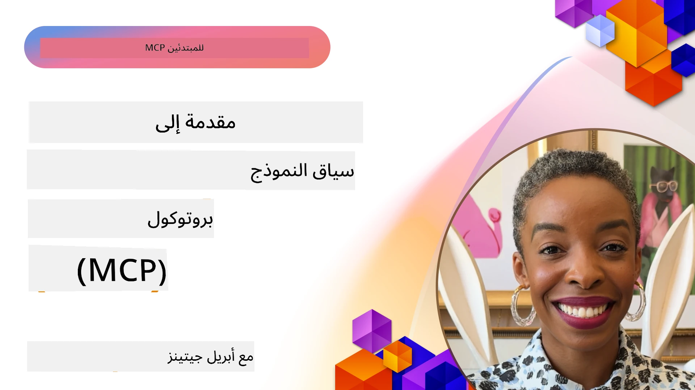
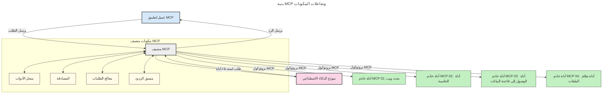
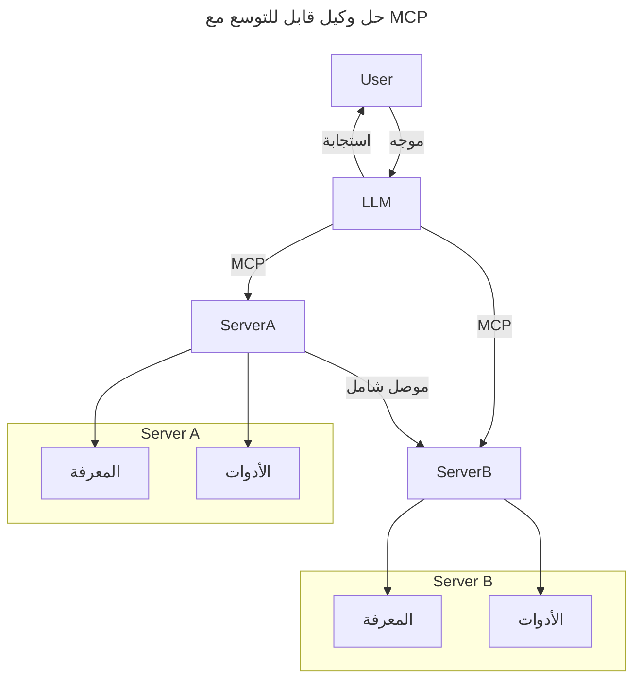
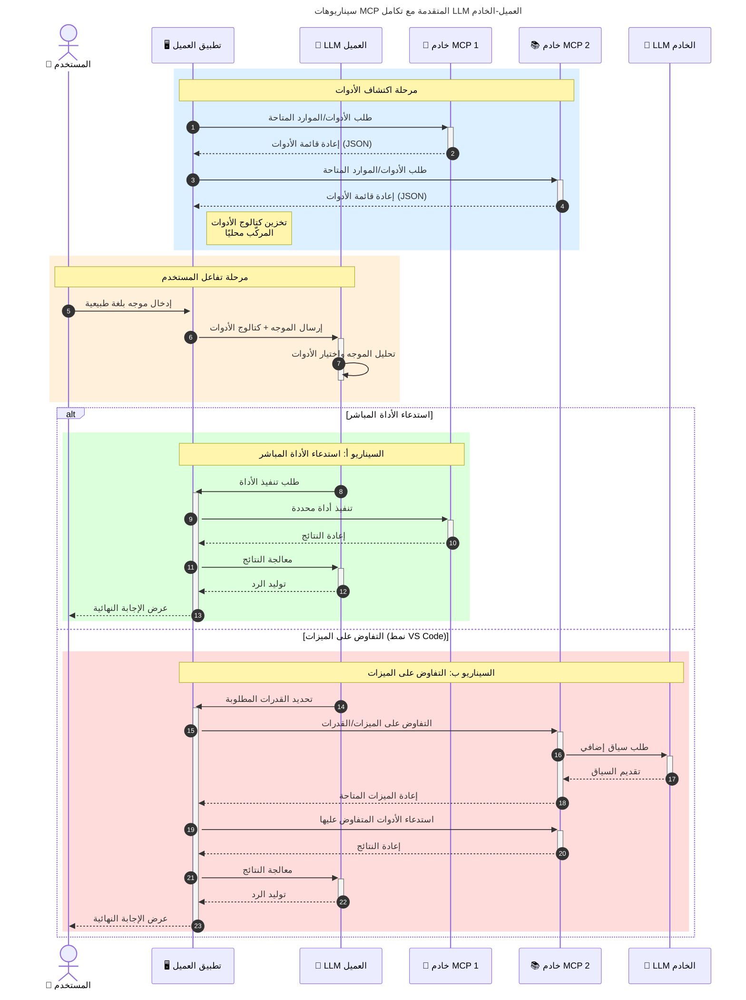

# مقدمة في بروتوكول سياق النموذج (MCP): لماذا هو مهم لتطبيقات الذكاء الاصطناعي القابلة للتوسع

_(انقر على الصورة أعلاه لمشاهدة فيديو هذا الدرس)_

تُعد تطبيقات الذكاء الاصطناعي التوليدية خطوة كبيرة إلى الأمام حيث تتيح للمستخدم غالبًا التفاعل مع التطبيق باستخدام محفزات اللغة الطبيعية. ومع ذلك، مع استثمار المزيد من الوقت والموارد في مثل هذه التطبيقات، تريد التأكد من أنه يمكنك دمج الوظائف والموارد بسهولة بطريقة تجعل من السهل التوسع، وأن تطبيقك يمكنه التعامل مع أكثر من نموذج مستخدم، ومعالجة التعقيدات المختلفة للنماذج. باختصار، بناء تطبيقات الذكاء الاصطناعي التوليدية سهل في البداية، ولكن مع نموها وتعقيدها، تحتاج إلى البدء في تحديد هيكلية ومن المحتمل أن تحتاج إلى الاعتماد على معيار لضمان بناء تطبيقاتك بطريقة متسقة. وهنا يأتي دور MCP لتنظيم الأمور وتوفير معيار.

---

## **🔍 ما هو بروتوكول سياق النموذج (MCP)؟**

بروتوكول سياق النموذج (MCP) هو **واجهة مفتوحة وموحدة** تتيح لنماذج اللغة الكبيرة (LLMs) التفاعل بسلاسة مع الأدوات الخارجية، وواجهات برمجة التطبيقات، ومصادر البيانات. يوفر هيكلية متسقة لتعزيز وظائف نموذج الذكاء الاصطناعي خارج نطاق بيانات تدريبه، مما يمكّن أنظمة الذكاء الاصطناعي الأذكى، والقابلة للتوسع، والأكثر استجابة.

---

## **🎯 لماذا تعتبر التوحيد القياسي مهمًا في الذكاء الاصطناعي**

مع تعقيد تطبيقات الذكاء الاصطناعي التوليدية، من الضروري اعتماد معايير تضمن **القابلية للتوسع، والتمديد، والصيانة،** و**تجنب التقييد بالبائعين**. يعالج MCP هذه الاحتياجات من خلال:

- توحيد تكاملات النماذج مع الأدوات
- تقليل الحلول المخصصة الهشة والمكررة
- السماح بتعايش نماذج متعددة من بائعين مختلفين ضمن نظام بيئي واحد

**ملاحظة:** بالرغم من أن MCP يُروَّج كمعيار مفتوح، لا توجد خطط لتوثيق MCP من خلال هيئات المعايير القائمة مثل IEEE أو IETF أو W3C أو ISO أو أي هيئة معايير أخرى.

---

## **📚 الأهداف التعليمية**

بحلول نهاية هذه المقالة، ستكون قادرًا على:

- تعريف **بروتوكول سياق النموذج (MCP)** وحالات استخدامه
- فهم كيف يوحد MCP الاتصالات بين النموذج والأداة
- تحديد المكونات الأساسية لهندسة MCP
- استكشاف تطبيقات MCP العملية في سياقات الشركات والتطوير

---

## **💡 لماذا يعتبر بروتوكول سياق النموذج (MCP) مغيرًا لقواعد اللعبة**

### **🔗 MCP يحل مشكلة التجزئة في تفاعلات الذكاء الاصطناعي**

قبل MCP، كان دمج النماذج مع الأدوات يتطلب:

- كود مخصص لكل زوج أداة-نموذج
- واجهات برمجة تطبيقات غير موحدة لكل بائع
- انقطاعات متكررة بسبب التحديثات
- ضعف القابلية للتوسع مع زيادة عدد الأدوات

### **✅ فوائد توحيد MCP**

| **الفائدة**               | **الوصف**                                                                     |
|---------------------------|-------------------------------------------------------------------------------|
| قابلية التشغيل البيني     | تعمل نماذج اللغة الكبيرة بسلاسة مع الأدوات عبر بائعين مختلفين                 |
| الاتساق                  | سلوك موحد عبر المنصات والأدوات                                                |
| قابلية إعادة الاستخدام    | أدوات مبنية مرة واحدة يمكن استخدامها عبر مشاريع وأنظمة متعددة                 |
| تسريع التطوير            | تقليل وقت التطوير باستخدام واجهات موحدة جاهزة للتشغيل                          |

---

## **🧱 نظرة عامة على هندسة MCP على المستوى العالي**

يتبع MCP نموذج العميل-الخادم، حيث:

- **مضيفو MCP** يديرون نماذج الذكاء الاصطناعي
- **عملاء MCP** يبدؤون الطلبات
- **خوادم MCP** تقدم السياق، والأدوات، والإمكانات

### **المكونات الرئيسية:**

- **الموارد** – بيانات ثابتة أو ديناميكية للنماذج  
- **المحفزات** – سير عمل محدد مسبقًا للتوليد الموجه  
- **الأدوات** – وظائف قابلة للتنفيذ مثل البحث، الحسابات  
- **العينة** – سلوك وكيل عبر التفاعلات التكرارية
- **الاستنباط** – طلبات مبادرة من الخادم للحصول على مدخلات المستخدم
- **الجذور** – حدود نظام الملفات للتحكم في وصول الخادم

### **هندسة البروتوكول:**

يستخدم MCP هندسة ذات طبقتين:
- **طبقة البيانات**: اتصال قائم على JSON-RPC 2.0 مع إدارة دورة حياة وأوليات
- **طبقة النقل**: قنوات اتصال STDIO (محلي) وHTTP قابلة للبث مع SSE (عن بعد)

---

## كيف تعمل خوادم MCP

تعمل خوادم MCP بالطريقة التالية:

- **تدفق الطلب:**
    1. يبدأ الطلب من قبل مستخدم نهائي أو برنامج يعمل نيابة عنه.
    2. يرسل **عميل MCP** الطلب إلى **مضيف MCP**، الذي يدير وقت تشغيل نموذج الذكاء الاصطناعي.
    3. يستقبل **نموذج الذكاء الاصطناعي** المحفز من المستخدم وقد يطلب الوصول إلى أدوات خارجية أو بيانات عبر مكالمات أداة واحدة أو أكثر.
    4. يتواصل **مضيف MCP**، وليس النموذج مباشرةً، مع **خادم (خوادم) MCP** المناسبة باستخدام البروتوكول الموحد.
- **وظائف مضيف MCP:**
    - **سجل الأدوات**: يحتفظ بفهرس الأدوات المتاحة وقدراتها.
    - **التحقق من الهوية**: يؤكد أذونات الوصول إلى الأدوات.
    - **معالج الطلبات**: يعالج طلبات الأدوات الواردة من النموذج.
    - **منسق الاستجابات**: ينظم مخرجات الأدوات بصيغة يمكن للنموذج فهمها.
- **تنفيذ خادم MCP:**
    - يقوم **مضيف MCP** بتوجيه مكالمات الأدوات إلى واحد أو أكثر من **خوادم MCP**، كل منها يعرض وظائف متخصصة (مثل البحث، الحسابات، استعلامات قواعد البيانات).
    - تنفذ **خوادم MCP** عملياتها الخاصة وترجع النتائج إلى **مضيف MCP** بصيغة متسقة.
    - يقوم **مضيف MCP** بتنسيق هذه النتائج ونقلها إلى **نموذج الذكاء الاصطناعي**.
- **إتمام الاستجابة:**
    - يدمج **نموذج الذكاء الاصطناعي** مخرجات الأدوات في استجابة نهائية.
    - يرسل **مضيف MCP** هذه الاستجابة مرة أخرى إلى **عميل MCP**، الذي يسلمها للمستخدم النهائي أو البرنامج الداعي.
    

## 👨‍💻 كيفية بناء خادم MCP (مع أمثلة)

تتيح خوادم MCP توسيع قدرات نماذج اللغة الكبيرة عبر توفير البيانات والوظائف.

هل أنت مستعد لتجربته؟ إليك حزم تطوير البرمجيات (SDKs) الخاصة بلغات محددة وأكوام تطويرية مع أمثلة لإنشاء خوادم MCP بسيطة بلغات/أكوام مختلفة:

- **Python SDK**: https://github.com/modelcontextprotocol/python-sdk

- **TypeScript SDK**: https://github.com/modelcontextprotocol/typescript-sdk

- **Java SDK**: https://github.com/modelcontextprotocol/java-sdk

- **C#/.NET SDK**: https://github.com/modelcontextprotocol/csharp-sdk

## 🌍 حالات الاستخدام الواقعية لـ MCP

يتيح MCP مجموعة واسعة من التطبيقات عبر توسيع قدرات الذكاء الاصطناعي:

| **التطبيق**                 | **الوصف**                                                                     |
|-----------------------------|-------------------------------------------------------------------------------|
| دمج بيانات الشركات          | ربط نماذج اللغة الكبيرة بقاعدة بيانات، أنظمة إدارة علاقات العملاء، أو أدوات داخلية |
| أنظمة الذكاء الاصطناعي الوكيلة | تمكين وكلاء مستقلين مع الوصول إلى الأدوات وسير عمل اتخاذ القرار              |
| التطبيقات متعددة الوسائط    | دمج أدوات نص، صورة، وصوت ضمن تطبيق ذكاء اصطناعي موحد واحد                    |
| دمج البيانات في الوقت الحقيقي | جلب البيانات الحية إلى تفاعلات الذكاء الاصطناعي لمخرجات أدق وأحدث           |

### 🧠 MCP = المعيار الشامل لتفاعلات الذكاء الاصطناعي

يعمل بروتوكول سياق النموذج (MCP) كمعيار شامل لتفاعلات الذكاء الاصطناعي، تمامًا كما وحد USB-C الاتصالات المادية للأجهزة. في عالم الذكاء الاصطناعي، يوفر MCP واجهة متسقة تتيح للنماذج (العملاء) الاندماج بسلاسة مع الأدوات الخارجية ومزودي البيانات (الخوادم). هذا يلغي الحاجة إلى بروتوكولات متنوعة ومخصصة لكل واجهة برمجة تطبيقات أو مصدر بيانات.

تتبع الأداة المتوافقة مع MCP (المشار إليها كخادم MCP) معيارًا موحدًا. يمكن لهذه الخوادم سرد الأدوات أو الإجراءات التي تقدمها وتنفيذ تلك الإجراءات عند طلبها من وكلاء الذكاء الاصطناعي. تتيح منصات وكلاء الذكاء الاصطناعي الداعمة لـ MCP اكتشاف الأدوات المتاحة من الخوادم واستدعاؤها من خلال هذا البروتوكول الموحد.

### 💡 تسهيل الوصول إلى المعرفة

بعيدًا عن توفير الأدوات، يسهل MCP أيضًا الوصول إلى المعرفة. فهو يمكّن التطبيقات من تقديم السياق لنماذج اللغة الكبيرة (LLMs) من خلال ربطها بمصادر بيانات متعددة. على سبيل المثال، قد يمثل خادم MCP مستودع وثائق شركة، مما يسمح للوكلاء باسترداد معلومات ذات صلة عند الطلب. قد يتولى خادم آخر إجراءات محددة مثل إرسال البريد الإلكتروني أو تحديث السجلات. من منظور الوكيل، هذه مجرد أدوات يمكنه استخدامها—بعض الأدوات تعيد بيانات (سياق المعرفة)، وأخرى تنفذ إجراءات. يدير MCP كليهما بكفاءة.

يتعلم الوكيل المتصل بخادم MCP تلقائيًا القدرات المتاحة على الخادم والبيانات القابلة للوصول عبر تنسيق موحد. يتيح هذا التوحيد توفر الأدوات الديناميكي. على سبيل المثال، عند إضافة خادم MCP جديد إلى نظام الوكيل، تصبح وظائفه قابلة للاستخدام فورًا دون الحاجة لمزيد من تخصيص تعليمات الوكيل.

يتماشى هذا التكامل المبسط مع التدفق الموضح في الرسم البياني التالي، حيث توفر الخوادم كل من الأدوات والمعرفة، مما يضمن تعاونًا سلسًا بين الأنظمة.

### 👉 مثال: حل وكيل قابل للتوسع

تمكن الموصل الشامل خوادم MCP من التواصل ومشاركة القدرات مع بعضها البعض، مما يسمح لـ ServerA بتفويض المهام إلى ServerB أو الوصول إلى أدواته ومعرفته. هذا يوزع الأدوات والبيانات عبر الخوادم، داعمًا هندسة وكلاء قابلة للتوسع والوحدات. ولأن MCP يوحد عرض الأدوات، يمكن للوكلاء اكتشاف وتوجيه الطلبات بين الخوادم ديناميكيًا دون دمج ثابت مبرمج مسبقًا.

توحد الأدوات والمعرفة: يمكن الوصول إلى الأدوات والبيانات عبر الخوادم، مما يتيح هندسة وكلاء أكثر قابلية للتوسع والوحدات.

### 🔄 سيناريوهات MCP المتقدمة مع دمج نماذج اللغة الكبيرة على جانب العميل

بعيدًا عن هندسة MCP الأساسية، هناك سيناريوهات متقدمة حيث يحتوي كل من العميل والخادم على نماذج لغة كبيرة، مما يتيح تفاعلات أكثر تعقيدًا. في الرسم البياني التالي، يمكن أن يكون **تطبيق العميل** بيئة تطوير متكاملة مع عدد من أدوات MCP متاحة للاستخدام من قبل نموذج اللغة الكبير:

## 🔐 فوائد عملية لـ MCP

فيما يلي الفوائد العملية لاستخدام MCP:

- **تحديث المعلومات**: يمكن للنماذج الوصول إلى معلومات محدثة تتجاوز بيانات تدريبها
- **تمديد القدرات**: يمكن للنماذج الاستفادة من أدوات متخصصة لمهام لم يتم تدريبها عليها
- **تقليل التوهمات**: توفر مصادر البيانات الخارجية أساسًا واقعيًا للحقائق
- **الخصوصية**: يمكن أن تبقى البيانات الحساسة داخل بيئات آمنة بدلاً من تضمينها في المحفزات

## 📌 الملاحظات الرئيسية

فيما يلي الملاحظات الرئيسية لاستخدام MCP:

- **MCP** يوحد كيفية تفاعل نماذج الذكاء الاصطناعي مع الأدوات والبيانات
- يعزز **التمديد، الاتساق، وقابلية التشغيل البيني**
- يساعد MCP على **تقليل وقت التطوير، تحسين الموثوقية، وتمديد قدرات النموذج**
- تتيح هندسة العميل-الخادم **تطبيقات ذكاء اصطناعي مرنة وقابلة للتمديد**

## 🧠 تمرين

فكر في تطبيق ذكاء اصطناعي تهتم ببنائه.

- ما هي **الأدوات أو البيانات الخارجية** التي يمكن أن تعزز قدراته؟
- كيف يمكن أن يجعل MCP التكامل **أبسط وأكثر موثوقية**؟

## مصادر إضافية

- [مستودع MCP على GitHub](https://github.com/modelcontextprotocol)

## ما التالي

التالي: [الفصل 1: المفاهيم الأساسية](../01-CoreConcepts/README.md)

---

<!-- CO-OP TRANSLATOR DISCLAIMER START -->
**تنويه**:  
تم ترجمة هذا المستند باستخدام خدمة الترجمة الآلية [Co-op Translator](https://github.com/Azure/co-op-translator). على الرغم من أننا نسعى لضمان الدقة، يُرجى العلم أن الترجمات الآلية قد تحتوي على أخطاء أو عدم دقة. يجب اعتبار النسخة الأصلية للمستند بلغته الأم المصدر المعتمد. للمعلومات المهمة والحاسمة، يُنصح بالترجمة البشرية الاحترافية. نحن غير مسؤولين عن أي سوء فهم أو تفسير خاطئ ناتج عن استخدام هذه الترجمة.
<!-- CO-OP TRANSLATOR DISCLAIMER END -->