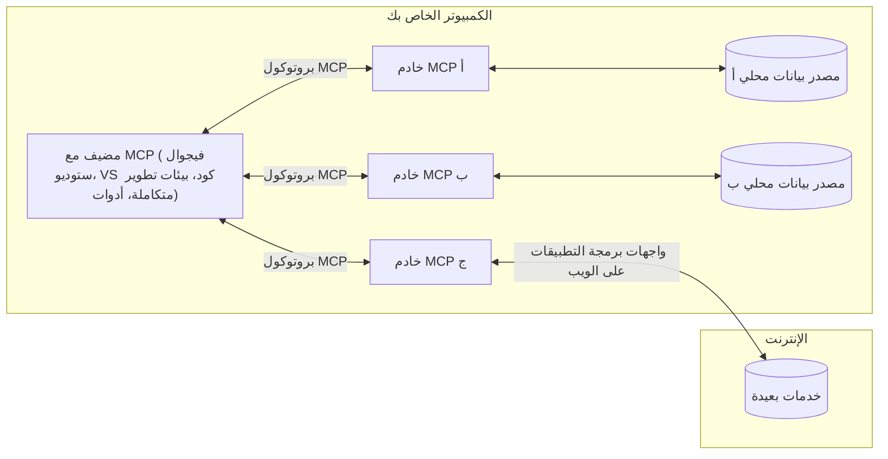

# مفاهيم أساسية في MCP: إتقان بروتوكول سياق النموذج لتكامل الذكاء الاصطناعي

[](https://youtu.be/earDzWGtE84)

_(انقر فوق الصورة أعلاه لمشاهدة فيديو هذا الدرس)_

يعد [بروتوكول سياق النموذج (MCP)](https://github.com/modelcontextprotocol) إطارًا قويًا وموحدًا يعمل على تحسين الاتصال بين نماذج اللغة الكبيرة (LLMs) والأدوات والتطبيقات ومصادر البيانات الخارجية.  
سيرشدك هذا الدليل عبر المفاهيم الأساسية لـ MCP. ستتعلم عن هندسة العميل-الخادم الخاصة به، والمكونات الأساسية، وآليات التواصل، وأفضل ممارسات التنفيذ.

- **موافقة المستخدم الصريحة**: كل الوصول إلى البيانات والعمليات تتطلب موافقة صريحة من المستخدم قبل التنفيذ. يجب أن يفهم المستخدمون بوضوح ما هي البيانات التي سيتم الوصول إليها وما هي الإجراءات التي سيتم تنفيذها، مع تحكم دقيق في الأذونات والتفويضات.

- **حماية خصوصية البيانات**: تُعرض بيانات المستخدم فقط بعد موافقة صريحة ويجب حمايتها بواسطة ضوابط وصول قوية طوال دورة التفاعل بأكملها. يجب أن تمنع عمليات التنفيذ نقل البيانات غير المصرح بها وتحافظ على حدود خصوصية صارمة.

- **سلامة تنفيذ الأدوات**: تتطلب كل استدعاء أداة موافقة صريحة من المستخدم مع فهم واضح لوظائف الأداة ومعلماتها وتأثيرها المحتمل. يجب أن تمنع حدود الأمان المتينة التنفيذ غير الآمن أو غير المقصود أو الخبيث للأدوات.

- **أمان طبقة النقل**: يجب أن تستخدم جميع قنوات الاتصال آليات تشفير ومصادقة مناسبة. يجب أن تنفذ الاتصالات عن بُعد بروتوكولات نقل آمنة وإدارة صحيحة للاعتمادات.

#### إرشادات التنفيذ:

- **إدارة الأذونات**: نفذ أنظمة أذونات دقيقة تسمح للمستخدمين بالتحكم في الخوادم والأدوات والموارد التي يمكن الوصول إليها  
- **المصادقة والتفويض**: استخدم طرق مصادقة آمنة (OAuth، مفاتيح API) مع إدارة صحيحة للرموز وانتهائها  
- **التحقق من المُدخلات**: تحقق من صحة كل المعلمات ومدخلات البيانات وفقًا للمخططات المحددة لمنع هجمات الحقن  
- **تسجيل التدقيق**: احتفظ بسجلات شاملة لجميع العمليات لمراقبة الأمان والامتثال

## نظرة عامة

يستكشف هذا الدرس الهندسة الأساسية والمكونات التي تشكل نظام بروتوكول سياق النموذج (MCP). ستتعرف على هيكلية العميل-الخادم، والمكونات الرئيسية، وآليات الاتصال التي تدعم تفاعلات MCP.

## الأهداف التعليمية الرئيسية

بنهاية هذا الدرس، سوف:

- تفهم هيكلية العميل-الخادم في MCP.  
- تحدد أدوار ومسؤوليات المضيفين والعملاء والخوادم.  
- تحلل الميزات الأساسية التي تجعل MCP طبقة تكامل مرنة.  
- تتعلم كيف تتدفق المعلومات داخل نظام MCP.  
- تكتسب معرفة عملية من خلال أمثلة برمجية بـ .NET، وجافا، وبايثون، وجافاسكريبت.

## هندسة MCP: نظرة أعمق

يبنى نظام MCP على نموذج العميل-الخادم. يسمح هذا الهيكل المعياري لتطبيقات الذكاء الاصطناعي بالتفاعل مع الأدوات وقواعد البيانات وواجهات برمجة التطبيقات والموارد السياقية بكفاءة. دعنا نفصل هذه الهندسة إلى مكوناتها الأساسية.

في جوهره، يتبع MCP هندسة عميل-خادم حيث يمكن لتطبيق مضيف الاتصال بعدة خوادم:


- **مضيفو MCP**: برامج مثل VSCode، وClaude Desktop، وبيئات التطوير المتكاملة، أو أدوات الذكاء الاصطناعي التي ترغب في الوصول إلى البيانات عبر MCP  
- **عملاء MCP**: عملاء البروتوكول الذين يحافظون على اتصالات 1:1 مع الخوادم  
- **خوادم MCP**: برامج خفيفة الوزن تعرض وظائف محددة عبر بروتوكول سياق النموذج الموحد  
- **مصادر البيانات المحلية**: ملفات جهازك وقواعد البيانات والخدمات التي يمكن لخوادم MCP الوصول إليها بأمان  
- **الخدمات البعيدة**: أنظمة خارجية متاحة عبر الإنترنت يمكن لخوادم MCP الاتصال بها عبر واجهات برمجة التطبيقات.

بروتوكول MCP معيار متطور يستخدم إصدارًا يعتمد على التاريخ (بتنسيق YYYY-MM-DD). إصدار البروتوكول الحالي هو **2025-11-25**. يمكنك الاطلاع على آخر التحديثات في [مواصفة البروتوكول](https://modelcontextprotocol.io/specification/2025-11-25/)

### 1. المضيفون

في بروتوكول سياق النموذج (MCP)، يُعتبر **المضيفون** تطبيقات الذكاء الاصطناعي التي تعمل كواجهة أساسية يتفاعل من خلالها المستخدمون مع البروتوكول. يقوم المضيفون بتنسيق وإدارة الاتصالات مع عدة خوادم MCP عن طريق إنشاء عملاء MCP مخصصين لكل اتصال بالخادم. من أمثلة المضيفين:

- **تطبيقات الذكاء الاصطناعي**: Claude Desktop، Visual Studio Code، Claude Code  
- **بيئات التطوير**: بيئات التطوير المتكاملة ومحررات الشيفرة التي تدعم تكامل MCP  
- **التطبيقات المخصصة**: وكلاء وأدوات ذكاء اصطناعي مصممة خصيصًا

**المضيفون** هم تطبيقات تنسق تفاعلات نماذج الذكاء الاصطناعي. يقومون بـ:

- **تنسيق نماذج الذكاء الاصطناعي**: تنفيذ أو التفاعل مع نماذج اللغة الكبيرة لإنتاج الاستجابات وتنسيق سير العمل  
- **إدارة اتصالات العملاء**: إنشاء والحفاظ على عميل MCP واحد لكل اتصال بخادم MCP  
- **التحكم في واجهة المستخدم**: التعامل مع تدفق المحادثة، وتفاعل المستخدم، وعرض الاستجابات  
- **فرض الأمان**: التحكم في الأذونات، وقيود الأمان، والمصادقة  
- **معالجة موافقة المستخدم**: إدارة موافقات المستخدم لمشاركة البيانات وتنفيذ الأدوات

### 2. العملاء

**العملاء** مكونات أساسية تحافظ على اتصالات مخصصة 1:1 بين المضيفين وخوادم MCP. يتم إنشاء كل عميل MCP من قبل المضيف للاتصال بخادم MCP محدد، مما يضمن قنوات اتصال منظمة وآمنة. تتيح تعدد العملاء للمضيفين الاتصال بعدة خوادم في وقت واحد.

**العملاء** هم مكونات الربط داخل التطبيق المضيف. يقومون بـ:

- **الاتصال بالبروتوكول**: إرسال طلبات JSON-RPC 2.0 إلى الخوادم مع مطالبات وتعليمات  
- **التفاوض على القدرات**: التفاوض على الميزات المدعومة وإصدارات البروتوكول مع الخوادم أثناء التهيئة  
- **تنفيذ الأدوات**: إدارة طلبات تنفيذ الأدوات من النماذج ومعالجة الردود  
- **التحديثات في الوقت الفعلي**: التعامل مع الإشعارات والتحديثات الفورية من الخوادم  
- **معالجة الاستجابات**: معالجة وتنسيق ردود الخادم لعرضها على المستخدمين

### 3. الخوادم

**الخوادم** هي برامج توفر السياق والأدوات والقدرات لعملاء MCP. يمكن تشغيلها محليًا (نفس جهاز المضيف) أو عن بُعد (على منصات خارجية)، وهي مسؤولة عن معالجة طلبات العملاء وتوفير ردود منظمة. تعرض الخوادم وظائف محددة عبر بروتوكول سياق النموذج الموحد.

**الخوادم** هي خدمات توفر السياق والقدرات. تقوم بـ:

- **تسجيل الميزات**: تسجيل وعرض البنى الأولية المتاحة (الموارد، المطالبات، الأدوات) للعملاء  
- **معالجة الطلبات**: استقبال وتنفيذ استدعاءات الأدوات، طلبات الموارد، وطلبات المطالبات من العملاء  
- **توفير السياق**: تقديم معلومات سياقية وبيانات لتعزيز استجابات النموذج  
- **إدارة الحالة**: الحفاظ على حالة الجلسة والتعامل مع التفاعلات الحالة حسب الحاجة  
- **الإشعارات في الوقت الحقيقي**: إرسال إشعارات حول تغييرات القدرات وتحديثاتها إلى العملاء المتصلين

يمكن لأي شخص تطوير خوادم لتوسيع قدرات النموذج بوظائف متخصصة، وتدعم سيناريوهات النشر المحلية والبعيدة.

### 4. البنى الأولية للخادم

توفر خوادم MCP ثلاث **بنى أولية** أساسية تعرف اللبنات الأساسية للتفاعلات الغنية بين العملاء والمضيفين ونماذج اللغة. تحدد هذه البنى الأنواع المختلفة من المعلومات السياقية والإجراءات المتاحة عبر البروتوكول.

يمكن لخوادم MCP عرض أي تركيبة من البنى الأساسية الثلاث التالية:

#### الموارد

**الموارد** هي مصادر بيانات توفر معلومات سياقية لتطبيقات الذكاء الاصطناعي. تمثل محتوى ثابتًا أو ديناميكيًا يمكنه تعزيز فهم النموذج واتخاذ القرار:

- **بيانات سياقية**: معلومات منظمة وسياق لاستهلاك نموذج الذكاء الاصطناعي  
- **قواعد المعرفة**: مستودعات الوثائق، المقالات، الأدلة، والأبحاث  
- **مصادر البيانات المحلية**: ملفات، قواعد بيانات، ومعلومات النظام المحلية  
- **بيانات خارجية**: ردود واجهات برمجة التطبيقات، خدمات الويب، وبيانات النظام البعيدة  
- **المحتوى الديناميكي**: بيانات في الوقت الحقيقي تتحدث استنادًا إلى الظروف الخارجية

يتم تحديد الموارد بواسطة معرفات URI وتدعم الاكتشاف عبر طرق `resources/list` والاسترجاع عبر `resources/read`:

```text
file://documents/project-spec.md
database://production/users/schema
api://weather/current
```

#### المطالبات

**المطالبات** هي قوالب قابلة لإعادة الاستخدام تساعد في هيكلة التفاعلات مع نماذج اللغة. توفر أنماط تفاعل موحدة وسير عمل قالبية:

- **تفاعلات قائمة على القوالب**: رسائل مُهيكلة مسبقًا وبدايات محادثة  
- **قوالب سير العمل**: تسلسلات موحدة للمهام والتفاعلات الشائعة  
- **أمثلة قليلة التعليمات**: قوالب قائمة على أمثلة لتعليم النموذج  
- **مطالبات النظام**: مطالبات أساسية تحدد سلوك وسياق النموذج  
- **قوالب ديناميكية**: مطالبات قابلة للمعلمات تتكيف مع سياقات محددة

تدعم المطالبات استبدال المتغيرات ويمكن اكتشافها عبر `prompts/list` واسترجاعها باستخدام `prompts/get`:

```markdown
Generate a {{task_type}} for {{product}} targeting {{audience}} with the following requirements: {{requirements}}
```

#### الأدوات

**الأدوات** هي وظائف قابلة للتنفيذ يمكن لنماذج الذكاء الاصطناعي استدعاؤها لأداء إجراءات محددة. تمثل "الأفعال" في نظام MCP، مما يمكن النماذج من التفاعل مع الأنظمة الخارجية:

- **وظائف قابلة للتنفيذ**: عمليات منفصلة يمكن للنماذج استدعاؤها بمعلمات محددة  
- **توافق مع الأنظمة الخارجية**: استدعاءات API، استعلامات قاعدة البيانات، عمليات الملفات، الحسابات  
- **هوية فريدة**: لكل أداة اسم مميز، وصف، ومخطط معلمات خاص  
- **إدخال/إخراج منظم**: تقبل الأدوات معلمات مصدقة وتُرجع استجابات منظمة وذات نوع معين  
- **قدرات تنفيذ الأفعال**: تمكّن النماذج من أداء أفعال في العالم الحقيقي واسترجاع بيانات حية

تعرف الأدوات بمخطط JSON للتحقق من المعلمات وتُكتشف عبر `tools/list` وتُنفذ عن طريق `tools/call`. يمكن للأدوات أيضًا تضمين **أيقونات** كبيانات وصفية إضافية لتحسين واجهة المستخدم.

**تعليقات الأدوات**: تدعم الأدوات تعليقات سلوكية (مثل `readOnlyHint`، `destructiveHint`) التي تصف ما إذا كانت الأداة للقراءة فقط أو مدمرة، مما يساعد العملاء على اتخاذ قرارات مستنيرة بشأن تنفيذ الأداة.

مثال على تعريف أداة:

```typescript
server.tool(
  "search_products", 
  {
    query: z.string().describe("Search query for products"),
    category: z.string().optional().describe("Product category filter"),
    max_results: z.number().default(10).describe("Maximum results to return")
  }, 
  async (params) => {
    // نفذ البحث وأعد النتائج بشكل منظم
    return await productService.search(params);
  }
);
```

## البنى الأولية للعميل

في بروتوكول سياق النموذج (MCP)، يمكن لـ **العملاء** عرض بني أولية تتيح للخوادم طلب قدرات إضافية من تطبيق المضيف. تسمح هذه البنى الطرفية للعميل بتنفيذ خوادم أكثر تفاعلية ترتبط بقدرات نموذج الذكاء الاصطناعي وتفاعل المستخدم.

### أخذ العينات

يتيح **أخذ العينات** للخوادم طلب استكمالات نموذج اللغة من تطبيق الذكاء الاصطناعي الخاص بالعميل. تمكن هذه البنية الخوادم من الوصول إلى قدرات نماذج اللغة الكبيرة دون تضمين تبعيات نموذجها الخاص:

- **وصول مستقل عن النموذج**: يمكن للخوادم طلب استكمالات بدون تضمين SDK لنماذج اللغة الكبيرة أو إدارة الوصول للنموذج  
- **ذكاء اصطناعي بمبادرة الخادم**: يمكّن الخوادم من إنشاء المحتوى بشكل مستقل باستخدام نموذج الذكاء الاصطناعي الخاص بالعميل  
- **تفاعلات نماذج لغوية متكررة**: تدعم سيناريوهات معقدة حيث تحتاج الخوادم لمساعدة الذكاء الاصطناعي في المعالجة  
- **إنشاء محتوى ديناميكي**: يسمح للخوادم بإنشاء استجابات سياقية باستخدام نموذج المضيف  
- **دعم استدعاء الأدوات**: يمكن للخوادم تضمين معلمات `tools` و`toolChoice` لتمكين نموذج العميل من استدعاء الأدوات أثناء أخذ العينات

يتم بدء أخذ العينات عبر الطريقة `sampling/complete`، حيث ترسل الخوادم طلبات استكمال إلى العملاء.

### الجذور

تزود **الجذور** وسيلة موحدة للعملاء لعرض حدود نظام الملفات للخوادم، مما يساعد الخوادم على فهم المجلدات والملفات التي يمكنها الوصول إليها:

- **حدود نظام الملفات**: تحديد حدود الأماكن التي يمكن للخوادم العمل ضمنها في نظام الملفات  
- **ضوابط الوصول**: مساعدة الخوادم على فهم المجلدات والملفات التي لديها إذن الوصول إليها  
- **تحديثات ديناميكية**: يمكن للعملاء إعلام الخوادم عند تغير قائمة الجذور  
- **تحديد عبر URI**: تستخدم الجذور معرفات URI من نوع `file://` لتحديد المجلدات والملفات المتاحة

تُكتشف الجذور عبر الطريقة `roots/list`، مع إرسال العملاء إشعارات `notifications/roots/list_changed` عند تغيير الجذور.

### الاستقصاء  

يتيح **الاستقصاء** للخوادم طلب معلومات إضافية أو تأكيد من المستخدمين عبر واجهة العميل:

- **طلبات إدخال المستخدم**: يمكن للخوادم طلب معلومات إضافية عند الحاجة لتنفيذ الأدوات  
- **حوارات التأكيد**: طلب موافقة المستخدم للعمليات الحساسة أو ذات التأثير  
- **سير عمل تفاعلي**: تمكن الخوادم من إنشاء تفاعلات خطوة بخطوة مع المستخدم  
- **جمع معلمات ديناميكي**: جمع المعلمات الناقصة أو الاختيارية أثناء تنفيذ الأداة

تتم طلبات الاستقصاء باستخدام الطريقة `elicitation/request` لجمع إدخال المستخدم عبر واجهة العميل.

**وضع الاستقصاء عبر URL**: يمكن للخوادم أيضًا طلب تفاعلات مستخدم عبر عنوان ويب، مما يسمح بتوجيه المستخدمين إلى صفحات ويب خارجية للمصادقة، أو التأكيد، أو إدخال البيانات.

### التسجيل

يتيح **التسجيل** للخوادم إرسال رسائل سجل منظمة إلى العملاء لأغراض التصحيح والمراقبة ورؤية العمليات:

- **دعم التصحيح**: تمكين الخوادم من توفير سجلات تنفيذ مفصلة للتصحيح  
- **مراقبة التشغيل**: إرسال تحديثات الحالة ومقاييس الأداء إلى العملاء  
- **الإبلاغ عن الأخطاء**: توفير سياق أخطاء مفصل ومعلومات تشخيصية  
- **سجلات التدقيق**: إنشاء سجلات شاملة لعمليات وقرارات الخادم

ترسل رسائل التسجيل إلى العملاء لتوفير الشفافية في عمليات الخادم وتسهيل التصحيح.

## تدفق المعلومات في MCP

يحدد بروتوكول سياق النموذج (MCP) تدفقًا منظمًا للمعلومات بين المضيفين والعملاء والخوادم والنماذج. يساعد فهم هذا التدفق في توضيح كيفية معالجة طلبات المستخدم وكيفية دمج الأدوات والبيانات الخارجية في استجابات النموذج.

- **يبدأ المضيف الاتصال**  
  ينشئ تطبيق المضيف (مثل بيئة تطوير متكاملة أو واجهة دردشة) اتصالًا بخادم MCP، عادة عبر STDIO أو WebSocket أو وسيلة نقل مدعومة أخرى.

- **التفاوض على القدرات**  
  يتبادل العميل (المدمج في المضيف) والخادم معلومات حول الميزات المدعومة، والأدوات، والموارد، وإصدارات البروتوكول. يضمن هذا أن يفهم كلا الجانبين القدرات المتاحة للجلسة.

- **طلب المستخدم**  
  يتفاعل المستخدم مع المضيف (مثل إدخال مطالبة أو أمر). يجمع المضيف هذا الإدخال ويمرره إلى العميل للمعالجة.

- **استخدام مورد أو أداة**  
  - قد يطلب العميل المزيد من السياق أو الموارد من الخادم (مثل الملفات، أو إدخالات قاعدة البيانات، أو مقالات قاعدة المعرفة) لتعزيز فهم النموذج.  
  - إذا قرر النموذج الحاجة إلى أداة (مثل جلب بيانات، إجراء حساب، أو استدعاء API)، يرسل العميل طلب استدعاء أداة إلى الخادم، محددًا اسم الأداة والمعلمات.

- **تنفيذ الخادم**  

يتلقى الخادم طلب المورد أو الأداة، وينفذ العمليات اللازمة (مثل تشغيل دالة، استعلام قاعدة بيانات، أو استرجاع ملف)، ويعيد النتائج إلى العميل بتنسيق منظم.

- **توليد الاستجابة**  
  يدمج العميل استجابات الخادم (بيانات الموارد، مخرجات الأدوات، إلخ) في التفاعل الجاري مع النموذج. يستخدم النموذج هذه المعلومات لتوليد استجابة شاملة وذات صلة بالسياق.

- **عرض النتيجة**  
  يستلم المضيف المخرجات النهائية من العميل ويعرضها للمستخدم، غالباً بما يشمل النص المولد من النموذج وأي نتائج من تنفيذ الأدوات أو استعلامات الموارد.

يُتيح هذا التدفق لـ MCP دعم تطبيقات ذكاء اصطناعي متقدمة، تفاعلية، وواعية بالسياق من خلال ربط النماذج بسلاسة مع الأدوات والبيانات الخارجية.

## هيكلية وبُنى البروتوكول

يتألف MCP من طبقتين هكليتين مميزتين تعملان سوياً لتوفير إطار تواصل متكامل:

### طبقة البيانات

تطبق **طبقة البيانات** البروتوكول الأساسي MCP باستخدام **JSON-RPC 2.0** كأساس لها. تعرف هذه الطبقة هيكل الرسالة، دلالاتها، وأنماط التفاعل:

#### المكونات الأساسية:

- **بروتوكول JSON-RPC 2.0**: يستخدم كل التواصل صيغة رسائل JSON-RPC 2.0 المعيارية للمكالمات، الاستجابات، والإشعارات
- **إدارة دورة الحياة**: تعالج تهيئة الاتصال، التفاوض على القدرات، وإنهاء الجلسة بين العملاء والخوادم
- **أساسيات الخادم**: تمكّن الخوادم من تقديم وظائف أساسية عبر الأدوات، الموارد، والاستدعاءات
- **أساسيات العميل**: تمكّن الخوادم من طلب عينات من نماذج اللغة الكبيرة، إثارة إدخال المستخدم، وإرسال سجلات
- **الإشعارات في الوقت الفعلي**: تدعم الإشعارات غير المتزامنة للتحديثات الديناميكية دون الاستطلاع المتكرر

#### الميزات الرئيسية:

- **تفاوض إصدار البروتوكول**: يستخدم توقيتاً قائماً على التاريخ (سنة-شهر-يوم) لضمان التوافق
- **اكتشاف القدرات**: يتبادل العملاء والخوادم معلومات الميزات المدعومة أثناء التهيئة
- **الجلسات ذات الحالة**: يحافظ على حالة الاتصال عبر تفاعلات متعددة لاستمرارية السياق

### طبقة النقل

تدير **طبقة النقل** قنوات الاتصال، تأطير الرسائل، والمصادقة بين المشاركين في MCP:

#### آليات النقل المدعومة:

1. **نقل STDIO**:
   - يستخدم تدفقات الإدخال/الإخراج القياسية لاتصال العملية المباشر
   - مثالي للعمليات المحلية على نفس الجهاز بدون حمل شبكة
   - مستخدم شائع في تطبيقات خادم MCP المحلية

2. **نقل HTTP القابل للبث**:
   - يستخدم HTTP POST لرسائل العميل إلى الخادم  
   - خيارات أحداث مرسلة من الخادم (SSE) للبث من الخادم إلى العميل
   - يتيح التواصل مع الخوادم البعيدة عبر الشبكات
   - يدعم المصادقة HTTP القياسية (رموز الحامل، مفاتيح API، رؤوس مخصصة)
   - يوصي MCP باستخدام OAuth لمصادقة آمنة تعتمد على الرموز

#### تجريد النقل:

تجرد طبقة النقل تفاصيل الاتصال عن طبقة البيانات، مما يتيح استخدام نفس صيغة الرسائل JSON-RPC 2.0 عبر جميع آليات النقل. يسمح هذا التجريد للتطبيقات بالتبديل بين الخوادم المحلية والبعيدة بسلاسة.

### اعتبارات الأمان

يجب أن تلتزم تطبيقات MCP بعدة مبادئ أمنية حاسمة لضمان تفاعل آمن وموثوق عبر جميع عمليات البروتوكول:

- **موافقة المستخدم والتحكم**: يجب أن يمنح المستخدمون موافقة صريحة قبل الوصول إلى أي بيانات أو تنفيذ أي عمليات. يجب أن يكون لديهم تحكم واضح فيما يتم مشاركته من بيانات وأي الإجراءات المصرح بها، مع واجهات مستخدم بديهية لمراجعة واعتماد الأنشطة.

- **خصوصية البيانات**: لا يجوز الكشف عن بيانات المستخدم إلا بموافقة صريحة ويجب حمايتها بضوابط وصول مناسبة. يجب على تطبيقات MCP حماية البيانات من الإرسال غير المصرح به وضمان حفظ الخصوصية خلال جميع التفاعلات.

- **أمان الأدوات**: قبل استدعاء أي أداة، مطلوب موافقة صريحة من المستخدم. يجب أن يكون لدى المستخدمين فهم واضح لوظائف كل أداة، وفرض حدود أمنية قوية لمنع تنفيذ أدوات غير مقصود أو غير آمن.

باتباع هذه المبادئ الأمنية، يضمن MCP ثقة المستخدم، خصوصيته، وسلامته عبر جميع تفاعلات البروتوكول مع تمكين تكاملات قوية للذكاء الاصطناعي.

## أمثلة على الشيفرة: المكونات الرئيسية

فيما يلي أمثلة برمجية بعدة لغات شائعة توضح كيفية تنفيذ مكونات خادم MCP الرئيسية والأدوات.

### مثال .NET: إنشاء خادم MCP بسيط مع أدوات

هنا مثال عملي بلغة .NET يوضح كيفية تنفيذ خادم MCP بسيط بأدوات مخصصة. يعرض هذا المثال كيفية تعريف الأدوات وتسجيلها، التعامل مع الطلبات، وربط الخادم باستخدام بروتوكول سياق النموذج.

```csharp
using System;
using System.Threading.Tasks;
using ModelContextProtocol.Server;
using ModelContextProtocol.Server.Transport;
using ModelContextProtocol.Server.Tools;

public class WeatherServer
{
    public static async Task Main(string[] args)
    {
        // Create an MCP server
        var server = new McpServer(
            name: "Weather MCP Server",
            version: "1.0.0"
        );
        
        // Register our custom weather tool
        server.AddTool<string, WeatherData>("weatherTool", 
            description: "Gets current weather for a location",
            execute: async (location) => {
                // Call weather API (simplified)
                var weatherData = await GetWeatherDataAsync(location);
                return weatherData;
            });
        
        // Connect the server using stdio transport
        var transport = new StdioServerTransport();
        await server.ConnectAsync(transport);
        
        Console.WriteLine("Weather MCP Server started");
        
        // Keep the server running until process is terminated
        await Task.Delay(-1);
    }
    
    private static async Task<WeatherData> GetWeatherDataAsync(string location)
    {
        // This would normally call a weather API
        // Simplified for demonstration
        await Task.Delay(100); // Simulate API call
        return new WeatherData { 
            Temperature = 72.5,
            Conditions = "Sunny",
            Location = location
        };
    }
}

public class WeatherData
{
    public double Temperature { get; set; }
    public string Conditions { get; set; }
    public string Location { get; set; }
}
```

### مثال جافا: مكونات خادم MCP

يُظهر هذا المثال نفس تسجيل الأدوات وخادم MCP كما في مثال .NET أعلاه، لكن مُنفذ بلغة جافا.

```java
import io.modelcontextprotocol.server.McpServer;
import io.modelcontextprotocol.server.McpToolDefinition;
import io.modelcontextprotocol.server.transport.StdioServerTransport;
import io.modelcontextprotocol.server.tool.ToolExecutionContext;
import io.modelcontextprotocol.server.tool.ToolResponse;

public class WeatherMcpServer {
    public static void main(String[] args) throws Exception {
        // إنشاء خادم MCP
        McpServer server = McpServer.builder()
            .name("Weather MCP Server")
            .version("1.0.0")
            .build();
            
        // تسجيل أداة الطقس
        server.registerTool(McpToolDefinition.builder("weatherTool")
            .description("Gets current weather for a location")
            .parameter("location", String.class)
            .execute((ToolExecutionContext ctx) -> {
                String location = ctx.getParameter("location", String.class);
                
                // الحصول على بيانات الطقس (مبسطة)
                WeatherData data = getWeatherData(location);
                
                // إرجاع استجابة منسقة
                return ToolResponse.content(
                    String.format("Temperature: %.1f°F, Conditions: %s, Location: %s", 
                    data.getTemperature(), 
                    data.getConditions(), 
                    data.getLocation())
                );
            })
            .build());
        
        // ربط الخادم باستخدام ناقل stdio
        try (StdioServerTransport transport = new StdioServerTransport()) {
            server.connect(transport);
            System.out.println("Weather MCP Server started");
            // إبقاء الخادم قيد التشغيل حتى يتم إنهاء العملية
            Thread.currentThread().join();
        }
    }
    
    private static WeatherData getWeatherData(String location) {
        // التنفيذ سيتصل بواجهة برمجة تطبيقات الطقس
        // مبسط لأغراض المثال
        return new WeatherData(72.5, "Sunny", location);
    }
}

class WeatherData {
    private double temperature;
    private String conditions;
    private String location;
    
    public WeatherData(double temperature, String conditions, String location) {
        this.temperature = temperature;
        this.conditions = conditions;
        this.location = location;
    }
    
    public double getTemperature() {
        return temperature;
    }
    
    public String getConditions() {
        return conditions;
    }
    
    public String getLocation() {
        return location;
    }
}
```

### مثال بايثون: بناء خادم MCP

هذا المثال يستخدم fastmcp، لذا يرجى التأكد من تثبيته أولاً:

```python
pip install fastmcp
```
نموذج الشيفرة:

```python
#!/usr/bin/env python3
import asyncio
from fastmcp import FastMCP
from fastmcp.transports.stdio import serve_stdio

# إنشاء خادم FastMCP
mcp = FastMCP(
    name="Weather MCP Server",
    version="1.0.0"
)

@mcp.tool()
def get_weather(location: str) -> dict:
    """Gets current weather for a location."""
    return {
        "temperature": 72.5,
        "conditions": "Sunny",
        "location": location
    }

# نهج بديل باستخدام فئة
class WeatherTools:
    @mcp.tool()
    def forecast(self, location: str, days: int = 1) -> dict:
        """Gets weather forecast for a location for the specified number of days."""
        return {
            "location": location,
            "forecast": [
                {"day": i+1, "temperature": 70 + i, "conditions": "Partly Cloudy"}
                for i in range(days)
            ]
        }

# تسجيل أدوات الفئة
weather_tools = WeatherTools()

# بدء الخادم
if __name__ == "__main__":
    asyncio.run(serve_stdio(mcp))
```

### مثال جافا سكريبت: إنشاء خادم MCP

يعرض هذا المثال إنشاء خادم MCP بلغة جافا سكريبت وكيفية تسجيل أداتين متعلقتين بالطقس.

```javascript
// استخدام مجموعة تطوير البرمجيات الرسمية لبروتوكول سياق النموذج
import { McpServer } from "@modelcontextprotocol/sdk/server/mcp.js";
import { StdioServerTransport } from "@modelcontextprotocol/sdk/server/stdio.js";
import { z } from "zod"; // للتحقق من المعلمات

// إنشاء خادم MCP
const server = new McpServer({
  name: "Weather MCP Server",
  version: "1.0.0"
});

// تعريف أداة الطقس
server.tool(
  "weatherTool",
  {
    location: z.string().describe("The location to get weather for")
  },
  async ({ location }) => {
    // هذا عادة ما يستدعي واجهة برمجة تطبيقات الطقس
    // مبسط للعرض
    const weatherData = await getWeatherData(location);
    
    return {
      content: [
        { 
          type: "text", 
          text: `Temperature: ${weatherData.temperature}°F, Conditions: ${weatherData.conditions}, Location: ${weatherData.location}` 
        }
      ]
    };
  }
);

// تعريف أداة التنبؤ
server.tool(
  "forecastTool",
  {
    location: z.string(),
    days: z.number().default(3).describe("Number of days for forecast")
  },
  async ({ location, days }) => {
    // هذا عادة ما يستدعي واجهة برمجة تطبيقات الطقس
    // مبسط للعرض
    const forecast = await getForecastData(location, days);
    
    return {
      content: [
        { 
          type: "text", 
          text: `${days}-day forecast for ${location}: ${JSON.stringify(forecast)}` 
        }
      ]
    };
  }
);

// وظائف مساعدة
async function getWeatherData(location) {
  // محاكاة استدعاء واجهة برمجة التطبيقات
  return {
    temperature: 72.5,
    conditions: "Sunny",
    location: location
  };
}

async function getForecastData(location, days) {
  // محاكاة استدعاء واجهة برمجة التطبيقات
  return Array.from({ length: days }, (_, i) => ({
    day: i + 1,
    temperature: 70 + Math.floor(Math.random() * 10),
    conditions: i % 2 === 0 ? "Sunny" : "Partly Cloudy"
  }));
}

// ربط الخادم باستخدام نقل stdio
const transport = new StdioServerTransport();
server.connect(transport).catch(console.error);

console.log("Weather MCP Server started");
```

يوضح هذا المثال كيفية إنشاء عميل MCP يتصل بالخادم، يرسل طلب استدعاء، ويعالج الاستجابة بما يشمل أي استدعاءات للأدوات تمت.

## الأمان والتفويض

يحتوي MCP على عدة مفاهيم وآليات مبنية لإدارة الأمان والتفويض عبر البروتوكول:

1. **التحكم في أذونات الأدوات**  
  يمكن للعملاء تحديد الأدوات التي يُسمح للنموذج باستخدامها أثناء الجلسة. يضمن هذا عدم الوصول إلا إلى الأدوات المصرح بها صراحة، مما يقلل مخاطر العمليات غير المقصودة أو غير الآمنة. يمكن تكوين الأذونات ديناميكياً بناءً على تفضيلات المستخدم، سياسات المنظمة، أو سياق التفاعل.

2. **المصادقة**  
  يمكن للخوادم طلب المصادقة قبل منح الوصول للأدوات، الموارد، أو العمليات الحساسة. قد يشمل ذلك مفاتيح API، رموز OAuth، أو طرق مصادقة أخرى. تضمن المصادقة السليمة أنَّ العملاء والمستخدمين الموثوقين فقط يمكنهم استدعاء وظائف الخادم.

3. **التحقق**  
  تُفرض التحقق من صحة المعلمات لجميع استدعاءات الأدوات. يحدد كل أداة الأنواع، التنسيقات، والقيود المتوقعة لمعلماتها، ويتحقق الخادم من صحة الطلبات الواردة بناءً على ذلك. يمنع هذا الإدخال المشوه أو الضار من الوصول لتطبيقات الأدوات ويساعد على الحفاظ على سلامة العمليات.

4. **تحديد المعدل**  
  لمنع الإساءة وضمان الاستخدام العادل لموارد الخادم، يمكن لخوادم MCP تطبيق تحديد معدل لاستدعاءات الأدوات والوصول إلى الموارد. يمكن تطبيق محددات المعدل لكل مستخدم، لكل جلسة، أو بشكل عام، وتساعد في الحماية من هجمات الحرمان من الخدمة أو استهلاك الموارد المفرط.

بدمج هذه الآليات، يوفر MCP أساساً آمناً لربط نماذج اللغة مع الأدوات والبيانات الخارجية، مع منح المستخدمين والمطورين تحكماً دقيقاً في الوصول والاستخدام.

## رسائل البروتوكول وتدفق الاتصال

يستخدم MCP رسائل **JSON-RPC 2.0** منظمة لتسهيل تفاعلات واضحة وموثوقة بين المضيفين، العملاء، والخوادم. يحدد البروتوكول أنماط رسائل محددة لأنواع مختلفة من العمليات:

### أنواع الرسائل الأساسية:

#### **رسائل التهيئة**
- طلب **`initialize`**: يؤسس الاتصال ويتفاوض على إصدار البروتوكول والقدرات
- استجابة **`initialize`**: تؤكد الميزات المدعومة ومعلومات الخادم  
- إشعار **`notifications/initialized`**: يشير إلى اكتمال التهيئة وجاهزية الجلسة

#### **رسائل الاكتشاف**
- طلب **`tools/list`**: يكتشف الأدوات المتاحة من الخادم
- طلب **`resources/list`**: يسرد الموارد المتاحة (مصادر البيانات)
- طلب **`prompts/list`**: يسترجع قوالب المطالبات المتاحة

#### **رسائل التنفيذ**  
- طلب **`tools/call`**: ينفذ أداة محددة بالمعلمات المقدمة
- طلب **`resources/read`**: يسترجع محتوى من مورد معين
- طلب **`prompts/get`**: يجلب قالب مطالبة مع معلمات اختيارية

#### **رسائل جانب العميل**
- طلب **`sampling/complete`**: يطلب الخادم إكمال نموذج من العميل
- طلب **`elicitation/request`**: يطلب الخادم إدخال المستخدم عبر واجهة العميل
- رسائل التسجيل: يرسل الخادم رسائل سجل منظمة إلى العميل

#### **رسائل الإشعارات**
- إشعار **`notifications/tools/list_changed`**: يخطر الخادم العميل بتغييرات الأدوات
- إشعار **`notifications/resources/list_changed`**: يخطر الخادم العميل بتغييرات الموارد  
- إشعار **`notifications/prompts/list_changed`**: يخطر الخادم العميل بتغييرات القوالب

### هيكل الرسالة:

تتبع جميع رسائل MCP صيغة JSON-RPC 2.0 مع:
- رسائل الطلب: تشمل `id`، `method`، و`params` اختيارياً
- رسائل الاستجابة: تشمل `id` و`result` أو `error`  
- رسائل الإشعار: تشمل `method` و`params` اختيارياً (بدون `id` ولا يُتوقع استجابة)

يضمن هذا الاتصال المنظم تفاعلات موثوقة، قابلة للتتبع، وقابلة للتوسع تدعم سيناريوهات متقدمة مثل التحديثات في الوقت الحقيقي، ربط الأدوات، ومعالجة الأخطاء القوية.

### المهام (تجريبي)

**المهام** هي ميزة تجريبية توفر أُغلفة تنفيذ دائمة تُمكّن استرجاع النتائج المؤجلة وتتبع حالة طلبات MCP:

- العمليات طويلة الأمد: تتبع الحسابات المكلفة، أتمتة سير العمل، والمعالجة الدفعية
- النتائج المؤجلة: استطلاع حالة المهمة واسترجاع النتائج عند اكتمال العمليات
- تتبع الحالة: مراقبة تقدم المهام عبر حالات دورة حياة معرفة
- العمليات متعددة الخطوات: دعم سير عمل مركب يشمل عدة تفاعلات

تغلف المهام طلبات MCP القياسية لتوفير أنماط تنفيذ غير متزامنة للعمليات التي لا يمكن إتمامها فوراً.

## النقاط الأساسية

- **الهندسة**: يستخدم MCP هندسة عميل-خادم حيث يدير المضيفون اتصالات عملاء متعددة مع الخوادم
- **المشاركون**: النظام البيئي يشمل مضيفين (تطبيقات الذكاء الاصطناعي)، عملاء (موصلات البروتوكول)، وخوادم (مزودات القدرات)
- **آليات النقل**: التواصل يدعم STDIO (محلي) وHTTP القابل للبث مع SSE اختياري (بعيد)
- **الأساسيات الأساسية**: تكشف الخوادم عن الأدوات (وظائف تنفيذية)، الموارد (مصادر بيانات)، والقوالب (نماذج)
- **أساسيات العميل**: يمكن للخوادم طلب عينات (إكمالات LLM مع دعم استدعاء الأدوات)، تحفيز (إدخال المستخدم مع وضع URL)، الجذور (حدود نظام الملفات)، والتسجيل من العملاء
- **الميزات التجريبية**: توفر المهام أُغلفة تنفيذ دائمة للعمليات طويلة الأمد
- **أساسيات البروتوكول**: مبني على JSON-RPC 2.0 مع إصدار قائم على التاريخ (الحالي: 2025-11-25)
- **القدرات في الوقت الحقيقي**: يدعم الإشعارات للتحديثات الديناميكية والمزامنة الحية
- **الأمان أولاً**: موافقة المستخدم الصريحة، حماية خصوصية البيانات، ونقل آمن هي متطلبات أساسية

## تمرين

صمم أداة MCP بسيطة ستكون مفيدة في مجالك. حدد:
1. اسم الأداة
2. المعلمات التي تقبلها
3. المخرجات التي تعيدها
4. كيف يمكن للنموذج استخدام هذه الأداة لحل مشكلات المستخدم

---

## التالي

التالي: [الفصل 2: الأمان](../02-Security/README.md)

---

<!-- CO-OP TRANSLATOR DISCLAIMER START -->
**تنويه**:  
تمت ترجمة هذا المستند باستخدام خدمة الترجمة الآلية [Co-op Translator](https://github.com/Azure/co-op-translator). رغم أننا نسعى للدقة، يرجى العلم أن الترجمات الآلية قد تحتوي على أخطاء أو عدم دقة. يجب اعتبار المستند الأصلي بلغته الأصلية المصدر الرسمي والمعتمد. للمعلومات الهامة، يُنصح بالاستعانة بترجمة بشرية محترفة. نحن غير مسؤولين عن أي سوء فهم أو تفسير ناتج عن استخدام هذه الترجمة.
<!-- CO-OP TRANSLATOR DISCLAIMER END -->