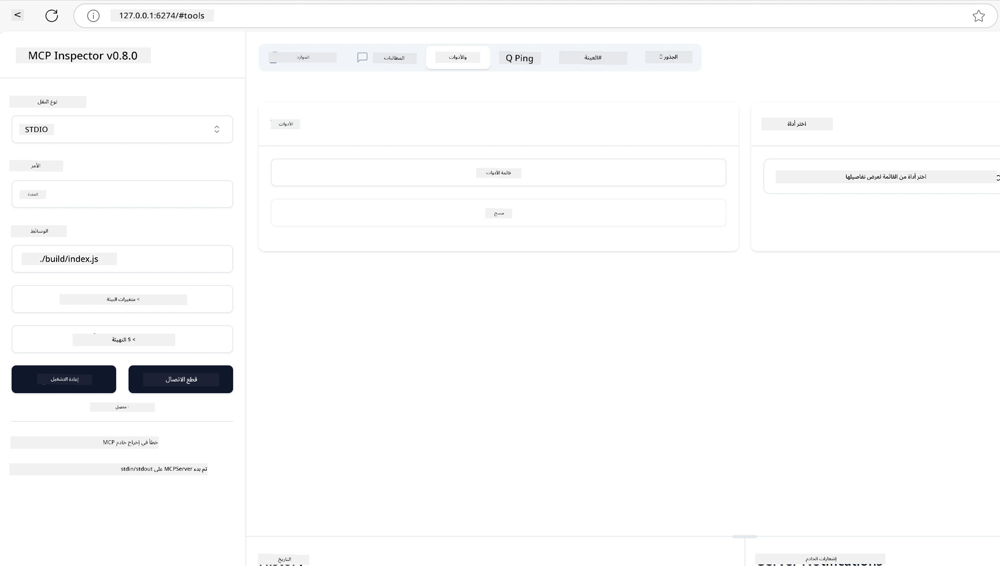
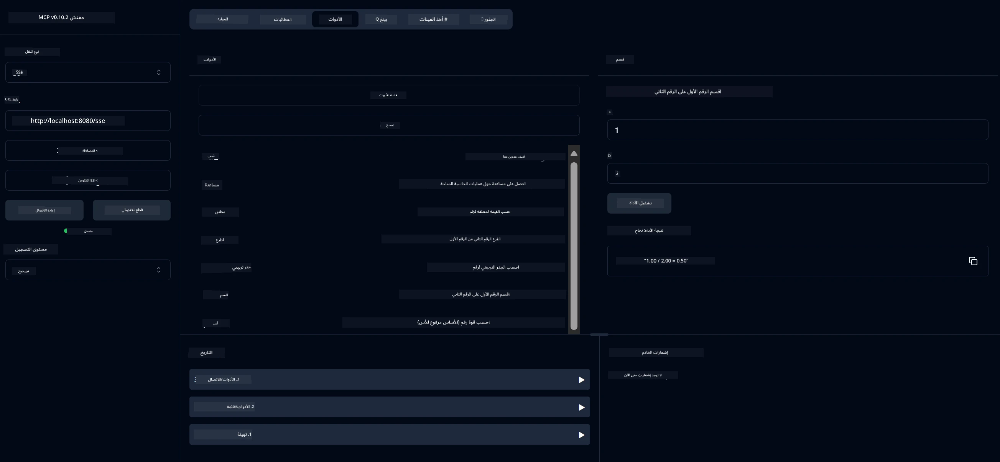
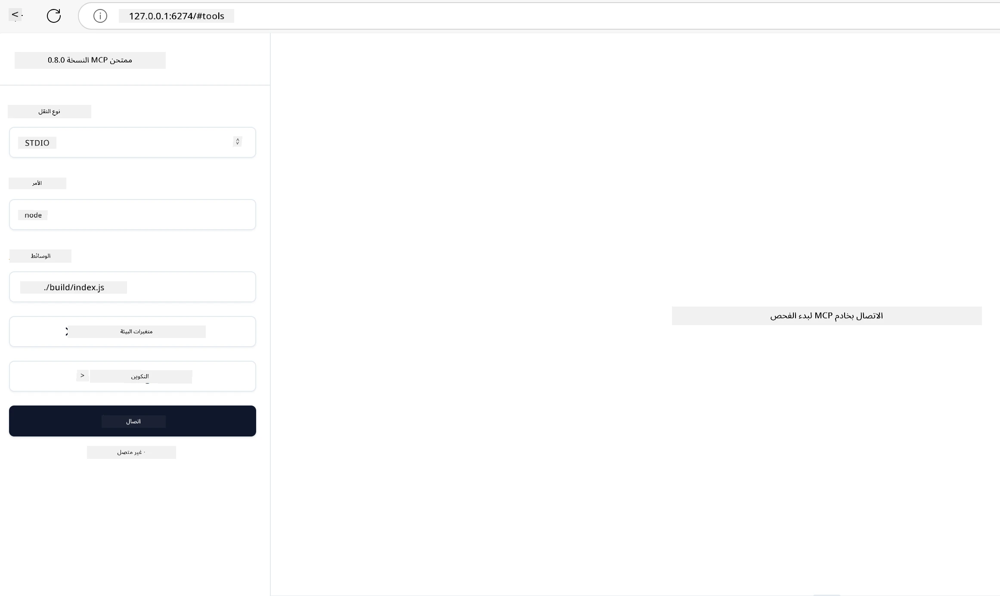
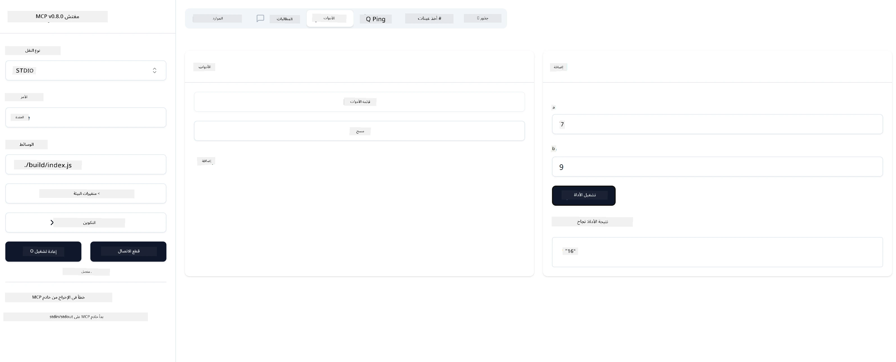

# البدء مع MCP

مرحبًا بك في خطواتك الأولى مع بروتوكول سياق النموذج (MCP)! سواء كنت جديدًا على MCP أو تسعى لتعميق فهمك، سيرشدك هذا الدليل خلال عملية الإعداد والتطوير الأساسية. ستكتشف كيف يمكّن MCP التكامل السلس بين نماذج الذكاء الاصطناعي والتطبيقات، وتتعلم كيفية تجهيز بيئتك بسرعة لبناء واختبار حلول مدعومة بـ MCP.

> ملخص؛ إذا كنت تبني تطبيقات ذكاء اصطناعي، فأنت تعلم أنه يمكنك إضافة أدوات وموارد أخرى إلى نموذج اللغة الكبير (LLM)، لجعل النموذج أكثر معرفة. ومع ذلك، إذا وضعت تلك الأدوات والموارد على خادم، يمكن لأي عميل مع/بدون LLM استخدام قدرات التطبيق والخادم.

## نظرة عامة

يوفر هذا الدرس إرشادات عملية حول إعداد بيئات MCP وبناء تطبيقات MCP الأولى الخاصة بك. ستتعلم كيفية إعداد الأدوات والأُطُر اللازمة، وبناء خوادم MCP الأساسية، وإنشاء تطبيقات مضيفة، واختبار تطبيقاتك.

بروتوكول سياق النموذج (MCP) هو بروتوكول مفتوح يحدد كيفية توفير التطبيقات للسياق لنماذج اللغة الكبيرة. فكر في MCP كمنفذ USB-C لتطبيقات الذكاء الاصطناعي - فهو يوفر طريقة موحدة لربط نماذج الذكاء الاصطناعي بمصادر بيانات وأدوات مختلفة.

## أهداف التعلم

بنهاية هذا الدرس، ستكون قادرًا على:

- إعداد بيئات تطوير لـ MCP في C#، Java، Python، TypeScript، وRust
- بناء ونشر خوادم MCP أساسية مع ميزات مخصصة (الموارد، المطالبات، والأدوات)
- إنشاء تطبيقات مضيفة تتصل بخوادم MCP
- اختبار وتصحيح تطبيقات MCP

## إعداد بيئة MCP الخاصة بك

قبل أن تبدأ العمل مع MCP، من المهم تجهيز بيئة التطوير وفهم سير العمل الأساسي. سيرشدك هذا القسم خلال خطوات الإعداد الأولية لضمان بداية سلسة مع MCP.

### المتطلبات الأساسية

قبل الغوص في تطوير MCP، تأكد من توفر:

- **بيئة تطوير**: للغة التي اخترتها (C#، Java، Python، TypeScript، أو Rust)
- **بيئة تطوير متكاملة/محرر**: Visual Studio، Visual Studio Code، IntelliJ، Eclipse، PyCharm، أو أي محرر كود حديث
- **مديرو الحزم**: NuGet، Maven/Gradle، pip، npm/yarn، أو Cargo
- **مفاتيح API**: لأي خدمات ذكاء اصطناعي تخطط لاستخدامها في تطبيقاتك المضيفة

## هيكل خادم MCP الأساسي

عادةً ما يتضمن خادم MCP:

- **تكوين الخادم**: إعداد المنفذ، المصادقة، والإعدادات الأخرى
- **الموارد**: البيانات والسياق المتاحة لنماذج اللغة الكبيرة
- **الأدوات**: الوظائف التي يمكن للنماذج استدعاؤها
- **المطالبات**: قوالب لتوليد أو هيكلة النص

إليك مثال مبسط في TypeScript:

```typescript
import { McpServer, ResourceTemplate } from "@modelcontextprotocol/sdk/server/mcp.js";
import { StdioServerTransport } from "@modelcontextprotocol/sdk/server/stdio.js";
import { z } from "zod";

// إنشاء خادم MCP
const server = new McpServer({
  name: "Demo",
  version: "1.0.0"
});

// إضافة أداة إضافية
server.tool("add",
  { a: z.number(), b: z.number() },
  async ({ a, b }) => ({
    content: [{ type: "text", text: String(a + b) }]
  })
);

// إضافة مورد ترحيب ديناميكي
server.resource(
  "file",
  // يتحكم المعامل 'list' في كيفية سرد المورد للملفات المتاحة. تعيينه إلى undefined يعطل السرد لهذا المورد.
  new ResourceTemplate("file://{path}", { list: undefined }),
  async (uri, { path }) => ({
    contents: [{
      uri: uri.href,
      text: `File, ${path}!`
    }]
  })
);

// إضافة مورد ملف يقرأ محتويات الملف
server.resource(
  "file",
  new ResourceTemplate("file://{path}", { list: undefined }),
  async (uri, { path }) => {
    let text;
    try {
      text = await fs.readFile(path, "utf8");
    } catch (err) {
      text = `Error reading file: ${err.message}`;
    }
    return {
      contents: [{
        uri: uri.href,
        text
      }]
    };
  }
);

server.prompt(
  "review-code",
  { code: z.string() },
  ({ code }) => ({
    messages: [{
      role: "user",
      content: {
        type: "text",
        text: `Please review this code:\n\n${code}`
      }
    }]
  })
);

// بدء استقبال الرسائل على stdin وإرسال الرسائل على stdout
const transport = new StdioServerTransport();
await server.connect(transport);
```

في الكود السابق قمنا بـ:

- استيراد الفئات اللازمة من SDK الخاص بـ MCP لـ TypeScript.
- إنشاء وتكوين مثيل جديد لخادم MCP.
- تسجيل أداة مخصصة (`calculator`) مع دالة معالج.
- بدء الخادم للاستماع لطلبات MCP الواردة.

## الاختبار وتصحيح الأخطاء

قبل أن تبدأ في اختبار خادم MCP الخاص بك، من المهم فهم الأدوات المتاحة وأفضل الممارسات لتصحيح الأخطاء. يضمن الاختبار الفعال أن يتصرف خادمك كما هو متوقع ويساعدك على تحديد المشكلات وحلها بسرعة. يوضح القسم التالي الطرق الموصى بها للتحقق من تطبيق MCP الخاص بك.

يوفر MCP أدوات لمساعدتك في اختبار وتصحيح خوادمك:

- **أداة Inspector**، هذه الواجهة الرسومية تتيح لك الاتصال بخادمك واختبار أدواتك، المطالبات، والموارد.
- **curl**، يمكنك أيضًا الاتصال بخادمك باستخدام أداة سطر الأوامر مثل curl أو عملاء آخرين يمكنهم إنشاء وتشغيل أوامر HTTP.

### استخدام MCP Inspector

[مفتش MCP](https://github.com/modelcontextprotocol/inspector) هو أداة اختبار بصرية تساعدك على:

1. **اكتشاف قدرات الخادم**: الكشف التلقائي عن الموارد، الأدوات، والمطالبات المتاحة
2. **اختبار تنفيذ الأدوات**: تجربة معلمات مختلفة ورؤية الاستجابات في الوقت الحقيقي
3. **عرض بيانات وصفية للخادم**: فحص معلومات الخادم، المخططات، والتكوينات

```bash
# مثال TypeScript، تثبيت وتشغيل MCP Inspector
npx @modelcontextprotocol/inspector node build/index.js
```

عند تشغيل الأوامر أعلاه، سيطلق MCP Inspector واجهة ويب محلية في متصفحك. يمكنك توقع رؤية لوحة تعرض خوادم MCP المسجلة، أدواتها المتاحة، الموارد، والمطالبات. تتيح الواجهة اختبار تنفيذ الأدوات بشكل تفاعلي، فحص بيانات وصفية للخادم، وعرض الاستجابات في الوقت الحقيقي، مما يسهل التحقق وتصحيح تطبيقات خادم MCP الخاصة بك.

إليك لقطة شاشة لما قد تبدو عليه:



## مشكلات الإعداد الشائعة والحلول

| المشكلة | الحل المحتمل |
|-------|-------------------|
| رفض الاتصال | تحقق مما إذا كان الخادم يعمل والمنفذ صحيح |
| أخطاء تنفيذ الأدوات | راجع التحقق من المعلمات ومعالجة الأخطاء |
| فشل المصادقة | تحقق من مفاتيح API والأذونات |
| أخطاء التحقق من المخطط | تأكد من تطابق المعلمات مع المخطط المحدد |
| عدم بدء الخادم | تحقق من تعارضات المنفذ أو الاعتمادات المفقودة |
| أخطاء CORS | قم بتكوين رؤوس CORS المناسبة لطلبات عبر الأصل |
| مشكلات المصادقة | تحقق من صلاحية الرمز والأذونات |

## التطوير المحلي

للتطوير والاختبار المحلي، يمكنك تشغيل خوادم MCP مباشرة على جهازك:

1. **ابدأ عملية الخادم**: شغّل تطبيق خادم MCP الخاص بك
2. **تكوين الشبكة**: تأكد من أن الخادم متاح على المنفذ المتوقع
3. **اتصال العملاء**: استخدم عناوين URL للاتصال المحلي مثل `http://localhost:3000`

```bash
# مثال: تشغيل خادم MCP مكتوب بـ TypeScript محليًا
npm run start
# الخادم يعمل على http://localhost:3000
```

## بناء خادم MCP الأول الخاص بك

لقد غطينا [المفاهيم الأساسية](/01-CoreConcepts/README.md) في درس سابق، والآن حان الوقت لتطبيق تلك المعرفة.

### ما الذي يمكن أن يفعله الخادم

قبل أن نبدأ بكتابة الكود، دعونا نذكر أنفسنا بما يمكن أن يفعله الخادم:

يمكن لخادم MCP على سبيل المثال:

- الوصول إلى الملفات وقواعد البيانات المحلية
- الاتصال بواجهات برمجة التطبيقات البعيدة
- إجراء الحسابات
- التكامل مع أدوات وخدمات أخرى
- توفير واجهة مستخدم للتفاعل

رائع، الآن بعد أن عرفنا ما يمكننا فعله له، لنبدأ بالبرمجة.

## تمرين: إنشاء خادم

لإنشاء خادم، تحتاج إلى اتباع الخطوات التالية:

- تثبيت SDK الخاص بـ MCP.
- إنشاء مشروع وإعداد هيكل المشروع.
- كتابة كود الخادم.
- اختبار الخادم.

### -1- إنشاء المشروع

#### TypeScript

```sh
# إنشاء دليل المشروع وتهيئة مشروع npm
mkdir calculator-server
cd calculator-server
npm init -y
```

#### Python

```sh
# إنشاء مجلد المشروع
mkdir calculator-server
cd calculator-server
# افتح المجلد في فيجوال ستوديو كود - تخطى هذا إذا كنت تستخدم بيئة تطوير متكاملة مختلفة
code .
```

#### .NET

```sh
dotnet new console -n McpCalculatorServer
cd McpCalculatorServer
```

#### Java

لـ Java، أنشئ مشروع Spring Boot:

```bash
curl https://start.spring.io/starter.zip \
  -d dependencies=web \
  -d javaVersion=21 \
  -d type=maven-project \
  -d groupId=com.example \
  -d artifactId=calculator-server \
  -d name=McpServer \
  -d packageName=com.microsoft.mcp.sample.server \
  -o calculator-server.zip
```

فك ضغط ملف zip:

```bash
unzip calculator-server.zip -d calculator-server
cd calculator-server
# اختياري إزالة الاختبار غير المستخدم
rm -rf src/test/java
```

أضف التكوين الكامل التالي إلى ملف *pom.xml* الخاص بك:

```xml
<?xml version="1.0" encoding="UTF-8"?>
<project xmlns="http://maven.apache.org/POM/4.0.0"
    xmlns:xsi="http://www.w3.org/2001/XMLSchema-instance"
    xsi:schemaLocation="http://maven.apache.org/POM/4.0.0 http://maven.apache.org/xsd/maven-4.0.0.xsd">
    <modelVersion>4.0.0</modelVersion>
    
    <!-- Spring Boot parent for dependency management -->
    <parent>
        <groupId>org.springframework.boot</groupId>
        <artifactId>spring-boot-starter-parent</artifactId>
        <version>3.5.0</version>
        <relativePath />
    </parent>

    <!-- Project coordinates -->
    <groupId>com.example</groupId>
    <artifactId>calculator-server</artifactId>
    <version>0.0.1-SNAPSHOT</version>
    <name>Calculator Server</name>
    <description>Basic calculator MCP service for beginners</description>

    <!-- Properties -->
    <properties>
        <java.version>21</java.version>
        <maven.compiler.source>21</maven.compiler.source>
        <maven.compiler.target>21</maven.compiler.target>
    </properties>

    <!-- Spring AI BOM for version management -->
    <dependencyManagement>
        <dependencies>
            <dependency>
                <groupId>org.springframework.ai</groupId>
                <artifactId>spring-ai-bom</artifactId>
                <version>1.0.0-SNAPSHOT</version>
                <type>pom</type>
                <scope>import</scope>
            </dependency>
        </dependencies>
    </dependencyManagement>

    <!-- Dependencies -->
    <dependencies>
        <dependency>
            <groupId>org.springframework.ai</groupId>
            <artifactId>spring-ai-starter-mcp-server-webflux</artifactId>
        </dependency>
        <dependency>
            <groupId>org.springframework.boot</groupId>
            <artifactId>spring-boot-starter-actuator</artifactId>
        </dependency>
        <dependency>
         <groupId>org.springframework.boot</groupId>
         <artifactId>spring-boot-starter-test</artifactId>
         <scope>test</scope>
      </dependency>
    </dependencies>

    <!-- Build configuration -->
    <build>
        <plugins>
            <plugin>
                <groupId>org.springframework.boot</groupId>
                <artifactId>spring-boot-maven-plugin</artifactId>
            </plugin>
            <plugin>
                <groupId>org.apache.maven.plugins</groupId>
                <artifactId>maven-compiler-plugin</artifactId>
                <configuration>
                    <release>21</release>
                </configuration>
            </plugin>
        </plugins>
    </build>

    <!-- Repositories for Spring AI snapshots -->
    <repositories>
        <repository>
            <id>spring-milestones</id>
            <name>Spring Milestones</name>
            <url>https://repo.spring.io/milestone</url>
            <snapshots>
                <enabled>false</enabled>
            </snapshots>
        </repository>
        <repository>
            <id>spring-snapshots</id>
            <name>Spring Snapshots</name>
            <url>https://repo.spring.io/snapshot</url>
            <releases>
                <enabled>false</enabled>
            </releases>
        </repository>
    </repositories>
</project>
```

#### Rust

```sh
mkdir calculator-server
cd calculator-server
cargo init
```

### -2- إضافة التبعيات

الآن بعد أن أنشأت مشروعك، دعنا نضيف التبعيات التالية:

#### TypeScript

```sh
# إذا لم يكن مثبتًا بالفعل، قم بتثبيت TypeScript على مستوى النظام
npm install typescript -g

# قم بتثبيت MCP SDK و Zod للتحقق من صحة المخطط
npm install @modelcontextprotocol/sdk zod
npm install -D @types/node typescript
```

#### Python

```sh
# إنشاء بيئة افتراضية وتثبيت التبعيات
python -m venv venv
venv\Scripts\activate
pip install "mcp[cli]"
```

#### Java

```bash
cd calculator-server
./mvnw clean install -DskipTests
```

#### Rust

```sh
cargo add rmcp --features server,transport-io
cargo add serde
cargo add tokio --features rt-multi-thread
```

### -3- إنشاء ملفات المشروع

#### TypeScript

افتح ملف *package.json* واستبدل المحتوى بالتالي لضمان إمكانية بناء وتشغيل الخادم:

```json
{
  "name": "calculator-server",
  "version": "1.0.0",
  "main": "index.js",
  "type": "module",
  "scripts": {
    "build": "tsc",
    "start": "npm run build && node ./build/index.js",
  },
  "keywords": [],
  "author": "",
  "license": "ISC",
  "description": "A simple calculator server using Model Context Protocol",
  "dependencies": {
    "@modelcontextprotocol/sdk": "^1.16.0",
    "zod": "^3.25.76"
  },
  "devDependencies": {
    "@types/node": "^24.0.14",
    "typescript": "^5.8.3"
  }
}
```

أنشئ ملف *tsconfig.json* بالمحتوى التالي:

```json
{
  "compilerOptions": {
    "target": "ES2022",
    "module": "Node16",
    "moduleResolution": "Node16",
    "outDir": "./build",
    "rootDir": "./src",
    "strict": true,
    "esModuleInterop": true,
    "skipLibCheck": true,
    "forceConsistentCasingInFileNames": true
  },
  "include": ["src/**/*"],
  "exclude": ["node_modules"]
}
```

أنشئ مجلدًا لكود المصدر الخاص بك:

```sh
mkdir src
touch src/index.ts
```

#### Python

أنشئ ملف *server.py*

```sh
touch server.py
```

#### .NET

ثبت حزم NuGet المطلوبة:

```sh
dotnet add package ModelContextProtocol --prerelease
dotnet add package Microsoft.Extensions.Hosting
```

#### Java

لمشاريع Java Spring Boot، يتم إنشاء هيكل المشروع تلقائيًا.

#### Rust

بالنسبة لـ Rust، يتم إنشاء ملف *src/main.rs* افتراضيًا عند تشغيل `cargo init`. افتح الملف واحذف الكود الافتراضي.

### -4- إنشاء كود الخادم

#### TypeScript

أنشئ ملف *index.ts* وأضف الكود التالي:

```typescript
import { McpServer, ResourceTemplate } from "@modelcontextprotocol/sdk/server/mcp.js";
import { StdioServerTransport } from "@modelcontextprotocol/sdk/server/stdio.js";
import { z } from "zod";
 
// إنشاء خادم MCP
const server = new McpServer({
  name: "Calculator MCP Server",
  version: "1.0.0"
});
```

الآن لديك خادم، لكنه لا يفعل الكثير، دعنا نصلح ذلك.

#### Python

```python
# سيرفر.py
from mcp.server.fastmcp import FastMCP

# إنشاء خادم MCP
mcp = FastMCP("Demo")
```

#### .NET

```csharp
using Microsoft.Extensions.DependencyInjection;
using Microsoft.Extensions.Hosting;
using Microsoft.Extensions.Logging;
using ModelContextProtocol.Server;
using System.ComponentModel;

var builder = Host.CreateApplicationBuilder(args);
builder.Logging.AddConsole(consoleLogOptions =>
{
    // Configure all logs to go to stderr
    consoleLogOptions.LogToStandardErrorThreshold = LogLevel.Trace;
});

builder.Services
    .AddMcpServer()
    .WithStdioServerTransport()
    .WithToolsFromAssembly();
await builder.Build().RunAsync();

// add features
```

#### Java

لـ Java، أنشئ مكونات الخادم الأساسية. أولاً، عدل فئة التطبيق الرئيسية:

*src/main/java/com/microsoft/mcp/sample/server/McpServerApplication.java*:

```java
package com.microsoft.mcp.sample.server;

import org.springframework.ai.tool.ToolCallbackProvider;
import org.springframework.ai.tool.method.MethodToolCallbackProvider;
import org.springframework.boot.SpringApplication;
import org.springframework.boot.autoconfigure.SpringBootApplication;
import org.springframework.context.annotation.Bean;
import com.microsoft.mcp.sample.server.service.CalculatorService;

@SpringBootApplication
public class McpServerApplication {

    public static void main(String[] args) {
        SpringApplication.run(McpServerApplication.class, args);
    }
    
    @Bean
    public ToolCallbackProvider calculatorTools(CalculatorService calculator) {
        return MethodToolCallbackProvider.builder().toolObjects(calculator).build();
    }
}
```

أنشئ خدمة الآلة الحاسبة *src/main/java/com/microsoft/mcp/sample/server/service/CalculatorService.java*:

```java
package com.microsoft.mcp.sample.server.service;

import org.springframework.ai.tool.annotation.Tool;
import org.springframework.stereotype.Service;

/**
 * Service for basic calculator operations.
 * This service provides simple calculator functionality through MCP.
 */
@Service
public class CalculatorService {

    /**
     * Add two numbers
     * @param a The first number
     * @param b The second number
     * @return The sum of the two numbers
     */
    @Tool(description = "Add two numbers together")
    public String add(double a, double b) {
        double result = a + b;
        return formatResult(a, "+", b, result);
    }

    /**
     * Subtract one number from another
     * @param a The number to subtract from
     * @param b The number to subtract
     * @return The result of the subtraction
     */
    @Tool(description = "Subtract the second number from the first number")
    public String subtract(double a, double b) {
        double result = a - b;
        return formatResult(a, "-", b, result);
    }

    /**
     * Multiply two numbers
     * @param a The first number
     * @param b The second number
     * @return The product of the two numbers
     */
    @Tool(description = "Multiply two numbers together")
    public String multiply(double a, double b) {
        double result = a * b;
        return formatResult(a, "*", b, result);
    }

    /**
     * Divide one number by another
     * @param a The numerator
     * @param b The denominator
     * @return The result of the division
     */
    @Tool(description = "Divide the first number by the second number")
    public String divide(double a, double b) {
        if (b == 0) {
            return "Error: Cannot divide by zero";
        }
        double result = a / b;
        return formatResult(a, "/", b, result);
    }

    /**
     * Calculate the power of a number
     * @param base The base number
     * @param exponent The exponent
     * @return The result of raising the base to the exponent
     */
    @Tool(description = "Calculate the power of a number (base raised to an exponent)")
    public String power(double base, double exponent) {
        double result = Math.pow(base, exponent);
        return formatResult(base, "^", exponent, result);
    }

    /**
     * Calculate the square root of a number
     * @param number The number to find the square root of
     * @return The square root of the number
     */
    @Tool(description = "Calculate the square root of a number")
    public String squareRoot(double number) {
        if (number < 0) {
            return "Error: Cannot calculate square root of a negative number";
        }
        double result = Math.sqrt(number);
        return String.format("√%.2f = %.2f", number, result);
    }

    /**
     * Calculate the modulus (remainder) of division
     * @param a The dividend
     * @param b The divisor
     * @return The remainder of the division
     */
    @Tool(description = "Calculate the remainder when one number is divided by another")
    public String modulus(double a, double b) {
        if (b == 0) {
            return "Error: Cannot divide by zero";
        }
        double result = a % b;
        return formatResult(a, "%", b, result);
    }

    /**
     * Calculate the absolute value of a number
     * @param number The number to find the absolute value of
     * @return The absolute value of the number
     */
    @Tool(description = "Calculate the absolute value of a number")
    public String absolute(double number) {
        double result = Math.abs(number);
        return String.format("|%.2f| = %.2f", number, result);
    }

    /**
     * Get help about available calculator operations
     * @return Information about available operations
     */
    @Tool(description = "Get help about available calculator operations")
    public String help() {
        return "Basic Calculator MCP Service\n\n" +
               "Available operations:\n" +
               "1. add(a, b) - Adds two numbers\n" +
               "2. subtract(a, b) - Subtracts the second number from the first\n" +
               "3. multiply(a, b) - Multiplies two numbers\n" +
               "4. divide(a, b) - Divides the first number by the second\n" +
               "5. power(base, exponent) - Raises a number to a power\n" +
               "6. squareRoot(number) - Calculates the square root\n" + 
               "7. modulus(a, b) - Calculates the remainder of division\n" +
               "8. absolute(number) - Calculates the absolute value\n\n" +
               "Example usage: add(5, 3) will return 5 + 3 = 8";
    }

    /**
     * Format the result of a calculation
     */
    private String formatResult(double a, String operator, double b, double result) {
        return String.format("%.2f %s %.2f = %.2f", a, operator, b, result);
    }
}
```

**مكونات اختيارية لخدمة جاهزة للإنتاج:**

أنشئ تكوين بدء التشغيل *src/main/java/com/microsoft/mcp/sample/server/config/StartupConfig.java*:

```java
package com.microsoft.mcp.sample.server.config;

import org.springframework.boot.CommandLineRunner;
import org.springframework.context.annotation.Bean;
import org.springframework.context.annotation.Configuration;

@Configuration
public class StartupConfig {
    
    @Bean
    public CommandLineRunner startupInfo() {
        return args -> {
            System.out.println("\n" + "=".repeat(60));
            System.out.println("Calculator MCP Server is starting...");
            System.out.println("SSE endpoint: http://localhost:8080/sse");
            System.out.println("Health check: http://localhost:8080/actuator/health");
            System.out.println("=".repeat(60) + "\n");
        };
    }
}
```

أنشئ وحدة تحكم الصحة *src/main/java/com/microsoft/mcp/sample/server/controller/HealthController.java*:

```java
package com.microsoft.mcp.sample.server.controller;

import org.springframework.http.ResponseEntity;
import org.springframework.web.bind.annotation.GetMapping;
import org.springframework.web.bind.annotation.RestController;
import java.time.LocalDateTime;
import java.util.HashMap;
import java.util.Map;

@RestController
public class HealthController {
    
    @GetMapping("/health")
    public ResponseEntity<Map<String, Object>> healthCheck() {
        Map<String, Object> response = new HashMap<>();
        response.put("status", "UP");
        response.put("timestamp", LocalDateTime.now().toString());
        response.put("service", "Calculator MCP Server");
        return ResponseEntity.ok(response);
    }
}
```

أنشئ معالج الاستثناءات *src/main/java/com/microsoft/mcp/sample/server/exception/GlobalExceptionHandler.java*:

```java
package com.microsoft.mcp.sample.server.exception;

import org.springframework.http.HttpStatus;
import org.springframework.http.ResponseEntity;
import org.springframework.web.bind.annotation.ExceptionHandler;
import org.springframework.web.bind.annotation.RestControllerAdvice;

@RestControllerAdvice
public class GlobalExceptionHandler {

    @ExceptionHandler(IllegalArgumentException.class)
    public ResponseEntity<ErrorResponse> handleIllegalArgumentException(IllegalArgumentException ex) {
        ErrorResponse error = new ErrorResponse(
            "Invalid_Input", 
            "Invalid input parameter: " + ex.getMessage());
        return new ResponseEntity<>(error, HttpStatus.BAD_REQUEST);
    }

    public static class ErrorResponse {
        private String code;
        private String message;

        public ErrorResponse(String code, String message) {
            this.code = code;
            this.message = message;
        }

        // الدوال الجالبة
        public String getCode() { return code; }
        public String getMessage() { return message; }
    }
}
```

أنشئ لافتة مخصصة *src/main/resources/banner.txt*:

```text
_____      _            _       _             
 / ____|    | |          | |     | |            
| |     __ _| | ___ _   _| | __ _| |_ ___  _ __ 
| |    / _` | |/ __| | | | |/ _` | __/ _ \| '__|
| |___| (_| | | (__| |_| | | (_| | || (_) | |   
 \_____\__,_|_|\___|\__,_|_|\__,_|\__\___/|_|   
                                                
Calculator MCP Server v1.0
Spring Boot MCP Application
```

</details>

#### Rust

أضف الكود التالي إلى أعلى ملف *src/main.rs*. هذا يستورد المكتبات والوحدات اللازمة لخادم MCP الخاص بك.

```rust
use rmcp::{
    handler::server::{router::tool::ToolRouter, tool::Parameters},
    model::{ServerCapabilities, ServerInfo},
    schemars, tool, tool_handler, tool_router,
    transport::stdio,
    ServerHandler, ServiceExt,
};
use std::error::Error;
```

سيكون خادم الآلة الحاسبة بسيطًا يمكنه جمع رقمين معًا. دعنا ننشئ هيكلًا لتمثيل طلب الآلة الحاسبة.

```rust
#[derive(Debug, serde::Deserialize, schemars::JsonSchema)]
pub struct CalculatorRequest {
    pub a: f64,
    pub b: f64,
}
```

بعد ذلك، أنشئ هيكلًا لتمثيل خادم الآلة الحاسبة. سيحتوي هذا الهيكل على موجه الأدوات، الذي يُستخدم لتسجيل الأدوات.

```rust
#[derive(Debug, Clone)]
pub struct Calculator {
    tool_router: ToolRouter<Self>,
}
```

الآن، يمكننا تنفيذ هيكل `Calculator` لإنشاء مثيل جديد للخادم وتنفيذ معالج الخادم لتوفير معلومات الخادم.

```rust
#[tool_router]
impl Calculator {
    pub fn new() -> Self {
        Self {
            tool_router: Self::tool_router(),
        }
    }
}

#[tool_handler]
impl ServerHandler for Calculator {
    fn get_info(&self) -> ServerInfo {
        ServerInfo {
            instructions: Some("A simple calculator tool".into()),
            capabilities: ServerCapabilities::builder().enable_tools().build(),
            ..Default::default()
        }
    }
}
```

أخيرًا، نحتاج إلى تنفيذ الدالة الرئيسية لبدء الخادم. ستنشئ هذه الدالة مثيلًا من هيكل `Calculator` وتخدمه عبر الإدخال/الإخراج القياسي.

```rust
#[tokio::main]
async fn main() -> Result<(), Box<dyn Error>> {
    let service = Calculator::new().serve(stdio()).await?;
    service.waiting().await?;
    Ok(())
}
```

الخادم الآن معد لتوفير معلومات أساسية عن نفسه. بعد ذلك، سنضيف أداة لأداء الجمع.

### -5- إضافة أداة وموارد

أضف أداة وموارد بإضافة الكود التالي:

#### TypeScript

```typescript
server.tool(
  "add",
  { a: z.number(), b: z.number() },
  async ({ a, b }) => ({
    content: [{ type: "text", text: String(a + b) }]
  })
);

server.resource(
  "greeting",
  new ResourceTemplate("greeting://{name}", { list: undefined }),
  async (uri, { name }) => ({
    contents: [{
      uri: uri.href,
      text: `Hello, ${name}!`
    }]
  })
);
```

تأخذ أداتك المعلمات `a` و `b` وتنفذ دالة تنتج استجابة على الشكل:

```typescript
{
  contents: [{
    type: "text", content: "some content"
  }]
}
```

يتم الوصول إلى المورد الخاص بك من خلال سلسلة "greeting" ويأخذ معلمة `name` وينتج استجابة مشابهة للأداة:

```typescript
{
  uri: "<href>",
  text: "a text"
}
```

#### Python

```python
# أضف أداة جمع
@mcp.tool()
def add(a: int, b: int) -> int:
    """Add two numbers"""
    return a + b


# أضف مورد تحية ديناميكي
@mcp.resource("greeting://{name}")
def get_greeting(name: str) -> str:
    """Get a personalized greeting"""
    return f"Hello, {name}!"
```

في الكود السابق قمنا بـ:

- تعريف أداة `add` التي تأخذ المعلمات `a` و `b`، كلاهما أعداد صحيحة.
- إنشاء مورد يسمى `greeting` يأخذ المعلمة `name`.

#### .NET

أضف هذا إلى ملف Program.cs الخاص بك:

```csharp
[McpServerToolType]
public static class CalculatorTool
{
    [McpServerTool, Description("Adds two numbers")]
    public static string Add(int a, int b) => $"Sum {a + b}";
}
```

#### Java

تم إنشاء الأدوات بالفعل في الخطوة السابقة.

#### Rust

أضف أداة جديدة داخل كتلة `impl Calculator`:

```rust
#[tool(description = "Adds a and b")]
async fn add(
    &self,
    Parameters(CalculatorRequest { a, b }): Parameters<CalculatorRequest>,
) -> String {
    (a + b).to_string()
}
```

### -6- الكود النهائي

دعنا نضيف الكود الأخير الذي نحتاجه ليتمكن الخادم من البدء:

#### TypeScript

```typescript
// ابدأ في استقبال الرسائل على الإدخال القياسي وإرسال الرسائل على الإخراج القياسي
const transport = new StdioServerTransport();
await server.connect(transport);
```

إليك الكود الكامل:

```typescript
// index.ts
import { McpServer, ResourceTemplate } from "@modelcontextprotocol/sdk/server/mcp.js";
import { StdioServerTransport } from "@modelcontextprotocol/sdk/server/stdio.js";
import { z } from "zod";

// إنشاء خادم MCP
const server = new McpServer({
  name: "Calculator MCP Server",
  version: "1.0.0"
});

// إضافة أداة جمع
server.tool(
  "add",
  { a: z.number(), b: z.number() },
  async ({ a, b }) => ({
    content: [{ type: "text", text: String(a + b) }]
  })
);

// إضافة مورد تحية ديناميكي
server.resource(
  "greeting",
  new ResourceTemplate("greeting://{name}", { list: undefined }),
  async (uri, { name }) => ({
    contents: [{
      uri: uri.href,
      text: `Hello, ${name}!`
    }]
  })
);

// بدء استقبال الرسائل على stdin وإرسال الرسائل على stdout
const transport = new StdioServerTransport();
server.connect(transport);
```

#### Python

```python
# سيرفر.py
from mcp.server.fastmcp import FastMCP

# إنشاء خادم MCP
mcp = FastMCP("Demo")


# إضافة أداة جمع
@mcp.tool()
def add(a: int, b: int) -> int:
    """Add two numbers"""
    return a + b


# إضافة مورد ترحيب ديناميكي
@mcp.resource("greeting://{name}")
def get_greeting(name: str) -> str:
    """Get a personalized greeting"""
    return f"Hello, {name}!"

# كتلة التنفيذ الرئيسية - هذا مطلوب لتشغيل الخادم
if __name__ == "__main__":
    mcp.run()
```

#### .NET

أنشئ ملف Program.cs بالمحتوى التالي:

```csharp
using Microsoft.Extensions.DependencyInjection;
using Microsoft.Extensions.Hosting;
using Microsoft.Extensions.Logging;
using ModelContextProtocol.Server;
using System.ComponentModel;

var builder = Host.CreateApplicationBuilder(args);
builder.Logging.AddConsole(consoleLogOptions =>
{
    // Configure all logs to go to stderr
    consoleLogOptions.LogToStandardErrorThreshold = LogLevel.Trace;
});

builder.Services
    .AddMcpServer()
    .WithStdioServerTransport()
    .WithToolsFromAssembly();
await builder.Build().RunAsync();

[McpServerToolType]
public static class CalculatorTool
{
    [McpServerTool, Description("Adds two numbers")]
    public static string Add(int a, int b) => $"Sum {a + b}";
}
```

#### Java

يجب أن تبدو فئة التطبيق الرئيسية الكاملة الخاصة بك هكذا:

```java
// McpServerApplication.java
package com.microsoft.mcp.sample.server;

import org.springframework.ai.tool.ToolCallbackProvider;
import org.springframework.ai.tool.method.MethodToolCallbackProvider;
import org.springframework.boot.SpringApplication;
import org.springframework.boot.autoconfigure.SpringBootApplication;
import org.springframework.context.annotation.Bean;
import com.microsoft.mcp.sample.server.service.CalculatorService;

@SpringBootApplication
public class McpServerApplication {

    public static void main(String[] args) {
        SpringApplication.run(McpServerApplication.class, args);
    }
    
    @Bean
    public ToolCallbackProvider calculatorTools(CalculatorService calculator) {
        return MethodToolCallbackProvider.builder().toolObjects(calculator).build();
    }
}
```

#### Rust

يجب أن يبدو الكود النهائي لخادم Rust هكذا:

```rust
use rmcp::{
    ServerHandler, ServiceExt,
    handler::server::{router::tool::ToolRouter, tool::Parameters},
    model::{ServerCapabilities, ServerInfo},
    schemars, tool, tool_handler, tool_router,
    transport::stdio,
};
use std::error::Error;

#[derive(Debug, serde::Deserialize, schemars::JsonSchema)]
pub struct CalculatorRequest {
    pub a: f64,
    pub b: f64,
}

#[derive(Debug, Clone)]
pub struct Calculator {
    tool_router: ToolRouter<Self>,
}

#[tool_router]
impl Calculator {
    pub fn new() -> Self {
        Self {
            tool_router: Self::tool_router(),
        }
    }
    
    #[tool(description = "Adds a and b")]
    async fn add(
        &self,
        Parameters(CalculatorRequest { a, b }): Parameters<CalculatorRequest>,
    ) -> String {
        (a + b).to_string()
    }
}

#[tool_handler]
impl ServerHandler for Calculator {
    fn get_info(&self) -> ServerInfo {
        ServerInfo {
            instructions: Some("A simple calculator tool".into()),
            capabilities: ServerCapabilities::builder().enable_tools().build(),
            ..Default::default()
        }
    }
}

#[tokio::main]
async fn main() -> Result<(), Box<dyn Error>> {
    let service = Calculator::new().serve(stdio()).await?;
    service.waiting().await?;
    Ok(())
}
```

### -7- اختبار الخادم

ابدأ الخادم بالأمر التالي:

#### TypeScript

```sh
npm run build
```

#### Python

```sh
mcp run server.py
```

> لاستخدام MCP Inspector، استخدم `mcp dev server.py` الذي يطلق Inspector تلقائيًا ويوفر رمز جلسة البروكسي المطلوب. إذا استخدمت `mcp run server.py`، ستحتاج إلى بدء Inspector يدويًا وتكوين الاتصال.

#### .NET

تأكد من أنك في دليل مشروعك:

```sh
cd McpCalculatorServer
dotnet run
```

#### Java

```bash
./mvnw clean install -DskipTests
java -jar target/calculator-server-0.0.1-SNAPSHOT.jar
```

#### Rust

شغّل الأوامر التالية لتنسيق وتشغيل الخادم:

```sh
cargo fmt
cargo run
```

### -8- التشغيل باستخدام Inspector

الـ Inspector أداة رائعة يمكنها بدء تشغيل خادمك وتتيح لك التفاعل معه لاختبار عمله. لنبدأ تشغيله:

> [!NOTE]
> قد يبدو مختلفًا في حقل "الأمر" لأنه يحتوي على الأمر لتشغيل خادم باستخدام بيئة التشغيل الخاصة بك.

#### TypeScript

```sh
npx @modelcontextprotocol/inspector node build/index.js
```

أو أضفه إلى *package.json* هكذا: `"inspector": "npx @modelcontextprotocol/inspector node build/index.js"` ثم شغّل `npm run inspector`

#### Python

يستخدم Python أداة Node.js تسمى inspector. من الممكن استدعاء هذه الأداة هكذا:

```sh
mcp dev server.py
```

ومع ذلك، لا تنفذ جميع الطرق المتاحة في الأداة لذا يُنصح بتشغيل أداة Node.js مباشرة كما يلي:

```sh
npx @modelcontextprotocol/inspector mcp run server.py
```

إذا كنت تستخدم أداة أو بيئة تطوير متكاملة تسمح لك بتكوين الأوامر والمعاملات لتشغيل السكريبتات،
تأكد من تعيين `python` في حقل `Command` و `server.py` كـ `Arguments`. هذا يضمن تشغيل السكريبت بشكل صحيح.

#### .NET

تأكد من أنك في دليل مشروعك:

```sh
cd McpCalculatorServer
npx @modelcontextprotocol/inspector dotnet run
```

#### جافا

تأكد من تشغيل خادم الآلة الحاسبة
ثم شغّل المفتش:

```cmd
npx @modelcontextprotocol/inspector
```

في واجهة الويب الخاصة بالمفتش:

1. اختر "SSE" كنوع النقل
2. عيّن عنوان URL إلى: `http://localhost:8080/sse`
3. انقر على "Connect"



**أنت الآن متصل بالخادم**
**تم الانتهاء الآن من قسم اختبار خادم جافا**

القسم التالي يتعلق بالتفاعل مع الخادم.

يجب أن ترى واجهة المستخدم التالية:



1. اتصل بالخادم عن طريق اختيار زر Connect
  بمجرد الاتصال بالخادم، يجب أن ترى الآن ما يلي:

  

1. اختر "Tools" و "listTools"، يجب أن ترى "Add" تظهر، اختر "Add" واملأ قيم المعلمات.

  يجب أن ترى الاستجابة التالية، أي نتيجة من أداة "add":

  

تهانينا، لقد تمكنت من إنشاء وتشغيل خادمك الأول!

#### Rust

لتشغيل خادم Rust باستخدام MCP Inspector CLI، استخدم الأمر التالي:

```sh
npx @modelcontextprotocol/inspector cargo run --cli --method tools/call --tool-name add --tool-arg a=1 b=2
```

### SDKs الرسمية

يوفر MCP SDKs رسمية لعدة لغات:

- [C# SDK](https://github.com/modelcontextprotocol/csharp-sdk) - تتم صيانته بالتعاون مع مايكروسوفت
- [Java SDK](https://github.com/modelcontextprotocol/java-sdk) - تتم صيانته بالتعاون مع Spring AI
- [TypeScript SDK](https://github.com/modelcontextprotocol/typescript-sdk) - التنفيذ الرسمي لـ TypeScript
- [Python SDK](https://github.com/modelcontextprotocol/python-sdk) - التنفيذ الرسمي لـ Python
- [Kotlin SDK](https://github.com/modelcontextprotocol/kotlin-sdk) - التنفيذ الرسمي لـ Kotlin
- [Swift SDK](https://github.com/modelcontextprotocol/swift-sdk) - تتم صيانته بالتعاون مع Loopwork AI
- [Rust SDK](https://github.com/modelcontextprotocol/rust-sdk) - التنفيذ الرسمي لـ Rust

## النقاط الرئيسية

- إعداد بيئة تطوير MCP بسيط مع SDKs الخاصة بكل لغة
- بناء خوادم MCP يتطلب إنشاء وتسجيل أدوات مع مخططات واضحة
- الاختبار وتصحيح الأخطاء ضروريان لتنفيذات MCP موثوقة

## عينات

- [حاسبة جافا](../samples/java/calculator/README.md)
- [حاسبة .Net](../../../../03-GettingStarted/samples/csharp)
- [حاسبة جافا سكريبت](../samples/javascript/README.md)
- [حاسبة TypeScript](../samples/typescript/README.md)
- [حاسبة بايثون](../../../../03-GettingStarted/samples/python)
- [حاسبة Rust](../../../../03-GettingStarted/samples/rust)

## المهمة

أنشئ خادم MCP بسيط مع أداة من اختيارك:

1. نفذ الأداة في لغتك المفضلة (.NET، جافا، بايثون، TypeScript، أو Rust).
2. عرّف معلمات الإدخال وقيم الإرجاع.
3. شغّل أداة المفتش للتأكد من أن الخادم يعمل كما هو مقصود.
4. اختبر التنفيذ مع مدخلات متنوعة.

## الحل

[الحل](./solution/README.md)

## موارد إضافية

- [بناء وكلاء باستخدام Model Context Protocol على Azure](https://learn.microsoft.com/azure/developer/ai/intro-agents-mcp)
- [MCP عن بُعد مع Azure Container Apps (Node.js/TypeScript/JavaScript)](https://learn.microsoft.com/samples/azure-samples/mcp-container-ts/mcp-container-ts/)
- [وكيل MCP لـ .NET OpenAI](https://learn.microsoft.com/samples/azure-samples/openai-mcp-agent-dotnet/openai-mcp-agent-dotnet/)

## ما التالي

التالي: [البدء مع عملاء MCP](../02-client/README.md)

---

<!-- CO-OP TRANSLATOR DISCLAIMER START -->
**إخلاء المسؤولية**:  
تمت ترجمة هذا المستند باستخدام خدمة الترجمة الآلية [Co-op Translator](https://github.com/Azure/co-op-translator). بينما نسعى لتحقيق الدقة، يرجى العلم أن الترجمات الآلية قد تحتوي على أخطاء أو عدم دقة. يجب اعتبار المستند الأصلي بلغته الأصلية المصدر الموثوق به. للمعلومات الهامة، يُنصح بالاعتماد على الترجمة البشرية المهنية. نحن غير مسؤولين عن أي سوء فهم أو تفسير ناتج عن استخدام هذه الترجمة.
<!-- CO-OP TRANSLATOR DISCLAIMER END -->