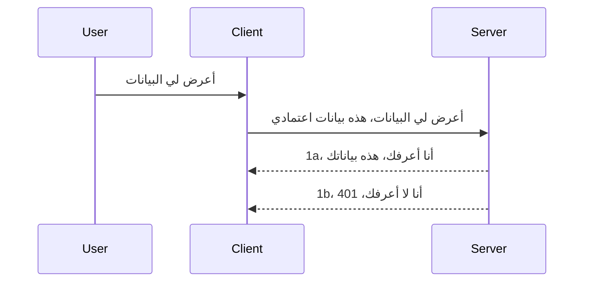

# المصادقة البسيطة

تدعم SDKs الخاصة بـ MCP استخدام OAuth 2.1 والذي، لنكن منصفين، هو عملية معقدة إلى حد ما تشمل مفاهيم مثل خادم المصادقة، خادم الموارد، إرسال بيانات الاعتماد، الحصول على رمز، استبدال الرمز برمز حامل حتى تتمكن أخيرًا من الحصول على بيانات المورد الخاص بك. إذا كنت غير معتاد على OAuth، وهو شيء رائع لتطبيقه، فمن الجيد أن تبدأ بمستوى أساسي من المصادقة وتبني تدريجيًا نحو أمان أفضل وأفضل. لهذا السبب توجد هذه الفصول، لبناؤك نحو مصادقة أكثر تقدمًا.

## المصادقة، ماذا نعني؟

المصادقة هي اختصار لكلمتي authentication و authorization. الفكرة هي أننا بحاجة إلى القيام بشيئين:

- **المصادقة**، وهي عملية التأكد مما إذا كنا نسمح لشخص ما بدخول منزلنا، أي أن له الحق في أن يكون "هنا"، أي الوصول إلى خادم الموارد حيث توجد ميزات خادم MCP لدينا.
- **التفويض**، وهو عملية معرفة ما إذا كان يجب أن يكون للمستخدم حق الوصول إلى الموارد المحددة التي يطلبها، على سبيل المثال هذه الطلبات أو هذه المنتجات، أو ما إذا كان مسموحًا له بقراءة المحتوى فقط وليس الحذف كمثال آخر.

## بيانات الاعتماد: كيف نخبر النظام من نحن

حسنًا، يبدأ معظم مطوري الويب هناك بالتفكير من حيث توفير بيانات اعتماد للخادم، عادةً سر يقول ما إذا كان مسموحًا لهم بالتواجد هنا "المصادقة". عادةً ما تكون بيانات الاعتماد هذه نسخة مشفرة base64 من اسم المستخدم وكلمة المرور أو مفتاح API يميز مستخدمًا معينًا بشكل فريد.

يتضمن هذا إرسالها عبر رأس يسمى "Authorization" كما يلي:

```json
{ "Authorization": "secret123" }
```

عادةً ما يُشار إلى هذا باسم المصادقة الأساسية. كيف يعمل التدفق الكلي بعد ذلك على النحو التالي:


الآن بعد أن فهمنا كيف يعمل من منظور التدفق، كيف ننفذه؟ حسنًا، لدى معظم خوادم الويب مفهوم يسمى middleware، وهو قطعة من الشيفرة التي تعمل كجزء من الطلب يمكنها التحقق من بيانات الاعتماد، وإذا كانت بيانات الاعتماد صحيحة يمكنها السماح للطلب بالمرور. إذا لم يكن لدى الطلب بيانات اعتماد صالحة، فإنك تحصل على خطأ مصادقة. لنر كيف يمكن تنفيذ ذلك:

**Python**

```python
class AuthMiddleware(BaseHTTPMiddleware):
    async def dispatch(self, request, call_next):

        has_header = request.headers.get("Authorization")
        if not has_header:
            print("-> Missing Authorization header!")
            return Response(status_code=401, content="Unauthorized")

        if not valid_token(has_header):
            print("-> Invalid token!")
            return Response(status_code=403, content="Forbidden")

        print("Valid token, proceeding...")
       
        response = await call_next(request)
        # أضف أي رؤوس مخصصة أو تعديل في الاستجابة بطريقة ما
        return response


starlette_app.add_middleware(CustomHeaderMiddleware)
```

هنا لدينا:

- أنشأنا middleware يسمى `AuthMiddleware` حيث يتم استدعاء طريقة `dispatch` الخاصة به بواسطة خادم الويب.
- أضفنا الـ middleware إلى خادم الويب:

    ```python
    starlette_app.add_middleware(AuthMiddleware)
    ```

- كتبنا منطق التحقق الذي يفحص ما إذا كان رأس Authorization موجودًا وإذا كان السر المرسل صالحًا:

    ```python
    has_header = request.headers.get("Authorization")
    if not has_header:
        print("-> Missing Authorization header!")
        return Response(status_code=401, content="Unauthorized")

    if not valid_token(has_header):
        print("-> Invalid token!")
        return Response(status_code=403, content="Forbidden")
    ```

    إذا كان السر موجودًا وصالحًا، فإننا نسمح للطلب بالمرور من خلال استدعاء `call_next` وإرجاع الاستجابة.

    ```python
    response = await call_next(request)
    # أضف أي رؤوس زبون أو قم بتغيير في الاستجابة بطريقة ما
    return response
    ```

كيف يعمل هو أنه إذا تم تقديم طلب ويب إلى الخادم، سيتم استدعاء الـ middleware وبحسب تنفيذه، سيسمح للطلب بالمرور أو سينتهي بإرجاع خطأ يشير إلى أن العميل غير مسموح له بالمتابعة.

**TypeScript**

هنا نقوم بإنشاء middleware باستخدام الإطار الشهير Express ونتدخل عند الطلب قبل أن يصل إلى خادم MCP. هذا هو الكود لذلك:

```typescript
function isValid(secret) {
    return secret === "secret123";
}

app.use((req, res, next) => {
    // 1. هل رأس التفويض موجود؟
    if(!req.headers["Authorization"]) {
        res.status(401).send('Unauthorized');
    }
    
    let token = req.headers["Authorization"];

    // 2. تحقق من الصلاحية.
    if(!isValid(token)) {
        res.status(403).send('Forbidden');
    }

   
    console.log('Middleware executed');
    // 3. يمرر الطلب إلى الخطوة التالية في خط أنابيب الطلب.
    next();
});
```

في هذا الكود:

1. نتحقق أولًا مما إذا كان رأس Authorization موجودًا، وإذا لم يكن كذلك، نرسل خطأ 401.
2. نتأكد من صحة بيانات الاعتماد/الرمز، وإذا لم تكن صالحة، نرسل خطأ 403.
3. أخيرًا، نمرر الطلب في خط أنابيب الطلب ونُرجع المورد المطلوب.

## تمرين: تنفيذ المصادقة

دعونا نأخذ معرفتنا ونحاول تنفيذها. هذه هي الخطة:

الخادم

- إنشاء خادم ويب ونسخة من MCP.
- تنفيذ middleware للخادم.

العميل

- إرسال طلب ويب ببيانات الاعتماد عبر الرأس.

### -1- إنشاء خادم ويب ونسخة MCP

في خطوتنا الأولى، نحتاج إلى إنشاء نسخة من خادم الويب وخادم MCP.

**Python**

هنا نُنشئ نسخة من خادم MCP، وننشئ تطبيق ويب starlette ونستضيفه باستخدام uvicorn.

```python
# إنشاء خادم MCP

app = FastMCP(
    name="MCP Resource Server",
    instructions="Resource Server that validates tokens via Authorization Server introspection",
    host=settings["host"],
    port=settings["port"],
    debug=True
)

# إنشاء تطبيق ويب starlette
starlette_app = app.streamable_http_app()

# تقديم التطبيق عبر uvicorn
async def run(starlette_app):
    import uvicorn
    config = uvicorn.Config(
            starlette_app,
            host=app.settings.host,
            port=app.settings.port,
            log_level=app.settings.log_level.lower(),
        )
    server = uvicorn.Server(config)
    await server.serve()

run(starlette_app)
```

في هذا الكود:

- نُنشئ خادم MCP.
- ننشئ تطبيق الويب starlette من خادم MCP، `app.streamable_http_app()`.
- نستضيف تطبيق الويب ونخدمه باستخدام uvicorn `server.serve()`.

**TypeScript**

هنا نُنشئ نسخة من خادم MCP.

```typescript
const server = new McpServer({
      name: "example-server",
      version: "1.0.0"
    });

    // ... إعداد موارد الخادم والأدوات والتعليمات ...
```

يحتاج إنشاء خادم MCP هذا إلى الحدوث ضمن تعريف المسار POST /mcp، لذا لنأخذ الكود أعلاه ونحركه كما يلي:

```typescript
import express from "express";
import { randomUUID } from "node:crypto";
import { McpServer } from "@modelcontextprotocol/sdk/server/mcp.js";
import { StreamableHTTPServerTransport } from "@modelcontextprotocol/sdk/server/streamableHttp.js";
import { isInitializeRequest } from "@modelcontextprotocol/sdk/types.js"

const app = express();
app.use(express.json());

// خريطة لتخزين وسائل النقل حسب معرف الجلسة
const transports: { [sessionId: string]: StreamableHTTPServerTransport } = {};

// معالجة طلبات POST للاتصال من العميل إلى الخادم
app.post('/mcp', async (req, res) => {
  // التحقق من وجود معرف جلسة موجود بالفعل
  const sessionId = req.headers['mcp-session-id'] as string | undefined;
  let transport: StreamableHTTPServerTransport;

  if (sessionId && transports[sessionId]) {
    // إعادة استخدام وسيلة النقل الموجودة
    transport = transports[sessionId];
  } else if (!sessionId && isInitializeRequest(req.body)) {
    // طلب تهيئة جديد
    transport = new StreamableHTTPServerTransport({
      sessionIdGenerator: () => randomUUID(),
      onsessioninitialized: (sessionId) => {
        // تخزين وسيلة النقل حسب معرف الجلسة
        transports[sessionId] = transport;
      },
      // حماية إعادة ربط DNS معطلة بشكل افتراضي للتوافق مع الإصدارات السابقة. إذا كنت تشغل هذا الخادم
      // محليًا، تأكد من تعيين:
      // enableDnsRebindingProtection: true,
      // allowedHosts: ['127.0.0.1'],
    });

    // تنظيف وسيلة النقل عند الإغلاق
    transport.onclose = () => {
      if (transport.sessionId) {
        delete transports[transport.sessionId];
      }
    };
    const server = new McpServer({
      name: "example-server",
      version: "1.0.0"
    });

    // ... إعداد موارد الخادم، الأدوات، والإرشادات ...

    // الاتصال بخادم MCP
    await server.connect(transport);
  } else {
    // طلب غير صالح
    res.status(400).json({
      jsonrpc: '2.0',
      error: {
        code: -32000,
        message: 'Bad Request: No valid session ID provided',
      },
      id: null,
    });
    return;
  }

  // معالجة الطلب
  await transport.handleRequest(req, res, req.body);
});

// معالج قابل لإعادة الاستخدام لطلبات GET و DELETE
const handleSessionRequest = async (req: express.Request, res: express.Response) => {
  const sessionId = req.headers['mcp-session-id'] as string | undefined;
  if (!sessionId || !transports[sessionId]) {
    res.status(400).send('Invalid or missing session ID');
    return;
  }
  
  const transport = transports[sessionId];
  await transport.handleRequest(req, res);
};

// معالجة طلبات GET للإشعارات من الخادم إلى العميل عبر SSE
app.get('/mcp', handleSessionRequest);

// معالجة طلبات DELETE لإنهاء الجلسة
app.delete('/mcp', handleSessionRequest);

app.listen(3000);
```

الآن ترى كيف تم نقل إنشاء خادم MCP داخل `app.post("/mcp")`.

لننتقل إلى الخطوة التالية لإنشاء middleware لنتمكن من التحقق من بيانات الاعتماد الواردة.

### -2- تنفيذ middleware للخادم

دعونا ننتقل الآن إلى جزء middleware. هنا سنُنشئ middleware يبحث عن بيانات اعتماد في رأس `Authorization` ويتحقق منها. إذا كانت مقبولة، فسيمرر الطلب ليقوم بما يجب عليه (مثل قائمة الأدوات، قراءة مورد أو أي وظيفة MCP التي يطلبها العميل).

**Python**

لإنشاء middleware، نحتاج لإنشاء فئة ترث من `BaseHTTPMiddleware`. هناك قطعتان مهمتان:

- الطلب `request`، الذي نقرأ منه معلومات الرأس.
- `call_next` وهو رد النداء الذي نحتاج لاستدعائه إذا أحضر العميل بيانات اعتماد نقبلها.

أولًا، نحتاج للتعامل مع حالة غياب رأس `Authorization`:

```python
has_header = request.headers.get("Authorization")

# لا يوجد رأس، فشل مع 401، وإلا تابع التنفيذ.
if not has_header:
    print("-> Missing Authorization header!")
    return Response(status_code=401, content="Unauthorized")
```

هنا نرسل رسالة 401 غير مصرح بها حيث يفشل العميل في المصادقة.

بعد ذلك، إذا تم تقديم بيانات اعتماد، نحتاج لفحص صحتها كما يلي:

```python
 if not valid_token(has_header):
    print("-> Invalid token!")
    return Response(status_code=403, content="Forbidden")
```

لاحظ كيف نرسل رسالة 403 ممنوع أعلاه. لنرَ الـ middleware الكامل أدناه الذي ينفذ كل ما ذكرناه أعلاه:

```python
class AuthMiddleware(BaseHTTPMiddleware):
    async def dispatch(self, request, call_next):

        has_header = request.headers.get("Authorization")
        if not has_header:
            print("-> Missing Authorization header!")
            return Response(status_code=401, content="Unauthorized")

        if not valid_token(has_header):
            print("-> Invalid token!")
            return Response(status_code=403, content="Forbidden")

        print("Valid token, proceeding...")
        print(f"-> Received {request.method} {request.url}")
        response = await call_next(request)
        response.headers['Custom'] = 'Example'
        return response

```

رائع، لكن ماذا عن الدالة `valid_token`؟ ها هي أدناه:

```python
# لا تستخدم للإنتاج - حسّنه !!
def valid_token(token: str) -> bool:
    # إزالة البادئة "Bearer "
    if token.startswith("Bearer "):
        token = token[7:]
        return token == "secret-token"
    return False
```

من الواضح أن هذا يحتاج إلى تحسين.

مهم: يجب ألا تحتوي الشيفرة أبدًا على أسرار مثل هذه. من الأفضل أن تستخرج القيمة للمقارنة من مصدر بيانات أو من مقدم خدمة الهوية (IDP) أو أفضل من ذلك، دع الـ IDP يقوم بالتحقق.

**TypeScript**

لتنفيذ هذا مع Express، نحتاج لاستدعاء طريقة `use` التي تأخذ دوال middleware.

نحتاج إلى:

- التفاعل مع متغير الطلب لفحص بيانات الاعتماد الممررة في خاصية `Authorization`.
- التحقق من صحة بيانات الاعتماد، وإذا كانت صحيحة، نسمح للطلب بالاستمرار ولطلب MCP الخاص بالعميل بالقيام بما يجب (مثل قائمة الأدوات، قراءة المورد أو أي شيء يتعلق بـ MCP).

هنا، نتحقق مما إذا كان رأس `Authorization` موجودًا وإذا لم يكن، نوقف الطلب من المرور:

```typescript
if(!req.headers["authorization"]) {
    res.status(401).send('Unauthorized');
    return;
}
```

إذا لم يتم إرسال الرأس في المقام الأول، تحصل على 401.

بعد ذلك، نتحقق مما إذا كانت بيانات الاعتماد صالحة، وإذا لم تكن، نوقف الطلب مرة أخرى لكن برسالة مختلفة قليلاً:

```typescript
if(!isValid(token)) {
    res.status(403).send('Forbidden');
    return;
} 
```

لاحظ كيف تحصل الآن على خطأ 403.

هذا هو الكود الكامل:

```typescript
app.use((req, res, next) => {
    console.log('Request received:', req.method, req.url, req.headers);
    console.log('Headers:', req.headers["authorization"]);
    if(!req.headers["authorization"]) {
        res.status(401).send('Unauthorized');
        return;
    }
    
    let token = req.headers["authorization"];

    if(!isValid(token)) {
        res.status(403).send('Forbidden');
        return;
    }  

    console.log('Middleware executed');
    next();
});
```

لقد أعددنا خادم الويب لقبول middleware للتحقق من بيانات الاعتماد التي يأمل العميل في إرسالها لنا. ماذا عن العميل نفسه؟

### -3- إرسال طلب ويب مع بيانات الاعتماد عبر الرأس

نحتاج لضمان أن العميل يمرر بيانات الاعتماد عبر الرأس. بما أننا سنستخدم عميل MCP للقيام بذلك، نحتاج لمعرفة كيفية عمل ذلك.

**Python**

لدى العميل، نحتاج لتمرير رأس يحتوي على بيانات الاعتماد كالتالي:

```python
# لا تقم بتثبيت القيمة مباشرة، اجعلها على الأقل في متغير بيئي أو تخزين أكثر أماناً
token = "secret-token"

async with streamablehttp_client(
        url = f"http://localhost:{port}/mcp",
        headers = {"Authorization": f"Bearer {token}"}
    ) as (
        read_stream,
        write_stream,
        session_callback,
    ):
        async with ClientSession(
            read_stream,
            write_stream
        ) as session:
            await session.initialize()
      
            # للقيام به، ماذا تريد أن يتم في العميل، مثلاً قائمة الأدوات، استدعاء الأدوات إلخ.
```

لاحظ كيف نُعبئ خاصية `headers` هكذا ` headers = {"Authorization": f"Bearer {token}"}`.

**TypeScript**

يمكننا حل هذا على خطوتين:

1. نُعبئ كائن تكوين ببيانات الاعتماد.
2. نمرر كائن التكوين إلى النقل (transport).

```typescript

// لا تقم بتثبيت القيمة كما هو موضح هنا. على الأقل اجعلها متغيرة بيئية واستخدم شيئًا مثل dotenv (في وضع التطوير).
let token = "secret123"

// تعريف كائن خيارات نقل العميل
let options: StreamableHTTPClientTransportOptions = {
  sessionId: sessionId,
  requestInit: {
    headers: {
      "Authorization": "secret123"
    }
  }
};

// مرر كائن الخيارات إلى النقل
async function main() {
   const transport = new StreamableHTTPClientTransport(
      new URL(serverUrl),
      options
   );
```

هنا ترى كيف كان علينا إنشاء كائن `options` ووضع رؤوسنا تحت خاصية `requestInit`.

مهم: كيف نحسنه من هنا؟ حسنًا، التنفيذ الحالي يعاني من بعض المشاكل. أولًا، تمرير بيانات الاعتماد بهذا الشكل خطير إلى حد ما إلا إذا كان لديك HTTPS على الأقل. وحتى عندها، يمكن سرقة بيانات الاعتماد، لذا تحتاج إلى نظام يمكنك من خلاله سحب الرمز بسهولة وإضافة فحوصات إضافية مثل من أين يأتي الطلب في العالم، هل الطلب يحدث بشكل مفرط (سلوك روبوت)، باختصار، هناك مجموعة كبيرة من المخاوف.

يجب القول، مع ذلك، أن هذا بداية جيدة لواجهات برمجة التطبيقات البسيطة جدًا حيث لا تريد لأحد الاتصال بواجهتك البرمجية بدون مصادقة.

مع ذلك، لنجرب تقوية الأمان قليلاً باستخدام تنسيق موحد مثل JSON Web Token، المعروف أيضًا باسم JWT أو رموز "JOT".

## رموز الويب JSON، JWT

نحن نحاول تحسين الأمور من مجرد إرسال بيانات اعتماد بسيطة جدًا. ما هي التحسينات المباشرة التي نحصل عليها من تبني JWT؟

- **التحسينات الأمنية**. في المصادقة الأساسية، ترسل اسم المستخدم وكلمة المرور كرمز مشفر base64 (أو ترسل مفتاح API) مرارًا وتكرارًا مما يزيد المخاطر. مع JWT، ترسل اسم المستخدم وكلمة المرور وتحصل على رمز في المقابل وهو محدد بالوقت مما يعني أنه سينتهي صلاحيته. تمكنك JWT بسهولة من استخدام التحكم في الوصول الدقيق باستخدام الأدوار، النطاقات، وأذونات.
- **عدم الحالة وقابلية التوسع**. رموز JWT مكتفية ذاتيًا، تحمل كل معلومات المستخدم وتلغي الحاجة إلى تخزين جلسات على الخادم. يمكن أيضًا التحقق من صلاحية الرمز محليًا.
- **التشغيل المتداخل والاتحاد**. JWT هي جوهر Open ID Connect وتستخدم مع مزودي الهوية المعروفين مثل Entra ID و Google Identity و Auth0. كما تجعل من الممكن استخدام تسجيل الدخول الأحادي والمزيد مما يجعلها من الدرجة المؤسسية.
- **المرونة والتجزئة**. يمكن أيضًا استخدام JWT مع بوابات API مثل Azure API Management و NGINX وغيرها. تدعم أيضًا سيناريوهات مصادقة المستخدم والتواصل بين الخادم والخدمات بما في ذلك حالات التمثيل والتفويض.
- **الأداء والتخزين المؤقت**. يمكن تخزين JWT مؤقتًا بعد فك التشفير مما يقلل الحاجة إلى إعادة التحليل. يساعد هذا بشكل خاص في التطبيقات ذات الحركة المرور العالية لأنه يحسن throughput ويقلل الحمل على البنية التحتية.
- **ميزات متقدمة**. كما تدعم التدقيق (التحقق من الصحة على الخادم) والسحب (جعل الرمز غير صالح).

مع كل هذه الفوائد، دعونا نرى كيف يمكننا الارتقاء بتطبيقنا إلى المستوى التالي.

## تحويل المصادقة الأساسية إلى JWT

إذًا، التغييرات التي نحتاجها على مستوى عام هي:

- **تعلم كيفية إنشاء رمز JWT** وجعله جاهزًا للإرسال من العميل إلى الخادم.
- **التحقق من صحة رمز JWT**، وإذا كان صالحًا، نسمح للعميل بالوصول إلى مواردنا.
- **تخزين الرمز بشكل آمن**. كيف نخزن هذا الرمز.
- **حماية المسارات**. نحتاج إلى حماية المسارات، في حالتنا، حماية المسارات وميزات MCP المحددة.
- **إضافة رموز تحديث**. التأكد من إنشاء رموز قصيرة الأمد ولكن رموز تحديث طويلة الأمد يمكن استخدامها للحصول على رموز جديدة عند انتهاء صلاحية القديمة. وأيضًا التأكد من وجود نقطة نهاية للتحديث واستراتيجية تدوير.

### -1- إنشاء رمز JWT

أولًا، يحتوي رمز JWT على الأجزاء التالية:

- **الرأس**، الخوارزمية المستخدمة ونوع الرمز.
- **المحمول (payload)**، الادعاءات، مثل sub (المستخدم أو الكيان الذي يمثل الرمز. في سيناريو المصادقة هو عادةً معرف المستخدم)، exp (متى ينتهي)، role (الدور).
- **التوقيع**، يقدم باستخدام سر أو مفتاح خاص.

لهذا، سنحتاج لإنشاء الرأس، المحمول، والرمز المشفر.

**Python**

```python

import jwt
import jwt
from jwt.exceptions import ExpiredSignatureError, InvalidTokenError
import datetime

# المفتاح السري المستخدم لتوقيع JWT
secret_key = 'your-secret-key'

header = {
    "alg": "HS256",
    "typ": "JWT"
}

# معلومات المستخدم وادعاءاته ووقت انتهاء الصلاحية
payload = {
    "sub": "1234567890",               # الموضوع (معرف المستخدم)
    "name": "User Userson",                # ادعاء مخصص
    "admin": True,                     # ادعاء مخصص
    "iat": datetime.datetime.utcnow(),# تاريخ الإصدار
    "exp": datetime.datetime.utcnow() + datetime.timedelta(hours=1)  # تاريخ الانتهاء
}

# ترميزه
encoded_jwt = jwt.encode(payload, secret_key, algorithm="HS256", headers=header)
```

في الكود أعلاه قمنا بـ:

- تعريف رأس باستخدام خوارزمية HS256 والنوع على أنه JWT.
- إنشاء المحمول الذي يحتوي على الموضوع أو معرف المستخدم، اسم المستخدم، الدور، متى صدر ومتى سينتهي، وبالتالي تنفيذ جانب الوقت المحدد الذي ذكرناه سابقًا.

**TypeScript**

هنا سنحتاج إلى بعض التبعيات التي ستساعدنا في إنشاء رمز JWT.

التبعيات

```sh

npm install jsonwebtoken
npm install --save-dev @types/jsonwebtoken
```

الآن بعد أن أتممنا ذلك، دعنا ننشئ الرأس والمحمول ومن خلالهما الرمز المشفر.

```typescript
import jwt from 'jsonwebtoken';

const secretKey = 'your-secret-key'; // استخدم متغيرات البيئة في الإنتاج

// حدد الحمولة
const payload = {
  sub: '1234567890',
  name: 'User usersson',
  admin: true,
  iat: Math.floor(Date.now() / 1000), // تم الإصدار في
  exp: Math.floor(Date.now() / 1000) + 60 * 60 // ينتهي في ساعة واحدة
};

// حدد الرأس (اختياري، jsonwebtoken يحدد القيم الافتراضية)
const header = {
  alg: 'HS256',
  typ: 'JWT'
};

// أنشئ الرمز المميز
const token = jwt.sign(payload, secretKey, {
  algorithm: 'HS256',
  header: header
});

console.log('JWT:', token);
```

هذا الرمز:

- موقّع باستخدام HS256
- صالح لمدة ساعة واحدة
- يشمل ادعاءات مثل sub وname وadmin وiat وexp.

### -2- التحقق من صحة الرمز

سنحتاج أيضًا للتحقق من صحة الرمز، وهذا شيء يجب القيام به على الخادم لضمان ما يرسله العميل لنا فعلاً صالح. هناك العديد من الفحوص التي يجب القيام بها هنا من التحقق من هيكله إلى صلاحيته. كما يُنصح بإضافة فحوص إضافية للتحقق إذا كان المستخدم موجودًا في نظامنا وللتأكد من أن المستخدم يمتلك الحقوق التي يزعمها.

للتحقق من الرمز، نحتاج إلى فك تشفيره لقراءته ثم نبدأ بفحص صلاحيته:

**Python**

```python

# فك التشفير والتحقق من JWT
try:
    decoded = jwt.decode(token, secret_key, algorithms=["HS256"])
    print("✅ Token is valid.")
    print("Decoded claims:")
    for key, value in decoded.items():
        print(f"  {key}: {value}")
except ExpiredSignatureError:
    print("❌ Token has expired.")
except InvalidTokenError as e:
    print(f"❌ Invalid token: {e}")

```

في هذا الكود، نستدعي `jwt.decode` باستخدام الرمز، المفتاح السري، والخوارزمية المختارة كمدخلات. لاحظ كيف نستخدم بناء try-catch لأن فشل التحقق يؤدي إلى رمي خطأ.

**TypeScript**

هنا نحتاج لاستدعاء `jwt.verify` للحصول على نسخة مفككة من الرمز نستطيع تحليلها بشكل أعمق. إذا فشل هذا الاستدعاء، فهذا يعني أن هيكل الرمز غير صحيح أو أنه لم يعد صالحًا.

```typescript

try {
  const decoded = jwt.verify(token, secretKey);
  console.log('Decoded Payload:', decoded);
} catch (err) {
  console.error('Token verification failed:', err);
}
```

ملاحظة: كما ذُكر سابقًا، يجب إجراء فحوص إضافية لضمان أن هذا الرمز يشير إلى مستخدم في نظامنا والتأكد من أن المستخدم يمتلك الحقوق التي يزعمها.
بعد ذلك، دعنا نلقي نظرة على التحكم في الوصول القائم على الدور، المعروف أيضًا باسم RBAC.

## إضافة التحكم في الوصول القائم على الدور

الفكرة هي أننا نريد التعبير عن أن الأدوار المختلفة لديها أذونات مختلفة. على سبيل المثال، نفترض أن المسؤول يمكنه القيام بكل شيء وأن المستخدمين العاديين يمكنهم القراءة/الكتابة وأن الضيف يمكنه فقط القراءة. لذلك، هنا بعض مستويات الأذونات الممكنة:

- Admin.Write  
- User.Read  
- Guest.Read  

دعنا نلقي نظرة على كيفية تنفيذ مثل هذا التحكم باستخدام الوسيط البرمجي. يمكن إضافة الوسيطات لكل مسار وكذلك لجميع المسارات.

**Python**

```python
from starlette.middleware.base import BaseHTTPMiddleware
from starlette.responses import JSONResponse
import jwt

# لا تحتفظ بالسر في الكود مثل هذا، هذا لغرض العرض فقط. اقرأه من مكان آمن.
SECRET_KEY = "your-secret-key" # ضع هذا في متغير البيئة
REQUIRED_PERMISSION = "User.Read"

class JWTPermissionMiddleware(BaseHTTPMiddleware):
    async def dispatch(self, request, call_next):
        auth_header = request.headers.get("Authorization")
        if not auth_header or not auth_header.startswith("Bearer "):
            return JSONResponse({"error": "Missing or invalid Authorization header"}, status_code=401)

        token = auth_header.split(" ")[1]
        try:
            decoded = jwt.decode(token, SECRET_KEY, algorithms=["HS256"])
        except jwt.ExpiredSignatureError:
            return JSONResponse({"error": "Token expired"}, status_code=401)
        except jwt.InvalidTokenError:
            return JSONResponse({"error": "Invalid token"}, status_code=401)

        permissions = decoded.get("permissions", [])
        if REQUIRED_PERMISSION not in permissions:
            return JSONResponse({"error": "Permission denied"}, status_code=403)

        request.state.user = decoded
        return await call_next(request)


```
  
هناك عدة طرق مختلفة لإضافة الوسيط كما هو موضح أدناه:

```python

# الخيار 1: إضافة برنامج وسيط أثناء بناء تطبيق starlette
middleware = [
    Middleware(JWTPermissionMiddleware)
]

app = Starlette(routes=routes, middleware=middleware)

# الخيار 2: إضافة برنامج وسيط بعد بناء تطبيق starlette بالفعل
starlette_app.add_middleware(JWTPermissionMiddleware)

# الخيار 3: إضافة برنامج وسيط لكل مسار
routes = [
    Route(
        "/mcp",
        endpoint=..., # المعالج
        middleware=[Middleware(JWTPermissionMiddleware)]
    )
]
```
  
**TypeScript**

يمكننا استخدام `app.use` ووسيط برمجي سيتم تشغيله لجميع الطلبات.

```typescript
app.use((req, res, next) => {
    console.log('Request received:', req.method, req.url, req.headers);
    console.log('Headers:', req.headers["authorization"]);

    // 1. تحقق مما إذا تم إرسال ترويسة التفويض

    if(!req.headers["authorization"]) {
        res.status(401).send('Unauthorized');
        return;
    }
    
    let token = req.headers["authorization"];

    // 2. تحقق مما إذا كانت الرمز المميز صالحًا
    if(!isValid(token)) {
        res.status(403).send('Forbidden');
        return;
    }  

    // 3. تحقق مما إذا كان مستخدم الرمز المميز موجودًا في نظامنا
    if(!isExistingUser(token)) {
        res.status(403).send('Forbidden');
        console.log("User does not exist");
        return;
    }
    console.log("User exists");

    // 4. تحقق من أن الرمز المميز يحتوي على الأذونات الصحيحة
    if(!hasScopes(token, ["User.Read"])){
        res.status(403).send('Forbidden - insufficient scopes');
    }

    console.log("User has required scopes");

    console.log('Middleware executed');
    next();
});

```
  
هناك العديد من الأشياء التي يمكن أن نسمح لوسيطنا القيام بها والتي يجب أن يقوم الوسيط بها، وهي:

1. التحقق مما إذا كان رأس التفويض موجودًا  
2. التحقق مما إذا كانت الرمز المميز صالحًا، نسمي `isValid` وهي طريقة كتبناها لفحص سلامة وصلاحية رمز JWT.  
3. التحقق من وجود المستخدم في نظامنا، يجب علينا التحقق من ذلك.

   ```typescript
    // المستخدمون في قاعدة البيانات
   const users = [
     "user1",
     "User usersson",
   ]

   function isExistingUser(token) {
     let decodedToken = verifyToken(token);

     // للمراجعة، تحقق مما إذا كان المستخدم موجودًا في قاعدة البيانات
     return users.includes(decodedToken?.name || "");
   }
   ```
  
   في الأعلى، أنشأنا قائمة `users` بسيطة جدًا، والتي يجب أن تكون في قاعدة بيانات بالطبع.

4. بالإضافة إلى ذلك، يجب علينا أيضًا التحقق مما إذا كان الرمز المميز يحتوي على الأذونات الصحيحة.

   ```typescript
   if(!hasScopes(token, ["User.Read"])){
        res.status(403).send('Forbidden - insufficient scopes');
   }
   ```
  
   في هذا الكود أعلاه من الوسيط، نتحقق من أن الرمز المميز يحتوي على إذن User.Read، وإذا لم يكن كذلك نرسل خطأ 403. أدناه هو طريقة المساعد `hasScopes`.

   ```typescript
   function hasScopes(scope: string, requiredScopes: string[]) {
     let decodedToken = verifyToken(scope);
    return requiredScopes.every(scope => decodedToken?.scopes.includes(scope));
  }  
   ```

Have a think which additional checks you should be doing, but these are the absolute minimum of checks you should be doing.

Using Express as a web framework is a common choice. There are helpers library when you use JWT so you can write less code.

- `express-jwt`, helper library that provides a middleware that helps decode your token.
- `express-jwt-permissions`, this provides a middleware `guard` that helps check if a certain permission is on the token.

Here's what these libraries can look like when used:

```typescript
const express = require('express');
const jwt = require('express-jwt');
const guard = require('express-jwt-permissions')();

const app = express();
const secretKey = 'your-secret-key'; // put this in env variable

// Decode JWT and attach to req.user
app.use(jwt({ secret: secretKey, algorithms: ['HS256'] }));

// Check for User.Read permission
app.use(guard.check('User.Read'));

// multiple permissions
// app.use(guard.check(['User.Read', 'Admin.Access']));

app.get('/protected', (req, res) => {
  res.json({ message: `Welcome ${req.user.name}` });
});

// Error handler
app.use((err, req, res, next) => {
  if (err.code === 'permission_denied') {
    return res.status(403).send('Forbidden');
  }
  next(err);
});

```
  
الآن لقد رأيت كيف يمكن استخدام الوسيط لكل من المصادقة والتفويض، ماذا عن MCP، هل يغير كيف نفذ المصادقة؟ دعنا نكتشف ذلك في القسم التالي.

### -3- إضافة RBAC إلى MCP

لقد رأيت حتى الآن كيف يمكنك إضافة RBAC عبر الوسيط، ومع ذلك، بالنسبة إلى MCP لا توجد طريقة سهلة لإضافة RBAC لكل ميزة MCP، فماذا نفعل؟ حسنًا، نضطر فقط إلى إضافة كود كهذا الذي يتحقق في هذه الحالة مما إذا كان العميل لديه الحقوق لاستدعاء أداة معينة:

لديك عدة خيارات مختلفة لكيفية تحقيق RBAC لكل ميزة، إليك بعض منها:

- أضف تحققًا لكل أداة، مورد، موجه حيث تحتاج إلى التحقق من مستوى الإذن.

   **python**

   ```python
   @tool()
   def delete_product(id: int):
      try:
          check_permissions(role="Admin.Write", request)
      catch:
        pass # فشل العميل في التفويض، إثارة خطأ التفويض
   ```
  
   **typescript**

   ```typescript
   server.registerTool(
    "delete-product",
    {
      title: Delete a product",
      description: "Deletes a product",
      inputSchema: { id: z.number() }
    },
    async ({ id }) => {
      
      try {
        checkPermissions("Admin.Write", request);
        // للقيام بذلك، أرسل المعرف إلى productService و remote entry
      } catch(Exception e) {
        console.log("Authorization error, you're not allowed");  
      }

      return {
        content: [{ type: "text", text: `Deletected product with id ${id}` }]
      };
    }
   );
   ```


- استخدم نهج الخادم المتقدم ومعالجي الطلبات بحيث تقلل عدد الأماكن التي تحتاج فيها لإجراء التحقق.

   **Python**

   ```python
   
   tool_permission = {
      "create_product": ["User.Write", "Admin.Write"],
      "delete_product": ["Admin.Write"]
   }

   def has_permission(user_permissions, required_permissions) -> bool:
      # أذونات_المستخدم: قائمة بالأذونات التي يمتلكها المستخدم
      # الأذونات_المطلوبة: قائمة الأذونات المطلوبة للأداة
      return any(perm in user_permissions for perm in required_permissions)

   @server.call_tool()
   async def handle_call_tool(
     name: str, arguments: dict[str, str] | None
   ) -> list[types.TextContent]:
    # افترض أن request.user.permissions هي قائمة الأذونات للمستخدم
     user_permissions = request.user.permissions
     required_permissions = tool_permission.get(name, [])
     if not has_permission(user_permissions, required_permissions):
        # رفع خطأ "ليس لديك إذن لاستدعاء الأداة {name}"
        raise Exception(f"You don't have permission to call tool {name}")
     # الاستمرار واستدعاء الأداة
     # ...
   ```   
    

   **TypeScript**

   ```typescript
   function hasPermission(userPermissions: string[], requiredPermissions: string[]): boolean {
       if (!Array.isArray(userPermissions) || !Array.isArray(requiredPermissions)) return false;
       // إرجاع صحيح إذا كان لدى المستخدم على الأقل صلاحية واحدة مطلوبة
       
       return requiredPermissions.some(perm => userPermissions.includes(perm));
   }
  
   server.setRequestHandler(CallToolRequestSchema, async (request) => {
      const { params: { name } } = request;
  
      let permissions = request.user.permissions;
  
      if (!hasPermission(permissions, toolPermissions[name])) {
         return new Error(`You don't have permission to call ${name}`);
      }
  
      // استمر..
   });
   ```
  
   ملاحظة، ستحتاج إلى التأكد من أن الوسيط الخاص بك يعين رمزًا مفككًا إلى خاصية المستخدم في الطلب حتى يصبح الكود أعلاه بسيطًا.

### الخلاصة

الآن بعد أن ناقشنا كيف نضيف دعمًا لـ RBAC بشكل عام ولـ MCP بشكل خاص، حان الوقت لمحاولة تنفيذ الأمان بنفسك لضمان فهمك للمفاهيم المعروضة عليك.

## التعيين 1: بناء خادم mcp وعميل mcp باستخدام المصادقة الأساسية

هنا ستأخذ ما تعلمته فيما يتعلق بإرسال بيانات الاعتماد عبر الرؤوس.

## الحل 1

[الحل 1](./code/basic/README.md)

## التعيين 2: ترقية الحل من التعيين 1 لاستخدام JWT

خذ الحل الأول ولكن هذه المرة، دعنا نحسنه.

بدلاً من استخدام المصادقة الأساسية، دعنا نستخدم JWT.

## الحل 2

[الحل 2](./solution/jwt-solution/README.md)

## التحدي

أضف RBAC لكل أداة كما وصفنا في قسم "إضافة RBAC إلى MCP".

## الملخص

نأمل أنك تعلمت الكثير في هذا الفصل، من عدم وجود أمان على الإطلاق، إلى الأمان الأساسي، إلى JWT وكيف يمكن إضافته إلى MCP.

لقد بنينا أساسًا متينًا باستخدام JWTs مخصصة، ولكن مع توسعنا، نتجه نحو نموذج هوية قائم على المعايير. اعتماد موفر هوية مثل Entra أو Keycloak يسمح لنا بتفويض إصدار الرموز والتحقق منها وإدارة دورة حياتها إلى منصة موثوقة — مما يتيح لنا التركيز على منطق التطبيق وتجربة المستخدم.

لهذا الغرض، لدينا فصل أكثر [تقدمًا عن Entra](../../05-AdvancedTopics/mcp-security-entra/README.md)

## ما التالي

- التالي: [إعداد مضيفي MCP](../12-mcp-hosts/README.md)

---

<!-- CO-OP TRANSLATOR DISCLAIMER START -->
**تنويه**:  
تمت ترجمة هذا المستند باستخدام خدمة الترجمة الآلية [Co-op Translator](https://github.com/Azure/co-op-translator). بينما نسعى لتحقيق الدقة، يرجى ملاحظة أن الترجمات الآلية قد تحتوي على أخطاء أو عدم دقة. يجب اعتبار المستند الأصلي بلغته الأصلية المصدر الموثوق به. بالنسبة للمعلومات المهمة، يُنصح بالترجمة البشرية المهنية. نحن غير مسؤولين عن أي سوء فهم أو تفسيرات خاطئة ناتجة عن استخدام هذه الترجمة.
<!-- CO-OP TRANSLATOR DISCLAIMER END -->