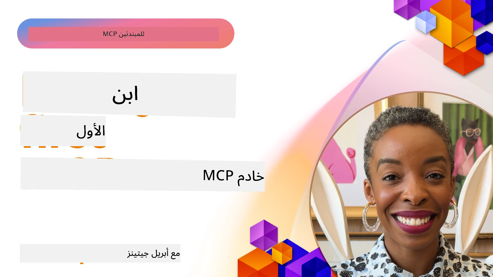

## البدء  

_(انقر فوق الصورة أعلاه لمشاهدة فيديو هذا الدرس)_

يتكون هذا القسم من عدة دروس:

- **1 خادمك الأول**، في هذا الدرس الأول، ستتعلم كيفية إنشاء خادمك الأول وفحصه باستخدام أداة المفتش، وهي طريقة قيمة لاختبار وتصحيح الخادم الخاص بك، [إلى الدرس](01-first-server/README.md)

- **2 العميل**، في هذا الدرس، ستتعلم كيفية كتابة عميل يمكنه الاتصال بخادمك، [إلى الدرس](02-client/README.md)

- **3 العميل مع LLM**، طريقة أفضل لكتابة عميل هي بإضافة LLM إليه بحيث يمكنه "التفاوض" مع خادمك بشأن ما يجب القيام به، [إلى الدرس](03-llm-client/README.md)

- **4 استهلاك خادم MCP في وضع GitHub Copilot Agent في Visual Studio Code**. هنا، ننظر إلى تشغيل خادم MCP الخاص بنا من داخل Visual Studio Code، [إلى الدرس](04-vscode/README.md)

- **5 خادم النقل stdio** نقل stdio هو المعيار الموصى به للتواصل المحلي بين خادم MCP والعميل، ويوفر اتصالًا آمنًا قائمًا على العمليات الفرعية مع عزل العملية المدمج [إلى الدرس](05-stdio-server/README.md)

- **6 البث HTTP مع MCP (HTTP القابل للبث)**. تعلّم حول نقل البث HTTP الحديث (النهج الموصى به لخوادم MCP البعيدة حسب [مواصفة MCP 2025-11-25](https://spec.modelcontextprotocol.io/specification/2025-11-25/basic/transports/#streamable-http))، إشعارات التقدم، وكيفية تنفيذ خوادم وعملاء MCP قابلة للتوسع تعمل في الوقت الحقيقي باستخدام HTTP القابل للبث. [إلى الدرس](06-http-streaming/README.md)

- **7 استخدام مجموعة أدوات الذكاء الاصطناعي لـ VSCode** لاستهلاك واختبار عملاء وخوادم MCP الخاصة بك [إلى الدرس](07-aitk/README.md)

- **8 الاختبار**. هنا سنركز خاصة على كيفية اختبار الخادم والعميل بطرق مختلفة، [إلى الدرس](08-testing/README.md)

- **9 النشر**. ستتناول هذه الفصل طرقًا مختلفة لنشر حلول MCP الخاصة بك، [إلى الدرس](09-deployment/README.md)

- **10 استخدام الخادم المتقدم**. تغطي هذه الفصل الاستخدام المتقدم للخادم، [إلى الدرس](./10-advanced/README.md)

- **11 المصادقة**. تغطي هذه الفصل كيفية إضافة مصادقة بسيطة، من المصادقة الأساسية إلى استخدام JWT وRBAC. يُشجعك على البدء هنا ثم الاطلاع على المواضيع المتقدمة في الفصل 5 وإجراء تعزيزات أمنية إضافية من خلال التوصيات في الفصل 2، [إلى الدرس](./11-simple-auth/README.md)

- **12 مضيفو MCP**. تكوين واستخدام عملاء MCP الشهيرين بما في ذلك Claude Desktop وCursor وCline وWindsurf. تعلّم أنواع النقل واستكشاف المشكلات، [إلى الدرس](./12-mcp-hosts/README.md)

- **13 مفتش MCP**. قم بتصحيح واختبار خوادم MCP الخاصة بك تفاعليًا باستخدام أداة مفتش MCP. تعلّم استكشاف أدوات، موارد، ورسائل البروتوكول، [إلى الدرس](./13-mcp-inspector/README.md)

بروتوكول سياق النموذج (MCP) هو بروتوكول مفتوح يوحد كيفية توفير التطبيقات للسياق لـ LLMs. فكر في MCP كمنفذ USB-C لتطبيقات الذكاء الاصطناعي - فهو يوفر طريقة موحدة لربط نماذج الذكاء الاصطناعي بمصادر بيانات وأدوات مختلفة.

## أهداف التعلم

بحلول نهاية هذا الدرس، ستتمكن من:

- إعداد بيئات تطوير لـ MCP في C# وJava وPython وTypeScript وJavaScript
- بناء ونشر خوادم MCP الأساسية مع ميزات مخصصة (الموارد، الأسئلة، والأدوات)
- إنشاء تطبيقات مضيفة تتصل بخوادم MCP
- اختبار وتصحيح تنفيذات MCP
- فهم تحديات الإعداد الشائعة وحلولها
- ربط تنفيذات MCP بالخدمات الشهيرة لـ LLM

## إعداد بيئة MCP الخاصة بك

قبل أن تبدأ العمل مع MCP، من المهم إعداد بيئة التطوير لديك وفهم سير العمل الأساسي. سيرشدك هذا القسم خلال خطوات الإعداد الأولية لضمان بداية سلسة مع MCP.

### المتطلبات الأساسية

قبل الغوص في تطوير MCP، تأكد من:

- **بيئة تطوير**: للغة التي تختارها (C# أو Java أو Python أو TypeScript أو JavaScript)
- **IDE/المحرر**: Visual Studio، Visual Studio Code، IntelliJ، Eclipse، PyCharm، أو أي محرر أكواد حديث
- **مديرو الحزم**: NuGet، Maven/Gradle، pip، أو npm/yarn
- **مفاتيح API**: لأي خدمات ذكاء اصطناعي تخطط لاستخدامها في تطبيقات المضيف الخاصة بك

### SDKs الرسمية

في الفصول القادمة سترى حلولًا مبنية باستخدام Python وTypeScript وJava و.NET. هنا كل SDKs المدعومة رسميًا.

يوفر MCP SDKs رسمية لعدة لغات (متوافقة مع [مواصفة MCP 2025-11-25](https://spec.modelcontextprotocol.io/specification/2025-11-25/)):
- [SDK لـ C#](https://github.com/modelcontextprotocol/csharp-sdk) - تتم صيانته بالتعاون مع Microsoft
- [SDK لـ Java](https://github.com/modelcontextprotocol/java-sdk) - تتم صيانته بالتعاون مع Spring AI
- [SDK لـ TypeScript](https://github.com/modelcontextprotocol/typescript-sdk) - التنفيذ الرسمي لـ TypeScript
- [SDK لـ Python](https://github.com/modelcontextprotocol/python-sdk) - التنفيذ الرسمي لـ Python (FastMCP)
- [SDK لـ Kotlin](https://github.com/modelcontextprotocol/kotlin-sdk) - التنفيذ الرسمي لـ Kotlin
- [SDK لـ Swift](https://github.com/modelcontextprotocol/swift-sdk) - تتم صيانته بالتعاون مع Loopwork AI
- [SDK لـ Rust](https://github.com/modelcontextprotocol/rust-sdk) - التنفيذ الرسمي لـ Rust
- [SDK لـ Go](https://github.com/modelcontextprotocol/go-sdk) - التنفيذ الرسمي لـ Go

## النقاط الرئيسية

- إعداد بيئة تطوير MCP أمر بسيط مع SDKs الخاصة بكل لغة
- بناء خوادم MCP يتضمن إنشاء وتسجيل أدوات ذات مخططات واضحة
- عملاء MCP يتصلون بالخوادم والنماذج لاستغلال القدرات الموسعة
- الاختبار وتصحيح الأخطاء ضروريان لتنفيذات MCP موثوقة
- خيارات النشر تتراوح من التطوير المحلي إلى الحلول السحابية

## التدريب العملي

لدينا مجموعة من العينات التي تكمل التمارين التي سترى في كل الفصول في هذا القسم. بالإضافة إلى ذلك، كل فصل يحتوي على تمارين وواجبات خاصة به

- [حاسبة Java](./samples/java/calculator/README.md)
- [حاسبة .Net](../../../03-GettingStarted/samples/csharp)
- [حاسبة JavaScript](./samples/javascript/README.md)
- [حاسبة TypeScript](./samples/typescript/README.md)
- [حاسبة Python](../../../03-GettingStarted/samples/python)

## موارد إضافية

- [بناء الوكلاء باستخدام بروتوكول سياق النموذج على Azure](https://learn.microsoft.com/azure/developer/ai/intro-agents-mcp)
- [MCP البعيد مع Azure Container Apps (Node.js/TypeScript/JavaScript)](https://learn.microsoft.com/samples/azure-samples/mcp-container-ts/mcp-container-ts/)
- [وكيل MCP OpenAI لـ .NET](https://learn.microsoft.com/samples/azure-samples/openai-mcp-agent-dotnet/openai-mcp-agent-dotnet/)

## ما التالي

ابدأ بالدرس الأول: [إنشاء أول خادم MCP خاص بك](01-first-server/README.md)

بعد إكمال هذه الوحدة، تابع إلى: [الوحدة 4: التطبيق العملي](../04-PracticalImplementation/README.md)

---

<!-- CO-OP TRANSLATOR DISCLAIMER START -->
**إخلاء المسؤولية**:
تمت ترجمة هذا المستند باستخدام خدمة الترجمة الآلية [Co-op Translator](https://github.com/Azure/co-op-translator). رغم أننا نسعى للدقة، يرجى الانتباه إلى أن الترجمات الآلية قد تحتوي على أخطاء أو عدم دقة. يجب اعتبار المستند الأصلي بلغته الأصلية المصدر الموثوق به. بالنسبة للمعلومات الهامة، يُنصح بالترجمة البشرية المهنية. نحن غير مسؤولين عن أي سوء فهم أو تفسير ناتج عن استخدام هذه الترجمة.
<!-- CO-OP TRANSLATOR DISCLAIMER END -->