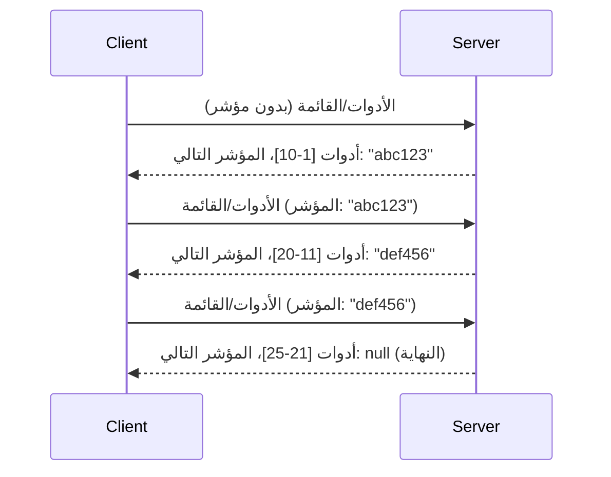

# التجزئة ومجموعات النتائج الكبيرة في MCP

عندما يتعامل خادم MCP الخاص بك مع مجموعات بيانات كبيرة - سواء كانت قائمة بآلاف الملفات، أو سجلات قاعدة البيانات، أو نتائج البحث - تحتاج إلى التجزئة لإدارة الذاكرة بكفاءة وتوفير تجارب مستخدم سريعة الاستجابة. يغطي هذا الدليل كيفية تنفيذ واستخدام التجزئة في MCP.

## لماذا التجزئة مهمة

بدون التجزئة، يمكن أن تتسبب الردود الكبيرة في:

- **استنفاد الذاكرة** - تحميل ملايين السجلات دفعة واحدة
- **بطء أوقات الاستجابة** - ينتظر المستخدمون بينما يتم تحميل كل البيانات
- **أخطاء نفاد الوقت** - الطلبات تتجاوز حدود المهلة
- **أداء ضعيف للذكاء الاصطناعي** - تواجه النماذج اللغوية الكبيرة صعوبة مع السياقات الضخمة

تستخدم MCP **التجزئة المعتمدة على المؤشر** للتنقل الموثوق والمتسق عبر مجموعات النتائج.

---

## كيف تعمل التجزئة في MCP

### مفهوم المؤشر

**المؤشر** هو سلسلة تمثل موقعك في مجموعة النتائج بشكل غير واضح. فكر فيه كإشارة مرجعية في كتاب طويل.


### التجزئة في طرق MCP

تدعم طرق MCP التالية التجزئة:

| Method | Returns | Cursor Support |
|--------|---------|----------------|
| `tools/list` | تعاريف الأدوات | ✅ |
| `resources/list` | تعاريف الموارد | ✅ |
| `prompts/list` | تعاريف المطالبات | ✅ |
| `resources/templates/list` | قوالب الموارد | ✅ |

---

## تنفيذ الخادم

### بايثون (FastMCP)

```python
from mcp.server import Server
from mcp.types import Tool, ListToolsResult
import math

app = Server("paginated-server")

# مجموعة بيانات كبيرة محاكاة
ALL_TOOLS = [
    Tool(name=f"tool_{i}", description=f"Tool number {i}", inputSchema={})
    for i in range(100)
]

PAGE_SIZE = 10

@app.list_tools()
async def list_tools(cursor: str | None = None) -> ListToolsResult:
    """List tools with pagination support."""
    
    # فك ترميز المؤشر للحصول على فهرس البداية
    start_index = 0
    if cursor:
        try:
            start_index = int(cursor)
        except ValueError:
            start_index = 0
    
    # الحصول على صفحة النتائج
    end_index = min(start_index + PAGE_SIZE, len(ALL_TOOLS))
    page_tools = ALL_TOOLS[start_index:end_index]
    
    # حساب المؤشر التالي
    next_cursor = None
    if end_index < len(ALL_TOOLS):
        next_cursor = str(end_index)
    
    return ListToolsResult(
        tools=page_tools,
        nextCursor=next_cursor
    )
```

### تايب سكريبت

```typescript
import { Server } from "@modelcontextprotocol/sdk/server/index.js";
import { ListToolsResultSchema } from "@modelcontextprotocol/sdk/types.js";

const server = new Server({
  name: "paginated-server",
  version: "1.0.0"
});

// مجموعة بيانات كبيرة محاكاة
const ALL_TOOLS = Array.from({ length: 100 }, (_, i) => ({
  name: `tool_${i}`,
  description: `Tool number ${i}`,
  inputSchema: { type: "object", properties: {} }
}));

const PAGE_SIZE = 10;

server.setRequestHandler(ListToolsResultSchema, async (request) => {
  // فك ترميز المؤشر
  let startIndex = 0;
  if (request.params?.cursor) {
    startIndex = parseInt(request.params.cursor, 10) || 0;
  }
  
  // الحصول على صفحة من النتائج
  const endIndex = Math.min(startIndex + PAGE_SIZE, ALL_TOOLS.length);
  const pageTools = ALL_TOOLS.slice(startIndex, endIndex);
  
  // حساب المؤشر التالي
  const nextCursor = endIndex < ALL_TOOLS.length ? String(endIndex) : undefined;
  
  return {
    tools: pageTools,
    nextCursor
  };
});
```

### جافا (Spring MCP)

```java
@Service
public class PaginatedToolService {
    
    private static final int PAGE_SIZE = 10;
    private final List<Tool> allTools;
    
    public PaginatedToolService() {
        // تهيئة مجموعة بيانات كبيرة
        this.allTools = IntStream.range(0, 100)
            .mapToObj(i -> new Tool("tool_" + i, "Tool number " + i, Map.of()))
            .collect(Collectors.toList());
    }
    
    @McpMethod("tools/list")
    public ListToolsResult listTools(@Param("cursor") String cursor) {
        // فك ترميز المؤشر
        int startIndex = 0;
        if (cursor != null && !cursor.isEmpty()) {
            try {
                startIndex = Integer.parseInt(cursor);
            } catch (NumberFormatException e) {
                startIndex = 0;
            }
        }
        
        // الحصول على صفحة من النتائج
        int endIndex = Math.min(startIndex + PAGE_SIZE, allTools.size());
        List<Tool> pageTools = allTools.subList(startIndex, endIndex);
        
        // حساب المؤشر التالي
        String nextCursor = endIndex < allTools.size() ? String.valueOf(endIndex) : null;
        
        return new ListToolsResult(pageTools, nextCursor);
    }
}
```

---

## تنفيذ العميل

### عميل بايثون

```python
from mcp import ClientSession

async def get_all_tools(session: ClientSession) -> list:
    """Fetch all tools using pagination."""
    all_tools = []
    cursor = None
    
    while True:
        result = await session.list_tools(cursor=cursor)
        all_tools.extend(result.tools)
        
        if result.nextCursor is None:
            break
        cursor = result.nextCursor
    
    return all_tools

# الاستخدام
async with client_session as session:
    tools = await get_all_tools(session)
    print(f"Found {len(tools)} tools")
```

### عميل تايب سكريبت

```typescript
import { Client } from "@modelcontextprotocol/sdk/client/index.js";

async function getAllTools(client: Client): Promise<Tool[]> {
  const allTools: Tool[] = [];
  let cursor: string | undefined = undefined;
  
  do {
    const result = await client.listTools({ cursor });
    allTools.push(...result.tools);
    cursor = result.nextCursor;
  } while (cursor);
  
  return allTools;
}

// الاستخدام
const tools = await getAllTools(client);
console.log(`Found ${tools.length} tools`);
```

### نمط التحميل الكسول

لبيانات ضخمة جدًا، قم بتحميل الصفحات عند الطلب:

```python
class PaginatedToolIterator:
    """Lazily iterate through paginated tools."""
    
    def __init__(self, session: ClientSession):
        self.session = session
        self.cursor = None
        self.buffer = []
        self.exhausted = False
    
    async def __anext__(self):
        # إرجاع من المخزن المؤقت إذا كان متاحًا
        if self.buffer:
            return self.buffer.pop(0)
        
        # التحقق مما إذا كنا قد استنفدنا جميع الصفحات
        if self.exhausted:
            raise StopAsyncIteration
        
        # جلب الصفحة التالية
        result = await self.session.list_tools(cursor=self.cursor)
        self.buffer = list(result.tools)
        self.cursor = result.nextCursor
        
        if self.cursor is None:
            self.exhausted = True
        
        if not self.buffer:
            raise StopAsyncIteration
        
        return self.buffer.pop(0)
    
    def __aiter__(self):
        return self

# الاستخدام - فعّال من حيث الذاكرة لمجموعات البيانات الكبيرة
async for tool in PaginatedToolIterator(session):
    process_tool(tool)
```

---

## التجزئة للموارد

غالبًا ما تحتاج الموارد إلى تجزئة للدلائل أو مجموعات البيانات الكبيرة:

```python
from mcp.server import Server
from mcp.types import Resource, ListResourcesResult
import os

app = Server("file-server")

@app.list_resources()
async def list_resources(cursor: str | None = None) -> ListResourcesResult:
    """List files in directory with pagination."""
    
    directory = "/data/files"
    all_files = sorted(os.listdir(directory))
    
    # فك ترميز المؤشر (فهرس الملف)
    start_index = int(cursor) if cursor else 0
    page_size = 20
    end_index = min(start_index + page_size, len(all_files))
    
    # إنشاء قائمة الموارد لهذه الصفحة
    resources = []
    for filename in all_files[start_index:end_index]:
        filepath = os.path.join(directory, filename)
        resources.append(Resource(
            uri=f"file://{filepath}",
            name=filename,
            mimeType="application/octet-stream"
        ))
    
    # حساب المؤشر التالي
    next_cursor = str(end_index) if end_index < len(all_files) else None
    
    return ListResourcesResult(
        resources=resources,
        nextCursor=next_cursor
    )
```

---

## استراتيجيات تصميم المؤشر

### الاستراتيجية 1: قائمة تعتمد على الفهرس (بسيطة)

```python
# المؤشر هو مجرد الفهرس
cursor = "50"  # ابدأ من العنصر 50
```

**الإيجابيات:** بسيطة، لا تحتاج إلى حالة
**السلبيات:** النتائج قد تتغير إذا أضيفت أو أزيلت عناصر

### الاستراتيجية 2: قائمة تعتمد على المعرف (مستقرة)

```python
# المؤشر هو آخر معرّف تم رؤيته
cursor = "item_abc123"  # ابدأ بعد هذا العنصر
```

**الإيجابيات:** مستقرة حتى لو تغيرت العناصر
**السلبيات:** تتطلب معرفات مرتبة

### الاستراتيجية 3: حالة مشفرة (معقدة)

```python
import base64
import json

def encode_cursor(state: dict) -> str:
    return base64.b64encode(json.dumps(state).encode()).decode()

def decode_cursor(cursor: str) -> dict:
    return json.loads(base64.b64decode(cursor).decode())

# المؤشر يحتوي على عدة حقول حالة
cursor = encode_cursor({
    "offset": 50,
    "filter": "active",
    "sort": "name"
})
```

**الإيجابيات:** يمكنها ترميز حالة معقدة
**السلبيات:** أكثر تعقيدًا، والمؤشرات أطول

---

## أفضل الممارسات

### 1. اختر حجم الصفحة المناسب

```python
# ضع في اعتبارك حجم البيانات
PAGE_SIZE_SMALL_ITEMS = 100   # بيانات وصفية بسيطة
PAGE_SIZE_MEDIUM_ITEMS = 20   # كائنات أكثر تعقيدًا
PAGE_SIZE_LARGE_ITEMS = 5     # محتوى معقد
```

### 2. تعامل مع المؤشرات غير الصالحة بلطف

```python
@app.list_tools()
async def list_tools(cursor: str | None = None) -> ListToolsResult:
    try:
        start_index = int(cursor) if cursor else 0
        if start_index < 0 or start_index >= len(ALL_TOOLS):
            start_index = 0  # إعادة الضبط إلى البداية
    except (ValueError, TypeError):
        start_index = 0  # مؤشر غير صالح، ابدأ من جديد
    # ...
```

### 3. تضمين العدد الإجمالي (اختياري)

```python
return ListToolsResult(
    tools=page_tools,
    nextCursor=next_cursor,
    # تتضمن بعض التنفيذات الإجمالي لتقدم واجهة المستخدم
    _meta={"total": len(ALL_TOOLS)}
)
```

### 4. اختبار الحالات الحدية

```python
async def test_pagination():
    # مجموعة نتائج فارغة
    result = await session.list_tools()
    assert result.tools == []
    assert result.nextCursor is None
    
    # صفحة واحدة
    result = await session.list_tools()
    assert len(result.tools) <= PAGE_SIZE
    
    # مؤشر غير صالح
    result = await session.list_tools(cursor="invalid")
    assert result.tools  # يجب أن يرجع الصفحة الأولى
```

---

## الأخطاء الشائعة

### ❌ إعادة جميع النتائج ثم التجزئة من جهة العميل

```python
# سيء: يحمل كل شيء في الذاكرة
@app.list_tools()
async def list_tools() -> ListToolsResult:
    all_tools = load_all_tools()  # مليون أداة!
    return ListToolsResult(tools=all_tools)
```

### ✅ التجزئة عند مصدر البيانات

```python
# جيد: يحمل فقط ما هو مطلوب
@app.list_tools()
async def list_tools(cursor: str | None = None) -> ListToolsResult:
    offset = int(cursor) if cursor else 0
    tools = await db.query_tools(offset=offset, limit=PAGE_SIZE)
    return ListToolsResult(tools=tools, nextCursor=...)
```

---

## ماذا بعد

- [الوحدة 5.14 - هندسة السياق](../../05-AdvancedTopics/mcp-contextengineering/README.md)
- [الوحدة 8 - أفضل الممارسات](../../08-BestPractices/README.md)
- [3.8 - اختبار خادم MCP الخاص بك](../../03-GettingStarted/08-testing/README.md)

---

## موارد إضافية

- [مواصفات MCP - التجزئة](https://spec.modelcontextprotocol.io/specification/2025-11-25/)
- [شرح التجزئة المعتمدة على المؤشر](https://slack.engineering/evolving-api-pagination-at-slack/)
- [اختبارات التجزئة في Python SDK](https://github.com/modelcontextprotocol/python-sdk/blob/main/tests/client/test_list_methods_cursor.py)

---

<!-- CO-OP TRANSLATOR DISCLAIMER START -->
**إخلاء مسؤولية**:
تمت ترجمة هذا المستند باستخدام خدمة الترجمة الآلية [Co-op Translator](https://github.com/Azure/co-op-translator). وعلى الرغم من سعينا للدقة، يرجى العلم أن الترجمات الآلية قد تحتوي على أخطاء أو عدم دقة. يجب اعتبار الوثيقة الأصلية بلغتها الأصلية المصدر المعتمد والموثوق. للحصول على معلومات هامة أو حرجة، يُنصح بالاستعانة بترجمة بشرية محترفة. نحن غير مسؤولين عن أي سوء فهم أو تفسير ناجم عن استخدام هذه الترجمة.
<!-- CO-OP TRANSLATOR DISCLAIMER END -->