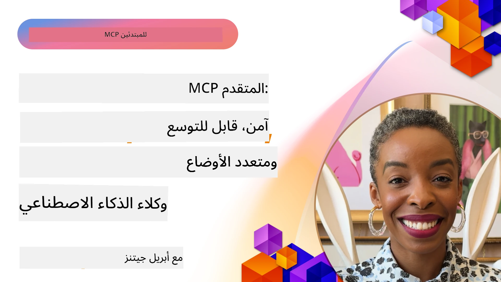

# مواضيع متقدمة في MCP

_(انقر على الصورة أعلاه لمشاهدة فيديو هذا الدرس)_

يتناول هذا الفصل سلسلة من المواضيع المتقدمة في تنفيذ بروتوكول سياق النموذج (MCP)، بما في ذلك التكامل متعدد الوسائط، القابلية للتوسع، أفضل ممارسات الأمان، وتكامل المؤسسات. هذه المواضيع حاسمة لبناء تطبيقات MCP قوية وجاهزة للإنتاج يمكنها تلبية متطلبات أنظمة الذكاء الاصطناعي الحديثة.

## نظرة عامة

يستكشف هذا الدرس مفاهيم متقدمة في تنفيذ بروتوكول سياق النموذج، مع التركيز على التكامل متعدد الوسائط، القابلية للتوسع، أفضل ممارسات الأمان، وتكامل المؤسسات. هذه المواضيع ضرورية لبناء تطبيقات MCP بمستوى إنتاجي يمكنها التعامل مع متطلبات معقدة في بيئات المؤسسات.

## أهداف التعلم

بنهاية هذا الدرس، ستكون قادرًا على:

- تنفيذ قدرات متعددة الوسائط ضمن أُطر MCP
- تصميم بنى MCP قابلة للتوسع لسيناريوهات الطلب العالي
- تطبيق أفضل ممارسات الأمان المتوافقة مع مبادئ أمان MCP
- دمج MCP مع أنظمة وأُطر الذكاء الاصطناعي في المؤسسات
- تحسين الأداء والموثوقية في بيئات الإنتاج

## الدروس والمشاريع النموذجية

| الرابط | العنوان | الوصف |
|------|-------|-------------|
| [5.1 التكامل مع Azure](./mcp-integration/README.md) | التكامل مع Azure | تعلم كيفية دمج خادم MCP الخاص بك على Azure |
| [5.2 نموذج متعدد الوسائط](./mcp-multi-modality/README.md) | عينات MCP متعددة الوسائط  | عينات للصوت، الصورة، والاستجابة متعددة الوسائط |
| [5.3 نموذج MCP OAuth2](../../../05-AdvancedTopics/mcp-oauth2-demo) | عرض توضيحي MCP OAuth2 | تطبيق Spring Boot بسيط يوضح OAuth2 مع MCP، كخادم تفويض وموارد. يوضح إصدار الرموز الآمن، نقاط النهاية المحمية، نشر Azure Container Apps، وتكامل إدارة API. |
| [5.4 السياقات الجذرية](./mcp-root-contexts/README.md) | السياقات الجذرية  | تعرف أكثر على السياق الجذري وكيفية تنفيذه |
| [5.5 التوجيه](./mcp-routing/README.md) | التوجيه | تعلم أنواع التوجيه المختلفة |
| [5.6 العينة](./mcp-sampling/README.md) | العينة | تعلم كيفية العمل مع العينات |
| [5.7 التوسع](./mcp-scaling/README.md) | التوسع  | تعرف على التوسع |
| [5.8 الأمان](./mcp-security/README.md) | الأمان  | تأمين خادم MCP الخاص بك |
| [5.9 نموذج بحث الويب](./web-search-mcp/README.md) | بحث الويب MCP | خادم وعميل MCP بلغة بايثون يدمجان مع SerpAPI للبحث في الويب، الأخبار، المنتجات، والأسئلة والأجوبة في الوقت الحقيقي. يوضح تنسيق الأدوات المتعددة، تكامل API الخارجية، ومعالجة الأخطاء المتينة. |
| [5.10 البث في الوقت الحقيقي](./mcp-realtimestreaming/README.md) | البث  | أصبح البث المباشر للبيانات أساسيًا في عالم البيانات اليوم، حيث تتطلب الأعمال والتطبيقات الوصول الفوري إلى المعلومات لاتخاذ قرارات مناسبة في الوقت المناسب.|
| [5.11 بحث الويب في الوقت الحقيقي](./mcp-realtimesearch/README.md) | بحث الويب | كيف يحول MCP بحث الويب في الوقت الحقيقي من خلال توفير نهج موحد لإدارة السياق عبر نماذج الذكاء الاصطناعي، محركات البحث، والتطبيقات.| 
| [5.12 مصادقة Entra ID لخوادم بروتوكول سياق النموذج](./mcp-security-entra/README.md) | مصادقة Entra ID | يوفر Microsoft Entra ID حلاً قويًا لإدارة الهوية والوصول قائمًا على السحابة، مما يساعد على ضمان أن المستخدمين والتطبيقات المعتمدين فقط يمكنهم التفاعل مع خادم MCP الخاص بك.|
| [5.13 تكامل وكيل Azure AI Foundry](./mcp-foundry-agent-integration/README.md) | تكامل Azure AI Foundry | تعلم كيفية دمج خوادم بروتوكول سياق النموذج مع وكلاء Azure AI Foundry، مما يمكن من تنظيم أدوات قوية وقدرات ذكاء اصطناعي مؤسساتية مع اتصالات مصادر بيانات خارجية موحدة.|
| [5.14 هندسة السياق](./mcp-contextengineering/README.md) | هندسة السياق | الفرصة المستقبلية لتقنيات هندسة السياق لخوادم MCP، بما في ذلك تحسين السياق، إدارة السياق الديناميكية، واستراتيجيات هندسة المطالبات الفعالة ضمن أُطر MCP.|
| [5.15 نقل MCP مخصص](./mcp-transport/README.md) | نقل مخصص | تعلم كيفية تنفيذ آليات نقل مخصصة لسيناريوهات اتصال MCP المتخصصة.|
| [5.16 الغوص العميق في ميزات البروتوكول](./mcp-protocol-features/README.md) | ميزات البروتوكول | اتقن ميزات البروتوكول المتقدمة بما في ذلك إشعارات التقدم، إلغاء الطلبات، قوالب الموارد، وأنماط التعامل مع الأخطاء.|

> **الجديد في مواصفة MCP بتاريخ 2025-11-25**: تتضمن المواصفة الآن دعمًا تجريبيًا لـ **المهام** (عمليات طويلة الأمد مع تتبع التقدم)، **تعليقات الأدوات** (بيانات وصفية حول سلوك الأدوات للسلامة)، **الاستدعاء بوضع URL** (طلب محتوى URL محدد من الجهات العميلة)، و**الجذور المحسنة** (لإدارة سياق مساحة العمل). راجع [سجل التغييرات في مواصفة MCP](https://spec.modelcontextprotocol.io/) لمزيد من التفاصيل.

## مراجع إضافية

للحصول على أحدث المعلومات حول مواضيع MCP المتقدمة، راجع:
- [توثيق MCP](https://modelcontextprotocol.io/)
- [مواصفة MCP (2025-11-25)](https://spec.modelcontextprotocol.io/specification/2025-11-25/)
- [مستودع GitHub](https://github.com/modelcontextprotocol)
- [أهم 10 مخاطر أمنية لـ MCP من OWASP](https://microsoft.github.io/mcp-azure-security-guide/mcp/) - المخاطر الأمنية والتدابير الوقائية
- [ورشة قمة أمان MCP (Sherpa)](https://azure-samples.github.io/sherpa/) - تدريب عملي على الأمان

## النتائج الرئيسية

- توسع تطبيقات MCP متعدد الوسائط قدرات الذكاء الاصطناعي إلى ما بعد معالجة النصوص
- القابلية للتوسع ضرورية للنشر في المؤسسات ويمكن معالجتها عبر التوسع الأفقي والعمودي
- تدابير الأمان الشاملة تحمي البيانات وتضمن السيطرة المناسبة على الوصول
- يعزز التكامل المؤسساتي مع منصات مثل Azure OpenAI وMicrosoft AI Foundry قدرات MCP
- تستفيد تطبيقات MCP المتقدمة من البنى المحسنة وإدارة الموارد الدقيقة

## تمرين

صمم تنفيذ MCP بمستوى مؤسسي لحالة استخدام محددة:

1. حدد متطلبات متعدد الوسائط لحالة الاستخدام الخاصة بك
2. وضع ضوابط الأمان اللازمة لحماية البيانات الحساسة
3. تصميم بنية قابلة للتوسع يمكنها التعامل مع أحمال متغيرة
4. خطط لنقاط التكامل مع أنظمة الذكاء الاصطناعي في المؤسسات
5. وثق الاختناقات المحتملة في الأداء واستراتيجيات التخفيف

## موارد إضافية

- [توثيق Azure OpenAI](https://learn.microsoft.com/en-us/azure/ai-services/openai/)
- [توثيق Microsoft AI Foundry](https://learn.microsoft.com/en-us/ai-services/)

---

## ما التالي

استكشف الدروس في هذه الوحدة بدءًا من: [5.1 تكامل MCP](./mcp-integration/README.md)

بمجرد إكمال هذه الوحدة، تابع إلى: [الوحدة 6: مساهمات المجتمع](../06-CommunityContributions/README.md)

---

<!-- CO-OP TRANSLATOR DISCLAIMER START -->
**تنويه**:  
تمت ترجمة هذا المستند باستخدام خدمة الترجمة الآلية [Co-op Translator](https://github.com/Azure/co-op-translator). في حين نسعى جاهدين لتحقيق الدقة، يرجى العلم أن الترجمات الآلية قد تحتوي على أخطاء أو عدم دقة. يجب اعتبار المستند الأصلي بلغته الأصلية هو المرجع الأساسي والموثوق. للمعلومات الحرجة، يُنصح بالاستعانة بترجمة مهنية من قبل البشر. نحن غير مسؤولين عن أي سوء فهم أو تفسير خاطئ ناتج عن استخدام هذه الترجمة.
<!-- CO-OP TRANSLATOR DISCLAIMER END -->