# الغوص العميق في ميزات بروتوكول MCP

يستعرض هذا الدليل ميزات متقدمة في بروتوكول MCP تتجاوز التعامل الأساسي مع الأدوات والموارد. يساعد فهم هذه الميزات على بناء خوادم MCP أكثر قوة وسهولة في الاستخدام وجاهزة للإنتاج.

## الميزات المغطاة

1. **إشعارات التقدم** - الإبلاغ عن التقدم للعمليات طويلة الأمد  
2. **إلغاء الطلبات** - السماح للعملاء بإلغاء الطلبات الجارية  
3. **قوالب الموارد** - عناوين URI ديناميكية للموارد مع معلمات  
4. **أحداث دورة حياة الخادم** - التهيئة والإيقاف السليم  
5. **التحكم في السجلات** - تكوين السجلات على جانب الخادم  
6. **أنماط معالجة الأخطاء** - ردود أخطاء متسقة  

---

## 1. إشعارات التقدم

للعمليات التي تستغرق وقتاً (معالجة البيانات، تنزيل الملفات، استدعاءات API)، تحافظ إشعارات التقدم على إعلام المستخدمين.

### كيف يعمل

```mermaid
sequenceDiagram
    participant Client
    participant Server
    
    Client->>Server: tools/call (عملية طويلة)
    Server-->>Client: إشعار: التقدم 10%
    Server-->>Client: إشعار: التقدم 50%
    Server-->>Client: إشعار: التقدم 90%
    Server->>Client: النتيجة (مكتملة)
```  


### تنفيذ بايثون

```python
from mcp.server import Server, NotificationOptions
from mcp.types import ProgressNotification
import asyncio

app = Server("progress-server")

@app.tool()
async def process_large_file(file_path: str, ctx) -> str:
    """Process a large file with progress updates."""
    
    # الحصول على حجم الملف لحساب التقدم
    file_size = os.path.getsize(file_path)
    processed = 0
    
    with open(file_path, 'rb') as f:
        while chunk := f.read(8192):
            # معالجة الجزء
            await process_chunk(chunk)
            processed += len(chunk)
            
            # إرسال إشعار التقدم
            progress = (processed / file_size) * 100
            await ctx.send_notification(
                ProgressNotification(
                    progressToken=ctx.request_id,
                    progress=progress,
                    total=100,
                    message=f"Processing: {progress:.1f}%"
                )
            )
    
    return f"Processed {file_size} bytes"

@app.tool()
async def batch_operation(items: list[str], ctx) -> str:
    """Process multiple items with progress."""
    
    results = []
    total = len(items)
    
    for i, item in enumerate(items):
        result = await process_item(item)
        results.append(result)
        
        # الإبلاغ عن التقدم بعد كل عنصر
        await ctx.send_notification(
            ProgressNotification(
                progressToken=ctx.request_id,
                progress=i + 1,
                total=total,
                message=f"Processed {i + 1}/{total}: {item}"
            )
        )
    
    return f"Completed {total} items"
```
  
### تنفيذ TypeScript

```typescript
import { Server } from "@modelcontextprotocol/sdk/server/index.js";

server.setRequestHandler(CallToolSchema, async (request, extra) => {
  const { name, arguments: args } = request.params;
  
  if (name === "process_data") {
    const items = args.items as string[];
    const results = [];
    
    for (let i = 0; i < items.length; i++) {
      const result = await processItem(items[i]);
      results.push(result);
      
      // إرسال إشعار التقدم
      await extra.sendNotification({
        method: "notifications/progress",
        params: {
          progressToken: request.id,
          progress: i + 1,
          total: items.length,
          message: `Processing item ${i + 1}/${items.length}`
        }
      });
    }
    
    return { content: [{ type: "text", text: JSON.stringify(results) }] };
  }
});
```
  
### التعامل من جهة العميل (بايثون)

```python
async def handle_progress(notification):
    """Handle progress notifications from server."""
    params = notification.params
    print(f"Progress: {params.progress}/{params.total} - {params.message}")

# تسجيل المعالج
session.on_notification("notifications/progress", handle_progress)

# استدعاء الأداة (ستصل تحديثات التقدم عبر المعالج)
result = await session.call_tool("process_large_file", {"file_path": "/data/large.csv"})
```
  
---

## 2. إلغاء الطلبات

السماح للعملاء بإلغاء الطلبات التي لم تعد مطلوبة أو تستغرق وقتاً طويلاً.

### تنفيذ بايثون

```python
from mcp.server import Server
from mcp.types import CancelledError
import asyncio

app = Server("cancellable-server")

@app.tool()
async def long_running_search(query: str, ctx) -> str:
    """Search that can be cancelled."""
    
    results = []
    
    try:
        for page in range(100):  # البحث عبر العديد من الصفحات
            # التحقق مما إذا تم طلب الإلغاء
            if ctx.is_cancelled:
                raise CancelledError("Search cancelled by user")
            
            # محاكاة البحث في الصفحة
            page_results = await search_page(query, page)
            results.extend(page_results)
            
            # تأخير صغير يسمح بفحوصات الإلغاء
            await asyncio.sleep(0.1)
            
    except CancelledError:
        # إرجاع نتائج جزئية
        return f"Cancelled. Found {len(results)} results before cancellation."
    
    return f"Found {len(results)} total results"

@app.tool()
async def download_file(url: str, ctx) -> str:
    """Download with cancellation support."""
    
    async with aiohttp.ClientSession() as session:
        async with session.get(url) as response:
            total_size = int(response.headers.get('content-length', 0))
            downloaded = 0
            chunks = []
            
            async for chunk in response.content.iter_chunked(8192):
                if ctx.is_cancelled:
                    return f"Download cancelled at {downloaded}/{total_size} bytes"
                
                chunks.append(chunk)
                downloaded += len(chunk)
            
            return f"Downloaded {downloaded} bytes"
```
  
### تنفيذ سياق الإلغاء

```python
class CancellableContext:
    """Context object that tracks cancellation state."""
    
    def __init__(self, request_id: str):
        self.request_id = request_id
        self._cancelled = asyncio.Event()
        self._cancel_reason = None
    
    @property
    def is_cancelled(self) -> bool:
        return self._cancelled.is_set()
    
    def cancel(self, reason: str = "Cancelled"):
        self._cancel_reason = reason
        self._cancelled.set()
    
    async def check_cancelled(self):
        """Raise if cancelled, otherwise continue."""
        if self.is_cancelled:
            raise CancelledError(self._cancel_reason)
    
    async def sleep_or_cancel(self, seconds: float):
        """Sleep that can be interrupted by cancellation."""
        try:
            await asyncio.wait_for(
                self._cancelled.wait(),
                timeout=seconds
            )
            raise CancelledError(self._cancel_reason)
        except asyncio.TimeoutError:
            pass  # انتهاء المهلة العادية، استمر
```
  
### الإلغاء من جهة العميل

```python
import asyncio

async def search_with_timeout(session, query, timeout=30):
    """Search with automatic cancellation on timeout."""
    
    task = asyncio.create_task(
        session.call_tool("long_running_search", {"query": query})
    )
    
    try:
        result = await asyncio.wait_for(task, timeout=timeout)
        return result
    except asyncio.TimeoutError:
        # طلب الإلغاء
        await session.send_notification({
            "method": "notifications/cancelled",
            "params": {"requestId": task.request_id, "reason": "Timeout"}
        })
        return "Search timed out"
```
  
---

## 3. قوالب الموارد

تتيح قوالب الموارد بناء URI ديناميكي مع معلمات، مفيدة لواجهات برمجة التطبيقات وقواعد البيانات.

### تعريف القوالب

```python
from mcp.server import Server
from mcp.types import ResourceTemplate

app = Server("template-server")

@app.list_resource_templates()
async def list_templates() -> list[ResourceTemplate]:
    """Return available resource templates."""
    return [
        ResourceTemplate(
            uriTemplate="db://users/{user_id}",
            name="User Profile",
            description="Fetch user profile by ID",
            mimeType="application/json"
        ),
        ResourceTemplate(
            uriTemplate="api://weather/{city}/{date}",
            name="Weather Data",
            description="Historical weather for city and date",
            mimeType="application/json"
        ),
        ResourceTemplate(
            uriTemplate="file://{path}",
            name="File Content",
            description="Read file at given path",
            mimeType="text/plain"
        )
    ]

@app.read_resource()
async def read_resource(uri: str) -> str:
    """Read resource, expanding template parameters."""
    
    # تحليل عنوان URI لاستخراج المعاملات
    if uri.startswith("db://users/"):
        user_id = uri.split("/")[-1]
        return await fetch_user(user_id)
    
    elif uri.startswith("api://weather/"):
        parts = uri.replace("api://weather/", "").split("/")
        city, date = parts[0], parts[1]
        return await fetch_weather(city, date)
    
    elif uri.startswith("file://"):
        path = uri.replace("file://", "")
        return await read_file(path)
    
    raise ValueError(f"Unknown resource URI: {uri}")
```
  
### تنفيذ TypeScript

```typescript
server.setRequestHandler(ListResourceTemplatesSchema, async () => {
  return {
    resourceTemplates: [
      {
        uriTemplate: "github://repos/{owner}/{repo}/issues/{issue_number}",
        name: "GitHub Issue",
        description: "Fetch a specific GitHub issue",
        mimeType: "application/json"
      },
      {
        uriTemplate: "db://tables/{table}/rows/{id}",
        name: "Database Row",
        description: "Fetch a row from a database table",
        mimeType: "application/json"
      }
    ]
  };
});

server.setRequestHandler(ReadResourceSchema, async (request) => {
  const uri = request.params.uri;
  
  // تحليل معرف مشكلة GitHub
  const githubMatch = uri.match(/^github:\/\/repos\/([^/]+)\/([^/]+)\/issues\/(\d+)$/);
  if (githubMatch) {
    const [_, owner, repo, issueNumber] = githubMatch;
    const issue = await fetchGitHubIssue(owner, repo, parseInt(issueNumber));
    return {
      contents: [{
        uri,
        mimeType: "application/json",
        text: JSON.stringify(issue, null, 2)
      }]
    };
  }
  
  throw new Error(`Unknown resource URI: ${uri}`);
});
```
  
---

## 4. أحداث دورة حياة الخادم

التعامل الصحيح مع التهيئة والإيقاف يضمن إدارة نظيفة للموارد.

### إدارة دورة الحياة في بايثون

```python
from mcp.server import Server
from contextlib import asynccontextmanager

app = Server("lifecycle-server")

# الحالة المشتركة
db_connection = None
cache = None

@asynccontextmanager
async def lifespan(server: Server):
    """Manage server lifecycle."""
    global db_connection, cache
    
    # بدء التشغيل
    print("🚀 Server starting...")
    db_connection = await create_database_connection()
    cache = await create_cache_client()
    print("✅ Resources initialized")
    
    yield  # الخادم يعمل هنا
    
    # إيقاف التشغيل
    print("🛑 Server shutting down...")
    await db_connection.close()
    await cache.close()
    print("✅ Resources cleaned up")

app = Server("lifecycle-server", lifespan=lifespan)

@app.tool()
async def query_database(sql: str) -> str:
    """Use the shared database connection."""
    result = await db_connection.execute(sql)
    return str(result)
```
  
### دورة الحياة في TypeScript

```typescript
import { Server } from "@modelcontextprotocol/sdk/server/index.js";

class ManagedServer {
  private server: Server;
  private dbConnection: DatabaseConnection | null = null;
  
  constructor() {
    this.server = new Server({
      name: "lifecycle-server",
      version: "1.0.0"
    });
    
    this.setupHandlers();
  }
  
  async start() {
    // تهيئة الموارد
    console.log("🚀 Server starting...");
    this.dbConnection = await createDatabaseConnection();
    console.log("✅ Database connected");
    
    // بدء الخادم
    await this.server.connect(transport);
  }
  
  async stop() {
    // تنظيف الموارد
    console.log("🛑 Server shutting down...");
    if (this.dbConnection) {
      await this.dbConnection.close();
    }
    await this.server.close();
    console.log("✅ Cleanup complete");
  }
  
  private setupHandlers() {
    this.server.setRequestHandler(CallToolSchema, async (request) => {
      // استخدم this.dbConnection بأمان
      // ...
    });
  }
}

// الاستخدام مع الإيقاف الآمن
const server = new ManagedServer();

process.on('SIGINT', async () => {
  await server.stop();
  process.exit(0);
});

await server.start();
```
  
---

## 5. التحكم في السجلات

يدعم MCP مستويات تسجيل على جانب الخادم يمكن للعملاء التحكم بها.

### تنفيذ مستويات التسجيل

```python
from mcp.server import Server
from mcp.types import LoggingLevel
import logging

app = Server("logging-server")

# قم بربط مستويات MCP بمستويات تسجيل الدخول في بايثون
LEVEL_MAP = {
    LoggingLevel.DEBUG: logging.DEBUG,
    LoggingLevel.INFO: logging.INFO,
    LoggingLevel.WARNING: logging.WARNING,
    LoggingLevel.ERROR: logging.ERROR,
}

logger = logging.getLogger("mcp-server")

@app.set_logging_level()
async def set_logging_level(level: LoggingLevel) -> None:
    """Handle client request to change logging level."""
    python_level = LEVEL_MAP.get(level, logging.INFO)
    logger.setLevel(python_level)
    logger.info(f"Logging level set to {level}")

@app.tool()
async def debug_operation(data: str) -> str:
    """Tool with various logging levels."""
    logger.debug(f"Processing data: {data}")
    
    try:
        result = process(data)
        logger.info(f"Successfully processed: {result}")
        return result
    except Exception as e:
        logger.error(f"Processing failed: {e}")
        raise
```
  
### إرسال رسائل السجل إلى العميل

```python
@app.tool()
async def complex_operation(input: str, ctx) -> str:
    """Operation that logs to client."""
    
    # إرسال إشعار السجل إلى العميل
    await ctx.send_log(
        level="info",
        message=f"Starting complex operation with input: {input}"
    )
    
    # يقوم بالعمل...
    result = await do_work(input)
    
    await ctx.send_log(
        level="debug",
        message=f"Operation complete, result size: {len(result)}"
    )
    
    return result
```
  
---

## 6. أنماط معالجة الأخطاء

تعالج الأخطاء بأسلوب متناسق مما يحسن من التصحيح وتجربة المستخدم.

### رموز أخطاء MCP

```python
from mcp.types import McpError, ErrorCode

class ToolError(McpError):
    """Base class for tool errors."""
    pass

class ValidationError(ToolError):
    """Invalid input parameters."""
    def __init__(self, message: str):
        super().__init__(ErrorCode.INVALID_PARAMS, message)

class NotFoundError(ToolError):
    """Requested resource not found."""
    def __init__(self, resource: str):
        super().__init__(ErrorCode.INVALID_REQUEST, f"Not found: {resource}")

class PermissionError(ToolError):
    """Access denied."""
    def __init__(self, action: str):
        super().__init__(ErrorCode.INVALID_REQUEST, f"Permission denied: {action}")

class InternalError(ToolError):
    """Internal server error."""
    def __init__(self, message: str):
        super().__init__(ErrorCode.INTERNAL_ERROR, message)
```
  
### ردود الأخطاء المهيكلة

```python
@app.tool()
async def safe_operation(input: str) -> str:
    """Tool with comprehensive error handling."""
    
    # التحقق من صحة الإدخال
    if not input:
        raise ValidationError("Input cannot be empty")
    
    if len(input) > 10000:
        raise ValidationError(f"Input too large: {len(input)} chars (max 10000)")
    
    try:
        # التحقق من الأذونات
        if not await check_permission(input):
            raise PermissionError(f"read {input}")
        
        # تنفيذ العملية
        result = await perform_operation(input)
        
        if result is None:
            raise NotFoundError(input)
        
        return result
        
    except ConnectionError as e:
        raise InternalError(f"Database connection failed: {e}")
    except TimeoutError as e:
        raise InternalError(f"Operation timed out: {e}")
    except Exception as e:
        # تسجيل الأخطاء غير المتوقعة
        logger.exception(f"Unexpected error in safe_operation")
        raise InternalError(f"Unexpected error: {type(e).__name__}")
```
  
### معالجة الأخطاء في TypeScript

```typescript
import { McpError, ErrorCode } from "@modelcontextprotocol/sdk/types.js";

function validateInput(data: unknown): asserts data is ValidInput {
  if (typeof data !== "object" || data === null) {
    throw new McpError(
      ErrorCode.InvalidParams,
      "Input must be an object"
    );
  }
  // المزيد من التحقق...
}

server.setRequestHandler(CallToolSchema, async (request) => {
  try {
    validateInput(request.params.arguments);
    
    const result = await performOperation(request.params.arguments);
    
    return {
      content: [{ type: "text", text: JSON.stringify(result) }]
    };
    
  } catch (error) {
    if (error instanceof McpError) {
      throw error;  // خطأ MCP موجود بالفعل
    }
    
    // تحويل الأخطاء الأخرى
    if (error instanceof NotFoundError) {
      throw new McpError(ErrorCode.InvalidRequest, error.message);
    }
    
    // خطأ غير معروف
    console.error("Unexpected error:", error);
    throw new McpError(
      ErrorCode.InternalError,
      "An unexpected error occurred"
    );
  }
});
```
  
---

## الميزات التجريبية (MCP 2025-11-25)

تم تمييز هذه الميزات كتجريبية في المواصفة:

### المهام (العمليات طويلة الأمد)

```python
# تسمح المهام بتتبع العمليات طويلة الأمد مع الحالة
@app.task()
async def training_task(model_id: str, data_path: str, ctx) -> str:
    """Long-running ML training task."""
    
    # الإبلاغ عن بدء المهمة
    await ctx.report_status("running", "Initializing training...")
    
    # حلقة التدريب
    for epoch in range(100):
        await train_epoch(model_id, data_path, epoch)
        await ctx.report_status(
            "running",
            f"Training epoch {epoch + 1}/100",
            progress=epoch + 1,
            total=100
        )
    
    await ctx.report_status("completed", "Training finished")
    return f"Model {model_id} trained successfully"
```
  
### تعليمات الأدوات

```python
# توفر التعليقات التوضيحية بيانات وصفية حول سلوك الأداة
@app.tool(
    annotations={
        "destructive": False,      # لا يُعدّل البيانات
        "idempotent": True,        # آمن للمحاولة مرة أخرى
        "timeout_seconds": 30,     # أقصى مدة متوقعة
        "requires_approval": False # لا حاجة لموافقة المستخدم
    }
)
async def safe_query(query: str) -> str:
    """A read-only database query tool."""
    return await execute_read_query(query)
```
  
---

## ماذا بعد

- [الوحدة 8 - أفضل الممارسات](../../08-BestPractices/README.md)  
- [5.14 - هندسة السياق](../mcp-contextengineering/README.md)  
- [سجل تغييرات مواصفة MCP](https://spec.modelcontextprotocol.io/)  

---

## موارد إضافية

- [مواصفة MCP 2025-11-25](https://spec.modelcontextprotocol.io/specification/2025-11-25/)  
- [رموز أخطاء JSON-RPC 2.0](https://www.jsonrpc.org/specification#error_object)  
- [أمثلة SDK بايثون](https://github.com/modelcontextprotocol/python-sdk/tree/main/examples)  
- [أمثلة SDK TypeScript](https://github.com/modelcontextprotocol/typescript-sdk/tree/main/examples)

---

<!-- CO-OP TRANSLATOR DISCLAIMER START -->
**إخلاء المسؤولية**:
تمت ترجمة هذا المستند باستخدام خدمة الترجمة بالذكاء الاصطناعي [Co-op Translator](https://github.com/Azure/co-op-translator). بينما نسعى لتحقيق الدقة، يُرجى العلم بأن الترجمات الآلية قد تحتوي على أخطاء أو عدم دقة. يجب اعتبار المستند الأصلي بلغته الأصلية المصدر الرسمي والمعتمد. للمعلومات الهامة، يُنصح بالترجمة الاحترافية البشرية. نحن غير مسؤولين عن أي سوء فهم أو تفسير ناتج عن استخدام هذه الترجمة.
<!-- CO-OP TRANSLATOR DISCLAIMER END -->