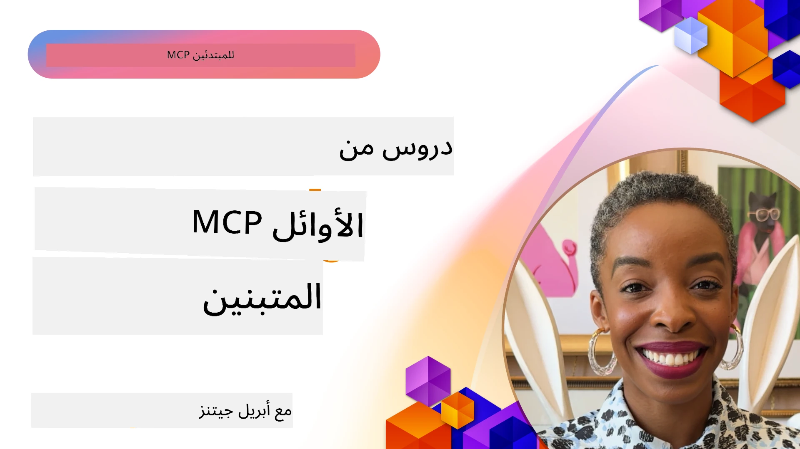

# 🌟 دروس من المستخدمين الأوائل

[](https://youtu.be/jds7dSmNptE)

_(انقر على الصورة أعلاه لمشاهدة فيديو هذا الدرس)_

## 🎯 ما يغطيه هذا الوحدة

تستكشف هذه الوحدة كيف تستفيد المنظمات والمطورون الحقيقيون من بروتوكول سياق النموذج (MCP) لحل التحديات الواقعية ودفع الابتكار. من خلال دراسات حالة مفصلة، ومشاريع تطبيقية، وأمثلة عملية، ستكتشف كيف يمكن لبروتوكول MCP تمكين دمج آمن وقابل للتوسع للذكاء الاصطناعي الذي يربط نماذج اللغة، الأدوات، وبيانات المؤسسة.

### 📚 شاهد MCP في العمل

هل تريد رؤية هذه المبادئ مُطبقة على أدوات جاهزة للإنتاج؟ اطلع على [**10 خوادم MCP من Microsoft التي تغيّر إنتاجية المطورين**](microsoft-mcp-servers.md)، والتي تعرض خوادم MCP الحقيقية من Microsoft التي يمكنك استخدامها اليوم.

## نظرة عامة

يستكشف هذا الدرس كيف استخدم المستخدمون الأوائل بروتوكول سياق النموذج (MCP) لحل تحديات العالم الواقعي ودفع الابتكار عبر الصناعات. من خلال دراسات حالة مفصلة ومشاريع تطبيقية، سترى كيف يمكّن MCP من دمج الذكاء الاصطناعي الموحد، القياسي، الآمن والقابل للتوسع — من خلال ربط نماذج اللغة الكبيرة، الأدوات، وبيانات المؤسسة في إطار موحد. ستحصل على خبرة عملية في تصميم وبناء حلول معتمدة على MCP، تتعلم من أنماط تنفيذ مثبتة، وتكتشف أفضل الممارسات لنشر MCP في بيئات الإنتاج. كما يسلط الدرس الضوء على الاتجاهات الناشئة، الاتجاهات المستقبلية، والمصادر المفتوحة لمساعدتك في البقاء في طليعة تقنية MCP وبيئتها المتطورة.

## أهداف التعلم

- تحليل تطبيقات MCP الواقعية عبر صناعات مختلفة  
- تصميم وبناء تطبيقات كاملة تعتمد على MCP  
- استكشاف الاتجاهات الناشئة والاتجاهات المستقبلية في تقنية MCP  
- تطبيق أفضل الممارسات في سيناريوهات تطوير حقيقية  

## تطبيقات MCP في العالم الحقيقي

### دراسة حالة 1: أتمتة دعم العملاء في المؤسسات

نفذت شركة متعددة الجنسيات حلاً يعتمد على MCP لتوحيد التفاعلات مع الذكاء الاصطناعي عبر أنظمة دعم العملاء لديها. مما سمح لهم بـ:

- إنشاء واجهة موحدة لمزودي نماذج اللغة الكبيرة المتعددة  
- الحفاظ على إدارة ثابتة للمطالب عبر الأقسام  
- تطبيق ضوابط أمنية وامتثال قوية  
- التبديل بسهولة بين النماذج الذكية المختلفة حسب الاحتياجات الخاصة  

**التنفيذ الفني:**

```python
# تنفيذ خادم MCP بلغة بايثون لدعم العملاء
import logging
import asyncio
from modelcontextprotocol import create_server, ServerConfig
from modelcontextprotocol.server import MCPServer
from modelcontextprotocol.transports import create_http_transport
from modelcontextprotocol.resources import ResourceDefinition
from modelcontextprotocol.prompts import PromptDefinition
from modelcontextprotocol.tool import ToolDefinition

# تكوين تسجيل الدخول
logging.basicConfig(level=logging.INFO)

async def main():
    # إنشاء تكوين الخادم
    config = ServerConfig(
        name="Enterprise Customer Support Server",
        version="1.0.0",
        description="MCP server for handling customer support inquiries"
    )
    
    # تهيئة خادم MCP
    server = create_server(config)
    
    # تسجيل مصادر قاعدة المعرفة
    server.resources.register(
        ResourceDefinition(
            name="customer_kb",
            description="Customer knowledge base documentation"
        ),
        lambda params: get_customer_documentation(params)
    )
    
    # تسجيل قوالب الموجه
    server.prompts.register(
        PromptDefinition(
            name="support_template",
            description="Templates for customer support responses"
        ),
        lambda params: get_support_templates(params)
    )
    
    # تسجيل أدوات الدعم
    server.tools.register(
        ToolDefinition(
            name="ticketing",
            description="Create and update support tickets"
        ),
        handle_ticketing_operations
    )
    
    # بدء الخادم باستخدام النقل عبر HTTP
    transport = create_http_transport(port=8080)
    await server.run(transport)

if __name__ == "__main__":
    asyncio.run(main())
```
  
**النتائج:** انخفاض بنسبة 30% في تكاليف النماذج، تحسن بنسبة 45% في اتساق الردود، وتعزيز الامتثال عبر العمليات العالمية.

### دراسة حالة 2: مساعد التشخيص الطبي

طور مزود خدمات صحية بنية MCP لدمج عدة نماذج طبية متخصصة بالذكاء الاصطناعي مع ضمان حماية بيانات المرضى الحساسة:

- التبديل السلس بين نماذج طبية عامة ومتخصصة  
- ضوابط خصوصية صارمة ومسارات تدقيق  
- التكامل مع أنظمة السجلات الصحية الإلكترونية الحالية (EHR)  
- هندسة مطالب متسقة للمصطلحات الطبية  

**التنفيذ الفني:**

```csharp
// C# MCP host application implementation in healthcare application
using Microsoft.Extensions.DependencyInjection;
using ModelContextProtocol.SDK.Client;
using ModelContextProtocol.SDK.Security;
using ModelContextProtocol.SDK.Resources;

public class DiagnosticAssistant
{
    private readonly MCPHostClient _mcpClient;
    private readonly PatientContext _patientContext;
    
    public DiagnosticAssistant(PatientContext patientContext)
    {
        _patientContext = patientContext;
        
        // Configure MCP client with healthcare-specific settings
        var clientOptions = new ClientOptions
        {
            Name = "Healthcare Diagnostic Assistant",
            Version = "1.0.0",
            Security = new SecurityOptions
            {
                Encryption = EncryptionLevel.Medical,
                AuditEnabled = true
            }
        };
        
        _mcpClient = new MCPHostClientBuilder()
            .WithOptions(clientOptions)
            .WithTransport(new HttpTransport("https://healthcare-mcp.example.org"))
            .WithAuthentication(new HIPAACompliantAuthProvider())
            .Build();
    }
    
    public async Task<DiagnosticSuggestion> GetDiagnosticAssistance(
        string symptoms, string patientHistory)
    {
        // Create request with appropriate resources and tool access
        var resourceRequest = new ResourceRequest
        {
            Name = "patient_records",
            Parameters = new Dictionary<string, object>
            {
                ["patientId"] = _patientContext.PatientId,
                ["requestingProvider"] = _patientContext.ProviderId
            }
        };
        
        // Request diagnostic assistance using appropriate prompt
        var response = await _mcpClient.SendPromptRequestAsync(
            promptName: "diagnostic_assistance",
            parameters: new Dictionary<string, object>
            {
                ["symptoms"] = symptoms,
                patientHistory = patientHistory,
                relevantGuidelines = _patientContext.GetRelevantGuidelines()
            });
            
        return DiagnosticSuggestion.FromMCPResponse(response);
    }
}
```
  
**النتائج:** تحسن الاقتراحات التشخيصية للأطباء مع الاحتفاظ بالامتثال الكامل لـ HIPAA وتقليل كبير في تبديل السياق بين الأنظمة.

### دراسة حالة 3: تحليل المخاطر في الخدمات المالية

طبقت مؤسسة مالية MCP لتوحيد عمليات تحليل المخاطر عبر الأقسام المختلفة:

- إنشاء واجهة موحدة لنماذج مخاطر الائتمان، الكشف عن الاحتيال، ومخاطر الاستثمار  
- تطبيق ضوابط وصول صارمة وإدارة إصدارات النماذج  
- ضمان قابلية التدقيق لجميع توصيات الذكاء الاصطناعي  
- الحفاظ على تنسيق بيانات متسق عبر الأنظمة المتنوعة  

**التنفيذ الفني:**

```java
// خادم MCP بلغة جافا لتقييم المخاطر المالية
import org.mcp.server.*;
import org.mcp.security.*;

public class FinancialRiskMCPServer {
    public static void main(String[] args) {
        // إنشاء خادم MCP بميزات الامتثال المالي
        MCPServer server = new MCPServerBuilder()
            .withModelProviders(
                new ModelProvider("risk-assessment-primary", new AzureOpenAIProvider()),
                new ModelProvider("risk-assessment-audit", new LocalLlamaProvider())
            )
            .withPromptTemplateDirectory("./compliance/templates")
            .withAccessControls(new SOCCompliantAccessControl())
            .withDataEncryption(EncryptionStandard.FINANCIAL_GRADE)
            .withVersionControl(true)
            .withAuditLogging(new DatabaseAuditLogger())
            .build();
            
        server.addRequestValidator(new FinancialDataValidator());
        server.addResponseFilter(new PII_RedactionFilter());
        
        server.start(9000);
        
        System.out.println("Financial Risk MCP Server running on port 9000");
    }
}
```
  
**النتائج:** تعزز الامتثال التنظيمي، دورات نشر نماذج أسرع بنسبة 40%، وتحسن اتساق تقييم المخاطر بين الأقسام.

### دراسة حالة 4: خادم Playwright MCP من Microsoft لأتمتة المتصفح

طورت Microsoft [خادم Playwright MCP](https://github.com/microsoft/playwright-mcp) لتمكين أتمتة متصفح آمنة وموحدة عبر بروتوكول سياق النموذج. يتيح هذا الخادم الجاهز للإنتاج لوكلاء الذكاء الاصطناعي ونماذج اللغة الكبيرة التفاعل مع متصفحات الويب بطريقة محكمة، قابلة للتدقيق وقابلة للتوسيع — مما يمكّن حالات استخدام مثل اختبار الويب التلقائي، استخراج البيانات، وسير عمل متكامل.

> **🎯 أداة جاهزة للإنتاج**  
> 
> تعرض هذه الدراسة خادم MCP حقيقي يمكنك استخدامه اليوم! تعرف أكثر على خادم Playwright MCP و9 من خوادم MCP الأخرى الجاهزة للإنتاج من Microsoft في دليلنا [**Microsoft MCP Servers Guide**](microsoft-mcp-servers.md#8--playwright-mcp-server).

**الميزات الرئيسية:**  
- يعرض قدرات أتمتة المتصفح (التنقل، ملء النماذج، التقاط لقطات شاشة، إلخ) كأدوات MCP  
- يطبق ضوابط وصول صارمة وعزل بيئة لضمان منع الإجراءات غير المصرح بها  
- يوفر سجلات تدقيق مفصلة لجميع التفاعلات مع المتصفح  
- يدعم التكامل مع Azure OpenAI ومزودي LLM الآخرين لأتمتة مدفوعة بالوكيل  
- يمدّد قدرات GitHub Copilot Coding Agent بواسطة تصفح الويب  

**التنفيذ الفني:**

```typescript
// TypeScript: تسجيل أدوات تشغيل المستعرض Playwright في خادم MCP
import { createServer, ToolDefinition } from 'modelcontextprotocol';
import { launch } from 'playwright';

const server = createServer({
  name: 'Playwright MCP Server',
  version: '1.0.0',
  description: 'MCP server for browser automation using Playwright'
});

// تسجيل أداة للتنقل إلى عنوان URL والتقاط لقطة شاشة
server.tools.register(
  new ToolDefinition({
    name: 'navigate_and_screenshot',
    description: 'Navigate to a URL and capture a screenshot',
    parameters: {
      url: { type: 'string', description: 'The URL to visit' }
    }
  }),
  async ({ url }) => {
    const browser = await launch();
    const page = await browser.newPage();
    await page.goto(url);
    const screenshot = await page.screenshot();
    await browser.close();
    return { screenshot };
  }
);

// بدء تشغيل خادم MCP
server.listen(8080);
```
  
**النتائج:**  

- أتمتة تصفح متصفح مبرمجة وآمنة لوكلاء الذكاء الاصطناعي ونماذج اللغة الكبيرة  
- تقليل الجهد اليدوي في الاختبار وتحسين تغطية الاختبارات لتطبيقات الويب  
- تقديم إطار عمل قابل لإعادة الاستخدام والتوسيع لتكامل أدوات التصفح المستند إلى المتصفح في بيئات المؤسسات  
- يمدّد إمكانيات تصفح الويب لـ GitHub Copilot  

**المراجع:**

- [مستودع GitHub لخادم Playwright MCP](https://github.com/microsoft/playwright-mcp)  
- [حلول الذكاء الاصطناعي والأتمتة من Microsoft](https://azure.microsoft.com/en-us/products/ai-services/)

### دراسة حالة 5: Azure MCP – بروتوكول سياق النموذج بمستوى المؤسسات كخدمة

يعد خادم Azure MCP ([https://aka.ms/azmcp](https://aka.ms/azmcp)) تطبيق Microsoft المدار من طراز المؤسسات لبروتوكول سياق النموذج، مصمم لتقديم قدرات خادم MCP آمنة، متوافقة وقابلة للتوسع كخدمة سحابية. يمكّن Azure MCP المؤسسات من النشر السريع، الإدارة، والتكامل مع Azure AI، البيانات، وخدمات الأمان، مما يقلل من الأعباء التشغيلية ويسرع تبني الذكاء الاصطناعي.

> **🎯 أداة جاهزة للإنتاج**  
> 
> هذا خادم MCP حقيقي يمكنك استخدامه اليوم! تعرف أكثر عن خادم Azure AI Foundry MCP في دليلنا [**Microsoft MCP Servers Guide**](microsoft-mcp-servers.md).

- استضافة خادم MCP مُدارة بالكامل مع دعم التوسع، المراقبة، والأمان المدمج  
- تكامل أصلي مع Azure OpenAI، Azure AI Search، وخدمات Azure الأخرى  
- المصادقة والتفويض المؤسسي عبر Microsoft Entra ID  
- دعم الأدوات المخصصة، قوالب المطالب، وموصلات الموارد  
- الامتثال لمتطلبات الأمان التنظيمية والمؤسسية  

**التنفيذ الفني:**

```yaml
# Example: Azure MCP server deployment configuration (YAML)
apiVersion: mcp.microsoft.com/v1
kind: McpServer
metadata:
  name: enterprise-mcp-server
spec:
  modelProviders:
    - name: azure-openai
      type: AzureOpenAI
      endpoint: https://<your-openai-resource>.openai.azure.com/
      apiKeySecret: <your-azure-keyvault-secret>
  tools:
    - name: document_search
      type: AzureAISearch
      endpoint: https://<your-search-resource>.search.windows.net/
      apiKeySecret: <your-azure-keyvault-secret>
  authentication:
    type: EntraID
    tenantId: <your-tenant-id>
  monitoring:
    enabled: true
    logAnalyticsWorkspace: <your-log-analytics-id>
```
  
**النتائج:**  
- تقليل الوقت للوصول إلى القيمة لمشاريع الذكاء الاصطناعي المؤسسية من خلال تقديم منصة خادم MCP جاهزة وممتثلة  
- تبسيط دمج نماذج اللغة الكبيرة، الأدوات، ومصادر بيانات المؤسسة  
- تحسين الأمان، المراقبة، والكفاءة التشغيلية لأحمال عمل MCP  
- تحسين جودة الشفرة مع أفضل ممارسات SDK من Azure وأنماط المصادقة الحالية  

**المراجع:**  
- [وثائق Azure MCP](https://aka.ms/azmcp)  
- [مستودع خادم Azure MCP على GitHub](https://github.com/Azure/azure-mcp)  
- [خدمات الذكاء الاصطناعي في Azure](https://azure.microsoft.com/en-us/products/ai-services/)  
- [مركز Microsoft MCP](https://mcp.azure.com)

## دراسة حالة 6: NLWeb

بروتوكول MCP (بروتوكول سياق النموذج) هو بروتوكول ناشئ للدردشة وروبوتات المساعد الذكي للتفاعل مع الأدوات. كل مثيل NLWeb هو أيضًا خادم MCP، يدعم طريقة أساسية واحدة، ask، تُستخدم لطرح سؤال على موقع ويب بلغة طبيعية. يستخدم الرد المستلم vocabulary الخاص بـ schema.org، وهو مفردات مستخدمة على نطاق واسع لوصف بيانات الويب. بشكل مبسط، MCP هو NLWeb كما HTTP هو لـ HTML. يجمع NLWeb بين البروتوكولات، تنسيقات Schema.org، والتعليمات البرمجية النموذجية لمساعدة المواقع على إنشاء هذه النهايات بسرعة، مما يفيد البشر من خلال واجهات المحادثة والآلات من خلال التفاعل الطبيعي بين الوكلاء.

هناك مكونان مميزان لـ NLWeb.  
- بروتوكول، بسيط جدًا للبداية، لواجهة التفاعل مع الموقع بلغة طبيعية وتنسيق يستخدم json وschema.org للإجابة المستلمة. راجع التوثيق الخاص بواجهة REST API لمزيد من التفاصيل.  
- تنفيذ مباشر لـ (1) يستفيد من العلامات الموجودة، للمواقع التي يمكن تجريدها كقوائم من العناصر (منتجات، وصفات، معالم، مراجعات، إلخ). مع مجموعة من عناصر واجهة المستخدم، يمكن للمواقع بسهولة توفير واجهات محادثة لمحتوياتها. راجع التوثيق Life of a chat query لمزيد من التفاصيل حول كيفية العمل.

**المراجع:**  
- [وثائق Azure MCP](https://aka.ms/azmcp)  
- [NLWeb](https://github.com/microsoft/NlWeb)

### دراسة حالة 7: خادم Azure AI Foundry MCP – تكامل وكلاء الذكاء الاصطناعي المؤسسي

توضح خوادم Azure AI Foundry MCP كيف يستخدم MCP لتنظيم وإدارة وكلاء الذكاء الاصطناعي وسير العمل في بيئات المؤسسات. من خلال دمج MCP مع Azure AI Foundry، يمكن للمؤسسات توحيد تفاعلات الوكلاء، الاستفادة من إدارة سير العمل لـ Foundry، وضمان نشر آمن وقابل للتوسع.

> **🎯 أداة جاهزة للإنتاج**  
> 
> هذا خادم MCP حقيقي يمكنك استخدامه اليوم! تعرف أكثر عن خادم Azure AI Foundry MCP في دليلنا [**Microsoft MCP Servers Guide**](microsoft-mcp-servers.md#9--azure-ai-foundry-mcp-server).

**الميزات الرئيسية:**  
- وصول شامل لنظام Azure البيئي الذكي، بما في ذلك كتالوجات النماذج وإدارة النشر  
- فهرسة المعرفة باستخدام Azure AI Search لتطبيقات RAG  
- أدوات التقييم لأداء النموذج وضمان الجودة  
- التكامل مع كتالوج ومعامل Azure AI Foundry لأحدث نماذج البحث  
- إدارة وتقييم الوكلاء لسيناريوهات الإنتاج  

**النتائج:**  
- النمذجة السريعة والمراقبة القوية لسير عمل وكلاء الذكاء الاصطناعي  
- تكامل سلس مع خدمات Azure AI للسيناريوهات المتقدمة  
- واجهة موحدة لبناء، نشر، ومراقبة خطوط عمل الوكلاء  
- تحسين الأمان والامتثال والكفاءة التشغيلية للمؤسسات  
- تسريع تبني الذكاء الاصطناعي مع الحفاظ على التحكم في العمليات المعقدة المدفوعة بالوكلاء  

**المراجع:**  
- [مستودع GitHub لخادم Azure AI Foundry MCP](https://github.com/azure-ai-foundry/mcp-foundry)  
- [دمج وكلاء الذكاء الاصطناعي في Azure مع MCP (مدونة Microsoft Foundry)](https://devblogs.microsoft.com/foundry/integrating-azure-ai-agents-mcp/)

### دراسة حالة 8: ملعب Foundry MCP – التجارب والنماذج الأولية

يقدم ملعب Foundry MCP بيئة جاهزة للاستخدام للتجربة مع خوادم MCP وتكاملات Azure AI Foundry. يمكن للمطورين بسرعة عمل نماذج أولية، اختبار، وتقييم نماذج الذكاء الاصطناعي وسير عمل الوكلاء باستخدام موارد من كتالوج ومعامل Azure AI Foundry. يبسط الملعب الإعداد، ويوفر مشاريع نموذجية، ويدعم التطوير التعاوني، مما يسهل استكشاف أفضل الممارسات والسيناريوهات الجديدة بأقل عبء ممكن. يفيد بشكل خاص الفرق التي ترغب في التحقق من الأفكار، مشاركة التجارب، وتسريع التعلم دون الحاجة إلى بنية تحتية معقدة. من خلال خفض حواجز الدخول، يساعد الملعب على تعزيز الابتكار والمساهمات المجتمعية في نظام MCP وAzure AI Foundry.

**المراجع:**

- [مستودع GitHub لملعب Foundry MCP](https://github.com/azure-ai-foundry/foundry-mcp-playground)

### دراسة حالة 9: خادم Microsoft Learn Docs MCP – وصول موثّق مدعوم بالذكاء الاصطناعي

خادم Microsoft Learn Docs MCP هو خدمة مستضافة سحابياً توفر مساعدين ذكاء اصطناعي إمكانية الوصول في الوقت الحقيقي إلى الوثائق الرسمية لمايكروسوفت عبر بروتوكول سياق النموذج. يربط هذا الخادم الجاهز للإنتاج بمنظومة Microsoft Learn الشاملة ويدعم البحث الدلالي عبر جميع المصادر الرسمية لمايكروسوفت.

> **🎯 أداة جاهزة للإنتاج**  
> 
> هذا خادم MCP حقيقي يمكنك استخدامه اليوم! تعرف أكثر عن خادم Microsoft Learn Docs MCP في دليلنا [**Microsoft MCP Servers Guide**](microsoft-mcp-servers.md#1--microsoft-learn-docs-mcp-server).

**الميزات الرئيسية:**  
- إمكانية الوصول في الوقت الحقيقي إلى وثائق Microsoft الرسمية، وثائق Azure، ووثائق Microsoft 365  
- قدرات بحث دلالي متقدمة تفهم السياق والنوايا  
- معلومات محدثة دائمًا مع نشر محتوى Microsoft Learn  
- تغطية شاملة عبر مصادر Microsoft Learn، وثائق Azure، وMicrosoft 365  
- يعيد ما يصل إلى 10 قطع محتوى عالية الجودة مع عناوين المقالات وروابط URL  

**لماذا هو ضروري:**  
- يحل مشكلة "معرفة الذكاء الاصطناعي القديمة" لتقنيات Microsoft  
- يضمن توفر أحدث ميزات .NET، C#، Azure، وMicrosoft 365 لوكلاء الذكاء الاصطناعي  
- يوفر معلومات موثوقة من الجهة الرسمية لتوليد شفرة دقيقة  
- ضروري للمطورين الذين يعملون مع تقنيات Microsoft المتطورة بسرعة  

**النتائج:**  
- دقة محسّنة بشكل كبير في الشفرة المولدة بواسطة الذكاء الاصطناعي لتقنيات Microsoft  
- تقليل الوقت الذي يُقضى في البحث عن الوثائق الحالية وأفضل الممارسات  
- تعزيز إنتاجية المطورين من خلال استرجاع الوثائق السياقية  
- تكامل سلس مع سير عمل التطوير دون مغادرة بيئة التطوير المتكاملة (IDE)  

**المراجع:**  
- [مستودع GitHub لخادم Microsoft Learn Docs MCP](https://github.com/MicrosoftDocs/mcp)  
- [وثائق Microsoft Learn](https://learn.microsoft.com/)

## مشاريع تطبيقية

### المشروع 1: بناء خادم MCP متعدد المزودين

**الهدف:** إنشاء خادم MCP يمكنه توجيه الطلبات إلى عدة مزودين لنماذج الذكاء الاصطناعي بناءً على معايير محددة.

**المتطلبات:**

- دعم ثلاثة مزودين مختلفين على الأقل للنماذج (مثل OpenAI، Anthropic، النماذج المحلية)  
- تنفيذ آلية توجيه مبنية على بيانات وصفية للطلب  
- إنشاء نظام تهيئة لإدارة بيانات اعتماد المزودين  
- إضافة التخزين المؤقت لتحسين الأداء والتكاليف  
- بناء لوحة معلومات بسيطة لمراقبة الاستخدام  

**خطوات التنفيذ:**

1. إعداد البنية التحتية الأساسية لخادم MCP  
2. تنفيذ محولات المزودين لكل خدمة نموذج ذكاء اصطناعي  
3. إنشاء منطق التوجيه بناءً على خصائص الطلب  
4. إضافة آليات التخزين المؤقت للطلبات المتكررة  
5. تطوير لوحة المراقبة  
6. الاختبار بأنماط طلب مختلفة  

**التقنيات:** اختر من Python (.NET/Java/Python حسب تفضيلك)، Redis للتخزين المؤقت، وإطار ويب بسيط للوحة المعلومات.

### المشروع 2: نظام إدارة مطالب المؤسسات
**الهدف:** تطوير نظام قائم على MCP لإدارة وإصدار ونشر قوالب الموجهات عبر المؤسسة.

**المتطلبات:**

- إنشاء مستودع مركزي لقوالب الموجهات
- تنفيذ نظام إصدار وسير عمل الموافقات
- بناء قدرات اختبار القوالب مع عينات إدخال
- تطوير ضوابط وصول قائمة على الأدوار
- إنشاء API لاسترجاع ونشر القوالب

**خطوات التنفيذ:**

1. تصميم مخطط قاعدة البيانات لتخزين القوالب
2. إنشاء API أساسي لعمليات CRUD على القوالب
3. تنفيذ نظام الإصدار
4. بناء سير عمل الموافقات
5. تطوير إطار عمل للاختبار
6. إنشاء واجهة ويب بسيطة للإدارة
7. التكامل مع خادم MCP

**التقنيات:** اختيارك لإطار العمل الخلفي، قاعدة بيانات SQL أو NoSQL، وإطار عمل واجهة أمامية لواجهة الإدارة.

### المشروع 3: منصة إنشاء المحتوى القائمة على MCP

**الهدف:** بناء منصة إنشاء محتوى تستفيد من MCP لتقديم نتائج متسقة عبر أنواع المحتوى المختلفة.

**المتطلبات:**

- دعم تنسيقات محتوى متعددة (مقالات مدونة، وسائل التواصل الاجتماعي، نسخ تسويقية)
- تنفيذ إنشاء قائم على القوالب مع خيارات التخصيص
- إنشاء نظام مراجعة وتعليقات للمحتوى
- تتبع مقاييس أداء المحتوى
- دعم إصدار وتكرار المحتوى

**خطوات التنفيذ:**

1. إعداد بنية عميل MCP
2. إنشاء قوالب لأنواع المحتوى المختلفة
3. بناء خط أنابيب إنشاء المحتوى
4. تنفيذ نظام المراجعة
5. تطوير نظام تتبع المقاييس
6. إنشاء واجهة مستخدم لإدارة القوالب وإنشاء المحتوى

**التقنيات:** لغة البرمجة المفضلة لديك، إطار عمل ويب، ونظام قاعدة بيانات.

## الاتجاهات المستقبلية لتقنية MCP

### الاتجاهات الناشئة

1. **MCP متعدد الوسائط**
   - توسيع MCP لتوحيد التفاعلات مع نماذج الصور، الصوت، والفيديو
   - تطوير قدرات التفكير عبر الوسائط
   - تنسيقات موحدة للموجهات لأنواع الوسائط المختلفة

2. **بنية MCP الموزعة الاتحادية**
   - شبكات MCP موزعة يمكنها مشاركة الموارد عبر المؤسسات
   - بروتوكولات موحدة لمشاركة النماذج بأمان
   - تقنيات حساب تحافظ على الخصوصية

3. **أسواق MCP**
   - أنظمة بيئية للمشاركة وتحقيق الدخل من قوالب MCP والإضافات
   - عمليات ضمان جودة وشهادات
   - التكامل مع أسواق النماذج

4. **MCP للحوسبة الطرفية**
   - تكييف معايير MCP للأجهزة الطرفية ذات الموارد المحدودة
   - بروتوكولات محسنة لبيئات منخفضة عرض النطاق الترددي
   - تطبيقات MCP متخصصة لأنظمة إنترنت الأشياء

5. **الأطر التنظيمية**
   - تطوير امتدادات MCP للامتثال التنظيمي
   - مسارات مراجعة موحدة وواجهات تفسيرية
   - التكامل مع أطر حوكمة الذكاء الاصطناعي الناشئة

### حلول MCP من مايكروسوفت

طورت مايكروسوفت وآزور عدة مستودعات مفتوحة المصدر لمساعدة المطورين على تنفيذ MCP في سيناريوهات مختلفة:

#### منظمة Microsoft

1. [playwright-mcp](https://github.com/microsoft/playwright-mcp) - خادم MCP لـ Playwright لأتمتة المتصفح واختباره
2. [files-mcp-server](https://github.com/microsoft/files-mcp-server) - تنفيذ خادم MCP لـ OneDrive للاختبار المحلي ومساهمة المجتمع
3. [NLWeb](https://github.com/microsoft/NlWeb) - NLWeb مجموعة من البروتوكولات المفتوحة والأدوات المفتوحة المصدر المرتبطة بها. يركز بشكل أساسي على إنشاء طبقة أساسية للويب الذكي

#### منظمة Azure-Samples

1. [mcp](https://github.com/Azure-Samples/mcp) - روابط لأمثلة وأدوات وموارد لبناء وتكامل خوادم MCP على Azure باستخدام لغات متعددة
2. [mcp-auth-servers](https://github.com/Azure-Samples/mcp-auth-servers) - خوادم MCP مرجعية توضح التوثيق باستخدام مواصفة بروتوكول سياق النموذج الحالية
3. [remote-mcp-functions](https://github.com/Azure-Samples/remote-mcp-functions) - صفحة هبوط لتنفيذات خادم MCP عن بُعد في Azure Functions مع روابط لمستودعات اللغات المحددة
4. [remote-mcp-functions-python](https://github.com/Azure-Samples/remote-mcp-functions-python) - قالب بدء سريع لبناء ونشر خوادم MCP عن بُعد مخصصة باستخدام Azure Functions مع Python
5. [remote-mcp-functions-dotnet](https://github.com/Azure-Samples/remote-mcp-functions-dotnet) - قالب بدء سريع لبناء ونشر خوادم MCP عن بُعد مخصصة باستخدام Azure Functions مع .NET/C#
6. [remote-mcp-functions-typescript](https://github.com/Azure-Samples/remote-mcp-functions-typescript) - قالب بدء سريع لبناء ونشر خوادم MCP عن بُعد مخصصة باستخدام Azure Functions مع TypeScript
7. [remote-mcp-apim-functions-python](https://github.com/Azure-Samples/remote-mcp-apim-functions-python) - إدارة واجهات برمجة التطبيقات في Azure كبوابة ذكاء اصطناعي لخوادم MCP عن بُعد باستخدام Python
8. [AI-Gateway](https://github.com/Azure-Samples/AI-Gateway) - تجارب APIM ❤️ AI تتضمن قدرات MCP، وتتكامل مع Azure OpenAI و AI Foundry

توفر هذه المستودعات تطبيقات متنوعة وقوالب وموارد للعمل مع بروتوكول سياق النموذج عبر لغات برمجة وخدمات Azure مختلفة. تغطي حالات استخدام من التطبيقات الأساسية للخوادم إلى التوثيق، النشر السحابي، وسيناريوهات التكامل المؤسسي.

#### دليل موارد MCP

يوفر [دليل موارد MCP](https://github.com/microsoft/mcp/tree/main/Resources) في مستودع مايكروسوفت الرسمي لـ MCP مجموعة مختارة من موارد عينات، قوالب الموجهات، وتعريفات الأدوات للاستخدام مع خوادم بروتوكول سياق النموذج. صُمم هذا الدليل لمساعدة المطورين على البدء بسرعة مع MCP من خلال تقديم مكونات قابلة لإعادة الاستخدام وأمثلة على أفضل الممارسات لـ:

- **قوالب الموجهات:** قوالب موجهات جاهزة للاستخدام لمهام AI الشائعة والسيناريوهات، يمكن تكييفها لتطبيقات خادم MCP الخاصة بك.
- **تعريفات الأدوات:** مخططات وأمثلة بيانات وصفية للأدوات لتوحيد دمج واستدعاء الأدوات عبر خوادم MCP المختلفة.
- **موارد العينة:** تعريفات موارد نموذجية للاتصال بمصادر البيانات، واجهات برمجة التطبيقات، والخدمات الخارجية ضمن إطار MCP.
- **التطبيقات المرجعية:** عينات عملية توضح كيفية هيكلة وتنظيم الموارد، الموجهات، والأدوات في مشاريع MCP الواقعية.

تسهل هذه الموارد التطوير، وتعزز التوحيد، وتساعد في ضمان أفضل الممارسات عند بناء ونشر حلول قائمة على MCP.

#### دليل موارد MCP

- [موارد MCP (نماذج موجهات، أدوات، وتعريفات موارد)](https://github.com/microsoft/mcp/tree/main/Resources)

### فرص البحث

- تقنيات تحسين الموجهات الفعالة ضمن أُطُر MCP
- نماذج الأمان لنشر MCP متعدد المستأجرين
- قياس الأداء عبر تنفيذات MCP مختلفة
- طرق التحقق الرسمية لخوادم MCP

## الخلاصة

يشكل بروتوكول سياق النموذج (MCP) بسرعة مستقبل التكامل الموحد والآمن والقابل للتشغيل البيني للذكاء الاصطناعي عبر الصناعات. من خلال دراسات الحالة والمشاريع العملية في هذا الدرس، اطلعت على كيفية استفادة المستخدمين الأوائل—بما في ذلك مايكروسوفت وآزور—من MCP لحل تحديات حقيقية، وتسريع تبني الذكاء الاصطناعي، وضمان الامتثال، والأمان، والتوسع. تمكن نهج MCP المعياري المؤسسات من ربط نماذج اللغة الكبيرة، الأدوات، وبيانات المؤسسات في إطار موحد وقابل للمراجعة. مع استمرار تطور MCP، سيكون الانخراط مع المجتمع، واستكشاف الموارد المفتوحة المصدر، وتطبيق أفضل الممارسات مفتاحًا لبناء حلول ذكاء اصطناعي قوية ومستعدة للمستقبل.

## موارد إضافية

- [مستودع MCP Foundry على GitHub](https://github.com/azure-ai-foundry/mcp-foundry)
- [ملعب Foundry MCP](https://github.com/azure-ai-foundry/foundry-mcp-playground)
- [دمج وكلاء Azure AI مع MCP (مدونة Microsoft Foundry)](https://devblogs.microsoft.com/foundry/integrating-azure-ai-agents-mcp/)
- [مستودع MCP على GitHub (مايكروسوفت)](https://github.com/microsoft/mcp)
- [دليل موارد MCP (نماذج موجهات، أدوات، وتعريفات موارد)](https://github.com/microsoft/mcp/tree/main/Resources)
- [مجتمع MCP والوثائق](https://modelcontextprotocol.io/introduction)
- [مواصفات MCP (2025-11-25)](https://spec.modelcontextprotocol.io/specification/2025-11-25/)
- [وثائق Azure MCP](https://aka.ms/azmcp)
- [أعلى 10 ممارسات أمان MCP من OWASP](https://microsoft.github.io/mcp-azure-security-guide/mcp/)
- [مستودع Playwright MCP Server على GitHub](https://github.com/microsoft/playwright-mcp)
- [خادم Files MCP (OneDrive)](https://github.com/microsoft/files-mcp-server)
- [Azure-Samples MCP](https://github.com/Azure-Samples/mcp)
- [خوادم مصادقة MCP (Azure-Samples)](https://github.com/Azure-Samples/mcp-auth-servers)
- [وظائف MCP عن بُعد (Azure-Samples)](https://github.com/Azure-Samples/remote-mcp-functions)
- [وظائف MCP عن بُعد بايثون (Azure-Samples)](https://github.com/Azure-Samples/remote-mcp-functions-python)
- [وظائف MCP عن بُعد دوت نت (Azure-Samples)](https://github.com/Azure-Samples/remote-mcp-functions-dotnet)
- [وظائف MCP عن بُعد تايب سكريبت (Azure-Samples)](https://github.com/Azure-Samples/remote-mcp-functions-typescript)
- [وظائف MCP APIM عن بُعد بايثون (Azure-Samples)](https://github.com/Azure-Samples/remote-mcp-apim-functions-python)
- [بوابة AI (Azure-Samples)](https://github.com/Azure-Samples/AI-Gateway)
- [حلول الذكاء الاصطناعي والأتمتة من مايكروسوفت](https://azure.microsoft.com/en-us/products/ai-services/)

## التمارين

1. تحليل إحدى دراسات الحالة واقتراح نهج تنفيذ بديل.
2. اختيار فكرة مشروع واحدة وإنشاء مواصفة فنية مفصلة.
3. بحث في صناعة غير مغطاة في دراسات الحالة وتحديد كيف يمكن لـ MCP معالجة تحدياتها الخاصة.
4. استكشاف أحد الاتجاهات المستقبلية وإنشاء مفهوم لإضافة جديدة في MCP لدعمه.

## ما التالي

استكشف المزيد: [خوادم مايكروسوفت MCP](./microsoft-mcp-servers.md)

تابع إلى: [الوحدة 8: أفضل الممارسات](../08-BestPractices/README.md)

---

<!-- CO-OP TRANSLATOR DISCLAIMER START -->
**تنويه**:  
تمت ترجمة هذا المستند باستخدام خدمة الترجمة بالذكاء الاصطناعي [Co-op Translator](https://github.com/Azure/co-op-translator). بينما نسعى لتحقيق الدقة، يرجى العلم أن الترجمات الآلية قد تحتوي على أخطاء أو معلومات غير دقيقة. يجب اعتبار النسخة الأصلية من المستند بلغتها الأصلية هي المصدر الموثوق. ننصح بالاستعانة بترجمة بشرية محترفة للمعلومات الهامة. نحن غير مسؤولين عن أي سوء فهم أو تفسير ناتج عن استخدام هذه الترجمة.
<!-- CO-OP TRANSLATOR DISCLAIMER END -->