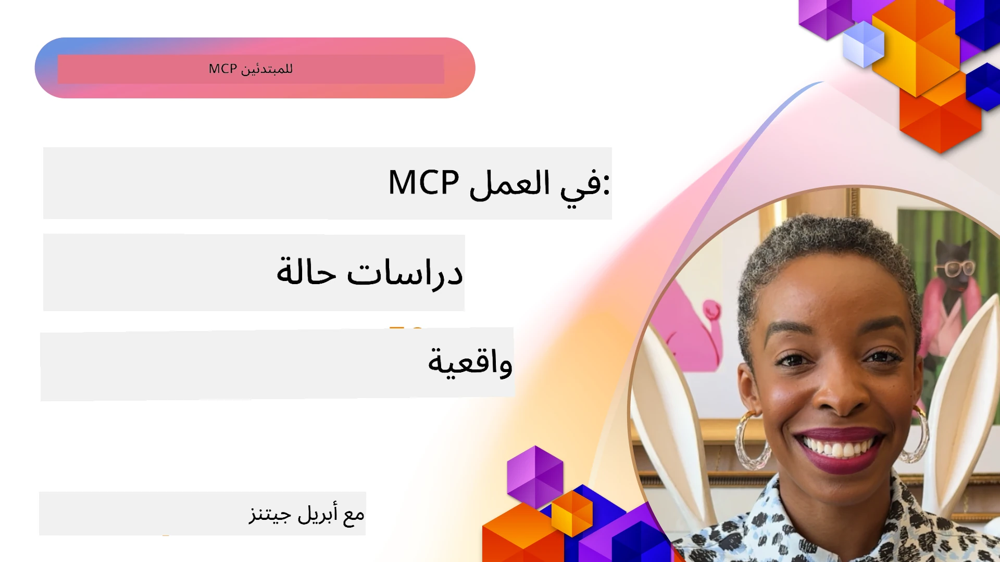

# MCP في العمل: دراسات حالة من العالم الحقيقي

_(انقر الصورة أعلاه لمشاهدة فيديو هذا الدرس)_

بروتوكول سياق النموذج (MCP) يغير الطريقة التي تتفاعل بها تطبيقات الذكاء الاصطناعي مع البيانات والأدوات والخدمات. يعرض هذا القسم دراسات حالة من العالم الحقيقي تُظهر التطبيقات العملية لـ MCP في سيناريوهات مؤسساتية مختلفة.

## نظرة عامة

يعرض هذا القسم أمثلة ملموسة على تطبيقات MCP، مسلطًا الضوء على كيفية استغلال المؤسسات لهذا البروتوكول لحل تحديات تجارية معقدة. من خلال دراسة هذه الحالات، ستحصل على رؤى حول تعددية الاستخدامات، وقابلية التوسع، والفوائد العملية لـ MCP في سيناريوهات من الواقع.

## أهداف التعلم الرئيسية

من خلال استكشاف دراسات الحالة هذه، ستتمكن من:

- فهم كيف يمكن تطبيق MCP لحل مشكلات تجارية محددة
- التعرف على أنماط التكامل المختلفة والمقاربات الهندسية
- التعرف على أفضل الممارسات لتطبيق MCP في بيئات المؤسسات
- اكتساب رؤى حول التحديات والحلول التي تواجهها التطبيقات الواقعية
- تحديد فرص لتطبيق أنماط مماثلة في مشاريعك الخاصة

## دراسات الحالة المختارة

### 1. [وكلاء السفر المدعومون بالذكاء الاصطناعي من Azure – التنفيذ المرجعي](./travelagentsample.md)

تدرس هذه الحالة المرجعية الشاملة لمايكروسوفت التي توضح كيفية بناء تطبيق تخطيط سفر متعدد الوكلاء مدعوم بالذكاء الاصطناعي باستخدام MCP، وAzure OpenAI، وAzure AI Search. يعرض المشروع:

- تنظيم متعدد الوكلاء عبر MCP
- تكامل بيانات المؤسسات مع Azure AI Search
- بنية آمنة وقابلة للتوسع باستخدام خدمات Azure
- أدوات قابلة للتوسع مع مكونات MCP قابلة لإعادة الاستخدام
- تجربة مستخدم محادثة مدعومة بـ Azure OpenAI

توفر تفاصيل الهندسة والتنفيذ رؤى قيمة لبناء أنظمة متعددة الوكلاء مع MCP كطبقة تنسيق.

### 2. [تحديث عناصر Azure DevOps من بيانات YouTube](./UpdateADOItemsFromYT.md)

توضح هذه الحالة تطبيقًا عمليًا لـ MCP لأتمتة عمليات سير العمل. وتُظهر كيفية استخدام أدوات MCP لـ:

- استخراج البيانات من منصات الإنترنت (YouTube)
- تحديث عناصر العمل في أنظمة Azure DevOps
- إنشاء سير عمل أتمتة قابل للتكرار
- دمج البيانات عبر أنظمة متفرقة

يوضح هذا المثال كيف يمكن حتى لتطبيقات MCP البسيطة نسبيًا تحقيق مكاسب كبيرة في الكفاءة من خلال أتمتة المهام الروتينية وتحسين اتساق البيانات عبر الأنظمة.

### 3. [استرجاع وثائق في الوقت الحقيقي باستخدام MCP](./docs-mcp/README.md)

توجهك هذه الحالة إلى كيفية ربط عميل بايثون بمنصة Model Context Protocol (MCP) لاسترجاع وتسجيل الوثائق الحية والسياقية من مايكروسوفت. ستتعلم كيفية:

- الاتصال بخادم MCP باستخدام عميل بايثون وSDK الرسمي لـ MCP
- استخدام عملاء HTTP البثيين لاسترجاع البيانات في الوقت الحقيقي بكفاءة
- استدعاء أدوات التوثيق على الخادم وتسجيل الردود مباشرةً في وحدة التحكم
- دمج وثائق مايكروسوفت المُحدّثة في سير عملك دون مغادرة الطرفية

يشمل الفصل مهمة تطبيقية، ونموذج رمز قابل للتشغيل، وروابط لمصادر إضافية للتعلم العميق. اطلع على الشرح الكامل والرمز في الفصل المرتبط لفهم كيفية تحول MCP في الوصول إلى الوثائق وزيادة إنتاجية المطورين في بيئات الطرفية.

### 4. [تطبيق ويب مولد خطة دراسة تفاعلية مع MCP](./docs-mcp/README.md)

توضح هذه الحالة كيفية بناء تطبيق ويب تفاعلي باستخدام Chainlit وModel Context Protocol (MCP) لتوليد خطط دراسية مخصصة لأي موضوع. يمكن للمستخدمين تحديد الموضوع (مثل "شهادة AI-900") ومدة الدراسة (مثل 8 أسابيع)، وسيوفر التطبيق تفصيلاً أسبوعيًا للمحتوى الموصى به. يتيح Chainlit واجهة محادثة تفاعلية تجعل التجربة جذابة وقابلة للتكيف.

- تطبيق ويب محادثة مدعوم بواسطة Chainlit
- مطالبات معتمدة على المستخدم للموضوع والمدة
- توصيات المحتوى أسبوعًا بأسبوع باستخدام MCP
- ردود تفاعلية في الوقت الحقيقي في واجهة الدردشة

يوضح المشروع كيف يمكن دمج الذكاء الاصطناعي الحواري مع MCP لإنشاء أدوات تعليمية ديناميكية تعتمد على المستخدم في بيئة ويب حديثة.

### 5. [توثيق داخل المحرر مع خادم MCP في VS Code](./docs-mcp/README.md)

تُظهر هذه الحالة كيفية جلب وثائق Microsoft Learn مباشرة إلى بيئة VS Code الخاصة بك باستخدام خادم MCP — دون الحاجة لتبديل علامات التبويب في المتصفح! سترى كيفية:

- البحث وقراءة الوثائق مباشرة داخل VS Code باستخدام لوحة MCP أو لوحة الأوامر
- الرجوع إلى الوثائق وإدراج الروابط مباشرة في ملفات README أو ملفات Markdown للدورة التدريبية
- استخدام GitHub Copilot وMCP معًا لتدفقات عمل سلسة مدعومة بالذكاء الاصطناعي للتوثيق والبرمجة
- التحقق من صحة وتحسين وثائقك بتغذية راجعة في الوقت الحقيقي ودقة مصدرها مايكروسوفت
- دمج MCP مع تدفقات عمل GitHub للتحقق المستمر من الوثائق

يشمل التنفيذ:

- تكوين `.vscode/mcp.json` كمثال لإعداد سهل
- شروحات مصورة لتجربة الاستخدام داخل المحرر
- نصائح للجمع بين Copilot وMCP لتعظيم الإنتاجية

هذا السيناريو مثالي لمؤلفي الدورات، وكتاب الوثائق، والمطورين الذين يرغبون في البقاء مركزين داخل المحرر أثناء العمل مع الوثائق وCopilot وأدوات التحقق — جميعها مدعومة بواسطة MCP.

### 6. [إنشاء خادم MCP باستخدام APIM](./apimsample.md)

يقدم هذا السيناريو دليلًا خطوة بخطوة لإنشاء خادم MCP باستخدام إدارة واجهات برمجة التطبيقات في Azure (APIM). يغطي:

- إعداد خادم MCP في Azure API Management
- عرض عمليات API كأدوات MCP
- تكوين سياسات للحد من المعدل والأمان
- اختبار خادم MCP باستخدام Visual Studio Code وGitHub Copilot

يوضح هذا المثال كيفية الاستفادة من قدرات Azure لإنشاء خادم MCP قوي يمكن استخدامه في تطبيقات مختلفة، مما يعزز تكامل أنظمة الذكاء الاصطناعي مع واجهات برمجة التطبيقات المؤسسية.

### 7. [سجل MCP في GitHub — تسريع التكامل الوكِلي](https://github.com/mcp)

تدرس هذه الحالة كيف يعالج سجل MCP في GitHub، الذي تم إطلاقه في سبتمبر 2025، تحديًا حاسمًا في منظومة الذكاء الاصطناعي: التشتت في اكتشاف ونشر خوادم Model Context Protocol (MCP).

#### نظرة عامة
يحل **سجل MCP** مشكلة انتشار خوادم MCP عبر المستودعات والسجلات المتناثرة، مما كان يبطئ عملية التكامل ويزيد احتمال الأخطاء. تتيح هذه الخوادم لوكلاء الذكاء الاصطناعي التفاعل مع أنظمة خارجية مثل واجهات برمجة التطبيقات، وقواعد البيانات، ومصادر التوثيق.

#### بيان المشكلة
واجه المطورون الذين يبنون سير عمل وكِلي تحديات عدة:
- **سوء القدرة على الاكتشاف** لخوادم MCP عبر منصات مختلفة
- **تكرار أسئلة الإعداد** المتناثرة في المنتديات والوثائق
- **مخاطر أمنية** من مصادر غير موثوقة وغير مُتحقق منها
- **غياب المعايير الموحدة** لجودة وتوافق الخوادم

#### هندسة الحل
يسلط سجل MCP الضوء على خوادم MCP الموثوقة بميزات رئيسية:
- **التثبيت بنقرة واحدة** عبر VS Code لسهولة الإعداد
- **فرز الإشارات مقابل الضوضاء** عبر النجوم، والنشاط، وتقييم المجتمع
- **تكامل مباشر** مع GitHub Copilot وأدوات MCP المتوافقة الأخرى
- **نموذج مساهمات مفتوح** يتيح للمجتمع وشركاء المؤسسات المشاركة

#### التأثير التجاري
حقق السجل تحسينات ملموسة:
- **تسريع إدخال المستخدمين الجدد** باستخدام أدوات مثل Microsoft Learn MCP Server، الذي يبث الوثائق الرسمية مباشرة إلى الوكلاء
- **تحسين الإنتاجية** عن طريق خوادم متخصصة مثل `github-mcp-server`، التي تمكن الأتمتة بلغات طبيعية لـ GitHub (إنشاء PR، إعادة تشغيل CI، مسح الكود)
- **تعزيز الثقة في النظام البيئي** من خلال قوائم مُنقّحة ومعايير تكوين شفافة

#### القيمة الاستراتيجية
للمتخصصين في إدارة دورة حياة الوكلاء وسير العمل القابل لإعادة الإنتاج، يوفر سجل MCP:
- **قدرات نشر وكيل معياري** مع مكونات موحدة
- **خطوط تقييم مدعومة بالسجل** للاختبار والتحقق المستمر
- **توافق بين الأدوات** يتيح تكاملًا سلسًا عبر منصات الذكاء الاصطناعي المختلفة

تُظهِر دراسة الحالة أن سجل MCP ليس مجرد دليل فحسب — بل هو منصة أساسية للتكامل النماذجي عالي القابلية للتوسع ونشر أنظمة الوكلاء الواقعية.

## الخلاصة

تُظهر هذه الدراسات السبعة الشاملة تعددية الاستخدامات المذهلة والتطبيقات العملية لبروتوكول سياق النموذج في سيناريوهات متنوعة من العالم الحقيقي. من أنظمة تخطيط السفر متعددة الوكلاء المُعقدة، وإدارة واجهات برمجة التطبيقات المؤسسية، إلى سير العمل التوثيقي المبسط، وسجل MCP الثوري في GitHub، تُظهر هذه الأمثلة كيف يوفر MCP طريقة موحدة وقابلة للتوسع لربط أنظمة الذكاء الاصطناعي بالأدوات والبيانات والخدمات التي تحتاجها لتحقيق قيمة استثنائية.

تشمل دراسات الحالة أبعادًا متعددة لتطبيق MCP:
- **التكامل المؤسسي**: إدارة API في Azure وأتمتة Azure DevOps
- **تنسيق متعدد الوكلاء**: تخطيط السفر مع وكلاء AI منسقين
- **إنتاجية المطورين**: تكامل VS Code والوصول إلى الوثائق في الوقت الحقيقي
- **تطوير النظام البيئي**: سجل MCP في GitHub كمنصة أساسية
- **التطبيقات التعليمية**: مولدات خطة الدراسة التفاعلية وواجهات المحادثة

من خلال دراسة هذه التطبيقات، تحصل على رؤى حاسمة حول:
- **أنماط هندسية** لمقاييس وحالات استخدام مختلفة
- **استراتيجيات التنفيذ** التي توازن بين الوظائف وقابلية الصيانة
- **الاعتبارات الأمنية وقابلية التوسع** في عمليات الإنتاج
- **أفضل الممارسات** لتطوير خوادم MCP وتكامل العملاء
- **تفكير النظام البيئي** لبناء حلول ذكاء اصطناعي مترابطة مدعومة

تُظهر هذه الأمثلة مجتمعةً أن MCP ليس مجرد إطار نظري، بل بروتوكول ناضج وجاهز للإنتاج يمكّن الحلول العملية للتحديات التجارية المعقدة. سواء كنت تبني أدوات أتمتة بسيطة أو أنظمة متعددة الوكلاء معقدة، فإن الأنماط والمقاربات الموضحة هنا تقدم أساسًا قويًا لمشاريع MCP الخاصة بك.

## موارد إضافية

- [مستودع وكلاء السفر المدعومين بالذكاء الاصطناعي في Azure على GitHub](https://github.com/Azure-Samples/azure-ai-travel-agents)
- [أداة MCP لـ Azure DevOps](https://github.com/microsoft/azure-devops-mcp)
- [أداة MCP لـ Playwright](https://github.com/microsoft/playwright-mcp)
- [خادم MCP في توثيق Microsoft](https://github.com/MicrosoftDocs/mcp)
- [سجل MCP في GitHub — تسريع التكامل الوكِلي](https://github.com/mcp)
- [أمثلة مجتمع MCP](https://github.com/microsoft/mcp)

## ما القادم

- السابق: [الوحدة 8: أفضل الممارسات](../08-BestPractices/README.md)
- التالي: [الوحدة 10: تبسيط سير عمل الذكاء الاصطناعي: بناء خادم MCP باستخدام مجموعة أدوات الذكاء الاصطناعي](../10-StreamliningAIWorkflowsBuildingAnMCPServerWithAIToolkit/README.md)

---

<!-- CO-OP TRANSLATOR DISCLAIMER START -->
**تنويه**:
تم ترجمة هذا المستند باستخدام خدمة الترجمة الآلية [Co-op Translator](https://github.com/Azure/co-op-translator). بينما نسعى لضمان الدقة، يرجى العلم أن الترجمات الآلية قد تحتوي على أخطاء أو عدم دقة. يجب اعتبار المستند الأصلي بلغته الأصلية المصدر المعتمد والموثوق. بالنسبة للمعلومات الهامة، يُنصح بالاستعانة بترجمة احترافية بشرية. نحن غير مسؤولين عن أي سوء فهم أو تفسير ناتج عن استخدام هذه الترجمة.
<!-- CO-OP TRANSLATOR DISCLAIMER END -->