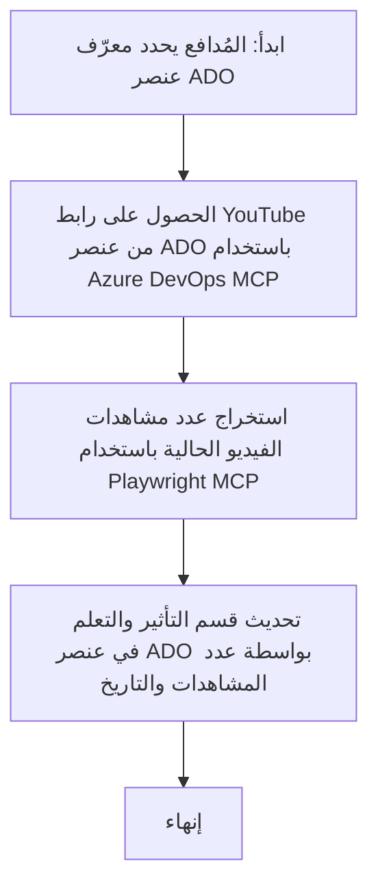

# دراسة حالة: تحديث عناصر Azure DevOps من بيانات YouTube باستخدام MCP

> **إخلاء مسؤولية:** توجد أدوات وتقارير عبر الإنترنت يمكنها أتمتة عملية تحديث عناصر Azure DevOps بالبيانات من منصات مثل YouTube. السيناريو التالي مقدم كمثال فقط لتوضيح كيفية تطبيق أدوات MCP لأتمتة مهام التكامل والتحديث.

## نظرة عامة

توضح دراسة الحالة هذه مثالًا على كيفية استخدام بروتوكول سياق النموذج (MCP) وأدواته لأتمتة عملية تحديث عناصر العمل في Azure DevOps (ADO) بمعلومات مأخوذة من منصات عبر الإنترنت مثل YouTube. السيناريو الموضح هو أحد الأمثلة على القدرات الأوسع لهذه الأدوات، التي يمكن تعديلها لتناسب العديد من الاحتياجات المماثلة للأتمتة.

في هذا المثال، يتابع المحامي الجلسات الإلكترونية باستخدام عناصر ADO، حيث يحتوي كل عنصر على رابط فيديو من YouTube. من خلال الاستفادة من أدوات MCP، يمكن للمحامي تحديث عناصر ADO باستمرار بأحدث مقاييس الفيديو، مثل عدد المشاهدات، بطريقة متكررة ومؤتمتة. يمكن تعميم هذا النهج على حالات استخدام أخرى تتطلب دمج المعلومات من مصادر عبر الإنترنت في ADO أو أنظمة أخرى.

## السيناريو

المحامي مسؤول عن تتبع أثر الجلسات عبر الإنترنت والمشاركات المجتمعية. يتم تسجيل كل جلسة كعنصر عمل في مشروع 'DevRel' داخل ADO، ويحتوي عنصر العمل على حقل لرابط فيديو YouTube. ولتقديم تقرير دقيق عن مدى الوصول للجلسة، يحتاج المحامي إلى تحديث عنصر ADO بعدد مشاهدات الفيديو الحالي وتاريخ استرجاع هذه المعلومات.

## الأدوات المستخدمة

- [Azure DevOps MCP](https://github.com/microsoft/azure-devops-mcp): يتيح الوصول البرمجي وتحديث عناصر عمل ADO عبر MCP.
- [Playwright MCP](https://github.com/microsoft/playwright-mcp): يؤتمت إجراءات المتصفح لاستخلاص البيانات الحية من صفحات الويب، مثل إحصائيات فيديو YouTube.

## سير العمل خطوة بخطوة

1. **تحديد عنصر ADO**: ابدأ بمعرف عنصر العمل الخاص بـ ADO (مثلًا 1234) في مشروع 'DevRel'.
2. **استخراج رابط YouTube**: استخدم أداة Azure DevOps MCP للحصول على رابط YouTube من عنصر العمل.
3. **استخراج عدد المشاهدات**: استخدم أداة Playwright MCP للانتقال إلى رابط YouTube واستخلاص عدد المشاهدات الحالي.
4. **تحديث عنصر ADO**: اكتب أحدث عدد مشاهدات وتاريخ الاسترجاع في قسم 'الأثر والدروس' داخل عنصر عمل ADO باستخدام أداة Azure DevOps MCP.

## مثال للطلب

```bash
- Work with the ADO Item ID: 1234
- The project is '2025-Awesome'
- Get the YouTube URL for the ADO item
- Use Playwright to get the current views from the YouTube video
- Update the ADO item with the current video views and the updated date of the information
```

## مخطط التدفق Mermaid


## التنفيذ التقني

- **تنسيق MCP**: يتم تنسيق سير العمل بواسطة خادم MCP، الذي ينسق استخدام كل من أدوات Azure DevOps MCP وPlaywright MCP.
- **الأتمتة**: يمكن تشغيل العملية يدويًا أو جدولتها لتعمل دورياً للحفاظ على تحديث عناصر ADO.
- **القابلية للتوسيع**: يمكن توسيع نفس النمط لتحديث عناصر ADO ببيانات من معايير أخرى عبر الإنترنت (مثل الإعجابات والتعليقات) أو من منصات أخرى.

## النتائج والأثر

- **الكفاءة**: يقلل الجهد اليدوي للمحامين من خلال أتمتة استرجاع وتحديث مقاييس الفيديو.
- **الدقة**: يضمن أن تعكس عناصر ADO أحدث البيانات المتاحة من المصادر عبر الإنترنت.
- **التكرارية**: يوفر سير عمل قابل لإعادة الاستخدام لسيناريوهات مماثلة تشمل مصادر بيانات أو مقاييس أخرى.

## المراجع

- [Azure DevOps MCP](https://github.com/microsoft/azure-devops-mcp)
- [Playwright MCP](https://github.com/microsoft/playwright-mcp)
- [Model Context Protocol (MCP)](https://modelcontextprotocol.io/)

## ما التالي

- العودة إلى: [نظرة عامة على دراسات الحالة](./README.md)
- التالي: [استرجاع التوثيق في الوقت الحقيقي باستخدام MCP](./docs-mcp/README.md)

---

<!-- CO-OP TRANSLATOR DISCLAIMER START -->
**إخلاء المسؤولية**:  
تمت ترجمة هذا المستند باستخدام خدمة الترجمة الآلية [Co-op Translator](https://github.com/Azure/co-op-translator). على الرغم من أننا نسعى لتحقيق الدقة، يرجى العلم أن الترجمات الآلية قد تحتوي على أخطاء أو عدم دقة. يجب اعتبار المستند الأصلي بلغته الأصلية المصدر الرسمي والمعتمد. بالنسبة للمعلومات الهامة، يُنصح بالاعتماد على الترجمة البشرية المهنية. نحن غير مسؤولين عن أي سوء فهم أو تفسير خاطئ ناتج عن استخدام هذه الترجمة.
<!-- CO-OP TRANSLATOR DISCLAIMER END -->