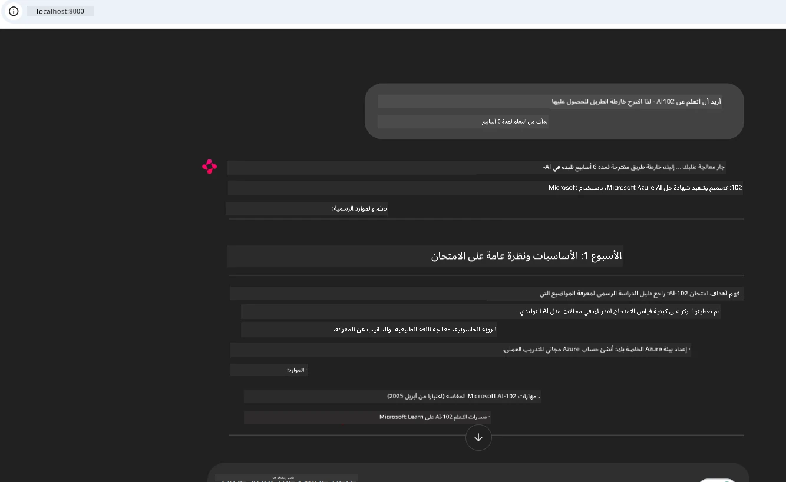
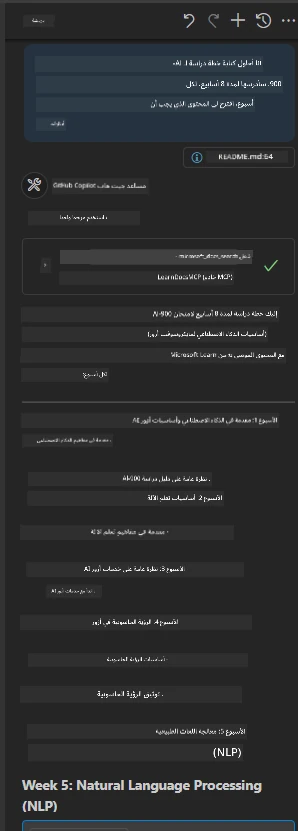

# دراسة حالة: الاتصال بخادم Microsoft Learn Docs MCP من عميل

هل وجدت نفسك يومًا تتنقل بين مواقع التوثيق، وStack Overflow، ونوافذ محركات البحث التي لا تنتهي، وكل ذلك أثناء محاولتك حل مشكلة في الكود الخاص بك؟ ربما تحتفظ بشاشة ثانية فقط للتوثيق، أو تقوم بالتبديل المستمر بين بيئة التطوير المتكاملة والمتصفح. ألا يكون من الأفضل لو استطعت جلب التوثيق مباشرة إلى سير عملك—مُدمجًا في تطبيقاتك، وبيئة التطوير المتكاملة، أو حتى أدواتك الخاصة؟ في هذه الدراسة، سنستعرض كيفية تنفيذ ذلك تمامًا عن طريق الاتصال مباشرة بخادم Microsoft Learn Docs MCP من تطبيق العميل الخاص بك.

## نظرة عامة

التطوير الحديث ليس مجرد كتابة رموز—بل هو العثور على المعلومات الصحيحة في الوقت المناسب. التوثيق موجود في كل مكان، لكنه نادرًا ما يكون حيث تحتاجه أكثر: داخل أدواتك وسير عملك. من خلال دمج استرجاع التوثيق مباشرة في تطبيقاتك، يمكنك توفير الوقت، وتقليل التنقل بين السياقات، وزيادة الإنتاجية. في هذا القسم، سنوضح لك كيفية توصيل عميل إلى خادم Microsoft Learn Docs MCP، بحيث يمكنك الوصول إلى التوثيق السياقي والآني دون مغادرة تطبيقك.

سنمر سوية بعملية إنشاء الاتصال، وإرسال طلب، والتعامل مع استجابات البث بكفاءة. لا يقتصر هذا النهج على تبسيط سير عملك فحسب، بل يفتح الباب لبناء أدوات مطور ذكية وأكثر فائدة.

## أهداف التعلم

لماذا نفعل ذلك؟ لأن أفضل تجارب المطور هي تلك التي تزيل العقبات. تخيل عالماً يمكن لمحرر الشفرة الخاص بك، أو برنامج الدردشة الآلي، أو تطبيق الويب أن يجيب عن أسئلة التوثيق الخاصة بك فورًا، باستخدام أحدث المحتوى من Microsoft Learn. بحلول نهاية هذا الفصل، ستكون قادرًا على:

- فهم أساسيات التواصل بين خادم MCP والعميل لأغراض التوثيق  
- تطبيق تطبيق وحدة تحكم أو ويب للاتصال بخادم Microsoft Learn Docs MCP  
- استخدام عملاء HTTP الداعمين للتدفق لاسترجاع التوثيق في الوقت الحقيقي  
- تسجيل وتحليل استجابات التوثيق في تطبيقك  

سترى كيف تساعدك هذه المهارات على بناء أدوات ليست تفاعلية فقط، بل مدركة للسياق أيضًا.

## السيناريو 1 - استرجاع التوثيق في الوقت الحقيقي مع MCP

في هذا السيناريو، سنوضح لك كيفية توصيل عميل إلى خادم Microsoft Learn Docs MCP، لتتمكن من الوصول إلى التوثيق السياقي والآني دون مغادرة تطبيقك.

لنطبق هذا عمليًا. مهمتك هي كتابة تطبيق يتصل بخادم Microsoft Learn Docs MCP، يستدعي أداة `microsoft_docs_search`، ويسجل الاستجابة المتدفقة في وحدة التحكم.

### لماذا هذا النهج؟  
لأنه يمثل الأساس لبناء تكاملات أكثر تقدمًا—سواء كنت تريد تشغيل برنامج دردشة، امتداد بيئة تطوير متكاملة، أو لوحة تحكم ويب.

ستجد الشفرة والتعليمات لهذا السيناريو في مجلد [`solution`](./solution/README.md) داخل هذه الدراسة. الخطوات سترشدك لإعداد الاتصال:  
- استخدام SDK الرسمي لـ MCP وعميل HTTP قابل للبث للاتصال  
- استدعاء أداة `microsoft_docs_search` مع معامل البحث لاسترجاع التوثيق  
- تنفيذ التسجيل الصحيح وإدارة الأخطاء  
- إنشاء واجهة وحدة تحكم تفاعلية للسماح للمستخدمين بإدخال عدة استعلامات بحث

يوضح هذا السيناريو كيفية:  
- الاتصال بخادم Docs MCP  
- إرسال استعلام  
- تحليل وطباعة النتائج

هكذا قد يبدو تشغيل الحل:

```
Prompt> What is Azure Key Vault?
Answer> Azure Key Vault is a cloud service for securely storing and accessing secrets. ...
```


في ما يلي نموذج حل بسيط. الشفرة الكاملة والتفاصيل متوفرة في مجلد الحل.

<details>  
<summary>بايثون</summary>

```python
import asyncio
from mcp.client.streamable_http import streamablehttp_client
from mcp import ClientSession

async def main():
    async with streamablehttp_client("https://learn.microsoft.com/api/mcp") as (read_stream, write_stream, _):
        async with ClientSession(read_stream, write_stream) as session:
            await session.initialize()
            result = await session.call_tool("microsoft_docs_search", {"query": "Azure Functions best practices"})
            print(result.content)

if __name__ == "__main__":
    asyncio.run(main())
```

- للتنفيذ الكامل والتسجيل، راجع [`scenario1.py`](../../../../09-CaseStudy/docs-mcp/solution/python/scenario1.py).  
- لتعليمات التثبيت والاستخدام، راجع ملف [`README.md`](./solution/python/README.md) في نفس المجلد.  
</details>  

## السيناريو 2 - تطبيق ويب لإنشاء خطة دراسة تفاعلية مع MCP

في هذا السيناريو، ستتعلم كيفية دمج Docs MCP في مشروع تطوير ويب. الهدف هو تمكين المستخدمين من البحث في توثيق Microsoft Learn مباشرة من واجهة الويب، مما يجعل التوثيق متاحًا على الفور داخل تطبيقك أو موقعك.

ستتعلم كيف:  
- إعداد تطبيق ويب  
- الاتصال بخادم Docs MCP  
- التعامل مع إدخال المستخدم وعرض النتائج  

هكذا قد يبدو تشغيل الحل:

```
User> I want to learn about AI102 - so suggest the roadmap to get it started from learn for 6 weeks

Assistant> Here’s a detailed 6-week roadmap to start your preparation for the AI-102: Designing and Implementing a Microsoft Azure AI Solution certification, using official Microsoft resources and focusing on exam skills areas:

---
## Week 1: Introduction & Fundamentals
- **Understand the Exam**: Review the [AI-102 exam skills outline](https://learn.microsoft.com/en-us/credentials/certifications/exams/ai-102/).
- **Set up Azure**: Sign up for a free Azure account if you don't have one.
- **Learning Path**: [Introduction to Azure AI services](https://learn.microsoft.com/en-us/training/modules/intro-to-azure-ai/)
- **Focus**: Get familiar with Azure portal, AI capabilities, and necessary tools.

....more weeks of the roadmap...

Let me know if you want module-specific recommendations or need more customized weekly tasks!
```


في ما يلي نموذج حل بسيط. الشفرة الكاملة والتفاصيل متوفرة في مجلد الحل.



<details>  
<summary>بايثون (Chainlit)</summary>

Chainlit هو إطار عمل لبناء تطبيقات ويب الذكاء الاصطناعي الحوارية. يجعل من السهل إنشاء برامج دردشة تفاعلية ومساعدين يمكنهم استدعاء أدوات MCP وعرض النتائج في الوقت الحقيقي. إنه مثالي للنماذج الأولية السريعة والواجهات سهلة الاستخدام.

```python
import chainlit as cl
import requests

MCP_URL = "https://learn.microsoft.com/api/mcp"

@cl.on_message
def handle_message(message):
    query = {"question": message}
    response = requests.post(MCP_URL, json=query)
    if response.ok:
        result = response.json()
        cl.Message(content=result.get("answer", "No answer found.")).send()
    else:
        cl.Message(content="Error: " + response.text).send()
```
  
- للتنفيذ الكامل، راجع [`scenario2.py`](../../../../09-CaseStudy/docs-mcp/solution/python/scenario2.py).  
- لتعليمات الإعداد والتشغيل، راجع [`README.md`](./solution/python/README.md).  
</details>

## السيناريو 3: التوثيق داخل المحرر مع خادم MCP في VS Code

إذا أردت الوصول إلى توثيق Microsoft Learn مباشرة داخل VS Code (بدلاً من التنقل بين علامات تبويب المتصفح)، يمكنك استخدام خادم MCP في محررك. يسمح لك هذا بـ:  
- البحث وقراءة التوثيق في VS Code دون مغادرة بيئة البرمجة.  
- الإشارة إلى التوثيق وإدراج الروابط مباشرة في ملفات README أو الدورات التدريبية.  
- استغلال GitHub Copilot وMCP معًا لسير عمل توثيقي ذكي مدعوم بالذكاء الاصطناعي.

**ستتعلم كيفية:**  
- إضافة ملف `.vscode/mcp.json` صالح في جذر مساحة العمل (انظر المثال أدناه).  
- فتح لوحة MCP أو استخدام قائمة الأوامر في VS Code للبحث وإدراج التوثيق.  
- الإشارة إلى التوثيق مباشرة في ملفات markdown أثناء عملك.  
- دمج هذا السريان مع GitHub Copilot لمزيد من الإنتاجية.

فيما يلي مثال على كيفية إعداد خادم MCP في VS Code:

```json
{
  "servers": {
    "LearnDocsMCP": {
      "url": "https://learn.microsoft.com/api/mcp"
    }
  }
}
```
  
</details>

> للحصول على شرح مفصل مع لقطات شاشة ودليل خطوة بخطوة، راجع [`README.md`](./solution/scenario3/README.md).



هذا النهج مثالي لأي شخص يبني دورات تقنية، يكتب توثيقًا، أو يطور كودًا يحتاج إلى مراجع متكررة.

## النقاط الأساسية

دمج التوثيق مباشرة في أدواتك ليس مجرد راحة—إنه نقطة تحول في الإنتاجية. بالاتصال بخادم Microsoft Learn Docs MCP من عميلك، يمكنك:

- إزالة التنقل بين الكود والتوثيق  
- استرداد وثائق محدثة ومدركة للسياق في الوقت الحقيقي  
- بناء أدوات مطورين أذكى وأكثر تفاعلًا  

هذه المهارات ستساعدك على خلق حلول ليست فقط فعالة، بل ممتعة أيضًا في الاستخدام.

## موارد إضافية

لتعميق فهمك، استعرض هذه الموارد الرسمية:

- [خادم Microsoft Learn Docs MCP (GitHub)](https://github.com/MicrosoftDocs/mcp)  
- [البدء مع خادم Azure MCP (mcp-python)](https://learn.microsoft.com/en-us/azure/developer/azure-mcp-server/get-started#create-the-python-app)  
- [ما هو خادم Azure MCP؟](https://learn.microsoft.com/en-us/azure/developer/azure-mcp-server/)  
- [مقدمة إلى بروتوكول سياق النموذج (MCP)](https://modelcontextprotocol.io/introduction)  
- [إضافة الإضافات من خادم MCP (بايثون)](https://learn.microsoft.com/en-us/semantic-kernel/concepts/plugins/adding-mcp-plugins)

## ما التالي

- العودة إلى: [نظرة عامة على دراسات الحالة](../README.md)  
- الاستمرار إلى: [الوحدة 10: تبسيط سير عمل الذكاء الاصطناعي باستخدام مجموعة أدوات الذكاء الاصطناعي](../../10-StreamliningAIWorkflowsBuildingAnMCPServerWithAIToolkit/README.md)

---

<!-- CO-OP TRANSLATOR DISCLAIMER START -->
**تنويه**:
تمت ترجمة هذا المستند باستخدام خدمة الترجمة الآلية [Co-op Translator](https://github.com/Azure/co-op-translator). بينما نسعى لضمان الدقة، يرجى العلم أن الترجمات الآلية قد تحتوي على أخطاء أو عدم دقة. يجب اعتبار المستند الأصلي بلغته الأصلية المصدر المعتمد. للمعلومات الهامة، يُنصح بالاعتماد على ترجمة بشرية احترافية. نحن غير مسؤولين عن أي سوء فهم أو تفسير خاطئ ينشأ عن استخدام هذه الترجمة.
<!-- CO-OP TRANSLATOR DISCLAIMER END -->