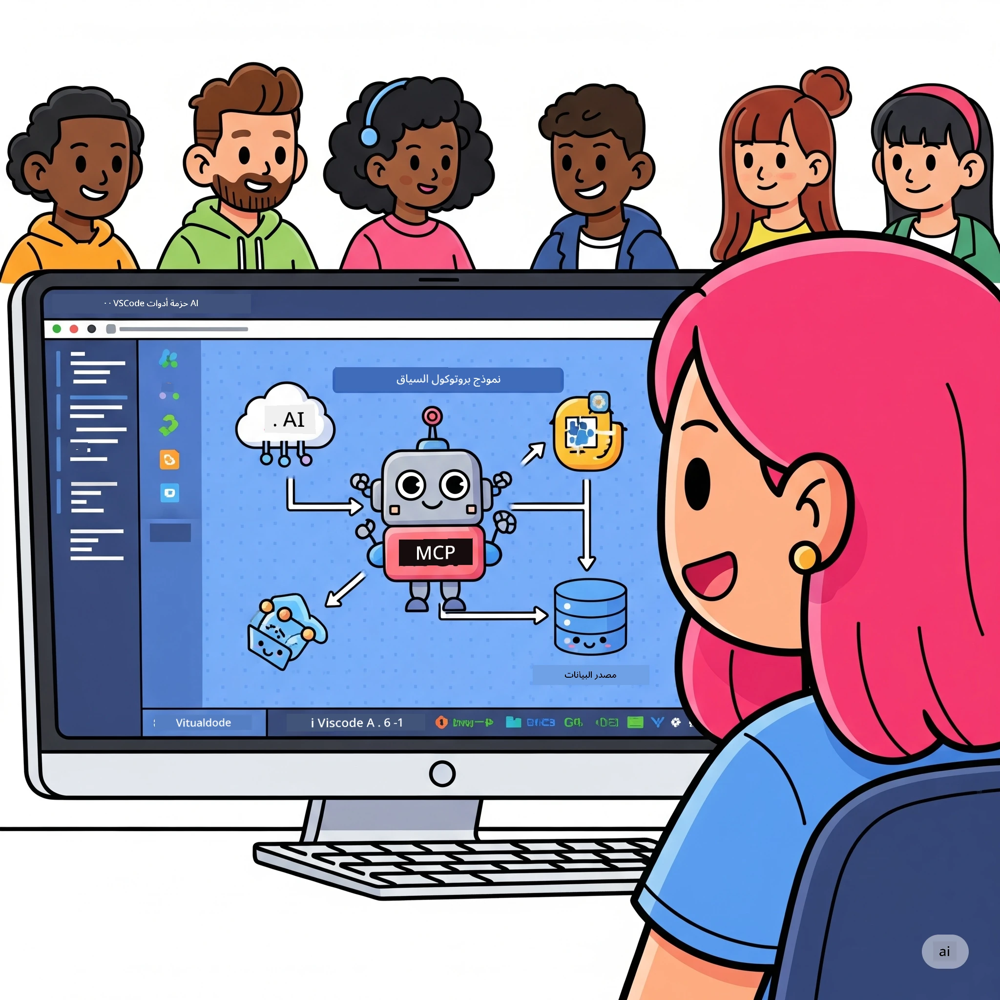
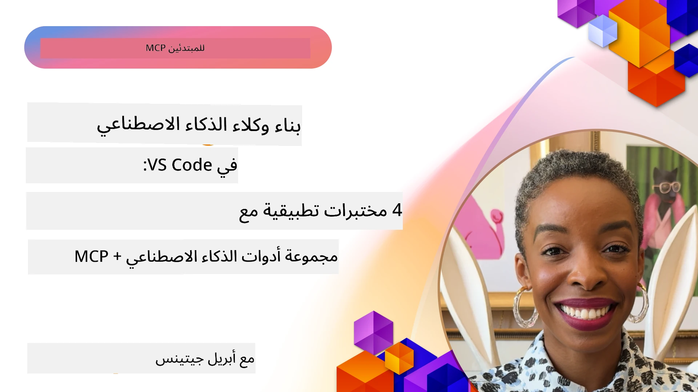

# تبسيط سير عمل الذكاء الاصطناعي: بناء خادم MCP باستخدام مجموعة أدوات الذكاء الاصطناعي

## 🎯 نظرة عامة

_(انقر على الصورة أعلاه لمشاهدة فيديو هذا الدرس)_

مرحبًا بكم في **ورشة عمل بروتوكول سياق النموذج (MCP)**! تجمع هذه الورشة العملية الشاملة بين تقنيتين متقدمتين لتحويل تطوير تطبيقات الذكاء الاصطناعي:

- **🔗 بروتوكول سياق النموذج (MCP)**: معيار مفتوح للتكامل السلس مع أدوات الذكاء الاصطناعي
- **🛠️ مجموعة أدوات الذكاء الاصطناعي لـ Visual Studio Code (AITK)**: امتداد مايكروسوفت القوي لتطوير الذكاء الاصطناعي

### 🎓 ما ستتعلمه

بحلول نهاية هذه الورشة، ستتقن بناء تطبيقات ذكية تربط نماذج الذكاء الاصطناعي بالأدوات والخدمات الحقيقية. من الاختبار الآلي إلى تكاملات API المخصصة، ستحصل على مهارات عملية لحل تحديات الأعمال المعقدة.

## 🏗️ مكدس التكنولوجيا

### 🔌 بروتوكول سياق النموذج (MCP)

MCP هو **"USB-C للذكاء الاصطناعي"** - معيار عالمي يربط نماذج الذكاء الاصطناعي بالأدوات الخارجية ومصادر البيانات.

**✨ الميزات الرئيسية:**

- 🔄 **تكامل موحد**: واجهة عالمية لاتصالات أدوات الذكاء الاصطناعي
- 🏛️ **هيكلية مرنة**: خوادم محلية وبعيدة عبر نقل stdio/SSE
- 🧰 **نظام بيئي غني**: أدوات، مطالبات، وموارد داخل بروتوكول واحد
- 🔒 **جاهزية للمؤسسات**: أمان وموثوقية مدمجة

**🎯 لماذا MCP مهم:**
تمامًا كما قضى USB-C على فوضى الكابلات، يقضي MCP على تعقيد تكاملات الذكاء الاصطناعي. بروتوكول واحد، إمكانيات لا حصر لها.

### 🤖 مجموعة أدوات الذكاء الاصطناعي لـ Visual Studio Code (AITK)

امتداد تطوير الذكاء الاصطناعي الرائد من مايكروسوفت الذي يحول VS Code إلى منصة قوة للذكاء الاصطناعي.

**🚀 القدرات الأساسية:**

- 📦 **كتالوج النماذج**: الوصول إلى نماذج من Azure AI وGitHub وHugging Face وOllama
- ⚡ **التنبؤ المحلي**: تنفيذ محسن ONNX للمعالج/وحدة معالجة الرسوميات/وحدة معالجة الشبكات العصبية
- 🏗️ **منشئ الوكلاء**: تطوير وكيل ذكاء اصطناعي بصري مع تكامل MCP
- 🎭 **متعدد الوسائط**: دعم النص، الرؤية، والمخرجات المهيكلة

**💡 فوائد التطوير:**

- نشر النموذج دون إعدادات معقدة
- هندسة مطالبات مرئية
- ساحة اختبار في الوقت الفعلي
- تكامل خادم MCP بسلاسة

## 📚 رحلة التعلم

### [🚀 الوحدة 1: أساسيات مجموعة أدوات الذكاء الاصطناعي](./lab1/README.md)

**المدة**: 15 دقيقة

- 🛠️ تثبيت وتكوين مجموعة أدوات الذكاء الاصطناعي لـ VS Code
- 🗂️ استكشاف كتالوج النماذج (100+ نموذج من GitHub، ONNX، OpenAI، Anthropic، Google)
- 🎮 اتقان ملعب التفاعل لاختبار النماذج في الوقت الحقيقي
- 🤖 بناء أول وكيل ذكاء اصطناعي باستخدام منشئ الوكلاء
- 📊 تقييم أداء النماذج باستخدام المقاييس المدمجة (F1, الصلة, التشابه, التماسك)
- ⚡ تعلم المعالجة الدُفعية ودعم الوسائط المتعددة

**🎯 نتيجة التعلم**: إنشاء وكيل ذكاء اصطناعي وظيفي مع فهم شامل لقدرات AITK

### [🌐 الوحدة 2: MCP مع أساسيات مجموعة أدوات الذكاء الاصطناعي](./lab2/README.md)

**المدة**: 20 دقيقة

- 🧠 إتقان هيكلية ومفاهيم بروتوكول سياق النموذج (MCP)
- 🌐 استكشاف نظام خوادم MCP الخاص بمايكروسوفت
- 🤖 بناء وكيل أتمتة المتصفح باستخدام خادم MCP الخاص بـ Playwright
- 🔧 دمج خوادم MCP مع منشئ الوكلاء في AI Toolkit
- 📊 تكوين واختبار أدوات MCP ضمن العملاء الخاصين بك
- 🚀 تصدير ونشر عملاء مدعومين بـ MCP للاستخدام الإنتاجي

**🎯 نتيجة التعلم**: نشر وكيل ذكاء اصطناعي معزز بالأدوات الخارجية عبر MCP

### [🔧 الوحدة 3: تطوير متقدم لـ MCP مع مجموعة أدوات الذكاء الاصطناعي](./lab3/README.md)

**المدة**: 20 دقيقة

- 💻 إنشاء خوادم MCP مخصصة باستخدام مجموعة أدوات الذكاء الاصطناعي
- 🐍 تكوين واستخدام أحدث إصدار من MCP Python SDK (v1.9.3)
- 🔍 إعداد واستخدام MCP Inspector لأغراض التصحيح
- 🛠️ بناء خادم طقس MCP مع سير عمل مخصص للتصحيح المهني
- 🧪 تصحيح خوادم MCP في كل من بيئات منشئ الوكلاء وInspector

**🎯 نتيجة التعلم**: تطوير وتصحيح خوادم MCP مخصصة باستخدام أدوات حديثة

### [🐙 الوحدة 4: تطوير MCP عملي - خادم استنساخ GitHub مخصص](./lab4/README.md)

**المدة**: 30 دقيقة

- 🏗️ بناء خادم استنساخ GitHub MCP عملي لسير عمل التطوير
- 🔄 تنفيذ استنساخ مستودعات ذكي مع التحقق من الصحة والتعامل مع الأخطاء
- 📁 إنشاء إدارة ذكية للدلائل وتكامل مع VS Code
- 🤖 استخدام وضع GitHub Copilot Agent مع أدوات MCP مخصصة
- 🛡️ تطبيق موثوقية جاهزة للإنتاج وتوافق عبر الأنظمة

**🎯 نتيجة التعلم**: نشر خادم MCP جاهز للإنتاج يبسط سير عمل تطوير حقيقي

## 💡 تطبيقات وتأثيرات العالم الحقيقي

### 🏢 حالات استخدام المؤسسات

#### 🔄 أتمتة DevOps

حوّل سير عمل التطوير الخاص بك مع الأتمتة الذكية:

- **إدارة مستودعات ذكية**: مراجعة ودمج الكود مدفوعة بالذكاء الاصطناعي
- **CI/CD ذكي**: تحسين خط الأنابيب الآلي بناءً على تغييرات الكود
- **تصنيف المشكلات**: تصنيف وإسناد الأخطاء تلقائيًا

#### 🧪 ثورة ضمان الجودة

ارتق بالاختبار باستخدام أتمتة مدعومة بالذكاء الاصطناعي:

- **توليد اختبارات ذكية**: إنشاء مجموعات اختبار شاملة تلقائيًا
- **اختبار التراجع البصري**: كشف التغييرات في واجهة المستخدم مدعومًا بالذكاء الاصطناعي
- **مراقبة الأداء**: تحديد القضايا ومعالجتها بشكل استباقي

#### 📊 ذكاء خطوط أنابيب البيانات

بناء سير عمل معالجة بيانات أذكى:

- **عمليات ETL التكيفية**: تحولات بيانات ذاتية التحسين
- **كشف الشذوذ**: مراقبة جودة البيانات في الوقت الحقيقي
- **التوجيه الذكي**: إدارة ذكية لتدفق البيانات

#### 🎧 تحسين تجربة العملاء

خلق تفاعلات استثنائية مع العملاء:

- **دعم واعي للسياق**: وكلاء ذكاء اصطناعي مع وصول إلى تاريخ العميل
- **حل المشكلات بشكل استباقي**: خدمة عملاء تنبؤية
- **تكامل متعدد القنوات**: تجربة ذكاء اصطناعي موحدة عبر المنصات

## 🛠️ المتطلبات والإعداد

### 💻 متطلبات النظام

| المكون          | المتطلبات             | ملاحظات             |
|-----------------|----------------------|---------------------|
| **نظام التشغيل** | Windows 10+، macOS 10.15+، Linux | أي نظام حديث         |
| **Visual Studio Code** | أحدث إصدار مستقر       | مطلوب لـ AITK       |
| **Node.js**      | v18.0+ و npm          | لتطوير خادم MCP     |
| **Python**       | 3.10+                 | اختياري لخوادم MCP بلغة بايثون |
| **الذاكرة**      | 8GB RAM كحد أدنى      | 16GB موصى به للنماذج المحلية |

### 🔧 بيئة التطوير

#### الإضافات الموصى بها في VS Code

- **AI Toolkit** (ms-windows-ai-studio.windows-ai-studio)
- **Python** (ms-python.python)
- **Python Debugger** (ms-python.debugpy)
- **GitHub Copilot** (GitHub.copilot) - اختياري لكنه مفيد

#### أدوات اختيارية

- **uv**: مدير حزم بايثون حديث
- **MCP Inspector**: أداة تصحيح بصرية لخوادم MCP
- **Playwright**: لأمثلة الأتمتة الويب

## 🎖️ نتائج التعلم ومسار الشهادة

### 🏆 قائمة مهارات الإتقان

بإكمال هذه الورشة، ستحقق إتقانًا في:

#### 🎯 الكفاءات الأساسية

- [ ] **إتقان بروتوكول MCP**: فهم عميق للهندسة وأنماط التنفيذ
- [ ] **إجادة AITK**: استخدام خبير لمجموعة أدوات الذكاء الاصطناعي للتطوير السريع
- [ ] **تطوير الخوادم المخصصة**: بناء، نشر، وصيانة خوادم MCP للإنتاج
- [ ] **تميز تكامل الأدوات**: ربط الذكاء الاصطناعي بسلاسة مع سير عمل التطوير
- [ ] **تطبيق حل المشكلات**: تطبيق المهارات المكتسبة على تحديات الأعمال الحقيقية

#### 🔧 المهارات التقنية

- [ ] إعداد وتكوين مجموعة أدوات الذكاء الاصطناعي في VS Code
- [ ] تصميم وتنفيذ خوادم MCP مخصصة
- [ ] دمج نماذج GitHub مع بنية MCP
- [ ] بناء سير عمل اختبار آلي باستخدام Playwright
- [ ] نشر وكلاء الذكاء الاصطناعي للاستخدام الإنتاجي
- [ ] تصحيح أخطاء وتحسين أداء خادم MCP

#### 🚀 القدرات المتقدمة

- [ ] تصميم تكاملات ذكاء اصطناعي على مستوى المؤسسات
- [ ] تنفيذ أفضل ممارسات الأمن لتطبيقات الذكاء الاصطناعي
- [ ] تصميم هندسة خوادم MCP قابلة للتوسع
- [ ] إنشاء سلاسل أدوات مخصصة لمجالات محددة
- [ ] توجيه الآخرين في تطوير الذكاء الاصطناعي المدمج

## 📖 موارد إضافية

- [مواصفة MCP (2025-11-25)](https://spec.modelcontextprotocol.io/specification/2025-11-25/)
- [مستودع مجموعة أدوات الذكاء الاصطناعي على GitHub](https://github.com/microsoft/vscode-ai-toolkit)
- [مجموعة خوادم MCP النموذجية](https://github.com/modelcontextprotocol/servers)
- [دليل أفضل الممارسات](https://modelcontextprotocol.io/docs/best-practices)
- [أفضل 10 أمان MCP من OWASP](https://microsoft.github.io/mcp-azure-security-guide/mcp/) - أفضل ممارسات الأمان

---

**🚀 هل أنت مستعد لتحديث سير عمل تطوير الذكاء الاصطناعي الخاص بك؟**

لننشئ مستقبل التطبيقات الذكية معًا باستخدام MCP ومجموعة أدوات الذكاء الاصطناعي!

## ما التالي

استمر إلى: [الوحدة 11: مختبرات عملية لخادم MCP](../11-MCPServerHandsOnLabs/README.md)

---

<!-- CO-OP TRANSLATOR DISCLAIMER START -->
**إخلاء المسؤولية**:  
تمت ترجمة هذا المستند باستخدام خدمة الترجمة الآلية [Co-op Translator](https://github.com/Azure/co-op-translator). بينما نسعى للحفاظ على الدقة، يُرجى العلم أن الترجمات الآلية قد تحتوي على أخطاء أو عدم دقة. يجب اعتبار المستند الأصلي بلغته الأصلية المصدر الرسمي والمعتمد. بالنسبة للمعلومات الحرجة، يُنصح بالاستعانة بترجمة بشرية محترفة. نحن غير مسؤولين عن أي سوء فهم أو تفسير ناتج عن استخدام هذه الترجمة.
<!-- CO-OP TRANSLATOR DISCLAIMER END -->