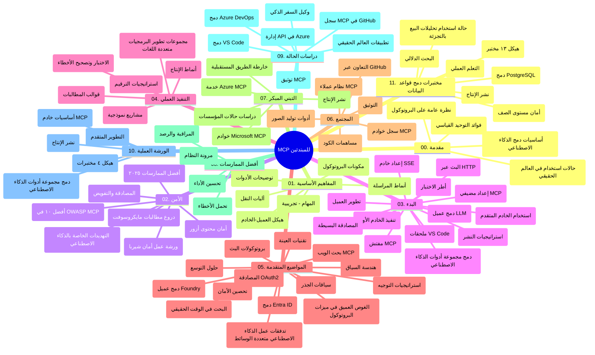

# بروتوكول سياق النموذج (MCP) للمبتدئين - دليل الدراسة

يوفر هذا الدليل الدراسي نظرة عامة على هيكل المستودع ومحتواه لمنهج "بروتوكول سياق النموذج (MCP) للمبتدئين". استخدم هذا الدليل للتنقل في المستودع بكفاءة والاستفادة القصوى من الموارد المتاحة.

## نظرة عامة على المستودع

بروتوكول سياق النموذج (MCP) هو إطار معياري للتفاعلات بين نماذج الذكاء الاصطناعي وتطبيقات العملاء. تم إنشاؤه في البداية بواسطة Anthropic، ويُدار الآن من خلال مجتمع MCP الأوسع عبر منظمة GitHub الرسمية. يوفر هذا المستودع منهجًا شاملاً مع أمثلة برمجية عملية بلغات C# وJava وJavaScript وPython وTypeScript، مصممة لمطوري الذكاء الاصطناعي، ومهندسي الأنظمة، ومهندسي البرمجيات.

## خريطة المنهج البصري

## هيكل المستودع

ينظم المستودع في أحد عشر قسمًا رئيسيًا، يركز كل منها على جوانب مختلفة من MCP:

1. **مقدمة (00-Introduction/)**
   - نظرة عامة على بروتوكول سياق النموذج
   - أهمية التوحيد القياسي في خطوط أنابيب الذكاء الاصطناعي
   - حالات استخدام عملية وفوائد

2. **المفاهيم الأساسية (01-CoreConcepts/)**
   - بنية العميل-الخادم
   - المكونات الرئيسية للبروتوكول
   - أنماط الرسائل في MCP

3. **الأمان (02-Security/)**
   - تهديدات الأمان في أنظمة MCP
   - أفضل الممارسات لتأمين التطبيقات
   - استراتيجيات المصادقة والتفويض
   - **توثيق أمني شامل**:
     - أفضل ممارسات أمان MCP 2025
     - دليل تنفيذ أمان المحتوى Azure
     - ضوابط وتقنيات أمان MCP
     - مرجع سريع لأفضل ممارسات MCP
   - **موضوعات أمنية رئيسية**:
     - هجمات حقن الموجه وتسميم الأدوات
     - اختطاف الجلسة ومشكلات الوكيل المضطرب
     - ثغرات تمرير الرموز (Token passthrough)
     - الأذونات المفرطة ومراقبة الوصول
     - أمن سلسلة التوريد لمكونات الذكاء الاصطناعي
     - تكامل Microsoft Prompt Shields

4. **البدء (03-GettingStarted/)**
   - إعداد البيئة والتكوين
   - إنشاء خوادم وعملا لل MCP أساسية
   - التكامل مع التطبيقات الحالية
   - يشمل الأقسام التالية:
     - تنفيذ الخادم الأول
     - تطوير العميل
     - تكامل عميل LLM
     - تكامل VS Code
     - خادم الأحداث المرسلة من الخادم (SSE)
     - استخدام متقدم للخادم
     - البث عبر HTTP
     - تكامل مجموعة أدوات الذكاء الاصطناعي
     - استراتيجيات الاختبار
     - إرشادات النشر

5. **التنفيذ العملي (04-PracticalImplementation/)**
   - استخدام SDK عبر لغات البرمجة المختلفة
   - تقنيات التصحيح، والاختبار، والتحقق
   - تصميم قوالب موجه قابلة لإعادة الاستخدام وسير العمل
   - مشاريع نموذجية مع أمثلة تنفيذ

6. **الموضوعات المتقدمة (05-AdvancedTopics/)**
   - تقنيات هندسة السياق
   - تكامل وكيل Foundry
   - سير عمل للذكاء الاصطناعي متعدد الوسائط
   - عروض توضيحية للمصادقة OAuth2
   - قدرات البحث في الوقت الفعلي
   - البث في الوقت الفعلي
   - تنفيذ سياقات الجذر
   - استراتيجيات التوجيه
   - تقنيات أخذ العينات
   - طرق التوسيع
   - اعتبارات الأمان
   - تكامل أمان Entra ID
   - تكامل البحث عبر الويب

7. **مساهمات المجتمع (06-CommunityContributions/)**
   - كيفية المساهمة بالكود والوثائق
   - التعاون عبر GitHub
   - التحسينات وردود الفعل من المجتمع
   - استخدام عملاء MCP المتعددين (Claude Desktop، Cline، VSCode)
   - العمل مع خوادم MCP الشهيرة بما في ذلك توليد الصور

8. **دروس من التبني المبكر (07-LessonsfromEarlyAdoption/)**
   - تطبيقات العالم الحقيقي وقصص النجاح
   - بناء ونشر حلول قائمة على MCP
   - الاتجاهات وخارطة الطريق المستقبلية
   - **دليل خوادم Microsoft MCP**: دليل شامل لعشرة خوادم MCP جاهزة للإنتاج من Microsoft تشمل:
     - خادم Microsoft Learn Docs MCP
     - خادم Azure MCP (أكثر من 15 موصل متخصص)
     - خادم GitHub MCP
     - خادم Azure DevOps MCP
     - خادم MarkItDown MCP
     - خادم SQL Server MCP
     - خادم Playwright MCP
     - خادم Dev Box MCP
     - خادم Azure AI Foundry MCP
     - خادم Microsoft 365 Agents Toolkit MCP

9. **أفضل الممارسات (08-BestPractices/)**
   - تحسين الأداء والتنسيق
   - تصميم أنظمة MCP مقاومة للأخطاء
   - استراتيجيات الاختبار والمرونة

10. **دراسات الحالة (09-CaseStudy/)**
    - **سبع دراسات حالة شاملة** تظهر مرونة MCP عبر السيناريوهات المتنوعة:
    - **وكلاء السفر Azure AI**: تنسيق متعدد الوكلاء مع Azure OpenAI و AI Search
    - **تكامل Azure DevOps**: أتمتة سير العمل باستخدام تحديثات بيانات YouTube
    - **استرجاع الوثائق في الوقت الحقيقي**: عميل وحدة تحكم Python مع بث HTTP
    - **مولد خطة الدراسة التفاعلية**: تطبيق ويب Chainlit مع ذكاء اصطناعي تحاوري
    - **الوثائق داخل المحرر**: تكامل VS Code مع سير عمل GitHub Copilot
    - **إدارة API Azure**: تكامل API مؤسسي مع إنشاء خادم MCP
    - **سجل GitHub MCP**: تطوير النظام البيئي ومنصة التكامل الوكلي
    - أمثلة تنفيذ تمتد عبر التكامل المؤسسي، وإنتاجية المطور، وتطوير النظام البيئي

11. **ورشة عمل عملية (10-StreamliningAIWorkflowsBuildingAnMCPServerWithAIToolkit/)**
    - ورشة عمل عملية شاملة تجمع MCP مع مجموعة أدوات الذكاء الاصطناعي
    - بناء تطبيقات ذكية تربط نماذج الذكاء الاصطناعي بالأدوات الحياتية
    - وحدات عملية تغطي الأساسيات، وتطوير الخوادم المخصصة، واستراتيجيات النشر الإنتاجي
    - **هيكل المختبر**:
      - المختبر 1: أساسيات خادم MCP
      - المختبر 2: تطوير خادم MCP متقدم
      - المختبر 3: تكامل مجموعة أدوات الذكاء الاصطناعي
      - المختبر 4: النشر الإنتاجي والتوسع
    - نهج التعلم القائم على المختبر مع تعليمات خطوة بخطوة

12. **مختبرات تكامل قاعدة بيانات خادم MCP (11-MCPServerHandsOnLabs/)**
    - **مسار تعلم شامل من 13 مختبرًا** لبناء خوادم MCP جاهزة للإنتاج مع تكامل PostgreSQL
    - **تطبيق تحليلات البيع بالتجزئة في العالم الحقيقي** باستخدام حالة استخدام Zava Retail
    - **أنماط مؤسسية** تشمل أمان مستوى الصف (RLS)، البحث الدلالي، والوصول متعدد المستأجرين للبيانات
    - **هيكل المختبر الكامل**:
      - **المختبرات 00-03: الأساسيات** - المقدمة، البنية، الأمان، إعداد البيئة
      - **المختبرات 04-06: بناء خادم MCP** - تصميم قاعدة البيانات، تنفيذ خادم MCP، تطوير الأدوات
      - **المختبرات 07-09: الميزات المتقدمة** - البحث الدلالي، الاختبار والتصحيح، تكامل VS Code
      - **المختبرات 10-12: الإنتاج وأفضل الممارسات** - النشر، المراقبة، التحسين
    - **التقنيات المشمولة**: إطار FastMCP، PostgreSQL، Azure OpenAI، تطبيقات Azure Container، Application Insights
    - **نتائج التعلم**: خوادم MCP جاهزة للإنتاج، أنماط تكامل قواعد البيانات، تحليلات مدعومة بالذكاء الاصطناعي، أمان مؤسسي

## موارد إضافية

يتضمن المستودع موارد داعمة:

- **مجلد الصور**: يحتوي على مخططات ورسوم توضيحية مستخدمة في المناهج
- **الترجمات**: دعم متعدد اللغات مع ترجمات تلقائية للوثائق
- **الموارد الرسمية لـMCP**:
  - [توثيق MCP](https://modelcontextprotocol.io/)
  - [مواصفة MCP](https://spec.modelcontextprotocol.io/)
  - [مستودع MCP على GitHub](https://github.com/modelcontextprotocol)

## كيفية استخدام هذا المستودع

1. **التعلم المتسلسل**: اتبع الفصول بالترتيب (من 00 إلى 11) لتجربة تعلم منظمة.
2. **التركيز على لغة محددة**: إذا كنت مهتمًا بلغة برمجة معينة، استكشف مجلدات الأمثلة لتنفيذات في لغتك المفضلة.
3. **التنفيذ العملي**: ابدأ بقسم "البدء" لإعداد بيئتك وإنشاء أول خادم وعميل MCP لديك.
4. **الاستكشاف المتقدم**: بمجرد أن تتقن الأساسيات، اغمر في الموضوعات المتقدمة لتوسيع معرفتك.
5. **المشاركة المجتمعية**: انضم إلى مجتمع MCP عبر مناقشات GitHub وقنوات Discord لتتواصل مع خبراء وزملاء المطورين.

## عملاء MCP وأدواته

يغطي المنهج عملاء وأدوات MCP المتنوعة:

1. **العملاء الرسميون**:
   - Visual Studio Code
   - MCP في Visual Studio Code
   - Claude Desktop
   - Claude في VSCode
   - Claude API

2. **عملاء المجتمع**:
   - Cline (مبني على الطرفية)
   - Cursor (محرر أكواد)
   - ChatMCP
   - Windsurf

3. **أدوات إدارة MCP**:
   - MCP CLI
   - MCP Manager
   - MCP Linker
   - MCP Router

## خوادم MCP الشعبية

يقدم المستودع خوادم MCP متعددة، تشمل:

1. **خوادم Microsoft MCP الرسمية**:
   - خادم Microsoft Learn Docs MCP
   - خادم Azure MCP (أكثر من 15 موصل متخصص)
   - خادم GitHub MCP
   - خادم Azure DevOps MCP
   - خادم MarkItDown MCP
   - خادم SQL Server MCP
   - خادم Playwright MCP
   - خادم Dev Box MCP
   - خادم Azure AI Foundry MCP
   - خادم Microsoft 365 Agents Toolkit MCP

2. **خوادم مرجعية رسمية**:
   - Filesystem
   - Fetch
   - Memory
   - Sequential Thinking

3. **توليد الصور**:
   - Azure OpenAI DALL-E 3
   - Stable Diffusion WebUI
   - Replicate

4. **أدوات التطوير**:
   - Git MCP
   - Terminal Control
   - Code Assistant

5. **خوادم متخصصة**:
   - Salesforce
   - Microsoft Teams
   - Jira & Confluence

## المساهمة

يرحب هذا المستودع بالمساهمات من المجتمع. راجع قسم مساهمات المجتمع للحصول على إرشادات حول كيفية المساهمة بشكل فعال في نظام MCP البيئي.

----

*تم تحديث هذا الدليل الدراسي آخر مرة في 5 فبراير 2026، ويعكس أحدث مواصفة MCP بتاريخ 2025-11-25 ويقدم نظرة عامة على المستودع حتى ذلك التاريخ. قد يتم تحديث محتوى المستودع بعد هذا التاريخ.*

---

<!-- CO-OP TRANSLATOR DISCLAIMER START -->
**تنويه**:
تمت ترجمة هذا المستند باستخدام خدمة الترجمة الآلية [Co-op Translator](https://github.com/Azure/co-op-translator). رغم أنَّنا نسعى للدقة، يُرجى العلم أن الترجمات الآلية قد تحتوي على أخطاء أو عدم دقة. يجب اعتبار المستند الأصلي بلغته الأصلية المصدر الرسمي والمعتمد. للمعلومات الحساسة أو الهامة، يُنصح بالاعتماد على ترجمة احترافية من قبل بشر. نحن غير مسؤولين عن أي سوء فهم أو تأويل ناتج عن استخدام هذه الترجمة.
<!-- CO-OP TRANSLATOR DISCLAIMER END -->