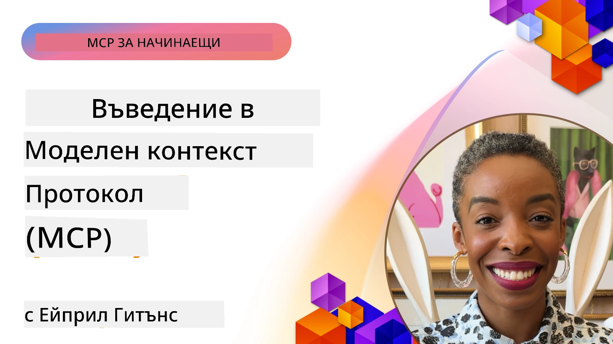
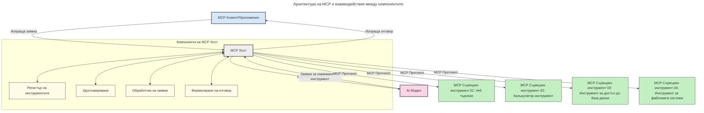

# Въведение в протокола за контекст на модела (MCP): Защо е важен за мащабируеми AI приложения

[](https://youtu.be/agBbdiOPLQA)

_(Кликнете върху изображението по-горе, за да гледате видео на този урок)_

Приложенията с генеративен AI представляват голяма стъпка напред, тъй като често позволяват на потребителя да взаимодейства с приложението чрез естествени езикови подкани. Въпреки това, с нарастването на времето и ресурсите, които се влагат в такива приложения, искате да сте сигурни, че можете лесно да интегрирате функционалности и ресурси по начин, който е лесен за разширяване, че вашето приложение може да поддържа използването на повече от един модел и да се справя с различни особености на моделите. Накратко, създаването на приложения за генеративен AI е лесно за начало, но с развитието им и ставането им по-сложни, трябва да започнете да дефинирате архитектура и вероятно ще трябва да разчитате на стандарт, който да гарантира, че вашите приложения са изградени по единен начин. Тук идва ролята на MCP, за да организира нещата и да предостави стандарт.

---

## **🔍 Какво е протоколът за контекст на модела (MCP)?**

**Протоколът за контекст на модела (MCP)** е **отворен, стандартизиран интерфейс**, който позволява на големите езикови модели (LLMs) да взаимодействат безпроблемно с външни инструменти, API и източници на данни. Той предоставя последователна архитектура за разширяване на функционалността на AI моделите отвъд техните тренировъчни данни, позволявайки по-умни, мащабируеми и по-отзивчиви AI системи.

---

## **🎯 Защо стандартизацията в AI е важна**

С нарастването на сложността на генеративните AI приложения е от съществено значение да се приемат стандарти, които осигуряват **мащабируемост, разширяемост, поддържане** и **избягване на зависимост от конкретен доставчик**. MCP отговаря на тези нужди чрез:

- Унифициране на интеграциите между модели и инструменти
- Намаляване на крехки, еднократни специални решения
- Позволяване на множество модели от различни доставчици да съществуват в една екосистема

**Забележка:** Въпреки че MCP се представя като отворен стандарт, няма планове да се стандартизира MCP чрез някой от съществуващите стандартни органи като IEEE, IETF, W3C, ISO или друг стандартен орган.

---

## **📚 Цели на обучението**

В края на тази статия ще можете да:

- Определите **протокола за контекст на модела (MCP)** и неговите случаи на използване
- Разберете как MCP стандартизира комуникацията между модел и инструмент
- Идентифицирате основните компоненти на архитектурата на MCP
- Изследвате реални приложения на MCP в корпоративен и разработващ контекст

---

## **💡 Защо протоколът за контекст на модела (MCP) променя играта**

### **🔗 MCP решава фрагментацията в взаимодействията с AI**

Преди MCP, интеграцията на модели с инструменти изискваше:

- Персонализиран код за всяка двойка инструмент-модел
- Нестандартизирани API за всеки доставчик
- Чести прекъсвания поради обновявания
- Лоша мащабируемост при добавяне на повече инструменти

### **✅ Ползи от стандартизацията на MCP**

| **Полза**               | **Описание**                                                                    |
|-------------------------|--------------------------------------------------------------------------------|
| Съвместимост            | LLMs работят безпроблемно с инструменти от различни доставчици                |
| Последователност        | Униформено поведение по платформи и инструменти                               |
| Преизползваемост        | Инструментите, създадени веднъж, могат да се използват в различни проекти и системи |
| Ускорено разработване   | Намаляване на времето за разработка с използване на стандартизирани, plug-and-play интерфейси |

---

## **🧱 Общ преглед на високо ниво на архитектурата на MCP**

MCP следва **клиент-сървър модел**, където:

- **MCP хостове** стартират AI моделите
- **MCP клиенти** инициират заявки
- **MCP сървъри** предоставят контекст, инструменти и възможности

### **Ключови компоненти:**

- **Ресурси** – Статични или динамични данни за моделите  
- **Подпомагания (Prompts)** – Предопределени работни потоци за насочено генериране  
- **Инструменти** – Изпълними функции като търсене, изчисления  
- **Семплиране** – Агентно поведение чрез рекурсивни взаимодействия  
- **Извличане** – Заявки инициирани от сървъра за въвеждане от потребителя  
- **Корени (Roots)** – Граници на файловата система за контрол на достъпа на сървъра

### **Архитектура на протокола:**

MCP използва двуслойна архитектура:
- **Слой данни**: Комуникация базирана на JSON-RPC 2.0 с управление на жизнения цикъл и примитиви
- **Транспортен слой**: STDIO (локален) и Streamable HTTP със SSE (отдалечен) комуникационни канали

---

## Как работят MCP сървърите

MCP сървърите работят по следния начин:

- **Поток на заявките**:
    1. Заявка се инициира от краен потребител или софтуер, действащ от негово име.
    2. **MCP клиент** изпраща заявката към **MCP хост**, който управлява изпълнението на AI модела.
    3. **AI моделът** получава потребителската подкана и може да поиска достъп до външни инструменти или данни чрез един или повече т.нар. tool calls.
    4. **MCP хостът**, а не директно моделът, комуникира с подходящите **MCP сървъри**, използвайки стандартизирания протокол.
- **Функционалност на MCP хоста**:
    - **Регистър на инструменти**: Поддържа каталог на наличните инструменти и техните възможности.
    - **Автентикация**: Проверява разрешенията за достъп до инструментите.
    - **Обработващ заявките компонент**: Обработва входящите заявки за инструменти от модела.
    - **Форматиращ отговорите компонент**: Структурира изхода от инструментите в формат, който моделът може да разбере.
- **Изпълнение на MCP сървъра**:
    - **MCP хостът** насочва повикванията към един или повече **MCP сървъри**, всеки от които предлага специализирани функции (например търсене, изчисления, заявки към база данни).
    - **MCP сървърите** изпълняват съответните операции и връщат резултати на **MCP хоста** в стандартизиран формат.
    - **MCP хостът** форматира и препраща тези резултати към **AI модела**.
- **Завършване на отговора**:
    - **AI моделът** включва изходните данни от инструментите в крайния отговор.
    - **MCP хостът** изпраща този отговор обратно към **MCP клиента**, който го предоставя на крайния потребител или извикващия софтуер.
    


## 👨‍💻 Как да изградим MCP сървър (с примери)

MCP сървърите ви позволяват да разширите възможностите на LLM чрез предоставяне на данни и функционалности.

Готови ли сте да опитате? Ето специфични SDK за езици и/или стекове с примери за създаване на прости MCP сървъри на различни езици/стекове:

- **Python SDK**: https://github.com/modelcontextprotocol/python-sdk

- **TypeScript SDK**: https://github.com/modelcontextprotocol/typescript-sdk

- **Java SDK**: https://github.com/modelcontextprotocol/java-sdk

- **C#/.NET SDK**: https://github.com/modelcontextprotocol/csharp-sdk


## 🌍 Реални случаи на използване на MCP

MCP позволява широк спектър от приложения чрез разширяване на AI възможностите:

| **Приложение**               | **Описание**                                                                    |
|------------------------------|--------------------------------------------------------------------------------|
| Интеграция на корпоративни данни  | Свързване на LLM с бази данни, CRM системи или вътрешни инструменти          |
| Агентни AI системи           | Позволяване на автономни агенти с достъп до инструменти и работни процеси за вземане на решения |
| Мултимодални приложения      | Комбиниране на текстови, изображенчески и аудио инструменти в едно единно AI приложение |
| Интеграция на данни в реално време | Въвеждане на живи данни в AI взаимодействия за по-точни, актуални резултати  |


### 🧠 MCP = Универсален стандарт за AI взаимодействия

Протоколът за контекст на модела (MCP) действа като универсален стандарт за AI взаимодействия, подобно на това как USB-C стандартизира физическите връзки за устройства. В света на AI, MCP осигурява последователен интерфейс, позволявайки на моделите (клиентите) да се интегрират безпроблемно с външни инструменти и доставчици на данни (сървъри). Това премахва нуждата от разнообразни, персонализирани протоколи за всеки API или източник на данни.

Под MCP, инструмент, съвместим с MCP (наричан MCP сървър), следва единен стандарт. Тези сървъри могат да изброяват предлаганите инструменти или действия и да изпълняват тези действия, когато бъдат поискани от AI агент. Платформите за AI агенти, които поддържат MCP, могат да откриват налични инструменти на сървърите и да ги извикват чрез този стандартен протокол.

### 💡 Улеснява достъпа до знания

Освен че предлага инструменти, MCP улеснява и достъпа до знания. Той позволява приложенията да предоставят контекст на големите езикови модели (LLMs), като ги свързва с различни източници на данни. Например, MCP сървър може да представлява хранилище от документи на дадена компания, позволявайки на агентите да извличат релевантна информация при поискване. Друг сървър може да обработва специфични действия като изпращане на имейли или актуализиране на записи. От гледна точка на агента, това са просто инструменти, които може да използва – някои инструменти връщат данни (знание), докато други изпълняват действия. MCP ефективно управлява и двете.

Агент, свързващ се с MCP сървър, автоматично научава наличните възможности и достъпните данни на сървъра чрез стандартен формат. Тази стандартизация позволява динамична наличност на инструментите. Например, добавянето на нов MCP сървър в системата на агента прави неговите функции веднага достъпни без необходимост от допълнително персонализиране на инструкциите на агента.

Тази оптимизирана интеграция отговаря на потока, изобразен на следната схема, където сървърите предоставят както инструменти, така и знания, осигурявайки безпроблемно взаимодействие между системите.

### 👉 Пример: Мащабируемо агентно решение

```mermaid
---
title: Разширяема агенска система с MCP
description: Диаграма, илюстрираща как потребител взаимодейства с LLM, който се свързва с множество MCP сървъри, като всеки сървър предоставя както знания, така и инструменти, създавайки мащабируема архитектура на AI система
---
graph TD
    User -->|Подсказка| LLM
    LLM -->|Отговор| User
    LLM -->|MCP| ServerA
    LLM -->|MCP| ServerB
    ServerA -->|Универсален конектор| ServerB
    ServerA --> KnowledgeA
    ServerA --> ToolsA
    ServerB --> KnowledgeB
    ServerB --> ToolsB

    subgraph Server A
        KnowledgeA[Знания]
        ToolsA[Инструменти]
    end

    subgraph Server B
        KnowledgeB[Знания]
        ToolsB[Инструменти]
    end
```Универсалният конектор позволява MCP сървърите да комуникират и споделят възможности помежду си, позволявайки на ServerA да делегира задачи на ServerB или да достъпва неговите инструменти и знания. Това федерализира инструментите и данните между сървърите, поддържайки мащабируеми и модулни агентни архитектури. Тъй като MCP стандартизира излагането на инструменти, агентите могат динамично да откриват и маршрутизират заявките между сървърите без твърдо кодираните интеграции.

Федерализация на инструменти и знания: Инструменти и данни могат да се достъпват между сървъри, позволявайки по-мащабируеми и модулни агентни архитектури.

### 🔄 Разширени сценарии на MCP с интеграция на LLM от страна на клиента

Отвъд базовата архитектура на MCP има разширени сценарии, в които както клиентът, така и сървърът съдържат LLM, позволявайки по-сложни взаимодействия. В следната схема, **Клиентското приложение** може да бъде IDE с налични MCP инструменти за използване от LLM:

```mermaid
---
title: Разширени MCP сценарии с интеграция на клиент-сървър LLM
description: Диаграма на последователността, показваща детайлния поток на взаимодействие между потребител, клиентско приложение, клиентски LLM, множество MCP сървъри и сървър LLM, илюстрираща откриване на инструменти, взаимодействие с потребителя, директно извикване на инструменти и етапи на договаряне на функции
---
sequenceDiagram
    autonumber
    actor User as 👤 Потребител
    participant ClientApp as 🖥️ Клиентско приложение
    participant ClientLLM as 🧠 Клиентски LLM
    participant Server1 as 🔧 MCP сървър 1
    participant Server2 as 📚 MCP сървър 2
    participant ServerLLM as 🤖 Сървър LLM
    
    %% Discovery Phase
    rect rgb(220, 240, 255)
        Note over ClientApp, Server2: ЕТАП НА ОТКРИВАНЕ НА ИНСТРУМЕНТИ
        ClientApp->>+Server1: Искане за налични инструменти/ресурси
        Server1-->>-ClientApp: Връща списък с инструменти (JSON)
        ClientApp->>+Server2: Искане за налични инструменти/ресурси
        Server2-->>-ClientApp: Връща списък с инструменти (JSON)
        Note right of ClientApp: Локално съхранение на<br/>комбиниран каталог с инструменти
    end
    
    %% User Interaction
    rect rgb(255, 240, 220)
        Note over User, ClientLLM: ЕТАП НА ВЗАИМОДЕЙСТВИЕ С ПОТРЕБИТЕЛЯ
        User->>+ClientApp: Въвеждане на естествен езиков въпрос
        ClientApp->>+ClientLLM: Препращане на въпроса + каталог с инструменти
        ClientLLM->>-ClientLLM: Анализиране на въпроса и избор на инструменти
    end
    
    %% Scenario A: Direct Tool Calling
    alt Директно извикване на инструменти
        rect rgb(220, 255, 220)
            Note over ClientApp, Server1: СЦЕНАРИЙ A: ДИРЕКТНО ИЗВИКВАНЕ НА ИНСТРУМЕНТИ
            ClientLLM->>+ClientApp: Искане за изпълнение на инструмент
            ClientApp->>+Server1: Изпълнение на конкретен инструмент
            Server1-->>-ClientApp: Връща резултати
            ClientApp->>+ClientLLM: Обработва резултатите
            ClientLLM-->>-ClientApp: Генерира отговор
            ClientApp-->>-User: Показва окончателен отговор
        end
    
    %% Scenario B: Feature Negotiation (VS Code style)
    else Договаряне на функции (стил VS Code)
        rect rgb(255, 220, 220)
            Note over ClientApp, ServerLLM: СЦЕНАРИЙ B: ДОГОВАРЯНЕ НА ФУНКЦИИТЕ
            ClientLLM->>+ClientApp: Определяне на нужните възможности
            ClientApp->>+Server2: Договаряне на функции/възможности
            Server2->>+ServerLLM: Искане за допълнителен контекст
            ServerLLM-->>-Server2: Предоставя контекст
            Server2-->>-ClientApp: Връща налични функции
            ClientApp->>+Server2: Извикване на договорени инструменти
            Server2-->>-ClientApp: Връща резултати
            ClientApp->>+ClientLLM: Обработва резултатите
            ClientLLM-->>-ClientApp: Генерира отговор
            ClientApp-->>-User: Показва окончателен отговор
        end
    end
```
## 🔐 Практическите ползи от MCP

Ето практическите ползи от използването на MCP:

- **Свежест**: Моделите могат да получават достъп до актуална информация, извън техните тренировъчни данни
- **Разширяване на възможностите**: Моделите могат да използват специализирани инструменти за задачи, за които не са били обучавани
- **Намаление на халюцинации**: Външните източници на данни осигуряват фактологична обосновка
- **Поверителност**: Чувствителните данни могат да останат в защитена среда, вместо да се вграждат в подкани

## 📌 Основни изводи

Следните са основните изводи при използване на MCP:

- **MCP** стандартизира как AI моделите взаимодействат с инструменти и данни
- Насърчава **разширяемост, последователност и съвместимост**
- MCP помага за **намаляване на времето за разработка, повишаване на надеждността и разширяване на възможностите на моделите**
- Архитектурата клиент-сървър позволява **гъвкави, разширяеми AI приложения**

## 🧠 Упражнение

Помислете за AI приложение, което бихте искали да създадете.

- Кои **външни инструменти или данни** биха подобрили неговите възможности?
- Как MCP би направил интеграцията **по-проста и по-надеждна?**

## Допълнителни ресурси

- [MCP GitHub хранилище](https://github.com/modelcontextprotocol)


## Какво следва

Следва: [Глава 1: Основни концепции](../01-CoreConcepts/README.md)

---

<!-- CO-OP TRANSLATOR DISCLAIMER START -->
**Отказ от отговорност**:  
Този документ е преведен с помощта на AI преводаческа услуга [Co-op Translator](https://github.com/Azure/co-op-translator). Въпреки усилията ни за точност, имайте предвид, че автоматизираните преводи могат да съдържат грешки или неточности. Оригиналният документ на неговия роден език трябва да се счита за авторитетен източник. За критична информация се препоръчва професионален човешки превод. Ние не носим отговорност за недоразумения или неправилни тълкувания, произтичащи от използването на този превод.
<!-- CO-OP TRANSLATOR DISCLAIMER END -->