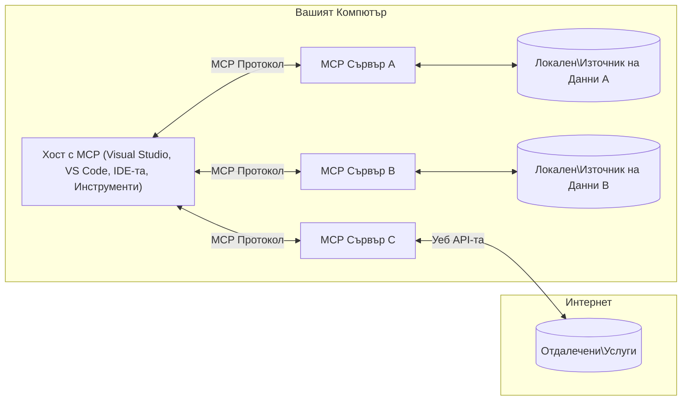

# MCP Основни концепции: Овладяване на Model Context Protocol за интеграция на изкуствен интелект

[](https://youtu.be/earDzWGtE84)

_(Кликнете на горното изображение, за да гледате видеото на този урок)_

[Model Context Protocol (MCP)](https://github.com/modelcontextprotocol) е мощна, стандартизирана рамка, която оптимизира комуникацията между Големите езикови модели (LLMs) и външни инструменти, приложения и източници на данни.  
Този наръчник ще ви преведе през основните концепции на MCP. Ще научите за архитектурата клиент-сървър, основните компоненти, механиката на комуникация и добрите практики за внедряване.

- **Явно съгласие на потребителя**: Цял достъп до данни и операции изискват явно одобрение от потребителя преди изпълнение. Потребителите трябва ясно да разбират какви данни ще бъдат достъпвани и какви действия ще бъдат извършени, с гранулиран контрол върху разрешенията и упълномощаването.

- **Защита на поверителността на данните**: Потребителските данни се разкриват само с явно съгласие и трябва да бъдат защитени чрез robust контроли на достъпа през целия жизнен цикъл на взаимодействието. Имплементациите трябва да предотвратяват неразрешено предаване на данни и да поддържат строги граници на поверителност.

- **Безопасност при изпълнение на инструменти**: Всяко извикване на инструмент изисква явно съгласие на потребителя с ясно разбиране на функционалността, параметрите и потенциалното въздействие на инструмента. Robust граници за сигурност трябва да предотвратяват нежелано, опасно или злонамерено изпълнение на инструменти.

- **Сигурност на транспортния слой**: Всички комуникационни канали трябва да използват подходящи механизми за криптиране и удостоверяване. Външните връзки трябва да внедряват сигурни транспортни протоколи и правилно управление на удостоверителните данни.

#### Насоки за внедряване:

- **Управление на разрешения**: Внедрявайте фино настроени системи за разрешения, които позволяват на потребителите да контролират кои сървъри, инструменти и ресурси да са достъпни  
- **Удостоверяване и упълномощаване**: Използвайте сигурни методи за удостоверяване (OAuth, API ключове) с правилно управление на токени и изтичане на валидността  
- **Валидация на входни данни**: Валидирайте всички параметри и входни данни според дефинирани схеми за предотвратяване на инжекционни атаки  
- **Регистриране на одити**: Поддържайте пълни логове на всички операции за наблюдение на сигурността и съответствието

## Преглед

Този урок разглежда основната архитектура и компоненти, изграждащи екосистемата на Model Context Protocol (MCP). Ще научите за архитектурата клиент-сървър, ключовите компоненти и комуникационните механизми, които задвижват взаимодействията в MCP.

## Основни учебни цели

След края на урока ще:

- Разбирате архитектурата клиент-сървър на MCP.  
- Идентифицирате ролите и отговорностите на Хостове, Клиенти и Сървъри.  
- Анализирате основните характеристики, които правят MCP гъвкав интеграционен слой.  
- Научите как информацията тече в екосистемата MCP.  
- Получите практически прозрения чрез кодови примери в .NET, Java, Python и JavaScript.

## Архитектура на MCP: По-задълбочен поглед

Екосистемата MCP е изградена върху модел клиент-сървър. Тази модулна структура позволява на AI приложенията ефективно да взаимодействат с инструменти, бази данни, API и контекстуални ресурси. Нека разгледаме тази архитектура по съставните ѝ части.

В основата си MCP следва архитектура клиент-сървър, при която хост приложение може да се свърже с множество сървъри:


- **MCP Хостове**: Програми като VSCode, Claude Desktop, IDE или AI инструменти, които искат да имат достъп до данни чрез MCP  
- **MCP Клиенти**: Протоколни клиенти, които поддържат 1:1 връзки със сървърите  
- **MCP Сървъри**: Леки програми, които всеки предоставя специфични възможности чрез стандартизирания Model Context Protocol  
- **Локални източници на данни**: Файлове, бази данни и услуги на вашия компютър, до които MCP сървърите могат да имат сигурен достъп  
- **Отдалечени услуги**: Външни системи, достъпни чрез интернет, към които MCP сървърите могат да се свързват чрез API.

MCP Протоколът е развиващ се стандарт с версия, определена по дата (формат ГГГГ-ММ-ДД). Текущата версия на протокола е **2025-11-25**. Можете да видите последните актуализации на [спецификацията на протокола](https://modelcontextprotocol.io/specification/2025-11-25/)

### 1. Хостове

В Model Context Protocol (MCP) **Хостовете** са AI приложенията, които служат като основен интерфейс, чрез който потребителите взаимодействат с протокола. Хостовете координират и управляват връзките към множество MCP сървъри чрез създаване на отделни MCP клиенти за всяка сървърна връзка. Примери за хостове включват:

- **AI приложения**: Claude Desktop, Visual Studio Code, Claude Code  
- **Среда за разработка**: IDE и редактори на код с MCP интеграция  
- **Потребителски приложения**: Специално създадени AI агенти и инструменти

**Хостовете** са приложения, които координират взаимодействията с AI модели. Те:

- **Оркестрират AI модели**: Извършват или взаимодействат с LLMs за генериране на отговори и координиране на AI задачи  
- **Управляват връзките на клиенти**: Създават и поддържат по един MCP клиент за всяка връзка към MCP сървър  
- **Контролират потребителския интерфейс**: Управляват течението на разговори, потребителските взаимодействия и представянето на отговори  
- **Налагат сигурност**: Контролират разрешения, ограничения за сигурност и удостоверяване  
- **Обработват съгласието на потребителя**: Управляват одобрението на потребителя за споделяне на данни и изпълнение на инструменти

### 2. Клиенти

**Клиентите** са основни компоненти, които поддържат специализирани връзки едно към едно между Хостове и MCP сървъри. Всеки MCP клиент се създава от Хоста, за да се свърже към конкретен MCP сървър, осигурявайки организирани и сигурни комуникационни канали. Множество клиенти позволяват на Хостовете да се свързват с няколко сървъра едновременно.

**Клиентите** са свързващи компоненти в хост приложението. Те:

- **Протоколна комуникация**: Изпращат JSON-RPC 2.0 заявки към сървърите с подканвания и инструкции  
- **Договорка на възможности**: Договарят поддържаните функции и версии на протокола със сървърите при инициализация  
- **Изпълнение на инструменти**: Управляват заявки за изпълнение на инструменти от модели и обработват отговори  
- **Обновления в реално време**: Обработват известия и обновления в реално време от сървърите  
- **Обработка на отговори**: Обработват и форматират отговорите на сървърите за показване на потребителите

### 3. Сървъри

**Сървърите** са програми, които предоставят контекст, инструменти и възможности на MCP клиентите. Те могат да се изпълняват локално (на същия компютър като Хоста) или дистанционно (външни платформи), и са отговорни за обработка на клиентските заявки и предоставяне на структурирани отговори. Сървърите предоставят специфична функционалност чрез стандартизирания Model Context Protocol.

**Сървърите** са услуги, които предоставят контекст и възможности. Те:

- **Регистрация на функции**: Регистрират и откриват наличните примитиви (ресурси, подсказки, инструменти) на клиентите  
- **Обработка на заявки**: Получават и изпълняват повиквания на инструменти, заявки за ресурси и подсказки от клиентите  
- **Осигуряване на контекст**: Предоставят контекстуална информация и данни за подобряване на отговорите на моделите  
- **Управление на състояние**: Поддържат състоянието на сесията и обработват сесийни (състояниеви) взаимодействия при нужда  
- **Известия в реално време**: Изпращат известия за промени и обновления на възможностите към свързаните клиенти

Сървърите могат да бъдат разработвани от всеки, за да разширят възможностите на моделите със специализирана функционалност, и поддържат както локални, така и отдалечени сценарии на внедряване.

### 4. Примитиви на сървъра

Сървърите в Model Context Protocol (MCP) предоставят три основни **примитива**, които дефинират фундаменталните строителни елементи за богати взаимодействия между клиенти, хостове и езикови модели. Тези примитиви определят типовете контекстуална информация и действия, налични чрез протокола.

MCP сървърите могат да изложат произволна комбинация от следните три основни примитива:

#### Ресурси

**Ресурси** са източници на данни, които предоставят контекстуална информация на AI приложенията. Те представляват статично или динамично съдържание, което може да подобри разбирането на модела и вземането на решения:

- **Контекстуални данни**: Структурирана информация и контекст за консумация от AI модела  
- **Бази знания**: Репозитории със документи, статии, ръководства и научни трудове  
- **Локални източници на данни**: Файлове, бази данни и локална системна информация  
- **Външни данни**: API отговори, уеб услуги и данни от отдалечени системи  
- **Динамично съдържание**: Данни в реално време, които се обновяват според външни условия

Ресурсите се идентифицират с URI адреси и поддържат откриване чрез методите `resources/list` и достъп чрез `resources/read`:

```text
file://documents/project-spec.md
database://production/users/schema
api://weather/current
```

#### Подсказки

**Подсказките** са повторно използваеми шаблони, които помагат да се структурира взаимодействието с езиковите модели. Те предоставят стандартизирани модели на взаимодействие и шаблони за работни потоци:

- **Взаимодействия базирани на шаблони**: Предварително структурирани съобщения и стартери на разговори  
- **Шаблони за работни потоци**: Стандартизирани последователности за общи задачи и взаимодействия  
- **Примери с малко данни**: Шаблони, основани на примери за насочване на модела  
- **Системни подсказки**: Основни подсказки, които определят поведението и контекста на модела  
- **Динамични шаблони**: Параметризирани подсказки, които се адаптират към конкретни контексти

Подсказките поддържат заместване на променливи и могат да бъдат открити чрез `prompts/list` и достъпни чрез `prompts/get`:

```markdown
Generate a {{task_type}} for {{product}} targeting {{audience}} with the following requirements: {{requirements}}
```

#### Инструменти

**Инструментите** са изпълними функции, които AI моделите могат да извикват, за да изпълнят конкретни действия. Те представляват „глаголите“ на MCP екосистемата, позволявайки на моделите да взаимодействат с външни системи:

- **Изпълними функции**: Отделни операции, които моделите могат да извикат с конкретни параметри  
- **Интеграция с външни системи**: API повиквания, заявки към бази данни, файлови операции, изчисления  
- **Уникална идентичност**: Всеки инструмент има уникално име, описание и схема на параметрите  
- **Структурирани входове/изходи**: Инструментите приемат валидирани параметри и връщат структурирани, типизирани отговори  
- **Възможности за действия**: Позволяват на моделите да извършват реални действия и да извличат актуални данни

Инструментите се дефинират с JSON схема за валидация на параметри и се откриват чрез `tools/list` и стартират чрез `tools/call`. Инструментите могат да съдържат и **икони** като допълнителни метаданни за по-добро представяне в UI.

**Анотации на инструменти**: Инструментите поддържат поведенчески анотации (напр. `readOnlyHint`, `destructiveHint`), които описват дали инструментът е само за четене или деструктивен, помагайки на клиентите да вземат осъзнати решения за изпълнението му.

Примерна дефиниция на инструмент:

```typescript
server.tool(
  "search_products", 
  {
    query: z.string().describe("Search query for products"),
    category: z.string().optional().describe("Product category filter"),
    max_results: z.number().default(10).describe("Maximum results to return")
  }, 
  async (params) => {
    // Изпълнете търсене и върнете структурирани резултати
    return await productService.search(params);
  }
);
```

## Клиентски примитиви

В Model Context Protocol (MCP) **клиентите** могат да изложат примитиви, които позволяват на сървърите да изискват допълнителни възможности от хост приложението. Тези клиентски примитиви позволяват по-богати, интерактивни реализации на сървъри, които могат да достъпват възможности на AI моделите и потребителски взаимодействия.

### Извличане на семпли (Sampling)

**Извличането на семпли** позволява на сървърите да поискат завършвания от езиков модел чрез AI приложението на клиента. Този примитив дава възможност сървърите да достъпват възможностите на LLM без да вграждат свои собствени модели:

- **Независим достъп до модела**: Сървърите могат да поискат завършвания без да включват SDK за LLM или да управляват достъп до модела  
- **AI инициирано от сървъра**: Позволява на сървърите автономно да генерират съдържание чрез AI модела на клиента  
- **Рекурсивни LLM взаимодействия**: Поддържа сложни сценарии, за които сървърите се нуждаят от AI помощ при обработка  
- **Динамично генериране на съдържание**: Позволява на сървърите да създават контекстуални отговори с помощта на модела на хоста  
- **Поддръжка на извиквания на инструменти**: Сървърите могат да включват параметри `tools` и `toolChoice`, за да разрешат на модела на клиента да извиква инструменти по време на семплиране

Извличането се инициира чрез метода `sampling/complete`, където сървърите изпращат заявки за завършване към клиентите.

### Корени (Roots)

**Корените** предоставят стандартизирани начини за клиентите да изложат файлови граници на сървърите, помагайки на сървърите да разберат до кои директории и файлове имат достъп:

- **Граници на файловата система**: Дефинират границите, в които сървърите могат да оперират във файловата система  
- **Контрол на достъпа**: Помагат на сървърите да разберат до кои директории и файлове имат разрешение за достъп  
- **Динамични обновления**: Клиентите могат да уведомяват сървърите, когато списъкът с корени се променя  
- **Идентификация базирана на URI**: Корените използват `file://` URI адреси за идентифициране на достъпни директории и файлове

Корените се откриват чрез метода `roots/list`, а клиентите изпращат `notifications/roots/list_changed`, когато корените се променят.

### Събиране на информация (Elicitation)

**Събирането на информация** позволява на сървърите да поискат допълнителна информация или потвърждение от потребителите чрез клиентския интерфейс:

- **Заявки за потребителски вход**: Сървърите могат да поискат допълнителна информация, когато е необходима за изпълнение на инструмент  
- **Диалози за потвърждение**: Искат одобрение от потребителя за чувствителни или значими операции  
- **Интерактивни работни потоци**: Позволяват на сървърите да създават стъпка по стъпка потребителски взаимодействия  
- **Динамично събиране на параметри**: Събират липсващи или опционални параметри по време на изпълнението на инструменти

Заявки за събиране се правят с метода `elicitation/request` за събиране на вход от потребителя чрез интерфейса на клиента.

**Режим URL събиране**: Сървърите могат също да изискват URL-базирани потребителски взаимодействия, позволявайки им да насочват потребителите към външни уеб страници за удостоверяване, потвърждение или въвеждане на данни.

### Логване (Logging)

**Логването** позволява на сървърите да изпращат структурирани лог съобщения към клиентите за отстраняване на грешки, мониторинг и оперативна видимост:

- **Поддръжка за отстраняване на грешки**: Позволява на сървърите да предоставят подробни логове за изпълнение за отстраняване на проблеми  
- **Оперативен мониторинг**: Изпраща статус обновления и метрики за изпълнение към клиентите  
- **Отчитане на грешки**: Предоставя детайлен контекст и диагностична информация при грешки  
- **Одитни следи**: Създава пълни логове на операции и решения на сървърите

Лог съобщенията се изпращат на клиентите, за да осигурят прозрачност на сървърните действия и да улеснят отстраняването на грешки.

## Поток на информация в MCP

Model Context Protocol (MCP) дефинира структуриран поток на информация между хостове, клиенти, сървъри и модели. Разбирането на този поток помага да се изясни как се обработват потребителските заявки и как външните инструменти и данни се интегрират в отговорите на модела.

- **Хостът инициира връзка**  
  Хост приложението (като IDE или чат интерфейс) установява връзка към MCP сървър, обикновено чрез STDIO, WebSocket или друг поддържан транспорт.

- **Договаряне на възможности**  
  Клиентът (вграден в хоста) и сървърът обменят информация за поддържаните функции, инструменти, ресурси и версии на протокола. Това осигурява общо разбиране за наличните възможности за сесията.

- **Потребителско запитване**  
  Потребителят взаимодейства с хоста (напр. въвежда подканване или команда). Хостът събира този вход и го предава на клиента за обработка.

- **Използване на ресурс или инструмент**  
  - Клиентът може да поиска допълнителен контекст или ресурси от сървъра (като файлове, записи в база данни или статии от база знания) за обогатяване на разбирането на модела.  
  - Ако моделът определи, че е необходим инструмент (напр. за извличане на данни, изпълнение на изчисление или повикване на API), клиентът изпраща заявка за стартиране на инструмент към сървъра, като посочва името и параметрите на инструмента.

- **Изпълнение от сървъра**  

  Сървърът получава заявката за ресурс или инструмент, изпълнява необходимите операции (като извършване на функция, търсене в база данни или извличане на файл) и връща резултатите на клиента в структуриран формат.

- **Генериране на отговор**  
  Клиентът интегрира отговорите на сървъра (данни от ресурси, резултати от инструменти и др.) в текущото взаимодействие с модела. Моделът използва тази информация, за да генерира пълен и контекстуално релевантен отговор.

- **Презентация на резултатите**  
  Хостът получава крайния резултат от клиента и го представя на потребителя, често включително както генерирания от модела текст, така и всякакви резултати от изпълнението на инструменти или търсения в ресурси.

Този поток позволява на MCP да поддържа усъвършенствани, интерактивни и контекстно осъзнати AI приложения чрез безпроблемно свързване на модели с външни инструменти и източници на данни.

## Архитектура на протокола и слоеве

MCP се състои от два отделни архитектурни слоя, които работят заедно, за да осигурят цялостна комуникационна рамка:

### Слой Данни

**Слой Данни** реализира основния MCP протокол, използвайки **JSON-RPC 2.0** като основа. Този слой определя структурата на съобщенията, семантиката и моделите на взаимодействие:

#### Основни компоненти:

- **Протокол JSON-RPC 2.0**: Всяка комуникация използва стандартизиран формат на съобщения JSON-RPC 2.0 за извикване на методи, отговори и известия  
- **Управление на жизнения цикъл**: Обработва инициализация на връзката, договаряне на възможности и прекратяване на сесии между клиенти и сървъри  
- **Примитиви на сървъра**: Позволява на сървърите да предоставят основна функционалност чрез инструменти, ресурси и подсказки  
- **Примитиви на клиента**: Позволява на сървърите да изискват семплиране от LLM, да искат вход от потребителя и да изпращат лог съобщения  
- **Известия в реално време**: Поддържа асинхронни известия за динамични актуализации без поллинг

#### Ключови характеристики:

- **Договаряне на версия на протокола**: Използва базирано на дата версияне (ГГГГ-ММ-ДД), за да гарантира съвместимост  
- **Откриване на възможности**: Клиентите и сървърите обменят информация за поддържаните функции по време на инициализацията  
- **Сесии със съхранено състояние**: Поддържа състоянието на връзката през няколко взаимодействия за контекстна непрекъснатост

### Транспортен слой

**Транспортният слой** управлява комуникационните канали, форматирането на съобщения и удостоверяването между участниците в MCP:

#### Поддържани транспортни механизми:

1. **STDIO транспорт**:
   - Използва стандартен вход/изход за директна комуникация между процеси  
   - Оптимален за локални процеси на една и съща машина без мрежови забавяния  
   - Често използван за локални MCP сървърни реализации

2. **Транспорт Streamable HTTP**:
   - Използва HTTP POST за съобщения от клиент към сървър  
   - Опционално Server-Sent Events (SSE) за стрийминг от сървър към клиент  
   - Позволява отдалечена комуникация със сървъри през мрежи  
   - Поддържа стандартна HTTP автентикация (Bearer токени, API ключове, персонализирани заглавки)  
   - MCP препоръчва OAuth за сигурно удостоверяване с токени

#### Абстракция на транспорта:

Транспортният слой абстрахира детайлите на комуникацията от слоя данни, позволявайки един и същ JSON-RPC 2.0 формат на съобщения във всички транспортни механизми. Тази абстракция позволява на приложения да превключват безпроблемно между локални и отдалечени сървъри.

### Съображения за сигурността

MCP имплементациите трябва да спазват няколко ключови принципа на сигурността, за да осигурят безопасни, надеждни и сигурни взаимодействия във всички операции на протокола:

- **Съгласие и контрол на потребителя**: Потребителите трябва да дадат изрично съгласие преди достъп до данни или извършване на операции. Те трябва да имат ясен контрол върху споделяните данни и разрешените действия, подпомагани от интуитивни интерфейси за преглед и одобрение на дейности.

- **Поверителност на данните**: Данните на потребителя трябва да бъдат достъпни само с изрично съгласие и да се защитават със съответните контролни механизми за достъп. MCP имплементациите трябва да предотвратяват неразрешено предаване на данни и да гарантират поддържането на поверителността през всички взаимодействия.

- **Безопасност на инструментите**: Преди да се извика който и да е инструмент, е необходимо изрично съгласие от потребителя. Потребителите трябва ясно да разбират функционалността на всеки инструмент, а стабилни граници за сигурност трябва да бъдат наложени, за да се предотврати нежелано или опасно изпълнение.

Спазвайки тези принципи на сигурността, MCP осигурява поддържане на доверието, поверителността и безопасността на потребителите през всички взаимодействия по протокола, като същевременно позволява мощни интеграции с AI.

## Примери с код: Основни компоненти

По-долу са показани примерни кодове на няколко популярни езика за програмиране, които илюстрират как да се реализират ключови MCP сървърни компоненти и инструменти.

### .NET пример: Създаване на прост MCP сървър с инструменти

Ето един практичен .NET пример, който демонстрира как да се реализира прост MCP сървър със собствени инструменти. Този пример показва как да дефинирате и регистрирате инструменти, да обработвате заявки и да свържете сървъра чрез Model Context Protocol.

```csharp
using System;
using System.Threading.Tasks;
using ModelContextProtocol.Server;
using ModelContextProtocol.Server.Transport;
using ModelContextProtocol.Server.Tools;

public class WeatherServer
{
    public static async Task Main(string[] args)
    {
        // Create an MCP server
        var server = new McpServer(
            name: "Weather MCP Server",
            version: "1.0.0"
        );
        
        // Register our custom weather tool
        server.AddTool<string, WeatherData>("weatherTool", 
            description: "Gets current weather for a location",
            execute: async (location) => {
                // Call weather API (simplified)
                var weatherData = await GetWeatherDataAsync(location);
                return weatherData;
            });
        
        // Connect the server using stdio transport
        var transport = new StdioServerTransport();
        await server.ConnectAsync(transport);
        
        Console.WriteLine("Weather MCP Server started");
        
        // Keep the server running until process is terminated
        await Task.Delay(-1);
    }
    
    private static async Task<WeatherData> GetWeatherDataAsync(string location)
    {
        // This would normally call a weather API
        // Simplified for demonstration
        await Task.Delay(100); // Simulate API call
        return new WeatherData { 
            Temperature = 72.5,
            Conditions = "Sunny",
            Location = location
        };
    }
}

public class WeatherData
{
    public double Temperature { get; set; }
    public string Conditions { get; set; }
    public string Location { get; set; }
}
```

### Java пример: MCP сървърни компоненти

Този пример демонстрира същия MCP сървър и регистрация на инструменти като по-горе в .NET, но реализиран на Java.

```java
import io.modelcontextprotocol.server.McpServer;
import io.modelcontextprotocol.server.McpToolDefinition;
import io.modelcontextprotocol.server.transport.StdioServerTransport;
import io.modelcontextprotocol.server.tool.ToolExecutionContext;
import io.modelcontextprotocol.server.tool.ToolResponse;

public class WeatherMcpServer {
    public static void main(String[] args) throws Exception {
        // Създайте MCP сървър
        McpServer server = McpServer.builder()
            .name("Weather MCP Server")
            .version("1.0.0")
            .build();
            
        // Регистрирайте инструмент за прогноза за времето
        server.registerTool(McpToolDefinition.builder("weatherTool")
            .description("Gets current weather for a location")
            .parameter("location", String.class)
            .execute((ToolExecutionContext ctx) -> {
                String location = ctx.getParameter("location", String.class);
                
                // Вземете данни за времето (опростено)
                WeatherData data = getWeatherData(location);
                
                // Върнете форматиран отговор
                return ToolResponse.content(
                    String.format("Temperature: %.1f°F, Conditions: %s, Location: %s", 
                    data.getTemperature(), 
                    data.getConditions(), 
                    data.getLocation())
                );
            })
            .build());
        
        // Свържете сървъра чрез stdio транспорт
        try (StdioServerTransport transport = new StdioServerTransport()) {
            server.connect(transport);
            System.out.println("Weather MCP Server started");
            // Поддържайте сървъра работещ, докато процесът не бъде прекратен
            Thread.currentThread().join();
        }
    }
    
    private static WeatherData getWeatherData(String location) {
        // Имплементацията би извикала API за време
        // Опростено за примерни цели
        return new WeatherData(72.5, "Sunny", location);
    }
}

class WeatherData {
    private double temperature;
    private String conditions;
    private String location;
    
    public WeatherData(double temperature, String conditions, String location) {
        this.temperature = temperature;
        this.conditions = conditions;
        this.location = location;
    }
    
    public double getTemperature() {
        return temperature;
    }
    
    public String getConditions() {
        return conditions;
    }
    
    public String getLocation() {
        return location;
    }
}
```

### Python пример: Изграждане на MCP сървър

Този пример използва fastmcp, моля първо го инсталирайте:

```python
pip install fastmcp
```
Кодов пример:

```python
#!/usr/bin/env python3
import asyncio
from fastmcp import FastMCP
from fastmcp.transports.stdio import serve_stdio

# Създаване на FastMCP сървър
mcp = FastMCP(
    name="Weather MCP Server",
    version="1.0.0"
)

@mcp.tool()
def get_weather(location: str) -> dict:
    """Gets current weather for a location."""
    return {
        "temperature": 72.5,
        "conditions": "Sunny",
        "location": location
    }

# Алтернативен подход с използване на клас
class WeatherTools:
    @mcp.tool()
    def forecast(self, location: str, days: int = 1) -> dict:
        """Gets weather forecast for a location for the specified number of days."""
        return {
            "location": location,
            "forecast": [
                {"day": i+1, "temperature": 70 + i, "conditions": "Partly Cloudy"}
                for i in range(days)
            ]
        }

# Регистриране на класови инструменти
weather_tools = WeatherTools()

# Стартиране на сървъра
if __name__ == "__main__":
    asyncio.run(serve_stdio(mcp))
```

### JavaScript пример: Създаване на MCP сървър

Този пример показва създаването на MCP сървър на JavaScript и как да се регистрират два инструмента, свързани с времето.

```javascript
// Използване на официалния SDK за Model Context Protocol
import { McpServer } from "@modelcontextprotocol/sdk/server/mcp.js";
import { StdioServerTransport } from "@modelcontextprotocol/sdk/server/stdio.js";
import { z } from "zod"; // За валидиране на параметри

// Създайте MCP сървър
const server = new McpServer({
  name: "Weather MCP Server",
  version: "1.0.0"
});

// Дефинирайте инструмент за време
server.tool(
  "weatherTool",
  {
    location: z.string().describe("The location to get weather for")
  },
  async ({ location }) => {
    // Обикновено това би извикало API за време
    // Оптимизирано за демонстрация
    const weatherData = await getWeatherData(location);
    
    return {
      content: [
        { 
          type: "text", 
          text: `Temperature: ${weatherData.temperature}°F, Conditions: ${weatherData.conditions}, Location: ${weatherData.location}` 
        }
      ]
    };
  }
);

// Дефинирайте инструмент за прогноза
server.tool(
  "forecastTool",
  {
    location: z.string(),
    days: z.number().default(3).describe("Number of days for forecast")
  },
  async ({ location, days }) => {
    // Обикновено това би извикало API за време
    // Оптимизирано за демонстрация
    const forecast = await getForecastData(location, days);
    
    return {
      content: [
        { 
          type: "text", 
          text: `${days}-day forecast for ${location}: ${JSON.stringify(forecast)}` 
        }
      ]
    };
  }
);

// Помощни функции
async function getWeatherData(location) {
  // Симулиране на повикване към API
  return {
    temperature: 72.5,
    conditions: "Sunny",
    location: location
  };
}

async function getForecastData(location, days) {
  // Симулиране на повикване към API
  return Array.from({ length: days }, (_, i) => ({
    day: i + 1,
    temperature: 70 + Math.floor(Math.random() * 10),
    conditions: i % 2 === 0 ? "Sunny" : "Partly Cloudy"
  }));
}

// Свържете сървъра, използвайки stdio транспорт
const transport = new StdioServerTransport();
server.connect(transport).catch(console.error);

console.log("Weather MCP Server started");
```

Този JavaScript пример демонстрира как да се създаде MCP клиент, който се свързва със сървър, изпраща подсказка и обработва отговора, включително извиквания на инструменти.

## Сигурност и оторизация

MCP включва няколко вградени концепции и механизми за управление на сигурността и оторизацията през целия протокол:

1. **Контрол върху разрешенията за инструменти**:  
  Клиентите могат да определят кои инструменти моделът може да използва по време на сесията. Това гарантира, че са достъпни само изрично разрешените инструменти, намалявайки риска от нежелани или опасни операции. Разрешенията могат да се конфигурират динамично според предпочитанията на потребителя, организационни политики или контекст на взаимодействието.

2. **Удостоверяване**:  
  Сървърите могат да изискват удостоверяване преди предоставяне на достъп до инструменти, ресурси или чувствителни операции. Това може да включва API ключове, OAuth токени или други схеми за удостоверяване. Коректната автентикация гарантира, че само надеждни клиенти и потребители могат да извикват възможностите на сървъра.

3. **Валидация**:  
  Валидацията на параметрите е задължителна за всички извиквания на инструменти. Всеки инструмент дефинира очакваните типове, формати и ограничения за параметрите си, а сървърът валидира входящите заявки съответно. Това предотвратява пристигане на неправилни или злонамерени данни до реализацията на инструментите и поддържа целостта на операциите.

4. **Ограничение на честотата (Rate Limiting)**:  
  За да предотврати злоупотреби и да гарантира справедливото използване на ресурсите на сървъра, MCP сървърите могат да прилагат ограничения на честотата за повиквания на инструменти и достъп до ресурси. Ограниченията могат да се прилагат на потребител, на сесия или глобално, и помагат да се предпазят от атаки тип отказ на услуга или прекомерна консумация на ресурси.

Като комбинира тези механизми, MCP предоставя сигурна основа за интегриране на езикови модели с външни инструменти и източници на данни, като дава на потребителите и разработчиците фино контролиран достъп и възможности за употреба.

## Съобщения по протокола и поток на комуникацията

Комуникацията в MCP използва структурирани съобщения **JSON-RPC 2.0**, за да осигури ясни и надеждни взаимодействия между хостове, клиенти и сървъри. Протоколът определя специфични модели на съобщения за различни видове операции:

### Основни типове съобщения:

#### **Съобщения за инициализация**
- **Заявка `initialize`**: Установява връзката и договаря версията на протокола и възможностите  
- **Отговор `initialize`**: Потвърждава поддържаните функции и информация за сървъра  
- **`notifications/initialized`**: Сигнализира че инициализацията е завършена и сесията е готова

#### **Откривателни съобщения**
- **Заявка `tools/list`**: Открива наличните инструменти от сървъра  
- **Заявка `resources/list`**: Изброява наличните ресурси (източници на данни)  
- **Заявка `prompts/list`**: Извлича наличните шаблони за подсказки

#### **Изпълнителни съобщения**  
- **Заявка `tools/call`**: Изпълнява конкретен инструмент с подадени параметри  
- **Заявка `resources/read`**: Извлича съдържание от конкретен ресурс  
- **Заявка `prompts/get`**: Взема шаблон за подсказка с опционални параметри

#### **Съобщения от страна на клиента**
- **Заявка `sampling/complete`**: Сървърът изисква завършване на LLM от клиента  
- **`elicitation/request`**: Сървърът изисква потребителски вход чрез клиентския интерфейс  
- **Лог съобщения**: Сървърът изпраща структурирани лог съобщения към клиента

#### **Известия**
- **`notifications/tools/list_changed`**: Сървър известява клиента за промени в инструментите  
- **`notifications/resources/list_changed`**: Сървър известява клиента за промени в ресурсите  
- **`notifications/prompts/list_changed`**: Сървър известява клиента за промени в подсказките

### Структура на съобщенията:

Всички MCP съобщения следват JSON-RPC 2.0 формат с:
- **Съобщения за заявки**: Включват `id`, `method` и опционални `params`  
- **Съобщения за отговор**: Включват `id` и или `result`, или `error`  
- **Известия**: Включват `method` и опционални `params` (без `id` и без очакван отговор)

Тази структурирана комуникация осигурява надеждни, проследими и разширяеми взаимодействия, поддържащи усъвършенствани сценарии като актуализации в реално време, верижно свързване на инструменти и стабилно обработване на грешки.

### Задачи (експериментални)

**Задачите** са експериментална функция, която предоставя издръжливи обвивки за изпълнение, позволяващи отложено извличане на резултати и проследяване на статус за MCP заявки:

- **Дългосрочни операции**: Проследяване на тежки изчисления, автоматизация на работни потоци и пакетна обработка  
- **Отложени резултати**: Поллинг за статус на задачата и извличане на резултати при завършване  
- **Проследяване на статус**: Мониторинг на прогреса чрез дефинирани жизнени фази  
- **Многоетапни операции**: Поддръжка на сложни работни потоци, обхващащи няколко взаимодействия

Задачите обграждат стандартните MCP заявки, за да позволят асинхронни модели на изпълнение за операции, които не могат да завършат веднага.

## Основни изводи

- **Архитектура**: MCP използва клиент-сървърна архитектура, където хостовете управляват множество клиентски връзки към сървъри  
- **Участници**: Екосистемата включва хостове (AI приложения), клиенти (свързващи протоколи) и сървъри (доставчици на възможности)  
- **Транспортни механизми**: Комуникацията поддържа STDIO (локален) и Streamable HTTP с опционален SSE (отдалечен)  
- **Основни примитиви**: Сървърите експонират инструменти (изпълними функции), ресурси (източници на данни) и подсказки (шаблони)  
- **Клиентски примитиви**: Сървърите могат да изискват семплиране (LLM завършвания с поддръжка на извикване на инструменти), събиране на вход (включително URL режим), корени (граници в файловата система) и логиране от клиентите  
- **Експериментални функции**: Задачите предоставят издръжливи обвивки за дългосрочни операции  
- **Основи на протокола**: Изграден върху JSON-RPC 2.0 с дата-базирано версияне (настоящо: 2025-11-25)  
- **Възможности в реално време**: Поддържа известия за динамични актуализации и синхронизация в реално време  
- **Приоритет на сигурността**: Изрично съгласие на потребителя, защита на данните и сигурен транспорт са основни изисквания

## Упражнение

Проектирайте прост MCP инструмент, който би бил полезен във вашата област. Определете:
1. Как ще се казва инструментът  
2. Какви параметри ще приема  
3. Какъв резултат ще връща  
4. Как моделът би използвал този инструмент за решаване на потребителски проблеми


---

## Какво следва

Следващата глава: [Глава 2: Сигурност](../02-Security/README.md)

---

<!-- CO-OP TRANSLATOR DISCLAIMER START -->
**Отказ от отговорност**:  
Този документ е преведен с помощта на AI преводаческа услуга [Co-op Translator](https://github.com/Azure/co-op-translator). Въпреки че се стремим към точност, моля, имайте предвид, че автоматизираните преводи могат да съдържат грешки или неточности. Оригиналният документ на неговия роден език трябва да се счита за авторитетен източник. За критична информация се препоръчва професионален човешки превод. Ние не носим отговорност за всякакви недоразумения или погрешни тълкувания, възникнали от използването на този превод.
<!-- CO-OP TRANSLATOR DISCLAIMER END -->