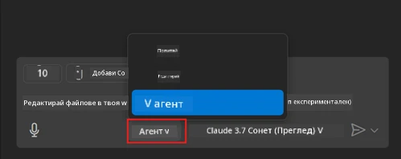
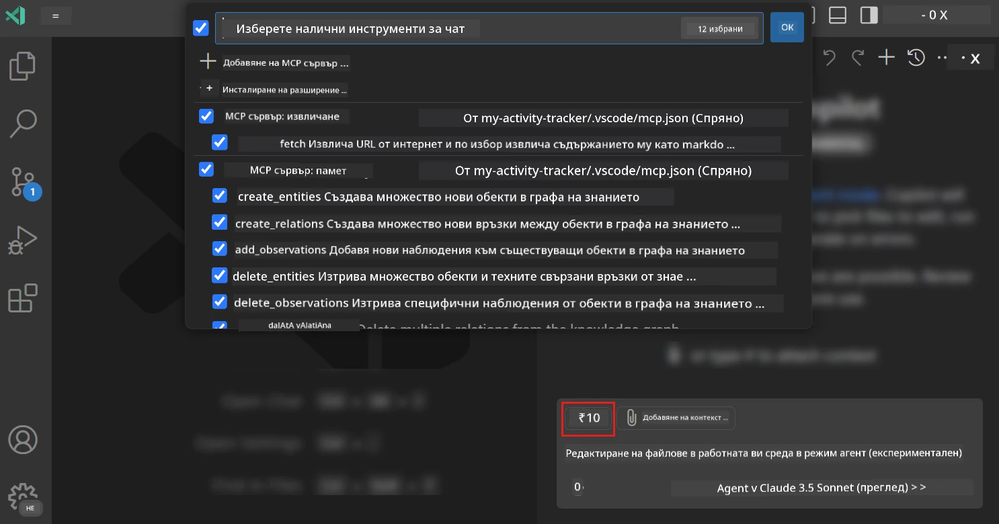
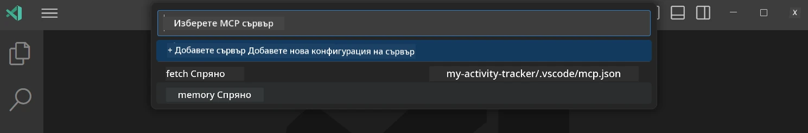
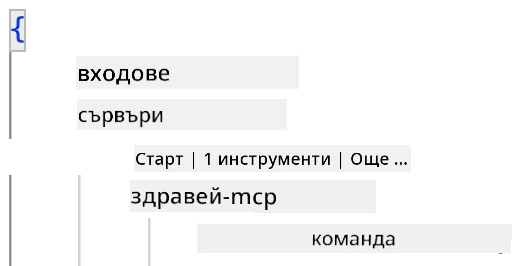
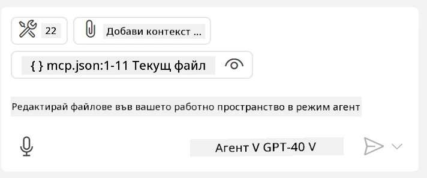
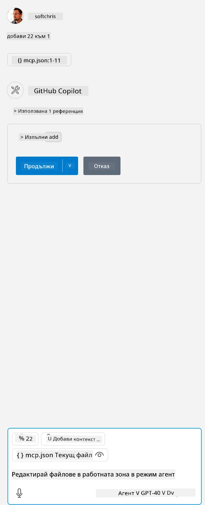

# Използване на сървър в режим Agent на GitHub Copilot

Visual Studio Code и GitHub Copilot могат да действат като клиент и да използват MCP сървър. Защо бихме искали да направим това, може би се питате? Е, това означава, че всички функции, които MCP сървърът предлага, вече могат да се използват директно във вашата IDE. Представете си, че добавите например MCP сървъра на GitHub – това би ви позволило да контролирате GitHub чрез команди на естествен език, вместо да пишете специфични команди в терминала. Или си представете всякакви други възможности, които могат да подобрят вашето разработваческо изживяване, всичко това контролирано чрез естествен език. Сега виждате предимствата, нали?

## Преглед

Този урок обхваща как да използвате Visual Studio Code и режима Agent на GitHub Copilot като клиент за вашия MCP сървър.

## Цели на обучението

До края на този урок ще можете да:

- Използвате MCP сървър чрез Visual Studio Code.
- Стартирате функции като инструменти чрез GitHub Copilot.
- Конфигурирате Visual Studio Code за намиране и управление на вашия MCP сървър.

## Употреба

Можете да контролирате вашия MCP сървър по два различни начина:

- Чрез потребителски интерфейс – ще видите как се прави това по-късно в тази глава.
- Чрез терминал – възможно е да контролирате нещата от терминала, използвайки изпълнимия файл `code`:

  За да добавите MCP сървър към вашия потребителски профил, използвайте опцията за команден ред --add-mcp и предоставете JSON конфигурацията на сървъра във формата {\"name\":\"server-name\",\"command\":...}.

  ```
  code --add-mcp "{\"name\":\"my-server\",\"command\": \"uvx\",\"args\": [\"mcp-server-fetch\"]}"
  ```

### Екранни снимки





Нека поговорим повече за това как използваме визуалния интерфейс в следващите секции.

## Подход

Ето как трябва да подходим на високо ниво:

- Конфигурирайте файл, за да намерите вашия MCP сървър.
- Стартирайте/свържете се със сървъра, за да видите списъка с неговите възможности.
- Използвайте тези възможности чрез интерфейса за чат на GitHub Copilot.

Чудесно, сега когато разбираме процеса, нека опитаме да използваме MCP сървър чрез Visual Studio Code с едно упражнение.

## Упражнение: Използване на сървър

В това упражнение ще конфигурираме Visual Studio Code, за да намери вашия MCP сървър, така че той да може да се използва чрез интерфейса за чат на GitHub Copilot.

### -0- Предварителна стъпка: активиране на откриването на MCP сървъри

Може да се наложи да активирате откриването на MCP сървъри.

1. Отидете на `File -> Preferences -> Settings` във Visual Studio Code.

1. Потърсете "MCP" и активирайте `chat.mcp.discovery.enabled` в файла settings.json.

### -1- Създаване на конфигурационен файл

Започнете със създаването на конфигурационен файл в основната директория на вашия проект. Ще ви трябва файл, наречен MCP.json, който да поставите в папка, наречена .vscode. Трябва да изглежда така:

```text
.vscode
|-- mcp.json
```

След това нека видим как можем да добавим запис за сървър.

### -2- Конфигуриране на сървър

Добавете следното съдържание в *mcp.json*:

```json
{
    "inputs": [],
    "servers": {
       "hello-mcp": {
           "command": "node",
           "args": [
               "build/index.js"
           ]
       }
    }
}
```

Горният пример показва как да стартирате сървър, написан на Node.js. За други среди посочете правилната команда за стартиране на сървъра, използвайки `command` и `args`.

### -3- Стартиране на сървъра

След като сте добавили запис, нека стартираме сървъра:

1. Намерете вашия запис в *mcp.json* и се уверете, че виждате иконата "play":

    

1. Кликнете върху иконата "play". Трябва да видите как иконата за инструменти в GitHub Copilot Chat увеличава броя на наличните инструменти. Ако кликнете върху тази икона, ще видите списък с регистрираните инструменти. Можете да маркирате/размаркирате всеки инструмент в зависимост от това дали искате GitHub Copilot да ги използва като контекст:

  

1. За да стартирате инструмент, напишете команда, която знаете, че съответства на описанието на някой от вашите инструменти, например команда като "add 22 to 1":

  

  Трябва да видите отговор, който казва 23.

## Задача

Опитайте да добавите запис за сървър във вашия файл *mcp.json* и се уверете, че можете да стартирате/спирате сървъра. Уверете се също, че можете да комуникирате с инструментите на вашия сървър чрез интерфейса за чат на GitHub Copilot.

## Решение

[Решение](./solution/README.md)

## Основни изводи

Основните изводи от тази глава са следните:

- Visual Studio Code е отличен клиент, който ви позволява да използвате няколко MCP сървъра и техните инструменти.
- Интерфейсът за чат на GitHub Copilot е начинът, по който взаимодействате със сървърите.
- Можете да подканвате потребителя за входни данни като API ключове, които могат да се предадат на MCP сървъра при конфигуриране на записа в *mcp.json*.

## Примери

- [Java Калкулатор](../samples/java/calculator/README.md)
- [.Net Калкулатор](../../../../03-GettingStarted/samples/csharp)
- [JavaScript Калкулатор](../samples/javascript/README.md)
- [TypeScript Калкулатор](../samples/typescript/README.md)
- [Python Калкулатор](../../../../03-GettingStarted/samples/python)

## Допълнителни ресурси

- [Документация за Visual Studio](https://code.visualstudio.com/docs/copilot/chat/mcp-servers)

## Какво следва

- Следва: [Създаване на stdio сървър](../05-stdio-server/README.md)

---

**Отказ от отговорност**:  
Този документ е преведен с помощта на AI услуга за превод [Co-op Translator](https://github.com/Azure/co-op-translator). Въпреки че се стремим към точност, моля, имайте предвид, че автоматизираните преводи може да съдържат грешки или неточности. Оригиналният документ на неговия роден език трябва да се счита за авторитетен източник. За критична информация се препоръчва професионален човешки превод. Ние не носим отговорност за недоразумения или погрешни интерпретации, произтичащи от използването на този превод.