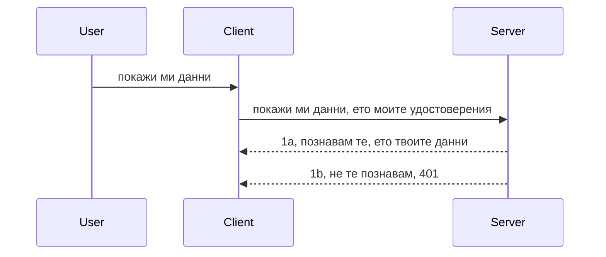

# Simple auth

MCP SDKs поддържат използването на OAuth 2.1, което, честно казано, е доста сложен процес, включващ концепции като сървър за удостоверяване, сървър за ресурси, изпращане на креденшъли, получаване на код, размяна на кода за токен за носител, докато накрая получите достъп до ресурсните данни. Ако не сте свикнали с OAuth, което е страхотно нещо за имплементиране, е добра идея да започнете с някакво основно ниво на удостоверяване и постепенно да стигнете до по-добра и по-добра сигурност. Затова съществува тази глава — да ви подготви за по-напреднало удостоверяване.

## Удостоверяване, какво имаме предвид?

Удостоверяване е съкращение от authentication и authorization. Идеята е, че трябва да направим две неща:

- **Authentication** (удостоверяване), което е процесът да разберем дали да допуснем човек в нашия дом, т.е. дали има право да е "тук", тоест да има достъп до нашия сървър за ресурси, където се намират функциите на MCP Server.
- **Authorization** (овластяване) е процесът да разберем дали даден потребител трябва да има достъп до конкретните ресурси, за които иска достъп, например конкретни поръчки или продукти, или дали е позволено само да чете съдържанието, но не и да изтрива (пример).

## Креденшъли: как казваме на системата кой сме ние

Повечето уеб разработчици започват да мислят в термини на предоставяне на креденшъл на сървъра, обикновено таен ключ, който казва дали им е позволено да са тук (Authentication). Този креденшъл обикновено е base64 кодиран вариант на потребителско име и парола или API ключ, който уникално идентифицира конкретен потребител.

Това включва изпращането му чрез заглавка, наречена "Authorization", по следния начин:

```json
{ "Authorization": "secret123" }
```

Това обикновено се нарича базово удостоверяване. Как работи цялостният поток е както следва:


Сега, след като разбираме как работи от гледна точка на поток, как да го имплементираме? Повечето уеб сървъри имат концепция, наречена middleware, парче код, което се изпълнява като част от заявката, което може да валидира креденшъли, и ако те са валидни, позволява заявката да продължи. Ако заявката няма валидни креденшъли, получавате грешка при удостоверяване. Нека видим как да го имплементираме:

**Python**

```python
class AuthMiddleware(BaseHTTPMiddleware):
    async def dispatch(self, request, call_next):

        has_header = request.headers.get("Authorization")
        if not has_header:
            print("-> Missing Authorization header!")
            return Response(status_code=401, content="Unauthorized")

        if not valid_token(has_header):
            print("-> Invalid token!")
            return Response(status_code=403, content="Forbidden")

        print("Valid token, proceeding...")
       
        response = await call_next(request)
        # добавяне на всякакви потребителски заглавки или промяна на отговора по някакъв начин
        return response


starlette_app.add_middleware(CustomHeaderMiddleware)
```

Тук имаме:

- Създадена middleware наречена `AuthMiddleware`, чийто метод `dispatch` се извиква от уеб сървъра.
- Добавена middleware към уеб сървъра:

    ```python
    starlette_app.add_middleware(AuthMiddleware)
    ```

- Написана логика за валидация, която проверява дали има Authorization заглавка и дали таен ключ, който се изпраща, е валиден:

    ```python
    has_header = request.headers.get("Authorization")
    if not has_header:
        print("-> Missing Authorization header!")
        return Response(status_code=401, content="Unauthorized")

    if not valid_token(has_header):
        print("-> Invalid token!")
        return Response(status_code=403, content="Forbidden")
    ```

    ако секретът присъства и е валиден, позволяваме заявката да продължи, като извикваме `call_next` и връщаме отговора.

    ```python
    response = await call_next(request)
    # добавете всички потребителски заглавки или променете по някакъв начин отговора
    return response
    ```

Работи така, че ако се направи уеб заявка към сървъра, middleware ще бъде извикан и, според имплементацията му, ще позволи заявката да премине или ще върне грешка, указваща, че клиентът няма право да продължи.

**TypeScript**

Тук създаваме middleware с популярния фреймуърк Express и прихващаме заявката преди да достигне MCP Server. Ето кода за това:

```typescript
function isValid(secret) {
    return secret === "secret123";
}

app.use((req, res, next) => {
    // 1. Заглавката за упълномощаване присъства ли?
    if(!req.headers["Authorization"]) {
        res.status(401).send('Unauthorized');
    }
    
    let token = req.headers["Authorization"];

    // 2. Проверете валидността.
    if(!isValid(token)) {
        res.status(403).send('Forbidden');
    }

   
    console.log('Middleware executed');
    // 3. Предава заявката на следващата стъпка в тръбопровода на заявката.
    next();
});
```

В този код:

1. Проверяваме дали Authorization заглавката присъства, ако не, връщаме 401 грешка.
2. Проверяваме дали креденшъл/токенът е валиден, ако не, връщаме 403 грешка.
3. Накрая пропускаме заявката по веригата и връщаме поисканите ресурси.

## Упражнение: Имплементиране на удостоверяване

Нека приложим знанията си и опитаме да имплементираме. Ето плана:

Сървър

- Създаване на уеб сървър и MCP инстанция.
- Имплементиране на middleware за сървъра.

Клиент

- Изпращане на уеб заявка с креденшъл чрез заглавка.

### -1- Създаване на уеб сървър и MCP инстанция

В първата стъпка трябва да създадем уеб сървър инстанция и MCP Server.

**Python**

Тук създаваме инстанция на MCP server, създаваме starlette уеб приложение и го хостваме с uvicorn.

```python
# създаване на MCP сървър

app = FastMCP(
    name="MCP Resource Server",
    instructions="Resource Server that validates tokens via Authorization Server introspection",
    host=settings["host"],
    port=settings["port"],
    debug=True
)

# създаване на starlette уеб приложение
starlette_app = app.streamable_http_app()

# обслужване на приложението чрез uvicorn
async def run(starlette_app):
    import uvicorn
    config = uvicorn.Config(
            starlette_app,
            host=app.settings.host,
            port=app.settings.port,
            log_level=app.settings.log_level.lower(),
        )
    server = uvicorn.Server(config)
    await server.serve()

run(starlette_app)
```

В този код:

- Създаваме MCP Server.
- Конструираме starlette уеб приложението от MCP Server, `app.streamable_http_app()`.
- Хостваме и обслужваме уеб приложението чрез uvicorn с `server.serve()`.

**TypeScript**

Тук създаваме инстанция на MCP Server.

```typescript
const server = new McpServer({
      name: "example-server",
      version: "1.0.0"
    });

    // ... настройване на сървърни ресурси, инструменти и подканващи съобщения ...
```

Създаването на MCP Server трябва да стане в рамките на нашето определение на POST /mcp рут, така че нека мигрираме горния код така:

```typescript
import express from "express";
import { randomUUID } from "node:crypto";
import { McpServer } from "@modelcontextprotocol/sdk/server/mcp.js";
import { StreamableHTTPServerTransport } from "@modelcontextprotocol/sdk/server/streamableHttp.js";
import { isInitializeRequest } from "@modelcontextprotocol/sdk/types.js"

const app = express();
app.use(express.json());

// Карта за съхранение на транспорта по ID на сесията
const transports: { [sessionId: string]: StreamableHTTPServerTransport } = {};

// Обработка на POST заявки за комуникация клиент-сървър
app.post('/mcp', async (req, res) => {
  // Проверка за съществуващо ID на сесията
  const sessionId = req.headers['mcp-session-id'] as string | undefined;
  let transport: StreamableHTTPServerTransport;

  if (sessionId && transports[sessionId]) {
    // Повторна употреба на съществуващ транспорт
    transport = transports[sessionId];
  } else if (!sessionId && isInitializeRequest(req.body)) {
    // Ново инициализационно искане
    transport = new StreamableHTTPServerTransport({
      sessionIdGenerator: () => randomUUID(),
      onsessioninitialized: (sessionId) => {
        // Запазване на транспорта по ID на сесията
        transports[sessionId] = transport;
      },
      // Защитата срещу DNS ребайндинг е по подразбиране деактивирана за обратна съвместимост. Ако работите с този сървър
      // локално, уверете се, че сте задали:
      // enableDnsRebindingProtection: true,
      // allowedHosts: ['127.0.0.1'],
    });

    // Почистване на транспорта при затваряне
    transport.onclose = () => {
      if (transport.sessionId) {
        delete transports[transport.sessionId];
      }
    };
    const server = new McpServer({
      name: "example-server",
      version: "1.0.0"
    });

    // ... настройка на ресурси на сървъра, инструменти и подсказки ...

    // Свързване със сървъра MCP
    await server.connect(transport);
  } else {
    // Невалидна заявка
    res.status(400).json({
      jsonrpc: '2.0',
      error: {
        code: -32000,
        message: 'Bad Request: No valid session ID provided',
      },
      id: null,
    });
    return;
  }

  // Обработка на заявката
  await transport.handleRequest(req, res, req.body);
});

// Многократен обработчик за GET и DELETE заявки
const handleSessionRequest = async (req: express.Request, res: express.Response) => {
  const sessionId = req.headers['mcp-session-id'] as string | undefined;
  if (!sessionId || !transports[sessionId]) {
    res.status(400).send('Invalid or missing session ID');
    return;
  }
  
  const transport = transports[sessionId];
  await transport.handleRequest(req, res);
};

// Обработка на GET заявки за уведомления от сървър към клиент чрез SSE
app.get('/mcp', handleSessionRequest);

// Обработка на DELETE заявки за прекратяване на сесията
app.delete('/mcp', handleSessionRequest);

app.listen(3000);
```

Сега виждате как създаването на MCP Server е преместено вътре в `app.post("/mcp")`.

Да преминем към следващата стъпка — създаване на middleware за валидация на входящите креденшъли.

### -2- Имплементиране на middleware за сървъра

След това да преминем към middleware частта. Тук ще създадем middleware, който търси креденшъл в Authorization заглавката и го валидира. Ако е приемлив, заявката ще продължи да изпълнява това, което трябва (например изброяване на инструменти, четене на ресурс или каквото да е MCP функционалност, която клиентът иска).

**Python**

За да създадем middleware, трябва да създадем клас, който наследява `BaseHTTPMiddleware`. Има две интересни неща:

- Заявката `request`, от която четем информацията от заглавката.
- `call_next` колбек, който трябва да извикаме, ако клиентът е донесъл кредитшъл, който приемаме.

Първо, трябва да обработим случая, когато липсва `Authorization` заглавката:

```python
has_header = request.headers.get("Authorization")

# няма наличен хедър, неуспешно с 401, в противен случай продължи.
if not has_header:
    print("-> Missing Authorization header!")
    return Response(status_code=401, content="Unauthorized")
```

Тук изпращаме съобщение 401 unauthorized, тъй като клиентът не може да се удостовери.

След това, ако има подаден креденшъл, трябва да проверим валидността му:

```python
 if not valid_token(has_header):
    print("-> Invalid token!")
    return Response(status_code=403, content="Forbidden")
```

Обърнете внимание, че тук изпращаме съобщение 403 forbidden. Нека видим целия middleware по-долу, който имплементира всичко, споменато до тук:

```python
class AuthMiddleware(BaseHTTPMiddleware):
    async def dispatch(self, request, call_next):

        has_header = request.headers.get("Authorization")
        if not has_header:
            print("-> Missing Authorization header!")
            return Response(status_code=401, content="Unauthorized")

        if not valid_token(has_header):
            print("-> Invalid token!")
            return Response(status_code=403, content="Forbidden")

        print("Valid token, proceeding...")
        print(f"-> Received {request.method} {request.url}")
        response = await call_next(request)
        response.headers['Custom'] = 'Example'
        return response

```

Страхотно, а какво да кажем за функцията `valid_token`? Ето я по-долу:

```python
# НЕ използвайте за продукция - подобрете го !!
def valid_token(token: str) -> bool:
    # премахнете префикса "Bearer "
    if token.startswith("Bearer "):
        token = token[7:]
        return token == "secret-token"
    return False
```

Това определено може да се подобри.

ВАЖНО: Никога не бива да има такива тайни в кода. Идеално е стойността за сравнение да се взима от някакъв източник на данни или от IDP (identity service provider), или още по-добре — да оставите валидирането на IDP.

**TypeScript**

За да го имплементираме с Express, трябва да извикаме `use` метода, който приема функции за middleware.

Трябва да:

- Взаимодействаме с променливата на заявката, за да проверим подадения креденшъл в свойството `Authorization`.
- Валидираме креденшъла и, ако е валиден, позволим заявката да продължи и MCP заявката на клиента да свърши каквото трябва (напр. изброяване на инструменти, четене на ресурс и др.).

Тук проверяваме дали заглавката `Authorization` присъства, и ако не, спираме заявката:

```typescript
if(!req.headers["authorization"]) {
    res.status(401).send('Unauthorized');
    return;
}
```

Ако заглавката липсва, получавате 401.

След това проверяваме дали креденшълът е валиден, ако не, отново спираме заявката с различно съобщение:

```typescript
if(!isValid(token)) {
    res.status(403).send('Forbidden');
    return;
} 
```

Обърнете внимание, че получавате 403 грешка.

Ето пълния код:

```typescript
app.use((req, res, next) => {
    console.log('Request received:', req.method, req.url, req.headers);
    console.log('Headers:', req.headers["authorization"]);
    if(!req.headers["authorization"]) {
        res.status(401).send('Unauthorized');
        return;
    }
    
    let token = req.headers["authorization"];

    if(!isValid(token)) {
        res.status(403).send('Forbidden');
        return;
    }  

    console.log('Middleware executed');
    next();
});
```

Настроили сме уеб сървъра да приема middleware за проверка на креденшъла, който клиентът се надява да ни изпрати. А какво със самия клиент?

### -3- Изпращане на уеб заявка с креденшъл чрез заглавка

Трябва да се уверим, че клиентът предава креденшъла чрез заглавката. Като ще използваме MCP клиент, трябва да разберем как се прави това.

**Python**

За клиента трябва да подадем заглавка с нашия креденшъл, както следва:

```python
# НЕ твърдо кодирайте стойността, поне я съхранявайте в променлива на средата или по-сигурно място за съхранение
token = "secret-token"

async with streamablehttp_client(
        url = f"http://localhost:{port}/mcp",
        headers = {"Authorization": f"Bearer {token}"}
    ) as (
        read_stream,
        write_stream,
        session_callback,
    ):
        async with ClientSession(
            read_stream,
            write_stream
        ) as session:
            await session.initialize()
      
            # TODO, какво искате да се направи в клиента, напр. изброяване на инструменти, извикване на инструменти и т.н.
```

Обърнете внимание как попълваме свойството `headers` като ` headers = {"Authorization": f"Bearer {token}"}`.

**TypeScript**

Това може да стане в две стъпки:

1. Попълваме конфигурационен обект с нашия креденшъл.
2. Предаваме конфигурационния обект на транспорта.

```typescript

// НЕ кодирате стойността на твърдо, както е показано тук. Най-малко държете я като променлива на околната среда и използвайте нещо като dotenv (в режим на разработка).
let token = "secret123"

// дефинирайте обект с опции за транспорт на клиента
let options: StreamableHTTPClientTransportOptions = {
  sessionId: sessionId,
  requestInit: {
    headers: {
      "Authorization": "secret123"
    }
  }
};

// предайте обекта с опции на транспорта
async function main() {
   const transport = new StreamableHTTPClientTransport(
      new URL(serverUrl),
      options
   );
```

Тук виждате, че трябваше да създадем обект `options` и да поставим нашите заглавки под свойството `requestInit`.

ВАЖНО: Как можем да подобрим това? Настоящата имплементация има някои проблеми. Първо, подаването на креденшъл по този начин е доста рисковано, освен ако поне използвате HTTPS. Дори тогава, креденшълът може да бъде откраднат, затова е нужна система, в която лесно може да анулирате токена и да добавите допълнителни проверки като откъде по света идва заявката, случва ли се твърде често (поведение като бот) — накратко, има цели куп опасения.

Трябва обаче да се каже, че за много прости API-та, където не искате никой да извиква API-то без удостоверяване, това, което имаме тук, е добър старт.

С това казано, нека се опитаме да засилим сигурността малко, като използваме стандартизиран формат като JSON Web Token, известен също като JWT или "ДЖОТ" токени.

## JSON Web Tokens, JWT

Значи опитваме да подобрим нещата спрямо изпращането на много прости креденшъли. Какви са непосредствените подобрения, които получаваме, като приемем JWT?

- **Подобрения на сигурността**. При базовото удостоверяване изпращате потребителско име и парола като base64 кодиран токен (или API ключ) многократно, което увеличава риска. С JWT изпращате потребителско име и парола и получавате токен обратно, който също е с време на валидност, т.е. изтича. JWT ви позволява лесно да използвате фино овластяване чрез роли, обхвати и разрешения.
- **Отсъствие на състояние и мащабируемост**. JWT е самостоятелен, носи цялата информация за потребителя и премахва нуждата от съхранение на сесия на сървъра. Токенът може да бъде валидиран локално.
- **Съвместимост и федерация**. JWT е в центъра на Open ID Connect и се използва с известни доставчици на идентичност като Entra ID, Google Identity и Auth0. Позволява еднократно влизане и още, което го прави подходящ за корпоративна употреба.
- **Модулност и гъвкавост**. JWT може да се използва със API шлюзове като Azure API Management, NGINX и други. Поддържа случаи на удостоверяване и комуникация между сървър и услуга, включително сценарии на имитация и делегация.
- **Производителност и кеширане**. JWT може да се кешира след декодиране, което намалява нуждата от повторен анализ. Това помага особено при приложения с голям трафик, като подобрява пропускателната способност и намаля натоварването върху инфраструктурата.
- **Разширени функции**. Поддържа интроспекция (проверка на валидността на сървъра) и отмяна (правене на токена невалиден).

С всички тези ползи, нека видим как можем да надградим имплементацията си.

## Превръщане на базовото удостоверяване в JWT

Промените на високо ниво, които трябва да направим, са:

- **Да научим как да конструираме JWT токен** и да го подготвим за изпращане от клиента към сървъра.
- **Да валидираме JWT токен** и, ако е валиден, да позволим достъп на клиента до ресурсите.
- **Сигурно съхранение на токена**. Как съхраняваме този токен.
- **Защита на маршрутите**. Трябва да защитим маршрутите, в нашия случай конкретни MCP рутове и функции.
- **Добавяне на refresh токени**. Да гарантираме, че създаваме токени с кратък живот, но също така refresh токени с дълъг живот, които могат да се използват за нови токени след изтичане. Да осигурим също и refresh endpoint и стратегия за ротация.

### -1- Конструиране на JWT токен

Първо, JWT токенът има следните части:

- **header** (заглавка), алгоритъм и тип на токена.
- **payload** (полезен товар), претенции, като sub (потребителят или субектът, когото токенът представя; в сценарий удостоверяване обикновено e потребителският id), exp (време на изтичане), role (ролята)
- **signature** (подпис), подписан със секрет или частен ключ.

За тази цел трябва да конструираме header, payload и кодиран токен.

**Python**

```python

import jwt
import jwt
from jwt.exceptions import ExpiredSignatureError, InvalidTokenError
import datetime

# Тайният ключ, използван за подписване на JWT
secret_key = 'your-secret-key'

header = {
    "alg": "HS256",
    "typ": "JWT"
}

# информацията за потребителя, неговите твърдения и време на изтичане
payload = {
    "sub": "1234567890",               # Субект (потребителски ID)
    "name": "User Userson",                # Персонализирано твърдение
    "admin": True,                     # Персонализирано твърдение
    "iat": datetime.datetime.utcnow(),# Издадено на
    "exp": datetime.datetime.utcnow() + datetime.timedelta(hours=1)  # Изтичане
}

# кодирайте го
encoded_jwt = jwt.encode(payload, secret_key, algorithm="HS256", headers=header)
```

В горния код:

- Дефинирахме заглавка с алгоритъм HS256 и тип JWT.
- Конструирахме payload, който съдържа субект или потребителско id, потребителско име, роля, време на издаване и време на изтичане, като по този начин имплементираме вече обсъдения аспект на валидност с времеток.

**TypeScript**

Тук ще ни трябват някои зависимости, които ще ни помогнат да конструираме JWT токена.

Зависимости

```sh

npm install jsonwebtoken
npm install --save-dev @types/jsonwebtoken
```

След като ги имаме, нека създадем header, payload и чрез тях — кодиран токен.

```typescript
import jwt from 'jsonwebtoken';

const secretKey = 'your-secret-key'; // Използвайте променливи на средата в продукция

// Дефинирайте полезния товар
const payload = {
  sub: '1234567890',
  name: 'User usersson',
  admin: true,
  iat: Math.floor(Date.now() / 1000), // Издаден на
  exp: Math.floor(Date.now() / 1000) + 60 * 60 // Изтича след 1 час
};

// Дефинирайте заглавката (по избор, jsonwebtoken задава по подразбиране)
const header = {
  alg: 'HS256',
  typ: 'JWT'
};

// Създайте токена
const token = jwt.sign(payload, secretKey, {
  algorithm: 'HS256',
  header: header
});

console.log('JWT:', token);
```

Този токен е:

Подписан с HS256
Валиден 1 час
Включва претенции като sub, name, admin, iat и exp.

### -2- Валидация на токен

Трябва също да валидираме токена, което е нещо, което трябва да се прави на сървъра, за да се уверим, че клиентът изпраща валиден токен. Тук има много проверки — от валидиране на структурата до валидността на токена. Препоръчва се също да се добавят допълнителни проверки дали потребителят е в системата ви и дали има правата, които претендира.

За да валидираме токен, трябва да го декодираме, за да го прочетем, и след това да започнем проверките:

**Python**

```python

# Декодирайте и проверете JWT
try:
    decoded = jwt.decode(token, secret_key, algorithms=["HS256"])
    print("✅ Token is valid.")
    print("Decoded claims:")
    for key, value in decoded.items():
        print(f"  {key}: {value}")
except ExpiredSignatureError:
    print("❌ Token has expired.")
except InvalidTokenError as e:
    print(f"❌ Invalid token: {e}")

```

В този код извикваме `jwt.decode`, като подаваме токена, секретния ключ и избрания алгоритъм. Забележете, че използваме try-catch, защото неуспешна валидация води до изключение.

**TypeScript**

Тук извикваме `jwt.verify`, за да получим декодиран токен, който може да анализираме. Ако извикването не успее, значи токенът е с неправилна структура или не е валиден.

```typescript

try {
  const decoded = jwt.verify(token, secretKey);
  console.log('Decoded Payload:', decoded);
} catch (err) {
  console.error('Token verification failed:', err);
}
```

ЗАБЕЛЕЖКА: както вече споменахме, трябва да направим допълнителни проверки, за да гарантираме, че токенът сочи към потребител в нашата система и че потребителят има правата, които заявява.
След това нека разгледаме контрола на достъпа, базиран на роли, известен още като RBAC.

## Добавяне на контрол на достъпа, базиран на роли

Идеята е, че искаме да изразим, че различните роли имат различни права. Например, приемаме, че администраторът може да прави всичко, нормалният потребител може да чете/писва, а гостът може само да чете. Следователно, ето някои възможни нива на разрешения:

- Admin.Write 
- User.Read
- Guest.Read

Нека видим как можем да приложим такъв контрол с помощта на middleware. Middlewares могат да се добавят за конкретен маршрут, както и за всички маршрути.

**Python**

```python
from starlette.middleware.base import BaseHTTPMiddleware
from starlette.responses import JSONResponse
import jwt

# НЕ слагайте тайната в кода, това е само за демонстрационни цели. Четете го от сигурно място.
SECRET_KEY = "your-secret-key" # сложете това в променлива на средата
REQUIRED_PERMISSION = "User.Read"

class JWTPermissionMiddleware(BaseHTTPMiddleware):
    async def dispatch(self, request, call_next):
        auth_header = request.headers.get("Authorization")
        if not auth_header or not auth_header.startswith("Bearer "):
            return JSONResponse({"error": "Missing or invalid Authorization header"}, status_code=401)

        token = auth_header.split(" ")[1]
        try:
            decoded = jwt.decode(token, SECRET_KEY, algorithms=["HS256"])
        except jwt.ExpiredSignatureError:
            return JSONResponse({"error": "Token expired"}, status_code=401)
        except jwt.InvalidTokenError:
            return JSONResponse({"error": "Invalid token"}, status_code=401)

        permissions = decoded.get("permissions", [])
        if REQUIRED_PERMISSION not in permissions:
            return JSONResponse({"error": "Permission denied"}, status_code=403)

        request.state.user = decoded
        return await call_next(request)


```

Има няколко различни начина за добавяне на middleware, както е показано по-долу:

```python

# Вариант 1: добавяне на middleware по време на изграждане на starlette приложението
middleware = [
    Middleware(JWTPermissionMiddleware)
]

app = Starlette(routes=routes, middleware=middleware)

# Вариант 2: добавяне на middleware след като starlette приложението вече е изградено
starlette_app.add_middleware(JWTPermissionMiddleware)

# Вариант 3: добавяне на middleware за всеки маршрут
routes = [
    Route(
        "/mcp",
        endpoint=..., # обработващ
        middleware=[Middleware(JWTPermissionMiddleware)]
    )
]
```

**TypeScript**

Можем да използваме `app.use` и middleware, който ще се изпълнява за всички заявки.

```typescript
app.use((req, res, next) => {
    console.log('Request received:', req.method, req.url, req.headers);
    console.log('Headers:', req.headers["authorization"]);

    // 1. Проверете дали е изпратен заглавният ред за упълномощаване

    if(!req.headers["authorization"]) {
        res.status(401).send('Unauthorized');
        return;
    }
    
    let token = req.headers["authorization"];

    // 2. Проверете дали токенът е валиден
    if(!isValid(token)) {
        res.status(403).send('Forbidden');
        return;
    }  

    // 3. Проверете дали потребителят на токена съществува в нашата система
    if(!isExistingUser(token)) {
        res.status(403).send('Forbidden');
        console.log("User does not exist");
        return;
    }
    console.log("User exists");

    // 4. Потвърдете, че токенът има правилните разрешения
    if(!hasScopes(token, ["User.Read"])){
        res.status(403).send('Forbidden - insufficient scopes');
    }

    console.log("User has required scopes");

    console.log('Middleware executed');
    next();
});

```

Има доста неща, които можем да оставим на нашия middleware и които той ТРЯБВА да прави, а именно:

1. Да провери дали заглавката за упълномощаване е налична
2. Да провери дали токенът е валиден, ние извикваме `isValid`, който е метод, който написахме и проверява целостта и валидността на JWT токена.
3. Да потвърди, че потребителят съществува в нашата система, това също трябва да се провери.

   ```typescript
    // потребители в базата данни
   const users = [
     "user1",
     "User usersson",
   ]

   function isExistingUser(token) {
     let decodedToken = verifyToken(token);

     // Задача, провери дали потребителят съществува в базата данни
     return users.includes(decodedToken?.name || "");
   }
   ```

   По-горе създадохме много прост списък `users`, който разбира се трябва да бъде в база данни.

4. Освен това, трябва да проверим дали токенът има правилните разрешения.

   ```typescript
   if(!hasScopes(token, ["User.Read"])){
        res.status(403).send('Forbidden - insufficient scopes');
   }
   ```

   В този код от middleware проверяваме, че токенът съдържа разрешението User.Read, ако не, изпращаме грешка 403. По-долу е помощният метод `hasScopes`.

   ```typescript
   function hasScopes(scope: string, requiredScopes: string[]) {
     let decodedToken = verifyToken(scope);
    return requiredScopes.every(scope => decodedToken?.scopes.includes(scope));
  }
   ```

Have a think which additional checks you should be doing, but these are the absolute minimum of checks you should be doing.

Using Express as a web framework is a common choice. There are helpers library when you use JWT so you can write less code.

- `express-jwt`, helper library that provides a middleware that helps decode your token.
- `express-jwt-permissions`, this provides a middleware `guard` that helps check if a certain permission is on the token.

Here's what these libraries can look like when used:

```typescript
const express = require('express');
const jwt = require('express-jwt');
const guard = require('express-jwt-permissions')();

const app = express();
const secretKey = 'your-secret-key'; // put this in env variable

// Decode JWT and attach to req.user
app.use(jwt({ secret: secretKey, algorithms: ['HS256'] }));

// Check for User.Read permission
app.use(guard.check('User.Read'));

// multiple permissions
// app.use(guard.check(['User.Read', 'Admin.Access']));

app.get('/protected', (req, res) => {
  res.json({ message: `Welcome ${req.user.name}` });
});

// Error handler
app.use((err, req, res, next) => {
  if (err.code === 'permission_denied') {
    return res.status(403).send('Forbidden');
  }
  next(err);
});

```

Сега сте видели как middleware може да се използва както за удостоверяване, така и за упълномощаване, но какво става с MCP, променя ли начина, по който правим auth? Нека разберем в следващата секция.

### -3- Добавяне на RBAC към MCP

Досега сте видели как можете да добавите RBAC чрез middleware, но за MCP няма лесен начин за добавяне на RBAC за всяка функция в MCP, така че какво правим? Просто трябва да добавим код като този, който проверява в този случай дали клиентът има права да извика конкретен инструмент:

Имате няколко различни възможности как да постигнете RBAC за всяка функция, ето някои:

- Добавяне на проверка за всеки инструмент, ресурс, prompt, където е необходимо да проверите нивото на разрешение.

   **python**

   ```python
   @tool()
   def delete_product(id: int):
      try:
          check_permissions(role="Admin.Write", request)
      catch:
        pass # клиентът не успя да бъде упълномощен, възникна грешка при упълномощаването
   ```

   **typescript**

   ```typescript
   server.registerTool(
    "delete-product",
    {
      title: Delete a product",
      description: "Deletes a product",
      inputSchema: { id: z.number() }
    },
    async ({ id }) => {
      
      try {
        checkPermissions("Admin.Write", request);
        // направи, изпрати id към productService и remote entry
      } catch(Exception e) {
        console.log("Authorization error, you're not allowed");  
      }

      return {
        content: [{ type: "text", text: `Deletected product with id ${id}` }]
      };
    }
   );
   ```


- Използване на усъвършенстван сървърен подход и обработващи заявки, така че да минимизирате колко места трябва да направите проверката.

   **Python**

   ```python
   
   tool_permission = {
      "create_product": ["User.Write", "Admin.Write"],
      "delete_product": ["Admin.Write"]
   }

   def has_permission(user_permissions, required_permissions) -> bool:
      # user_permissions: списък с разрешения, които потребителят има
      # required_permissions: списък с разрешения, необходими за инструмента
      return any(perm in user_permissions for perm in required_permissions)

   @server.call_tool()
   async def handle_call_tool(
     name: str, arguments: dict[str, str] | None
   ) -> list[types.TextContent]:
    # Предполага се, че request.user.permissions е списък с разрешения за потребителя
     user_permissions = request.user.permissions
     required_permissions = tool_permission.get(name, [])
     if not has_permission(user_permissions, required_permissions):
        # Вдигни грешка "Нямате разрешение да използвате инструмента {name}"
        raise Exception(f"You don't have permission to call tool {name}")
     # продължи и извикай инструмента
     # ...
   ```   
   

   **TypeScript**

   ```typescript
   function hasPermission(userPermissions: string[], requiredPermissions: string[]): boolean {
       if (!Array.isArray(userPermissions) || !Array.isArray(requiredPermissions)) return false;
       // Върнете true, ако потребителят има поне едно от необходимите разрешения
       
       return requiredPermissions.some(perm => userPermissions.includes(perm));
   }
  
   server.setRequestHandler(CallToolRequestSchema, async (request) => {
      const { params: { name } } = request;
  
      let permissions = request.user.permissions;
  
      if (!hasPermission(permissions, toolPermissions[name])) {
         return new Error(`You don't have permission to call ${name}`);
      }
  
      // продължавайте..
   });
   ```

   Забележка: трябва да сте сигурни, че вашият middleware присвоява декодиран токен към свойството user на заявката, за да бъде горният код опростен.

### Обобщение

Сега, след като обсъдихме как да добавим поддръжка на RBAC като цяло и за MCP по-специално, е време да опитате да приложите сигурността самостоятелно, за да сте сигурни, че сте разбрали представените концепции.

## Задание 1: Създайте MCP сървър и MCP клиент, използвайки базова автентикация

Тук ще използвате наученото за изпращане на идентификационни данни през заглавки.

## Решение 1

[Решение 1](./code/basic/README.md)

## Задание 2: Надградете решението от Задание 1 с JWT

Вземете първото решение, но този път нека го подобрим.

Вместо да използваме Basic Auth, нека използваме JWT.

## Решение 2

[Решение 2](./solution/jwt-solution/README.md)

## Предизвикателство

Добавете RBAC за всеки инструмент, както описваме в секцията "Добавяне на RBAC към MCP".

## Обобщение

Надявам се, че сте научили много в тази глава – от липса на сигурност, през базова сигурност, до JWT и как той може да бъде добавен към MCP.

Изградихме солидна основа с персонализирани JWT, но с разрастването на системата преминаваме към модел на идентичност, базиран на стандарти. Приемането на IdP като Entra или Keycloak ни позволява да прехвърлим издаването, валидирането и управлението на жизнения цикъл на токените на надеждна платформа — освобождавайки ни да се съсредоточим върху логиката на приложението и потребителския опит.

За това имаме по- [напреднала глава за Entra](../../05-AdvancedTopics/mcp-security-entra/README.md)

## Какво следва

- Следва: [Настройване на MCP хостове](../12-mcp-hosts/README.md)

---

<!-- CO-OP TRANSLATOR DISCLAIMER START -->
**Отказ от отговорност**:  
Този документ е преведен с помощта на AI преводаческа услуга [Co-op Translator](https://github.com/Azure/co-op-translator). Въпреки че се стремим към точност, моля, имайте предвид, че автоматизираните преводи могат да съдържат грешки или неточности. Оригиналният документ на неговия изходен език трябва да се счита за авторитетен източник. За критична информация се препоръчва професионален човешки превод. Ние не носим отговорност за каквито и да било недоразумения или погрешни тълкувания, възникнали в резултат на използването на този превод.
<!-- CO-OP TRANSLATOR DISCLAIMER END -->