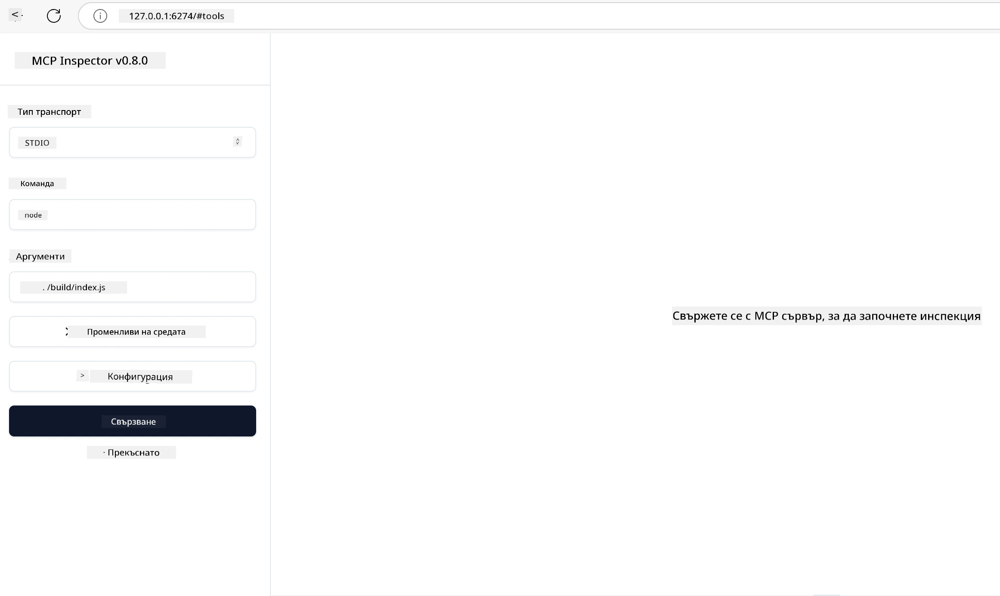

# Практическа реализация

[](https://youtu.be/vCN9-mKBDfQ)

_(Кликнете върху изображението по-горе, за да гледате видеото на този урок)_

Практическата реализация е мястото, където силата на Model Context Protocol (MCP) става осезаема. Докато разбирането на теорията и архитектурата зад MCP е важно, истинската стойност се появява, когато прилагате тези концепции за изграждане, тестване и внедряване на решения, които решават реални проблеми. Тази глава свързва пропастта между концептуалните знания и практическото разработване, като ви насочва през процеса на оживяване на приложения, базирани на MCP.

Независимо дали разработвате интелигентни асистенти, интегрирате изкуствен интелект в бизнес потоци или изграждате персонализирани инструменти за обработка на данни, MCP предоставя гъвкава основа. Неговият езиконезависим дизайн и официалните SDK-та за популярни програмни езици го правят достъпен за широк кръг разработчици. Чрез използване на тези SDK-та можете бързо да прототирате, итерате и мащабирате вашите решения на различни платформи и среди.

В следващите раздели ще откриете практически примери, примерен код и стратегии за внедряване, които демонстрират как да приложите MCP в C#, Java със Spring, TypeScript, JavaScript и Python. Също така ще научите как да отстранявате и тествате вашите MCP сървъри, да управлявате API-тата и да внедрявате решения в облака с Azure. Тези практически ресурси са създадени да ускорят вашето обучение и да ви помогнат уверено да изграждате стабилни, готови за продукция MCP приложения.

## Преглед

Този урок се фокусира върху практическия аспект на реализацията на MCP на няколко програмни езика. Ще разгледаме как да използваме MCP SDK-та в C#, Java със Spring, TypeScript, JavaScript и Python за създаване на стабилни приложения, отстраняване на грешки и тестване на MCP сървъри, както и създаване на преизползваеми ресурси, подсказки и инструменти.

## Учебни цели

Към края на този урок ще можете:

- Да реализирате MCP решения с официалните SDK-та на различни програмни езици
- Да отстранявате и тествате MCP сървъри систематично
- Да създавате и използвате сървърни функции (Ресурси, Подсказки и Инструменти)
- Да проектирате ефективни MCP работни потоци за сложни задачи
- Да оптимизирате MCP реализации за производителност и надеждност

## Официални SDK ресурси

Model Context Protocol предлага официални SDK-та за няколко езика (съобразени с [MCP Спецификация 2025-11-25](https://spec.modelcontextprotocol.io/specification/2025-11-25/)):

- [C# SDK](https://github.com/modelcontextprotocol/csharp-sdk)
- [Java със Spring SDK](https://github.com/modelcontextprotocol/java-sdk) **Забележка:** изисква зависимост от [Project Reactor](https://projectreactor.io). (Вижте [дискусия №246](https://github.com/orgs/modelcontextprotocol/discussions/246).)
- [TypeScript SDK](https://github.com/modelcontextprotocol/typescript-sdk)
- [Python SDK](https://github.com/modelcontextprotocol/python-sdk)
- [Kotlin SDK](https://github.com/modelcontextprotocol/kotlin-sdk)
- [Go SDK](https://github.com/modelcontextprotocol/go-sdk)

## Работа с MCP SDK-та

Този раздел предоставя практически примери за реализиране на MCP на няколко програмни езика. Можете да намерите примерен код в директорията `samples`, организиран по езици.

### Налични примери

Репозиторият включва [примерни реализации](../../../04-PracticalImplementation/samples) на следните езици:

- [C#](./samples/csharp/README.md)
- [Java със Spring](./samples/java/containerapp/README.md)
- [TypeScript](./samples/typescript/README.md)
- [JavaScript](./samples/javascript/README.md)
- [Python](./samples/python/README.md)

Всеки пример демонстрира ключови концепции и модели за реализиране на MCP за конкретния език и екосистема.

### Практически ръководства

Допълнителни ръководства за практическа реализация на MCP:

- [Пагинация и големи набори от резултати](./pagination/README.md) - Работа с пагинация на база курсор за инструменти, ресурси и големи набори от данни

## Основни функции на сървъра

MCP сървърите могат да имплементират всяка комбинация от следните функции:

### Ресурси

Ресурсите предоставят контекст и данни за потребителя или AI модела:

- Хранилища на документи
- Бази знания
- Структурирани източници на данни
- Файлови системи

### Подсказки

Подсказките са шаблонни съобщения и работни потоци за потребителите:

- Предефинирани шаблони за разговори
- Насочени модели на взаимодействие
- Специализирани структури за диалог

### Инструменти

Инструментите са функции, които AI моделът изпълнява:

- Утилити за обработка на данни
- Външни API интеграции
- Изчислителни възможности
- Функции за търсене

## Примерни реализации: Реализация на C#

Официалният репозиторий на C# SDK съдържа няколко примерни реализации, които демонстрират различни аспекти на MCP:

- **Основен MCP клиент**: Прост пример как да се създаде MCP клиент и как да се извикват инструменти
- **Основен MCP сървър**: Минимална реализация на сървър с основна регистрация на инструменти
- **Разширен MCP сървър**: Пълноценен сървър с регистрация на инструменти, автентикация и обработка на грешки
- **Интеграция с ASP.NET**: Примери за интеграция с ASP.NET Core
- **Патерни за реализиране на инструменти**: Различни модели за реализиране на инструменти с различна сложност

MCP C# SDK е в предварителен преглед и API-тата могат да се променят. Ние ще актуализираме този блог постоянно, докато SDK-то се развива.

### Ключови характеристики

- [C# MCP Nuget ModelContextProtocol](https://www.nuget.org/packages/ModelContextProtocol)
- Изградете своя [първи MCP сървър](https://devblogs.microsoft.com/dotnet/build-a-model-context-protocol-mcp-server-in-csharp/).

За пълни примерни реализации на C#, посетете [официалния репозиторий с C# SDK примери](https://github.com/modelcontextprotocol/csharp-sdk)

## Примерна реализация: Java със Spring

Java със Spring SDK предлага стабилни опции за реализация на MCP с корпоративни функции.

### Ключови характеристики

- Интеграция със Spring Framework
- Силна типова безопасност
- Поддръжка на реактивно програмиране
- Всеобхватна обработка на грешки

За пълен пример за реализация на Java със Spring, вижте [Java със Spring пример](samples/java/containerapp/README.md) в директорията с примери.

## Примерна реализация: JavaScript

JavaScript SDK предлага лек и гъвкав подход за реализация на MCP.

### Ключови характеристики

- Поддръжка на Node.js и браузъри
- API, базирано на Promise
- Лесна интеграция с Express и други рамки
- Поддръжка на WebSocket за стрийминг

За пълен пример за реализация на JavaScript, вижте [JavaScript пример](samples/javascript/README.md) в директорията с примери.

## Примерна реализация: Python

Python SDK предлага Python-ориентиран подход към реализацията на MCP с отлична интеграция с ML рамки.

### Ключови характеристики

- Поддръжка на async/await с asyncio
- Интеграция с FastAPI
- Лесна регистрация на инструменти
- Родна интеграция с популярни ML библиотеки

За пълен пример за реализация на Python, вижте [Python пример](samples/python/README.md) в директорията с примери.

## Управление на API

Azure API Management е чудесно решение за това как да осигурим MCP сървъри. Идеята е да поставите инстанция на Azure API Management пред вашия MCP сървър и тя да поеме функции, които вероятно ще ви трябват като:

- ограничаване на скоростта
- управление на токени
- мониторинг
- балансиране на натоварването
- сигурност

### Azure пример

Ето Azure пример, който прави точно това, т.е. [създаване на MCP сървър и осигуряването му с Azure API Management](https://github.com/Azure-Samples/remote-mcp-apim-functions-python).

Вижте как протича потокът за удостоверяване на следната снимка:


На горната снимка се случват следните неща:

- Аутентикация/авторизация се извършват чрез Microsoft Entra.
- Azure API Management действа като шлюз и използва политики за насочване и управление на трафика.
- Azure Monitor записва всички заявки за по-нататъшен анализ.

#### Поток на авторизацията

Нека разгледаме потока на авторизацията по-подробно:


#### Спецификация за MCP авторизация

Научете повече за [MCP спецификацията за авторизация](https://spec.modelcontextprotocol.io/specification/2025-11-25/basic/authorization/)

## Внедряване на отдалечен MCP сървър в Azure

Нека видим дали можем да внедрим примера, който споменахме по-рано:

1. Клонирайте репозиторито

    ```bash
    git clone https://github.com/Azure-Samples/remote-mcp-apim-functions-python.git
    cd remote-mcp-apim-functions-python
    ```

1. Регистрирайте доставчика на ресурси `Microsoft.App`.

   - Ако използвате Azure CLI, изпълнете `az provider register --namespace Microsoft.App --wait`.
   - Ако използвате Azure PowerShell, изпълнете `Register-AzResourceProvider -ProviderNamespace Microsoft.App`. След това проверете `(Get-AzResourceProvider -ProviderNamespace Microsoft.App).RegistrationState` след известно време, за да видите дали регистрацията е завършена.

1. Изпълнете тази [azd](https://aka.ms/azd) команда, за да осигурите услугата за управление на API, функция за приложение (с код) и всички други необходими Azure ресурси

    ```shell
    azd up
    ```

    Тази команда трябва да внедри всички облачни ресурси в Azure

### Тестване на сървъра с MCP Inspector

1. В **нов терминален прозорец**, инсталирайте и стартирайте MCP Inspector

    ```shell
    npx @modelcontextprotocol/inspector
    ```

    Трябва да видите интерфейс, подобен на:

    

1. CTRL кликнете, за да заредите уеб приложението MCP Inspector от URL адреса, показан от приложението (например [http://127.0.0.1:6274/#resources](http://127.0.0.1:6274/#resources))
1. Задайте типа транспорт на `SSE`
1. Задайте URL адреса към работещия API Management SSE крайна точка, показана след `azd up` и **Свържете се**:

    ```shell
    https://<apim-servicename-from-azd-output>.azure-api.net/mcp/sse
    ```

1. **Списък с инструменти**. Кликнете върху инструмент и **Изпълнете инструмента**.  

Ако всички стъпки са работили, вече трябва да сте свързани със MCP сървъра и да сте успели да извикате инструмент.

## MCP сървъри за Azure

[Remote-mcp-functions](https://github.com/Azure-Samples/remote-mcp-functions-dotnet): Този набор от репозитории е шаблон за бърз старт при изграждане и внедряване на персонализирани отдалечени MCP (Model Context Protocol) сървъри с Azure Functions с Python, C# .NET или Node/TypeScript.

Тези примери осигуряват пълно решение, което позволява на разработчиците да:

- Изграждат и изпълняват локално: Разработват и отстраняват грешки на MCP сървър на локална машина
- Внедряват в Azure: Лесно внедряване в облака с проста команда `azd up`
- Свързват се от клиенти: Свързват се с MCP сървъра от различни клиенти, включително VS Code в режим Copilot agent и инструмента MCP Inspector

### Ключови характеристики

- Сигурност по дизайн: MCP сървърът е защитен с ключове и HTTPS
- Възможности за автентикация: Поддържа OAuth чрез вградена автентикация и/или API Management
- Изолация на мрежата: Позволява изолация на мрежата чрез Azure Virtual Networks (VNET)
- Архитектура без сървъри: Използва Azure Functions за мащабируемо, събитийно управление
- Локална разработка: Обширна поддръжка за локална разработка и отстраняване на грешки
- Лесно внедряване: Оптимизиран процес на внедряване към Azure

Репозиторият включва всички необходими конфигурационни файлове, изходен код и определения на инфраструктурата за бързо стартиране с продукционно готова реализация на MCP сървър.

- [Azure Remote MCP Functions Python](https://github.com/Azure-Samples/remote-mcp-functions-python) - Примерна реализация на MCP с Azure Functions с Python

- [Azure Remote MCP Functions .NET](https://github.com/Azure-Samples/remote-mcp-functions-dotnet) - Примерна реализация на MCP с Azure Functions с C# .NET

- [Azure Remote MCP Functions Node/Typescript](https://github.com/Azure-Samples/remote-mcp-functions-typescript) - Примерна реализация на MCP с Azure Functions с Node/TypeScript.

## Основни изводи

- MCP SDK-тата предоставят езиково-специфични инструменти за реализиране на стабилни MCP решения
- Процесът на отстраняване на грешки и тестване е критичен за надеждни MCP приложения
- Преизползваемите шаблони за подсказки осигуряват последователни взаимодействия с AI
- Добре проектираните работни потоци могат да оркестрират сложни задачи с множество инструменти
- Реализирането на MCP решения изисква внимание към сигурността, производителността и обработката на грешки

## Упражнение

Проектирайте практичен MCP работен поток, който адресира реален проблем във вашата област:

1. Идентифицирайте 3-4 инструмента, които биха били полезни за решаването на този проблем
2. Създайте диаграма на работния поток, показваща как тези инструменти взаимодействат
3. Реализирайте базова версия на един от инструментите с предпочитания от вас език
4. Създайте шаблон за подсказка, който би помогнал на модела ефективно да използва вашия инструмент

## Допълнителни ресурси

---

## Какво следва

Следва: [Разширени теми](../05-AdvancedTopics/README.md)

---

<!-- CO-OP TRANSLATOR DISCLAIMER START -->
**Декларация за отказ от отговорност**:  
Този документ е преведен с помощта на AI преводаческа услуга [Co-op Translator](https://github.com/Azure/co-op-translator). Въпреки че се стремим към точност, моля, имайте предвид, че автоматизираните преводи може да съдържат грешки или неточности. Оригиналният документ на неговия роден език трябва да се счита за авторитетен източник. За критична информация се препоръчва професионален превод от човешки преводач. Ние не носим отговорност за каквито и да е недоразумения или неправилни тълкувания, произтичащи от използването на този превод.
<!-- CO-OP TRANSLATOR DISCLAIMER END -->