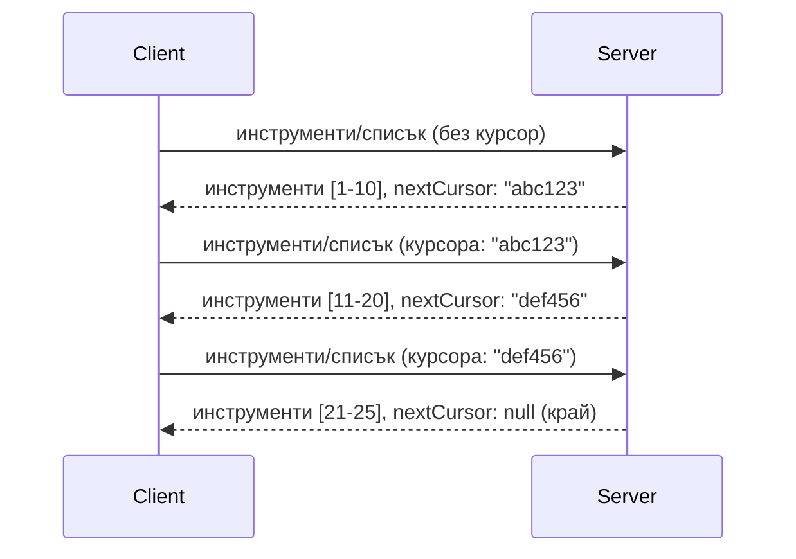

# Пагинация и големи набори от резултати в MCP

Когато вашият MCP сървър обработва големи набори от данни - независимо дали изброява хиляди файлове, записи в база данни или резултати от търсене - ви трябва пагинация, за да управлявате паметта ефективно и да осигурите отзивчиво потребителско изживяване. Този наръчник обяснява как да се реализира и използва пагинация в MCP.

## Защо пагинацията е важна

Без пагинация, големите отговори могат да доведат до:

- **Изчерпване на паметта** - Зареждане на милиони записи наведнъж
- **Бавни времена на отговор** - Потребителите чакат, докато всички данни се заредят
- **Грешки при изтичане на времето** - Заявките надвишават ограниченията за време
- **Слаба производителност на AI** - LLM-ите се затрудняват с огромен контекст

MCP използва **пагинация, базирана на курсор** за надеждно и последователно прелистване през набора от резултати.

---

## Как работи пагинацията в MCP

### Концепцията за курсор

**Курсор** е непрозрачен низ, който маркира вашата позиция в набор от резултати. Мислете за него като отметка в дълга книга.


### Пагинация в MCP методи

Тези MCP методи поддържат пагинация:

| Метод | Връща | Поддръжка на курсор |
|--------|---------|----------------|
| `tools/list` | Дефиниции на инструменти | ✅ |
| `resources/list` | Дефиниции на ресурси | ✅ |
| `prompts/list` | Дефиниции на подсказки | ✅ |
| `resources/templates/list` | Шаблони на ресурси | ✅ |

---

## Имплементация на сървъра

### Python (FastMCP)

```python
from mcp.server import Server
from mcp.types import Tool, ListToolsResult
import math

app = Server("paginated-server")

# Симулиран голям набор от данни
ALL_TOOLS = [
    Tool(name=f"tool_{i}", description=f"Tool number {i}", inputSchema={})
    for i in range(100)
]

PAGE_SIZE = 10

@app.list_tools()
async def list_tools(cursor: str | None = None) -> ListToolsResult:
    """List tools with pagination support."""
    
    # Декодиране на курсора за получаване на начален индекс
    start_index = 0
    if cursor:
        try:
            start_index = int(cursor)
        except ValueError:
            start_index = 0
    
    # Вземете страница с резултати
    end_index = min(start_index + PAGE_SIZE, len(ALL_TOOLS))
    page_tools = ALL_TOOLS[start_index:end_index]
    
    # Изчислете следващия курсор
    next_cursor = None
    if end_index < len(ALL_TOOLS):
        next_cursor = str(end_index)
    
    return ListToolsResult(
        tools=page_tools,
        nextCursor=next_cursor
    )
```

### TypeScript

```typescript
import { Server } from "@modelcontextprotocol/sdk/server/index.js";
import { ListToolsResultSchema } from "@modelcontextprotocol/sdk/types.js";

const server = new Server({
  name: "paginated-server",
  version: "1.0.0"
});

// Симулиран голям набор от данни
const ALL_TOOLS = Array.from({ length: 100 }, (_, i) => ({
  name: `tool_${i}`,
  description: `Tool number ${i}`,
  inputSchema: { type: "object", properties: {} }
}));

const PAGE_SIZE = 10;

server.setRequestHandler(ListToolsResultSchema, async (request) => {
  // Декодиране на курсора
  let startIndex = 0;
  if (request.params?.cursor) {
    startIndex = parseInt(request.params.cursor, 10) || 0;
  }
  
  // Вземете страница с резултати
  const endIndex = Math.min(startIndex + PAGE_SIZE, ALL_TOOLS.length);
  const pageTools = ALL_TOOLS.slice(startIndex, endIndex);
  
  // Изчисляване на следващия курсор
  const nextCursor = endIndex < ALL_TOOLS.length ? String(endIndex) : undefined;
  
  return {
    tools: pageTools,
    nextCursor
  };
});
```

### Java (Spring MCP)

```java
@Service
public class PaginatedToolService {
    
    private static final int PAGE_SIZE = 10;
    private final List<Tool> allTools;
    
    public PaginatedToolService() {
        // Инициализиране на голям набор от данни
        this.allTools = IntStream.range(0, 100)
            .mapToObj(i -> new Tool("tool_" + i, "Tool number " + i, Map.of()))
            .collect(Collectors.toList());
    }
    
    @McpMethod("tools/list")
    public ListToolsResult listTools(@Param("cursor") String cursor) {
        // Декодиране на курсора
        int startIndex = 0;
        if (cursor != null && !cursor.isEmpty()) {
            try {
                startIndex = Integer.parseInt(cursor);
            } catch (NumberFormatException e) {
                startIndex = 0;
            }
        }
        
        // Вземане на страница с резултати
        int endIndex = Math.min(startIndex + PAGE_SIZE, allTools.size());
        List<Tool> pageTools = allTools.subList(startIndex, endIndex);
        
        // Изчисляване на следващия курсор
        String nextCursor = endIndex < allTools.size() ? String.valueOf(endIndex) : null;
        
        return new ListToolsResult(pageTools, nextCursor);
    }
}
```

---

## Имплементация на клиента

### Python клиент

```python
from mcp import ClientSession

async def get_all_tools(session: ClientSession) -> list:
    """Fetch all tools using pagination."""
    all_tools = []
    cursor = None
    
    while True:
        result = await session.list_tools(cursor=cursor)
        all_tools.extend(result.tools)
        
        if result.nextCursor is None:
            break
        cursor = result.nextCursor
    
    return all_tools

# Използване
async with client_session as session:
    tools = await get_all_tools(session)
    print(f"Found {len(tools)} tools")
```

### TypeScript клиент

```typescript
import { Client } from "@modelcontextprotocol/sdk/client/index.js";

async function getAllTools(client: Client): Promise<Tool[]> {
  const allTools: Tool[] = [];
  let cursor: string | undefined = undefined;
  
  do {
    const result = await client.listTools({ cursor });
    allTools.push(...result.tools);
    cursor = result.nextCursor;
  } while (cursor);
  
  return allTools;
}

// Използване
const tools = await getAllTools(client);
console.log(`Found ${tools.length} tools`);
```

### Модел за инерционно зареждане

За много големи набори от данни зареждайте страниците на поискване:

```python
class PaginatedToolIterator:
    """Lazily iterate through paginated tools."""
    
    def __init__(self, session: ClientSession):
        self.session = session
        self.cursor = None
        self.buffer = []
        self.exhausted = False
    
    async def __anext__(self):
        # Върнете от буфера, ако е наличен
        if self.buffer:
            return self.buffer.pop(0)
        
        # Проверете дали сме изчерпали всички страници
        if self.exhausted:
            raise StopAsyncIteration
        
        # Заредете следващата страница
        result = await self.session.list_tools(cursor=self.cursor)
        self.buffer = list(result.tools)
        self.cursor = result.nextCursor
        
        if self.cursor is None:
            self.exhausted = True
        
        if not self.buffer:
            raise StopAsyncIteration
        
        return self.buffer.pop(0)
    
    def __aiter__(self):
        return self

# Използване - ефективно за памет при големи набори от данни
async for tool in PaginatedToolIterator(session):
    process_tool(tool)
```

---

## Пагинация за ресурси

Ресурсите често се нуждаят от пагинация за директории или големи набори от данни:

```python
from mcp.server import Server
from mcp.types import Resource, ListResourcesResult
import os

app = Server("file-server")

@app.list_resources()
async def list_resources(cursor: str | None = None) -> ListResourcesResult:
    """List files in directory with pagination."""
    
    directory = "/data/files"
    all_files = sorted(os.listdir(directory))
    
    # Декодиране на курсор (индекс на файл)
    start_index = int(cursor) if cursor else 0
    page_size = 20
    end_index = min(start_index + page_size, len(all_files))
    
    # Създаване на списък с ресурси за тази страница
    resources = []
    for filename in all_files[start_index:end_index]:
        filepath = os.path.join(directory, filename)
        resources.append(Resource(
            uri=f"file://{filepath}",
            name=filename,
            mimeType="application/octet-stream"
        ))
    
    # Изчисляване на следващия курсор
    next_cursor = str(end_index) if end_index < len(all_files) else None
    
    return ListResourcesResult(
        resources=resources,
        nextCursor=next_cursor
    )
```

---

## Стратегии за проектиране на курсори

### Стратегия 1: Индекс-базирана (Проста)

```python
# Курсорът е просто индекс
cursor = "50"  # Започнете от елемент 50
```

**Предимства:** Проста, без състояние  
**Недостатъци:** Резултатите могат да се изместят, ако елементите се добавят/премахват

### Стратегия 2: ID-базирана (Стабилна)

```python
# Курсор е последно видяното ID
cursor = "item_abc123"  # Започнете след този елемент
```

**Предимства:** Стабилна, дори ако елементите се променят  
**Недостатъци:** Изисква подредени ID-та

### Стратегия 3: Кодирано състояние (Сложна)

```python
import base64
import json

def encode_cursor(state: dict) -> str:
    return base64.b64encode(json.dumps(state).encode()).decode()

def decode_cursor(cursor: str) -> dict:
    return json.loads(base64.b64decode(cursor).decode())

# Курсорът съдържа множество състояния
cursor = encode_cursor({
    "offset": 50,
    "filter": "active",
    "sort": "name"
})
```

**Предимства:** Може да кодира сложно състояние  
**Недостатъци:** По-сложна, по-големи низове за курсор

---

## Най-добри практики

### 1. Избирайте подходящ размер на страниците

```python
# Помислете за размера на данните
PAGE_SIZE_SMALL_ITEMS = 100   # Проста метаданни
PAGE_SIZE_MEDIUM_ITEMS = 20   # По-богати обекти
PAGE_SIZE_LARGE_ITEMS = 5     # Комплексно съдържание
```

### 2. Обработвайте невалидни курсори безпроблемно

```python
@app.list_tools()
async def list_tools(cursor: str | None = None) -> ListToolsResult:
    try:
        start_index = int(cursor) if cursor else 0
        if start_index < 0 or start_index >= len(ALL_TOOLS):
            start_index = 0  # Нулиране към началото
    except (ValueError, TypeError):
        start_index = 0  # Невалиден курсор, започнете отначало
    # ...
```

### 3. Включвайте общ брой (по избор)

```python
return ListToolsResult(
    tools=page_tools,
    nextCursor=next_cursor,
    # Някои реализации включват общо за напредъка на потребителския интерфейс
    _meta={"total": len(ALL_TOOLS)}
)
```

### 4. Тествайте гранични случаи

```python
async def test_pagination():
    # Празен набор от резултати
    result = await session.list_tools()
    assert result.tools == []
    assert result.nextCursor is None
    
    # Една страница
    result = await session.list_tools()
    assert len(result.tools) <= PAGE_SIZE
    
    # Невалиден курсор
    result = await session.list_tools(cursor="invalid")
    assert result.tools  # Трябва да върне първата страница
```

---

## Често срещани грешки

### ❌ Връщане на всички резултати и след това пагинация на клиента

```python
# ЛОШО: Зарежда всичко в паметта
@app.list_tools()
async def list_tools() -> ListToolsResult:
    all_tools = load_all_tools()  # 1 милион инструмента!
    return ListToolsResult(tools=all_tools)
```

### ✅ Пагинация в източника на данните

```python
# ДОБРО: Зарежда само необходимото
@app.list_tools()
async def list_tools(cursor: str | None = None) -> ListToolsResult:
    offset = int(cursor) if cursor else 0
    tools = await db.query_tools(offset=offset, limit=PAGE_SIZE)
    return ListToolsResult(tools=tools, nextCursor=...)
```

---

## Какво следва

- [Модул 5.14 - Контекстно инженерство](../../05-AdvancedTopics/mcp-contextengineering/README.md)
- [Модул 8 - Най-добри практики](../../08-BestPractices/README.md)
- [3.8 - Тестване на вашия MCP сървър](../../03-GettingStarted/08-testing/README.md)

---

## Допълнителни ресурси

- [Спецификация MCP - Пагинация](https://spec.modelcontextprotocol.io/specification/2025-11-25/)
- [Обяснение на пагинация, базирана на курсор](https://slack.engineering/evolving-api-pagination-at-slack/)
- [Тестове за пагинация в Python SDK](https://github.com/modelcontextprotocol/python-sdk/blob/main/tests/client/test_list_methods_cursor.py)

---

<!-- CO-OP TRANSLATOR DISCLAIMER START -->
**Отказ от отговорност**:
Този документ е преведен с помощта на AI преводаческа услуга [Co-op Translator](https://github.com/Azure/co-op-translator). Въпреки че се стараем да бъдем точни, моля, имайте предвид, че автоматичните преводи могат да съдържат грешки или неточности. Оригиналният документ на неговия език трябва да се счита за авторитетен източник. За критична информация се препоръчва професионален човешки превод. Ние не носим отговорност за каквито и да било недоразумения или неправилни тълкувания, произтичащи от използването на този превод.
<!-- CO-OP TRANSLATOR DISCLAIMER END -->