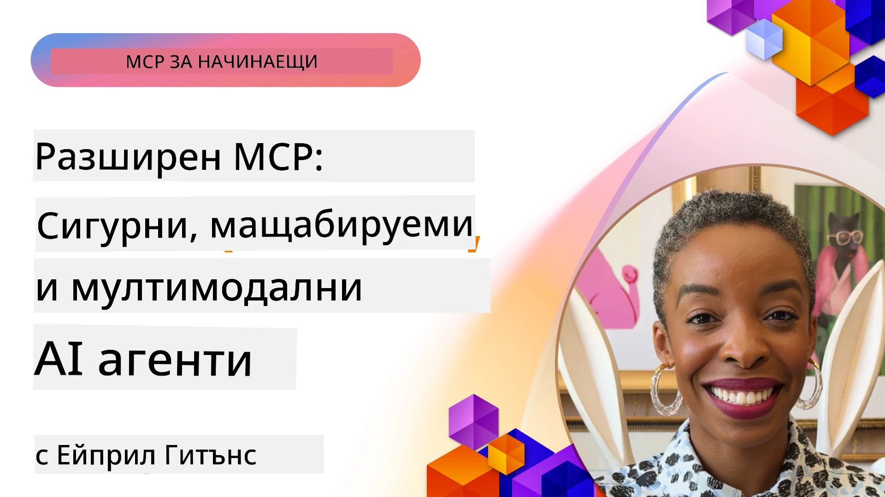

# Разширени теми в MCP

_(Кликнете върху изображението по-горе, за да гледате видеото на този урок)_

Тази глава разглежда серия от разширени теми в имплементацията на Model Context Protocol (MCP), включително мултимодална интеграция, мащабируемост, най-добри практики за сигурност и интеграция в предприятия. Тези теми са от ключово значение за изграждане на устойчиви и готови за продукция MCP приложения, които могат да отговарят на изискванията на съвременните AI системи.

## Преглед

Този урок изследва разширени концепции в имплементацията на Model Context Protocol, с фокус върху мултимодална интеграция, мащабируемост, най-добри практики за сигурност и интеграция в предприятия. Тези теми са съществени за изграждането на MCP приложения за продукция, които могат да се справят със сложни изисквания в корпоративна среда.

## Учебни цели

Към края на този урок ще можете да:

- Имплементирате мултимодални възможности в MCP рамки
- Проектирате мащабируеми MCP архитектури за сценарии с високо натоварване
- Приложите най-добри практики за сигурност в съответствие с принципите на сигурност на MCP
- Интегрирате MCP с корпоративни AI системи и рамки
- Оптимизирате представянето и надеждността в продукционни среди

## Уроци и примерни проекти

| Линк | Заглавие | Описание |
|------|----------|----------|
| [5.1 Интеграция с Azure](./mcp-integration/README.md) | Интеграция с Azure | Научете как да интегрирате вашия MCP сървър в Azure |
| [5.2 Пример за мултимодалност](./mcp-multi-modality/README.md) | MCP мултимодални примери | Примери за аудио, изображения и мултимодален отговор |
| [5.3 Пример MCP OAuth2](../../../05-AdvancedTopics/mcp-oauth2-demo) | Демонстрация MCP OAuth2 | Минимално Spring Boot приложение, показващо OAuth2 с MCP, както като сървър за удостоверяване, така и за ресурси. Демонстрира сигурно издаване на токени, защитени крайни точки, разгръщане в Azure Container Apps и интеграция с API Management. |
| [5.4 Коренни контексти](./mcp-root-contexts/README.md) | Коренни контексти | Научете повече за коренния контекст и как да ги имплементирате |
| [5.5 Роутиране](./mcp-routing/README.md) | Роутиране | Научете различни видове роутинг |
| [5.6 Семплиране](./mcp-sampling/README.md) | Семплиране | Научете как да работите със семплиране |
| [5.7 Мащабиране](./mcp-scaling/README.md) | Мащабиране | Научете за мащабирането |
| [5.8 Сигурност](./mcp-security/README.md) | Сигурност | Защитете своя MCP сървър |
| [5.9 Пример за уеб търсене](./web-search-mcp/README.md) | Уеб търсене MCP | Python MCP сървър и клиент, интегрирани със SerpAPI за реално време уеб, новини, продуктово търсене и въпроси и отговори. Демонстрира оркестрация на множество инструменти, интеграция с външни API и стабилна обработка на грешки. |
| [5.10 Реално време стрийминг](./mcp-realtimestreaming/README.md) | Стрийминг | Поточно предаване на данни в реално време се превърна в задължително в днешния свят, ориентиран към данни, където бизнесите и приложенията изискват незабавен достъп до информация за навременни решения. |
| [5.11 Реално време уеб търсене](./mcp-realtimesearch/README.md) | Уеб търсене | Как MCP трансформира уеб търсенето в реално време, предоставяйки стандартизиран подход за управление на контекста между AI модели, търсачки и приложения. | 
| [5.12 Удостоверяване с Entra ID за MCP сървъри](./mcp-security-entra/README.md) | Удостоверяване с Entra ID | Microsoft Entra ID предоставя здрава облачна идентификационна и достъпна система, която гарантира, че само упълномощени потребители и приложения могат да взаимодействат с вашия MCP сървър. |
| [5.13 Интеграция с Azure AI Foundry Agent](./mcp-foundry-agent-integration/README.md) | Интеграция с Azure AI Foundry | Научете как да интегрирате MCP сървъри с Azure AI Foundry агенти, което позволява мощна оркестрация на инструменти и корпоративни AI възможности с стандартизирани връзки към външни източници на данни. |
| [5.14 Контекст инженеринг](./mcp-contextengineering/README.md) | Контекст инженеринг | Бъдещите възможности в техниките за контекст инженеринг за MCP сървъри, включително оптимизация на контекста, динамично управление на контекста и стратегии за ефективно създаване на заявки в MCP рамки. |
| [5.15 Потребителски трансфер](./mcp-transport/README.md) | Потребителски трансфер | Научете как да имплементирате потребителски трансферни механизми за специализирани комуникационни сценарии на MCP. |
| [5.16 Пълно разглеждане на протоколните функции](./mcp-protocol-features/README.md) | Протоколни функции | Овладейте разширени протоколни функции като известия за прогрес, анулиране на заявки, шаблони за ресурси и модели за обработка на грешки. |

> **Ново в MCP Спецификация 2025-11-25**: Спецификацията вече включва експериментална поддръжка за **Задачи** (дълготрайни операции с проследяване на прогрес), **Анотации на инструменти** (метаданни за поведение на инструментите за безопасност), **URL режим на извличане** (заявка за конкретно URL съдържание от клиенти) и подобрени **Корени** (за управление на контекста на работното пространство). Вижте [MCP Specification changelog](https://spec.modelcontextprotocol.io/) за пълни детайли.

## Допълнителни препратки

За най-актуална информация за разширени MCP теми, вижте:
- [MCP Документация](https://modelcontextprotocol.io/)
- [MCP Спецификация (2025-11-25)](https://spec.modelcontextprotocol.io/specification/2025-11-25/)
- [GitHub Репозитория](https://github.com/modelcontextprotocol)
- [OWASP MCP Топ 10](https://microsoft.github.io/mcp-azure-security-guide/mcp/) - Рискове за сигурността и мерки за защита
- [MCP Security Summit Workshop (Sherpa)](https://azure-samples.github.io/sherpa/) - Обучение по сигурност с практически упражнения

## Основни изводи

- Мултимодалните реализации на MCP разширяват възможностите на AI извън обработката на текст
- Мащабируемостта е съществена за корпоративни инсталации и може да се адресира чрез хоризонтално и вертикално мащабиране
- Комплексните мерки за сигурност защитават данните и осигуряват правилен контрол на достъпа
- Интеграцията с корпоративни платформи като Azure OpenAI и Microsoft AI Foundry разширява възможностите на MCP
- Разширените MCP реализации печелят от оптимизирани архитектури и внимателно управление на ресурсите

## Упражнение

Проектирайте MCP реализация на корпоративно ниво за конкретен случай на употреба:

1. Определете мултимодалните изисквания за вашия случай
2. Очертайте необходимите мерки за сигурност за защита на чувствителни данни
3. Проектирайте мащабируема архитектура, способна да посрещне различни натоварвания
4. Планирайте интеграционни точки с корпоративни AI системи
5. Документирайте потенциални затруднения в производителността и стратегии за преодоляване

## Допълнителни ресурси

- [Документация Azure OpenAI](https://learn.microsoft.com/en-us/azure/ai-services/openai/)
- [Документация Microsoft AI Foundry](https://learn.microsoft.com/en-us/ai-services/)

---

## Какво следва

Разгледайте уроците в този модул, започвайки с: [5.1 MCP Интеграция](./mcp-integration/README.md)

След като завършите този модул, продължете към: [Модул 6: Общностни приноси](../06-CommunityContributions/README.md)

---

<!-- CO-OP TRANSLATOR DISCLAIMER START -->
**Отказ от отговорност**:  
Този документ е преведен с помощта на AI преводаческа услуга [Co-op Translator](https://github.com/Azure/co-op-translator). Въпреки че се стремим към точност, моля, имайте предвид, че автоматизираните преводи може да съдържат грешки или неточности. Оригиналният документ на неговия език трябва да се счита за авторитетен източник. За критична информация се препоръчва професионален превод от човек. Не носим отговорност за каквито и да е неразбирателства или неправилни тълкувания, произтичащи от използването на този превод.
<!-- CO-OP TRANSLATOR DISCLAIMER END -->