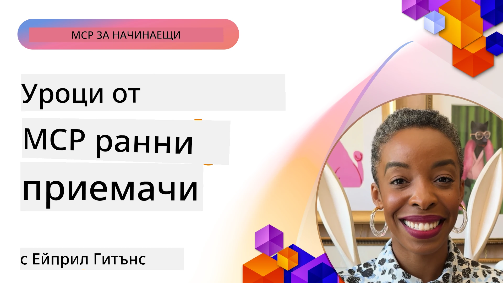

# 🌟 Уроци от ранните потребители

[](https://youtu.be/jds7dSmNptE)

_(Кликнете върху изображението по-горе, за да гледате видеото на този урок)_

## 🎯 Какво обхваща този модул

Този модул разглежда как реални организации и разработчици използват Model Context Protocol (MCP) за решаване на действителни предизвикателства и стимулиране на иновации. Чрез подробни казуси, практически проекти и примери ще откриете как MCP позволява сигурна и мащабируема AI интеграция, която свързва езикови модели, инструменти и корпоративни данни.

### 📚 Вижте MCP в действие

Искате ли да видите как тези принципи се прилагат в готови за продукция инструменти? Разгледайте нашите [**10 Microsoft MCP сървъра, които преобразяват продуктивността на разработчиците**](microsoft-mcp-servers.md), които показват реални Microsoft MCP сървъри, които можете да използвате днес.

## Преглед

Този урок разглежда как ранните потребители са използвали Model Context Protocol (MCP), за да решат реални предизвикателства и да стимулират иновации в различни индустрии. Чрез подробни казуси и практически проекти ще видите как MCP осигурява стандартизирана, сигурна и мащабируема AI интеграция — свързвайки големи езикови модели, инструменти и корпоративни данни в единна рамка. Ще придобиете практически опит в проектирането и изграждането на решения, базирани на MCP, ще научите от доказани модели за внедряване и ще откриете най-добрите практики за използване на MCP в продукционни среди. Урокът също така подчертава нововъзникващи тенденции, бъдещи посоки и ресурси с отворен код, за да ви помогне да останете начело в технологиите на MCP и еволюиращата му екосистема.

## Учебни цели

- Анализиране на реални реализации на MCP в различни индустрии  
- Проектиране и изграждане на пълни приложения, базирани на MCP  
- Изследване на нововъзникващи тенденции и бъдещи посоки в технологиите MCP  
- Прилагане на най-добрите практики в реални сценарии за разработка  

## Реални реализации на MCP

### Казус 1: Автоматизация на клиентската поддръжка в предприятия

Многонационална корпорация внедри решение, базирано на MCP, за стандартизиране на взаимодействията с AI в системите за клиентска поддръжка. Това им позволи:

- Създаване на единен интерфейс за множество доставчици на LLM  
- Поддържане на постоянство в управлението на подканите между отделите  
- Изпълнение на надеждни мерки за сигурност и съответствие  
- Лесно превключване между различни AI модели според конкретните нужди  

**Техническа реализация:**

```python
# Имплементация на Python MCP сървър за клиентска поддръжка
import logging
import asyncio
from modelcontextprotocol import create_server, ServerConfig
from modelcontextprotocol.server import MCPServer
from modelcontextprotocol.transports import create_http_transport
from modelcontextprotocol.resources import ResourceDefinition
from modelcontextprotocol.prompts import PromptDefinition
from modelcontextprotocol.tool import ToolDefinition

# Конфигуриране на логване
logging.basicConfig(level=logging.INFO)

async def main():
    # Създаване на конфигурация на сървъра
    config = ServerConfig(
        name="Enterprise Customer Support Server",
        version="1.0.0",
        description="MCP server for handling customer support inquiries"
    )
    
    # Инициализиране на MCP сървър
    server = create_server(config)
    
    # Регистриране на ресурси на база знания
    server.resources.register(
        ResourceDefinition(
            name="customer_kb",
            description="Customer knowledge base documentation"
        ),
        lambda params: get_customer_documentation(params)
    )
    
    # Регистриране на шаблони за подсказки
    server.prompts.register(
        PromptDefinition(
            name="support_template",
            description="Templates for customer support responses"
        ),
        lambda params: get_support_templates(params)
    )
    
    # Регистриране на инструменти за поддръжка
    server.tools.register(
        ToolDefinition(
            name="ticketing",
            description="Create and update support tickets"
        ),
        handle_ticketing_operations
    )
    
    # Стартиране на сървъра с HTTP транспорт
    transport = create_http_transport(port=8080)
    await server.run(transport)

if __name__ == "__main__":
    asyncio.run(main())
```
  
**Резултати:** Намаление на разходите за модели с 30%, подобрение на консистентността в отговорите с 45% и повишено съответствие в глобалните операции.

### Казус 2: Диагностичен помощник в здравеопазването

Здравен доставчик разработи MCP инфраструктура за интегриране на множество специализирани медицински AI модели, като същевременно гарантира, че чувствителните пациентски данни остават защитени:

- Безпроблемно превключване между общи и специализирани медицински модели  
- Строги контроли за поверителност и одитни записи  
- Интеграция със съществуващи системи за електронни здравни досиета (EHR)  
- Постоянно инженерство на подканите за медицинска терминология  

**Техническа реализация:**

```csharp
// C# MCP host application implementation in healthcare application
using Microsoft.Extensions.DependencyInjection;
using ModelContextProtocol.SDK.Client;
using ModelContextProtocol.SDK.Security;
using ModelContextProtocol.SDK.Resources;

public class DiagnosticAssistant
{
    private readonly MCPHostClient _mcpClient;
    private readonly PatientContext _patientContext;
    
    public DiagnosticAssistant(PatientContext patientContext)
    {
        _patientContext = patientContext;
        
        // Configure MCP client with healthcare-specific settings
        var clientOptions = new ClientOptions
        {
            Name = "Healthcare Diagnostic Assistant",
            Version = "1.0.0",
            Security = new SecurityOptions
            {
                Encryption = EncryptionLevel.Medical,
                AuditEnabled = true
            }
        };
        
        _mcpClient = new MCPHostClientBuilder()
            .WithOptions(clientOptions)
            .WithTransport(new HttpTransport("https://healthcare-mcp.example.org"))
            .WithAuthentication(new HIPAACompliantAuthProvider())
            .Build();
    }
    
    public async Task<DiagnosticSuggestion> GetDiagnosticAssistance(
        string symptoms, string patientHistory)
    {
        // Create request with appropriate resources and tool access
        var resourceRequest = new ResourceRequest
        {
            Name = "patient_records",
            Parameters = new Dictionary<string, object>
            {
                ["patientId"] = _patientContext.PatientId,
                ["requestingProvider"] = _patientContext.ProviderId
            }
        };
        
        // Request diagnostic assistance using appropriate prompt
        var response = await _mcpClient.SendPromptRequestAsync(
            promptName: "diagnostic_assistance",
            parameters: new Dictionary<string, object>
            {
                ["symptoms"] = symptoms,
                patientHistory = patientHistory,
                relevantGuidelines = _patientContext.GetRelevantGuidelines()
            });
            
        return DiagnosticSuggestion.FromMCPResponse(response);
    }
}
```
  
**Резултати:** Подобрени диагностични предложения за лекари с пълно спазване на HIPAA и значително намаляване на контекстните превключвания между системите.

### Казус 3: Анализ на рискове във финансовите услуги

Финансова институция използва MCP за стандартизиране на процесите за анализ на риска в различни отдели:

- Създаден е единен интерфейс за модели за кредитен риск, откриване на измами и инвестиционен риск  
- Внедрени са строги контролни механизми за достъп и версииране на модели  
- Осигурена е одитируемост на всички AI препоръки  
- Запазен е постоянен формат на данните през разнообразни системи  

**Техническа реализация:**

```java
// Java MCP сървър за оценка на финансовия риск
import org.mcp.server.*;
import org.mcp.security.*;

public class FinancialRiskMCPServer {
    public static void main(String[] args) {
        // Създайте MCP сървър с функции за финансово съответствие
        MCPServer server = new MCPServerBuilder()
            .withModelProviders(
                new ModelProvider("risk-assessment-primary", new AzureOpenAIProvider()),
                new ModelProvider("risk-assessment-audit", new LocalLlamaProvider())
            )
            .withPromptTemplateDirectory("./compliance/templates")
            .withAccessControls(new SOCCompliantAccessControl())
            .withDataEncryption(EncryptionStandard.FINANCIAL_GRADE)
            .withVersionControl(true)
            .withAuditLogging(new DatabaseAuditLogger())
            .build();
            
        server.addRequestValidator(new FinancialDataValidator());
        server.addResponseFilter(new PII_RedactionFilter());
        
        server.start(9000);
        
        System.out.println("Financial Risk MCP Server running on port 9000");
    }
}
```
  
**Резултати:** Подобрено регулаторно съответствие, 40% по-бързи цикли на внедряване на модели и подобрена консистентност в оценките на риска между отделите.

### Казус 4: Microsoft Playwright MCP сървър за автоматизация на браузъри

Microsoft разработи [Playwright MCP сървър](https://github.com/microsoft/playwright-mcp), който позволява сигурна, стандартизирана автоматизация на браузъра чрез Model Context Protocol. Този продукционно готов сървър позволява на AI агенти и LLM да взаимодействат с уеб браузъри по контролиран, одитируем и разширяем начин — поддържайки употребите като автоматизирано тестване, извличане на данни и пълни работни потоци.

> **🎯 Инструмент готов за продукция**  
>  
> Този казус представя реален MCP сървър, който можете да използвате днес! Научете повече за Playwright MCP Server и още 9 други продукционно готови Microsoft MCP сървъра в нашия [**Наставник на Microsoft MCP сървъри**](microsoft-mcp-servers.md#8--playwright-mcp-server).

**Основни характеристики:**  
- Предоставя възможности за автоматизация на браузър (навигация, попълване на формуляри, създаване на скрийншоти и др.) като MCP инструменти  
- Внедрява строги контролни механизми за достъп и изолация за предотвратяване на неразрешени действия  
- Осигурява подробни одитни логове за всички взаимодействия с браузъра  
- Поддържа интеграция с Azure OpenAI и други доставчици на LLM за автоматизация, управлявана от агенти  
- Захранва Coding Agent на GitHub Copilot с възможности за уеб сърфиране  

**Техническа реализация:**

```typescript
// TypeScript: Регистриране на инструменти за автоматизация на браузъра Playwright в MCP сървър
import { createServer, ToolDefinition } from 'modelcontextprotocol';
import { launch } from 'playwright';

const server = createServer({
  name: 'Playwright MCP Server',
  version: '1.0.0',
  description: 'MCP server for browser automation using Playwright'
});

// Регистрирайте инструмент за навигация до URL и заснемане на екранна снимка
server.tools.register(
  new ToolDefinition({
    name: 'navigate_and_screenshot',
    description: 'Navigate to a URL and capture a screenshot',
    parameters: {
      url: { type: 'string', description: 'The URL to visit' }
    }
  }),
  async ({ url }) => {
    const browser = await launch();
    const page = await browser.newPage();
    await page.goto(url);
    const screenshot = await page.screenshot();
    await browser.close();
    return { screenshot };
  }
);

// Стартиране на MCP сървъра
server.listen(8080);
```
  
**Резултати:**  
- Позволи сигурна програмна автоматизация на браузъра за AI агенти и LLM  
- Намали усилията за ръчно тестване и подобри покритието на тестовете за уеб приложения  
- Осигури многократна за използване, разширяема рамка за интеграция на браузър-базирани инструменти в корпоративни среди  
- Захранва възможностите за уеб браузиране на GitHub Copilot  

**Препратки:**  
- [Playwright MCP Server GitHub хранилище](https://github.com/microsoft/playwright-mcp)  
- [Microsoft AI и автоматизация решения](https://azure.microsoft.com/en-us/products/ai-services/)

### Казус 5: Azure MCP – Корпоративен Model Context Protocol като услуга

Azure MCP Server ([https://aka.ms/azmcp](https://aka.ms/azmcp)) е управлявана, корпоративна реализация на Model Context Protocol от Microsoft, проектирана да предоставя мащабируеми, сигурни и съвместими MCP сървърни възможности като облачна услуга. Azure MCP позволява на организациите бързо да разгръщат, управляват и интегрират MCP сървъри с Azure AI, данни и сигурност, намалявайки оперативните разходи и ускорявайки приемането на AI.

> **🎯 Инструмент готов за продукция**  
>  
> Това е реален MCP сървър, който можете да използвате днес! Научете повече за Azure AI Foundry MCP Server в нашия [**Наставник на Microsoft MCP сървъри**](microsoft-mcp-servers.md).

- Пълно управляван хостинг на MCP сървър с вградена мащабируемост, мониторинг и сигурност  
- Родна интеграция с Azure OpenAI, Azure AI Search и други Azure услуги  
- Корпоративна автентикация и авторизация чрез Microsoft Entra ID  
- Поддръжка на персонализирани инструменти, шаблони за подканване и ресурсни конектори  
- Съответствие с корпоративни изисквания за сигурност и регулации  

**Техническа реализация:**

```yaml
# Example: Azure MCP server deployment configuration (YAML)
apiVersion: mcp.microsoft.com/v1
kind: McpServer
metadata:
  name: enterprise-mcp-server
spec:
  modelProviders:
    - name: azure-openai
      type: AzureOpenAI
      endpoint: https://<your-openai-resource>.openai.azure.com/
      apiKeySecret: <your-azure-keyvault-secret>
  tools:
    - name: document_search
      type: AzureAISearch
      endpoint: https://<your-search-resource>.search.windows.net/
      apiKeySecret: <your-azure-keyvault-secret>
  authentication:
    type: EntraID
    tenantId: <your-tenant-id>
  monitoring:
    enabled: true
    logAnalyticsWorkspace: <your-log-analytics-id>
```
  
**Резултати:**  
- Намалено време за постигане на резултати в корпоративни AI проекти чрез предоставяне на готова платформа за MCP сървър  
- Оптимизирана интеграция на LLM, инструменти и корпоративни източници на данни  
- Подобрена сигурност, наблюдаемост и оперативна ефективност за MCP натоварвания  
- Подобрено качество на кода с най-добри практики на Azure SDK и актуални модели за автентикация  

**Препратки:**  
- [Документация за Azure MCP](https://aka.ms/azmcp)  
- [Azure MCP Server GitHub хранилище](https://github.com/Azure/azure-mcp)  
- [Azure AI услуги](https://azure.microsoft.com/en-us/products/ai-services/)  
- [Microsoft MCP Център](https://mcp.azure.com)

## Казус 6: NLWeb  
MCP (Model Context Protocol) е новоизгряващ протокол за чатботове и AI асистенти за взаимодействие с инструменти. Всяка NLWeb инстанция е също MCP сървър, който поддържа един основен метод — ask, използван за задаване на въпрос на уебсайт на естествен език. Върнатият отговор използва schema.org, широкоразпространен речник за описване на уеб данни. С други думи, MCP е NLWeb така както Http е на HTML. NLWeb комбинира протоколи, формати на Schema.org и примерен код, за да помогне на сайтовете бързо да създадат тези крайни точки, като предоставя полза както на хората чрез разговорни интерфейси, така и на машините чрез естествен агент-към-агент взаимодействие.

Има два отделни компонента на NLWeb.  
- Протокол, много прост за започване, за интерфейс с сайт на естествен език и формат, използващ json и schema.org за отговора. Вижте документацията за REST API за повече подробности.  
- Лесна реализация на (1), която използва съществуваща маркировка за сайтове, които могат да бъдат абстрахирани като списъци с елементи (продукти, рецепти, атракции, ревюта и др.). Заедно със комплект от интерфейсни елементи сайтовете лесно предоставят разговорни интерфейси към съдържанието си. Вижте документацията за Life of a chat query за повече подробности как това работи.  

**Препратки:**  
- [Документация за Azure MCP](https://aka.ms/azmcp)  
- [NLWeb](https://github.com/microsoft/NlWeb)

### Казус 7: Azure AI Foundry MCP сървър – Интеграция на корпоративни AI агенти

Azure AI Foundry MCP сървъри демонстрират как MCP може да се използва за оркестрация и управление на AI агенти и работни потоци в корпоративни среди. Чрез интегриране на MCP с Azure AI Foundry организациите могат да стандартизират взаимодействия на агенти, да използват управлението на работни потоци на Foundry и да гарантират сигурни, мащабируеми внедрявания.

> **🎯 Инструмент готов за продукция**  
>  
> Това е реален MCP сървър, който можете да използвате днес! Научете повече за Azure AI Foundry MCP Server в нашия [**Наставник на Microsoft MCP сървъри**](microsoft-mcp-servers.md#9--azure-ai-foundry-mcp-server).

**Основни характеристики:**  
- Комплексен достъп до AI екосистемата на Azure, включително каталози на модели и управление на внедряването  
- Индексиране на знания с Azure AI Search за RAG приложения  
- Инструменти за оценка на производителността и качеството на AI модели  
- Интеграция с Azure AI Foundry Catalog и Labs за авангардни изследователски модели  
- Управление и оценка на агенти за продукционни сценарии  

**Резултати:**  
- Бързо прототипиране и здрава мониторингова система за работни потоци на AI агенти  
- Безпроблемна интеграция с Azure AI услуги за напреднали сценарии  
- Единен интерфейс за изграждане, внедряване и мониторинг на агентски потоци  
- Подобрена сигурност, съответствие и оперативна ефективност за предприятия  
- Ускорено приемане на AI при запазване на контрола върху сложни агенто-управлявани процеси  

**Препратки:**  
- [Azure AI Foundry MCP Server GitHub хранилище](https://github.com/azure-ai-foundry/mcp-foundry)  
- [Интегриране на Azure AI агенти с MCP (Microsoft Foundry блог)](https://devblogs.microsoft.com/foundry/integrating-azure-ai-agents-mcp/)

### Казус 8: Foundry MCP Playground – Експериментиране и прототипиране

Foundry MCP Playground предлага готова за използване среда за експериментиране с MCP сървъри и интеграции с Azure AI Foundry. Разработчиците могат бързо да прототипират, тестват и оценяват AI модели и работни потоци на агенти, използвайки ресурси от Azure AI Foundry Catalog и Labs. Плейграундът опростява настройката, предоставя примерни проекти и поддържа съвместна разработка, улеснявайки изследването на най-добри практики и нови сценарии с минимален ресурсен разход. Особено полезен е за екипи, които искат да валидират идеи, споделят експерименти и ускоряват ученето без необходимост от сложна инфраструктура. Като снижава бариерите за проникване, плейграундът подпомага иновациите и приноса на общността в екосистемата на MCP и Azure AI Foundry.

**Препратки:**  
- [Foundry MCP Playground GitHub хранилище](https://github.com/azure-ai-foundry/foundry-mcp-playground)

### Казус 9: Microsoft Learn Docs MCP сървър – Достъп до документация, захранвана от AI

Microsoft Learn Docs MCP Server е облачно хоствана услуга, която осигурява на AI асистенти реалновременен достъп до официална документация на Microsoft чрез Model Context Protocol. Този продукционно готов сървър се свързва с обширната екосистема на Microsoft Learn и позволява семантично търсене в официалните източници на Microsoft.

> **🎯 Инструмент готов за продукция**  
>  
> Това е реален MCP сървър, който можете да използвате днес! Научете повече за Microsoft Learn Docs MCP Server в нашия [**Наставник на Microsoft MCP сървъри**](microsoft-mcp-servers.md#1--microsoft-learn-docs-mcp-server).

**Основни характеристики:**  
- Реален достъп в реално време до официална документация на Microsoft, Azure документи и Microsoft 365 документация  
- Разширени възможности за семантично търсене, които разбират контекст и намерение  
- Винаги актуална информация, тъй като съдържанието на Microsoft Learn се публикува  
- Обхваща пълнота на Microsoft Learn, Azure документация и източници на Microsoft 365  
- Връща до 10 висококачествени съдържателни части с заглавия на статии и URL адреси  

**Защо е критично:**  
- Решава проблема със „стареещите AI знания“ за Microsoft технологии  
- Осигурява на AI асистентите достъп до най-новите функции на .NET, C#, Azure и Microsoft 365  
- Предоставя авторитетна, първоизточна информация за точна генерация на код  
- Критично за разработчици, работещи с бързо развиващи се Microsoft технологии  

**Резултати:**  
- Драстично подобрена точност на AI генерирания код за Microsoft технологии  
- Намалено време за търсене на актуална документация и добри практики  
- Повишена продуктивност на разработчиците чрез контекстно осъзнато извличане на документация  
- Безпроблемна интеграция с работни процеси за разработка без напускане на IDE  

**Препратки:**  
- [Microsoft Learn Docs MCP Server GitHub хранилище](https://github.com/MicrosoftDocs/mcp)  
- [Microsoft Learn документация](https://learn.microsoft.com/)

## Практически проекти

### Проект 1: Изградете MCP сървър с множество доставчици

**Цел:** Създаване на MCP сървър, който може да маршрутизира заявки към различни доставчици на AI модели според конкретни критерии.

**Изисквания:**

- Поддръжка на поне трима различни доставчици на модели (например OpenAI, Anthropic, локални модели)  
- Имплементиране на маршрутна логика базирана на метаданни на заявката  
- Създаване на конфигурационна система за управление на идентификационни данни на доставчици  
- Добавяне на кеширане за оптимизиране на производителността и разходите  
- Изграждане на прост табло за мониторинг на използването  

**Стъпки за изпълнение:**

1. Настройване на базова инфраструктура на MCP сървър  
2. Имплементиране на адаптери за доставчици за всяка AI услуга  
3. Създаване на маршрутна логика базирана на атрибутите на заявката  
4. Добавяне на кеширащи механизми за чести заявки  
5. Разработване на таблото за мониторинг  
6. Тестване с различни модели на заявки  

**Технологии:** Изберете между Python (.NET/Java/Python според предпочитанията ви), Redis за кеширане и прост уеб фреймуорк за таблото.

### Проект 2: Корпоративна система за управление на подканите
**Цел:** Разработване на система, базирана на MCP, за управление, версиониране и разгръщане на шаблони за заявки в рамките на организацията.

**Изисквания:**

- Създаване на централен хранилище за шаблони за заявки
- Реализиране на версиониране и работни потоци за одобрение
- Изграждане на възможности за тестване на шаблони с примерни входни данни
- Разработване на контрол на достъпа, базиран на роли
- Създаване на API за извличане и разгръщане на шаблони

**Стъпки за изпълнение:**

1. Проектиране на схемата на базата данни за съхранение на шаблони
2. Създаване на основното API за CRUD операции с шаблони
3. Реализиране на системата за версиониране
4. Изграждане на работния поток за одобрение
5. Разработване на тестова рамка
6. Създаване на прост уеб интерфейс за управление
7. Интеграция със сървър MCP

**Технологии:** Изберете бекенд рамка, SQL или NoSQL база данни и фронтенд рамка за управленския интерфейс.

### Проект 3: Платформа за генериране на съдържание, базирана на MCP

**Цел:** Изграждане на платформа за генериране на съдържание, която използва MCP за осигуряване на последователни резултати при различни видове съдържание.

**Изисквания:**

- Поддръжка на множество формати на съдържание (блог постове, социални мрежи, маркетингови текстове)
- Реализиране на генериране, базирано на шаблони, с опции за персонализация
- Създаване на система за преглед и обратна връзка за съдържанието
- Мониторинг на показатели за представяне на съдържанието
- Поддръжка на версиониране и итерация на съдържанието

**Стъпки за изпълнение:**

1. Създаване на инфраструктурата на MCP клиента
2. Създаване на шаблони за различни типове съдържание
3. Изграждане на конвейер за генериране на съдържание
4. Реализиране на система за преглед
5. Разработване на система за проследяване на показатели
6. Създаване на потребителски интерфейс за управление на шаблони и генериране на съдържание

**Технологии:** Предпочитан програмен език, уеб рамка и система за база данни.

## Бъдещи посоки за технологията MCP

### Възникващи тенденции

1. **Мултимодален MCP**
   - Разширяване на MCP за стандартизиране на взаимодействия с модели за изображения, аудио и видео
   - Разработка на способности за крос-модално разсъждение
   - Стандартизирани формати на заявки за различни модалности

2. **Федеративна MCP инфраструктура**
   - Разпределени MCP мрежи, които могат да споделят ресурси между организации
   - Стандартизирани протоколи за сигурно споделяне на модели
   - Техники за изчисления с опазване на личните данни

3. **MCP пазари**
   - Екосистеми за споделяне и монетизиране на MCP шаблони и плъгини
   - Процеси за контрол на качеството и сертифициране
   - Интеграция с пазари за модели

4. **MCP за edge изчисления**
   - Адаптация на MCP стандартите за ресурсоограничени периферни устройства
   - Оптимизирани протоколи за среди с ниска пропускателна способност
   - Специализирани MCP реализации за IoT екосистеми

5. **Регулаторни рамки**
   - Разработка на MCP разширения за съответствие с регулации
   - Стандартизирани одиторски следи и интерфейси за обяснимост
   - Интеграция с нововъзникващи рамки за управление на изкуствения интелект

### MCP решения от Microsoft

Microsoft и Azure са разработили няколко отворени хранилища, които помагат на разработчиците да внедрят MCP в различни сценарии:

#### Организация Microsoft

1. [playwright-mcp](https://github.com/microsoft/playwright-mcp) - MCP сървър за Playwright за автоматизация и тестване на браузъри
2. [files-mcp-server](https://github.com/microsoft/files-mcp-server) - MCP сървър за OneDrive за локално тестване и принос от общността
3. [NLWeb](https://github.com/microsoft/NlWeb) - NLWeb е колекция от отворени протоколи и свързани отворени инструменти. Основният му фокус е създаване на базов слой за AI Web

#### Организация Azure-Samples

1. [mcp](https://github.com/Azure-Samples/mcp) - Връзки към примери, инструменти и ресурси за изграждане и интегриране на MCP сървъри в Azure с различни езици
2. [mcp-auth-servers](https://github.com/Azure-Samples/mcp-auth-servers) - Примерни MCP сървъри, демонстриращи автентикация според спецификацията на Model Context Protocol
3. [remote-mcp-functions](https://github.com/Azure-Samples/remote-mcp-functions) - Начална страница за реализации на Remote MCP Server в Azure Functions с връзки към езикови хранилища
4. [remote-mcp-functions-python](https://github.com/Azure-Samples/remote-mcp-functions-python) - Шаблон за бързо стартиране за изграждане и разгръщане на персонализирани отдалечени MCP сървъри с Azure Functions и Python
5. [remote-mcp-functions-dotnet](https://github.com/Azure-Samples/remote-mcp-functions-dotnet) - Шаблон за бързо стартиране за изграждане и разгръщане на персонализирани отдалечени MCP сървъри с Azure Functions и .NET/C#
6. [remote-mcp-functions-typescript](https://github.com/Azure-Samples/remote-mcp-functions-typescript) - Шаблон за бързо стартиране за изграждане и разгръщане на персонализирани отдалечени MCP сървъри с Azure Functions и TypeScript
7. [remote-mcp-apim-functions-python](https://github.com/Azure-Samples/remote-mcp-apim-functions-python) - Azure API Management като AI Gateway към Remote MCP сървъри с Python
8. [AI-Gateway](https://github.com/Azure-Samples/AI-Gateway) - APIM ❤️ AI експерименти, включващи MCP възможности, интеграция с Azure OpenAI и AI Foundry

Тези хранилища предоставят различни реализации, шаблони и ресурси за работа с Model Context Protocol на различни програмни езици и Azure услуги. Те покриват широк спектър от случаи – от базови сървърни реализации до автентикация, облачно разгръщане и корпоративна интеграция.

#### MCP ресурсен каталог

[Каталогът MCP ресурси](https://github.com/microsoft/mcp/tree/main/Resources) в официалното репо на Microsoft MCP предоставя подбрана колекция от примерни ресурси, шаблони за заявки и определения на инструменти за използване със сървъри Model Context Protocol. Този каталог е предназначен да помогне на разработчиците бързо да започнат работа с MCP, като предлага използваеми блокове за изграждане и добри практики за:

- **Шаблони за заявки:** Готови за ползване шаблони за чести AI задачи и сценарии, които могат да бъдат адаптирани за вашите MCP сървърни реализации.
- **Определения на инструменти:** Примери за схеми на инструменти и метаданни за стандартизиране на интеграция и повикване на инструменти между различни MCP сървъри.
- **Примери за ресурси:** Примерни определения на ресурси за свързване с източници на данни, API-та и външни услуги в рамките на MCP средата.
- **Референтни реализации:** Практически примери, демонстриращи как да структурирате и организирате ресурси, заявки и инструменти в реални MCP проекти.

Тези ресурси ускоряват разработката, насърчават стандартизацията и помагат да се гарантират добри практики при изграждането и разгръщането на решения, базирани на MCP.

#### MCP ресурсен каталог

- [MCP ресурси (примерни заявки, инструменти и определения на ресурси)](https://github.com/microsoft/mcp/tree/main/Resources)

### Възможности за изследвания

- Ефективни техники за оптимизация на заявки в рамките на MCP среди
- Модели за сигурност при мулти-тенант MCP инсталации
- Тестове за производителност в различни MCP реализации
- Формални методи за верификация на MCP сървъри

## Заключение

Model Context Protocol (MCP) бързо оформя бъдещето на стандартизирана, сигурна и съвместима интеграция на AI в различни индустрии. Чрез казусите и практическите проекти в този урок видяхте как ранните възприемачи — включително Microsoft и Azure — използват MCP за решаване на реални предизвикателства, ускоряване на приемането на AI и гарантиране на съответствие, сигурност и мащабируемост. Модулният подход на MCP позволява на организации да свързват големи езикови модели, инструменти и корпоративни данни в унифицирана, проверяема рамка. С продължаващото развитие на MCP, активното участие в общността, изследването на отворени ресурси и прилагането на добрите практики ще бъдат ключови за изграждането на стабилни AI решения, готови за бъдещето.

## Допълнителни ресурси

- [MCP Foundry GitHub хранилище](https://github.com/azure-ai-foundry/mcp-foundry)
- [Foundry MCP Playground](https://github.com/azure-ai-foundry/foundry-mcp-playground)
- [Интегриране на Azure AI агенти с MCP (Microsoft Foundry блог)](https://devblogs.microsoft.com/foundry/integrating-azure-ai-agents-mcp/)
- [MCP GitHub хранилище (Microsoft)](https://github.com/microsoft/mcp)
- [MCP ресурсен каталог (примерни заявки, инструменти и определения на ресурси)](https://github.com/microsoft/mcp/tree/main/Resources)
- [Общност и документация за MCP](https://modelcontextprotocol.io/introduction)
- [MCP спецификация (2025-11-25)](https://spec.modelcontextprotocol.io/specification/2025-11-25/)
- [Документация Azure MCP](https://aka.ms/azmcp)
- [OWASP MCP Топ 10](https://microsoft.github.io/mcp-azure-security-guide/mcp/) - Най-добри практики за сигурност
- [Playwright MCP сървър GitHub хранилище](https://github.com/microsoft/playwright-mcp)
- [Files MCP сървър (OneDrive)](https://github.com/microsoft/files-mcp-server)
- [Azure-Samples MCP](https://github.com/Azure-Samples/mcp)
- [MCP Auth Servers (Azure-Samples)](https://github.com/Azure-Samples/mcp-auth-servers)
- [Remote MCP Functions (Azure-Samples)](https://github.com/Azure-Samples/remote-mcp-functions)
- [Remote MCP Functions Python (Azure-Samples)](https://github.com/Azure-Samples/remote-mcp-functions-python)
- [Remote MCP Functions .NET (Azure-Samples)](https://github.com/Azure-Samples/remote-mcp-functions-dotnet)
- [Remote MCP Functions TypeScript (Azure-Samples)](https://github.com/Azure-Samples/remote-mcp-functions-typescript)
- [Remote MCP APIM Functions Python (Azure-Samples)](https://github.com/Azure-Samples/remote-mcp-apim-functions-python)
- [AI-Gateway (Azure-Samples)](https://github.com/Azure-Samples/AI-Gateway)
- [Решения на Microsoft за AI и автоматизация](https://azure.microsoft.com/en-us/products/ai-services/)

## Упражнения

1. Анализирайте един от казусите и предложете алтернативен подход за реализиране.
2. Изберете една от идеите за проект и създайте детайлна техническа спецификация.
3. Проучете индустрия, която не е обхваната от казусите, и очертайте как MCP би могъл да реши специфичните й предизвикателства.
4. Изследвайте една от бъдещите посоки и създайте концепция за ново MCP разширение, което да я поддържа.

## Какво следва

Разгледайте повече: [Microsoft MCP сървъри](./microsoft-mcp-servers.md)

Продължете към: [Модул 8: Най-добри практики](../08-BestPractices/README.md)

---

<!-- CO-OP TRANSLATOR DISCLAIMER START -->
**Отказ от отговорност**:  
Този документ е преведен с помощта на AI преводаческа услуга [Co-op Translator](https://github.com/Azure/co-op-translator). Въпреки че се стремим към точност, моля, имайте предвид, че автоматизираните преводи могат да съдържат грешки или неточности. Оригиналният документ на неговия собствен език трябва да се счита за авторитетен източник. За критична информация се препоръчва професионален човешки превод. Ние не носим отговорност за каквито и да е разбирателства или погрешни тълкувания, произтичащи от използването на този превод.
<!-- CO-OP TRANSLATOR DISCLAIMER END -->