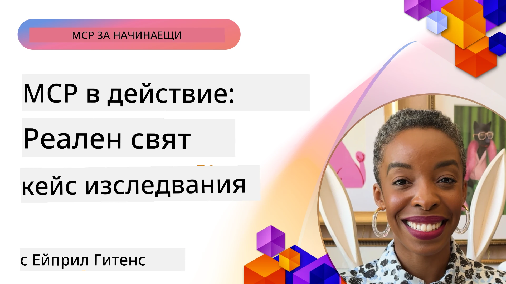

# MCP в действие: казуси от реалния свят

_(Кликнете върху изображението по-горе, за да гледате видео на този урок)_

Протоколът за контекст на моделите (MCP) трансформира начина, по който AI приложенията взаимодействат с данни, инструменти и услуги. В този раздел са представени казуси от реалния свят, които демонстрират практическото приложение на MCP в различни корпоративни сценарии.

## Преглед

Този раздел показва конкретни примери за внедряване на MCP, като подчертава как организациите използват този протокол за решаване на сложни бизнес предизвикателства. Чрез разглеждане на тези казуси ще получите прозрения за многообразието, мащабируемостта и практическите ползи на MCP в реални ситуации.

## Основни цели на обучението

Чрез изследването на тези казуси ще:

- Разберете как MCP може да се приложи за решаване на конкретни бизнес проблеми
- Научите различни модели на интеграция и архитектурни подходи
- Разпознаете най-добрите практики за внедряване на MCP в корпоративни среди
- Получите прозрения за предизвикателствата и решенията, срещани при реални внедрявания
- Идентифицирате възможности за прилагане на подобни модели в собствените си проекти

## Представени казуси

### 1. [Azure AI Travel Agents – Пример за референтна реализация](./travelagentsample.md)

Този казус разглежда цялостното решение на Microsoft, което демонстрира как да се изградят многоагентна, базирана на AI, система за планиране на пътувания, използвайки MCP, Azure OpenAI и Azure AI Search. Проектът показва:

- Многоагентна оркестрация чрез MCP
- Интеграция на корпоративни данни с Azure AI Search
- Сигурна, мащабируема архитектура, използваща услуги на Azure
- Разширяеми инструменти с преизползваеми MCP компоненти
- Разговорен потребителски опит, задвижван от Azure OpenAI

Архитектурата и детайлите на изпълнението предоставят ценни прозрения за изграждане на сложни многоагентни системи с MCP като координационен слой.

### 2. [Актуализиране на елементи в Azure DevOps със данни от YouTube](./UpdateADOItemsFromYT.md)

Този казус демонстрира практическо приложение на MCP за автоматизиране на работни процеси. Показва как MCP инструментите могат да:

- Извличат данни от онлайн платформи (YouTube)
- Актуализират работни елементи в системи Azure DevOps
- Създават повторяеми автоматизирани работни потоци
- Интегрират данни между различни системи

Този пример илюстрира как дори относително прости внедрявания на MCP могат да донесат значителни подобрения в ефективността чрез автоматизиране на рутинни задачи и подобряване на консистентността на данните между системи.

### 3. [Извличане на документация в реално време с MCP](./docs-mcp/README.md)

Този казус ви води през свързването на Python конзолен клиент към MCP сървър за извличане и запис на документация на Microsoft в реално време, осъзнаваща контекста. Ще научите как да:

- Свържете се към MCP сървър използвайки Python клиент и официалното MCP SDK
- Използвате стрийминг HTTP клиенти за ефективно извличане на данни в реално време
- Извиквате инструменти за документация на сървъра и логвате отговорите директно в конзолата
- Интегрирате актуална Microsoft документация в работния си процес без да напускате терминала

Главата включва практически задачи, минимален работещ кодов пример и връзки към допълнителни ресурси за по-задълбочено изучаване. Вижте пълното ръководство и код в свързаната глава, за да разберете как MCP може да промени достъпа до документация и производителността на разработчиците в конзолни среди.

### 4. [Интерактивен уеб приложение за генериране на учебни планове с MCP](./docs-mcp/README.md)

Този казус демонстрира как да се създаде интерактивно уеб приложение, използвайки Chainlit и MCP, за генериране на персонализирани учебни планове по всяка тема. Потребителите могат да зададат предмет (например "AI-900 сертификация") и продължителност на учебния период (например 8 седмици), а приложението предоставя седмично разбиване на препоръчваното съдържание. Chainlit осигурява разговорен чат интерфейс, правещ опита ангажиращ и адаптивен.

- Разговорно уеб приложение, задвижвано от Chainlit
- Потребителски заявки за тема и продължителност
- Седмични препоръки за съдържание с помощта на MCP
- Реално време и адаптивни отговори в чат интерфейс

Проектът илюстрира как разговорната AI и MCP могат да се комбинират за създаване на динамични, водени от потребителя образователни инструменти в съвременна уеб среда.

### 5. [Документация в редактора с MCP сървър във VS Code](./docs-mcp/README.md)

Този казус показва как да интегрирате Microsoft Learn Docs директно във VS Code чрез MCP сървър — без нужда да сменяте раздели на браузъра! Ще видите как да:

- Търсите и четете документация мигновено в VS Code, използвайки MCP панела или командния палет
- Включвате препратки и вмъквате линкове директно в README или markdown файлове за курсове
- Използвате GitHub Copilot и MCP заедно за безпроблемни AI-задвижвани документи и потоци на кодиране
- Валидирате и подобрявате документацията с обратна връзка в реално време и точност, осигурена от Microsoft
- Интегрирате MCP с GitHub работни процеси за непрекъсната валидация на документацията

Изпълнението включва:

- Примерна конфигурация `.vscode/mcp.json` за лесен старт
- Ръководство със скрийншотове на преживяването в редактора
- Съвети за комбиниране на Copilot и MCP за максимална продуктивност

Този сценарий е идеален за автори на курсове, писатели на документация и разработчици, които искат да останат фокусирани в редактора си, докато работят с документация, Copilot и инструменти за валидация — всички захранвани от MCP.

### 6. [Създаване на MCP сървър с APIM](./apimsample.md)

Този казус предоставя стъпка по стъпка ръководство как да създадете MCP сървър използвайки Azure API Management (APIM). Обхваща:

- Настройване на MCP сървър в Azure API Management
- Излагане на API операции като MCP инструменти
- Конфигуриране на политики за ограничаване на скоростта и сигурност
- Тестване на MCP сървъра с Visual Studio Code и GitHub Copilot

Този пример показва как да използвате възможностите на Azure за създаване на стабилен MCP сървър, който може да се използва в различни приложения, подобрявайки интеграцията на AI системите с корпоративни API-та.

### 7. [GitHub MCP Registry — ускоряване на агентската интеграция](https://github.com/mcp)

Този казус разглежда как GitHub MCP Registry, пуснат през септември 2025 г., решава критично предизвикателство в AI екосистемата: разпокъсаното откриване и разгръщане на MCP сървъри.

#### Преглед
**MCP Registry** решава растящия проблем с разпръснатите MCP сървъри по хранилища и регистри, което преди това забавяше интеграцията и водеше до грешки. Тези сървъри позволяват на AI агенти да взаимодействат с външни системи като API-та, бази данни и източници на документация.

#### Проблем
Разработчиците на агентски работни процеси срещаха редица предизвикателства:
- **Слабо откриваеми** MCP сървъри в различни платформи
- **Повтарящи се въпроси за настройка** разпръснати в форуми и документация
- **Рискове за сигурността** от непроверени и ненадеждни източници
- **Липса на стандартизация** в качеството и съвместимостта на сървърите

#### Архитектура на решението
GitHub MCP Registry централизира доверени MCP сървъри с ключови функции:
- **Инсталация с един клик** чрез VS Code за опростено стартиране
- **Подреждане с елиминиране на шум** по звезди, активност и потвърждение от общността
- **Директна интеграция** с GitHub Copilot и други MCP-съвместими инструменти
- **Отворен модел на принос** позволяващ както на общността, така и на корпоративни партньори да допринасят

#### Бизнес въздействие
Регистрите осигуряват измерими подобрения:
- **По-бързо включване** на разработчици използващи инструменти като Microsoft Learn MCP Server, който стриймва официална документация директно в агентите
- **Подобрена продуктивност** чрез специализирани сървъри като `github-mcp-server`, позволяващи автоматизация в естествен език за GitHub (създаване на PR, преизпълнение на CI, сканиране на код)
- **По-силно доверие в екосистемата** чрез курирани списъци и прозрачни стандарти за конфигурация

#### Стратегическа стойност
За практикуващи, специализирани в агентския жизнен цикъл и възпроизводими работни потоци, MCP Registry осигурява:
- **Модулно разгръщане на агенти** с стандартизирани компоненти
- **Оценъчни процеси, подкрепени от регистъра** за последователно тестване и валидиция
- **Междуинструментна съвместимост** за безпроблемна интеграция през различни AI платформи

Този казус показва, че MCP Registry е повече от директория — това е основна платформа за мащабируема, реалносвятна интеграция на модели и разгръщане на агентски системи.

## Заключение

Тези седем изчерпателни казуси демонстрират забележителната гъвкавост и практическо приложение на Протокола за контекст на моделите в разнообразни реални сценарии. От сложни многоагентни системи за планиране на пътувания и корпоративно управление на API до рационализирани работни процеси за документация и революционния GitHub MCP Registry, тези примери показват как MCP осигурява стандартизиран, мащабируем начин за свързване на AI системи с нужните им инструменти, данни и услуги, за да доставят изключителна стойност.

Казусите обхващат множество измерения на внедряване на MCP:
- **Корпоративна интеграция**: Автоматизация на Azure API Management и Azure DevOps
- **Многоагентна оркестрация**: Планиране на пътувания с координирани AI агенти
- **Продуктивност на разработчика**: Интеграция във VS Code и достъп до документация в реално време
- **Развитие на екосистемата**: GitHub MCP Registry като основна платформа
- **Образователни приложения**: Генератори на учебни планове и разговорни интерфейси

Чрез изучаването на тези реализации ще придобиете ключови познания за:
- **Архитектурни модели** за различни мащаби и случаи на употреба
- **Стратегии за изпълнение**, които балансират функционалност и поддръжка
- **Съображения за сигурност и мащабируемост** в продукционни внедрения
- **Най-добри практики** за разработка на MCP сървъри и клиентска интеграция
- **Екосистемно мислене** за изграждане на взаимносвързани AI-задвижвани решения

Тези примери колективно доказват, че MCP не е само теоретична рамка, а зрял, готов за продукция протокол, който позволява практични решения на сложни бизнес предизвикателства. Независимо дали изграждате прости автоматизационни инструменти или сложни многоагентни системи, моделите и подходите, илюстрирани тук, предоставят стабилна основа за вашите MCP проекти.

## Допълнителни ресурси

- [Azure AI Travel Agents GitHub хранилище](https://github.com/Azure-Samples/azure-ai-travel-agents)
- [Azure DevOps MCP инструмент](https://github.com/microsoft/azure-devops-mcp)
- [Playwright MCP инструмент](https://github.com/microsoft/playwright-mcp)
- [Microsoft Docs MCP сървър](https://github.com/MicrosoftDocs/mcp)
- [GitHub MCP Registry — ускоряване на агентската интеграция](https://github.com/mcp)
- [MCP общностни примери](https://github.com/microsoft/mcp)

## Какво следва

- Предишен: [Модул 8: Най-добри практики](../08-BestPractices/README.md)
- Следващ: [Модул 10: Оптимизиране на AI работни процеси: Създаване на MCP сървър с AI Toolkit](../10-StreamliningAIWorkflowsBuildingAnMCPServerWithAIToolkit/README.md)

---

<!-- CO-OP TRANSLATOR DISCLAIMER START -->
**Отказ от отговорност**:  
Този документ е преведен с помощта на AI преводаческа услуга [Co-op Translator](https://github.com/Azure/co-op-translator). Въпреки че се стремим към точност, моля, имайте предвид, че автоматизираните преводи могат да съдържат грешки или неточности. Оригиналният документ на неговия роден език трябва да се счита за авторитетен източник. За критична информация се препоръчва професионален човешки превод. Ние не носим отговорност за никакви недоразумения или неправилни тълкувания, възникнали в резултат на използването на този превод.
<!-- CO-OP TRANSLATOR DISCLAIMER END -->