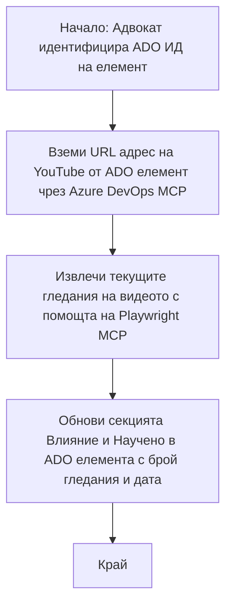

# Казус: Актуализиране на елементи в Azure DevOps с данни от YouTube чрез MCP

> **Отказ от отговорност:** Съществуват онлайн инструменти и отчети, които могат да автоматизират процеса на актуализиране на елементи в Azure DevOps с данни от платформи като YouTube. Следващият сценарий е предоставен единствено като пример за илюстриране как могат да се използват инструментите на MCP за автоматизация и интеграционни задачи.

## Преглед

Този казус демонстрира един пример за това как Model Context Protocol (MCP) и неговите инструменти могат да се използват за автоматизиране на процеса на актуализиране на работни елементи в Azure DevOps (ADO) с информация, получена от онлайн платформи, като YouTube. Описаният сценарий е само една илюстрация на по-широките възможности на тези инструменти, които могат да бъдат адаптирани за много подобни нужди от автоматизация.

В този пример, адвокат следи онлайн сесии чрез ADO елементи, като всеки елемент включва URL адрес на видео в YouTube. Използвайки инструментите на MCP, адвокатът може да поддържа ADO елементите актуални с най-новите метрики за видеото, като брой гледания, по повторяем и автоматизиран начин. Този подход може да се обобщи и за други случаи, при които информация от онлайн източници трябва да се интегрира в ADO или други системи.

## Сценарий

Адвокатът отговаря за проследяване на въздействието от онлайн сесии и общностни ангажименти. Всяка сесия се записва като работен елемент в ADO в проекта 'DevRel', като работният елемент съдържа поле за URL адреса на видео в YouTube. За да докладва точно обхвата на сесията, адвокатът трябва да актуализира ADO елемента с текущия брой гледания на видеото и датата, на която тази информация е била извлечена.

## Използвани инструменти

- [Azure DevOps MCP](https://github.com/microsoft/azure-devops-mcp): Позволява програматичен достъп и актуализации на работни елементи в ADO чрез MCP.
- [Playwright MCP](https://github.com/microsoft/playwright-mcp): Автоматизира действия в браузър за извличане на актуални данни от уеб страници, като статистики за видеа в YouTube.

## Стъпка по стъпка работен процес

1. **Идентифициране на ADO елемента**: Започнете с ID на работния елемент в ADO (например 1234) в проекта 'DevRel'.
2. **Извличане на URL адреса на YouTube**: Използвайте инструмента Azure DevOps MCP, за да получите URL адреса на видеото в YouTube от работния елемент.
3. **Извличане на брой гледания**: Използвайте инструмента Playwright MCP, за да отидете на URL адреса в YouTube и да извлечете текущия брой гледания.
4. **Актуализиране на ADO елемента**: Запишете най-новия брой гледания и датата на извличане в секцията 'Impact and Learnings' на работния елемент в ADO, използвайки инструмента Azure DevOps MCP.

## Примерен подканващ текст

```bash
- Work with the ADO Item ID: 1234
- The project is '2025-Awesome'
- Get the YouTube URL for the ADO item
- Use Playwright to get the current views from the YouTube video
- Update the ADO item with the current video views and the updated date of the information
```

## Mermaid Flowchart


## Техническа реализация

- **MCP оркестрация**: Работният процес се управлява от MCP сървър, който координира използването както на Azure DevOps MCP, така и на Playwright MCP инструментите.
- **Автоматизация**: Процесът може да се задейства ръчно или да се планира да се изпълнява на редовни интервали, за да поддържа ADO елементите актуални.
- **Разширяемост**: Същият модел може да бъде разширен за актуализиране на ADO елементи с други онлайн метрики (например харесвания, коментари) или от други платформи.

## Резултати и влияние

- **Ефективност**: Намалява ръчния труд за адвокатите чрез автоматизирано извличане и актуализиране на метрики за видеата.
- **Точност**: Гарантира, че ADO елементите отразяват най-актуалните налични данни от онлайн източници.
- **Повторяемост**: Осигурява многократна използваемост на работния процес за подобни сценарии, включващи други източници на данни или метрики.

## Референции

- [Azure DevOps MCP](https://github.com/microsoft/azure-devops-mcp)
- [Playwright MCP](https://github.com/microsoft/playwright-mcp)
- [Model Context Protocol (MCP)](https://modelcontextprotocol.io/)

## Какво следва

- Обратно към: [Обзор на казуси](./README.md)
- Напред: [Извличане на документация в реално време с MCP](./docs-mcp/README.md)

---

<!-- CO-OP TRANSLATOR DISCLAIMER START -->
**Отказ от отговорност**:
Този документ е преведен с помощта на AI преводаческа услуга [Co-op Translator](https://github.com/Azure/co-op-translator). Въпреки че се стремим към точност, моля, имайте предвид, че автоматизираните преводи може да съдържат грешки или неточности. Оригиналният документ на неговия роден език трябва да се счита за авторитетен източник. За критична информация се препоръчва професионален човешки превод. Ние не носим отговорност за никакви недоразумения или неправилни тълкувания, произтичащи от използването на този превод.
<!-- CO-OP TRANSLATOR DISCLAIMER END -->