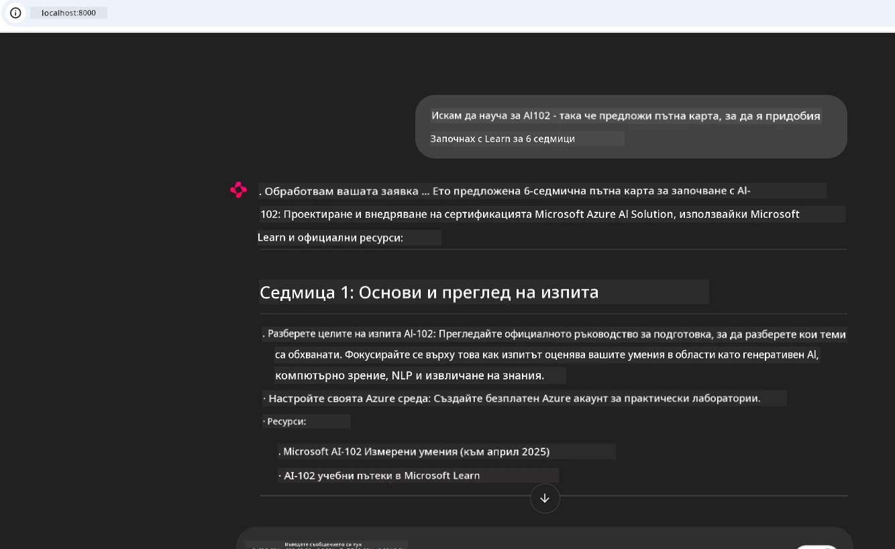
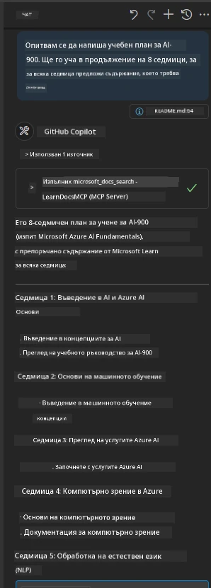

# Казус: Свързване към Microsoft Learn Docs MCP сървъра от клиент

Случвало ли ви се е да се опитвате да се ориентирате между сайтове с документация, Stack Overflow и безкрайни табове на търсачки, докато се опитвате да решите проблем в кода си? Може би държите втори монитор само за документация или постоянно превключвате между IDE-то и браузъра. Не би ли било по-добре, ако можехте да интегрирате документацията директно във вашия работен процес — в приложенията си, IDE-то или дори собствените си персонализирани инструменти? В този казус ще разгледаме как да направите точно това, като се свържете директно към Microsoft Learn Docs MCP сървъра от вашето клиентско приложение.

## Преглед

Модерната разработка не е само писане на код — тя е намиране на точната информация в точния момент. Документацията е навсякъде, но рядко там, където ви е най-нужно: вътре във вашите инструменти и работни процеси. Чрез интегриране на извличане на документация директно в приложенията си, можете да спестите време, да намалите смяната на контекста и да повишите продуктивността. В този раздел ще ви покажем как да свържете клиент към Microsoft Learn Docs MCP сървъра, за да имате достъп до документация в реално време, осъзната за контекста, без да напускате приложението си.

Ще преминем през процеса на установяване на връзка, изпращане на заявка и ефективно обработване на потокови отговори. Този подход не само оптимизира работния ви процес, но и отваря вратата към създаване на по-интелигентни и полезни инструменти за разработчици.

## Учебни цели

Защо правим това? Защото най-добрият опит за разработчика е този, който премахва пречките. Представете си свят, в който вашият редактор на код, чатбот или уеб приложение може да отговаря на въпросите ви за документацията мигновено, използвайки най-актуалното съдържание от Microsoft Learn. В края на тази глава ще знаете как да:

- Разбирате основите на комуникацията сървър-клиент MCP за документация
- Имплементирате конзолно или уеб приложение за свързване към Microsoft Learn Docs MCP сървъра
- Използвате потокови HTTP клиенти за изтегляне на документация в реално време
- Записвате и интерпретирате отговорите за документация в приложението си

Ще видите как тези умения могат да ви помогнат да създавате инструменти, които не са просто реактивни, а наистина интерактивни и осъзнати за контекста.

## Сценарий 1 - Изтегляне на документация в реално време с MCP

В този сценарий ще ви покажем как да свържете клиент към Microsoft Learn Docs MCP сървъра, за да имате достъп до документация в реално време, осъзната за контекста, без да напускате приложението си.

Нека го приложим на практика. Вашата задача е да напишете приложение, което се свързва с Microsoft Learn Docs MCP сървъра, извиква инструмента `microsoft_docs_search` и записва потоковия отговор в конзолата.

### Защо този подход?
Защото той е основата за създаване на по-усъвършенствани интеграции — независимо дали искате да захранвате чатбот, разширение за IDE или уеб табло за управление.

Ще намерите кода и инструкциите за този сценарий във папката [`solution`](./solution/README.md) в рамките на този казус. Стъпките ще ви водят през настройването на връзката:
- Използвайте официалния MCP SDK и потоков HTTP клиент за връзка
- Извикайте инструмента `microsoft_docs_search` с параметър за заявка, за да получите документация
- Имплементирайте правилно логване и обработка на грешки
- Създайте интерактивен конзолен интерфейс, позволяващ на потребителите да въвеждат множество заявки за търсене

Този сценарий демонстрира как да:
- Свържете се към Docs MCP сървъра
- Изпратите заявка
- Парсирате и отпечатате резултатите

Ето как може да изглежда изпълнението на решението:

```
Prompt> What is Azure Key Vault?
Answer> Azure Key Vault is a cloud service for securely storing and accessing secrets. ...
```

По-долу е минимален пример за решение. Целият код и подробности са налични в папката за решения.

<details>
<summary>Python</summary>

```python
import asyncio
from mcp.client.streamable_http import streamablehttp_client
from mcp import ClientSession

async def main():
    async with streamablehttp_client("https://learn.microsoft.com/api/mcp") as (read_stream, write_stream, _):
        async with ClientSession(read_stream, write_stream) as session:
            await session.initialize()
            result = await session.call_tool("microsoft_docs_search", {"query": "Azure Functions best practices"})
            print(result.content)

if __name__ == "__main__":
    asyncio.run(main())
```

- За пълна имплементация и логване вижте [`scenario1.py`](../../../../09-CaseStudy/docs-mcp/solution/python/scenario1.py).
- За инструкции по инсталиране и употреба, вижте файла [`README.md`](./solution/python/README.md) в същата папка.
</details>


## Сценарий 2 - Интерактивно уеб приложение за генератор на учебен план с MCP

В този сценарий ще се научите как да интегрирате Docs MCP в уеб разработващ проект. Целта е да позволите на потребителите да търсят в документацията на Microsoft Learn директно от уеб интерфейс, правейки документацията незабавно достъпна във вашето приложение или сайт.

Ще видите как да:
- Настроите уеб приложение
- Свържете се към Docs MCP сървъра
- Обработвате потребителски вход и показвате резултати

Ето как би изглеждало изпълнението на решението:

```
User> I want to learn about AI102 - so suggest the roadmap to get it started from learn for 6 weeks

Assistant> Here’s a detailed 6-week roadmap to start your preparation for the AI-102: Designing and Implementing a Microsoft Azure AI Solution certification, using official Microsoft resources and focusing on exam skills areas:

---
## Week 1: Introduction & Fundamentals
- **Understand the Exam**: Review the [AI-102 exam skills outline](https://learn.microsoft.com/en-us/credentials/certifications/exams/ai-102/).
- **Set up Azure**: Sign up for a free Azure account if you don't have one.
- **Learning Path**: [Introduction to Azure AI services](https://learn.microsoft.com/en-us/training/modules/intro-to-azure-ai/)
- **Focus**: Get familiar with Azure portal, AI capabilities, and necessary tools.

....more weeks of the roadmap...

Let me know if you want module-specific recommendations or need more customized weekly tasks!
```

По-долу е минимален пример за решение. Целият код и подробности са налични в папката за решения.



<details>
<summary>Python (Chainlit)</summary>

Chainlit е рамка за създаване на разговорни AI уеб приложения. Тя улеснява създаването на интерактивни чатботове и асистенти, които могат да извикват MCP инструменти и да показват резултати в реално време. Идеална е за бързи прототипи и потребителски приятелски интерфейси.

```python
import chainlit as cl
import requests

MCP_URL = "https://learn.microsoft.com/api/mcp"

@cl.on_message
def handle_message(message):
    query = {"question": message}
    response = requests.post(MCP_URL, json=query)
    if response.ok:
        result = response.json()
        cl.Message(content=result.get("answer", "No answer found.")).send()
    else:
        cl.Message(content="Error: " + response.text).send()
```

- За пълна имплементация вижте [`scenario2.py`](../../../../09-CaseStudy/docs-mcp/solution/python/scenario2.py).
- За инструкции за настройка и изпълнение, вижте [`README.md`](./solution/python/README.md).
</details>


## Сценарий 3: Документация в редактора с MCP сървъра във VS Code

Ако искате да получите Microsoft Learn Docs директно във VS Code (без да превключвате табове на браузъра), можете да използвате MCP сървъра в редактора си. Това ви позволява да:
- Търсите и четете документация в VS Code без да напускате средата за писане на код.
- Реферирате документация и вмъквате линкове директно в README или учебни файлове.
- Използвате GitHub Copilot и MCP заедно за безпроблемен работен процес с документация, поддържан от AI.

**Ще видите как да:**
- Добавите валиден `.vscode/mcp.json` файл в корена на вашето работно пространство (вижте примера по-долу).
- Отворите панела MCP или използвате командната палитра във VS Code за търсене и вмъкване на документация.
- Реферирате документация директно във вашите markdown файлове докато работите.
- Комбинирате този работен процес с GitHub Copilot за още по-голяма продуктивност.

Ето един пример как да настроите MCP сървъра във VS Code:

```json
{
  "servers": {
    "LearnDocsMCP": {
      "url": "https://learn.microsoft.com/api/mcp"
    }
  }
}
```

</details>

> За подробен преглед с екранни снимки и стъпка по стъпка ръководство вижте [`README.md`](./solution/scenario3/README.md).



Този подход е идеален за всеки, който създава технически курсове, пише документация или разработва код с чести нужди от справки.

## Основни изводи

Интегрирането на документацията директно във вашите инструменти не е просто удобство — това е промяна в играта за продуктивността. Като се свържете към Microsoft Learn Docs MCP сървъра от вашия клиент, можете да:

- Премахнете смяната на контекст между кода и документацията
- Получавате актуална, осъзната за контекста документация в реално време
- Създавате по-интелигентни, по-интерактивни инструменти за разработчици

Тези умения ще ви помогнат да създавате решения, които са не само ефективни, но и удоволствие за ползване.

## Допълнителни ресурси

За да задълбочите разбирането си, разгледайте тези официални ресурси:

- [Microsoft Learn Docs MCP Server (GitHub)](https://github.com/MicrosoftDocs/mcp)
- [Започнете работа с Azure MCP Server (mcp-python)](https://learn.microsoft.com/en-us/azure/developer/azure-mcp-server/get-started#create-the-python-app)
- [Какво е Azure MCP Server?](https://learn.microsoft.com/en-us/azure/developer/azure-mcp-server/)
- [Въведение в Model Context Protocol (MCP)](https://modelcontextprotocol.io/introduction)
- [Добавяне на плъгини от MCP Server (Python)](https://learn.microsoft.com/en-us/semantic-kernel/concepts/plugins/adding-mcp-plugins)

## Какво следва

- Назад към: [Преглед на казуси](../README.md)
- Продължете към: [Модул 10: Оптимизиране на AI работни процеси с AI Toolkit](../../10-StreamliningAIWorkflowsBuildingAnMCPServerWithAIToolkit/README.md)

---

<!-- CO-OP TRANSLATOR DISCLAIMER START -->
**Отказ от отговорност**:
Този документ е преведен с помощта на AI преводаческа услуга [Co-op Translator](https://github.com/Azure/co-op-translator). Въпреки че се стремим към точност, моля, имайте предвид, че автоматизираните преводи могат да съдържат грешки или неточности. Оригиналният документ на неговия естествен език трябва да се счита за авторитетен източник. За критична информация се препоръчва професионален човешки превод. Не носим отговорност за каквито и да е недоразумения или неправилни тълкувания, възникнали в резултат на използването на този превод.
<!-- CO-OP TRANSLATOR DISCLAIMER END -->