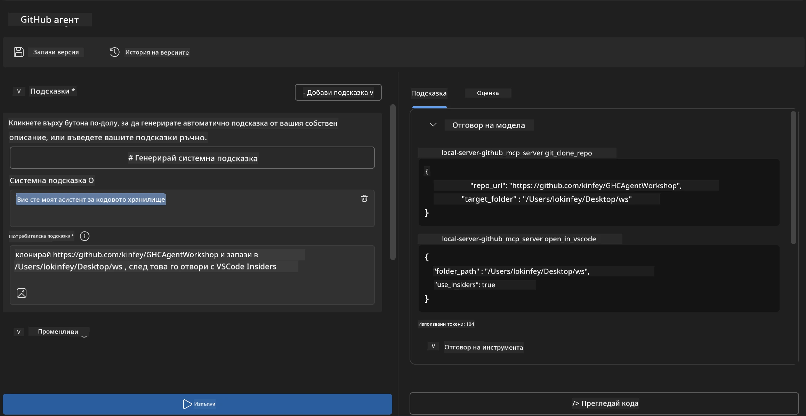
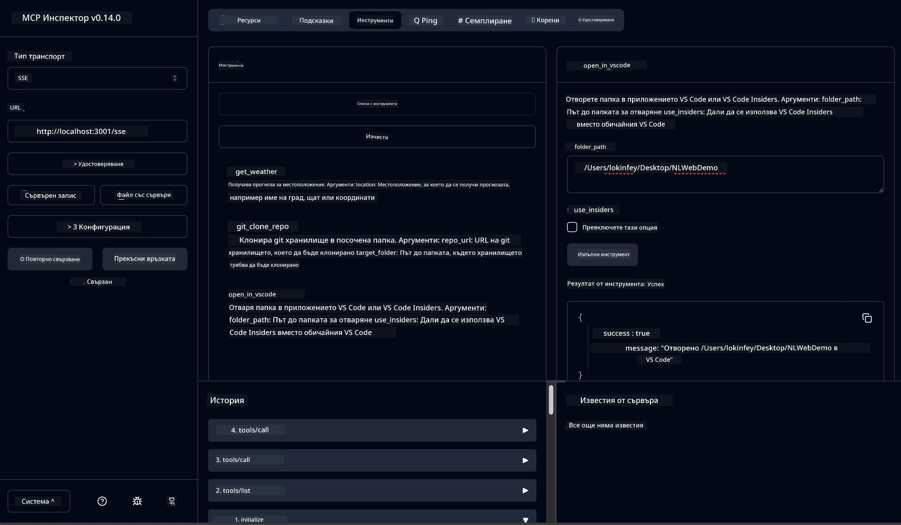

# 🐙 Модул 4: Практическо разработване на MCP - Персонален сървър за клониране на GitHub


> **⚡ Бърз старт:** Създайте MCP сървър готов за производство, който автоматизира клонирането на GitHub хранилища и интеграцията с VS Code само за 30 минути!

## 🎯 Учебни цели

Към края на тази лаборатория ще можете да:

- ✅ Създавате персонален MCP сървър за реални разработки
- ✅ Имплементирате функционалност за клониране на GitHub хранилища чрез MCP
- ✅ Интегрирате персонални MCP сървъри с VS Code и Agent Builder
- ✅ Използвате GitHub Copilot Agent Mode с персонални MCP инструменти
- ✅ Тествате и разгърнете персонални MCP сървъри в производствени среди

## 📋 Предварителни изисквания

- Завършени лаборатории 1-3 (Основи на MCP и напреднала разработка)
- Абонамент за GitHub Copilot ([налично безплатно записване](https://github.com/github-copilot/signup))
- VS Code с AI Toolkit и разширения за GitHub Copilot
- Инсталиран и конфигуриран Git CLI

## 🏗️ Преглед на проекта

### **Реално предизвикателство в разработката**
Като разработчици често използваме GitHub за клониране на хранилища и отварянето им във VS Code или VS Code Insiders. Този ръчен процес включва:
1. Отваряне на терминал/команден ред
2. Навигация до желания каталог
3. Изпълнение на командата `git clone`
4. Отваряне на VS Code в клонирания каталог

**Нашето MCP решение обединява това в една интелигентна команда!**

### **Какво ще създадете**
**GitHub Clone MCP Server** (`git_mcp_server`), който предоставя:

| Функция | Описание | Предимство |
|---------|-------------|---------|
| 🔄 **Интелигентно клониране на хранилища** | Клониране на GitHub хранилища с валидация | Автоматична проверка за грешки |
| 📁 **Интелигентно управление на директории** | Проверка и безопасно създаване на директории | Предотвратява презаписване |
| 🚀 **Кросплатформена интеграция с VS Code** | Отваряне на проекти във VS Code/Insiders | Безпроблемен преход в работния процес |
| 🛡️ **Здрава обработка на грешки** | Обработка на мрежови, разрешителни и пътни проблеми | Надеждност за производство |

---

## 📖 Стъпка по стъпка реализация

### Стъпка 1: Създайте GitHub агент в Agent Builder

1. **Стартирайте Agent Builder** през AI Toolkit разширението
2. **Създайте нов агент** с следната конфигурация:
   ```
   Agent Name: GitHubAgent
   ```

3. **Инициализирайте персонален MCP сървър:**
   - Отворете **Инструменти** → **Добави инструмент** → **MCP сървър**
   - Изберете **"Създай нов MCP сървър"**
   - Изберете шаблон **Python** за максимална гъвкавост
   - **Име на сървъра:** `git_mcp_server`

### Стъпка 2: Конфигурирайте GitHub Copilot Agent Mode

1. **Отворете GitHub Copilot** в VS Code (Ctrl/Cmd + Shift + P → "GitHub Copilot: Отвори")
2. **Изберете модел на агента** в интерфейса на Copilot
3. **Изберете модел Claude 3.7** за подобрени способности за разсъждение
4. **Активирайте MCP интеграция** за достъп до инструменти

> **💡 Съвет:** Claude 3.7 предлага по-добро разбиране на работни процеси в разработката и модели за обработка на грешки.

### Стъпка 3: Имплементирайте основната функционалност на MCP сървъра

**Използвайте следното подробното задание с GitHub Copilot Agent Mode:**

```
Create two MCP tools with the following comprehensive requirements:

🔧 TOOL A: clone_repository
Requirements:
- Clone any GitHub repository to a specified local folder
- Return the absolute path of the successfully cloned project
- Implement comprehensive validation:
  ✓ Check if target directory already exists (return error if exists)
  ✓ Validate GitHub URL format (https://github.com/user/repo)
  ✓ Verify git command availability (prompt installation if missing)
  ✓ Handle network connectivity issues
  ✓ Provide clear error messages for all failure scenarios

🚀 TOOL B: open_in_vscode
Requirements:
- Open specified folder in VS Code or VS Code Insiders
- Cross-platform compatibility (Windows/Linux/macOS)
- Use direct application launch (not terminal commands)
- Auto-detect available VS Code installations
- Handle cases where VS Code is not installed
- Provide user-friendly error messages

Additional Requirements:
- Follow MCP 1.9.3 best practices
- Include proper type hints and documentation
- Implement logging for debugging purposes
- Add input validation for all parameters
- Include comprehensive error handling
```

### Стъпка 4: Тествайте вашия MCP сървър

#### 4а. Тест в Agent Builder

1. **Стартирайте конфигурацията за отстраняване на грешки** в Agent Builder
2. **Конфигурирайте вашия агент със следното системно задание:**

```
SYSTEM_PROMPT:
You are my intelligent coding repository assistant. You help developers efficiently clone GitHub repositories and set up their development environment. Always provide clear feedback about operations and handle errors gracefully.
```

3. **Тествайте с реалистични потребителски сценарии:**

```
USER_PROMPT EXAMPLES:

Scenario : Basic Clone and Open
"Clone {Your GitHub Repo link such as https://github.com/kinfey/GHCAgentWorkshop
 } and save to {The global path you specify}, then open it with VS Code Insiders"
```



**Очаквани резултати:**
- ✅ Успешно клониране с потвърждение за пътя
- ✅ Автоматично стартиране на VS Code
- ✅ Ясни съобщения за грешки при невалидни сценарии
- ✅ Коректна обработка на крайни случаи

#### 4б. Тест в MCP Inspector




---


**🎉 Поздравления!** Вие успешно създадохте практичен, производствен MCP сървър, който решава реални предизвикателства в процесите на разработка. Вашият персонален сървър за клониране на GitHub демонстрира силата на MCP за автоматизация и повишаване на ефективността на разработчиците.

### 🏆 Постигнати успехи:
- ✅ **MCP разработчик** - Създаде персонален MCP сървър
- ✅ **Автоматизатор на процеси** - Оптимизира разработващите потоци  
- ✅ **Експерт по интеграция** - Свърза множество инструменти за разработка
- ✅ **Готов за производство** - Изгради разгръщаеми решения

---

## 🎓 Завършване на работилницата: Вашето пътешествие с Model Context Protocol

**Уважаеми участник,**

Поздравления за завършването на всички четири модула от работилницата за Model Context Protocol! Изминахте дълъг път от разбирането на основите на AI Toolkit до създаването на MCP сървъри готови за производство, които решават реални предизвикателства в разработката.

### 🚀 Резюме на вашия обучителен път:

**[Модул 1](../lab1/README.md)**: Започнахте с основите на AI Toolkit, тестване на модели и създаване на първия си AI агент.

**[Модул 2](../lab2/README.md)**: Научихте архитектурата на MCP, интегрирахте Playwright MCP и създадохте първия си агент за браузърна автоматизация.

**[Модул 3](../lab3/README.md)**: Навлязохте в разработката на персонални MCP сървъри с Weather MCP и овладяхте инструментите за отстраняване на грешки.

**[Модул 4](../lab4/README.md)**: Сега приложихте всичко, за да създадете практичен инструмент за автоматизация на GitHub работния процес.

### 🌟 Какво овладяхте:

- ✅ **Екосистема AI Toolkit**: Модели, агенти и модели на интеграция
- ✅ **Архитектура MCP**: Клиент-сървър дизайн, транспортни протоколи и сигурност
- ✅ **Инструменти за разработчици**: От Playground през Inspector до разгръщане в производство
- ✅ **Персонална разработка**: Създаване, тестване и внедряване на собствени MCP сървъри
- ✅ **Практически приложения**: Решаване на реални предизвикателства в работните процеси с помощта на AI

### 🔮 Следващи стъпки:

1. **Създайте свой собствен MCP сървър**: Приложете тези умения за автоматизация на вашите уникални работни потоци
2. **Присъединете се към MCP общността**: Споделяйте своите проекти и учете от другите
3. **Изследвайте напреднала интеграция**: Свържете MCP сървъри с корпоративни системи
4. **Принос към Open Source**: Помогнете за подобряване на MCP инструментите и документацията

Помнете, тази работилница е само началото. Екосистемата на Model Context Protocol се развива бързо, а вие вече сте подготвени да сте на предната линия на AI-захранваните инструменти за разработка.

**Благодарим ви за участието и отдадеността към ученето!**

Надяваме се тази работилница да е вдъхновила идеи, които ще трансформират начина, по който изграждате и взаимодействате с AI инструменти в своето разработващо пътешествие.

**Приятно кодиране!**

---

## Какво следва

Поздравления за завършването на всички лаборатории в Модул 10!

- Назад към: [Преглед на Модул 10](../README.md)
- Продължете към: [Модул 11: Практически лаборатории с MCP сървър](../../11-MCPServerHandsOnLabs/README.md)

---

<!-- CO-OP TRANSLATOR DISCLAIMER START -->
**Отказ от отговорност**:  
Този документ е преведен с помощта на AI преводаческа услуга [Co-op Translator](https://github.com/Azure/co-op-translator). Въпреки че се стремим към точност, моля, имайте предвид, че автоматизираните преводи може да съдържат грешки или неточности. Оригиналният документ на неговия изходен език трябва да се счита за авторитетен източник. За критична информация се препоръчва професионален човешки превод. Ние не носим отговорност за никакви недоразумения или грешни тълкувания, произтичащи от използването на този превод.
<!-- CO-OP TRANSLATOR DISCLAIMER END -->