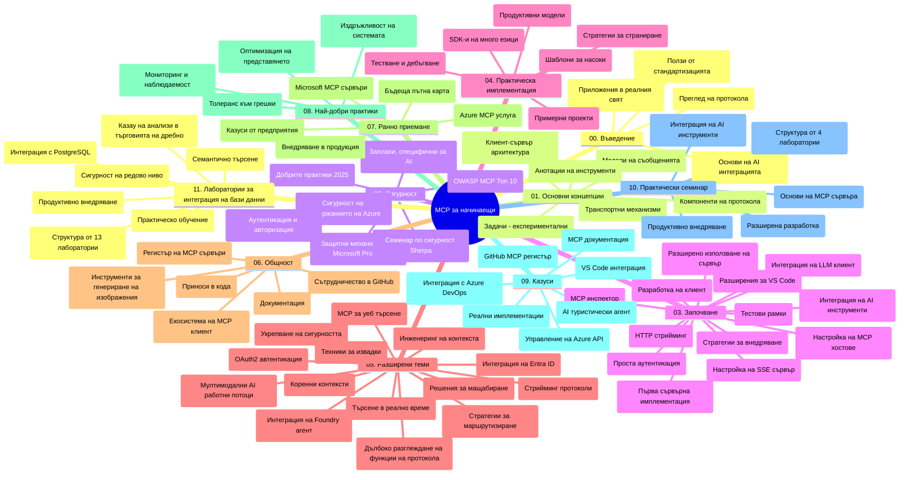

# Model Context Protocol (MCP) за начинаещи - Учебно ръководство

Това учебно ръководство предоставя преглед на структурата на хранилището и съдържанието за учебната програма "Model Context Protocol (MCP) за начинаещи". Използвайте това ръководство, за да навигирате ефективно в хранилището и да извлечете максимума от наличните ресурси.

## Преглед на хранилището

Model Context Protocol (MCP) е стандартизиран фреймуърк за взаимодействия между AI модели и клиентски приложения. Първоначално създаден от Anthropic, MCP сега се поддържа от по-широката общност на MCP чрез официалната организация в GitHub. Това хранилище предоставя изчерпателна учебна програма с практически примери за код на C#, Java, JavaScript, Python и TypeScript, предназначена за AI разработчици, системни архитекти и софтуерни инженери.

## Визуална карта на учебната програма

## Структура на хранилището

Хранилището е организирано в единадесет основни секции, като всяка се фокусира върху различни аспекти на MCP:

1. **Въведение (00-Introduction/)**
   - Преглед на Model Context Protocol
   - Защо стандартизацията е важна в AI процесите
   - Практически случаи и ползи

2. **Основни понятия (01-CoreConcepts/)**
   - Клиент-сървър архитектура
   - Основни компоненти на протокола
   - Шаблони за съобщения в MCP

3. **Сигурност (02-Security/)**
   - Заплахи за сигурността в системи, базирани на MCP
   - Най-добри практики за обезпечаване на реализации
   - Стратегии за удостоверяване и авторизация
   - **Изчерпателна документация за сигурност**:
     - MCP Security Best Practices 2025
     - Azure Content Safety Implementation Guide
     - MCP Security Controls and Techniques
     - MCP Best Practices Quick Reference
   - **Основни теми за сигурността**:
     - Атаки с инжектиране на подканващи съобщения и отравяне на инструменти
     - Отвличане на сесии и проблеми с объркан заместник
     - Уязвимости при предаване на токени
     - Прекомерни разрешения и контрол на достъпа
     - Сигурност в доставната верига за AI компоненти
     - Интеграция с Microsoft Prompt Shields

4. **Първи стъпки (03-GettingStarted/)**
   - Настройка и конфигурация на средата
   - Създаване на базови MCP сървъри и клиенти
   - Интеграция с вече съществуващи приложения
   - Включва секции за:
     - Първа имплементация на сървър
     - Разработка на клиент
     - Интеграция с LLM клиент
     - Интеграция във VS Code
     - Server-Sent Events (SSE) сървър
     - Разширено използване на сървър
     - HTTP стриминг
     - Интеграция с AI Toolkit
     - Стратегии за тестване
     - Насоки за разгръщане

5. **Практическа реализация (04-PracticalImplementation/)**
   - Използване на SDK-та за различни програмни езици
   - Отстраняване на грешки, тестване и валидация
   - Създаване на многократно използваеми шаблони за подканващи съобщения и работни потоци
   - Примерни проекти с примери за реализация

6. **Разширени теми (05-AdvancedTopics/)**
   - Техники за инженеринг на контекста
   - Интеграция с Foundry агент
   - Мултимодални AI работни потоци
   - Демонстрации на OAuth2 удостоверяване
   - Възможности за търсене в реално време
   - Стрийминг в реално време
   - Имплементации на Root контексти
   - Маршрутизиране
   - Самплинг техники
   - Подходи за мащабиране
   - Сигурност
   - Интеграция на Entra ID за сигурност
   - Интеграция на уеб търсене

7. **Приноси от общността (06-CommunityContributions/)**
   - Как да допринасяте с код и документация
   - Сътрудничество чрез GitHub
   - Общностно базирани подобрения и обратна връзка
   - Използване на различни MCP клиенти (Claude Desktop, Cline, VSCode)
   - Работа с популярни MCP сървъри, включително генериране на изображения

8. **Уроци от ранно внедряване (07-LessonsfromEarlyAdoption/)**
   - Реални реализации и истории за успех
   - Създаване и разгръщане на решения, базирани на MCP
   - Тенденции и бъдеща пътна карта
   - **Ръководство за Microsoft MCP сървъри**: Изчерпателно ръководство за 10 готови за продукция Microsoft MCP сървъра, включително:
     - Microsoft Learn Docs MCP сървър
     - Azure MCP сървър (над 15 специализирани конектора)
     - GitHub MCP сървър
     - Azure DevOps MCP сървър
     - MarkItDown MCP сървър
     - SQL Server MCP сървър
     - Playwright MCP сървър
     - Dev Box MCP сървър
     - Azure AI Foundry MCP сървър
     - Microsoft 365 Agents Toolkit MCP сървър

9. **Най-добри практики (08-BestPractices/)**
   - Оптимизация и настройка на производителността
   - Проектиране на устойчиви на грешки MCP системи
   - Стратегии за тестване и устойчивост

10. **Казуси (09-CaseStudy/)**
    - **Седем изчерпателни казуса**, демонстриращи гъвкавостта на MCP в различни сценарии:
    - **Azure AI Travel Agents**: Мултиагентска оркестрация с Azure OpenAI и AI Search
    - **Интеграция с Azure DevOps**: Автоматизиране на работни потоци с ъпдейти на данни от YouTube
    - **Извличане на документация в реално време**: Python конзолен клиент с HTTP стрийминг
    - **Интерактивен генератор на учебен план**: Chainlit уеб приложение с разговорен AI
    - **Документация в редактор**: Интеграция във VS Code с работни потоци на GitHub Copilot
    - **Azure API Management**: Интеграция на корпоративни API с MCP сървър
    - **GitHub MCP регистър**: Платформа за развитие на екосистема и агентна интеграция
    - Примерни реализации покриващи корпоративна интеграция, продуктивност на разработчиците и развитие на екосистемата

11. **Практически уъркшоп (10-StreamliningAIWorkflowsBuildingAnMCPServerWithAIToolkit/)**
    - Обширен практически уъркшоп, съчетаващ MCP с AI Toolkit
    - Създаване на интелигентни приложения, свързващи AI модели с реални инструменти
    - Практически модули, обхващащи основите, разработка на персонализиран сървър и стратегии за производство
    - **Структура на лабораториите**:
      - Лаборатория 1: Основи на MCP сървър
      - Лаборатория 2: Разширена разработка на MCP сървър
      - Лаборатория 3: Интеграция с AI Toolkit
      - Лаборатория 4: Производствено разгръщане и мащабиране
    - Лабораторно базиран подход с инструкции стъпка по стъпка

12. **Лаборатории за интеграция на MCP сървър с база данни (11-MCPServerHandsOnLabs/)**
    - **Изчерпателен учебен път с 13 лаборатории** за изграждане на готови за производство MCP сървъри с интеграция на PostgreSQL
    - **Реалистична реализация за анализ на търговия на дребно** с използване на случая Zava Retail
    - **Корпоративни модели**, включващи Row Level Security (RLS), семантично търсене и мултите-нен достъп до данни
    - **Пълна структура на лабораториите**:
      - **Лаборатории 00-03: Основи** - Въведение, архитектура, сигурност, настройка на средата
      - **Лаборатории 04-06: Създаване на MCP сървър** - Проектиране на база данни, имплементация на MCP сървър, разработка на инструменти
      - **Лаборатории 07-09: Разширени функции** - Семантично търсене, тестване и отстраняване на грешки, интеграция във VS Code
      - **Лаборатории 10-12: Производство и най-добри практики** - Разгръщане, мониторинг, оптимизация
    - **Технологии, обхванати в курса**: FastMCP framework, PostgreSQL, Azure OpenAI, Azure Container Apps, Application Insights
    - **Изходни резултати от обучението**: Готови за продукция MCP сървъри, модели за интеграция с база данни, AI-задвижвана аналитика, корпоративна сигурност

## Допълнителни ресурси

Хранилището включва помощни ресурси:

- **Папка с изображения**: Съдържа диаграми и илюстрации, използвани в учебната програма
- **Преводи**: Многоезична поддръжка с автоматизирани преводи на документацията
- **Официални ресурси на MCP**:
  - [MCP Documentation](https://modelcontextprotocol.io/)
  - [MCP Specification](https://spec.modelcontextprotocol.io/)
  - [MCP GitHub Repository](https://github.com/modelcontextprotocol)

## Как да използвате това хранилище

1. **Последователно обучение**: Следвайте главите в ред (от 00 до 11) за структурирано обучение.
2. **Езиков фокус**: Ако сте заинтересовани от конкретен програмен език, разгледайте директориите със спомагателни примери за избрания от вас език.
3. **Практическа реализация**: Започнете със секцията "Първи стъпки" за настройка на средата и създаване на първия MCP сървър и клиент.
4. **Разширено изследване**: След като усвоите основите, преминете към разширените теми, за да разширите знанията си.
5. **Участие в общността**: Присъединете се към MCP общността чрез GitHub дискусии и Discord канали, за да се свържете с експерти и други разработчици.

## MCP клиенти и инструменти

Учебната програма обхваща различни MCP клиенти и инструменти:

1. **Официални клиенти**:
   - Visual Studio Code
   - MCP в Visual Studio Code
   - Claude Desktop
   - Claude във VSCode
   - Claude API

2. **Общностни клиенти**:
   - Cline (терминален клиент)
   - Cursor (редактор на код)
   - ChatMCP
   - Windsurf

3. **Инструменти за управление на MCP**:
   - MCP CLI
   - MCP Manager
   - MCP Linker
   - MCP Router

## Популярни MCP сървъри

Хранилището представя различни MCP сървъри, включително:

1. **Официални Microsoft MCP сървъри**:
   - Microsoft Learn Docs MCP сървър
   - Azure MCP сървър (над 15 специализирани конектора)
   - GitHub MCP сървър
   - Azure DevOps MCP сървър
   - MarkItDown MCP сървър
   - SQL Server MCP сървър
   - Playwright MCP сървър
   - Dev Box MCP сървър
   - Azure AI Foundry MCP сървър
   - Microsoft 365 Agents Toolkit MCP сървър

2. **Официални референтни сървъри**:
   - Файлова система
   - Fetch
   - Памет
   - Последователно мислене

3. **Генериране на изображения**:
   - Azure OpenAI DALL-E 3
   - Stable Diffusion WebUI
   - Replicate

4. **Инструменти за разработка**:
   - Git MCP
   - Terminal Control
   - Code Assistant

5. **Специализирани сървъри**:
   - Salesforce
   - Microsoft Teams
   - Jira & Confluence

## Приноси

Това хранилище приветства приноси от общността. Вижте секцията "Приноси от общността" за насоки как ефективно да допринасяте за екосистемата на MCP.

----

*Това учебно ръководство е последно обновено на 5 февруари 2026 г., отразявайки най-новата MCP спецификация от 25 ноември 2025 г. и предоставя преглед на хранилището към тази дата. Съдържанието на хранилището може да бъде обновявано след тази дата.*

---

<!-- CO-OP TRANSLATOR DISCLAIMER START -->
**Отказ от отговорност**:  
Този документ е преведен с помощта на AI услуга за превод [Co-op Translator](https://github.com/Azure/co-op-translator). Въпреки че се стремим към точност, моля имайте предвид, че автоматичните преводи могат да съдържат грешки или неточности. Оригиналният документ на съответния език трябва да се счита за авторитетен източник. За критична информация се препоръчва професионален човешки превод. Не носим отговорност за каквито и да е недоразумения или неправилни тълкувания, произтичащи от използването на този превод.
<!-- CO-OP TRANSLATOR DISCLAIMER END -->