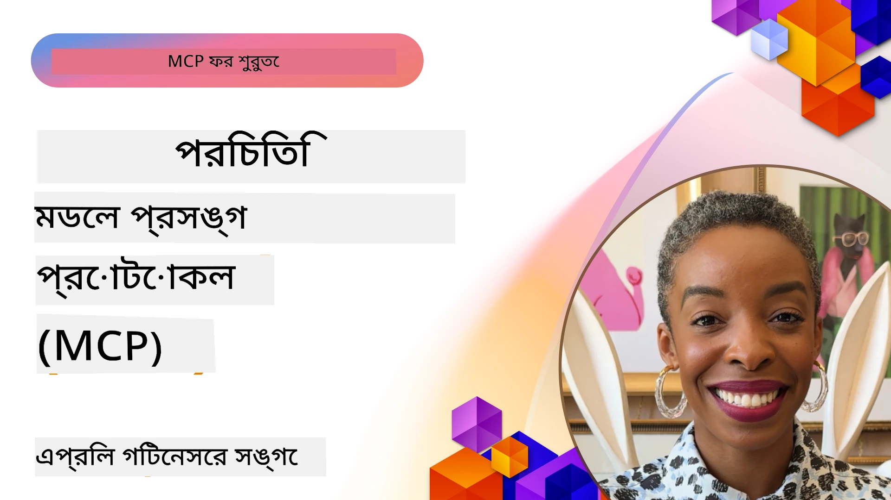
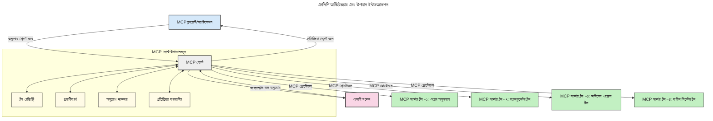

# মডেল কনটেক্সট প্রটোকল (MCP) পরিচিতি: স্কেলেবল AI অ্যাপ্লিকেশনের জন্য কেন এটি গুরুত্বপূর্ণ

[](https://youtu.be/agBbdiOPLQA)

_(এই পাঠের ভিডিও দেখতে উপরের ছবিটি ক্লিক করুন)_

জেনারেটিভ AI অ্যাপ্লিকেশনগুলি একটি বড় অগ্রগতি কারণ এগুলো প্রায়শই ব্যবহারকারীকে প্রাকৃতিক ভাষার প্রম্পট ব্যবহার করে অ্যাপের সাথে ইন্টারঅ্যাক্ট করার সুযোগ দেয়। তবে, আরও সময় এবং সম্পদ এই ধরনের অ্যাপে বিনিয়োগ করা হলে, আপনি নিশ্চিত করতে চান যে আপনি সহজেই কার্যকারিতা এবং সম্পদগুলো সংহত করতে পারবেন এমনভাবে যা সহজে সম্প্রসারিত হতে পারে, আপনার অ্যাপ একাধিক মডেল ব্যবহারের বৃদ্ধি সামলাতে সক্ষম হতে পারে, এবং বিভিন্ন মডেল সংক্রান্ত জটিলতা পরিচালনা করতে পারে। সংক্ষেপে, জেনারেটিভ AI অ্যাপ তৈরি শুরুতে সহজ হলেও, যেমন এগুলো বাড়ে এবং আরও জটিল হয়, আপনাকে একটি আর্কিটেকচার সংজ্ঞায়িত করতে হবে এবং সম্ভবত একটি স্ট্যান্ডার্ডের ওপর নির্ভর করতে হবে যাতে আপনার অ্যাপগুলো সামঞ্জস্যপূর্ণভাবে নির্মিত হয়। এখানে MCP কাজ করে বিষয়গুলো সংগঠিত করতে এবং একটি স্ট্যান্ডার্ড প্রদান করতে।

---

## **🔍 মডেল কনটেক্সট প্রটোকল (MCP) কী?**

**মডেল কনটেক্সট প্রটোকল (MCP)** একটি **উন্মুক্ত, মানসম্পন্ন ইন্টারফেস** যা বড় ভাষা মডেল (LLM) গুলোকে বাইরের টুল, API, এবং ডেটা সোর্সের সঙ্গে নির্বিঘ্নে ইন্টারঅ্যাক্ট করতে দেয়। এটি একটি সঙ্গতিপূর্ণ আর্কিটেকচার প্রদান করে যা AI মডেলের কার্যকারিতা তাদের প্রশিক্ষণ ডেটার বাইরে বাড়ায়, যা স্মার্টার, স্কেলেবল এবং আরও প্রতিক্রিয়াশীল AI সিস্টেমগুলি সক্ষম করে।

---

## **🎯 AI-তে স্ট্যান্ডার্ডাইজেশনের গুরুত্ব**

যেহেতু জেনারেটিভ AI অ্যাপ্লিকেশন গুলো আরও জটিল হচ্ছে, সেহেতু গুরুত্বপূর্ণ যে আপনি এমন স্ট্যান্ডার্ডগুলো গ্রহণ করেন যা **স্কেলেবিলিটি, সম্প্রসারণযোগ্যতা, রক্ষণাবেক্ষণযোগ্যতা,** এবং **ভেন্ডর লক-ইন এড়ানো** নিশ্চিত করে। MCP নিম্নলিখিত চাহিদাসমূহ পূরণ করে:

- মডেল-টুল ইন্টিগ্রেশন একীভূতকরণ
- ভঙ্গুর, এককালীন কাস্টম সমাধান হ্রাস
- বিভিন্ন ভেন্ডরের একাধিক মডেলকে এক ইকোসিস্টেমে সহঅবস্থান করার সুযোগ

**দ্রষ্টব্য:** যদিও MCP নিজেকে একটি উন্মুক্ত স্ট্যান্ডার্ড হিসেবে দাবি করে, MCP-কে IEEE, IETF, W3C, ISO বা অন্য কোনো বিদ্যমান স্ট্যান্ডার্ড বডির মাধ্যমে স্ট্যান্ডার্ডাইজ করার কোনো পরিকল্পনা নেই।

---

## **📚 শেখার লক্ষ্য**

এই নিবন্ধের শেষে আপনি সক্ষম হবেন:

- **মডেল কনটেক্সট প্রটোকল (MCP)** এবং এর ব্যবহার ক্ষেত্রগুলো সংজ্ঞায়িত করতে
- বুঝতে কিভাবে MCP মডেল থেকে টুলের যোগাযোগ স্ট্যান্ডার্ডাইজ করে
- MCP আর্কিটেকচারের মূল উপাদানগুলো সনাক্ত করতে
- এন্টারপ্রাইজ এবং ডেভেলপমেন্ট প্রেক্ষাপটে MCP এর বাস্তব-জগতের ব্যবহার অন্বেষণ করতে

---

## **💡 মডেল কনটেক্সট প্রটোকল (MCP) কেন গেম-চেঞ্জার**

### **🔗 MCP AI ইন্টারঅ্যাকশনে ফ্র্যাগমেন্টেশন দূর করে**

MCP আসার আগে, মডেল ও টুল ইন্টিগ্রেশনের জন্য প্রয়োজন ছিল:

- টুল-মডেল যুগল প্রতি কাস্টম কোড লেখা
- প্রতিটি ভেন্ডারের জন্য অ-স্ট্যান্ডার্ড API
- আপডেটের কারণে ঘন ঘন বাধা
- টুল বৃদ্ধির সাথে খারাপ স্কেলেবিলিটি

### **✅ MCP স্ট্যান্ডার্ডাইজেশনের সুবিধাসমূহ**

| **সুবিধা**                | **বর্ণনা**                                                                |
|--------------------------|--------------------------------------------------------------------------------|
| ইন্টারঅপারেবিলিটি          | LLM গুলো ভিন্ন ভেন্ডরের টুলের সঙ্গে নির্বিঘ্নে কাজ করে                       |
| সামঞ্জস্য                  | প্ল্যাটফর্ম এবং টুলে অভিন্ন আচরণ বজায় রাখে                               |
| পুনঃব্যবহারযোগ্যতা          | একবার নির্মিত টুল অন্য প্রকল্প ও সিস্টেমেও ব্যবহার করা যায়                    |
| দ্রুততর উন্নয়ন           | স্ট্যান্ডার্ডাইজড, প্লাগ-এন্ড-প্লে ইন্টারফেস ব্যবহার করে ডেভ সময় কমায়       |

---

## **🧱 উচ্চ-স্তরের MCP আর্কিটেকচার ওভারভিউ**

MCP একটি **ক্লায়েন্ট-সার্ভার মডেল** অনুসরণ করে, যেখানে:

- **MCP হোস্ট** AI মডেল চালায়
- **MCP ক্লায়েন্ট** অনুরোধ শুরু করে
- **MCP সার্ভার** প্রেক্ষাপট, টুল এবং ক্ষমতা প্রদান করে

### **মূল উপাদানঃ**

- **রিসোর্স** – মডেলের জন্য স্থির বা গতিশীল ডেটা  
- **প্রম্পট** – গাইডেড জেনারেশনের জন্য পূর্বনির্ধারিত ওয়ার্কফ্লো  
- **টুল** – অনুসন্ধান, গণনা মত কার্যকরী ফাংশন  
- **স্যাম্পলিং** – পুনরাবৃত্তিমূলক ইন্টারঅ্যাকশনের মাধ্যমে এজেন্টিক আচরণ
- **এলিসিটেশন** – ব্যবহারকারীর ইনপুটের জন্য সার্ভার-আরম্ভকৃত অনুরোধ
- **রুটস** – ফাইল সিস্টেম সীমানা সার্ভার অ্যাক্সেস নিয়ন্ত্রণের জন্য

### **প্রটোকল আর্কিটেকচার:**

MCP দুটি স্তরের আর্কিটেকচার ব্যবহার করে:
- **ডেটা স্তর**: JSON-RPC 2.0 ভিত্তিক যোগাযোগ, লাইফসাইকেল ম্যানেজমেন্ট এবং প্রিমিটিভস সহ
- **ট্রান্সপোর্ট স্তর**: STDIO (লোকাল) এবং Streamable HTTP সহ SSE (রিমোট) যোগাযোগ চ্যানেল

---

## MCP সার্ভারগুলো কীভাবে কাজ করে

MCP সার্ভার গুলো নিম্নলিখিত ভাবে কাজ করে:

- **অনুরোধ প্রবাহ**:
    ১. ব্যবহারকারী বা তাদের পক্ষ থেকে সফটওয়্যার দ্বারা একটি অনুরোধ শুরু করা হয়।
    ২. **MCP ক্লায়েন্ট** অনুরোধটি একটি **MCP হোস্ট**-এ পাঠায়, যা AI মডেল রানটাইম পরিচালনা করে।
    ৩. **AI মডেল** ব্যবহারকারীর প্রম্পট গ্রহণ করে এবং এক বা একাধিক টুল কলের মাধ্যমে বাইরের টুল বা ডেটার অ্যাক্সেস চাইতে পারে।
    ৪. **MCP হোস্ট**, মডেল নয়, উপযুক্ত **MCP সার্ভার(গুলি)** এর সাথে স্ট্যান্ডার্ড প্রটোকল ব্যবহার করে যোগাযোগ করে।
- **MCP হোস্ট ফাংশনালিটি**:
    - **টুল রেজিস্ট্রি**: উপলব্ধ টুল এবং তাদের ক্ষমতার ক্যাটালগ বজায় রাখে।
    - **অথেন্টিকেশন**: টুল অ্যাক্সেসের অনুমতি যাচাই করে।
    - **অনুরোধ প্রক্রিয়াকরণ**: মডেলের পাঠানো টুল অনুরোধ গ্রহণ ও প্রক্রিয়া করে।
    - **রেসপন্স ফরম্যাটার**: টুল আউটপুটকে মডেল বোঝার মতো ফরম্যাটে সাজায়।
- **MCP সার্ভার কার্যক্রম**:
    - **MCP হোস্ট** এক বা একাধিক **MCP সার্ভার**-কে টুল কল পাঠায়, প্রত্যেকটি বিশেষায়িত ফাংশন (যেমন, সার্চ, গণনা, ডেটাবেস কোয়েরি) সরবরাহ করে।
    - **MCP সার্ভারগুলো** তাদের কাজ সম্পন্ন করে ফলাফল MCP হোস্টকে পাঠায় সামঞ্জস্যপূর্ণ ফরম্যাটে।
    - **MCP হোস্ট** সেই ফলাফলগুলো ফরম্যাট করে **AI মডেল**-এ প্রেরণ করে।
- **রেসপন্স সম্পন্নকরণ**:
    - **AI মডেল** টুল আউটপুটগুলো অন্তর্ভুক্ত করে চূড়ান্ত উত্তর তৈরি করে।
    - **MCP হোস্ট** সেই রেসপন্সটি MCP ক্লায়েন্টকে পাঠায়, যা শেষ ব্যবহারকারী বা কল করা সফটওয়্যারকে সরবরাহ করে।
    


## 👨‍💻 কীভাবে একটি MCP সার্ভার তৈরি করবেন (উদাহরণসহ)

MCP সার্ভারগুলো আপনাকে LLM ক্ষমতা বাড়ানোর জন্য ডেটা এবং কার্যকারিতা প্রদান করতে দেয়।

পরীক্ষা করে দেখতে চান? এখানে বিভিন্ন ভাষা/স্ট্যাকের জন্য সহজ MCP সার্ভার তৈরি করার SDK এবং উদাহরণ রয়েছে:

- **Python SDK**: https://github.com/modelcontextprotocol/python-sdk

- **TypeScript SDK**: https://github.com/modelcontextprotocol/typescript-sdk

- **Java SDK**: https://github.com/modelcontextprotocol/java-sdk

- **C#/.NET SDK**: https://github.com/modelcontextprotocol/csharp-sdk


## 🌍 MCP এর বাস্তব-জগতের ব্যবহার ক্ষেত্রসমূহ

MCP AI ক্ষমতা বাড়িয়ে অনেক ধরনের অ্যাপ্লিকেশন সক্ষম করে:

| **অ্যাপ্লিকেশন**            | **বর্ণনা**                                                                |
|------------------------------|--------------------------------------------------------------------------------|
| এন্টারপ্রাইজ ডেটা ইন্টিগ্রেশন | LLM গুলোকে ডেটাবেস, CRM অথবা অভ্যন্তরীণ টুলের সঙ্গে সংযুক্ত করে                |
| এজেন্টিক AI সিস্টেম         | টুল অ্যাক্সেস এবং সিদ্ধান্ত গ্রহণ কার্যপ্রবাহ সহ স্বায়ত্তশাসিত এজেন্ট সক্ষম করে |
| মাল্টি-মোডাল অ্যাপ্লিকেশন    | টেক্সট, ছবি, এবং অডিও টুলগুলো একক একীকৃত AI অ্যাপে সংমিশ্রণ করে               |
| রিয়েল-টাইম ডেটা ইন্টিগ্রেশন | AI ইন্টারঅ্যাকশনে লাইভ ডেটা নিয়ে আসে সঠিক এবং বর্তমান আউটপুটের জন্য             |


### 🧠 MCP = AI ইন্টারঅ্যাকশনের জন্য সর্বজনীন স্ট্যান্ডার্ড

মডেল কনটেক্সট প্রটোকল (MCP) AI ইন্টারঅ্যাকশনের জন্য একটি সর্বজনীন স্ট্যান্ডার্ড হিসেবে কাজ করে, যেমন USB-C ডিভাইসের জন্য ফিজিক্যাল সংযোগগুলো স্ট্যান্ডার্ডাইজ করেছিল। AI জগতেএটি একটি সঙ্গতিপূর্ণ ইন্টারফেস প্রদান করে, যা মডেল (ক্লায়েন্ট) গুলোকে বাইরের টুল এবং ডেটা প্রদানকারী (সার্ভার) এর সাথে নির্বিঘ্নে সংহত করতে দেয়। এটি প্রতিটি API বা ডেটা সোর্সের জন্য বিভিন্ন, কাস্টম প্রোটোকলের প্রয়োজনীয়তা দূর করে।

MCP এর আওতায়, একটি MCP-কম্প্যাটিবল টুল (যাকে MCP সার্ভার বলা হয়) একটি সংযুক্ত স্ট্যান্ডার্ড অনুসরণ করে। এই সার্ভারগুলো তাদের সরবরাহকৃত টুল বা অ্যাকশন তালিকাভুক্ত করতে পারে এবং AI এজেন্টের অনুরোধে সেই অ্যাকশনগুলো সম্পাদন করে। MCP সমর্থিত AI এজেন্ট প্ল্যাটফর্মগুলো সার্ভার থেকে উপলভ্য টুল আবিষ্কার করতে এবং এই স্ট্যান্ডার্ড প্রোটোকলের মাধ্যমে এগুলোকে কল করতে সক্ষম।

### 💡 জ্ঞানে প্রবেশাধিকার সুলভ করে

টুল সরবরাহ করার বাইরে, MCP জ্ঞানে প্রবেশাধিকারও সুনিশ্চিত করে। এটি অ্যাপ্লিকেশনগুলোকে বড় ভাষা মডেলের (LLM) জন্য প্রসঙ্গ দিতে দেয় বিভিন্ন ডেটা সোর্সের সঙ্গে যুক্ত করে। উদাহরণস্বরূপ, একটি MCP সার্ভার হতে পারে একটি কোম্পানির ডকুমেন্ট রিপোজিটরি, যা এজেন্টদের প্রাসঙ্গিক তথ্য চাহিদা মোতাবেক আনতে দেয়। অন্য সার্ভার নির্দিষ্ট কার্য যেমন ইমেইল পাঠানো বা রেকর্ড আপডেট করা পরিচালনা করতে পারে। এজেন্টের দৃষ্টিতে, এগুলো শুধুমাত্র ব্যবহারযোগ্য টুল—কিছু টুল তথ্য (জ্ঞান প্রসঙ্গ) প্রদান করে, আবার কিছু টুল কার্য সম্পাদন করে। MCP দক্ষতার সঙ্গে উভয় পরিচালনা করে।

একটি এজেন্ট যখন একটি MCP সার্ভারের সাথে সংযুক্ত হয় তখন স্বয়ংক্রিয়ভাবে সার্ভারের উপলভ্য ক্ষমতা এবং অ্যাক্সেসযোগ্য ডেটা স্ট্যান্ডার্ড ফরম্যাটের মাধ্যমে জানতে পারে। এই স্ট্যান্ডার্ডাইজেশন ডাইনামিক টুল অ্যাভেইলেবিলিটি সক্ষম করে। উদাহরণস্বরূপ, এজেন্টের সিস্টেমে একটি নতুন MCP সার্ভার যোগ করলে এর ফাংশনগুলো সাথে সাথেই ব্যবহারযোগ্য হয়, এজেন্টের নির্দেশনা পরিবর্তনের দরকার হয় না।

এই সহজতর সংযোগ নিচের চিত্রের মতো প্রবাহ অনুসরণ করে, যেখানে সার্ভারগুলো টুল এবং জ্ঞান উভয়ই প্রদান করে, যা সিস্টেমের মধ্যে নির্বিঘ্ন সহযোগিতা নিশ্চিত করে।

### 👉 উদাহরণ: স্কেলেবল এজেন্ট সলিউশন

```mermaid
---
title: MCP সহ স্কেলযোগ্য এজেন্ট সমাধান
description: একটি ডায়াগ্রাম যা দেখায় কিভাবে একটি ব্যবহারকারী একটি LLM এর সাথে ইন্টারঅ্যাক্ট করে যা একাধিক MCP সার্ভারের সাথে সংযুক্ত, যেখানে প্রতিটি সার্ভার জ্ঞান এবং সরঞ্জাম উভয় প্রদান করে, একটি স্কেলযোগ্য AI সিস্টেম আর্কিটেকচার তৈরি করা হয়
---
graph TD
    User -->|প্রম্পট| LLM
    LLM -->|প্রতিক্রিয়া| User
    LLM -->|MCP| ServerA
    LLM -->|MCP| ServerB
    ServerA -->|বিশ্বজনীন সংযোগকারী| ServerB
    ServerA --> KnowledgeA
    ServerA --> ToolsA
    ServerB --> KnowledgeB
    ServerB --> ToolsB

    subgraph Server A
        KnowledgeA[জ্ঞান]
        ToolsA[সরঞ্জাম]
    end

    subgraph Server B
        KnowledgeB[জ্ঞান]
        ToolsB[সরঞ্জাম]
    end
```ইউনিভার্সাল কানেক্টর MCP সার্ভারগুলোকে একে অপরের সাথে যোগাযোগ এবং ক্ষমতা শেয়ার করতে সক্ষম করে, যার ফলে ServerA ServerB কে কাজ বন্টন করতে বা তার টুল এবং জ্ঞানে অ্যাক্সেস করতে পারে। এটি সার্ভারগুলোর মধ্যে টুল এবং ডেটার ফেডারেশন ঘটায়, স্কেলেবল এবং মডুলার এজেন্ট আর্কিটেকচারের জন্য সহায়ক। যেহেতু MCP টুল এক্সপোজার স্ট্যান্ডার্ডাইজ করে, এজেন্টগুলো ডাইনামিকালি উপলব্ধ টুল আবিষ্কার ও অনুরোধ রাউট করতে পারে কোন হার্ডকোডেড ইন্টিগ্রেশনের দরকার হয় না।

টুল এবং জ্ঞানের ফেডারেশন: সার্ভার জুড়ে টুল এবং ডেটা অ্যাক্সেসযোগ্য হয়, যা আরও স্কেলেবল এবং মডুলার এজেন্টিক আর্কিটেকচার সক্ষম করে।

### 🔄 ক্লায়েন্ট-সাইড LLM ইন্টিগ্রেশনসহ উন্নত MCP পরিস্থিতি

মূল MCP আর্কিটেকচারের বাইরে, উন্নত পরিস্থিতি রয়েছে যেখানে উভয় ক্লায়েন্ট এবং সার্ভারে LLM থাকে, যা আরও জটিল ইন্টারঅ্যাকশন সক্ষম করে। নিচের চিত্রে, **ক্লায়েন্ট অ্যাপ** হতে পারে একটি IDE যেখানে অনেক MCP টুল LLM দ্বারা ব্যবহারের জন্য উপলব্ধ:

```mermaid
---
title: ক্লায়েন্ট-সার্ভার LLM ইন্টিগ্রেশনের সাথে উন্নত MCP দৃশ্যাবলী
description: ব্যবহারকারী, ক্লায়েন্ট অ্যাপ্লিকেশন, ক্লায়েন্ট LLM, একাধিক MCP সার্ভার, এবং সার্ভার LLM এর মধ্যে বিস্তারিত ইন্টারঅ্যাকশন ফ্লো প্রদর্শন করে একটি সিকুয়েন্স ডায়াগ্রাম, যেটিতে টুল আবিষ্কার, ব্যবহারকারীর ইন্টারঅ্যাকশন, সরাসরি টুল কলিং এবং বৈশিষ্ট্য আলোচনার ধাপগুলি দেখানো হয়েছে
---
sequenceDiagram
    autonumber
    actor User as 👤 ব্যবহারকারী
    participant ClientApp as 🖥️ ক্লায়েন্ট অ্যাপ
    participant ClientLLM as 🧠 ক্লায়েন্ট LLM
    participant Server1 as 🔧 MCP সার্ভার ১
    participant Server2 as 📚 MCP সার্ভার ২
    participant ServerLLM as 🤖 সার্ভার LLM
    
    %% Discovery Phase
    rect rgb(220, 240, 255)
        Note over ClientApp, Server2: টুল আবিষ্কার পর্ব
        ClientApp->>+Server1: উপলব্ধ টুল/সম্পদ অনুরোধ করুন
        Server1-->>-ClientApp: টুলের তালিকা ফেরত দিন (JSON)
        ClientApp->>+Server2: উপলব্ধ টুল/সম্পদ অনুরোধ করুন
        Server2-->>-ClientApp: টুলের তালিকা ফেরত দিন (JSON)
        Note right of ClientApp: একত্রিত টুল<br/>ক্যাটালগ স্থানীয়ভাবে সংরক্ষণ করুন
    end
    
    %% User Interaction
    rect rgb(255, 240, 220)
        Note over User, ClientLLM: ব্যবহারকারী ইন্টারঅ্যাকশন পর্ব
        User->>+ClientApp: প্রাকৃতিক ভাষার প্রম্পট লিখুন
        ClientApp->>+ClientLLM: প্রম্পট + টুল ক্যাটালগ ফরওয়ার্ড করুন
        ClientLLM->>-ClientLLM: প্রম্পট বিশ্লেষণ করুন এবং টুল নির্বাচন করুন
    end
    
    %% Scenario A: Direct Tool Calling
    alt Direct Tool Calling
        rect rgb(220, 255, 220)
            Note over ClientApp, Server1: দৃশ্যাবলী ক: সরাসরি টুল কলিং
            ClientLLM->>+ClientApp: টুল এক্সিকিউশনের অনুরোধ
            ClientApp->>+Server1: নির্দিষ্ট টুল চালান
            Server1-->>-ClientApp: ফলাফল ফেরত দিন
            ClientApp->>+ClientLLM: ফলাফল প্রক্রিয়া করুন
            ClientLLM-->>-ClientApp: প্রতিক্রিয়া তৈরি করুন
            ClientApp-->>-User: চূড়ান্ত উত্তর প্রদর্শন করুন
        end
    
    %% Scenario B: Feature Negotiation (VS Code style)
    else Feature Negotiation (VS Code style)
        rect rgb(255, 220, 220)
            Note over ClientApp, ServerLLM: দৃশ্যাবলী খ: বৈশিষ্ট্য আলোচনা
            ClientLLM->>+ClientApp: প্রয়োজনীয় ক্ষমতাগুলি সনাক্ত করুন
            ClientApp->>+Server2: বৈশিষ্ট্য/ক্ষমতা আলোচনা করুন
            Server2->>+ServerLLM: অতিরিক্ত প্রসঙ্গ অনুরোধ করুন
            ServerLLM-->>-Server2: প্রসঙ্গ সরবরাহ করুন
            Server2-->>-ClientApp: উপলব্ধ বৈশিষ্ট্যগুলি ফেরত দিন
            ClientApp->>+Server2: আলোচনা করা টুল কল করুন
            Server2-->>-ClientApp: ফলাফল ফেরত দিন
            ClientApp->>+ClientLLM: ফলাফল প্রক্রিয়া করুন
            ClientLLM-->>-ClientApp: প্রতিক্রিয়া তৈরি করুন
            ClientApp-->>-User: চূড়ান্ত উত্তর প্রদর্শন করুন
        end
    end
```
## 🔐 MCP ব্যবহার করার বাস্তব সুবিধা

MCP ব্যবহারের কিছু বাস্তব সুবিধা হলো:

- **তারুণ্যতা**: মডেলগুলি তাদের প্রশিক্ষণ ডেটার বাইরে আপ-টু-ডেট তথ্য অ্যাক্সেস করতে পারে
- **ক্ষমতা সম্প্রসারণ**: মডেলগুলি বিশেষায়িত টুল ব্যবহার করতে পারে যেগুলোর জন্য তারা প্রশিক্ষিত ছিল না
- **হ্যালুসিনেশন হ্রাস**: বাইরের ডেটা সূত্র গুলো বাস্তব ভিত্তি প্রদান করে
- **গোপনীয়তা**: সংবেদনশীল ডেটা প্রম্পটে এম্বেডেড না রেখে নিরাপদ পরিবেশে থাকতে পারে

## 📌 মূল বিষয়গুলো

MCP ব্যবহারের মূল বিষয়গুলো হলো:

- **MCP** AI মডেলগুলোকে টুল এবং ডেটার সাথে যে ভাবে ইন্টারঅ্যাক্ট করে তা স্ট্যান্ডার্ডাইজ করে
- সম্প্রসারণযোগ্যতা, সামঞ্জস্য, এবং ইন্টারঅপারেবিলিটি উন্নীত করে
- MCP উন্নয়ন সময় কমায়, নির্ভরযোগ্যতা বাড়ায় এবং মডেল ক্ষমতা বাড়ায়
- ক্লায়েন্ট-সার্ভার আর্কিটেকচার নমনীয়, সম্প্রসারণযোগ্য AI অ্যাপ্লিকেশন সক্ষম করে

## 🧠 অনুশীলন

আপনি যে AI অ্যাপ্লিকেশন তৈরি করতে আগ্রহী তা ভাবুন।

- কোন কোন **বাইরের টুল কিংবা ডেটা** তার ক্ষমতা বাড়াতে পারে?
- MCP কীভাবে সংহতকরণ **সহজ এবং আরও নির্ভরযোগ্য** করতে পারে?

## অতিরিক্ত সম্পদ

- [MCP গিটহাব রিপোজিটরি](https://github.com/modelcontextprotocol)


## পরবর্তী পদক্ষেপ

পরবর্তী: [অধ্যায় ১: মূল ধারণা](../01-CoreConcepts/README.md)

---

<!-- CO-OP TRANSLATOR DISCLAIMER START -->
**দায়িত্ব প্রত্যাখ্যান**:
এই দলিলটি AI অনুবাদ সেবা [Co-op Translator](https://github.com/Azure/co-op-translator) ব্যবহার করে অনুদিত হয়েছে। আমরা যথাসাধ্য সঠিকতার চেষ্টা করি, তবে দয়া করে মনে রাখবেন যে স্বয়ংক্রিয় অনুবাদে ভুল বা অসঙ্গতি থাকতে পারে। দস্তাবেজের আসল ভাষার সংস্করণই কর্তৃত্বপূর্ণ উৎস হিসেবে বিবেচিত হওয়া উচিত। গুরুত্বপূর্ণ তথ্যের জন্য পেশাদার মানব অনুবাদ গ্রহণ করার পরামর্শ দেওয়া হয়। এই অনুবাদের ব্যবহারে কোনো ভুল বোঝাবুঝি বা ভুল ব্যাখ্যার জন্য আমরা কোনো দায়স্বীকার করি না।
<!-- CO-OP TRANSLATOR DISCLAIMER END -->