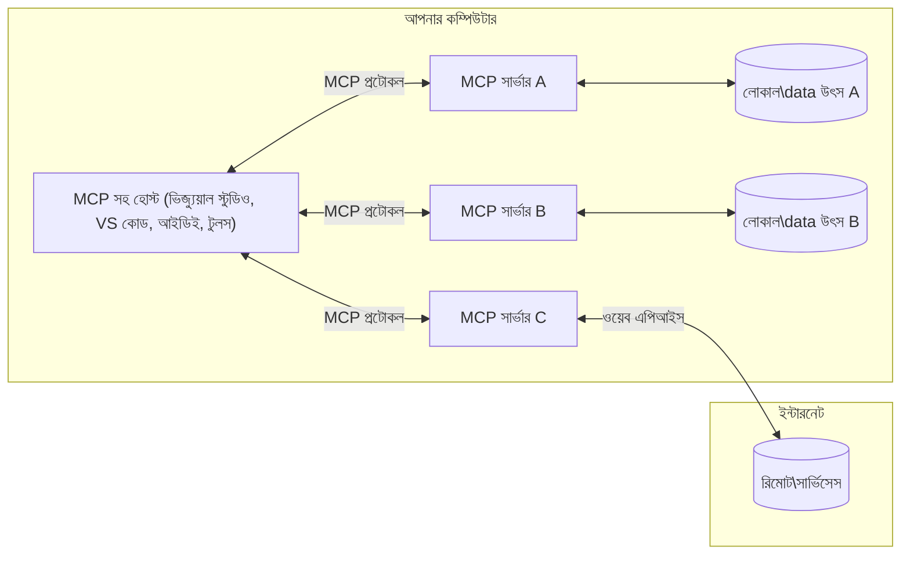

# MCP কোর ধারণা: AI ইন্টিগ্রেশনের জন্য মডেল কনটেক্সট প্রোটোকল মাষ্টার করা

[](https://youtu.be/earDzWGtE84)

_(এই পাঠের ভিডিও দেখার জন্য উপরের ছবিতে ক্লিক করুন)_

[মডেল কনটেক্সট প্রোটোকল (MCP)](https://github.com/modelcontextprotocol) হল একটি শক্তিশালী, মানকৃত ফ্রেমওয়ার্ক যা বড় ভাষা মডেল (LLMs) এবং বহিরাগত টুল, অ্যাপ্লিকেশন ও ডেটা উত্সের মধ্যে যোগাযোগ অপ্টিমাইজ করে।  
এই গাইডটি আপনাকে MCP এর মূল ধারণাগুলো সম্পর্কে পরিচিত করিয়ে দেবে। আপনি এর ক্লায়েন্ট-সার্ভার আর্কিটেকচার, গুরুত্বপূর্ণ উপাদান, যোগাযোগ পদ্ধতি এবং বাস্তবায়নের সেরা অনুশীলন জানতে পারবেন।

- **স্পষ্ট ইউজার সম্মতি**: সব ডেটা অ্যাক্সেস এবং অপারেশন কার্যকর করার আগে স্পষ্ট ব্যবহারকারীর অনুমোদন প্রয়োজন। ব্যবহারকারীর স্পষ্ট ধারণা থাকতে হবে কী ডেটা অ্যাক্সেস করা হবে এবং কী কী কাজ সম্পাদিত হবে, পারমিশন ও অনুমোদনে সূক্ষ্ম নিয়ন্ত্রণসহ।

- **ডেটা গোপনীয়তা সুরক্ষা**: ব্যবহারকারীর ডেটা শুধুমাত্র স্পষ্ট সম্মতির মাধ্যমে প্রকাশ করা হয় এবং সম্পূর্ণ ইন্টারঅ্যাকশন লাইফসাইকেলের সময় জোরালো অ্যাক্সেস কন্ট্রোল দ্বারা সুরক্ষিত থাকতে হবে। বাস্তবায়নগুলোকে অবৈধ ডেটা ট্রান্সমিশন থেকে রক্ষা করতে হবে এবং কঠোর গোপনীয়তা সীমান্ত বজায় রাখতে হবে।

- **টুল এক্সিকিউশন সুরক্ষা**: প্রতিটি টুল কল স্পষ্ট ব্যবহারকারীর সম্মতি প্রয়োজন যাতে টুলের কার্যকারিতা, প্যারামিটার এবং সম্ভাব্য প্রভাব সম্পর্কে পরিষ্কার ধারণা থাকে। জোরালো নিরাপত্তা সীমান্ত থাকা উচিত যাতে অনিচ্ছাকৃত, অ নিরাপদ বা ক্ষতিকারক টুল এক্সিকিউশন রোধ করা যায়।

- **ট্রান্সপোর্ট লেয়ার সিকিউরিটি**: সব যোগাযোগ চ্যানেল যথাযথ এনক্রিপশন ও প্রমাণীকরণ পদ্ধতি ব্যবহার করা উচিত। রিমোট কানেকশনগুলোকে নিরাপদ ট্রান্সপোর্ট প্রোটোকল এবং সঠিক ক্রেডেনশিয়াল ব্যবস্থাপনা বাস্তবায়ন করতে হবে।

#### বাস্তবায়নের নির্দেশিকা:

- **পারমিশন ব্যবস্থাপনা**: সূক্ষ্ম-গ্রেন পারমিশন সিস্টেম বাস্তবায়ন করুন যা ব্যবহারকারীদের নিয়ন্ত্রণ দেয় কোন সার্ভার, টুল এবং রিসোর্স অ্যাক্সেসযোগ্য হবে তা ঠিক করার জন্য  
- **প্রমাণীকরণ ও অনুমোদন**: নিরাপদ প্রমাণীকরণ পদ্ধতি (OAuth, API কীগুলি) ব্যবহার করুন যথাযথ টোকেন ব্যবস্থাপনা ও মেয়াদ সমাপ্তি সহ  
- **ইনপুট যাচাই**: সংজ্ঞায়িত স্কিমা অনুসারে সব প্যারামিটার এবং ডেটা ইনপুট যাচাই করুন যাতে ইনজেকশন আক্রমণ প্রতিরোধ করা যায়  
- **অডিট লগিং**: নিরাপত্তা পর্যবেক্ষণ ও কমপ্লায়েন্সের জন্য সব অপারেশনের বিস্তৃত লগ রাখুন

## ওভারভিউ

এই পাঠে আমরা মডেল কনটেক্সট প্রোটোকল (MCP) ইকোসিস্টেমের মৌলিক আর্কিটেকচার এবং উপাদানগুলো আলোচনা করব। আপনি জানতে পারবেন ক্লায়েন্ট-সার্ভার আর্কিটেকচার, মূল কম্পোনেন্ট এবং MCP ইন্টারঅ্যাকশনের কমিউনিকেশন মেকানিজম।

## মূল শেখার উদ্দেশ্য

এই পাঠ শেষ হলে আপনি:

- MCP ক্লায়েন্ট-সার্ভার আর্কিটেকচার বুঝতে পারবেন।  
- হোস্ট, ক্লায়েন্ট এবং সার্ভারের ভূমিকা ও দায়িত্ব চিনতে পারবেন।  
- MCP কে একটি নমনীয় ইন্টিগ্রেশন লেয়ার করে তোলার মূল বৈশিষ্ট্য বিশ্লেষণ করতে পারবেন।  
- MCP ইকোসিস্টেমে তথ্য প্রবাহ কীভাবে হয় তা শিখতে পারবেন।  
- .NET, Java, Python, এবং JavaScript কোড উদাহরণের মাধ্যমে ব্যবহারিক জ্ঞান অর্জন করবেন।

## MCP আর্কিটেকচার: গভীর বিশ্লেষণ

MCP ইকোসিস্টেম ক্লায়েন্ট-সার্ভার মডেলে নির্মিত। এই মডুলার গঠন AI অ্যাপ্লিকেশনগুলোকে টুল, ডাটাবেস, API এবং প্রাসঙ্গিক রিসোর্সের সঙ্গে দক্ষতার সঙ্গে ইন্টারঅ্যাক্ট করতে দেয়। আসুন এই আর্কিটেকচারটি এর মূল উপাদানে ভাঙা যাক।

মূলত, MCP একটি ক্লায়েন্ট-সার্ভার আর্কিটেকচার অনুসরণ করে যেখানে একটি হোস্ট অ্যাপ্লিকেশন একাধিক সার্ভারের সঙ্গে সংযোগ করতে পারে:


- **MCP হোস্টস**: VSCode, Claude Desktop, IDEs অথবা AI টুলসের মতো প্রোগ্রাম যা MCP এর মাধ্যমে ডেটা অ্যাক্সেস করতে চায়  
- **MCP ক্লায়েন্টস**: প্রোটোকল ক্লায়েন্ট যা সার্ভারের সঙ্গে ১:১ সংযোগ বজায় রাখে  
- **MCP সার্ভারস**: হালকা ওজনের প্রোগ্রাম যা প্রতিটি নির্দিষ্ট ক্ষমতা MCP স্ট্যান্ডার্ডাইজড মডেল কনটেক্সট প্রোটোকলের মাধ্যমে প্রকাশ করে  
- **লোকাল ডেটা সোর্সেস**: আপনার কম্পিউটারের ফাইল, ডাটাবেস, এবং সার্ভিস যা MCP সার্ভার নিরাপদে অ্যাক্সেস করতে পারে  
- **রিমোট সার্ভিসেস**: ইন্টারনেটের মাধ্যমে উপলব্ধ বহিরাগত সিস্টেম যা MCP সার্ভার API এর মাধ্যমে সংযোগ করতে পারে।

MCP প্রোটোকল তারিখভিত্তিক সংস্করণ (YYYY-MM-DD ফরম্যাট) ব্যবহার করে ক্রমবর্ধমান একটি স্ট্যান্ডার্ড। বর্তমান প্রোটোকল সংস্করণ হল **2025-11-25**। [প্রোটোকল স্পেসিফিকেশন](https://modelcontextprotocol.io/specification/2025-11-25/) এ সর্বশেষ আপডেট দেখতে পারেন।

### ১. হোস্টস

মডেল কনটেক্সট প্রোটোকল (MCP) তে, **হোস্টস** হল AI অ্যাপ্লিকেশনগুলো যা মূল ইন্টারফেস হিসেবে কাজ করে যার মাধ্যমে ব্যবহারকারীরা প্রোটোকলের সঙ্গে যোগাযোগ করে। হোস্টগুলো একাধিক MCP সার্ভারের সঙ্গে সংযোগ সমন্বয় ও ব্যবস্থাপনা করে প্রতিটি সার্ভার সংযোগের জন্য পৃথক MCP ক্লায়েন্ট তৈরি করে। হোস্টের উদাহরণসমূহ:

- **AI অ্যাপ্লিকেশনস**: Claude Desktop, Visual Studio Code, Claude Code  
- **ডেভেলপমেন্ট এনভায়রনমেন্টস**: MCP ইন্টিগ্রেটেড IDE ও কোড এডিটর  
- **কাস্টম অ্যাপ্লিকেশনস**: উদ্দেশ্যনির্দিষ্ট AI এজেন্ট ও টুলস

**হোস্টস** হল অ্যাপ্লিকেশন যা AI মডেল ইন্টারঅ্যাকশন সমন্বয় করে। তারা:

- **AI মডেলগুলো পরিচালনা করে**: LLMs কে চালনা বা ইন্টারঅ্যাক্ট করে রেসপন্স তৈরি ও AI ওয়ার্কফ্লো সমন্বয় করে  
- **ক্লায়েন্ট সংযোগ ম্যানেজ করে**: প্রতিটি MCP সার্ভার সংযোগের জন্য একটি MCP ক্লায়েন্ট তৈরি ও বজায় রাখে  
- **ইউজার ইন্টারফেস নিয়ন্ত্রণ করে**: কথোপকথনের প্রবাহ, ইউজার ইন্টারঅ্যাকশন এবং রেসপন্স প্রদর্শন পরিচালনা করে  
- **নিরাপত্তা চাপিয়ে দেয়**: পারমিশন, নিরাপত্তা সীমাবদ্ধতা এবং প্রমাণীকরণ নিয়ন্ত্রণ করে  
- **ব্যবহারকারীর সম্মতি পরিচালনা করে**: ডেটা শেয়ারিং ও টুল এক্সিকিউশনের জন্য ব্যবহারকারীর অনুমোদন ম্যানেজ করে

### ২. ক্লায়েন্টস

**ক্লায়েন্টস** হল অপরিহার্য উপাদান যা হোস্ট এবং MCP সার্ভারের মধ্যে নিবেদিত এক-এক সংযোগ বজায় রাখে। প্রতিটি MCP ক্লায়েন্ট হোস্ট দ্বারা নির্দিষ্ট MCP সার্ভারের সাথে সংযোগ করতে ইনস্ট্যান্টিয়েট করা হয়, যা সংগঠিত ও নিরাপদ যোগাযোগ চ্যানেল নিশ্চিত করে। একাধিক ক্লায়েন্ট হোস্টকে একই সময়ে একাধিক সার্ভারের সঙ্গে সংযোগের সুযোগ দেয়।

**ক্লায়েন্টস** হল হোস্ট অ্যাপ্লিকেশনের মধ্যে সংযোগকারী উপাদান। তারা:

- **প্রোটোকল যোগাযোগ**: JSON-RPC 2.0 রিকোয়েস্ট সার্ভারে পাঠায় প্রম্পট ও নির্দেশাবলীসহ  
- **ক্ষমতা আলোচনার ব্যবস্থা**: ইনিশিয়ালাইজেশনের সময় সার্ভারের সঙ্গে সমর্থিত ফিচার এবং প্রোটোকল সংস্করণের জন্য আলোচনার ব্যবস্থা চালায়  
- **টুল এক্সিকিউশন**: মডেল থেকে টুল এক্সিকিউশনের অনুরোধ নিয়ন্ত্রণ করে এবং রেসপন্স প্রক্রিয়া করে  
- **রিয়েল-টাইম আপডেট**: সার্ভার থেকে নোটিফিকেশন ও রিয়েল-টাইম আপডেট হ্যান্ডেল করে  
- **রেসপন্স প্রসেসিং**: ব্যবহারকারীদের প্রদর্শনের জন্য সার্ভার রেসপন্স প্রসেস ও ফরম্যাট করে

### ৩. সার্ভারস

**সার্ভারস** হল প্রোগ্রাম যা MCP ক্লায়েন্টকে প্রাসঙ্গিক তথ্য, টুলস এবং ক্ষমতা প্রদান করে। তারা লোকালি (হোস্টের একই মেশিনে) অথবা রিমোট (বাহ্যিক প্ল্যাটফর্মে) চালিত হতে পারে এবং ক্লায়েন্ট রিকোয়েস্ট গ্রহণ ও কাঠামোবদ্ধ রেসপন্স প্রদান করে। সার্ভারগুলো MCP স্ট্যান্ডার্ড মডেল কনটেক্সট প্রোটোকলের মাধ্যমে নির্দিষ্ট কার্যকারিতা প্রকাশ করে।

**সার্ভারস** হলো এমন সার্ভিস যা প্রাসঙ্গিকতা ও ক্ষমতা দিয়ে থাকে। তারা:

- **ফিচার নিবন্ধন**: ক্লায়েন্টদের জন্য উপলব্ধ প্রিমিটিভ (রিসোর্স, প্রম্পট, টুল) নিবন্ধন ও প্রকাশ করে  
- **রিকোয়েস্ট প্রসেসিং**: ক্লায়েন্টদের টুল কল, রিসোর্স অনুরোধ ও প্রম্পট রিকোয়েস্ট গ্রহণ ও সম্পাদন করে  
- **কনটেক্সট প্রদান**: মডেল রেসপন্স উন্নত করার জন্য প্রাসঙ্গিক তথ্য দেয়  
- **স্টেট ম্যানেজমেন্ট**: প্রয়োজনে সেশন স্টেট বজায় রাখে ও স্টেটফুল ইন্টারঅ্যাকশন হ্যান্ডেল করে  
- **রিয়েল-টাইম নোটিফিকেশন**: ক্লায়েন্টগুলোর কাছে ক্ষমতা পরিবর্তন ও আপডেটের বিষয়ে নোটিফিকেশন পাঠায়

সার্ভারস যেকোনো ব্যক্তি দ্বারা মডেল ক্ষমতা বাড়ানোর উদ্দেশ্যে উন্নয়ন করা যেতে পারে এবং তারা লোকাল ও রিমোট উভয় ডিপ্লয়মেন্ট সাপোর্ট করে।

### ৪. সার্ভার প্রিমিটিভস

মডেল কনটেক্সট প্রোটোকল (MCP) তে সার্ভার তিনটি মূল **প্রিমিটিভ** প্রদান করে যা ক্লায়েন্ট, হোস্ট, এবং ভাষা মডেলের মধ্যে সমৃদ্ধ ইন্টারঅ্যাকশনের মৌলিক নির্মাণ ব্লক নির্ধারণ করে। এই প্রিমিটিভগুলো প্রোটোকলের মাধ্যমে প্রাপ্য প্রাসঙ্গিক তথ্য এবং একশন এর ধরন নির্দিষ্ট করে।

MCP সার্ভারগুলো নিম্নলিখিত তিনটি মূল প্রিমিটিভ যেকোনো কম্বিনেশন প্রকাশ করতে পারে:

#### রিসোর্সেস

**রিসোর্সেস** হলো ডেটা সোর্স যা AI অ্যাপ্লিকেশনগুলিকে প্রাসঙ্গিক তথ্য সরবরাহ করে। এগুলো এমন স্থির বা গতিশীল বিষয়বস্তু যা মডেলের বোঝাপড়া ও সিদ্ধান্তগ্রহণ বাড়ায়:

- **প্রাসঙ্গিক তথ্য**: AI মডেল ব্যবহারের জন্য কাঠামোবদ্ধ তথ্য ও কনটেক্সট  
- **জ্ঞানভাণ্ডার**: ডকুমেন্ট রেপোজিটরি, আর্টিকেল, ম্যানুয়াল এবং গবেষণা পেপার  
- **লোকাল ডেটা সোর্সেস**: ফাইল, ডাটাবেস, এবং লোকাল সিস্টেম তথ্য  
- **বহিরাগত ডেটা**: API রেসপন্স, ওয়েব সার্ভিস, এবং রিমোট সিস্টেম ডেটা  
- **গতি-বিধেয় বিষয়বস্তু**: বাহ্যিক অবস্থা অনুসারে রিয়েল-টাইম আপডেট হওয়া ডেটা

রিসোর্সগুলো URI দ্বারা সনাক্ত এবং `resources/list` এর মাধ্যমে ডিসকভারি ও `resources/read` এর মাধ্যমে পুনরুদ্ধার সমর্থন করে:

```text
file://documents/project-spec.md
database://production/users/schema
api://weather/current
```
  
#### প্রম্পটস

**প্রম্পটস** হলো পুনঃব্যবহারযোগ্য টেম্পলেট যা ভাষা মডেলের সাথে ইন্টারঅ্যাকশন গঠন করতে সাহায্য করে। এগুলো মানকৃত ইন্টারঅ্যাকশন প্যাটার্ন এবং টেমপ্লেটেড ওয়ার্কফ্লো প্রদান করে:

- **টেমপ্লেট-ভিত্তিক ইন্টারঅ্যাকশন**: পূর্ব-গঠিত মেসেজ এবং কথোপকথনের সূচনা  
- **ওয়ার্কফ্লো টেম্পলেট**: সাধারণ কাজ ও ইন্টারঅ্যাকশনের জন্য মানক সিকোয়েন্স  
- **ফিউ-শট উদাহরণ**: মডেল নির্দেশনার জন্য উদাহরণ-ভিত্তিক টেমপ্লেট  
- **সিস্টেম প্রম্পটস**: মডেলের আচরণ ও প্রাসঙ্গিকতা নির্ধারণকারী মৌলিক প্রম্পট  
- **গতি-বিধেয় টেম্পলেটস**: নির্দিষ্ট প্রেক্ষাপটে অভিযোজিত প্যারামিটারাইজড প্রম্পট

প্রম্পটস ভেরিয়েবল সাবস্টিটিউশন সমর্থন করে এবং `prompts/list` এবং `prompts/get` পদ্ধতিতে ডিসকভারি ও রিট্রিভ করা যায়:

```markdown
Generate a {{task_type}} for {{product}} targeting {{audience}} with the following requirements: {{requirements}}
```
  
#### টুলস

**টুলস** হল কার্যকরী ফাংশন যা AI মডেল নির্দিষ্ট কাজ করার জন্য কল করতে পারে। এগুলো MCP ইকোসিস্টেমের "ক্রিয়া"সমূহ প্রতিনিধিত্ব করে, যার মাধ্যমে মডেল বাহ্যিক সিস্টেমের সঙ্গে ইন্টারঅ্যাক্ট করে:

- **কার্যকরী ফাংশন**: নির্দিষ্ট প্যারামিটার নিয়ে মডেল কল করতে পারা বিচ্ছিন্ন অপারেশন  
- **বহিরাগত সিস্টেম ইন্টিগ্রেশন**: API কল, ডাটাবেস কোয়েরি, ফাইল অপারেশন, হিসাব-নিকাশ  
- **স্বতন্ত্র পরিচয়**: প্রতিটি টুলের আলাদা নাম, বর্ণনা, এবং প্যারামিটার স্কিমা থাকে  
- **কাঠামোবদ্ধ ইনপুট/আউটপুট**: টুলসমূহ যাচাই করা প্যারামিটার গ্রহণ করে এবং কাঠামোবদ্ধ, টাইপকৃত রেসপন্স প্রদান করে  
- **কর্মক্ষমতা সুবিধা**: মডেলকে বাস্তব কাজ করার এবং লাইভ ডেটা আহরণ করার ক্ষমতা দেয়

টুলস JSON স্কিমা দ্বারা প্যারামিটার যাচাই নির্ধারণ করে এবং `tools/list` এর মাধ্যমে ডিসকভারি ও `tools/call` এর মাধ্যমে এক্সিকিউট করা হয়। উন্নত UI উপস্থাপনার জন্য টুলস অতিরিক্ত মেটাডেটা হিসেবে **আইকন** অন্তর্ভুক্ত করতে পারে।

**টুল অ্যানোটেশনস**: টুলস বর্ণনামূলক অ্যানোটেশনস (যেমন, `readOnlyHint`, `destructiveHint`) সাপোর্ট করে যা টুলের রিড-ওনলি বা ধ্বংসাত্মক কি না তা বর্ণনা করে, ক্লায়েন্টকে টুল এক্সিকিউশনের বিষয়ে সচেতন সিদ্ধান্ত নিতে সাহায্য করে।

টুল ডেফিনিশনের উদাহরণ:

```typescript
server.tool(
  "search_products", 
  {
    query: z.string().describe("Search query for products"),
    category: z.string().optional().describe("Product category filter"),
    max_results: z.number().default(10).describe("Maximum results to return")
  }, 
  async (params) => {
    // অনুসন্ধান চালান এবং গঠনমূলক ফলাফল ফিরিয়ে দিন
    return await productService.search(params);
  }
);
```
  
## ক্লায়েন্ট প্রিমিটিভস

মডেল কনটেক্সট প্রোটোকল (MCP) তে, **ক্লায়েন্টস** প্রিমিটিভস প্রকাশ করতে পারে যা সার্ভারগুলোকে হোস্ট অ্যাপ্লিকেশন থেকে অতিরিক্ত ক্ষমতা চাওয়ার সুযোগ দেয়। এই ক্লায়েন্ট-সাইড প্রিমিটিভগুলো সমৃদ্ধ, আরও ইন্টারেক্টিভ সার্ভার ইমপ্লিমেন্টেশন সম্ভব করে যা AI মডেলের ক্ষমতা এবং ব্যবহারকারী ইন্টারঅ্যাকশন অ্যাক্সেস করতে পারে।

### স্যাম্পলিং

**স্যাম্পলিং** সার্ভারগুলোকে ক্লায়েন্টের AI অ্যাপ্লিকেশন থেকে ভাষা মডেল কমপ্লিশন চাওয়ার অনুমতি দেয়। এই প্রিমিটিভ সার্ভারগুলোকে তাদের নিজস্ব মডেল নির্ভরতা ছাড়া LLM ক্ষমতা ব্যবহার করতে সক্ষম করে:

- **মডেল-স্বাধীন এক্সেস**: সার্ভারগুলো LLM SDK অন্তর্ভুক্ত বা মডেল ব্যবস্থাপনা ছাড়াই কমপ্লিশন চাইতে পারে  
- **সার্ভার-উদ্দিষ্ট AI**: ক্লায়েন্টের AI মডেল ব্যবহার করে স্বায়ত্তভাবে কনটেন্ট তৈরি করার অনুমতি দেয়  
- **পুনরাবৃত্ত LLM ইন্টারঅ্যাকশন**: এমন জটিল পরিস্থিতিতে সাহায্য করে যেখানে সার্ভারকে AI সাহায্য দরকার প্রক্রিয়াকরণের জন্য  
- **গতি-বিধেয় বিষয়বস্তু সৃষ্টির সুযোগ**: প্রাসঙ্গিক রেসপন্স তৈরিতে হোস্টের মডেলের ব্যবহার সম্ভব করে  
- **টুল কলিং সমর্থন**: সার্ভার `tools` এবং `toolChoice` প্যারামিটার অন্তর্ভুক্ত করতে পারে যাতে স্যাম্পলিংয়ের সময় ক্লায়েন্টের মডেল টুল কল করতে পারে

স্যাম্পলিং `sampling/complete` পদ্ধতির মাধ্যমে শুরু হয়, যেখানে সার্ভার ক্লায়েন্টদের কাছে কমপ্লিশন অনুরোধ পাঠায়।

### রুটস

**রুটস** সার্ভারগুলোকে ক্লায়েন্টদের ফাইলসিস্টেম সীমা প্রকাশের মানক উপায় দেয়, যাতে সার্ভারগুলো বুঝতে পারে তারা কোন ডিরেক্টরি এবং ফাইলগুলোতে প্রবেশাধিকার পায়:

- **ফাইলসিস্টেম সীমা**: ফাইলসিস্টেমে সার্ভার কাজ করার এলাকাগুলো নির্ধারণ করে  
- **অ্যাক্সেস কন্ট্রোল**: সার্ভারগুলো কোন ডিরেক্টরি এবং ফাইলে প্রবেশাধিকার পাচ্ছে তা বুঝতে সাহায্য করে  
- **গতি-বিধেয় আপডেট**: ক্লায়েন্টরা যখন রুট তালিকা পরিবর্তন হয় তখন সার্ভারদের অবহিত করতে পারে  
- **URI-ভিত্তিক সনাক্তকরণ**: রুটগুলো `file://` URI ব্যবহার করে অ্যাক্সেসযোগ্য ডিরেক্টরি ও ফাইল চিহ্নিত করে

`roots/list` পদ্ধতির মাধ্যমে রুটগুলো ডিসকভার হয়, ক্লায়েন্টরা `notifications/roots/list_changed` পাঠায় যখন রুট পরিবর্তিত হয়।

### এলিসিটেশন

**এলিসিটেশন** সার্ভারগুলোকে ক্লায়েন্ট ইন্টারফেসের মাধ্যমে ব্যবহারকারীর কাছ থেকে অতিরিক্ত তথ্য বা নিশ্চিতকরণ চাওয়ার অনুমতি দেয়:

- **ব্যবহারকারী ইনপুট অনুরোধ**: সরঞ্জাম চালানোর জন্য প্রয়োজনে অতিরিক্ত তথ্য চাইতে পারে সার্ভার  
- **নিশ্চিতকরণ ডায়লগ**: সংবেদনশীল বা প্রভাবশালী অপারেশনের জন্য ব্যবহারকারীর অনুমোদন চাওয়া  
- **ইন্টারেক্টিভ ওয়ার্কফ্লো**: সার্ভারকে ধাপে ধাপে ব্যবহারকারী ইন্টারঅ্যাকশন তৈরি করতে সক্ষম করে  
- **গতি-বিধেয় প্যারামিটার সংগ্রহ**: টুল এক্সিকিউশনের সময় অনুপস্থিত বা ঐচ্ছিক প্যারামিটার সংগ্রহ করে

এলিসিটেশন অনুরোধ `elicitation/request` পদ্ধতি ব্যবহার করে ক্লায়েন্টের মাধ্যমে ব্যবহারকারী ইনপুট সংগ্রহের জন্য করা হয়।

**URL মোড এলিসিটেশন**: সার্ভারগুলো URL-ভিত্তিক ব্যবহারকারী ইন্টারঅ্যাকশনও চেয়ে পারে, যার মাধ্যমে ব্যবহারকারীদের প্ররোচিত করা হয় বাহ্যিক ওয়েব পেজে যেতে যেমন প্রমাণীকরণ, নিশ্চিতকরণ বা ডেটা এন্ট্রি জন্য।

### লগিং

**লগিং** সার্ভারগুলোকে ক্লায়েন্টদের কাছে কাঠামোবদ্ধ লগ মেসেজ পাঠানোর অনুমতি দেয় ডিবাগিং, মনিটরিং ও অপারেশনাল দৃশ্যমানতার জন্য:

- **ডিবাগিং সাপোর্ট**: সমস্য়া সমাধানের জন্য বিস্তৃত এক্সিকিউশনের লগ দিতে সক্ষম করে  
- **অপারেশন মনিটরিং**: ক্লায়েন্টদের কাছে স্ট্যাটাস আপডেট এবং পারফরম্যান্স মেট্রিক্স পাঠায়  
- **ত্রুটি রিপোর্টিং**: বিস্তৃত ত্রুটি প্রসঙ্গ এবং ডায়াগনস্টিক তথ্য প্রদান করে  
- **অডিট ট্রেইলস**: সার্ভার অপারেশন এবং সিদ্ধান্তের পূর্ণাঙ্গ লগ তৈরি করে

লগিং মেসেজগুলি সার্ভার অপারেশনের স্বচ্ছতা ও ডিবাগিং সহজ করতে ক্লায়েন্টদের পাঠানো হয়।

## MCP তে তথ্য প্রবাহ

মডেল কনটেক্সট প্রোটোকল (MCP) হোস্ট, ক্লায়েন্ট, সার্ভার এবং মডেলের মধ্যে একটি কাঠামোবদ্ধ তথ্য প্রবাহ সংজ্ঞায়িত করে। এই প্রবাহ বোঝা ব্যবহারকারীর অনুরোধ কীভাবে প্রক্রিয়াকৃত হয় এবং কীভাবে বাহ্যিক টুল এবং ডেটা মডেল রেসপন্সে একত্রিত হয় তা স্পষ্ট করে।

- **হোস্ট সংযোগ শুরু করে**  
  হোস্ট অ্যাপ্লিকেশন (যেমন IDE বা চ্যাট ইন্টারফেস) একটি MCP সার্ভারের সাথে সংযোগ স্থাপন করে, সাধারণত STDIO, WebSocket বা অন্য কোনো সমর্থিত ট্রান্সপোর্টের মাধ্যমে।

- **ক্ষমতা আলোচনা**  
  ক্লায়েন্ট (হোস্টে এম্বেড করা) এবং সার্ভার তাদের সমর্থিত বৈশিষ্ট্য, টুল, রিসোর্স এবং প্রোটোকল সংস্করণ সম্পর্কে তথ্য বিনিময় করে। এটা সুনিশ্চিত করে যে উভয় পক্ষ সেশন জন্য উপলব্ধ ক্ষমতা বুঝতে পারে।

- **ব্যবহারকারীর অনুরোধ**  
  ব্যবহারকারী হোস্টের সাথে ইন্টারঅ্যাক্ট করে (যেমন একটি প্রম্পট বা কমান্ড প্রবেশ করানো)। হোস্ট এটি সংগ্রহ করে এবং প্রক্রিয়াকরণের জন্য ক্লায়েন্টকে পাঠায়।

- **রিসোর্স বা টুল ব্যবহার**  
  - ক্লায়েন্ট মডেলের বোঝাপড়া সমৃদ্ধ করার জন্য সার্ভার থেকে অতিরিক্ত কনটেক্সট বা রিসোর্স (যেমন ফাইল, ডাটাবেস এন্ট্রি, বা জ্ঞানভাণ্ডার আর্টিকেল) অনুরোধ করতে পারে।  
  - যদি মডেল নির্ধারণ করে যে একটি টুল প্রয়োজন (যেমন ডেটা আহরণ, গণনা করা, বা API কল করা), ক্লায়েন্ট সার্ভারকে টুল ইনভোকেশন অনুরোধ পাঠায়, টুলের নাম ও প্যারামিটারসহ।

- **সার্ভারের এক্সিকিউশন**  

সার্ভার রিসোর্স বা টুল অনুরোধ গ্রহণ করে, প্রয়োজনীয় কার্যক্রম সম্পাদন করে (যেমন একটি ফাংশন চালানো, একটি ডাটাবেস থেকে তথ্য অনুসন্ধান করা, বা একটি ফাইল সংগ্রহ করা), এবং ফলাফলগুলি ক্লায়েন্টকে একটি কাঠামোবদ্ধ ফরম্যাটে ফেরত দেয়।

- **প্রতিক্রিয়া জেনারেশন**  
  ক্লায়েন্ট সার্ভারের প্রতিক্রিয়া (রিসোর্স ডেটা, টুল আউটপুট ইত্যাদি) চলমান মডেল ইন্টারঅ্যাকশনে সংযুক্ত করে। মডেল এই তথ্য ব্যবহার করে একটি ব্যাপক এবং প্রসঙ্গভিত্তিক প্রাসঙ্গিক প্রতিক্রিয়া তৈরি করে।

- **ফলাফল উপস্থাপনা**  
  হোস্ট ক্লায়েন্ট থেকে চূড়ান্ত আউটপুট গ্রহণ করে এবং ব্যবহারকারীর সামনে উপস্থাপন করে, প্রায়শই মডেল দ্বারা তৈরি লেখা এবং টুল কার্যক্রম বা রিসোর্স অনুসন্ধান থেকে যে কোনো ফলাফল সহ।

এই প্রবাহ MCP-কে উন্নত, ইন্টারেক্টিভ এবং প্রসঙ্গ-সচেতন AI অ্যাপ্লিকেশন সমর্থন করার জন্য সক্ষম করে, মডেলগুলোকে বহিরাগত টুল এবং ডেটা উৎসের সাথে নির্বিঘ্নে সংযুক্ত করে।

## প্রোটোকল স্থাপত্য ও স্তরসমূহ

MCP দুটি স্বতন্ত্র স্থাপত্যগত স্তর নিয়ে গঠিত যা একসাথে সম্পূর্ণ যোগাযোগ কাঠামো প্রদান করে:

### ডেটা স্তর

**ডেটা স্তর** MCP প্রোটোকলের মূল বাস্তবায়ন করে যা **JSON-RPC 2.0** এর ওপর ভিত্তি করে নির্মিত। এই স্তর বার্তা কাঠামো, সেমান্টিকস, এবং ইন্টারঅ্যাকশন প্যাটার্ন নির্ধারণ করে:

#### মূল উপাদানসমূহ:

- **JSON-RPC 2.0 প্রোটোকল**: সমস্ত যোগাযোগ মানক JSON-RPC 2.0 বার্তা ফরম্যাট ব্যবহার করে, পদ্ধতি কল, প্রতিক্রিয়া, এবং বিজ্ঞপ্তির জন্য
- **লাইফসাইকেল ব্যবস্থাপনা**: ক্লায়েন্ট এবং সার্ভারের মধ্যে সংযোগ প্রারম্ভ, ক্ষমতা আলোচনা, এবং সেশন সমাপ্তি পরিচালনা করে
- **সার্ভার প্রিমিটিভস**: সার্ভারগুলোকে টুল, রিসোর্স এবং প্রম্পটের মাধ্যমে মূল কার্যকারিতা প্রদান করার সক্ষমতা দেয়
- **ক্লায়েন্ট প্রিমিটিভস**: সার্ভারগুলোকে LLM থেকে স্যাম্পলিং অনুরোধ জানাতে, ব্যবহারকারীর ইনপুট আহরণ করতে এবং লগ বার্তা পাঠাতে সক্ষম করে
- **রিয়েল-টাইম বিজ্ঞপ্তি**: পোলিং ছাড়া ডাইনামিক আপডেটের জন্য অ্যাসিঙ্ক্রোনাস বিজ্ঞপ্তি সমর্থন করে

#### মূল বৈশিষ্ট্যসমূহ:

- **প্রোটোকল সংস্করণ আলোচনা**: তারিখ ভিত্তিক সংস্করণ (YYYY-MM-DD) ব্যবহার করে সামঞ্জস্য নিশ্চিত করে
- **ক্ষমতা আবিষ্কার**: প্রারম্ভে ক্লায়েন্ট এবং সার্ভার সমর্থিত বৈশিষ্ট্য তথ্য বিনিময় করে
- **স্টেটফুল সেশন**: একাধিক ইন্টারঅ্যাকশনের মাধ্যমে সংযোগ অবস্থা অক্ষুন্ন রাখা, প্রসঙ্গ ধারাবাহিকতার জন্য

### পরিবহন স্তর

**পরিবহন স্তর** MCP অংশগ্রহণকারীদের মধ্যে যোগাযোগ চ্যানেল, বার্তা ফ্রেমিং, এবং প্রমাণীকরণ পরিচালনা করে:

#### সমর্থিত পরিবহন পদ্ধতিগুলো:

1. **STDIO পরিবহন**:
   - সরাসরি প্রসেস যোগাযোগের জন্য স্ট্যান্ডার্ড ইনপুট/আউটপুট স্ট্রীম ব্যবহার করে
   - একই মেশিনের স্থানীয় প্রসেসের জন্য আদর্শ, কোনও নেটওয়ার্ক ওভারহেড নেই
   - স্থানীয় MCP সার্ভার বাস্তবায়নের জন্য সাধারণত ব্যবহৃত

2. **স্ট্রিমেবল HTTP পরিবহন**:
   - ক্লায়েন্ট থেকে সার্ভারে বার্তা পাঠাতে HTTP POST ব্যবহার করে  
   - অপশনাল সার্ভার-সেন্ট ইভেন্টস (SSE) সার্ভার থেকে ক্লায়েন্ট স্ট্রিমিংয়ের জন্য
   - নেটওয়ার্ক জুড়ে রিমোট সার্ভার যোগাযোগ সক্ষম করে
   - স্ট্যান্ডার্ড HTTP প্রমাণীকরণ (বেয়ারার টোকেন, API কী, কাস্টম হেডার) সমর্থন করে
   - MCP নিরাপদ টোকেন-ভিত্তিক প্রমাণীকরণের জন্য OAuth সুপারিশ করে

#### পরিবহণ বিমূর্ততা:

পরিবহণ স্তর ডেটা স্তর থেকে যোগাযোগের বিবরণ বিমূর্ত করে, যাতে সমস্ত পরিবহন পদ্ধতির জন্য একই JSON-RPC 2.0 বার্তা ফরম্যাট ব্যবহার করা যায়। এই বিমূর্ততা অ্যাপ্লিকেশনগুলোকে স্থানীয় এবং রিমোট সার্ভারের মধ্যে নির্বিঘ্নে পরিবর্তন করার সুযোগ দেয়।

### নিরাপত্তা বিবেচনা

MCP বাস্তবায়নগুলো অবশ্যই বেশ কয়েকটি গুরুত্বপূর্ণ নিরাপত্তা নীতিমালা মেনে চলতে হবে যা সব প্রোটোকল অপারেশনের সময় নিরাপদ, বিশ্বাসযোগ্য ও সুরক্ষিত ইন্টারঅ্যাকশন নিশ্চিত করে:

- **ব্যবহারকারীর সম্মতি ও নিয়ন্ত্রণ**: কোনো ডেটা প্রবেশ করার আগে বা অপারেশন সম্পাদনের আগে ব্যবহারকারীর স্পষ্ট সম্মতি প্রয়োজন। তাদের স্পষ্ট নিয়ন্ত্রণ থাকতে হবে কি ডেটা ভাগ করা হচ্ছে এবং কোন কাজ অনুমোদিত, যা কার্যকলাপ পর্যালোচনা ও অনুমোদনের জন্য ব্যবহারবান্ধব ইন্টারফেস দ্বারা সমর্থিত।

- **ডেটা গোপনীয়তা**: ব্যবহারকারীর ডেটা কেবল স্পষ্ট সম্মতির সাথে প্রকাশিত হওয়া উচিত এবং উপযুক্ত প্রবেশাধিকার নিয়ন্ত্রণ দ্বারা সুরক্ষিত থাকতে হবে। MCP বাস্তবায়নগুলো অবাঞ্ছিত ডেটা প্রেরণ প্রতিরোধ এবং সব ইন্টারঅ্যাকশনের সময় গোপনীয়তা রক্ষা নিশ্চিত করতে হবে।

- **টুল সুরক্ষা**: কোনো টুল চালানোর আগে স্পষ্ট ব্যবহারকারীর সম্মতি প্রয়োজন। ব্যবহারকারীকে প্রতিটি টুলের কার্যকারিতা স্পষ্টভাবে বুঝতে হবে, এবং দুর্ঘটনাজনিত বা অনিরাপদ টুল কার্যকরী প্রতিরোধের জন্য কঠোর নিরাপত্তা সীমারেখা বজায় রাখতে হবে।

এই নিরাপত্তা নীতিগুলো অনুসরণ করে MCP ব্যবহারকারীর বিশ্বাস, গোপনীয়তা ও নিরাপত্তা নিশ্চিত করে প্রোটোকল ইন্টারঅ্যাকশনের সময়, উন্নত AI ইন্টিগ্রেশন সক্ষম করেও।

## কোড উদাহরণ: মূল উপাদানসমূহ

নিচে কয়েকটি জনপ্রিয় প্রোগ্রামিং ভাষায় MCP সার্ভার উপাদান এবং টুলগুলি বাস্তবায়নের কিভাবে করা যায় তার উদাহরণ দেওয়া হয়েছে।

### .NET উদাহরণ: টুল সহ একটি সহজ MCP সার্ভার তৈরি

এখানে একটি ব্যবহারিক .NET কোড উদাহরণ দেওয়া হয়েছে যা দেখাচ্ছে কিভাবে একটি সহজ MCP সার্ভার কাস্টম টুলসহ বাস্তবায়ন করা যায়। এই উদাহরণ টুলগুলি সংজ্ঞায়িত এবং নিবন্ধনের পদ্ধতি, অনুরোধ পরিচালনা এবং Model Context Protocol ব্যবহার করে সার্ভারকে সংযুক্ত করার পদ্ধতি প্রদর্শন করে।

```csharp
using System;
using System.Threading.Tasks;
using ModelContextProtocol.Server;
using ModelContextProtocol.Server.Transport;
using ModelContextProtocol.Server.Tools;

public class WeatherServer
{
    public static async Task Main(string[] args)
    {
        // Create an MCP server
        var server = new McpServer(
            name: "Weather MCP Server",
            version: "1.0.0"
        );
        
        // Register our custom weather tool
        server.AddTool<string, WeatherData>("weatherTool", 
            description: "Gets current weather for a location",
            execute: async (location) => {
                // Call weather API (simplified)
                var weatherData = await GetWeatherDataAsync(location);
                return weatherData;
            });
        
        // Connect the server using stdio transport
        var transport = new StdioServerTransport();
        await server.ConnectAsync(transport);
        
        Console.WriteLine("Weather MCP Server started");
        
        // Keep the server running until process is terminated
        await Task.Delay(-1);
    }
    
    private static async Task<WeatherData> GetWeatherDataAsync(string location)
    {
        // This would normally call a weather API
        // Simplified for demonstration
        await Task.Delay(100); // Simulate API call
        return new WeatherData { 
            Temperature = 72.5,
            Conditions = "Sunny",
            Location = location
        };
    }
}

public class WeatherData
{
    public double Temperature { get; set; }
    public string Conditions { get; set; }
    public string Location { get; set; }
}
```

### Java উদাহরণ: MCP সার্ভার উপাদানসমূহ

এই উদাহরণটি উপরের .NET উদাহরণের মতো MCP সার্ভার ও টুল নিবন্ধন দেখায়, তবে Java-তে বাস্তবায়িত।

```java
import io.modelcontextprotocol.server.McpServer;
import io.modelcontextprotocol.server.McpToolDefinition;
import io.modelcontextprotocol.server.transport.StdioServerTransport;
import io.modelcontextprotocol.server.tool.ToolExecutionContext;
import io.modelcontextprotocol.server.tool.ToolResponse;

public class WeatherMcpServer {
    public static void main(String[] args) throws Exception {
        // একটি MCP সার্ভার তৈরি করুন
        McpServer server = McpServer.builder()
            .name("Weather MCP Server")
            .version("1.0.0")
            .build();
            
        // একটি আবহাওয়া টুল নিবন্ধন করুন
        server.registerTool(McpToolDefinition.builder("weatherTool")
            .description("Gets current weather for a location")
            .parameter("location", String.class)
            .execute((ToolExecutionContext ctx) -> {
                String location = ctx.getParameter("location", String.class);
                
                // আবহাওয়ার ডেটা পান (সরলীকৃত)
                WeatherData data = getWeatherData(location);
                
                // ফরম্যাট করা প্রতিক্রিয়া ফিরিয়ে দিন
                return ToolResponse.content(
                    String.format("Temperature: %.1f°F, Conditions: %s, Location: %s", 
                    data.getTemperature(), 
                    data.getConditions(), 
                    data.getLocation())
                );
            })
            .build());
        
        // stdio ট্রান্সপোর্ট ব্যবহার করে সার্ভারে সংযুক্ত করুন
        try (StdioServerTransport transport = new StdioServerTransport()) {
            server.connect(transport);
            System.out.println("Weather MCP Server started");
            // প্রক্রিয়া শেষ না হওয়া পর্যন্ত সার্ভার চালু রাখুন
            Thread.currentThread().join();
        }
    }
    
    private static WeatherData getWeatherData(String location) {
        // বাস্তবায়নে আবহাওয়া API কল করা হবে
        // উদাহরণের উদ্দেশ্যে সরলীকৃত
        return new WeatherData(72.5, "Sunny", location);
    }
}

class WeatherData {
    private double temperature;
    private String conditions;
    private String location;
    
    public WeatherData(double temperature, String conditions, String location) {
        this.temperature = temperature;
        this.conditions = conditions;
        this.location = location;
    }
    
    public double getTemperature() {
        return temperature;
    }
    
    public String getConditions() {
        return conditions;
    }
    
    public String getLocation() {
        return location;
    }
}
```

### Python উদাহরণ: একটি MCP সার্ভার নির্মাণ

এই উদাহরণটি fastmcp ব্যবহার করে, তাই অনুগ্রহ করে প্রথমে এটি ইনস্টল করুন:

```python
pip install fastmcp
```
Code Sample:

```python
#!/usr/bin/env python3
import asyncio
from fastmcp import FastMCP
from fastmcp.transports.stdio import serve_stdio

# একটি FastMCP সার্ভার তৈরি করুন
mcp = FastMCP(
    name="Weather MCP Server",
    version="1.0.0"
)

@mcp.tool()
def get_weather(location: str) -> dict:
    """Gets current weather for a location."""
    return {
        "temperature": 72.5,
        "conditions": "Sunny",
        "location": location
    }

# একটি ক্লাস ব্যবহার করে বিকল্প পদ্ধতি
class WeatherTools:
    @mcp.tool()
    def forecast(self, location: str, days: int = 1) -> dict:
        """Gets weather forecast for a location for the specified number of days."""
        return {
            "location": location,
            "forecast": [
                {"day": i+1, "temperature": 70 + i, "conditions": "Partly Cloudy"}
                for i in range(days)
            ]
        }

# ক্লাস সরঞ্জামগুলি নিবন্ধন করুন
weather_tools = WeatherTools()

# সার্ভার শুরু করুন
if __name__ == "__main__":
    asyncio.run(serve_stdio(mcp))
```

### JavaScript উদাহরণ: একটি MCP সার্ভার তৈরি

এই উদাহরণটি JavaScript-এ MCP সার্ভার তৈরি এবং দুটি আবহাওয়া-সম্পর্কিত টুল নিবন্ধনের পদ্ধতি দেখায়।

```javascript
// অফিসিয়াল মডেল কনটেক্সট প্রোটোকল SDK ব্যবহার করে
import { McpServer } from "@modelcontextprotocol/sdk/server/mcp.js";
import { StdioServerTransport } from "@modelcontextprotocol/sdk/server/stdio.js";
import { z } from "zod"; // প্যারামিটার যাচাইয়ের জন্য

// একটি MCP সার্ভার তৈরি করুন
const server = new McpServer({
  name: "Weather MCP Server",
  version: "1.0.0"
});

// একটি আবহাওয়া টুল সংজ্ঞায়িত করুন
server.tool(
  "weatherTool",
  {
    location: z.string().describe("The location to get weather for")
  },
  async ({ location }) => {
    // সাধারণত এটি একটি আবহাওয়া API কল করবে
    // প্রদর্শনের জন্য সহজীকৃত
    const weatherData = await getWeatherData(location);
    
    return {
      content: [
        { 
          type: "text", 
          text: `Temperature: ${weatherData.temperature}°F, Conditions: ${weatherData.conditions}, Location: ${weatherData.location}` 
        }
      ]
    };
  }
);

// একটি পূর্বাভাস টুল সংজ্ঞায়িত করুন
server.tool(
  "forecastTool",
  {
    location: z.string(),
    days: z.number().default(3).describe("Number of days for forecast")
  },
  async ({ location, days }) => {
    // সাধারণত এটি একটি আবহাওয়া API কল করবে
    // প্রদর্শনের জন্য সহজীকৃত
    const forecast = await getForecastData(location, days);
    
    return {
      content: [
        { 
          type: "text", 
          text: `${days}-day forecast for ${location}: ${JSON.stringify(forecast)}` 
        }
      ]
    };
  }
);

// সহায়ক ফাংশনসমূহ
async function getWeatherData(location) {
  // API কল সিমুলেট করুন
  return {
    temperature: 72.5,
    conditions: "Sunny",
    location: location
  };
}

async function getForecastData(location, days) {
  // API কল সিমুলেট করুন
  return Array.from({ length: days }, (_, i) => ({
    day: i + 1,
    temperature: 70 + Math.floor(Math.random() * 10),
    conditions: i % 2 === 0 ? "Sunny" : "Partly Cloudy"
  }));
}

// stdio ট্রান্সপোর্ট ব্যবহার করে সার্ভারের সাথে সংযোগ করুন
const transport = new StdioServerTransport();
server.connect(transport).catch(console.error);

console.log("Weather MCP Server started");
```

এই JavaScript উদাহরণটি দেখায় কিভাবে MCP ক্লায়েন্ট তৈরি করা যায় যা একটি সার্ভারে সংযুক্ত হয়, একটি প্রম্পট পাঠায়, এবং উত্তর প্রক্রিয়া করে টুল কল সহ যেগুলো করা হয়।

## নিরাপত্তা এবং অনুমোদন

MCP-তে প্রোটোকলের সারা পথজুড়ে নিরাপত্তা ও অনুমোদন ব্যবস্থাপনা করার জন্য বেশ কয়েকটি নির্মিত ধারণা ও পদ্ধতি অন্তর্ভুক্ত রয়েছে:

1. **টুল অনুমতি নিয়ন্ত্রণ**:  
  ক্লায়েন্ট মডেলকে সেশন চলাকালীন কোন টুল ব্যবহার করা যাবে তা নির্দিষ্ট করতে পারে। এটাই নিশ্চিত করে যে শুধুমাত্র স্পষ্টভাবে অনুমোদিত টুলগুলো প্রবেশযোগ্য, যা দুর্ঘটনাজনিত বা অনিরাপদ অপারেশন ঝুঁকি কমায়। অনুমতি ব্যবহারকারীর পছন্দ, সংস্থা নীতিমালা, বা ইন্টারঅ্যাকশনের প্রসঙ্গ অনুযায়ী গতিশীলভাবে কনফিগার করা যায়।

2. **প্রমাণীকরণ**:  
  সার্ভার টুল, রিসোর্স বা সংবেদনশীল অপারেশনের অ্যাক্সেস দেয়ার আগে প্রমাণীকরণের দাবি করতে পারে। এটির মধ্যে API কী, OAuth টোকেন, বা অন্যান্য প্রমাণীকরণ পদ্ধতি থাকতে পারে। সঠিক প্রমাণীকরণ নিশ্চিত করে শুধুমাত্র বিশ্বাসযোগ্য ক্লায়েন্ট এবং ব্যবহারকারী সার্ভার-সাইড কার্যকারিতা আহ্বান করতে পারে।

3. **ভ্যালিডেশন**:  
  সমস্ত টুল কলের জন্য প্যারামিটার ভ্যালিডেশন প্রয়োগ করা হয়। প্রতিটি টুল তার প্যারামিটারগুলির প্রত্যাশিত ধরন, ফরম্যাট এবং সীমাবদ্ধতা সংজ্ঞায়িত করে, এবং সার্ভার আসা অনুরোধগুলি সেই অনুযায়ী যাচাই করে। এটি বিকৃত বা ক্ষতিকারক ইনপুটকে টুল বাস্তবায়নের কাছে পৌঁছানো থেকে রোধ করে এবং অপারেশনের অখণ্ডতা বজায় রাখতে সাহায্য করে।

4. **রেট সীমাবদ্ধতা**:  
  অপব্যবহার রোধ এবং সার্ভার রিসোর্সের ন্যায্য ব্যবহার নিশ্চিত করার জন্য MCP সার্ভার টুল কল ও রিসোর্স অ্যাক্সেসের জন্য রেট সীমাবদ্ধতা প্রয়োগ করতে পারে। রেট সীমাবদ্ধতা ব্যবহারকারী, সেশন, বা গ্লোবালি প্রয়োগ করা যায় এবং ডিনায়াল-অফ-সার্ভিস আক্রমণ বা অতিরিক্ত রিসোর্স ব্যবহারের বিরুদ্ধে সুরক্ষা প্রদান করে।

এই পদ্ধতিগুলো মিলিয়ে MCP ভাষা মডেলকে বহিরাগত টুল ও ডেটা উৎসের সাথে সংহত করার একটি নিরাপদ ভিত্তি প্রদান করে, একই সাথে ব্যবহারকারী ও ডেভেলপারদের অ্যাক্সেস ও ব্যবহারের উপর সূক্ষ্ম নিয়ন্ত্রণ দেয়।

## প্রোটোকল বার্তা ও যোগাযোগ প্রবাহ

MCP যোগাযোগ গঠনমূলক **JSON-RPC 2.0** বার্তা ব্যবহার করে হোস্ট, ক্লায়েন্ট, এবং সার্ভারের মধ্যে স্পষ্ট ও নির্ভরযোগ্য ইন্টারঅ্যাকশন নিশ্চিত করতে। প্রোটোকল বিভিন্ন প্রকার অপারেশনের জন্য নির্দিষ্ট বার্তা প্যাটার্ন নির্ধারণ করে:

### মূল বার্তা প্রকার:

#### **ইনিশিয়ালাইজেশন বার্তা**
- **`initialize` অনুরোধ**: সংযোগ প্রতিষ্ঠা করে এবং প্রোটোকল সংস্করণ ও ক্ষমতা নিয়ে আলোচনা করে
- **`initialize` প্রতিক্রিয়া**: সমর্থিত বৈশিষ্ট্য এবং সার্ভার তথ্য নিশ্চিত করে  
- **`notifications/initialized`**: ইঙ্গিত দেয় যে ইনিশিয়ালাইজেশন সম্পন্ন এবং সেশন প্রস্তুত

#### **আবিষ্কার বার্তা**
- **`tools/list` অনুরোধ**: সার্ভার থেকে উপলব্ধ টুল আবিষ্কার করে
- **`resources/list` অনুরোধ**: উপলব্ধ রিসোর্স (ডেটা উৎস) তালিকা করে
- **`prompts/list` অনুরোধ**: উপলব্ধ প্রম্পট টেমপ্লেট সংগ্রহ করে

#### **কার্যকরী বার্তা**  
- **`tools/call` অনুরোধ**: নির্দিষ্ট প্যারামিটার নিয়ে একটি টুল কার্যকর করে
- **`resources/read` অনুরোধ**: নির্দিষ্ট রিসোর্স থেকে বিষয়বস্তু সংগ্রহ করে
- **`prompts/get` অনুরোধ**: ঐচ্ছিক প্যারামিটারের সাথে একটি প্রম্পট টেমপ্লেট আনে

#### **ক্লায়েন্ট-পাক্ষিক বার্তা**
- **`sampling/complete` অনুরোধ**: সার্ভার ক্লায়েন্ট থেকে LLM সমাপ্তি অনুরোধ করে
- **`elicitation/request`**: সার্ভার ক্লায়েন্ট ইন্টারফেসের মাধ্যমে ব্যবহারকারীর ইনপুট চায়
- **লগিং বার্তা**: সার্ভার কাঠামোবদ্ধ লগ বার্তা ক্লায়েন্টকে পাঠায়

#### **বিজ্ঞপ্তি বার্তা**
- **`notifications/tools/list_changed`**: টুল পরিবর্তন সম্পর্কে সার্ভার ক্লায়েন্টকে জানায়
- **`notifications/resources/list_changed`**: রিসোর্স পরিবর্তন সম্পর্কে সার্ভার ক্লায়েন্টকে জানায়  
- **`notifications/prompts/list_changed`**: প্রম্পট পরিবর্তন সম্পর্কে সার্ভার ক্লায়েন্টকে জানায়

### বার্তা কাঠামো:

সব MCP বার্তা JSON-RPC 2.0 ফরম্যাট অনুসরণ করে:
- **অনুরোধ বার্তা**: `id`, `method`, এবং ঐচ্ছিক `params` থাকে
- **প্রতিক্রিয়া বার্তা**: `id` এবং হয় `result` বা `error` থাকে  
- **বিজ্ঞপ্তি বার্তা**: `method` এবং ঐচ্ছিক `params` থাকে (কোনো `id` বা প্রতিক্রিয়া আশা না করা হয়)

এই কাঠামোবদ্ধ যোগাযোগ নির্ভরযোগ্য, ট্রেসযোগ্য এবং বিস্তৃত ইন্টারঅ্যাকশন নিশ্চিত করে যা রিয়েল-টাইম আপডেট, টুল চেইনিং এবং শক্তিশালী ত্রুটি পরিচালনার মতো উন্নত পরিস্থিতি সমর্থন করে।

### টাস্কসমূহ (পরীক্ষামূলক)

**টাস্ক** একটি পরীক্ষামূলক বৈশিষ্ট্য যা স্থায়ী কার্যকরী আবরণ প্রদান করে, এর মাধ্যমে MCP অনুরোধের জন্য বিলম্বিত ফলাফল পুনরুদ্ধার এবং স্থিতি ট্র্যাকিং সম্ভব হয়:

- **দীর্ঘমেয়াদি অপারেশন**: ব্যয়বহুল গণনা, কার্যপ্রবাহ স্বয়ংক্রিয়া, এবং ব্যাচ প্রক্রিয়াকরণ ট্র্যাক করে
- **বিলম্বিত ফলাফল**: টাস্ক স্থিতির জন্য পোলিং করে এবং অপারেশন সম্পন্ন হলে ফলাফল আনে
- **স্থিতি ট্র্যাকিং**: সংজ্ঞায়িত জীবনচক্র অবস্থার মাধ্যমে টাস্ক অগ্রগতি পর্যবেক্ষণ করে
- **বহু-ধাপ অপারেশন**: একাধিক ইন্টারঅ্যাকশন জুড়ে বিস্তৃত জটিল কার্যপ্রবাহ সমর্থন করে

টাস্ক মানসম্মত MCP অনুরোধগুলোকে আবৃত করে অ্যাসিঙ্ক্রোনাস কার্যকরী প্যাটার্ন সক্রিয় করে, যাদের অবিলম্বে সম্পন্ন হওয়া সম্ভব নয়।

## মূল বিষয়সমূহ

- **স্থাপত্য**: MCP একটি ক্লায়েন্ট-সার্ভার স্থাপত্য ব্যবহার করে যেখানে হোস্ট একাধিক ক্লায়েন্ট সংযোগ সার্ভার পরিচালনা করে
- **অংশগ্রহণকারীরা**: এই ইকোসিস্টেমে হোস্ট (AI অ্যাপ্লিকেশন), ক্লায়েন্ট (প্রোটোকল সংযোগকারী), এবং সার্ভার (ক্ষমতা প্রদানকারী) অন্তর্ভুক্ত
- **পরিবহন পদ্ধতি**: STDIO (স্থানীয়) এবং স্ট্রিমেবল HTTP সহ অপশনাল SSE (রিমোট) যোগাযোগ সমর্থন করে
- **মূল প্রিমিটিভস**: সার্ভার টুল (কার্যকরী ফাংশন), রিসোর্স (ডেটা উৎস), এবং প্রম্পট (টেমপ্লেট) প্রকাশ করে
- **ক্লায়েন্ট প্রিমিটিভস**: সার্ভার স্যাম্পলিং (টুল কল সহ LLM সমাপ্তি), এলিসিটেশন (URL মোডসহ ব্যবহারকারীর ইনপুট), রুটস (ফাইল সিস্টেমের সীমানা), এবং লগিং ক্লায়েন্ট থেকে অনুরোধ করতে পারে
- **পরীক্ষামূলক বৈশিষ্ট্য**: টাস্ক দীর্ঘমেয়াদি অপারেশনের জন্য স্থায়ী কার্যকরী আবরণ প্রদান করে
- **প্রোটোকল ভিত্তি**: JSON-RPC 2.0 উপর নির্মিত, তারিখ ভিত্তিক সংস্করণিং (বর্তমানে: 2025-11-25)
- **রিয়েল-টাইম ক্ষমতা**: ডাইনামিক আপডেট এবং রিয়েল-টাইম সিঙ্ক্রোনাইজেশনের জন্য বিজ্ঞপ্তি সমর্থন করে
- **নিরাপত্তা প্রথম**: স্পষ্ট ব্যবহারকারীর সম্মতি, ডেটা গোপনীয়তা সুরক্ষা, এবং নিরাপদ পরিবহন মৌলিক চাহিদা

## অনুশীলন

আপনার ডোমেইনে দরকারী একটি সহজ MCP টুল ডিজাইন করুন। সংজ্ঞায়িত করুন:
1. টুলের নাম কী হবে
2. এটি কী প্যারামিটার গ্রহণ করবে
3. এটি কী আউটপুট প্রদান করবে
4. কীভাবে একটি মডেল এই টুল ব্যবহার করে ব্যবহারকারীর সমস্যা সমাধান করতে পারে


---

## পরবর্তী কি

পরবর্তী: [চ্যাপ্টার ২: নিরাপত্তা](../02-Security/README.md)

---

<!-- CO-OP TRANSLATOR DISCLAIMER START -->
**অস্বীকৃতি**:  
এই নথি AI অনুবাদ সেবা [Co-op Translator](https://github.com/Azure/co-op-translator) ব্যবহার করে অনূদিত হয়েছে। যদিও আমরা যথাসম্ভব সঠিকতার চেষ্টা করি, তবুও অবচেতন অনুবাদে ত্রুটি বা ভুল থাকতে পারে। মূল নথিটি তার নিজস্ব ভাষায় প্রামাণিক উৎস হিসেবে বিবেচিত হওয়া উচিত। গুরুত্বপূর্ণ তথ্যের জন্য পেশাদার মানব অনুবাদ নেওয়া উচিৎ। এই অনুবাদের ব্যবহারে সৃষ্ট কোনও ভুল বোঝাবুঝি বা ভুল ব্যাখ্যার জন্য আমরা দায়ী নই।
<!-- CO-OP TRANSLATOR DISCLAIMER END -->