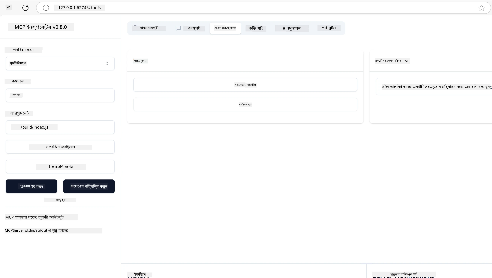
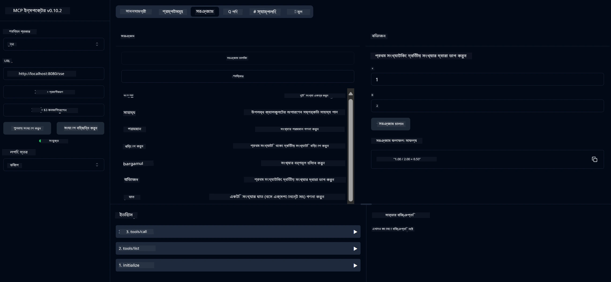
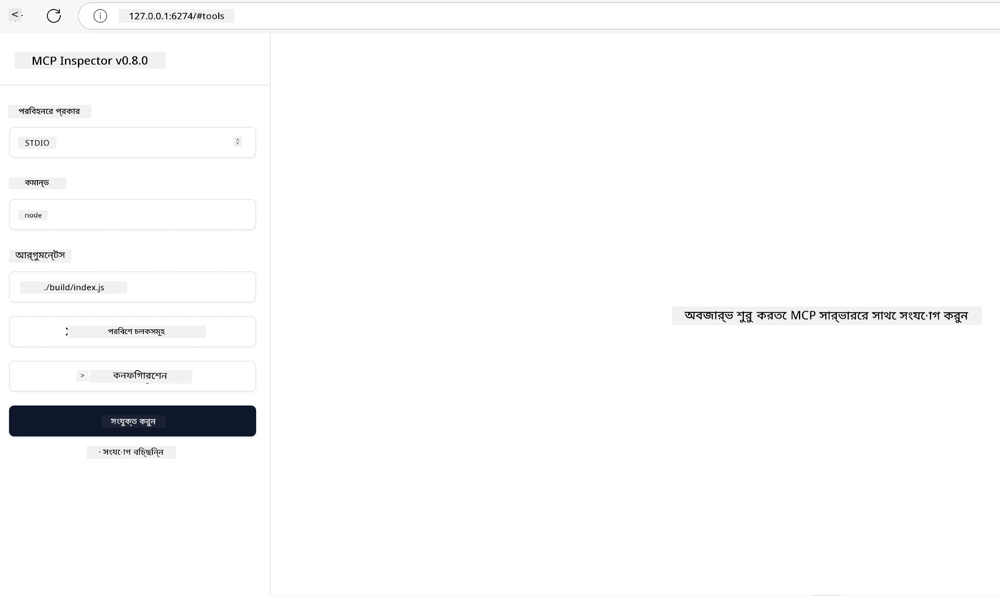
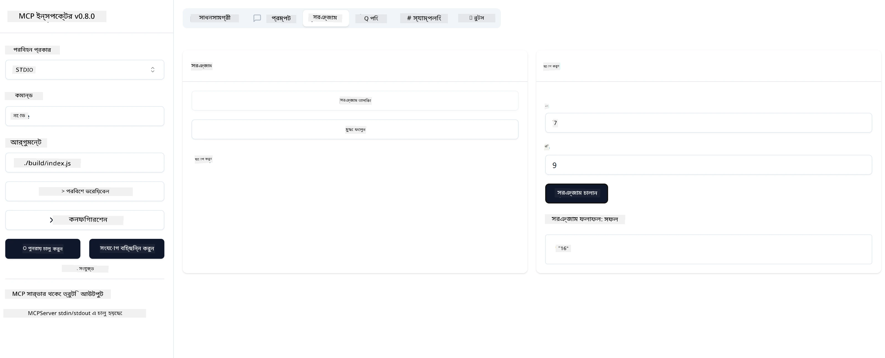

# MCP দিয়ে শুরু করা

Model Context Protocol (MCP) দিয়ে আপনার প্রথম পদক্ষেপে স্বাগতম! আপনি MCP-তে নতুন হোন বা আপনার বোঝাপড়া গভীর করতে চান, এই গাইডটি আপনাকে প্রয়োজনীয় সেটআপ এবং উন্নয়ন প্রক্রিয়ার মাধ্যমে নিয়ে যাবে। আপনি জানতে পারবেন কিভাবে MCP AI মডেল এবং অ্যাপ্লিকেশনগুলির মধ্যে নির্বিঘ্ন সংযোগ সক্ষম করে, এবং দ্রুত আপনার পরিবেশ প্রস্তুত করে MCP-চালিত সমাধান তৈরি ও পরীক্ষা করার পদ্ধতি।

> সংক্ষিপ্তসার; আপনি যদি AI অ্যাপ তৈরি করেন, তবে আপনি জানেন যে আপনি আপনার LLM (বড় ভাষা মডেল) এ টুল এবং অন্যান্য সম্পদ যোগ করতে পারেন, যাতে LLM আরও জ্ঞানসম্পন্ন হয়। তবে যদি আপনি সেই টুল এবং সম্পদ সার্ভারে রাখেন, তাহলে অ্যাপ এবং সার্ভারের ক্ষমতাগুলো যেকোন ক্লায়েন্ট LLM সহ বা ছাড়াই ব্যবহার করতে পারে।

## ওভারভিউ

এই পাঠে MCP পরিবেশ সেটআপ এবং আপনার প্রথম MCP অ্যাপ্লিকেশন তৈরি করার জন্য ব্যবহারিক নির্দেশনা দেওয়া হয়েছে। আপনি শিখবেন প্রয়োজনীয় টুল এবং ফ্রেমওয়ার্ক সেটআপ করা, মৌলিক MCP সার্ভার তৈরি করা, হোস্ট অ্যাপ্লিকেশন তৈরি করা, এবং আপনার ইমপ্লিমেন্টেশন পরীক্ষা করা।

Model Context Protocol (MCP) একটি ওপেন প্রোটোকল যা অ্যাপ্লিকেশনগুলো কিভাবে LLM-কে প্রসঙ্গ প্রদান করে তা স্ট্যান্ডার্ডাইজ করে। MCP-কে ভাবুন AI অ্যাপ্লিকেশনের জন্য একটি USB-C পোর্টের মতো — এটি AI মডেলকে বিভিন্ন ডেটা উৎস এবং টুলের সাথে সংযুক্ত করার একটি স্ট্যান্ডার্ড পদ্ধতি প্রদান করে।

## শেখার উদ্দেশ্য

এই পাঠের শেষে, আপনি সক্ষম হবেন:

- C#, Java, Python, TypeScript, এবং Rust-এ MCP ডেভেলপমেন্ট পরিবেশ সেটআপ করতে
- কাস্টম ফিচার (সম্পদ, প্রম্পট, এবং টুল) সহ মৌলিক MCP সার্ভার তৈরি ও ডিপ্লয় করতে
- MCP সার্ভারের সাথে সংযুক্ত হোস্ট অ্যাপ্লিকেশন তৈরি করতে
- MCP ইমপ্লিমেন্টেশন পরীক্ষা ও ডিবাগ করতে

## আপনার MCP পরিবেশ সেটআপ করা

MCP নিয়ে কাজ শুরু করার আগে, আপনার ডেভেলপমেন্ট পরিবেশ প্রস্তুত করা এবং মৌলিক ওয়ার্কফ্লো বোঝা গুরুত্বপূর্ণ। এই অংশটি আপনাকে প্রাথমিক সেটআপ ধাপগুলোতে গাইড করবে যাতে MCP-র সাথে মসৃণ শুরু হয়।

### প্রয়োজনীয়তা

MCP ডেভেলপমেন্টে ডুব দেওয়ার আগে নিশ্চিত করুন আপনার কাছে আছে:

- **ডেভেলপমেন্ট পরিবেশ**: আপনার নির্বাচিত ভাষার জন্য (C#, Java, Python, TypeScript, অথবা Rust)
- **IDE/এডিটর**: Visual Studio, Visual Studio Code, IntelliJ, Eclipse, PyCharm, অথবা যেকোন আধুনিক কোড এডিটর
- **প্যাকেজ ম্যানেজার**: NuGet, Maven/Gradle, pip, npm/yarn, অথবা Cargo
- **API কী**: যেকোন AI সার্ভিসের জন্য যা আপনি আপনার হোস্ট অ্যাপ্লিকেশনে ব্যবহার করতে চান

## মৌলিক MCP সার্ভার স্ট্রাকচার

একটি MCP সার্ভারে সাধারণত থাকে:

- **সার্ভার কনফিগারেশন**: পোর্ট, অথেনটিকেশন, এবং অন্যান্য সেটিংস সেটআপ
- **সম্পদ**: LLM-কে উপলব্ধ ডেটা এবং প্রসঙ্গ
- **টুল**: মডেলগুলো যেগুলো কল করতে পারে এমন ফাংশনালিটি
- **প্রম্পট**: টেক্সট তৈরি বা গঠন করার টেমপ্লেট

TypeScript-এ একটি সরল উদাহরণ:

```typescript
import { McpServer, ResourceTemplate } from "@modelcontextprotocol/sdk/server/mcp.js";
import { StdioServerTransport } from "@modelcontextprotocol/sdk/server/stdio.js";
import { z } from "zod";

// একটি MCP সার্ভার তৈরি করুন
const server = new McpServer({
  name: "Demo",
  version: "1.0.0"
});

// একটি অ্যাডিশন টুল যোগ করুন
server.tool("add",
  { a: z.number(), b: z.number() },
  async ({ a, b }) => ({
    content: [{ type: "text", text: String(a + b) }]
  })
);

// একটি ডায়নামিক গ্রীটিং রিসোর্স যোগ করুন
server.resource(
  "file",
  // 'list' প্যারামিটারটি কন্ট্রোল করে রিসোর্সটি কীভাবে উপলব্ধ ফাইলগুলি তালিকাভুক্ত করে। এটিকে undefined সেট করলে এই রিসোর্সের জন্য তালিকা নিষ্ক্রিয় হয়।
  new ResourceTemplate("file://{path}", { list: undefined }),
  async (uri, { path }) => ({
    contents: [{
      uri: uri.href,
      text: `File, ${path}!`
    }]
  })
);

// একটি ফাইল রিসোর্স যোগ করুন যা ফাইলের বিষয়বস্তু পড়ে
server.resource(
  "file",
  new ResourceTemplate("file://{path}", { list: undefined }),
  async (uri, { path }) => {
    let text;
    try {
      text = await fs.readFile(path, "utf8");
    } catch (err) {
      text = `Error reading file: ${err.message}`;
    }
    return {
      contents: [{
        uri: uri.href,
        text
      }]
    };
  }
);

server.prompt(
  "review-code",
  { code: z.string() },
  ({ code }) => ({
    messages: [{
      role: "user",
      content: {
        type: "text",
        text: `Please review this code:\n\n${code}`
      }
    }]
  })
);

// stdin থেকে মেসেজ গ্রহণ শুরু করুন এবং stdout এ মেসেজ পাঠানো শুরু করুন
const transport = new StdioServerTransport();
await server.connect(transport);
```

উপরের কোডে আমরা:

- MCP TypeScript SDK থেকে প্রয়োজনীয় ক্লাসগুলো ইমপোর্ট করেছি।
- একটি নতুন MCP সার্ভার ইনস্ট্যান্স তৈরি ও কনফিগার করেছি।
- একটি কাস্টম টুল (`calculator`) একটি হ্যান্ডলার ফাংশনের সাথে রেজিস্টার করেছি।
- সার্ভার শুরু করেছি যাতে MCP অনুরোধ শোনে।

## পরীক্ষা ও ডিবাগিং

আপনার MCP সার্ভার পরীক্ষা শুরু করার আগে, উপলব্ধ টুল এবং ডিবাগিংয়ের সেরা অনুশীলনগুলো বোঝা গুরুত্বপূর্ণ। কার্যকর পরীক্ষা নিশ্চিত করে আপনার সার্ভার প্রত্যাশিতভাবে কাজ করছে এবং দ্রুত সমস্যা সনাক্ত ও সমাধান করতে সাহায্য করে। নিম্নলিখিত অংশে MCP ইমপ্লিমেন্টেশন যাচাই করার সুপারিশকৃত পদ্ধতি বর্ণনা করা হয়েছে।

MCP আপনাকে সার্ভার পরীক্ষা ও ডিবাগ করতে সাহায্য করার জন্য টুল সরবরাহ করে:

- **Inspector টুল**, এই গ্রাফিক্যাল ইন্টারফেস আপনাকে সার্ভারের সাথে সংযোগ করতে এবং আপনার টুল, প্রম্পট এবং সম্পদ পরীক্ষা করতে দেয়।
- **curl**, আপনি curl বা অন্য কোনো HTTP কমান্ড তৈরি ও চালাতে সক্ষম ক্লায়েন্ট ব্যবহার করে সার্ভারের সাথে সংযোগ করতে পারেন।

### MCP Inspector ব্যবহার

[MCP Inspector](https://github.com/modelcontextprotocol/inspector) একটি ভিজ্যুয়াল টেস্টিং টুল যা আপনাকে সাহায্য করে:

1. **সার্ভার ক্ষমতা আবিষ্কার করা**: স্বয়ংক্রিয়ভাবে উপলব্ধ সম্পদ, টুল, এবং প্রম্পট সনাক্ত করা
2. **টুল এক্সিকিউশন পরীক্ষা করা**: বিভিন্ন প্যারামিটার চেষ্টা করা এবং রিয়েল-টাইমে প্রতিক্রিয়া দেখা
3. **সার্ভার মেটাডেটা দেখা**: সার্ভার তথ্য, স্কিমা, এবং কনফিগারেশন পরীক্ষা করা

```bash
# উদাহরণ TypeScript, MCP Inspector ইনস্টল এবং চালানো
npx @modelcontextprotocol/inspector node build/index.js
```

উপরের কমান্ডগুলো চালানোর সময়, MCP Inspector আপনার ব্রাউজারে একটি লোকাল ওয়েব ইন্টারফেস চালু করবে। আপনি একটি ড্যাশবোর্ড দেখতে পাবেন যেখানে আপনার রেজিস্টার করা MCP সার্ভার, তাদের উপলব্ধ টুল, সম্পদ, এবং প্রম্পট প্রদর্শিত হবে। ইন্টারফেসটি আপনাকে ইন্টারেক্টিভভাবে টুল এক্সিকিউশন পরীক্ষা করতে, সার্ভার মেটাডেটা পরিদর্শন করতে, এবং রিয়েল-টাইম প্রতিক্রিয়া দেখতে দেয়, যা MCP সার্ভার ইমপ্লিমেন্টেশন যাচাই ও ডিবাগ করা সহজ করে।

এখানে এর একটি স্ক্রিনশট:



## সাধারণ সেটআপ সমস্যা এবং সমাধান

| সমস্যা | সম্ভাব্য সমাধান |
|-------|-------------------|
| সংযোগ প্রত্যাখ্যাত | সার্ভার চলছে কিনা এবং পোর্ট সঠিক কিনা পরীক্ষা করুন |
| টুল এক্সিকিউশন ত্রুটি | প্যারামিটার যাচাই এবং ত্রুটি হ্যান্ডলিং পর্যালোচনা করুন |
| অথেনটিকেশন ব্যর্থতা | API কী এবং অনুমতি যাচাই করুন |
| স্কিমা যাচাই ত্রুটি | প্যারামিটার সংজ্ঞায়িত স্কিমার সাথে মেলে কিনা নিশ্চিত করুন |
| সার্ভার শুরু হচ্ছে না | পোর্ট সংঘর্ষ বা অনুপস্থিত নির্ভরতা পরীক্ষা করুন |
| CORS ত্রুটি | ক্রস-অরিজিন অনুরোধের জন্য সঠিক CORS হেডার কনফিগার করুন |
| অথেনটিকেশন সমস্যা | টোকেন বৈধতা এবং অনুমতি যাচাই করুন |

## লোকাল ডেভেলপমেন্ট

লোকাল ডেভেলপমেন্ট এবং পরীক্ষার জন্য, আপনি সরাসরি আপনার মেশিনে MCP সার্ভার চালাতে পারেন:

1. **সার্ভার প্রসেস শুরু করুন**: আপনার MCP সার্ভার অ্যাপ্লিকেশন চালান
2. **নেটওয়ার্কিং কনফিগার করুন**: নিশ্চিত করুন সার্ভার প্রত্যাশিত পোর্টে অ্যাক্সেসযোগ্য
3. **ক্লায়েন্ট সংযোগ করুন**: লোকাল সংযোগ URL যেমন `http://localhost:3000` ব্যবহার করুন

```bash
# উদাহরণ: একটি টাইপস্ক্রিপ্ট MCP সার্ভার লোকালি চালানো
npm run start
# সার্ভার চলছে http://localhost:3000 এ
```

## আপনার প্রথম MCP সার্ভার তৈরি করা

আমরা পূর্ববর্তী পাঠে [কোর ধারণা](/01-CoreConcepts/README.md) আলোচনা করেছি, এখন সেই জ্ঞান কাজে লাগানোর সময়।

### সার্ভার কী করতে পারে

কোড লেখা শুরু করার আগে, চলুন মনে করিয়ে দিই সার্ভার কী করতে পারে:

একটি MCP সার্ভার উদাহরণস্বরূপ করতে পারে:

- লোকাল ফাইল এবং ডাটাবেস অ্যাক্সেস করা
- রিমোট API-তে সংযোগ করা
- গণনা সম্পাদন করা
- অন্যান্য টুল এবং সার্ভিসের সাথে ইন্টিগ্রেশন করা
- ইন্টারঅ্যাকশনের জন্য একটি ইউজার ইন্টারফেস প্রদান করা

দারুণ, এখন আমরা জানি সার্ভার কী করতে পারে, চলুন কোড লেখা শুরু করি।

## অনুশীলন: একটি সার্ভার তৈরি করা

সার্ভার তৈরি করতে আপনাকে নিম্নলিখিত ধাপগুলো অনুসরণ করতে হবে:

- MCP SDK ইনস্টল করুন।
- একটি প্রজেক্ট তৈরি করুন এবং প্রজেক্ট স্ট্রাকচার সেটআপ করুন।
- সার্ভার কোড লিখুন।
- সার্ভার পরীক্ষা করুন।

### -1- প্রজেক্ট তৈরি করা

#### TypeScript

```sh
# প্রকল্প ডিরেক্টরি তৈরি করুন এবং npm প্রকল্প আরম্ভ করুন
mkdir calculator-server
cd calculator-server
npm init -y
```

#### Python

```sh
# প্রকল্প ডিরেক্টরি তৈরি করুন
mkdir calculator-server
cd calculator-server
# Visual Studio Code-এ ফোল্ডারটি খুলুন - আপনি যদি অন্য কোনো IDE ব্যবহার করেন তবে এটি এড়িয়ে যান
code .
```

#### .NET

```sh
dotnet new console -n McpCalculatorServer
cd McpCalculatorServer
```

#### Java

Java-র জন্য, একটি Spring Boot প্রজেক্ট তৈরি করুন:

```bash
curl https://start.spring.io/starter.zip \
  -d dependencies=web \
  -d javaVersion=21 \
  -d type=maven-project \
  -d groupId=com.example \
  -d artifactId=calculator-server \
  -d name=McpServer \
  -d packageName=com.microsoft.mcp.sample.server \
  -o calculator-server.zip
```

জিপ ফাইল আনজিপ করুন:

```bash
unzip calculator-server.zip -d calculator-server
cd calculator-server
# ঐচ্ছিকভাবে ব্যবহার না করা টেস্ট মুছে ফেলুন
rm -rf src/test/java
```

আপনার *pom.xml* ফাইলে নিম্নলিখিত সম্পূর্ণ কনফিগারেশন যোগ করুন:

```xml
<?xml version="1.0" encoding="UTF-8"?>
<project xmlns="http://maven.apache.org/POM/4.0.0"
    xmlns:xsi="http://www.w3.org/2001/XMLSchema-instance"
    xsi:schemaLocation="http://maven.apache.org/POM/4.0.0 http://maven.apache.org/xsd/maven-4.0.0.xsd">
    <modelVersion>4.0.0</modelVersion>
    
    <!-- Spring Boot parent for dependency management -->
    <parent>
        <groupId>org.springframework.boot</groupId>
        <artifactId>spring-boot-starter-parent</artifactId>
        <version>3.5.0</version>
        <relativePath />
    </parent>

    <!-- Project coordinates -->
    <groupId>com.example</groupId>
    <artifactId>calculator-server</artifactId>
    <version>0.0.1-SNAPSHOT</version>
    <name>Calculator Server</name>
    <description>Basic calculator MCP service for beginners</description>

    <!-- Properties -->
    <properties>
        <java.version>21</java.version>
        <maven.compiler.source>21</maven.compiler.source>
        <maven.compiler.target>21</maven.compiler.target>
    </properties>

    <!-- Spring AI BOM for version management -->
    <dependencyManagement>
        <dependencies>
            <dependency>
                <groupId>org.springframework.ai</groupId>
                <artifactId>spring-ai-bom</artifactId>
                <version>1.0.0-SNAPSHOT</version>
                <type>pom</type>
                <scope>import</scope>
            </dependency>
        </dependencies>
    </dependencyManagement>

    <!-- Dependencies -->
    <dependencies>
        <dependency>
            <groupId>org.springframework.ai</groupId>
            <artifactId>spring-ai-starter-mcp-server-webflux</artifactId>
        </dependency>
        <dependency>
            <groupId>org.springframework.boot</groupId>
            <artifactId>spring-boot-starter-actuator</artifactId>
        </dependency>
        <dependency>
         <groupId>org.springframework.boot</groupId>
         <artifactId>spring-boot-starter-test</artifactId>
         <scope>test</scope>
      </dependency>
    </dependencies>

    <!-- Build configuration -->
    <build>
        <plugins>
            <plugin>
                <groupId>org.springframework.boot</groupId>
                <artifactId>spring-boot-maven-plugin</artifactId>
            </plugin>
            <plugin>
                <groupId>org.apache.maven.plugins</groupId>
                <artifactId>maven-compiler-plugin</artifactId>
                <configuration>
                    <release>21</release>
                </configuration>
            </plugin>
        </plugins>
    </build>

    <!-- Repositories for Spring AI snapshots -->
    <repositories>
        <repository>
            <id>spring-milestones</id>
            <name>Spring Milestones</name>
            <url>https://repo.spring.io/milestone</url>
            <snapshots>
                <enabled>false</enabled>
            </snapshots>
        </repository>
        <repository>
            <id>spring-snapshots</id>
            <name>Spring Snapshots</name>
            <url>https://repo.spring.io/snapshot</url>
            <releases>
                <enabled>false</enabled>
            </releases>
        </repository>
    </repositories>
</project>
```

#### Rust

```sh
mkdir calculator-server
cd calculator-server
cargo init
```

### -2- ডিপেন্ডেন্সি যোগ করা

এখন আপনার প্রজেক্ট তৈরি হয়ে গেছে, চলুন ডিপেন্ডেন্সি যোগ করি:

#### TypeScript

```sh
# যদি ইতিমধ্যে ইনস্টল না করা থাকে, তাহলে TypeScript গ্লোবালি ইনস্টল করুন
npm install typescript -g

# MCP SDK এবং স্কিমা ভ্যালিডেশনের জন্য Zod ইনস্টল করুন
npm install @modelcontextprotocol/sdk zod
npm install -D @types/node typescript
```

#### Python

```sh
# একটি ভার্চুয়াল এনভায়রনমেন্ট তৈরি করুন এবং নির্ভরশীলতাগুলি ইনস্টল করুন
python -m venv venv
venv\Scripts\activate
pip install "mcp[cli]"
```

#### Java

```bash
cd calculator-server
./mvnw clean install -DskipTests
```

#### Rust

```sh
cargo add rmcp --features server,transport-io
cargo add serde
cargo add tokio --features rt-multi-thread
```

### -3- প্রজেক্ট ফাইল তৈরি করা

#### TypeScript

*package.json* ফাইলটি খুলুন এবং সার্ভার তৈরি ও চালানোর জন্য নিম্নলিখিত বিষয়বস্তু দিয়ে প্রতিস্থাপন করুন:

```json
{
  "name": "calculator-server",
  "version": "1.0.0",
  "main": "index.js",
  "type": "module",
  "scripts": {
    "build": "tsc",
    "start": "npm run build && node ./build/index.js",
  },
  "keywords": [],
  "author": "",
  "license": "ISC",
  "description": "A simple calculator server using Model Context Protocol",
  "dependencies": {
    "@modelcontextprotocol/sdk": "^1.16.0",
    "zod": "^3.25.76"
  },
  "devDependencies": {
    "@types/node": "^24.0.14",
    "typescript": "^5.8.3"
  }
}
```

একটি *tsconfig.json* তৈরি করুন নিম্নলিখিত বিষয়বস্তু সহ:

```json
{
  "compilerOptions": {
    "target": "ES2022",
    "module": "Node16",
    "moduleResolution": "Node16",
    "outDir": "./build",
    "rootDir": "./src",
    "strict": true,
    "esModuleInterop": true,
    "skipLibCheck": true,
    "forceConsistentCasingInFileNames": true
  },
  "include": ["src/**/*"],
  "exclude": ["node_modules"]
}
```

আপনার সোর্স কোডের জন্য একটি ডিরেক্টরি তৈরি করুন:

```sh
mkdir src
touch src/index.ts
```

#### Python

*server.py* নামে একটি ফাইল তৈরি করুন

```sh
touch server.py
```

#### .NET

প্রয়োজনীয় NuGet প্যাকেজ ইনস্টল করুন:

```sh
dotnet add package ModelContextProtocol --prerelease
dotnet add package Microsoft.Extensions.Hosting
```

#### Java

Java Spring Boot প্রজেক্টের জন্য, প্রজেক্ট স্ট্রাকচার স্বয়ংক্রিয়ভাবে তৈরি হয়।

#### Rust

Rust-এ, `cargo init` চালানোর সময় একটি *src/main.rs* ফাইল ডিফল্টভাবে তৈরি হয়। ফাইলটি খুলুন এবং ডিফল্ট কোড মুছে ফেলুন।

### -4- সার্ভার কোড তৈরি করা

#### TypeScript

*index.ts* নামে একটি ফাইল তৈরি করুন এবং নিম্নলিখিত কোড যোগ করুন:

```typescript
import { McpServer, ResourceTemplate } from "@modelcontextprotocol/sdk/server/mcp.js";
import { StdioServerTransport } from "@modelcontextprotocol/sdk/server/stdio.js";
import { z } from "zod";
 
// একটি MCP সার্ভার তৈরি করুন
const server = new McpServer({
  name: "Calculator MCP Server",
  version: "1.0.0"
});
```

এখন আপনার একটি সার্ভার আছে, কিন্তু এটি বেশি কিছু করে না, চলুন ঠিক করি।

#### Python

```python
# server.py
from mcp.server.fastmcp import FastMCP

# একটি MCP সার্ভার তৈরি করুন
mcp = FastMCP("Demo")
```

#### .NET

```csharp
using Microsoft.Extensions.DependencyInjection;
using Microsoft.Extensions.Hosting;
using Microsoft.Extensions.Logging;
using ModelContextProtocol.Server;
using System.ComponentModel;

var builder = Host.CreateApplicationBuilder(args);
builder.Logging.AddConsole(consoleLogOptions =>
{
    // Configure all logs to go to stderr
    consoleLogOptions.LogToStandardErrorThreshold = LogLevel.Trace;
});

builder.Services
    .AddMcpServer()
    .WithStdioServerTransport()
    .WithToolsFromAssembly();
await builder.Build().RunAsync();

// add features
```

#### Java

Java-র জন্য, মূল সার্ভার কম্পোনেন্ট তৈরি করুন। প্রথমে, মেইন অ্যাপ্লিকেশন ক্লাস পরিবর্তন করুন:

*src/main/java/com/microsoft/mcp/sample/server/McpServerApplication.java*:

```java
package com.microsoft.mcp.sample.server;

import org.springframework.ai.tool.ToolCallbackProvider;
import org.springframework.ai.tool.method.MethodToolCallbackProvider;
import org.springframework.boot.SpringApplication;
import org.springframework.boot.autoconfigure.SpringBootApplication;
import org.springframework.context.annotation.Bean;
import com.microsoft.mcp.sample.server.service.CalculatorService;

@SpringBootApplication
public class McpServerApplication {

    public static void main(String[] args) {
        SpringApplication.run(McpServerApplication.class, args);
    }
    
    @Bean
    public ToolCallbackProvider calculatorTools(CalculatorService calculator) {
        return MethodToolCallbackProvider.builder().toolObjects(calculator).build();
    }
}
```

ক্যালকুলেটর সার্ভিস তৈরি করুন *src/main/java/com/microsoft/mcp/sample/server/service/CalculatorService.java*:

```java
package com.microsoft.mcp.sample.server.service;

import org.springframework.ai.tool.annotation.Tool;
import org.springframework.stereotype.Service;

/**
 * Service for basic calculator operations.
 * This service provides simple calculator functionality through MCP.
 */
@Service
public class CalculatorService {

    /**
     * Add two numbers
     * @param a The first number
     * @param b The second number
     * @return The sum of the two numbers
     */
    @Tool(description = "Add two numbers together")
    public String add(double a, double b) {
        double result = a + b;
        return formatResult(a, "+", b, result);
    }

    /**
     * Subtract one number from another
     * @param a The number to subtract from
     * @param b The number to subtract
     * @return The result of the subtraction
     */
    @Tool(description = "Subtract the second number from the first number")
    public String subtract(double a, double b) {
        double result = a - b;
        return formatResult(a, "-", b, result);
    }

    /**
     * Multiply two numbers
     * @param a The first number
     * @param b The second number
     * @return The product of the two numbers
     */
    @Tool(description = "Multiply two numbers together")
    public String multiply(double a, double b) {
        double result = a * b;
        return formatResult(a, "*", b, result);
    }

    /**
     * Divide one number by another
     * @param a The numerator
     * @param b The denominator
     * @return The result of the division
     */
    @Tool(description = "Divide the first number by the second number")
    public String divide(double a, double b) {
        if (b == 0) {
            return "Error: Cannot divide by zero";
        }
        double result = a / b;
        return formatResult(a, "/", b, result);
    }

    /**
     * Calculate the power of a number
     * @param base The base number
     * @param exponent The exponent
     * @return The result of raising the base to the exponent
     */
    @Tool(description = "Calculate the power of a number (base raised to an exponent)")
    public String power(double base, double exponent) {
        double result = Math.pow(base, exponent);
        return formatResult(base, "^", exponent, result);
    }

    /**
     * Calculate the square root of a number
     * @param number The number to find the square root of
     * @return The square root of the number
     */
    @Tool(description = "Calculate the square root of a number")
    public String squareRoot(double number) {
        if (number < 0) {
            return "Error: Cannot calculate square root of a negative number";
        }
        double result = Math.sqrt(number);
        return String.format("√%.2f = %.2f", number, result);
    }

    /**
     * Calculate the modulus (remainder) of division
     * @param a The dividend
     * @param b The divisor
     * @return The remainder of the division
     */
    @Tool(description = "Calculate the remainder when one number is divided by another")
    public String modulus(double a, double b) {
        if (b == 0) {
            return "Error: Cannot divide by zero";
        }
        double result = a % b;
        return formatResult(a, "%", b, result);
    }

    /**
     * Calculate the absolute value of a number
     * @param number The number to find the absolute value of
     * @return The absolute value of the number
     */
    @Tool(description = "Calculate the absolute value of a number")
    public String absolute(double number) {
        double result = Math.abs(number);
        return String.format("|%.2f| = %.2f", number, result);
    }

    /**
     * Get help about available calculator operations
     * @return Information about available operations
     */
    @Tool(description = "Get help about available calculator operations")
    public String help() {
        return "Basic Calculator MCP Service\n\n" +
               "Available operations:\n" +
               "1. add(a, b) - Adds two numbers\n" +
               "2. subtract(a, b) - Subtracts the second number from the first\n" +
               "3. multiply(a, b) - Multiplies two numbers\n" +
               "4. divide(a, b) - Divides the first number by the second\n" +
               "5. power(base, exponent) - Raises a number to a power\n" +
               "6. squareRoot(number) - Calculates the square root\n" + 
               "7. modulus(a, b) - Calculates the remainder of division\n" +
               "8. absolute(number) - Calculates the absolute value\n\n" +
               "Example usage: add(5, 3) will return 5 + 3 = 8";
    }

    /**
     * Format the result of a calculation
     */
    private String formatResult(double a, String operator, double b, double result) {
        return String.format("%.2f %s %.2f = %.2f", a, operator, b, result);
    }
}
```

**প্রোডাকশন-রেডি সার্ভিসের জন্য ঐচ্ছিক কম্পোনেন্ট:**

স্টার্টআপ কনফিগারেশন তৈরি করুন *src/main/java/com/microsoft/mcp/sample/server/config/StartupConfig.java*:

```java
package com.microsoft.mcp.sample.server.config;

import org.springframework.boot.CommandLineRunner;
import org.springframework.context.annotation.Bean;
import org.springframework.context.annotation.Configuration;

@Configuration
public class StartupConfig {
    
    @Bean
    public CommandLineRunner startupInfo() {
        return args -> {
            System.out.println("\n" + "=".repeat(60));
            System.out.println("Calculator MCP Server is starting...");
            System.out.println("SSE endpoint: http://localhost:8080/sse");
            System.out.println("Health check: http://localhost:8080/actuator/health");
            System.out.println("=".repeat(60) + "\n");
        };
    }
}
```

হেলথ কন্ট্রোলার তৈরি করুন *src/main/java/com/microsoft/mcp/sample/server/controller/HealthController.java*:

```java
package com.microsoft.mcp.sample.server.controller;

import org.springframework.http.ResponseEntity;
import org.springframework.web.bind.annotation.GetMapping;
import org.springframework.web.bind.annotation.RestController;
import java.time.LocalDateTime;
import java.util.HashMap;
import java.util.Map;

@RestController
public class HealthController {
    
    @GetMapping("/health")
    public ResponseEntity<Map<String, Object>> healthCheck() {
        Map<String, Object> response = new HashMap<>();
        response.put("status", "UP");
        response.put("timestamp", LocalDateTime.now().toString());
        response.put("service", "Calculator MCP Server");
        return ResponseEntity.ok(response);
    }
}
```

এক্সসেপশন হ্যান্ডলার তৈরি করুন *src/main/java/com/microsoft/mcp/sample/server/exception/GlobalExceptionHandler.java*:

```java
package com.microsoft.mcp.sample.server.exception;

import org.springframework.http.HttpStatus;
import org.springframework.http.ResponseEntity;
import org.springframework.web.bind.annotation.ExceptionHandler;
import org.springframework.web.bind.annotation.RestControllerAdvice;

@RestControllerAdvice
public class GlobalExceptionHandler {

    @ExceptionHandler(IllegalArgumentException.class)
    public ResponseEntity<ErrorResponse> handleIllegalArgumentException(IllegalArgumentException ex) {
        ErrorResponse error = new ErrorResponse(
            "Invalid_Input", 
            "Invalid input parameter: " + ex.getMessage());
        return new ResponseEntity<>(error, HttpStatus.BAD_REQUEST);
    }

    public static class ErrorResponse {
        private String code;
        private String message;

        public ErrorResponse(String code, String message) {
            this.code = code;
            this.message = message;
        }

        // গেটারস
        public String getCode() { return code; }
        public String getMessage() { return message; }
    }
}
```

কাস্টম ব্যানার তৈরি করুন *src/main/resources/banner.txt*:

```text
_____      _            _       _             
 / ____|    | |          | |     | |            
| |     __ _| | ___ _   _| | __ _| |_ ___  _ __ 
| |    / _` | |/ __| | | | |/ _` | __/ _ \| '__|
| |___| (_| | | (__| |_| | | (_| | || (_) | |   
 \_____\__,_|_|\___|\__,_|_|\__,_|\__\___/|_|   
                                                
Calculator MCP Server v1.0
Spring Boot MCP Application
```

</details>

#### Rust

*src/main.rs* ফাইলের শীর্ষে নিম্নলিখিত কোড যোগ করুন। এটি আপনার MCP সার্ভারের জন্য প্রয়োজনীয় লাইব্রেরি এবং মডিউল ইমপোর্ট করে।

```rust
use rmcp::{
    handler::server::{router::tool::ToolRouter, tool::Parameters},
    model::{ServerCapabilities, ServerInfo},
    schemars, tool, tool_handler, tool_router,
    transport::stdio,
    ServerHandler, ServiceExt,
};
use std::error::Error;
```

ক্যালকুলেটর সার্ভার একটি সহজ সার্ভার হবে যা দুইটি সংখ্যা যোগ করতে পারে। চলুন একটি struct তৈরি করি যা ক্যালকুলেটর রিকোয়েস্ট উপস্থাপন করবে।

```rust
#[derive(Debug, serde::Deserialize, schemars::JsonSchema)]
pub struct CalculatorRequest {
    pub a: f64,
    pub b: f64,
}
```

পরবর্তী, একটি struct তৈরি করুন যা ক্যালকুলেটর সার্ভার উপস্থাপন করবে। এই struct টুল রাউটার ধারণ করবে, যা টুল রেজিস্টার করতে ব্যবহৃত হয়।

```rust
#[derive(Debug, Clone)]
pub struct Calculator {
    tool_router: ToolRouter<Self>,
}
```

এখন, আমরা `Calculator` struct ইমপ্লিমেন্ট করতে পারি যা সার্ভারের একটি নতুন ইনস্ট্যান্স তৈরি করবে এবং সার্ভার হ্যান্ডলার ইমপ্লিমেন্ট করবে সার্ভার তথ্য প্রদান করার জন্য।

```rust
#[tool_router]
impl Calculator {
    pub fn new() -> Self {
        Self {
            tool_router: Self::tool_router(),
        }
    }
}

#[tool_handler]
impl ServerHandler for Calculator {
    fn get_info(&self) -> ServerInfo {
        ServerInfo {
            instructions: Some("A simple calculator tool".into()),
            capabilities: ServerCapabilities::builder().enable_tools().build(),
            ..Default::default()
        }
    }
}
```

অবশেষে, মেইন ফাংশন ইমপ্লিমেন্ট করতে হবে সার্ভার শুরু করার জন্য। এই ফাংশন `Calculator` struct এর একটি ইনস্ট্যান্স তৈরি করবে এবং স্ট্যান্ডার্ড ইনপুট/আউটপুটের মাধ্যমে সার্ভিস দেবে।

```rust
#[tokio::main]
async fn main() -> Result<(), Box<dyn Error>> {
    let service = Calculator::new().serve(stdio()).await?;
    service.waiting().await?;
    Ok(())
}
```

সার্ভার এখন নিজ সম্পর্কে মৌলিক তথ্য প্রদান করার জন্য প্রস্তুত। পরবর্তী ধাপে আমরা একটি টুল যোগ করব যা যোগফল করবে।

### -5- একটি টুল এবং একটি সম্পদ যোগ করা

নিম্নলিখিত কোড যোগ করে একটি টুল এবং একটি সম্পদ যোগ করুন:

#### TypeScript

```typescript
server.tool(
  "add",
  { a: z.number(), b: z.number() },
  async ({ a, b }) => ({
    content: [{ type: "text", text: String(a + b) }]
  })
);

server.resource(
  "greeting",
  new ResourceTemplate("greeting://{name}", { list: undefined }),
  async (uri, { name }) => ({
    contents: [{
      uri: uri.href,
      text: `Hello, ${name}!`
    }]
  })
);
```

আপনার টুল প্যারামিটার `a` এবং `b` নেয় এবং একটি ফাংশন চালায় যা নিম্নলিখিত ফর্মে একটি প্রতিক্রিয়া তৈরি করে:

```typescript
{
  contents: [{
    type: "text", content: "some content"
  }]
}
```

আপনার সম্পদ একটি স্ট্রিং "greeting" এর মাধ্যমে অ্যাক্সেস করা হয় এবং একটি প্যারামিটার `name` নেয় এবং টুলের মতো একটি প্রতিক্রিয়া তৈরি করে:

```typescript
{
  uri: "<href>",
  text: "a text"
}
```

#### Python

```python
# একটি যোগ করার সরঞ্জাম যোগ করুন
@mcp.tool()
def add(a: int, b: int) -> int:
    """Add two numbers"""
    return a + b


# একটি গতিশীল অভিবাদন সম্পদ যোগ করুন
@mcp.resource("greeting://{name}")
def get_greeting(name: str) -> str:
    """Get a personalized greeting"""
    return f"Hello, {name}!"
```

উপরের কোডে আমরা:

- একটি টুল `add` সংজ্ঞায়িত করেছি যা প্যারামিটার `a` এবং `b` নেয়, উভয়ই পূর্ণসংখ্যা।
- একটি সম্পদ `greeting` তৈরি করেছি যা প্যারামিটার `name` নেয়।

#### .NET

এটি আপনার Program.cs ফাইলে যোগ করুন:

```csharp
[McpServerToolType]
public static class CalculatorTool
{
    [McpServerTool, Description("Adds two numbers")]
    public static string Add(int a, int b) => $"Sum {a + b}";
}
```

#### Java

টুলগুলো আগের ধাপে ইতিমধ্যে তৈরি হয়েছে।

#### Rust

`impl Calculator` ব্লকের ভিতরে একটি নতুন টুল যোগ করুন:

```rust
#[tool(description = "Adds a and b")]
async fn add(
    &self,
    Parameters(CalculatorRequest { a, b }): Parameters<CalculatorRequest>,
) -> String {
    (a + b).to_string()
}
```

### -6- চূড়ান্ত কোড

সার্ভার শুরু করার জন্য প্রয়োজনীয় শেষ কোড যোগ করি:

#### TypeScript

```typescript
// stdin এ মেসেজ গ্রহণ শুরু করুন এবং stdout এ মেসেজ পাঠানো শুরু করুন
const transport = new StdioServerTransport();
await server.connect(transport);
```

পুরো কোড এখানে:

```typescript
// index.ts
import { McpServer, ResourceTemplate } from "@modelcontextprotocol/sdk/server/mcp.js";
import { StdioServerTransport } from "@modelcontextprotocol/sdk/server/stdio.js";
import { z } from "zod";

// একটি MCP সার্ভার তৈরি করুন
const server = new McpServer({
  name: "Calculator MCP Server",
  version: "1.0.0"
});

// একটি যোগ করার টুল যোগ করুন
server.tool(
  "add",
  { a: z.number(), b: z.number() },
  async ({ a, b }) => ({
    content: [{ type: "text", text: String(a + b) }]
  })
);

// একটি গতিশীল অভিবাদন সম্পদ যোগ করুন
server.resource(
  "greeting",
  new ResourceTemplate("greeting://{name}", { list: undefined }),
  async (uri, { name }) => ({
    contents: [{
      uri: uri.href,
      text: `Hello, ${name}!`
    }]
  })
);

// stdin এ মেসেজ গ্রহণ শুরু করুন এবং stdout এ মেসেজ পাঠান শুরু করুন
const transport = new StdioServerTransport();
server.connect(transport);
```

#### Python

```python
# server.py
from mcp.server.fastmcp import FastMCP

# একটি MCP সার্ভার তৈরি করুন
mcp = FastMCP("Demo")


# একটি যোগ করার টুল যোগ করুন
@mcp.tool()
def add(a: int, b: int) -> int:
    """Add two numbers"""
    return a + b


# একটি গতিশীল অভিবাদন রিসোর্স যোগ করুন
@mcp.resource("greeting://{name}")
def get_greeting(name: str) -> str:
    """Get a personalized greeting"""
    return f"Hello, {name}!"

# প্রধান কার্যকরী ব্লক - সার্ভার চালানোর জন্য এটি প্রয়োজনীয়
if __name__ == "__main__":
    mcp.run()
```

#### .NET

নিম্নলিখিত বিষয়বস্তু সহ একটি Program.cs ফাইল তৈরি করুন:

```csharp
using Microsoft.Extensions.DependencyInjection;
using Microsoft.Extensions.Hosting;
using Microsoft.Extensions.Logging;
using ModelContextProtocol.Server;
using System.ComponentModel;

var builder = Host.CreateApplicationBuilder(args);
builder.Logging.AddConsole(consoleLogOptions =>
{
    // Configure all logs to go to stderr
    consoleLogOptions.LogToStandardErrorThreshold = LogLevel.Trace;
});

builder.Services
    .AddMcpServer()
    .WithStdioServerTransport()
    .WithToolsFromAssembly();
await builder.Build().RunAsync();

[McpServerToolType]
public static class CalculatorTool
{
    [McpServerTool, Description("Adds two numbers")]
    public static string Add(int a, int b) => $"Sum {a + b}";
}
```

#### Java

আপনার সম্পূর্ণ মেইন অ্যাপ্লিকেশন ক্লাস এরকম হওয়া উচিত:

```java
// McpServerApplication.java
package com.microsoft.mcp.sample.server;

import org.springframework.ai.tool.ToolCallbackProvider;
import org.springframework.ai.tool.method.MethodToolCallbackProvider;
import org.springframework.boot.SpringApplication;
import org.springframework.boot.autoconfigure.SpringBootApplication;
import org.springframework.context.annotation.Bean;
import com.microsoft.mcp.sample.server.service.CalculatorService;

@SpringBootApplication
public class McpServerApplication {

    public static void main(String[] args) {
        SpringApplication.run(McpServerApplication.class, args);
    }
    
    @Bean
    public ToolCallbackProvider calculatorTools(CalculatorService calculator) {
        return MethodToolCallbackProvider.builder().toolObjects(calculator).build();
    }
}
```

#### Rust

Rust সার্ভারের চূড়ান্ত কোড এরকম হওয়া উচিত:

```rust
use rmcp::{
    ServerHandler, ServiceExt,
    handler::server::{router::tool::ToolRouter, tool::Parameters},
    model::{ServerCapabilities, ServerInfo},
    schemars, tool, tool_handler, tool_router,
    transport::stdio,
};
use std::error::Error;

#[derive(Debug, serde::Deserialize, schemars::JsonSchema)]
pub struct CalculatorRequest {
    pub a: f64,
    pub b: f64,
}

#[derive(Debug, Clone)]
pub struct Calculator {
    tool_router: ToolRouter<Self>,
}

#[tool_router]
impl Calculator {
    pub fn new() -> Self {
        Self {
            tool_router: Self::tool_router(),
        }
    }
    
    #[tool(description = "Adds a and b")]
    async fn add(
        &self,
        Parameters(CalculatorRequest { a, b }): Parameters<CalculatorRequest>,
    ) -> String {
        (a + b).to_string()
    }
}

#[tool_handler]
impl ServerHandler for Calculator {
    fn get_info(&self) -> ServerInfo {
        ServerInfo {
            instructions: Some("A simple calculator tool".into()),
            capabilities: ServerCapabilities::builder().enable_tools().build(),
            ..Default::default()
        }
    }
}

#[tokio::main]
async fn main() -> Result<(), Box<dyn Error>> {
    let service = Calculator::new().serve(stdio()).await?;
    service.waiting().await?;
    Ok(())
}
```

### -7- সার্ভার পরীক্ষা করা

নিম্নলিখিত কমান্ড দিয়ে সার্ভার শুরু করুন:

#### TypeScript

```sh
npm run build
```

#### Python

```sh
mcp run server.py
```

> MCP Inspector ব্যবহার করতে, `mcp dev server.py` ব্যবহার করুন যা স্বয়ংক্রিয়ভাবে Inspector চালু করে এবং প্রয়োজনীয় প্রোক্সি সেশন টোকেন প্রদান করে। যদি `mcp run server.py` ব্যবহার করেন, তবে আপনাকে ম্যানুয়ালি Inspector চালু করে সংযোগ কনফিগার করতে হবে।

#### .NET

নিশ্চিত করুন আপনি আপনার প্রজেক্ট ডিরেক্টরিতে আছেন:

```sh
cd McpCalculatorServer
dotnet run
```

#### Java

```bash
./mvnw clean install -DskipTests
java -jar target/calculator-server-0.0.1-SNAPSHOT.jar
```

#### Rust

সার্ভার ফরম্যাট এবং চালানোর জন্য নিম্নলিখিত কমান্ড চালান:

```sh
cargo fmt
cargo run
```

### -8- Inspector ব্যবহার করে চালানো

Inspector একটি চমৎকার টুল যা আপনার সার্ভার শুরু করতে পারে এবং আপনাকে এর সাথে ইন্টারঅ্যাক্ট করতে দেয় যাতে আপনি পরীক্ষা করতে পারেন এটি কাজ করছে কিনা। চলুন শুরু করি:

> [!NOTE]
> "command" ফিল্ডে এটি ভিন্ন দেখাতে পারে কারণ এতে আপনার নির্দিষ্ট রানটাইমের জন্য সার্ভার চালানোর কমান্ড থাকে।

#### TypeScript

```sh
npx @modelcontextprotocol/inspector node build/index.js
```

অথবা এটি আপনার *package.json* এ এভাবে যোগ করুন: `"inspector": "npx @modelcontextprotocol/inspector node build/index.js"` এবং তারপর `npm run inspector` চালান

#### Python

Python একটি Node.js টুল inspector কে র‍্যাপ করে। এই টুলটি এভাবে কল করা যেতে পারে:

```sh
mcp dev server.py
```

তবে, এটি টুলে উপলব্ধ সব পদ্ধতি ইমপ্লিমেন্ট করে না, তাই আপনাকে সরাসরি নিচের মতো Node.js টুল চালানোর পরামর্শ দেওয়া হয়:

```sh
npx @modelcontextprotocol/inspector mcp run server.py
```

যদি আপনি এমন কোনো টুল বা IDE ব্যবহার করেন যা স্ক্রিপ্ট চালানোর জন্য কমান্ড এবং আর্গুমেন্ট কনফিগার করতে দেয়,
নিশ্চিত করুন `Command` ফিল্ডে `python` সেট করা আছে এবং `Arguments` হিসেবে `server.py` আছে। এটি নিশ্চিত করে যে স্ক্রিপ্টটি সঠিকভাবে চলবে।

#### .NET

নিশ্চিত করুন আপনি আপনার প্রকল্প ডিরেক্টরিতে আছেন:

```sh
cd McpCalculatorServer
npx @modelcontextprotocol/inspector dotnet run
```

#### Java

নিশ্চিত করুন আপনার calculator server চলছে
তারপর inspector চালান:

```cmd
npx @modelcontextprotocol/inspector
```

inspector ওয়েব ইন্টারফেসে:

1. "SSE" ট্রান্সপোর্ট টাইপ হিসেবে নির্বাচন করুন
2. URL সেট করুন: `http://localhost:8080/sse`
3. "Connect" ক্লিক করুন



**আপনি এখন সার্ভারের সাথে সংযুক্ত**
**Java সার্ভার টেস্টিং সেকশন এখন সম্পন্ন হয়েছে**

পরবর্তী সেকশনটি সার্ভারের সাথে ইন্টারঅ্যাক্ট করার বিষয়ে।

আপনি নিম্নলিখিত ইউজার ইন্টারফেস দেখতে পাবেন:



1. Connect বাটন নির্বাচন করে সার্ভারের সাথে সংযুক্ত হন
  সংযুক্ত হওয়ার পর, আপনি নিম্নলিখিত দেখতে পাবেন:

  

1. "Tools" এবং "listTools" নির্বাচন করুন, আপনি "Add" দেখতে পাবেন, "Add" নির্বাচন করুন এবং প্যারামিটার মান পূরণ করুন।

  আপনি নিম্নলিখিত প্রতিক্রিয়া দেখতে পাবেন, অর্থাৎ "add" টুল থেকে একটি ফলাফল:

  

অভিনন্দন, আপনি আপনার প্রথম সার্ভার তৈরি এবং চালাতে সক্ষম হয়েছেন!

#### Rust

MCP Inspector CLI দিয়ে Rust সার্ভার চালাতে নিম্নলিখিত কমান্ড ব্যবহার করুন:

```sh
npx @modelcontextprotocol/inspector cargo run --cli --method tools/call --tool-name add --tool-arg a=1 b=2
```

### অফিসিয়াল SDKs

MCP বিভিন্ন ভাষার জন্য অফিসিয়াল SDK প্রদান করে:

- [C# SDK](https://github.com/modelcontextprotocol/csharp-sdk) - Microsoft এর সাথে সহযোগিতায় রক্ষণাবেক্ষণ
- [Java SDK](https://github.com/modelcontextprotocol/java-sdk) - Spring AI এর সাথে সহযোগিতায় রক্ষণাবেক্ষণ
- [TypeScript SDK](https://github.com/modelcontextprotocol/typescript-sdk) - অফিসিয়াল TypeScript ইমপ্লিমেন্টেশন
- [Python SDK](https://github.com/modelcontextprotocol/python-sdk) - অফিসিয়াল Python ইমপ্লিমেন্টেশন
- [Kotlin SDK](https://github.com/modelcontextprotocol/kotlin-sdk) - অফিসিয়াল Kotlin ইমপ্লিমেন্টেশন
- [Swift SDK](https://github.com/modelcontextprotocol/swift-sdk) - Loopwork AI এর সাথে সহযোগিতায় রক্ষণাবেক্ষণ
- [Rust SDK](https://github.com/modelcontextprotocol/rust-sdk) - অফিসিয়াল Rust ইমপ্লিমেন্টেশন

## মূল বিষয়সমূহ

- MCP ডেভেলপমেন্ট পরিবেশ সেটআপ ভাষা-নির্দিষ্ট SDK দিয়ে সহজ
- MCP সার্ভার তৈরি মানে স্পষ্ট স্কিমা সহ টুল তৈরি ও নিবন্ধন করা
- টেস্টিং এবং ডিবাগিং MCP ইমপ্লিমেন্টেশনের জন্য অপরিহার্য

## নমুনা

- [Java Calculator](../samples/java/calculator/README.md)
- [.Net Calculator](../../../../03-GettingStarted/samples/csharp)
- [JavaScript Calculator](../samples/javascript/README.md)
- [TypeScript Calculator](../samples/typescript/README.md)
- [Python Calculator](../../../../03-GettingStarted/samples/python)
- [Rust Calculator](../../../../03-GettingStarted/samples/rust)

## অ্যাসাইনমেন্ট

আপনার পছন্দের একটি টুল নিয়ে একটি সহজ MCP সার্ভার তৈরি করুন:

1. আপনার পছন্দের ভাষায় টুল ইমপ্লিমেন্ট করুন (.NET, Java, Python, TypeScript, অথবা Rust)।
2. ইনপুট প্যারামিটার এবং রিটার্ন মান নির্ধারণ করুন।
3. সার্ভার সঠিকভাবে কাজ করছে কিনা তা নিশ্চিত করতে inspector টুল চালান।
4. বিভিন্ন ইনপুট দিয়ে ইমপ্লিমেন্টেশন পরীক্ষা করুন।

## সমাধান

[Solution](./solution/README.md)

## অতিরিক্ত সম্পদ

- [Azure-এ Model Context Protocol ব্যবহার করে এজেন্ট তৈরি](https://learn.microsoft.com/azure/developer/ai/intro-agents-mcp)
- [Azure Container Apps (Node.js/TypeScript/JavaScript) সহ রিমোট MCP](https://learn.microsoft.com/samples/azure-samples/mcp-container-ts/mcp-container-ts/)
- [.NET OpenAI MCP Agent](https://learn.microsoft.com/samples/azure-samples/openai-mcp-agent-dotnet/openai-mcp-agent-dotnet/)

## পরবর্তী ধাপ

পরবর্তী: [MCP ক্লায়েন্ট দিয়ে শুরু করা](../02-client/README.md)

---

<!-- CO-OP TRANSLATOR DISCLAIMER START -->
**অস্বীকৃতি**:  
এই নথিটি AI অনুবাদ সেবা [Co-op Translator](https://github.com/Azure/co-op-translator) ব্যবহার করে অনূদিত হয়েছে। আমরা যথাসাধ্য সঠিকতার চেষ্টা করি, তবে স্বয়ংক্রিয় অনুবাদে ত্রুটি বা অসঙ্গতি থাকতে পারে। মূল নথিটি তার নিজস্ব ভাষায়ই কর্তৃত্বপূর্ণ উৎস হিসেবে বিবেচিত হওয়া উচিত। গুরুত্বপূর্ণ তথ্যের জন্য পেশাদার মানব অনুবাদ গ্রহণ করার পরামর্শ দেওয়া হয়। এই অনুবাদের ব্যবহারে সৃষ্ট কোনো ভুল বোঝাবুঝি বা ভুল ব্যাখ্যার জন্য আমরা দায়ী নই।
<!-- CO-OP TRANSLATOR DISCLAIMER END -->