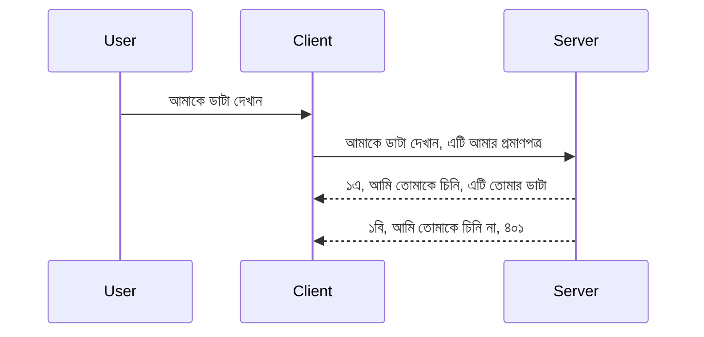

# সরল প্রমাণীকরণ

MCP SDKs OAuth 2.1 ব্যবহারের জন্য সমর্থন করে যা একপ্রকার জটিল প্রক্রিয়া যার মধ্যে রয়েছে auth সার্ভার, resource সার্ভার, ক্রেডেনশিয়াল পাঠানো, কোড পাওয়া, কোড বিনিময়ে bearer token নেওয়া যতক্ষণ না আপনি অবশেষে আপনার resource ডেটা পেতে পারেন। যদি আপনি OAuth ব্যবহারে অভ্যস্ত না হন, যা বাস্তবায়ন করার জন্য একটি দুর্দান্ত বিষয়, তাহলে এটি একটি ভাল ধারণা কিছু মৌলিক পর্যায়ের auth দিয়ে শুরু করা এবং ক্রমশ উন্নত নিরাপত্তার দিকে এগোনো। এজন্যই এই অধ্যায়টি বিদ্যমান, আপনাকে বেশি উন্নত auth এর দিকে গড়তে।

## auth বলতে আমরা কী বুঝাই?

auth হল authentication এবং authorization এর সংক্ষিপ্ত রূপ। ধারণা হল আমরা দুটি কাজ করতে পারি:

- **Authentication**, যা প্রক্রিয়া বুঝতে দেয় যে আমরা একজন ব্যক্তিকে আমাদের বাড়িতে ঢুকতে দিন, অর্থাৎ তাদের "এখানে" থাকার অধিকার রয়েছে যা MCP সার্ভারের ফিচারগুলি স্থাপিত resource সার্ভারে অ্যাক্সেস পাওয়ার অধিকার রয়েছে।
- **Authorization**, হল প্রক্রিয়া নির্ধারণ করার যে একটি ব্যবহারকারী তাদের চাওয়া নির্দিষ্ট resource গুলিতে অ্যাক্সেস পাওয়া উচিত কিনা, উদাহরণস্বরূপ এই অর্ডার গুলো বা এই পণ্য গুলো বা তারা কেবল পড়তে পারবেন কিন্তু মুছে ফেলতে পারবেন না, অন্য একটি উদাহরণ হিসেবে।

## ক্রেডেনশিয়ালস: আমরা কীভাবে সিস্টেমকে বলি আমরা কে

প্রায় সব ওয়েব ডেভেলপার প্রথমেই সার্ভারকে একটি ক্রেডেনশিয়াল সরবরাহ করার কথা ভাবেন, সাধারণত একটি সিক্রেট যাতে বলে তারা এখানে থাকার অনুমতিপ্রাপ্ত "Authentication"। এই ক্রেডেনশিয়াল সাধারণত বেস64 এনকোডেড username এবং password এর সংস্করণ বা একটি API key যা নির্দিষ্ট ব্যবহারকারীকে ইউনিকভাবে চিহ্নিত করে।

এটি "Authorization" নামক হেডারের মাধ্যমে পাঠানো হয়, যেমন:

```json
{ "Authorization": "secret123" }
```

এটি সাধারণত basic authentication বলা হয়। পুরো ফ্লো এর কাজ এরপর নিম্নরূপ:


এখন আমরা বুঝে গেছি ফ্লো হিসেবে এটি কীভাবে কাজ করে, কিভাবে আমরা তা বাস্তবায়িত করব? বেশিরভাগ ওয়েব সার্ভারে একটি.middleware ধারণা থাকে, একটি কোডের অংশ যা রিকোয়েস্টের অংশ হিসেবে চালিত হয় এবং ক্রেডেনশিয়াল যাচাই করতে পারে, এবং যদি ক্রেডেনশিয়াল বৈধ হয় তাহলে রিকোয়েস্টকে অতিক্রম করাতে পারে। যদি রিকোয়েস্টে বৈধ ক্রেডেনশিয়াল না থাকে তাহলে আপনি auth ত্রুটি পাবেন। আসুন দেখি এটি কিভাবে বাস্তবায়িত হতে পারে:

**পাইথন**

```python
class AuthMiddleware(BaseHTTPMiddleware):
    async def dispatch(self, request, call_next):

        has_header = request.headers.get("Authorization")
        if not has_header:
            print("-> Missing Authorization header!")
            return Response(status_code=401, content="Unauthorized")

        if not valid_token(has_header):
            print("-> Invalid token!")
            return Response(status_code=403, content="Forbidden")

        print("Valid token, proceeding...")
       
        response = await call_next(request)
        # যে কোনো গ্রাহক হেডার যোগ বা প্রতিক্রিয়ায় কোনও পরিবর্তন করুন
        return response


starlette_app.add_middleware(CustomHeaderMiddleware)
```

এখানে আছে:

- `AuthMiddleware` নামে একটি middleware তৈরি করেছি যেখানে এর `dispatch` পদ্ধতিটি ওয়েব সার্ভার দ্বারা আহ্বান করা হচ্ছে।
- ওয়েব সার্ভারে middleware যুক্ত করেছি:

    ```python
    starlette_app.add_middleware(AuthMiddleware)
    ```

- যাচাইয়ের লজিক লিখেছি যা চেক করে Authorization হেডার উপস্থিত আছে কিনা এবং পাঠানো সিক্রেট বৈধ কিনা:

    ```python
    has_header = request.headers.get("Authorization")
    if not has_header:
        print("-> Missing Authorization header!")
        return Response(status_code=401, content="Unauthorized")

    if not valid_token(has_header):
        print("-> Invalid token!")
        return Response(status_code=403, content="Forbidden")
    ```

যদি সিক্রেট উপস্থিত এবং বৈধ হয় তবে আমরা রিকোয়েস্টকে `call_next` কল করে চলতে দিয়ে রেসপন্স ফিরিয়ে দিই।

    ```python
    response = await call_next(request)
    # প্রতিক্রিয়ায় কোনও গ্রাহক হেডার যোগ করুন বা কিছুভাবে পরিবর্তন করুন
    return response
    ```

কাজটি এভাবে হয় যে যদি ওয়েব রিকোয়েস্ট সার্ভারের প্রতি করা হয় তাহলে middleware আহ্বান করা হবে এবং তার বাস্তবায়নের ভিত্তিতে এটি বা তো রিকোয়েস্টকে পাস করে দিবে অথবা একটি ত্রুটি ফিরিয়ে দেবে যা নির্দেশ করে ক্লায়েন্টকে এগিয়ে যেতে অনুমতি নেই।

**TypeScript**

এখানে আমরা জনপ্রিয় ফ্রেমওয়ার্ক express দিয়ে একটি middleware তৈরি করেছি এবং MCP সার্ভারে পৌঁছানোর আগে রিকোয়েস্ট ইন্টারসেপ্ট করেছি। কোডটি হল:

```typescript
function isValid(secret) {
    return secret === "secret123";
}

app.use((req, res, next) => {
    // ১. অনুমোদনের হেডার উপস্থিত আছে কি?
    if(!req.headers["Authorization"]) {
        res.status(401).send('Unauthorized');
    }
    
    let token = req.headers["Authorization"];

    // ২. বৈধতা পরীক্ষা করুন।
    if(!isValid(token)) {
        res.status(403).send('Forbidden');
    }

   
    console.log('Middleware executed');
    // ৩. অনুরোধ পাইপলাইনের পরবর্তী ধাপে অনুরোধটি পাঠানো হয়।
    next();
});
```

এই কোডে আমরা:

1. প্রথমে যাচাই করি Authorization হেডার আছে কি না, না থাকলে 401 ত্রুটি পাঠাই।
2. ক্রেডেনশিয়াল/টোকেন বৈধ কিনা নিশ্চিত করি, নয়ত 403 ত্রুটি পাঠাই।
3. অবশেষে রিকোয়েস্ট পাস করি এবং চাওয়া resource ফিরিয়ে দিই।

## অনুশীলন: প্রমাণীকরণ বাস্তবায়ন

আমাদের জ্ঞান ব্যবহার করে এটি বাস্তবায়নের চেষ্টা করি। পরিকল্পনাটি এইরকম:

সার্ভার

- একটি ওয়েব সার্ভার এবং MCP ইনস্ট্যান্স তৈরি করুন।
- সার্ভারের জন্য একটি middleware বাস্তবায়ন করুন।

ক্লায়েন্ট 

- হেডারের মাধ্যমে ক্রেডেনশিয়ালসহ ওয়েব রিকোয়েস্ট পাঠান।

### -1- একটি ওয়েব সার্ভার এবং MCP ইনস্ট্যান্স তৈরি করুন

আমাদের প্রথম ধাপে, আমরা ওয়েব সার্ভার ইনস্ট্যান্স এবং MCP সার্ভার তৈরি করব।

**পাইথন**

এখানে আমরা একটি MCP সার্ভার ইনস্ট্যান্স তৈরি করছি, starlette ওয়েব অ্যাপ তৈরি করছি এবং uvicorn দিয়ে হোস্ট করছি।

```python
# MCP সার্ভার তৈরি করা হচ্ছে

app = FastMCP(
    name="MCP Resource Server",
    instructions="Resource Server that validates tokens via Authorization Server introspection",
    host=settings["host"],
    port=settings["port"],
    debug=True
)

# স্টারলেট ওয়েব অ্যাপ তৈরি করা হচ্ছে
starlette_app = app.streamable_http_app()

# uvicorn দ্বারা অ্যাপ পরিবেশন করা হচ্ছে
async def run(starlette_app):
    import uvicorn
    config = uvicorn.Config(
            starlette_app,
            host=app.settings.host,
            port=app.settings.port,
            log_level=app.settings.log_level.lower(),
        )
    server = uvicorn.Server(config)
    await server.serve()

run(starlette_app)
```

এই কোডে আমরা:

- MCP সার্ভার তৈরি করেছি।
- MCP সার্ভার থেকে starlette ওয়েব অ্যাপ কনস্ট্রাক্ট করেছি, `app.streamable_http_app()`।
- uvicorn ব্যবহার করে ওয়েব অ্যাপ হোস্ট এবং সার্ভ করেছি `server.serve()`।

**TypeScript**

এখানে আমরা একটি MCP সার্ভার ইনস্ট্যান্স তৈরি করেছি।

```typescript
const server = new McpServer({
      name: "example-server",
      version: "1.0.0"
    });

    // ... সার্ভার সম্পদ, সরঞ্জাম এবং প্রম্পট সেট আপ করুন ...
```

এই MCP সার্ভার তৈরি POST /mcp রুট ডেফিনিশনের মধ্যে ঘটতে হবে, তাই উপরের কোডটি নিচের মতো সরিয়ে নিয়ে আসি:

```typescript
import express from "express";
import { randomUUID } from "node:crypto";
import { McpServer } from "@modelcontextprotocol/sdk/server/mcp.js";
import { StreamableHTTPServerTransport } from "@modelcontextprotocol/sdk/server/streamableHttp.js";
import { isInitializeRequest } from "@modelcontextprotocol/sdk/types.js"

const app = express();
app.use(express.json());

// সেশন আইডি দ্বারা ট্রান্সপোর্ট সংরক্ষণ করার জন্য ম্যাপ
const transports: { [sessionId: string]: StreamableHTTPServerTransport } = {};

// ক্লায়েন্ট থেকে সার্ভারে যোগাযোগের জন্য POST অনুরোধ পরিচালনা করুন
app.post('/mcp', async (req, res) => {
  // বিদ্যমান সেশন আইডি চেক করুন
  const sessionId = req.headers['mcp-session-id'] as string | undefined;
  let transport: StreamableHTTPServerTransport;

  if (sessionId && transports[sessionId]) {
    // বিদ্যমান ট্রান্সপোর্ট পুনরায় ব্যবহার করুন
    transport = transports[sessionId];
  } else if (!sessionId && isInitializeRequest(req.body)) {
    // নতুন ইনিশিয়ালাইজেশন অনুরোধ
    transport = new StreamableHTTPServerTransport({
      sessionIdGenerator: () => randomUUID(),
      onsessioninitialized: (sessionId) => {
        // সেশন আইডি দ্বারা ট্রান্সপোর্ট সংরক্ষণ করুন
        transports[sessionId] = transport;
      },
      // DNS রিবাইন্ডিং সুরক্ষা ডিফল্টভাবে পিছনের সামঞ্জস্যতার জন্য নিষ্ক্রিয় থাকে। আপনি যদি এই সার্ভারটি
      // স্থানীয়ভাবে চালাচ্ছেন, নিশ্চিত করুন যে আপনি সেট করেছেন:
      // enableDnsRebindingProtection: true,
      // allowedHosts: ['127.0.0.1'],
    });

    // ট্রান্সপোর্ট বন্ধ হওয়ার সময় পরিষ্কার করুন
    transport.onclose = () => {
      if (transport.sessionId) {
        delete transports[transport.sessionId];
      }
    };
    const server = new McpServer({
      name: "example-server",
      version: "1.0.0"
    });

    // ... সার্ভার রিসোর্স, সরঞ্জাম এবং প্রম্পট সেট আপ করুন ...

    // MCP সার্ভারে সংযোগ করুন
    await server.connect(transport);
  } else {
    // অবৈধ অনুরোধ
    res.status(400).json({
      jsonrpc: '2.0',
      error: {
        code: -32000,
        message: 'Bad Request: No valid session ID provided',
      },
      id: null,
    });
    return;
  }

  // অনুরোধ পরিচালনা করুন
  await transport.handleRequest(req, res, req.body);
});

// GET এবং DELETE অনুরোধের জন্য পুনঃব্যবহারযোগ্য হ্যান্ডলার
const handleSessionRequest = async (req: express.Request, res: express.Response) => {
  const sessionId = req.headers['mcp-session-id'] as string | undefined;
  if (!sessionId || !transports[sessionId]) {
    res.status(400).send('Invalid or missing session ID');
    return;
  }
  
  const transport = transports[sessionId];
  await transport.handleRequest(req, res);
};

// SSE মাধ্যমে সার্ভার থেকে ক্লায়েন্ট বিজ্ঞপ্তির জন্য GET অনুরোধ পরিচালনা করুন
app.get('/mcp', handleSessionRequest);

// সেশন সমাপ্তির জন্য DELETE অনুরোধ পরিচালনা করুন
app.delete('/mcp', handleSessionRequest);

app.listen(3000);
```

এখন আপনি দেখতে পাচ্ছেন MCP সার্ভার তৈরি `app.post("/mcp")` এর মধ্যে সরানো হয়েছে।

এখন middleware তৈরি এবং ক্রেডেনশিয়াল যাচাই করার পরবর্তী ধাপে চলুন।

### -2- সার্ভারের জন্য একটি middleware বাস্তবায়ন করুন

পরবর্তী middleware অংশে আসি। এখানে আমরা এমন একটি middleware তৈরি করব যা `Authorization` হেডারে ক্রেডেনশিয়াল খুঁজে বের করে তার বৈধতা যাচাই করবে। যদি তা গ্রহণযোগ্য হয় তাহলে রিকোয়েস্ট সামনে যাবে এবং যা করা দরকার করবে (যেমন টুল তালিকা, রিসোর্স পড়া অথবা MCP ফাংশনালিটি যা ক্লায়েন্ট চেয়েছিল)।

**পাইথন**

middleware তৈরি করতে, একটি ক্লাস তৈরি করতে হবে যা `BaseHTTPMiddleware` থেকে উত্তরাধিকৃত। দুইটি গুরুত্বপূর্ণ অংশ আছে:

- রিকোয়েস্ট `request` যেখান থেকে হেডার তথ্য পড়া হয়।
- `call_next` একটি কলব্যাক যা ক্লায়েন্ট একটি গ্রহণযোগ্য ক্রেডেনশিয়াল আনার সময় কল করতে হবে।

প্রথমে, যদি `Authorization` হেডার অনুপস্থিত হয় সেই কেস হ্যান্ডেল করতে হবে:

```python
has_header = request.headers.get("Authorization")

# শিরোনাম উপস্থিত নেই, ৪০১ ত্রুটিতে ফেল করুন, অন্যথায় এগিয়ে যান।
if not has_header:
    print("-> Missing Authorization header!")
    return Response(status_code=401, content="Unauthorized")
```

এখানে আমরা 401 unauthorized মেসেজ পাঠাচ্ছি কারণ ক্লায়েন্ট authentication এ ব্যর্থ হয়েছে।

পরবর্তীতে, যদি একটি ক্রেডেনশিয়াল পাঠানো হয়ে থাকে, তার বৈধতা পরীক্ষা করা হয়:

```python
 if not valid_token(has_header):
    print("-> Invalid token!")
    return Response(status_code=403, content="Forbidden")
```

উপরের কোডে দেখানো হয়েছে 403 forbidden মেসেজ পাঠানো হচ্ছে। নিচে সম্পূর্ণ middleware দেওয়া হলো যা উপরে বলা সবকিছু বাস্তবায়িত করে:

```python
class AuthMiddleware(BaseHTTPMiddleware):
    async def dispatch(self, request, call_next):

        has_header = request.headers.get("Authorization")
        if not has_header:
            print("-> Missing Authorization header!")
            return Response(status_code=401, content="Unauthorized")

        if not valid_token(has_header):
            print("-> Invalid token!")
            return Response(status_code=403, content="Forbidden")

        print("Valid token, proceeding...")
        print(f"-> Received {request.method} {request.url}")
        response = await call_next(request)
        response.headers['Custom'] = 'Example'
        return response

```

চমৎকার, কিন্তু `valid_token` ফাংশনটি কীভাবে? এখানে সেটি দেওয়া হলো:

```python
# উৎপাদনের জন্য ব্যবহার করবেন না - এটি উন্নত করুন !!
def valid_token(token: str) -> bool:
    # "Bearer " প্রিফিক্স মুছে ফেলুন
    if token.startswith("Bearer "):
        token = token[7:]
        return token == "secret-token"
    return False
```

এটি অবশ্যই উন্নত করা যেতে পারে।

IMPORTANT: কোডে কখনই এমন সিক্রেট রাখবেন না। আদর্শভাবে তুলনা করার মান যে ডাটাসোর্স বা IDP (identity service provider) থেকে আনা উচিত অথবা আরো ভালো, Validation টি IDP করুক।

**TypeScript**

Express দিয়ে এটি বাস্তবায়নের জন্য, `use` পদ্ধতি কল করতে হবে যা middleware ফাংশন গ্রহণ করে।

আমাদের করতে হবে:

- রিকোয়েস্ট অবজেক্ট থেকে `Authorization` প্রপার্টিতে ক্রেডেনশিয়াল চেক করা।
- ক্রেডেনশিয়াল যাচাই করা, এবং সঠিক হলে রিকোয়েস্ট এগিয়ে যেতে দেওয়া যাতে ক্লায়েন্টের MCP রিকোয়েস্ট যথাযথ কাজ করে (যেমন টুল তালিকা, রিসোর্স পড়া বা অন্য MCP সম্পর্কিত কাজ)।

এখানে, আমরা যাচাই করেছি `Authorization` হেডার আছে কি না, না থাকলে রিকোয়েস্ট থামিয়ে দিচ্ছি:

```typescript
if(!req.headers["authorization"]) {
    res.status(401).send('Unauthorized');
    return;
}
```

হেডার না থাকলে 401 পাওয়া যাবে।

পরবর্তীতে, আমরা যাচাই করি ক্রেডেনশিয়াল বৈধ কিনা, না হলে আবার রিকোয়েস্ট থামাই, কিন্তু একটু আলাদা মেসেজ সহ:

```typescript
if(!isValid(token)) {
    res.status(403).send('Forbidden');
    return;
} 
```

এখন আপনি 403 ত্রুটি পাচ্ছেন।

সম্পূর্ণ কোড এখানে:

```typescript
app.use((req, res, next) => {
    console.log('Request received:', req.method, req.url, req.headers);
    console.log('Headers:', req.headers["authorization"]);
    if(!req.headers["authorization"]) {
        res.status(401).send('Unauthorized');
        return;
    }
    
    let token = req.headers["authorization"];

    if(!isValid(token)) {
        res.status(403).send('Forbidden');
        return;
    }  

    console.log('Middleware executed');
    next();
});
```

আমরা ওয়েব সার্ভারকে সেটআপ করেছি যাতে middleware গ্রহণ করে ক্রেডেনশিয়াল যাচাই করার জন্য যা ক্লায়েন্ট আমাদের পাঠানোর সাথে আশা করি। ক্লায়েন্ট কেমন হবে?

### -3- হেডারের মাধ্যমে ক্রেডেনশিয়ালসহ ওয়েব রিকোয়েস্ট পাঠানো

আমাদের নিশ্চিত করতে হবে ক্লায়েন্ট হেডারে ক্রেডেনশিয়াল পাঠাচ্ছে। MCP ক্লায়েন্ট ব্যবহার করব বলে বুঝতে হবে কিভাবে করা হয়।

**পাইথন**

ক্লায়েন্টের জন্য, হেডারে ক্রেডেনশিয়াল পাঠাতে হবে এই রকম:

```python
# মানটি হার্ডকোড করবেন না, এটি ন্যূনতম একটি পরিবেশ ভেরিয়েবলে বা আরও নিরাপদ সংরক্ষণে রাখুন
token = "secret-token"

async with streamablehttp_client(
        url = f"http://localhost:{port}/mcp",
        headers = {"Authorization": f"Bearer {token}"}
    ) as (
        read_stream,
        write_stream,
        session_callback,
    ):
        async with ClientSession(
            read_stream,
            write_stream
        ) as session:
            await session.initialize()
      
            # TODO, ক্লায়েন্টে আপনি কী করতে চান, উদাহরণস্বরূপ সরঞ্জামগুলি তালিকাভুক্ত করা, সরঞ্জামগুলো কল করা ইত্যাদি।
```

দেখুন আমরা কিভাবে `headers` প্রপার্টি পূরণ করছি: ` headers = {"Authorization": f"Bearer {token}"}`।

**TypeScript**

এটি দুই ধাপে সমাধান করা যায়:

1. কনফিগারেশন অবজেক্টকে আমাদের ক্রেডেনশিয়াল দিয়ে পূরণ করা।
2. কনফিগারেশন অবজেক্টটিকে ট্রান্সপোর্টে পাঠানো।

```typescript

// মানটি এখানে দেখানো মতো হার্ডকোড করবেন না। অন্তত এটিকে একটি পরিবেশ পরিবর্তনশীল হিসেবে রাখুন এবং ডেভ মোডে dotenv-এর মতো কিছু ব্যবহার করুন।
let token = "secret123"

// এক ক্লায়েন্ট ট্রান্সপোর্ট অপশন অবজেক্ট সংজ্ঞায়িত করুন
let options: StreamableHTTPClientTransportOptions = {
  sessionId: sessionId,
  requestInit: {
    headers: {
      "Authorization": "secret123"
    }
  }
};

// অপশন অবজেক্টটি ট্রান্সপোর্টে পাঠান
async function main() {
   const transport = new StreamableHTTPClientTransport(
      new URL(serverUrl),
      options
   );
```

উপরের কোডে দেখুন কিভাবে `options` অবজেক্ট তৈরি করে `requestInit` প্রপার্টির অধীনে হেডারগুলো রেখেছি।

IMPORTANT: এখান থেকে কিভাবে উন্নতি করা যায়? বর্তমান বাস্তবায়নে কিছু সমস্যা আছে। প্রথমত, এমনভাবে ক্রেডেনশিয়াল পাঠানো বেশ ঝুঁকিপূর্ণ যদি আপনার কাছে মিনিমাম HTTPS না থাকে। থাকার পরেও, ক্রেডেনশিয়াল চুরি হতে পারে তাই এমন একটি সিস্টেম প্রয়োজন যেখানে টোকেন সহজেই বাতিল করা যায় এবং অতিরিক্ত চেক যোগ করা যায় যেমন কোথা থেকে আসছে, অনেকবার অনুরোধ করা হচ্ছে কিনা (বটের আচরণ), সংক্ষেপে অনেক উদ্বেগ বিষয় রয়েছে।

তবুও বলা যায়, খুব সাধারণ API জন্য যেখানে আপনি চান না কেউ আপনার API কল করুক যদি সে প্রমাণীকৃত না হয়, এখানে যা আছে তা একটি ভাল সূচনা।

এখন, চলুন নিরাপত্তা একটু আরো শক্ত করে JSON Web Token (JWT) ব্যবহার করি যা স্ট্যান্ডার্ডাইজড ফরম্যাট।

## JSON Web Tokens, JWT

আমরা খুব সরল ক্রেডেনশিয়াল পাঠানো থেকে উন্নতি করার চেষ্টা করছি। JWT গ্রহণ করলে আমরা কি অবিলম্বে উন্নতি পাই?

- **নিরাপত্তা উন্নতি**। Basic auth এ আপনি username ও password বারবার base64 এনকোডেড টোকেন (অথবা API key) হিসেবে পাঠান যা ঝুঁকি বাড়ায়। JWT-এর মাধ্যমে আপনি username এবং password পাঠান এবং একটি টোকেন পান যা সময়সীমাবদ্ধ অর্থাৎ এটি শেষ হয়ে যাবে। JWT আপনাকে সহজে সূক্ষ্ম পর্যায়ের অ্যাক্সেস কন্ট্রোল ব্যবহার করার সুযোগ দেয় roles, scopes এবং permissions দিয়ে।
- **স্ট্যাটলেসনেস এবং স্কেলেবিলিটি**। JWT স্বয়ংসম্পূর্ণ, এগুলো সকল ব্যবহারকারীর তথ্য বহন করে এবং সার্ভার-সাইড সেশন স্টোরেজ সংরক্ষণের প্রয়োজন দূর করে। টোকেন লোকালেও যাচাই করা যায়।
- **ইন্টারঅপারাবিলিটি এবং ফেডারেশন**। JWT হল Open ID Connect এর কেন্দ্রবিন্দু এবং পরিচিত সনাক্তকরণ প্রদানকারীদের সাথে ব্যবহার হয় যেমন Entra ID, Google Identity এবং Auth0। এগুলো Single Sign On ব্যবহার এবং আরও অনেক কিছু করে এন্টারপ্রাইজ গ্রেড করে তোলে।
- **মডুলারিটি এবং ফ্লেক্সিবিলিটি**। JWT API গেটওয়ে যেমন Azure API Management, NGINX এবং অন্যান্যের সাথে ব্যবহার করা যায়। এটি authentication সিচুয়েশন এবং সার্ভার থেকে সার্ভিস যোগাযোগসহ impersonation এবং delegation সিচুয়েশন সাপোর্ট করে।
- **পারফরম্যান্স এবং ক্যাশিং**। JWT ডিকোড করার পর ক্যাশ করা যায় যা পার্সিংয়ের প্রয়োজন কমায়। এটি বিশেষ করে উচ্চ ট্রাফিক অ্যাপ্লিকেশনে সাহায্য করে থ্রুপুট বাড়িয়ে এবং আপনার নির্বাচিত ইन्फ্রাস্ট্রাকচারে লোড কমিয়ে।
- **উন্নত বৈশিষ্ট্য**। এটি introspection (সার্ভারে বৈধতা পরীক্ষা) এবং revocation (টোকেন অবৈধ করা) সাপোর্ট করে।

এসব সুবিধার সাথে আসুন দেখি কিভাবে আমাদের ইম্প্লিমেন্টেশন পরবর্তী স্তরে নিয়ে যাওয়া যায়।

## Basic auth থেকে JWT তে পরিবর্তন

সুতরাং, আকাশ-ছোঁয়া স্তরে পরিবর্তন গুলো হলো:

- **JWT টোকেন তৈরি শিখুন** এবং ক্লায়েন্ট থেকে সার্ভারে পাঠানোর জন্য প্রস্তুত করুন।
- **JWT টোকেন যাচাই করুন**, এবং বৈধ হলে ক্লায়েন্টকে আমাদের রিসোর্স দিন।
- **সিকিউর টোকেন সংরক্ষণ**। আমরা কিভাবে এই টোকেন সংরক্ষণ করব।
- **রুট গুলো সুরক্ষিত করুন**। আমাদের রুটগুলো সুরক্ষিত করতে হবে, অর্থাৎ রুট এবং নির্দিষ্ট MCP ফিচার রক্ষা করতে হবে।
- **রিফ্রেশ টোকেন যোগ করুন**। নিশ্চিত করুন আমরা টোকেন তৈরি করছি যা স্বল্পমেয়াদী কিন্তু রিফ্রেশ টোকেন যা দীর্ঘমেয়াদী এবং মেয়াদ শেষ হলে নতুন টোকেন আনার জন্য ব্যবহৃত হয়। এ ছাড়া একটি রিফ্রেশ এন্ডপয়েন্ট এবং রোটেশন স্ট্র্যাটেজি এটাতে থাকা দরকার।

### -1- JWT টোকেন তৈরি করা

প্রথমত, JWT টোকেনের নিম্নলিখিত অংশ থাকে:

- **header**, ব্যবহৃত অ্যালগোরিদম এবং টোকেনের ধরন।
- **payload**, claims, যেমন sub (ব্যবহারকারী বা সত্তা টোকেনটি রূপান্তরিত করে। auth সিচুয়েশনে সাধারণত user id), exp (কবে শেষ হবে) role (রোল)
- **signature**, একটি সিক্রেট বা প্রাইভেট কী দিয়ে স্বাক্ষরিত।

এর জন্য, header, payload এবং encoded টোকেন তৈরি করতে হবে।

**পাইথন**

```python

import jwt
import jwt
from jwt.exceptions import ExpiredSignatureError, InvalidTokenError
import datetime

# JWT সাইন করার জন্য ব্যবহৃত গোপন কী
secret_key = 'your-secret-key'

header = {
    "alg": "HS256",
    "typ": "JWT"
}

# ব্যবহারকারীর তথ্য এবং তার দাবি ও মেয়াদ শেষের সময়
payload = {
    "sub": "1234567890",               # বিষয় (ব্যবহারকারী আইডি)
    "name": "User Userson",                # কাস্টম দাবি
    "admin": True,                     # কাস্টম দাবি
    "iat": datetime.datetime.utcnow(),# প্রদান করা হয়েছে
    "exp": datetime.datetime.utcnow() + datetime.timedelta(hours=1)  # মেয়াদ শেষ
}

# এটি এনকোড করুন
encoded_jwt = jwt.encode(payload, secret_key, algorithm="HS256", headers=header)
```

উপরের কোডে আমরা:

- HS256 অ্যালগোরিদম এবং JWT টাইপ ব্যবহার করে header সংজ্ঞায়িত করেছি।
- payload তৈরি করেছি যার মধ্যে রয়েছে একটি subject বা user id, username, role, যখন ইস্যু হয়েছে এবং কখন শেষ হবে যা পূর্বে উল্লেখিত সময় সীমাবদ্ধতার দিকটি বাস্তবায়িত করে।

**TypeScript**

এখানে আমাদের কিছু ডিপেন্ডেন্সি প্রয়োজন যা JWT টোকেন তৈরি করতে সাহায্য করবে।

ডিপেন্ডেন্সি

```sh

npm install jsonwebtoken
npm install --save-dev @types/jsonwebtoken
```

এখন আমরা header, payload তৈরি করব এবং সেটির মাধ্যমে encoded টোকেন তৈরি করব।

```typescript
import jwt from 'jsonwebtoken';

const secretKey = 'your-secret-key'; // উৎপাদনে env পরিবর্তনশীলগুলি ব্যবহার করুন

// পেলোড সংজ্ঞায়িত করুন
const payload = {
  sub: '1234567890',
  name: 'User usersson',
  admin: true,
  iat: Math.floor(Date.now() / 1000), // ইস্যু করা হয়েছে
  exp: Math.floor(Date.now() / 1000) + 60 * 60 // ১ ঘন্টায় মেয়াদ উত্তীর্ণ হবে
};

// হেডার সংজ্ঞায়িত করুন (ঐচ্ছিক, jsonwebtoken ডিফল্ট সেট করে)
const header = {
  alg: 'HS256',
  typ: 'JWT'
};

// টোকেন তৈরি করুন
const token = jwt.sign(payload, secretKey, {
  algorithm: 'HS256',
  header: header
});

console.log('JWT:', token);
```

এই টোকেন:

HS256 দিয়ে স্বাক্ষরিত
১ ঘন্টা জন্য বৈধ
claims আছে যেমন sub, name, admin, iat, এবং exp।

### -2- টোকেন যাচাই করা

আমাদের টোকেন যাচাই করাও প্রয়োজন, যা সার্ভারে করা উচিত যাতে নিশ্চিত হওয়া যায় ক্লায়েন্ট যা পাঠাচ্ছে তা সত্যিই বৈধ। অনেক পরীক্ষা থাকার কথা যেমন তার স্ট্রাকচার যাচাই, বৈধতা ইত্যাদি। এছাড়া অন্যান্য পরীক্ষা যোগ করতে উত্সাহিত করা হয় যেমন ব্যবহারকারী আমাদের সিস্টেমে আছে কিনা এবং আরও।

টোকেন যাচাই করতে, আমাদের তা ডিকোড করতে হবে যাতে পড়তে পারি এবং যাচাই শুরু করতে পারি:

**পাইথন**

```python

# JWT ডিকোড এবং যাচাই করুন
try:
    decoded = jwt.decode(token, secret_key, algorithms=["HS256"])
    print("✅ Token is valid.")
    print("Decoded claims:")
    for key, value in decoded.items():
        print(f"  {key}: {value}")
except ExpiredSignatureError:
    print("❌ Token has expired.")
except InvalidTokenError as e:
    print(f"❌ Invalid token: {e}")

```

এই কোডে, আমরা `jwt.decode` কল করেছি টোকেন, সিক্রেট কী এবং অ্যালগোরিদম ব্যবহার করে। লক্ষ্য করুন আমরা try-catch কাঠামো ব্যবহার করছি কারণ ব্যর্থতা ত্রুটি ফেলে।

**TypeScript**

এখানে `jwt.verify` কল করতে হবে যাতে টোকেনের ডিকোডেড সংস্করণ পাই যা বিশ্লেষণ করা যাবে। যদি কল ব্যর্থ হয়, তার মানে টোকেনের স্ট্রাকচার ভুল বা তা আর বৈধ নয়।

```typescript

try {
  const decoded = jwt.verify(token, secretKey);
  console.log('Decoded Payload:', decoded);
} catch (err) {
  console.error('Token verification failed:', err);
}
```

NOTE: যেমন আগেই বলা হয়েছে, আমাদের অতিরিক্ত পরীক্ষা করা উচিত যাতে নিশ্চিত করা যায় টোকেনটি আমাদের সিস্টেমের একজন ব্যবহারকারী নির্দেশ করে এবং ব্যবহারকারী তার দাবীকৃত অধিকার রাখে।
পরবর্তী, আসুন রোল ভিত্তিক অ্যাক্সেস কন্ট্রোল, যা RBAC নামেও পরিচিত, তা দেখি।

## রোল ভিত্তিক অ্যাক্সেস কন্ট্রোল যোগ করা

আইডিয়া হল আমরা প্রকাশ করতে চাই যে বিভিন্ন রোলের বিভিন্ন অনুমতি রয়েছে। উদাহরণস্বরূপ, আমরা ধরে নেই একটি অ্যাডমিন সবকিছু করতে পারে এবং একটি সাধারণ ব্যবহারকারী পড়া/লেখা করতে পারে এবং একটি গেস্ট কেবলমাত্র পড়তে পারে। সুতরাং, এখানে কিছু সম্ভাব্য অনুমতি স্তর রয়েছে:

- Admin.Write 
- User.Read
- Guest.Read

আসুন দেখি কিভাবে আমরা middleware দিয়ে এমন একটি কন্ট্রোল বাস্তবায়ন করতে পারি। Middleware প্রতিটি রুটের জন্য এবং সকল রুটের জন্য যোগ করা যেতে পারে।

**Python**

```python
from starlette.middleware.base import BaseHTTPMiddleware
from starlette.responses import JSONResponse
import jwt

# কোডের মধ্যে গোপন তথ্য যেন থাকে না, এটি শুধুমাত্র প্রদর্শন উদ্দেশ্যে। এটি একটি নিরাপদ স্থানের থেকে পড়ুন।
SECRET_KEY = "your-secret-key" # এটি env ভেরিয়েবলে রাখুন।
REQUIRED_PERMISSION = "User.Read"

class JWTPermissionMiddleware(BaseHTTPMiddleware):
    async def dispatch(self, request, call_next):
        auth_header = request.headers.get("Authorization")
        if not auth_header or not auth_header.startswith("Bearer "):
            return JSONResponse({"error": "Missing or invalid Authorization header"}, status_code=401)

        token = auth_header.split(" ")[1]
        try:
            decoded = jwt.decode(token, SECRET_KEY, algorithms=["HS256"])
        except jwt.ExpiredSignatureError:
            return JSONResponse({"error": "Token expired"}, status_code=401)
        except jwt.InvalidTokenError:
            return JSONResponse({"error": "Invalid token"}, status_code=401)

        permissions = decoded.get("permissions", [])
        if REQUIRED_PERMISSION not in permissions:
            return JSONResponse({"error": "Permission denied"}, status_code=403)

        request.state.user = decoded
        return await call_next(request)


```

middleware যোগ করার কয়েকটি ভিন্ন উপায় নিচে দেওয়া হয়েছে:

```python

# বিকল্প ১: স্টারলেট অ্যাপ নির্মাণের সময় মিডলওয়্যার যুক্ত করুন
middleware = [
    Middleware(JWTPermissionMiddleware)
]

app = Starlette(routes=routes, middleware=middleware)

# বিকল্প ২: স্টারলেট অ্যাপ ইতিমধ্যেই নির্মিত হওয়ার পরে মিডলওয়্যার যুক্ত করুন
starlette_app.add_middleware(JWTPermissionMiddleware)

# বিকল্প ৩: প্রতিটি রুটের জন্য মিডলওয়্যার যুক্ত করুন
routes = [
    Route(
        "/mcp",
        endpoint=..., # হ্যান্ডলার
        middleware=[Middleware(JWTPermissionMiddleware)]
    )
]
```

**TypeScript**

আমরা `app.use` ব্যবহার করতে পারি এবং একটি middleware যা সব রিকোয়েস্টের জন্য চলে।

```typescript
app.use((req, res, next) => {
    console.log('Request received:', req.method, req.url, req.headers);
    console.log('Headers:', req.headers["authorization"]);

    // 1. চেক করুন অনুমোদন হেডার প্রেরণ করা হয়েছে কিনা

    if(!req.headers["authorization"]) {
        res.status(401).send('Unauthorized');
        return;
    }
    
    let token = req.headers["authorization"];

    // 2. চেক করুন টোকেনটি বৈধ কিনা
    if(!isValid(token)) {
        res.status(403).send('Forbidden');
        return;
    }  

    // 3. চেক করুন টোকেন ব্যবহারকারী আমাদের সিস্টেমে বিদ্যমান কিনা
    if(!isExistingUser(token)) {
        res.status(403).send('Forbidden');
        console.log("User does not exist");
        return;
    }
    console.log("User exists");

    // 4. যাচাই করুন টোকেনটির সঠিক অনুমতিসমূহ আছে কিনা
    if(!hasScopes(token, ["User.Read"])){
        res.status(403).send('Forbidden - insufficient scopes');
    }

    console.log("User has required scopes");

    console.log('Middleware executed');
    next();
});

```

আমাদের middleware যা করতে পারে এবং যা অবশ্যই করা উচিত, তার বেশ কিছু বিষয় আছে, যথাক্রমে:

1. যাচাই করুন authorization header আছে কিনা
2. যাচাই করুন token বৈধ কিনা, আমরা `isValid` কল করি যা একটি মেথড আমাদের লেখা যা JWT টোকেনের ইন্টিগ্রিটি ও বৈধতা পরীক্ষা করে।
3. যাচাই করুন ব্যবহারকারী আমাদের সিস্টেমে আছে কিনা, এটি চেক করা উচিত।

   ```typescript
    // ডাটাবেসে ব্যবহারকারী
   const users = [
     "user1",
     "User usersson",
   ]

   function isExistingUser(token) {
     let decodedToken = verifyToken(token);

     // TODO, ডাটাবেসে ব্যবহারকারী আছে কিনা যাচাই করুন
     return users.includes(decodedToken?.name || "");
   }
   ```

উপরের উদাহরণে, আমরা একটি খুব সাধারণ `users` তালিকা তৈরি করেছি, যা অবশ্যই একটি ডাটাবেজে থাকা উচিত।

4. অতিরিক্তভাবে, আমাদের চেক করা উচিত যে টোকেনে সঠিক অনুমতি আছে কিনা।

   ```typescript
   if(!hasScopes(token, ["User.Read"])){
        res.status(403).send('Forbidden - insufficient scopes');
   }
   ```

middleware থেকে উপরের কোডে, আমরা টোকেনে User.Read অনুমতি আছে কিনা চেক করি, না থাকলে 403 এরর পাঠাই। নিচে `hasScopes` হেল্পার মেথড রয়েছে।

   ```typescript
   function hasScopes(scope: string, requiredScopes: string[]) {
     let decodedToken = verifyToken(scope);
    return requiredScopes.every(scope => decodedToken?.scopes.includes(scope));
  }
   ```

Have a think which additional checks you should be doing, but these are the absolute minimum of checks you should be doing.

Using Express as a web framework is a common choice. There are helpers library when you use JWT so you can write less code.

- `express-jwt`, helper library that provides a middleware that helps decode your token.
- `express-jwt-permissions`, this provides a middleware `guard` that helps check if a certain permission is on the token.

Here's what these libraries can look like when used:

```typescript
const express = require('express');
const jwt = require('express-jwt');
const guard = require('express-jwt-permissions')();

const app = express();
const secretKey = 'your-secret-key'; // put this in env variable

// Decode JWT and attach to req.user
app.use(jwt({ secret: secretKey, algorithms: ['HS256'] }));

// Check for User.Read permission
app.use(guard.check('User.Read'));

// multiple permissions
// app.use(guard.check(['User.Read', 'Admin.Access']));

app.get('/protected', (req, res) => {
  res.json({ message: `Welcome ${req.user.name}` });
});

// Error handler
app.use((err, req, res, next) => {
  if (err.code === 'permission_denied') {
    return res.status(403).send('Forbidden');
  }
  next(err);
});

```

এখন আপনি দেখেছেন middleware কিভাবে authentication এবং authorization উভয়ের জন্য ব্যবহার করা যায়, তাহলে MCP এর ব্যাপারে কি, এটি auth করার পদ্ধতি কি পরিবর্তন করে? চলুন পরবর্তী অংশে দেখি।

### -3- MCP তে RBAC যোগ করুন

এ পর্যন্ত আপনি middleware এর মাধ্যমে কিভাবে RBAC যোগ করা যায় দেখেছেন, তবে MCP এর জন্য per MCP feature RBAC যোগ করা সহজ নয়, তাই আমরা কি করব? আচ্ছা, আমরা এই রকম কোড যোগ করব যা চেক করবে যে ক্লায়েন্টের একটি নির্দিষ্ট টুল কল করার অধিকার আছে কিনা:

ফিচার ভিত্তিক RBAC অর্জন করার জন্য আপনার কয়েকটি ভিন্ন পছন্দ আছে, এখানে কিছু:

- প্রতিটি টুল, রিসোর্স, প্রম্পটের জন্য একটি চেক যোগ করুন যেখানে অনুমতি স্তর চেক করতে হবে।

   **python**

   ```python
   @tool()
   def delete_product(id: int):
      try:
          check_permissions(role="Admin.Write", request)
      catch:
        pass # ক্লায়েন্ট অনুমোদনে ব্যর্থ হয়েছে, অনুমোদন ত্রুটি উত্থাপন করুন
   ```

   **typescript**

   ```typescript
   server.registerTool(
    "delete-product",
    {
      title: Delete a product",
      description: "Deletes a product",
      inputSchema: { id: z.number() }
    },
    async ({ id }) => {
      
      try {
        checkPermissions("Admin.Write", request);
        // করণীয়, productService এবং রিমোট এন্ট্রিতে আইডি পাঠান
      } catch(Exception e) {
        console.log("Authorization error, you're not allowed");  
      }

      return {
        content: [{ type: "text", text: `Deletected product with id ${id}` }]
      };
    }
   );
   ```


- উন্নত সার্ভার পদ্ধতি এবং রিকোয়েস্ট হ্যান্ডলার ব্যবহার করুন যাতে চেক করার জন্য আপনাকে কম জায়গায় কোড লিখতে হয়।

   **Python**

   ```python
   
   tool_permission = {
      "create_product": ["User.Write", "Admin.Write"],
      "delete_product": ["Admin.Write"]
   }

   def has_permission(user_permissions, required_permissions) -> bool:
      # user_permissions: ব্যবহারকারীর অনুমতিগুলির তালিকা
      # required_permissions: টুলের জন্য প্রয়োজনীয় অনুমতিগুলির তালিকা
      return any(perm in user_permissions for perm in required_permissions)

   @server.call_tool()
   async def handle_call_tool(
     name: str, arguments: dict[str, str] | None
   ) -> list[types.TextContent]:
    # ধরে নেওয়া হয়েছে request.user.permissions হল ব্যবহারকারীর অনুমতিগুলির একটি তালিকা
     user_permissions = request.user.permissions
     required_permissions = tool_permission.get(name, [])
     if not has_permission(user_permissions, required_permissions):
        # ত্রুটি উত্থাপন করুন "আপনার টুল {name} কল করার অনুমতি নেই"
        raise Exception(f"You don't have permission to call tool {name}")
     # চালিয়ে যান এবং টুল কল করুন
     # ...
   ```   
   

   **TypeScript**

   ```typescript
   function hasPermission(userPermissions: string[], requiredPermissions: string[]): boolean {
       if (!Array.isArray(userPermissions) || !Array.isArray(requiredPermissions)) return false;
       // যদি ব্যবহারকারীর কাছে অন্তত একটি প্রয়োজনীয় অনুমতি থাকে তবে true ফেরত দিন
       
       return requiredPermissions.some(perm => userPermissions.includes(perm));
   }
  
   server.setRequestHandler(CallToolRequestSchema, async (request) => {
      const { params: { name } } = request;
  
      let permissions = request.user.permissions;
  
      if (!hasPermission(permissions, toolPermissions[name])) {
         return new Error(`You don't have permission to call ${name}`);
      }
  
      // চালিয়ে যান..
   });
   ```

   লক্ষ্য করুন, আপনার middleware নিশ্চিত করতে হবে যে ডিকোড করা টোকেন রিকয়েস্টের user প্রপার্টিতে অ্যাসাইন করা হয়েছে যাতে উপরের কোড সহজ হয়।

### সারাংশ

এখন আমরা সাধারণত এবং MCP জন্য কিভাবে RBAC যোগ করতে হয় আলোচনা করেছি, আপনার নিজেরা সিকিউরিটি বাস্তবায়ন করার চেষ্টা করার সময় এসেছে যাতে আপনি উপস্থাপিত ধারণাগুলো বুঝতে পারেন।

## অ্যাসাইনমেন্ট ১: বেসিক অথেনটিকেশন ব্যবহার করে একটি mcp সার্ভার এবং mcp ক্লায়েন্ট তৈরি করুন

এখানে আপনি শিখেছেন কিভাবে শিরোনাম দিয়ে ক্রেডেনশিয়াল পাঠাতে হয়।

## সমাধান ১

[Solution 1](./code/basic/README.md)

## অ্যাসাইনমেন্ট ২: অ্যাসাইনমেন্ট ১ থেকে সমাধান আপগ্রেড করুন JWT ব্যবহার করে

প্রথম সমাধান নিন তবে এবার আমরা এটি উন্নত করব।

বেসিক অথের পরিবর্তে JWT ব্যবহার করি।

## সমাধান ২

[Solution 2](./solution/jwt-solution/README.md)

## চ্যালেঞ্জ

"Add RBAC to MCP" অংশে আমরা যা বর্ণনা করেছি, সেই per tool RBAC যোগ করুন।

## সারাংশ

আশা করি এই অধ্যায়ে আপনি অনেক কিছু শিখেছেন, কোনো সিকিউরিটি না থেকে শুরু করে, বেসিক সিকিউরিটি, JWT এবং কিভাবে এটিকে MCP তে যোগ করা যায়।

আমরা কাস্টম JWT নিয়ে একটি শক্তিশালী ভিত্তি তৈরি করেছি, কিন্তু যখন আমরা স্কেল করি, তখন আমরা একটি স্ট্যান্ডার্ড ভিত্তিক আইডেন্টিটি মডেলের দিকে এগোচ্ছি। Entra বা Keycloak মত IdP গ্রহণ করলে আমরা টোকেন ইস্যু, যাচাই ও লাইফসাইকেল ম্যানেজমেন্ট একটি বিশ্বাসযোগ্য প্ল্যাটফর্মকে দেয়া যায় — যা আমাদের অ্যাপ লজিক এবং ব্যবহারকারী অভিজ্ঞতার দিকে মনোযোগ দিতে দেয়।

তার জন্য, আমাদের কাছে একটি আরও [অ্যাডভান্সড অধ্যায় Entra নিয়ে](../../05-AdvancedTopics/mcp-security-entra/README.md) আছে।

## পরবর্তী কি

- পরবর্তী: [Setting Up MCP Hosts](../12-mcp-hosts/README.md)

---

<!-- CO-OP TRANSLATOR DISCLAIMER START -->
**অস্বীকৃতি**:  
এই নথিটি AI অনুবাদ পরিষেবা [Co-op Translator](https://github.com/Azure/co-op-translator) ব্যবহার করে অনূদিত হয়েছে। যদিও আমরা যথাযথতার জন্য চেষ্টা করি, অটোমেটেড অনুবাদে ভুল বা অসঙ্গতি থাকতে পারে দয়া করে তা মাথায় রাখুন। মূল নথিটি তার নিজ ভাষায় বিশ্বাসযোগ্য উৎস হিসেবে বিবেচনা করা উচিত। জরুরি তথ্যের জন্য পেশাদার মানব অনুবাদের পরামর্শ দেওয়া হয়। এই অনুবাদের ব্যবহারে সৃষ্ট যেকোনো ভুল বোঝাবুঝি বা ব্যাখ্যার জন্য আমরা দায়ী নই।
<!-- CO-OP TRANSLATOR DISCLAIMER END -->