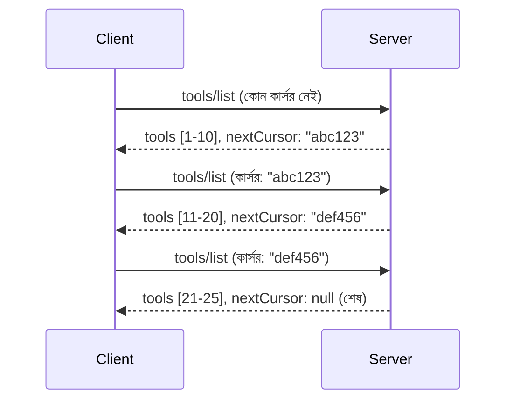

# MCP তে পেজিনেশন এবং বড় রেজাল্ট সেটসমূহ

যখন আপনার MCP সার্ভার বড় ডেটাসেট হ্যান্ডেল করে - হাজার হাজার ফাইল, ডাটাবেস রেকর্ড, বা সার্চ রেজাল্ট তালিকা করা হোক - তখন মেমোরি দক্ষতার সঙ্গে পরিচালনা এবং প্রতিক্রিয়াশীল ব্যবহারকারীর অভিজ্ঞতা প্রদানের জন্য পেজিনেশন প্রয়োজন হয়। এই গাইডটি MCP তে পেজিনেশন কীভাবে ইমপ্লিমেন্ট এবং ব্যবহার করবেন তা কভার করে।

## কেন পেজিনেশন গুরুত্বপূর্ণ

পেজিনেশন ছাড়া বড় রেসপন্সগুলি হতে পারে:

- **মেমোরি শেষ হয়ে যাওয়া** - একবারে কোটি কোটি রেকর্ড লোড করা
- **আলসা রেসপন্স টাইম** - ব্যবহারকারীরা সব ডেটা লোড হওয়া পর্যন্ত অপেক্ষা করে
- **টাইমআউট এরর** - রিকোয়েস্ট টাইমআউট সীমা ছাড়িয়ে যায়
- **খারাপ AI পারফরম্যান্স** - LLMs বিশাল প্রসঙ্গের সঙ্গে সংগ্রাম করে

MCP ব্যবহার করে **কর্সর-ভিত্তিক পেজিনেশন** রেজাল্ট সেট পেজ করার জন্য নির্ভরযোগ্য ও প্রচলিত পদ্ধতি হিসেবে।

---

## MCP পেজিনেশন কীভাবে কাজ করে

### কর্সর ধারণা

**কর্সর** হল একটি অপরিষ্কার স্ট্রিং যা রেজাল্ট সেটের আপনার অবস্থান চিহ্নিত করে। এটিকে দীর্ঘ বইয়ে একটি বুকমার্কের মতো ভাবুন।


### MCP মেথডগুলিতে পেজিনেশন

এই MCP মেথডগুলো পেজিনেশন সাপোর্ট করে:

| মেথড | রিটার্ন করে | কর্সর সাপোর্ট |
|--------|---------|----------------|
| `tools/list` | টুল ডেফিনিশনস | ✅ |
| `resources/list` | রিসোর্স ডেফিনিশনস | ✅ |
| `prompts/list` | প্রম্পট ডেফিনিশনস | ✅ |
| `resources/templates/list` | রিসোর্স টেমপ্লেটস | ✅ |

---

## সার্ভার ইমপ্লিমেন্টেশন

### পাইথন (FastMCP)

```python
from mcp.server import Server
from mcp.types import Tool, ListToolsResult
import math

app = Server("paginated-server")

# অনুকরণ করা বড় ডেটাসেট
ALL_TOOLS = [
    Tool(name=f"tool_{i}", description=f"Tool number {i}", inputSchema={})
    for i in range(100)
]

PAGE_SIZE = 10

@app.list_tools()
async def list_tools(cursor: str | None = None) -> ListToolsResult:
    """List tools with pagination support."""
    
    # শুরু সূচক পেতে কার্সর ডিকোড করুন
    start_index = 0
    if cursor:
        try:
            start_index = int(cursor)
        except ValueError:
            start_index = 0
    
    # ফলাফল পৃষ্ঠা পান
    end_index = min(start_index + PAGE_SIZE, len(ALL_TOOLS))
    page_tools = ALL_TOOLS[start_index:end_index]
    
    # পরবর্তী কার্সর গণনা করুন
    next_cursor = None
    if end_index < len(ALL_TOOLS):
        next_cursor = str(end_index)
    
    return ListToolsResult(
        tools=page_tools,
        nextCursor=next_cursor
    )
```

### টাইপস্ক্রিপ্ট

```typescript
import { Server } from "@modelcontextprotocol/sdk/server/index.js";
import { ListToolsResultSchema } from "@modelcontextprotocol/sdk/types.js";

const server = new Server({
  name: "paginated-server",
  version: "1.0.0"
});

// সিমুলেটেড বড় ডেটাসেট
const ALL_TOOLS = Array.from({ length: 100 }, (_, i) => ({
  name: `tool_${i}`,
  description: `Tool number ${i}`,
  inputSchema: { type: "object", properties: {} }
}));

const PAGE_SIZE = 10;

server.setRequestHandler(ListToolsResultSchema, async (request) => {
  // কার্সর ডিকোড করুন
  let startIndex = 0;
  if (request.params?.cursor) {
    startIndex = parseInt(request.params.cursor, 10) || 0;
  }
  
  // ফলাফলের পৃষ্ঠা পান
  const endIndex = Math.min(startIndex + PAGE_SIZE, ALL_TOOLS.length);
  const pageTools = ALL_TOOLS.slice(startIndex, endIndex);
  
  // পরবর্তী কার্সর গণনা করুন
  const nextCursor = endIndex < ALL_TOOLS.length ? String(endIndex) : undefined;
  
  return {
    tools: pageTools,
    nextCursor
  };
});
```

### জাভা (Spring MCP)

```java
@Service
public class PaginatedToolService {
    
    private static final int PAGE_SIZE = 10;
    private final List<Tool> allTools;
    
    public PaginatedToolService() {
        // বড় ডেটাসেট শুরু করা
        this.allTools = IntStream.range(0, 100)
            .mapToObj(i -> new Tool("tool_" + i, "Tool number " + i, Map.of()))
            .collect(Collectors.toList());
    }
    
    @McpMethod("tools/list")
    public ListToolsResult listTools(@Param("cursor") String cursor) {
        // কার্সর ডিকোড করুন
        int startIndex = 0;
        if (cursor != null && !cursor.isEmpty()) {
            try {
                startIndex = Integer.parseInt(cursor);
            } catch (NumberFormatException e) {
                startIndex = 0;
            }
        }
        
        // ফলাফলের পৃষ্ঠা পান
        int endIndex = Math.min(startIndex + PAGE_SIZE, allTools.size());
        List<Tool> pageTools = allTools.subList(startIndex, endIndex);
        
        // পরবর্তী কার্সর গণনা করুন
        String nextCursor = endIndex < allTools.size() ? String.valueOf(endIndex) : null;
        
        return new ListToolsResult(pageTools, nextCursor);
    }
}
```

---

## ক্লায়েন্ট ইমপ্লিমেন্টেশন

### পাইথন ক্লায়েন্ট

```python
from mcp import ClientSession

async def get_all_tools(session: ClientSession) -> list:
    """Fetch all tools using pagination."""
    all_tools = []
    cursor = None
    
    while True:
        result = await session.list_tools(cursor=cursor)
        all_tools.extend(result.tools)
        
        if result.nextCursor is None:
            break
        cursor = result.nextCursor
    
    return all_tools

# ব্যবহারের নির্দেশিকা
async with client_session as session:
    tools = await get_all_tools(session)
    print(f"Found {len(tools)} tools")
```

### টাইপস্ক্রিপ্ট ক্লায়েন্ট

```typescript
import { Client } from "@modelcontextprotocol/sdk/client/index.js";

async function getAllTools(client: Client): Promise<Tool[]> {
  const allTools: Tool[] = [];
  let cursor: string | undefined = undefined;
  
  do {
    const result = await client.listTools({ cursor });
    allTools.push(...result.tools);
    cursor = result.nextCursor;
  } while (cursor);
  
  return allTools;
}

// ব্যবহার
const tools = await getAllTools(client);
console.log(`Found ${tools.length} tools`);
```

### লেজি লোডিং প্যাটার্ন

অত্যন্ত বড় ডেটাসেটের জন্য, চাহিদা অনুযায়ী পেজগুলো লোড করুন:

```python
class PaginatedToolIterator:
    """Lazily iterate through paginated tools."""
    
    def __init__(self, session: ClientSession):
        self.session = session
        self.cursor = None
        self.buffer = []
        self.exhausted = False
    
    async def __anext__(self):
        # যদি পাওয়া যায় তাহলে বাফার থেকে ফেরত দিন
        if self.buffer:
            return self.buffer.pop(0)
        
        # পরীক্ষা করুন যে আমরা সমস্ত পৃষ্ঠা শেষ করেছি কিনা
        if self.exhausted:
            raise StopAsyncIteration
        
        # পরবর্তী পৃষ্ঠা আনুন
        result = await self.session.list_tools(cursor=self.cursor)
        self.buffer = list(result.tools)
        self.cursor = result.nextCursor
        
        if self.cursor is None:
            self.exhausted = True
        
        if not self.buffer:
            raise StopAsyncIteration
        
        return self.buffer.pop(0)
    
    def __aiter__(self):
        return self

# ব্যবহার - বড় ডেটাসেটের জন্য স্মৃতি সাশ্রয়ী
async for tool in PaginatedToolIterator(session):
    process_tool(tool)
```

---

## রিসোর্সের জন্য পেজিনেশন

রিসোর্সগুলো প্রায়শই ডিরেক্টরি বা বড় ডেটাসেটের জন্য পেজিনেশন দরকার হয়:

```python
from mcp.server import Server
from mcp.types import Resource, ListResourcesResult
import os

app = Server("file-server")

@app.list_resources()
async def list_resources(cursor: str | None = None) -> ListResourcesResult:
    """List files in directory with pagination."""
    
    directory = "/data/files"
    all_files = sorted(os.listdir(directory))
    
    # কনডোডার কার্সার (ফাইল সূচক)
    start_index = int(cursor) if cursor else 0
    page_size = 20
    end_index = min(start_index + page_size, len(all_files))
    
    # এই পৃষ্ঠার জন্য রিসোর্স তালিকা তৈরি করুন
    resources = []
    for filename in all_files[start_index:end_index]:
        filepath = os.path.join(directory, filename)
        resources.append(Resource(
            uri=f"file://{filepath}",
            name=filename,
            mimeType="application/octet-stream"
        ))
    
    # পরবর্তী কার্সার গণনা করুন
    next_cursor = str(end_index) if end_index < len(all_files) else None
    
    return ListResourcesResult(
        resources=resources,
        nextCursor=next_cursor
    )
```

---

## কর্সর ডিজাইন স্ট্র্যাটেজি

### স্ট্র্যাটেজি ১: ইনডেক্স-ভিত্তিক (সহজ)

```python
# কার্সর শুধু সূচক
cursor = "50"  # আইটেম ৫০ থেকে শুরু করুন
```

**সুবিধা:** সহজ, স্টেটলেস
**অসুবিধা:** আইটেম যোগ/মুছে ফেললে ফলাফল স্থানান্তরিত হতে পারে

### স্ট্র্যাটেজি ২: আইডি-ভিত্তিক (স্থিতিশীল)

```python
# কার্সর হল শেষ দেখা আইডি
cursor = "item_abc123"  # এই আইটেমের পরে শুরু করুন
```

**সুবিধা:** আইটেম পরিবর্তন হলেও স্থিতিশীল থাকে
**অসুবিধা:** অর্ডারকৃত আইডি প্রয়োজন

### স্ট্র্যাটেজি ৩: এনকোডেড স্টেট (জটিল)

```python
import base64
import json

def encode_cursor(state: dict) -> str:
    return base64.b64encode(json.dumps(state).encode()).decode()

def decode_cursor(cursor: str) -> dict:
    return json.loads(base64.b64decode(cursor).decode())

# কার্সরে একাধিক অবস্থা ক্ষেত্র রয়েছে
cursor = encode_cursor({
    "offset": 50,
    "filter": "active",
    "sort": "name"
})
```

**সুবিধা:** জটিল স্টেট এনকোড করতে পারে
**অসুবিধা:** আরও জটিল, বড় কর্সর স্ট্রিং

---

## সেরা অনুশীলন

### ১. উপযুক্ত পেজ সাইজ নির্বাচন করুন

```python
# ডেটা আকার বিবেচনা করুন
PAGE_SIZE_SMALL_ITEMS = 100   # সরল মেটাডেটা
PAGE_SIZE_MEDIUM_ITEMS = 20   # সমৃদ্ধ অবজেক্ট
PAGE_SIZE_LARGE_ITEMS = 5     # জটিল বিষয়বস্তু
```

### ২. অবৈধ কর্সর সুন্দরভাবে হ্যান্ডেল করুন

```python
@app.list_tools()
async def list_tools(cursor: str | None = None) -> ListToolsResult:
    try:
        start_index = int(cursor) if cursor else 0
        if start_index < 0 or start_index >= len(ALL_TOOLS):
            start_index = 0  # শুরুতে রিসেট করুন
    except (ValueError, TypeError):
        start_index = 0  # অবৈধ কার্সার, নতুন করে শুরু করুন
    # ...
```

### ৩. মোট গণনা অন্তর্ভুক্ত করুন (ঐচ্ছিক)

```python
return ListToolsResult(
    tools=page_tools,
    nextCursor=next_cursor,
    # কিছু বাস্তবায়ন UI অগ্রগতির জন্য মোট অন্তর্ভুক্ত করে
    _meta={"total": len(ALL_TOOLS)}
)
```

### ৪. এজ কেইস পরীক্ষা করুন

```python
async def test_pagination():
    # ফাঁকা ফলাফল সেট
    result = await session.list_tools()
    assert result.tools == []
    assert result.nextCursor is None
    
    # একক পৃষ্ঠা
    result = await session.list_tools()
    assert len(result.tools) <= PAGE_SIZE
    
    # অবৈধ কার্সার
    result = await session.list_tools(cursor="invalid")
    assert result.tools  # প্রথম পৃষ্ঠা ফেরত দেওয়া উচিত
```

---

## সাধারণ ভুল

### ❌ সব ফলাফল রিটার্ন করে তারপর ক্লায়েন্ট সাইডে পেজিনেশন

```python
# খারাপ: সবকিছু মেমরিতে লোড করে
@app.list_tools()
async def list_tools() -> ListToolsResult:
    all_tools = load_all_tools()  # ১ মিলিয়ন টুলস!
    return ListToolsResult(tools=all_tools)
```

### ✅ ডেটা সোর্সেই পেজিনেশন করুন

```python
# ভাল: শুধুমাত্র প্রয়োজনীয় যেটা দরকার তা লোড করে
@app.list_tools()
async def list_tools(cursor: str | None = None) -> ListToolsResult:
    offset = int(cursor) if cursor else 0
    tools = await db.query_tools(offset=offset, limit=PAGE_SIZE)
    return ListToolsResult(tools=tools, nextCursor=...)
```

---

## পরবর্তী কি

- [Module 5.14 - Context Engineering](../../05-AdvancedTopics/mcp-contextengineering/README.md)
- [Module 8 - Best Practices](../../08-BestPractices/README.md)
- [3.8 - আপনার MCP সার্ভার পরীক্ষা](../../03-GettingStarted/08-testing/README.md)

---

## অতিরিক্ত রিসোর্স

- [MCP স্পেসিফিকেশন - পেজিনেশন](https://spec.modelcontextprotocol.io/specification/2025-11-25/)
- [কর্সর-ভিত্তিক পেজিনেশন ব্যাখ্যা](https://slack.engineering/evolving-api-pagination-at-slack/)
- [পাইথন SDK পেজিনেশন টেস্ট](https://github.com/modelcontextprotocol/python-sdk/blob/main/tests/client/test_list_methods_cursor.py)

---

<!-- CO-OP TRANSLATOR DISCLAIMER START -->
**ডিসক্লেইমার**:
এই নথিটি AI অনুবাদ সেবা [Co-op Translator](https://github.com/Azure/co-op-translator) ব্যবহার করে অনূদিত হয়েছে। আমরা যথাসাধ্য সঠিকতার জন্য চেষ্টা করি, তবে স্বয়ংক্রিয় অনুবাদে ত্রুটি বা ভুল থাকতে পারে। মূল ভাষায় থাকা নথিটিই সরকারের নির্ভরযোগ্য উৎস হিসেবে বিবেচনা করা উচিত। গুরুত্বপূর্ণ তথ্যের জন্য পেশাদার মানুষ দ্বারা অনুবাদ করানো সমর্থনযোগ্য। এই অনুবাদের ব্যবহারে যে কোনো ভুল বোঝাবুঝি বা ভুল ব্যাখ্যার জন্য আমরা দায়বদ্ধ নই।
<!-- CO-OP TRANSLATOR DISCLAIMER END -->