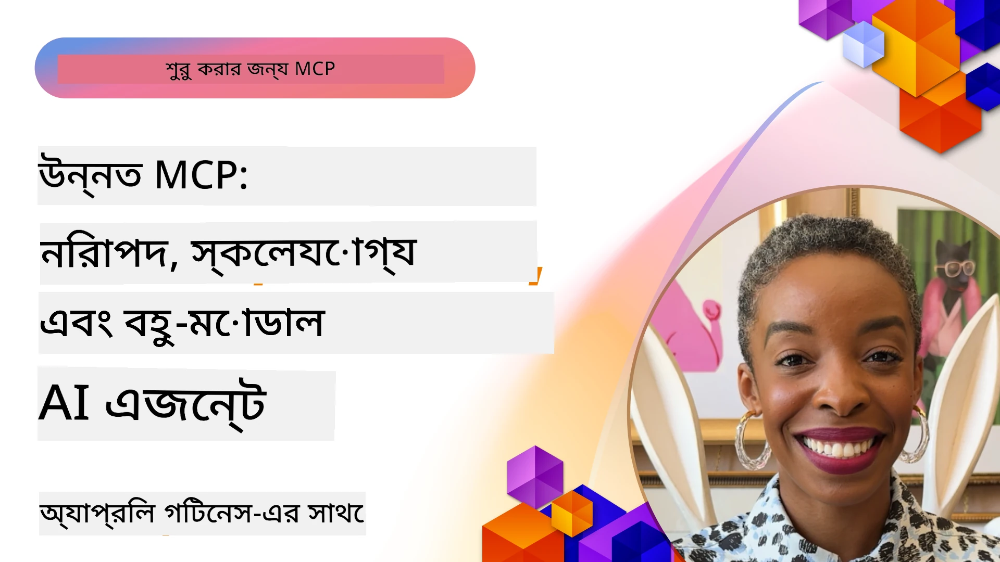

# MCP-তে উন্নত বিষয়সমূহ

_(এই পাঠের ভিডিও দেখতে উপরের ছবি ক্লিক করুন)_

এই অধ্যায়ে Model Context Protocol (MCP) বাস্তবায়নের কিছু উন্নত বিষয় আলোচনা করা হয়েছে, যার মধ্যে রয়েছে বহু-মোডাল ইন্টিগ্রেশন, স্কেলেবিলিটি, নিরাপত্তার সেরা অনুশীলনসমূহ, এবং এন্টারপ্রাইজ ইন্টিগ্রেশন। এই বিষয়গুলো মজবুত এবং প্রোডাকশন-রেডি MCP অ্যাপ্লিকেশনগুলি তৈরির জন্য অপরিহার্য যা আধুনিক AI সিস্টেমের চাহিদা পূরণ করতে পারে।

## সংক্ষিপ্ত বিবরণ

এই পাঠে Model Context Protocol বাস্তবায়নের উন্নত ধারণাগুলো অন্বেষণ করা হয়েছে, বিশেষ করে বহু-মোডাল ইন্টিগ্রেশন, স্কেলেবিলিটি, নিরাপত্তার সেরা অনুশীলনসমূহ এবং এন্টারপ্রাইজ ইন্টিগ্রেশন নিয়ে। এসব বিষয় প্রোডাকশন-গ্রেড MCP অ্যাপ্লিকেশন তৈরির জন্য অত্যাবশ্যক, যা এন্টারপ্রাইজ পরিবেশে জটিল প্রয়োজনীয়তাগুলো পরিচালনা করতে সক্ষম।

## শেখার উদ্দেশ্য

এই পাঠ শেষ করার পর, আপনি সক্ষম হবেন:

- MCP ফ্রেমওয়ার্কের মধ্যে বহু-মোডাল ক্ষমতা বাস্তবায়ন করতে
- উচ্চ চাহিদাসম্পন্ন পরিস্থিতির জন্য স্কেলেবেল MCP আর্কিটেকচার ডিজাইন করতে
- MCP এর নিরাপত্তা মূলনীতির সাথে সঙ্গতিপূর্ণ নিরাপত্তার সেরা অনুশীলন প্রয়োগ করতে
- MCP কে এন্টারপ্রাইজ AI সিস্টেম এবং ফ্রেমওয়ার্কের সাথে ইন্টিগ্রেট করতে
- প্রোডাকশন পরিবেশে কর্মক্ষমতা এবং নির্ভরশীলতা অপ্টিমাইজ করতে

## পাঠ এবং নমুনা প্রকল্পসমূহ

| লিঙ্ক | শিরোনাম | বিবরণ |
|------|---------|------------|
| [5.1 Azure এর সাথে ইন্টিগ্রেশন](./mcp-integration/README.md) | Azure এর সাথে ইন্টিগ্রেশন | আপনার MCP সার্ভারকে Azure-এ ইন্টিগ্রেট করতে শিখুন |
| [5.2 বহু-মোডাল নমুনা](./mcp-multi-modality/README.md) | MCP বহু-মোডাল নমুনাসমূহ | অডিও, ছবি এবং বহু-মোডাল প্রতিক্রিয়ার জন্য নমুনাসমূহ |
| [5.3 MCP OAuth2 নমুনা](../../../05-AdvancedTopics/mcp-oauth2-demo) | MCP OAuth2 ডেমো | MCP সহ OAuth2 প্রদর্শন করে একটি মিনিমাল স্প্রিং বুট অ্যাপ, যা Authorization এবং Resource সার্ভার উভয় হিসাবেই। নিরাপদ টোকেন ইস্যু, সুরক্ষিত এন্ডপয়েন্ট, Azure Container Apps মোতায়েন, এবং API Management ইন্টিগ্রেশন প্রদর্শন করে। |
| [5.4 রুট কনটেক্সট](./mcp-root-contexts/README.md) | রুট কনটেক্সট | রুট কনটেক্সট সম্পর্কে আরো জানুন এবং কিভাবে এগুলো বাস্তবায়ন করবেন |
| [5.5 রাউটিং](./mcp-routing/README.md) | রাউটিং | রাউটিং এর বিভিন্ন ধরণ শিখুন |
| [5.6 স্যাম্পলিং](./mcp-sampling/README.md) | স্যাম্পলিং | স্যাম্পলিং এর সাথে কাজ করার পদ্ধতি শিখুন |
| [5.7 স্কেলিং](./mcp-scaling/README.md) | স্কেলিং | স্কেলিং সম্পর্কে জানুন |
| [5.8 নিরাপত্তা](./mcp-security/README.md) | নিরাপত্তা | আপনার MCP সার্ভার নিরাপদ করুন |
| [5.9 ওয়েব সার্চ নমুনা](./web-search-mcp/README.md) | Web Search MCP | সেরপএপিআই এর সাথে ইন্টিগ্রেট করে Python MCP সার্ভার এবং ক্লায়েন্ট যা রিয়েল-টাইম ওয়েব, সংবাদ, পণ্য অনুসন্ধান এবং প্রশ্নোত্তরের জন্য। বহু-টুল অর্কেস্ট্রেশন, বাহ্যিক এপিআই ইন্টিগ্রেশন, এবং শক্তিশালী ত্রুটি হ্যান্ডলিং প্রদর্শন করে। |
| [5.10 রিয়েলটাইম স্ট্রিমিং](./mcp-realtimestreaming/README.md) | স্ট্রিমিং | আজকের তথ্য-চালিত বিশ্বে রিয়েল-টাইম ডেটা স্ট্রিমিং অত্যাবশ্যক, যেখানে ব্যবসা এবং অ্যাপ্লিকেশন গুলি সময়োপযোগী সিদ্ধান্ত গ্রহণের জন্য অবিলম্বে তথ্যের প্রয়োজনে থাকে। |
| [5.11 রিয়েলটাইম ওয়েব সার্চ](./mcp-realtimesearch/README.md) | ওয়েব সার্চ | রিয়েলটাইম ওয়েব সার্চে MCP কীভাবে রূপান্তর করে, AI মডেল, সার্চ ইঞ্জিন এবং অ্যাপ্লিকেশনের মধ্যে কনটেক্সট ব্যবস্থাপনার জন্য মানক পদ্ধতি প্রদান করে। |
| [5.12 Model Context Protocol সার্ভারের জন্য Entra ID Authentication](./mcp-security-entra/README.md) | Entra ID Authentication | Microsoft Entra ID একটি শক্তিশালী ক্লাউড-ভিত্তিক পরিচয় এবং অ্যাক্সেস ব্যবস্থাপনা সমাধান প্রদান করে, যা নিশ্চিত করে যে শুধুমাত্র অনুমোদিত ব্যবহারকারী এবং অ্যাপ্লিকেশন সমূহই আপনার MCP সার্ভারের সাথে ইন্টারেক্ট করতে পারে। |
| [5.13 Azure AI Foundry এজেন্ট ইন্টিগ্রেশন](./mcp-foundry-agent-integration/README.md) | Azure AI Foundry ইন্টিগ্রেশন | Model Context Protocol সার্ভারকে Azure AI Foundry এজেন্টের সাথে ইন্টিগ্রেট করার পদ্ধতি শিখুন, যা পাওয়ারফুল টুল অর্কেস্ট্রেশন এবং এন্টারপ্রাইজ AI ক্ষমতাসমূহকে মানক বাহ্যিক ডেটা সূত্র সংযোগের মাধ্যমে সক্ষম করে। |
| [5.14 কনটেক্সট ইঞ্জিনিয়ারিং](./mcp-contextengineering/README.md) | কনটেক্সট ইঞ্জিনিয়ারিং | MCP সার্ভারের জন্য কনটেক্সট ইঞ্জিনিয়ারিং প্রযুক্তির ভবিষ্যৎ সুযোগ, যার মধ্যে রয়েছে কনটেক্সট অপ্টিমাইজেশন, ডাইনামিক কনটেক্সট ব্যবস্থাপনা, এবং MCP ফ্রেমওয়ার্কের মধ্যে কার্যকর প্রম্পট ইঞ্জিনিয়ারিং কৌশলসমূহ। |
| [5.15 MCP কাস্টম ট্রান্সপোর্ট](./mcp-transport/README.md) | কাস্টম ট্রান্সপোর্ট | বিশেষ MCP যোগাযোগ পরিস্থিতির জন্য কাস্টম ট্রান্সপোর্ট প্রক্রিয়া বাস্তবায়ন করার পদ্ধতি শিখুন। |
| [5.16 প্রটোকল ফিচারস গভীর বিশ্লেষণ](./mcp-protocol-features/README.md) | প্রটোকল ফিচারসমূহ | অগ্রণী প্রটোকল ফিচার যেমন প্রোগ্রেস নোটিফিকেশন, অনুরোধ বাতিলকরণ, রিসোর্স টেম্পলেটস, এবং ত্রুটি হ্যান্ডলিং প্যাটার্নসমূহে দক্ষ হন। |

> **MCP স্পেসিফিকেশন 2025-11-25 এ নতুন:** স্পেসিফিকেশনটিতে এখন পরীক্ষানিয়ন্ত্রিত সমর্থন রয়েছে **Tasks** (প্রগতি ট্র্যাকিং সহ দীর্ঘকাল চলা অপারেশনসমূহ), **Tool Annotations** (নিরাপত্তার জন্য টুল আচরণের বিবরণ), **URL মোড ইলিসিটেশন** (ক্লায়েন্টদের থেকে নির্দিষ্ট URL বিষয়বস্তু অনুরোধ করা), এবং উন্নত **Roots** (ওয়ার্কস্পেস কনটেক্সট ব্যবস্থাপনার জন্য)। সম্পূর্ণ বিশদ জানার জন্য দেখুন [MCP স্পেসিফিকেশন চেঞ্জলগ](https://spec.modelcontextprotocol.io/)।

## অতিরিক্ত রেফারেন্স

সর্বশেষ MCP উন্নত বিষয় সংক্রান্ত তথ্যের জন্য দেখুন:
- [MCP ডকুমেন্টেশন](https://modelcontextprotocol.io/)
- [MCP স্পেসিফিকেশন (2025-11-25)](https://spec.modelcontextprotocol.io/specification/2025-11-25/)
- [GitHub রিপোজিটরি](https://github.com/modelcontextprotocol)
- [OWASP MCP টপ ১০](https://microsoft.github.io/mcp-azure-security-guide/mcp/) - নিরাপত্তা ঝুঁকি এবং প্রতিকার
- [MCP সিকিউরিটি সামিট কর্মশালা (Sherpa)](https://azure-samples.github.io/sherpa/) - হাতে-কলমে নিরাপত্তা প্রশিক্ষণ

## মূল বিষয়সমূহ

- বহু-মোডাল MCP বাস্তবায়ন AI ক্ষমতাসমূহ টেক্সট প্রসেসিংয়ের বাইরে প্রসারিত করে
- স্কেলেবিলিটি এন্টারপ্রাইজ ডিপ্লয়মেন্টের জন্য অপরিহার্য এবং এটি অনুভূমিক ও উল্লম্ব স্কেলিং দ্বারা সমাধান করা যায়
- বিস্তৃত নিরাপত্তা ব্যবস্থা ডেটা সুরক্ষিত করে এবং যথাযথ অ্যাক্সেস কন্ট্রোল নিশ্চিত করে
- Azure OpenAI এবং Microsoft AI Foundry এর মতো প্ল্যাটফর্মের সাথে এন্টারপ্রাইজ ইন্টিগ্রেশন MCP ক্ষমতাসমূহ উন্নত করে
- উন্নত MCP বাস্তবায়নগুলি অপ্টিমাইজ করা আর্কিটেকচার এবং সতর্ক সম্পদ ব্যবস্থাপনা থেকে লাভবান হয়

## অনুশীলন

একটি নির্দিষ্ট ব্যবহারের ক্ষেত্রে জন্য একটি এন্টারপ্রাইজ-গ্রেড MCP বাস্তবায়ন ডিজাইন করুন:

1. আপনার ব্যবহারের ক্ষেত্রে বহু-মোডাল প্রয়োজনীয়তাগুলো নির্ধারণ করুন
2. সংবেদনশীল ডেটা সুরক্ষার জন্য নিরাপত্তা নিয়ন্ত্রণের রূপরেখা প্রস্তুত করুন
3. ভিন্ন ভিন্ন লোড পরিচালনা করতে সক্ষম স্কেলেবল আর্কিটেকচার ডিজাইন করুন
4. এন্টারপ্রাইজ AI সিস্টেমের সাথে ইন্টিগ্রেশন পয়েন্টগুলো পরিকল্পনা করুন
5. সম্ভাব্য কর্মক্ষমতা সমস্যাগুলো ও প্রতিকার কৌশলসমূহ নথিভুক্ত করুন

## অতিরিক্ত সম্পদ

- [Azure OpenAI ডকুমেন্টেশন](https://learn.microsoft.com/en-us/azure/ai-services/openai/)
- [Microsoft AI Foundry ডকুমেন্টেশন](https://learn.microsoft.com/en-us/ai-services/)

---

## পরবর্তী কি

এই মডিউলের পাঠগুলো অনুসন্ধান করুন শুরু করে: [5.1 MCP ইন্টিগ্রেশন](./mcp-integration/README.md)

এই মডিউল শেষ করার পর, চালিয়ে যান: [মডিউল ৬: কমিউনিটি অবদানসমূহ](../06-CommunityContributions/README.md)

---

<!-- CO-OP TRANSLATOR DISCLAIMER START -->
**অস্বীকৃতি**:  
এই নথি AI অনুবাদ সেবা [Co-op Translator](https://github.com/Azure/co-op-translator) ব্যবহার করে অনুবাদ করা হয়েছে। আমরা যথাসাধ্য সঠিকতার চেষ্টা করি, তবে স্বয়ংক্রিয় অনুবাদে ত্রুটি বা অসত্যতা থাকতে পারে দয়া করে বিষয়টি বুঝে নিন। মূল নথিটি তার স্বদেশীয় ভাষায় একমাত্র গ্রহণযোগ্য উৎস হিসেবে বিবেচিত হওয়া উচিত। গুরুত্বপূর্ণ তথ্যের জন্য, পেশাদার মানব অনুবাদ গ্রহণ করা উচিৎ। এই অনুবাদের ব্যবহারে উদ্ভূত কোনো ভুল বোঝাবুঝি বা ব্যাখ্যাগত সমস্যা জন্য আমরা দায়ী নই।
<!-- CO-OP TRANSLATOR DISCLAIMER END -->