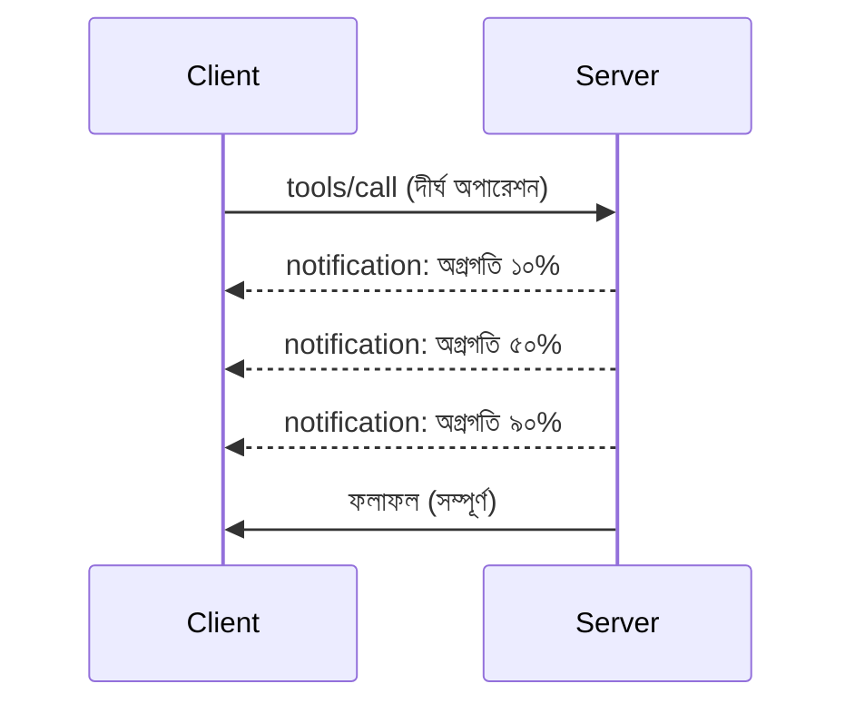

# MCP প্রোটোকল বৈশিষ্ট্য গভীরভাবে

এই গাইডটি মৌলিক টুল এবং রিসোর্স পরিচালনার বাইরে উন্নত MCP প্রোটোকল বৈশিষ্ট্যগুলো অন্বেষণ করে। এই বৈশিষ্ট্যগুলি বোঝা আপনাকে আরও দৃঢ়, ব্যবহারকারী-বান্ধব, এবং প্রোডাকশন-রেডি MCP সার্ভার তৈরি করতে সাহায্য করে।

## কাভার করা বৈশিষ্ট্যসমূহ

1. **প্রগতি বিজ্ঞপ্তি** - দীর্ঘমেয়াদী অপারেশনগুলোর জন্য প্রগতি রিপোর্ট করা
2. **অনুরোধ বাতিলকরণ** - ক্লায়েন্টদের চলমান অনুরোধ বাতিল করার অনুমতি দেওয়া
3. **রিসোর্স টেমপ্লেট** - প্যারামিটার সহ গতিশীল রিসোর্স URI
4. **সার্ভার লাইফসাইকেল ইভেন্টস** - সঠিক ইনিশিয়ালাইজেশন এবং শাটডাউন
5. **লগিং নিয়ন্ত্রণ** - সার্ভার-সাইড লগিং কনফিগারেশন
6. **ত্রুটি পরিচালনার প্যাটার্ন** - সঙ্গতিপূর্ণ ত্রুটি প্রতিক্রিয়া

---

## ১. প্রগতি বিজ্ঞপ্তি

সেই অপারেশনগুলোর জন্য যেগুলো সময় নেয় (ডেটা প্রসেসিং, ফাইল ডাউনলোড, API কল), প্রগতি বিজ্ঞপ্তি ব্যবহারকারীদের আপডেট রাখে।

### এটি কিভাবে কাজ করে


### পাইথন ইমপ্লিমেন্টেশন

```python
from mcp.server import Server, NotificationOptions
from mcp.types import ProgressNotification
import asyncio

app = Server("progress-server")

@app.tool()
async def process_large_file(file_path: str, ctx) -> str:
    """Process a large file with progress updates."""
    
    # অগ্রগতি হিসাব করার জন্য ফাইলের আকার নিন
    file_size = os.path.getsize(file_path)
    processed = 0
    
    with open(file_path, 'rb') as f:
        while chunk := f.read(8192):
            # চাঙ্ক প্রক্রিয়াকরণ করুন
            await process_chunk(chunk)
            processed += len(chunk)
            
            # অগ্রগতির বিজ্ঞপ্তি পাঠান
            progress = (processed / file_size) * 100
            await ctx.send_notification(
                ProgressNotification(
                    progressToken=ctx.request_id,
                    progress=progress,
                    total=100,
                    message=f"Processing: {progress:.1f}%"
                )
            )
    
    return f"Processed {file_size} bytes"

@app.tool()
async def batch_operation(items: list[str], ctx) -> str:
    """Process multiple items with progress."""
    
    results = []
    total = len(items)
    
    for i, item in enumerate(items):
        result = await process_item(item)
        results.append(result)
        
        # প্রতি আইটেমের পরে অগ্রগতি রিপোর্ট করুন
        await ctx.send_notification(
            ProgressNotification(
                progressToken=ctx.request_id,
                progress=i + 1,
                total=total,
                message=f"Processed {i + 1}/{total}: {item}"
            )
        )
    
    return f"Completed {total} items"
```

### টাইপস্ক্রিপ্ট ইমপ্লিমেন্টেশন

```typescript
import { Server } from "@modelcontextprotocol/sdk/server/index.js";

server.setRequestHandler(CallToolSchema, async (request, extra) => {
  const { name, arguments: args } = request.params;
  
  if (name === "process_data") {
    const items = args.items as string[];
    const results = [];
    
    for (let i = 0; i < items.length; i++) {
      const result = await processItem(items[i]);
      results.push(result);
      
      // অগ্রগতি নোটিফিকেশন পাঠান
      await extra.sendNotification({
        method: "notifications/progress",
        params: {
          progressToken: request.id,
          progress: i + 1,
          total: items.length,
          message: `Processing item ${i + 1}/${items.length}`
        }
      });
    }
    
    return { content: [{ type: "text", text: JSON.stringify(results) }] };
  }
});
```

### ক্লায়েন্ট হ্যান্ডলিং (পাইথন)

```python
async def handle_progress(notification):
    """Handle progress notifications from server."""
    params = notification.params
    print(f"Progress: {params.progress}/{params.total} - {params.message}")

# রেজিস্টার হ্যান্ডলার
session.on_notification("notifications/progress", handle_progress)

# টুল কল করুন (অগ্রগতি আপডেটগুলি হ্যান্ডলারের মাধ্যমে আসবে)
result = await session.call_tool("process_large_file", {"file_path": "/data/large.csv"})
```

---

## ২. অনুরোধ বাতিলকরণ

ক্লায়েন্টদের এমন অনুরোধ বাতিল করার অনুমতি দিন যা আর দরকার নেই বা অনেক দেরি করছে।

### পাইথন ইমপ্লিমেন্টেশন

```python
from mcp.server import Server
from mcp.types import CancelledError
import asyncio

app = Server("cancellable-server")

@app.tool()
async def long_running_search(query: str, ctx) -> str:
    """Search that can be cancelled."""
    
    results = []
    
    try:
        for page in range(100):  # অনেক পৃষ্ঠায় অনুসন্ধান করুন
            # যাচাই করুন যে বাতিলের অনুরোধ করা হয়েছিল কিনা
            if ctx.is_cancelled:
                raise CancelledError("Search cancelled by user")
            
            # পৃষ্ঠা অনুসন্ধানের অনুকরণ করুন
            page_results = await search_page(query, page)
            results.extend(page_results)
            
            # ছোট বিলম্ব বাতিল পরীক্ষা করার সুযোগ দেয়
            await asyncio.sleep(0.1)
            
    except CancelledError:
        # আংশিক ফলাফল ফেরত দিন
        return f"Cancelled. Found {len(results)} results before cancellation."
    
    return f"Found {len(results)} total results"

@app.tool()
async def download_file(url: str, ctx) -> str:
    """Download with cancellation support."""
    
    async with aiohttp.ClientSession() as session:
        async with session.get(url) as response:
            total_size = int(response.headers.get('content-length', 0))
            downloaded = 0
            chunks = []
            
            async for chunk in response.content.iter_chunked(8192):
                if ctx.is_cancelled:
                    return f"Download cancelled at {downloaded}/{total_size} bytes"
                
                chunks.append(chunk)
                downloaded += len(chunk)
            
            return f"Downloaded {downloaded} bytes"
```

### বাতিলকরণ প্রসঙ্গ বাস্তবায়ন

```python
class CancellableContext:
    """Context object that tracks cancellation state."""
    
    def __init__(self, request_id: str):
        self.request_id = request_id
        self._cancelled = asyncio.Event()
        self._cancel_reason = None
    
    @property
    def is_cancelled(self) -> bool:
        return self._cancelled.is_set()
    
    def cancel(self, reason: str = "Cancelled"):
        self._cancel_reason = reason
        self._cancelled.set()
    
    async def check_cancelled(self):
        """Raise if cancelled, otherwise continue."""
        if self.is_cancelled:
            raise CancelledError(self._cancel_reason)
    
    async def sleep_or_cancel(self, seconds: float):
        """Sleep that can be interrupted by cancellation."""
        try:
            await asyncio.wait_for(
                self._cancelled.wait(),
                timeout=seconds
            )
            raise CancelledError(self._cancel_reason)
        except asyncio.TimeoutError:
            pass  # স্বাভাবিক সময়সীমা, চালিয়ে যান
```

### ক্লায়েন্ট-সাইড বাতিলকরণ

```python
import asyncio

async def search_with_timeout(session, query, timeout=30):
    """Search with automatic cancellation on timeout."""
    
    task = asyncio.create_task(
        session.call_tool("long_running_search", {"query": query})
    )
    
    try:
        result = await asyncio.wait_for(task, timeout=timeout)
        return result
    except asyncio.TimeoutError:
        # অনুরোধ বাতিল করা
        await session.send_notification({
            "method": "notifications/cancelled",
            "params": {"requestId": task.request_id, "reason": "Timeout"}
        })
        return "Search timed out"
```

---

## ৩. রিসোর্স টেমপ্লেট

রিসোর্স টেমপ্লেট প্যারামিটারসহ গতিশীল URI তৈরি করতে দেয়, যা API এবং ডাটাবেসের জন্য উপযোগী।

### টেমপ্লেট নির্ধারণ

```python
from mcp.server import Server
from mcp.types import ResourceTemplate

app = Server("template-server")

@app.list_resource_templates()
async def list_templates() -> list[ResourceTemplate]:
    """Return available resource templates."""
    return [
        ResourceTemplate(
            uriTemplate="db://users/{user_id}",
            name="User Profile",
            description="Fetch user profile by ID",
            mimeType="application/json"
        ),
        ResourceTemplate(
            uriTemplate="api://weather/{city}/{date}",
            name="Weather Data",
            description="Historical weather for city and date",
            mimeType="application/json"
        ),
        ResourceTemplate(
            uriTemplate="file://{path}",
            name="File Content",
            description="Read file at given path",
            mimeType="text/plain"
        )
    ]

@app.read_resource()
async def read_resource(uri: str) -> str:
    """Read resource, expanding template parameters."""
    
    # প্যারামিটারগুলি বের করার জন্য ইউআরআই পার্স করুন
    if uri.startswith("db://users/"):
        user_id = uri.split("/")[-1]
        return await fetch_user(user_id)
    
    elif uri.startswith("api://weather/"):
        parts = uri.replace("api://weather/", "").split("/")
        city, date = parts[0], parts[1]
        return await fetch_weather(city, date)
    
    elif uri.startswith("file://"):
        path = uri.replace("file://", "")
        return await read_file(path)
    
    raise ValueError(f"Unknown resource URI: {uri}")
```

### টাইপস্ক্রিপ্ট ইমপ্লিমেন্টেশন

```typescript
server.setRequestHandler(ListResourceTemplatesSchema, async () => {
  return {
    resourceTemplates: [
      {
        uriTemplate: "github://repos/{owner}/{repo}/issues/{issue_number}",
        name: "GitHub Issue",
        description: "Fetch a specific GitHub issue",
        mimeType: "application/json"
      },
      {
        uriTemplate: "db://tables/{table}/rows/{id}",
        name: "Database Row",
        description: "Fetch a row from a database table",
        mimeType: "application/json"
      }
    ]
  };
});

server.setRequestHandler(ReadResourceSchema, async (request) => {
  const uri = request.params.uri;
  
  // গিটহাব ইস্যু URI পার্স করুন
  const githubMatch = uri.match(/^github:\/\/repos\/([^/]+)\/([^/]+)\/issues\/(\d+)$/);
  if (githubMatch) {
    const [_, owner, repo, issueNumber] = githubMatch;
    const issue = await fetchGitHubIssue(owner, repo, parseInt(issueNumber));
    return {
      contents: [{
        uri,
        mimeType: "application/json",
        text: JSON.stringify(issue, null, 2)
      }]
    };
  }
  
  throw new Error(`Unknown resource URI: ${uri}`);
});
```

---

## ৪. সার্ভার লাইফসাইকেল ইভেন্টস

সঠিক ইনিশিয়ালাইজেশন এবং শাটডাউন হ্যান্ডলিং পরিষ্কার রিসোর্স ব্যবস্থাপনা নিশ্চিত করে।

### পাইথন লাইফসাইকেল ম্যানেজমেন্ট

```python
from mcp.server import Server
from contextlib import asynccontextmanager

app = Server("lifecycle-server")

# শেয়ার্ড স্টেট
db_connection = None
cache = None

@asynccontextmanager
async def lifespan(server: Server):
    """Manage server lifecycle."""
    global db_connection, cache
    
    # স্টার্টআপ
    print("🚀 Server starting...")
    db_connection = await create_database_connection()
    cache = await create_cache_client()
    print("✅ Resources initialized")
    
    yield  # সার্ভার এখানে রান করে
    
    # শাটডাউন
    print("🛑 Server shutting down...")
    await db_connection.close()
    await cache.close()
    print("✅ Resources cleaned up")

app = Server("lifecycle-server", lifespan=lifespan)

@app.tool()
async def query_database(sql: str) -> str:
    """Use the shared database connection."""
    result = await db_connection.execute(sql)
    return str(result)
```

### টাইপস্ক্রিপ্ট লাইফসাইকেল

```typescript
import { Server } from "@modelcontextprotocol/sdk/server/index.js";

class ManagedServer {
  private server: Server;
  private dbConnection: DatabaseConnection | null = null;
  
  constructor() {
    this.server = new Server({
      name: "lifecycle-server",
      version: "1.0.0"
    });
    
    this.setupHandlers();
  }
  
  async start() {
    // সম্পদ 초기 করুন
    console.log("🚀 Server starting...");
    this.dbConnection = await createDatabaseConnection();
    console.log("✅ Database connected");
    
    // সার্ভার শুরু করুন
    await this.server.connect(transport);
  }
  
  async stop() {
    // সম্পদ পরিস্কার করুন
    console.log("🛑 Server shutting down...");
    if (this.dbConnection) {
      await this.dbConnection.close();
    }
    await this.server.close();
    console.log("✅ Cleanup complete");
  }
  
  private setupHandlers() {
    this.server.setRequestHandler(CallToolSchema, async (request) => {
      // নিরাপদে এই.dbConnection ব্যবহার করুন
      // ...
    });
  }
}

// সুন্দর শাটডাউন সহ ব্যবহার
const server = new ManagedServer();

process.on('SIGINT', async () => {
  await server.stop();
  process.exit(0);
});

await server.start();
```

---

## ৫. লগিং নিয়ন্ত্রণ

MCP সার্ভার-সাইড লগিং স্তর সমর্থন করে যা ক্লায়েন্ট নিয়ন্ত্রণ করতে পারে।

### লগিং স্তর বাস্তবায়ন

```python
from mcp.server import Server
from mcp.types import LoggingLevel
import logging

app = Server("logging-server")

# MCP স্তরগুলি Python লগিং স্তরের সাথে ম্যাপ করুন
LEVEL_MAP = {
    LoggingLevel.DEBUG: logging.DEBUG,
    LoggingLevel.INFO: logging.INFO,
    LoggingLevel.WARNING: logging.WARNING,
    LoggingLevel.ERROR: logging.ERROR,
}

logger = logging.getLogger("mcp-server")

@app.set_logging_level()
async def set_logging_level(level: LoggingLevel) -> None:
    """Handle client request to change logging level."""
    python_level = LEVEL_MAP.get(level, logging.INFO)
    logger.setLevel(python_level)
    logger.info(f"Logging level set to {level}")

@app.tool()
async def debug_operation(data: str) -> str:
    """Tool with various logging levels."""
    logger.debug(f"Processing data: {data}")
    
    try:
        result = process(data)
        logger.info(f"Successfully processed: {result}")
        return result
    except Exception as e:
        logger.error(f"Processing failed: {e}")
        raise
```

### ক্লায়েন্টকে লগ বার্তা পাঠানো

```python
@app.tool()
async def complex_operation(input: str, ctx) -> str:
    """Operation that logs to client."""
    
    # ক্লায়েন্টকে লগ বিজ্ঞপ্তি পাঠান
    await ctx.send_log(
        level="info",
        message=f"Starting complex operation with input: {input}"
    )
    
    # কাজ করুন...
    result = await do_work(input)
    
    await ctx.send_log(
        level="debug",
        message=f"Operation complete, result size: {len(result)}"
    )
    
    return result
```

---

## ৬. ত্রুটি পরিচালনার প্যাটার্ন

সঙ্গতিপূর্ণ ত্রুটি ব্যবস্থাপনা ডিবাগিং এবং ব্যবহারকারীর অভিজ্ঞতা উন্নত করে।

### MCP ত্রুটি কোডসমূহ

```python
from mcp.types import McpError, ErrorCode

class ToolError(McpError):
    """Base class for tool errors."""
    pass

class ValidationError(ToolError):
    """Invalid input parameters."""
    def __init__(self, message: str):
        super().__init__(ErrorCode.INVALID_PARAMS, message)

class NotFoundError(ToolError):
    """Requested resource not found."""
    def __init__(self, resource: str):
        super().__init__(ErrorCode.INVALID_REQUEST, f"Not found: {resource}")

class PermissionError(ToolError):
    """Access denied."""
    def __init__(self, action: str):
        super().__init__(ErrorCode.INVALID_REQUEST, f"Permission denied: {action}")

class InternalError(ToolError):
    """Internal server error."""
    def __init__(self, message: str):
        super().__init__(ErrorCode.INTERNAL_ERROR, message)
```

### গঠনমূলক ত্রুটি প্রতিক্রিয়া

```python
@app.tool()
async def safe_operation(input: str) -> str:
    """Tool with comprehensive error handling."""
    
    # ইনপুট যাচাই করুন
    if not input:
        raise ValidationError("Input cannot be empty")
    
    if len(input) > 10000:
        raise ValidationError(f"Input too large: {len(input)} chars (max 10000)")
    
    try:
        # অনুমতি পরীক্ষা করুন
        if not await check_permission(input):
            raise PermissionError(f"read {input}")
        
        # অপারেশন সম্পাদন করুন
        result = await perform_operation(input)
        
        if result is None:
            raise NotFoundError(input)
        
        return result
        
    except ConnectionError as e:
        raise InternalError(f"Database connection failed: {e}")
    except TimeoutError as e:
        raise InternalError(f"Operation timed out: {e}")
    except Exception as e:
        # অপ্রত্যাশিত ত্রুটিগুলি লগ করুন
        logger.exception(f"Unexpected error in safe_operation")
        raise InternalError(f"Unexpected error: {type(e).__name__}")
```

### টাইপস্ক্রিপ্টে ত্রুটি পরিচালনা

```typescript
import { McpError, ErrorCode } from "@modelcontextprotocol/sdk/types.js";

function validateInput(data: unknown): asserts data is ValidInput {
  if (typeof data !== "object" || data === null) {
    throw new McpError(
      ErrorCode.InvalidParams,
      "Input must be an object"
    );
  }
  // আরও যাচাই...
}

server.setRequestHandler(CallToolSchema, async (request) => {
  try {
    validateInput(request.params.arguments);
    
    const result = await performOperation(request.params.arguments);
    
    return {
      content: [{ type: "text", text: JSON.stringify(result) }]
    };
    
  } catch (error) {
    if (error instanceof McpError) {
      throw error;  // ইতিমধ্যে একটি MCP ত্রুটি
    }
    
    // অন্যান্য ত্রুটি রূপান্তর করুন
    if (error instanceof NotFoundError) {
      throw new McpError(ErrorCode.InvalidRequest, error.message);
    }
    
    // অজানা ত্রুটি
    console.error("Unexpected error:", error);
    throw new McpError(
      ErrorCode.InternalError,
      "An unexpected error occurred"
    );
  }
});
```

---

## পরীক্ষামূলক বৈশিষ্ট্যসমূহ (MCP 2025-11-25)

নির্দিষ্টকরণে এই বৈশিষ্ট্যগুলো পরীক্ষামূলক হিসেবে চিহ্নিত:

### টাস্কসমূহ (দীর্ঘকাল চলা অপারেশন)

```python
# কাজগুলি রাজ্যের সাথে দীর্ঘমেয়াদী অপারেশনগুলি ট্র্যাক করতে দেয়
@app.task()
async def training_task(model_id: str, data_path: str, ctx) -> str:
    """Long-running ML training task."""
    
    # কাজ শুরু হয়েছে রিপোর্ট করুন
    await ctx.report_status("running", "Initializing training...")
    
    # প্রশিক্ষণের লুপ
    for epoch in range(100):
        await train_epoch(model_id, data_path, epoch)
        await ctx.report_status(
            "running",
            f"Training epoch {epoch + 1}/100",
            progress=epoch + 1,
            total=100
        )
    
    await ctx.report_status("completed", "Training finished")
    return f"Model {model_id} trained successfully"
```

### টুল এনোটেশন

```python
# টুলের আচরণ সম্পর্কে মেটাডাটা প্রদান করে
@app.tool(
    annotations={
        "destructive": False,      # ডেটা পরিবর্তন করে না
        "idempotent": True,        # পুনরায় চেষ্টা করা নিরাপদ
        "timeout_seconds": 30,     # প্রত্যাশিত সর্বোচ্চ সময়কাল
        "requires_approval": False # ব্যবহারকারীর অনুমোদন প্রয়োজন নেই
    }
)
async def safe_query(query: str) -> str:
    """A read-only database query tool."""
    return await execute_read_query(query)
```

---

## পরবর্তী কী

- [মডিউল ৮ - সেরা অনুশীলনসমূহ](../../08-BestPractices/README.md)
- [5.14 - প্রসঙ্গ প্রকৌশল](../mcp-contextengineering/README.md)
- [MCP স্পেসিফিকেশন চেঞ্জলগ](https://spec.modelcontextprotocol.io/)

---

## অতিরিক্ত সম্পদ

- [MCP স্পেসিফিকেশন 2025-11-25](https://spec.modelcontextprotocol.io/specification/2025-11-25/)
- [JSON-RPC 2.0 ত্রুটি কোডসমূহ](https://www.jsonrpc.org/specification#error_object)
- [পাইথন SDK উদাহরণসমূহ](https://github.com/modelcontextprotocol/python-sdk/tree/main/examples)
- [টাইপস্ক্রিপ্ট SDK উদাহরণসমূহ](https://github.com/modelcontextprotocol/typescript-sdk/tree/main/examples)

---

<!-- CO-OP TRANSLATOR DISCLAIMER START -->
**অস্বীকারোক্তি**:  
এই নথিটি AI অনুবাদ সেবা [Co-op Translator](https://github.com/Azure/co-op-translator) ব্যবহার করে অনূদিত হয়েছে। আমরা যথাসম্ভব সঠিকতার চেষ্টা করি, তবে স্বয়ংক্রিয় অনুবাদে ভুল বা অসঙ্গতি থাকতে পারে। মূল নথির নিজভাষার সংস্করণই কর্তৃত্বপূর্ণ উৎস হিসেবে বিবেচনা করা উচিত। গুরুত্বপূর্ণ তথ্যের জন্য পেশাদার মানব অনুবাদ গ্রহণ করার সুপারিশ করা হয়। এই অনুবাদের ব্যবহার থেকে সৃষ্ট যেকোনো ভুল বোঝাবুঝি বা ভুল ব্যাখ্যার জন্য আমরা দায়ী নই।
<!-- CO-OP TRANSLATOR DISCLAIMER END -->