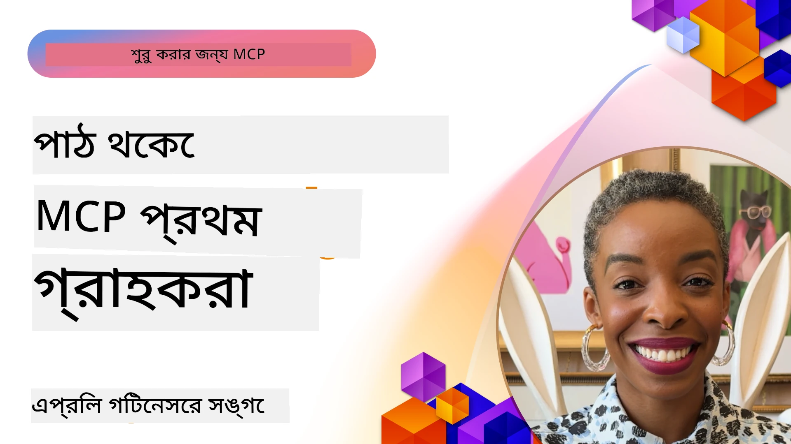

# 🌟 প্রথম ব্যবহারকারীদের থেকে পাঠ

[](https://youtu.be/jds7dSmNptE)

_(ভিডিও দেখার জন্য উপরে ইমেজে ক্লিক করুন)_

## 🎯 এই মডিউলে যা রয়েছে

এই মডিউলটি অনুসন্ধান করে কীভাবে বাস্তব সংস্থা এবং ডেভেলপাররা মডেল কনটেক্সট প্রোটোকল (MCP) ব্যবহার করে বাস্তব চ্যালেঞ্জসমূহ সমাধান করছেন এবং উদ্ভাবন চালিত করছেন। বিস্তারিত কেস স্টাডি, হাতে-কলমে প্রকল্প এবং ব্যবহারিক উদাহরণের মাধ্যমে, আপনি জানতে পারবেন কীভাবে MCP নিরাপদ, স্কেলযোগ্য AI সংহতকরণ সক্রিয় করে যা ভাষার মডেলগুলি, টুলস এবং এন্টারপ্রাইজ ডেটাকে সংযুক্ত করে।

### 📚 MCP কীভাবে কাজ করছে দেখুন

আপনি কি চান এই নীতিগুলো প্রোডাকশন-রেডি টুলে প্রয়োগ করা দেখতে? আমাদের [**10টি Microsoft MCP সার্ভার যা ডেভেলপারদের উৎপাদনশীলতা রূপান্তরিত করছে**](microsoft-mcp-servers.md) দেখুন, যেখানে সরাসরি ব্যবহারযোগ্য Microsoft MCP সার্ভারগুলো প্রদর্শিত হয়েছে।

## ওভারভিউ

এই পাঠে বিশ্লেষণ করা হয়েছে কীভাবে প্রথম ব্যবহারকারীরা মডেল কনটেক্সট প্রোটোকল (MCP) ব্যবহার করে বাস্তব জীবনের চ্যালেঞ্জগুলো সমাধান করেছেন এবং শিল্প জগতে উদ্ভাবন করেছেন। বিস্তারিত কেস স্টাডি এবং হাতে-কলমে প্রকল্পের মাধ্যমে আপনি দেখতে পাবেন কীভাবে MCP একটি মানক, নিরাপদ এবং স্কেলযোগ্য AI সংহতকরণ সক্ষম করে — বড় ভাষার মডেল, টুলস এবং এন্টারপ্রাইজ ডেটা একক ফ্রেমওয়ার্কে সংযুক্ত করে। আপনি MCP-ভিত্তিক সমাধান ডিজাইন এবং তৈরি করার ব্যবহারিক অভিজ্ঞতা অর্জন করবেন, প্রতিষ্ঠিত ইমপ্লিমেন্টেশন প্যাটার্ন থেকে শিখবেন, এবং প্রোডাকশন পরিবেশে MCP স্থাপনের সেরা অভ্যাস সম্পর্কেও জানতে পারবেন। এই পাঠটি MCP প্রযুক্তি এবং এর বিকশিত ইকোসিস্টেমের সামনের সারিতে থাকার জন্য উদীয়মান প্রবণতা, ভবিষ্যৎ দিকনির্দেশ এবং ওপেন সোর্স রিসোর্সের কথাও তুলে ধরে।

## শেখার লক্ষ্যসমূহ

- বিভিন্ন শিল্পে বাস্তব MCP বাস্তবায়ন বিশ্লেষণ করা
- সম্পূর্ণ MCP-ভিত্তিক অ্যাপ্লিকেশন ডিজাইন ও নির্মাণ করা
- MCP প্রযুক্তির উদীয়মান প্রবণতা ও ভবিষ্যৎ দিকে নজর দেওয়া
- প্রকৃত উন্নয়ন পরিস্থিতিতে সেরা অনুশীলন প্রয়োগ করা

## বাস্তব MCP বাস্তবায়নসমূহ

### কেস স্টাডি ১: এন্টারপ্রাইজ কাস্টমার সাপোর্ট অটোমেশন

একটি বহুজাতিক কর্পোরেশন তাদের গ্রাহক সাপোর্ট সিস্টেম জুড়ে AI ইন্টারঅ্যাকশনগুলো মানক করার জন্য MCP-ভিত্তিক সমাধান প্রয়োগ করেছিল। এর মাধ্যমে তারা করতে পেরেছিল:

- একাধিক LLM প্রদানকারীর জন্য একটি ঐক্যবদ্ধ ইন্টারফেস তৈরি করা
- দপ্তরগুলোর মধ্যে সঙ্গতিপূর্ণ প্রম্পট ব্যবস্থাপনা বজায় রাখা
- শক্তিশালী সুরক্ষা এবং সম্মতি নিয়ন্ত্রণ প্রয়োগ করা
- নির্দিষ্ট চাহিদা অনুযায়ী বিভিন্ন AI মডেল সহজে পরিবর্তন করা

**প্রযুক্তিগত বাস্তবায়ন:**

```python
# গ্রাহক সমর্থনের জন্য পাইথন MCP সার্ভার বাস্তবায়ন
import logging
import asyncio
from modelcontextprotocol import create_server, ServerConfig
from modelcontextprotocol.server import MCPServer
from modelcontextprotocol.transports import create_http_transport
from modelcontextprotocol.resources import ResourceDefinition
from modelcontextprotocol.prompts import PromptDefinition
from modelcontextprotocol.tool import ToolDefinition

# লগিং কনফিগার করুন
logging.basicConfig(level=logging.INFO)

async def main():
    # সার্ভার কনফিগারেশন তৈরি করুন
    config = ServerConfig(
        name="Enterprise Customer Support Server",
        version="1.0.0",
        description="MCP server for handling customer support inquiries"
    )
    
    # MCP সার্ভার আরম্ভ করুন
    server = create_server(config)
    
    # জ্ঞানভিত্তিক সম্পদ নিবন্ধন করুন
    server.resources.register(
        ResourceDefinition(
            name="customer_kb",
            description="Customer knowledge base documentation"
        ),
        lambda params: get_customer_documentation(params)
    )
    
    # প্রম্পট টেমপ্লেট নিবন্ধন করুন
    server.prompts.register(
        PromptDefinition(
            name="support_template",
            description="Templates for customer support responses"
        ),
        lambda params: get_support_templates(params)
    )
    
    # সমর্থন টুলস নিবন্ধন করুন
    server.tools.register(
        ToolDefinition(
            name="ticketing",
            description="Create and update support tickets"
        ),
        handle_ticketing_operations
    )
    
    # HTTP পরিবহনের সাথে সার্ভার শুরু করুন
    transport = create_http_transport(port=8080)
    await server.run(transport)

if __name__ == "__main__":
    asyncio.run(main())
```
  
**ফলাফল:** মডেল খরচে ৩০% হ্রাস, প্রতিক্রিয়া সামঞ্জস্যে ৪৫% উন্নতি এবং বৈশ্বিক অপারেশন জুড়ে উন্নত সম্মতি।

### কেস স্টাডি ২: স্বাস্থ্যসেবা ডায়াগনোসটিক অ্যাসিস্ট্যান্ট

একটি স্বাস্থ্যসেবা প্রদানকারী বিশেষায়িত একাধিক মেডিকেল AI মডেল ইন্টিগ্রেট করার জন্য MCP অবকাঠামো তৈরি করেছিল, যেখানে সংবেদনশীল রোগীর তথ্য সুরক্ষিত ছিল:

- সাধারণ এবং বিশেষায়িত মেডিকেল মডেলের মধ্যে বিনামূল্যে পরিবর্তন করা
- কঠোর গোপনীয়তা নিয়ন্ত্রণ এবং অডিট ট্রেইল
- বিদ্যমান ইলেকট্রনিক হেলথ রেকর্ড (EHR) সিস্টেমের সাথে ইন্টিগ্রেশন
- চিকিৎসাজনিত পরিভাষার জন্য সঙ্গতিপূর্ণ প্রম্পট ইঞ্জিনিয়ারিং

**প্রযুক্তিগত বাস্তবায়ন:**

```csharp
// C# MCP host application implementation in healthcare application
using Microsoft.Extensions.DependencyInjection;
using ModelContextProtocol.SDK.Client;
using ModelContextProtocol.SDK.Security;
using ModelContextProtocol.SDK.Resources;

public class DiagnosticAssistant
{
    private readonly MCPHostClient _mcpClient;
    private readonly PatientContext _patientContext;
    
    public DiagnosticAssistant(PatientContext patientContext)
    {
        _patientContext = patientContext;
        
        // Configure MCP client with healthcare-specific settings
        var clientOptions = new ClientOptions
        {
            Name = "Healthcare Diagnostic Assistant",
            Version = "1.0.0",
            Security = new SecurityOptions
            {
                Encryption = EncryptionLevel.Medical,
                AuditEnabled = true
            }
        };
        
        _mcpClient = new MCPHostClientBuilder()
            .WithOptions(clientOptions)
            .WithTransport(new HttpTransport("https://healthcare-mcp.example.org"))
            .WithAuthentication(new HIPAACompliantAuthProvider())
            .Build();
    }
    
    public async Task<DiagnosticSuggestion> GetDiagnosticAssistance(
        string symptoms, string patientHistory)
    {
        // Create request with appropriate resources and tool access
        var resourceRequest = new ResourceRequest
        {
            Name = "patient_records",
            Parameters = new Dictionary<string, object>
            {
                ["patientId"] = _patientContext.PatientId,
                ["requestingProvider"] = _patientContext.ProviderId
            }
        };
        
        // Request diagnostic assistance using appropriate prompt
        var response = await _mcpClient.SendPromptRequestAsync(
            promptName: "diagnostic_assistance",
            parameters: new Dictionary<string, object>
            {
                ["symptoms"] = symptoms,
                patientHistory = patientHistory,
                relevantGuidelines = _patientContext.GetRelevantGuidelines()
            });
            
        return DiagnosticSuggestion.FromMCPResponse(response);
    }
}
```
  
**ফলাফল:** চিকিৎসকদের জন্য উন্নত ডায়াগনিস্টিক পরামর্শ, পূর্ণ HIPAA সম্মতি বজায় রেখে এবং সিস্টেমগুলোর মধ্যে প্রেক্ষাপট-পরিবর্তনের উল্লেখযোগ্য হ্রাস।

### কেস স্টাডি ৩: আর্থিক পরিষেবা ঝুঁকি বিশ্লেষণ

একটি আর্থিক প্রতিষ্ঠান তাদের ঝুঁকি বিশ্লেষণ প্রক্রিয়াগুলো বিভিন্ন দপ্তরে মানক করার জন্য MCP বাস্তবায়ন করেছিল:

- ক্রেডিট ঝুঁকি, প্রতারণা সনাক্তকরণ এবং বিনিয়োগ ঝুঁকি মডেলের জন্য ঐক্যবদ্ধ ইন্টারফেস তৈরি করা
- কঠোর অ্যাক্সেস নিয়ন্ত্রণ এবং মডেল সংস্করণ ব্যবস্থা প্রয়োগ
- সব AI সুপারিশের অডিটযোগ্যতা নিশ্চিত করা
- বিভিন্ন সিস্টেমের মধ্যে ডেটার সঙ্গতিপূর্ণ বিন্যাস বজায় রাখা

**প্রযুক্তিগত বাস্তবায়ন:**

```java
// আর্থিক ঝুঁকি মূল্যায়নের জন্য জাভা MCP সার্ভার
import org.mcp.server.*;
import org.mcp.security.*;

public class FinancialRiskMCPServer {
    public static void main(String[] args) {
        // আর্থিক সম্মতি বৈশিষ্ট্য সহ MCP সার্ভার তৈরি করুন
        MCPServer server = new MCPServerBuilder()
            .withModelProviders(
                new ModelProvider("risk-assessment-primary", new AzureOpenAIProvider()),
                new ModelProvider("risk-assessment-audit", new LocalLlamaProvider())
            )
            .withPromptTemplateDirectory("./compliance/templates")
            .withAccessControls(new SOCCompliantAccessControl())
            .withDataEncryption(EncryptionStandard.FINANCIAL_GRADE)
            .withVersionControl(true)
            .withAuditLogging(new DatabaseAuditLogger())
            .build();
            
        server.addRequestValidator(new FinancialDataValidator());
        server.addResponseFilter(new PII_RedactionFilter());
        
        server.start(9000);
        
        System.out.println("Financial Risk MCP Server running on port 9000");
    }
}
```
  
**ফলাফল:** উন্নত নিয়ন্ত্রক সম্মতি, ৪০% দ্রুততর মডেল স্থাপন চক্র এবং দপ্তর জুড়ে ঝুঁকি মূল্যায়নের সঙ্গতিপূর্ণতা।

### কেস স্টাডি ৪: ব্রাউজার অটোমেশনের জন্য মাইক্রোসফ্ট প্লে-রাইট MCP সার্ভার

মাইক্রোসফ্ট [প্লে-রাইট MCP সার্ভার](https://github.com/microsoft/playwright-mcp) তৈরি করেছে ব্রাউজার অটোমেশন নিরাপদ, মানক করতে মডেল কনটেক্সট প্রোটোকলের মাধ্যমে। এই প্রোডাকশন-রেডি সার্ভার AI এজেন্ট এবং LLM-দের ওয়েব ব্রাউজারের সঙ্গে একটি নিয়ন্ত্রিত, অডিটযোগ্য এবং সম্প্রসারিত উপায়ে ইন্টারঅ্যাক্ট করার অনুমতি দেয় — স্বয়ংক্রিয় ওয়েব টেস্টিং, ডেটা এক্সট্রাকশন, এবং এন্ড-টু-এন্ড ওয়ার্কফ্লো এর মত ব্যবহারের ক্ষেত্রে।

> **🎯 প্রোডাকশন রেডি টুল**  
> এই কেস স্টাডি একটি বাস্তব MCP সার্ভার প্রদর্শন করে যা আপনি আজই ব্যবহার করতে পারেন! প্লে-রাইট MCP সার্ভার এবং ৯টি অন্যান্য প্রোডাকশন-রেডি Microsoft MCP সার্ভার সম্পর্কে আমাদের [**Microsoft MCP Servers Guide**](microsoft-mcp-servers.md#8--playwright-mcp-server) এ জানুন।

**মূল বৈশিষ্ট্যগুলো:**  
- ব্রাউজার অটোমেশন ক্ষমতাগুলো (নেভিগেশন, ফর্ম পূরণ, স্ক্রিনশট ক্যাপচার ইত্যাদি) MCP টুল হিসেবে এক্সপোজ করে  
- অনুমোদনহীন কাজ প্রতিরোধে কঠোর অ্যাক্সেস নিয়ন্ত্রণ এবং স্যান্ডবক্সিং প্রয়োগ করে  
- সব ব্রাউজার ইন্টারঅ্যাকশনের বিস্তারিত অডিট লগ সরবরাহ করে  
- এজেন্ট-চালিত অটোমেশনের জন্য Azure OpenAI এবং অন্যান্য LLM প্রদানকারীর সাথে ইন্টিগ্রেশন সাপোর্ট করে  
- GitHub Copilot এর কোডিং এজেন্টকে ওয়েব ব্রাউজিং ক্ষমতা প্রদান করে  

**প্রযুক্তিগত বাস্তবায়ন:**

```typescript
// টাইপস্ক্রিপ্ট: MCP সার্ভারে Playwright ব্রাউজার অটোমেশন টুল নিবন্ধন করা হচ্ছে
import { createServer, ToolDefinition } from 'modelcontextprotocol';
import { launch } from 'playwright';

const server = createServer({
  name: 'Playwright MCP Server',
  version: '1.0.0',
  description: 'MCP server for browser automation using Playwright'
});

// একটি টুল নিবন্ধন করুন যা একটি URL এ নেভিগেট করে এবং স্ক্রীনশট ধারণ করে
server.tools.register(
  new ToolDefinition({
    name: 'navigate_and_screenshot',
    description: 'Navigate to a URL and capture a screenshot',
    parameters: {
      url: { type: 'string', description: 'The URL to visit' }
    }
  }),
  async ({ url }) => {
    const browser = await launch();
    const page = await browser.newPage();
    await page.goto(url);
    const screenshot = await page.screenshot();
    await browser.close();
    return { screenshot };
  }
);

// MCP সার্ভার চালু করুন
server.listen(8080);
```
  
**ফলাফল:**  

- AI এজেন্ট এবং LLM-দের জন্য নিরাপদ, প্রোগ্রাম্যাটিক ব্রাউজার অটোমেশন সক্ষম করেছে  
- ম্যানুয়াল টেস্টিং প্রচেষ্টা কমিয়েছে এবং ওয়েব অ্যাপ্লিকেশনগুলোর টেস্ট কভারেজ উন্নত করেছে  
- এন্টারপ্রাইজ পরিবেশে ব্রাউজারভিত্তিক টুল ইন্টিগ্রেশনের জন্য পুনঃব্যবহারযোগ্য, সম্প্রসারিত ফ্রেমওয়ার্ক প্রদান করেছে  
- GitHub Copilot এর ওয়েব ব্রাউজিং সক্ষমতাগুলো চালিয়ে যাচ্ছে  

**রেফারেন্সসমূহ:**  

- [Playwright MCP Server GitHub Repository](https://github.com/microsoft/playwright-mcp)  
- [Microsoft AI and Automation Solutions](https://azure.microsoft.com/en-us/products/ai-services/)  

### কেস স্টাডি ৫: Azure MCP – এন্টারপ্রাইজ-গ্রেড মডেল কনটেক্সট প্রোটোকল সার্ভিস হিসেবে

Azure MCP সার্ভার ([https://aka.ms/azmcp](https://aka.ms/azmcp)) হলো মাইক্রোসফ্টের পরিচালিত, এন্টারপ্রাইজ-গ্রেড মডেল কনটেক্সট প্রোটোকল বাস্তবায়ন, যা স্কেলযোগ্য, নিরাপদ, এবং সম্মত MCP সার্ভার সক্ষমতা ক্লাউড সার্ভিস হিসেবে প্রদান করে। Azure MCP সংস্থা গুলোকে দ্রুত MCP সার্ভার স্থাপন, পরিচালনা এবং Azure AI, ডেটা, ও সিকিউরিটি সার্ভিসের সাথে সংহতকরণ সহজ করে, অপারেশনাল ওভারহেড কমায় এবং AI গ্রহণ দ্রুত করে।

> **🎯 প্রোডাকশন রেডি টুল**  
> এটি একটি বাস্তব MCP সার্ভার যা আপনি আজই ব্যবহার করতে পারেন! Azure AI Foundry MCP সার্ভার সম্পর্কে আমাদের [**Microsoft MCP Servers Guide**](microsoft-mcp-servers.md) এ আরও জানুন।

- সম্পূর্ণ পরিচালিত MCP সার্ভার হোস্টিং, স্কেলিং, মনিটরিং এবং নিরাপত্তা অন্তর্ভুক্ত  
- Azure OpenAI, Azure AI সার্চ এবং অন্যান্য Azure সার্ভিসের সঙ্গে দেশীয় সংহতকরণ  
- Microsoft Entra ID এর মাধ্যমে এন্টারপ্রাইজ প্রমাণীকরণ ও অনুমোদন  
- কাস্টম টুল, প্রম্পট টেমপ্লেট এবং রিসোর্স কানেক্টর সাপোর্ট  
- এন্টারপ্রাইজ নিরাপত্তা এবং নিয়ন্ত্রক প্রয়োজনীয়তা পূরণ  

**প্রযুক্তিগত বাস্তবায়ন:**

```yaml
# Example: Azure MCP server deployment configuration (YAML)
apiVersion: mcp.microsoft.com/v1
kind: McpServer
metadata:
  name: enterprise-mcp-server
spec:
  modelProviders:
    - name: azure-openai
      type: AzureOpenAI
      endpoint: https://<your-openai-resource>.openai.azure.com/
      apiKeySecret: <your-azure-keyvault-secret>
  tools:
    - name: document_search
      type: AzureAISearch
      endpoint: https://<your-search-resource>.search.windows.net/
      apiKeySecret: <your-azure-keyvault-secret>
  authentication:
    type: EntraID
    tenantId: <your-tenant-id>
  monitoring:
    enabled: true
    logAnalyticsWorkspace: <your-log-analytics-id>
```
  
**ফলাফল:**  
- ব্যবহারযোগ্য, সম্মত MCP সার্ভার প্ল্যাটফর্ম প্রদান করে এন্টারপ্রাইজ AI প্রকল্পের মান তৈরির সময় কমিয়েছে  
- LLM, টুলস, এবং এন্টারপ্রাইজ ডেটা সোর্সের ইন্টিগ্রেশন সহজ করেছে  
- MCP ওয়ার্কলোডের জন্য উন্নত নিরাপত্তা, পর্যবেক্ষণ এবং অপারেশনাল কার্যকারিতা বৃদ্ধি করেছে  
- Azure SDK সেরা অভ্যাস ও বর্তমান প্রমাণীকরণ প্যাটার্নের মাধ্যমে কোডের গুণমান উন্নত করেছে  

**রেফারেন্সসমূহ:**  
- [Azure MCP Documentation](https://aka.ms/azmcp)  
- [Azure MCP Server GitHub Repository](https://github.com/Azure/azure-mcp)  
- [Azure AI Services](https://azure.microsoft.com/en-us/products/ai-services/)  
- [Microsoft MCP Center](https://mcp.azure.com)  

## কেস স্টাডি ৬: NLWeb  
MCP (Model Context Protocol) হ'ল চ্যাটবট এবং AI সহকারীদের টুলসের সঙ্গে ইন্টারঅ্যাক্ট করার জন্য একটি উদীয়মান প্রোটোকল। প্রতিটি NLWeb ইনস্টেন্সও একটি MCP সার্ভার, যা একটি একক মূল পদ্ধতি, ask, সমর্থন করে, যা একটি ওয়েবসাইটকে প্রাকৃতিক ভাষায় প্রশ্ন করতে ব্যবহৃত হয়। প্রত্যাবর্তিত প্রতিক্রিয়া schema.org ব্যবহার করে, যা ওয়েব ডেটা বর্ণনার জন্য ব্যাপক ব্যবহৃত একটি শব্দভাণ্ডার। সংক্ষেপে, MCP হলো NLWeb এর Http রূপান্তর HTML এর মত। NLWeb প্রোটোকল, Schema.org ফরম্যাট, এবং নমুনা কোড একত্রিত করে যা সাইটগুলোকে দ্রুত এই এন্ডপয়েন্ট তৈরি করতে সাহায্য করে, যা মানুষের জন্য কথোপকথন ইন্টারফেস এবং মেশিনের জন্য প্রাকৃতিক এজেন্ট-টু-এজেন্ট ইন্টারঅ্যাকশন সুবিধা দেয়।

NLWeb-এর দুটি আলাদা উপাদান রয়েছে:  
- একটি প্রোটোকল, খুবই সহজ শুরু করার জন্য, যা প্রাকৃতিক ভাষায় সাইটের সঙ্গে ইন্টারফেস করে এবং একটি ফরম্যাট, যা json এবং schema.org ব্যবহার করে উত্তর প্রদান করে। REST API সম্পর্কিত ডকুমেন্টেশন দেখুন।  
- (1) এর সরল বাস্তবায়ন যা বিদ্যমান মার্কআপ ব্যবহার করে, এমন সাইটগুলোর জন্য যা আইটেমের তালিকা হিসেবে বিমূर्त করা যায় (পণ্য, রেসিপি, আকর্ষণ, রিভিউ ইত্যাদি)। সেটির সঙ্গে ইউজার ইন্টারফেস উইজেটস থাকে যা সাইটগুলোকে তাদের বিষয়বস্তুকে কথোপকথন ইন্টারফেসের মাধ্যমে সহজে প্রদানের সুযোগ দেয়। কিভাবে কাজ করে তা জানতে Life of a chat query বিষয়ে ডকুমেন্টেশন দেখুন।  

**রেফারেন্সসমূহ:**  
- [Azure MCP Documentation](https://aka.ms/azmcp)  
- [NLWeb](https://github.com/microsoft/NlWeb)  

### কেস স্টাডি ৭: Azure AI Foundry MCP Server – এন্টারপ্রাইজ AI এজেন্ট ইন্টিগ্রেশন

Azure AI Foundry MCP সার্ভারগুলি দেখায় কীভাবে MCP ব্যবহার করে এন্টারপ্রাইজ পরিবেশে AI এজেন্ট এবং ওয়ার্কফ্লো সমন্বয় এবং পরিচালনা করা যায়। Azure AI Foundry-এর সঙ্গে MCP সংযোগ করে প্রতিষ্ঠানগুলো এজেন্ট ইন্টারঅ্যাকশন মানক করতে পারে, Foundry-এর ওয়ার্কফ্লো ম্যানেজমেন্ট ব্যবহার করতে পারে এবং নিরাপদ, স্কেলযোগ্য স্থাপনের নিশ্চয়তা পায়।

> **🎯 প্রোডাকশন রেডি টুল**  
> এটি একটি বাস্তব MCP সার্ভার যা আপনি আজই ব্যবহার করতে পারেন! Azure AI Foundry MCP Server সম্পর্কিত আরও জানুন আমাদের [**Microsoft MCP Servers Guide**](microsoft-mcp-servers.md#9--azure-ai-foundry-mcp-server) এ।

**মূল বৈশিষ্ট্য:**  
- Azure এর AI ইকোসিস্টেমের বিস্তৃত অ্যাক্সেস, মডেল ক্যাটালগ এবং স্থাপনা ব্যবস্থাপনা সহ  
- RAG অ্যাপ্লিকেশনের জন্য Azure AI Search দিয়ে জ্ঞান সূচীকরণ  
- AI মডেল পারফরম্যান্স এবং গুণগত নিশ্চয়তার জন্য মূল্যায়ন টুল  
- Azure AI Foundry ক্যাটালগ এবং ল্যাবসের সাথে সংযুক্তি, যা উন্নত গবেষণা মডেল সরবরাহ করে  
- প্রোডাকশন পরিস্থিতির জন্য এজেন্ট ব্যবস্থাপনা এবং মূল্যায়ন ক্ষমতা  

**ফলাফল:**  
- AI এজেন্ট ওয়ার্কফ্লো দ্রুত প্রোটোটাইপিং এবং শক্তিশালী পর্যবেক্ষণ  
- উন্নত দৃশ্যের জন্য Azure AI সার্ভিসের সঙ্গে নির্বিঘ্ন সংযোগ  
- এজেন্ট পাইপলাইন নির্মাণ, স্থাপনা ও পর্যবেক্ষণের জন্য একক ইন্টারফেস  
- এন্টারপ্রাইজের জন্য উন্নত নিরাপত্তা, সম্মতি এবং অপারেশনাল দক্ষতা  
- জটিল এজেন্ট-চালিত প্রক্রিয়ার নিয়ন্ত্রণ বজায় রেখেই দ্রুত AI গ্রহণ  

**রেফারেন্সসমূহ:**  
- [Azure AI Foundry MCP Server GitHub Repository](https://github.com/azure-ai-foundry/mcp-foundry)  
- [Integrating Azure AI Agents with MCP (Microsoft Foundry Blog)](https://devblogs.microsoft.com/foundry/integrating-azure-ai-agents-mcp/)  

### কেস স্টাডি ৮: Foundry MCP Playground – পরীক্ষা ও প্রোটোটাইপিং

Foundry MCP Playground MCP সার্ভার এবং Azure AI Foundry ইন্টিগ্রেশন নিয়ে পরীক্ষার জন্য একটি ব্যবহারের জন্য প্রস্তুত পরিবেশ প্রদান করে। ডেভেলপাররা দ্রুত AI মডেল এবং এজেন্ট ওয়ার্কফ্লো প্রোটোটাইপ, পরীক্ষা ও মূল্যায়ন করতে পারে Azure AI Foundry ক্যাটালগ এবং ল্যাবসের রিসোর্স ব্যবহার করে। এই প্লেগ্রাউন্ড সেটআপ সহজ করে, নমুনা প্রকল্প দেয় এবং সহযোগিতামূলক উন্নয়ন সমর্থন করে, যা কমপ্লেক্স অবকাঠামো ছাড়াই সেরা অনুশীলন এবং নতুন দৃশ্য অনুসন্ধান সহজ করে। এটি বিশেষ করে টিমগুলোর জন্য উপকারী যারা আইডিয়া যাচাই করতে, পরীক্ষাগুলো শেয়ার করতে এবং শেখার গতি বাড়াতে চান। বাধা কমিয়ে, প্লেঙ্কগ্রাউন্ড MCP এবং Azure AI Foundry ইকোসিস্টেমে উদ্ভাবন এবং কমিউনিটি অবদান প্রদানে সাহায্য করে।

**রেফারেন্সসমূহ:**  

- [Foundry MCP Playground GitHub Repository](https://github.com/azure-ai-foundry/foundry-mcp-playground)  

### কেস স্টাডি ৯: Microsoft Learn Docs MCP Server – AI-চালিত ডকুমেন্টেশন অ্যাক্সেস

Microsoft Learn Docs MCP Server একটি ক্লাউড-হোস্টেড সার্ভিস যা AI সহকারীদের মডেল কনটেক্সট প্রোটোকলের মাধ্যমে অফিসিয়াল Microsoft ডকুমেন্টেশনে রিয়েল-টাইম অ্যাক্সেস প্রদান করে। এই প্রোডাকশন-রেডি সার্ভার Microsoft Learn ইকোসিস্টেমের সাথে সংযুক্ত এবং সমস্ত অফিসিয়াল Microsoft উৎসে সেম্যান্টিক সার্চ সক্ষম করে।

> **🎯 প্রোডাকশন রেডি টুল**  
> এটি একটি বাস্তব MCP সার্ভার যা আপনি আজই ব্যবহার করতে পারেন! Microsoft Learn Docs MCP Server সম্পর্কে আরও জানুন আমাদের [**Microsoft MCP Servers Guide**](microsoft-mcp-servers.md#1--microsoft-learn-docs-mcp-server) এ।

**মূল বৈশিষ্ট্য:**  
- অফিসিয়াল Microsoft ডকুমেন্টেশন, Azure ডকুমেন্টস, ও Microsoft 365 ডকুমেন্টেশনে রিয়েল-টাইম অ্যাক্সেস  
- প্রেক্ষাপট এবং উদ্দেশ্য বুঝতে সক্ষম উন্নত সেম্যান্টিক সার্চ  
- Microsoft Learn বিষয়বস্তু প্রকাশের সাথে সর্বদা হালনাগাদ তথ্য  
- Microsoft Learn, Azure ডকুমেন্টেশন এবং Microsoft 365 উৎসের ব্যাপক কাভারেজ  
- ১০টি উচ্চমানের বিষয়বস্তু অংশ শিরোনাম ও URL-সহ প্রদান  

**কেন এটি গুরুত্বপূর্ণ:**  
- Microsoft প্রযুক্তির জন্য "অপ্রচলিত AI জ্ঞান" সমস্যার সমাধান করে  
- AI সহকারীদের সর্বশেষ .NET, C#, Azure, এবং Microsoft 365 বৈশিষ্ট্যে অ্যাক্সেস নিশ্চিত করে  
- সঠিক কোড উৎপাদনের জন্য প্রামাণিক, প্রথম পক্ষের তথ্য সরবরাহ করে  
- দ্রুত বিকাশমান Microsoft প্রযুক্তিতে কাজ করা ডেভেলপারদের জন্য অপরিহার্য  

**ফলাফল:**  
- Microsoft প্রযুক্তির AI-উৎপাদিত কোডের যথার্থতা নাটকীয়ভাবে উন্নত করেছে  
- বর্তমান ডকুমেন্টেশন এবং সেরা অনুশীলন অনুসন্ধানে সময় কমিয়েছে  
- প্রেক্ষাপট উপলব্ধ ডকুমেন্টেশন পুনরুদ্ধারের মাধ্যমে ডেভেলপারদের উৎপাদনশীলতা বাড়িয়েছে  
- আইডিই ছাড়াই উন্নয়ন ওয়ার্কফ্লোর সাথে নির্বিঘ্ন ইন্টিগ্রেশন  

**রেফারেন্সসমূহ:**  
- [Microsoft Learn Docs MCP Server GitHub Repository](https://github.com/MicrosoftDocs/mcp)  
- [Microsoft Learn Documentation](https://learn.microsoft.com/)  

## হাতে-কলমে প্রকল্পসমূহ

### প্রকল্প ১: মাল্টি-প্রোভাইডার MCP সার্ভার তৈরি করুন

**লক্ষ্য:** একটি MCP সার্ভার তৈরি করা যা নির্দিষ্ট শর্ত অনুযায়ী একাধিক AI মডেল প্রদানকারীর কাছে অনুরোধ রুট করতে পারে।

**প্রয়োজনীয়তা:**

- অন্তত তিনটি ভিন্ন মডেল প্রদানকারী সমর্থন (যেমন, OpenAI, Anthropic, লোকাল মডেল)  
- অনুরোধ মেটাডেটা অনুযায়ী রুটিং মেকানিজম বাস্তবায়ন  
- প্রদানকারীর শংসাপত্র ব্যবস্থাপনার জন্য কনফিগারেশন সিস্টেম তৈরি  
- কর্মক্ষমতা ও খরচ অপটিমাইজেশনের জন্য ক্যাশিং যোগ করা  
- ব্যবহারের মনিটরিংয়ের জন্য একটি সহজ ড্যাশবোর্ড তৈরি  

**বাস্তবায়নের ধাপসমূহ:**

1. বেসিক MCP সার্ভার অবকাঠামো সেটআপ  
2. প্রতিটি AI মডেল সার্ভিসের জন্য প্রোভাইডার অ্যাডাপ্টর বাস্তবায়ন  
3. অনুরোধের বৈশিষ্ট্যের ওপর ভিত্তি করে রুটিং লজিক তৈরি  
4. ঘন ঘন অনুরোধের জন্য ক্যাশিং মেকানিজম যোগ  
5. মনিটরিং ড্যাশবোর্ডের উন্নয়ন  
6. বিভিন্ন অনুরোধ প্যাটার্ন দিয়ে পরীক্ষা করা  

**প্রযুক্তি:** আপনার পছন্দ অনুযায়ী Python (.NET/Java/Python), Redis ক্যাশিংয়ের জন্য এবং ড্যাশবোর্ডের জন্য একটি সাধারণ ওয়েব ফ্রেমওয়ার্ক বেছে নিন।

### প্রকল্প ২: এন্টারপ্রাইজ প্রম্পট ম্যানেজমেন্ট সিস্টেম  

**উদ্দেশ্য:** একটি MCP-ভিত্তিক সিস্টেম উন্নয়ন করা যা একটি প্রতিষ্ঠানের মধ্যে প্রম্পট টেমপ্লেট পরিচালনা, সংস্করণ নিয়ন্ত্রণ এবং ডিপ্লয়মেণ্টের জন্য ব্যবহৃত হবে।

**প্রয়োজনীয়তা:**

- প্রম্পট টেমপ্লেটের জন্য একটি কেন্দ্রীয় রিপোজিটরি তৈরি করুন
- সংস্করণ নিয়ন্ত্রণ এবং অনুমোদন কর্মপ্রবাহ বাস্তবায়ন করুন
- নমুনা ইনপুটের সাথে টেমপ্লেট পরীক্ষণের সক্ষমতা তৈরি করুন
- ভূমিকা-ভিত্তিক এক্সেস নিয়ন্ত্রণ তৈরি করুন
- টেমপ্লেট পুনরুদ্ধার এবং ডিপ্লয়মেন্টের জন্য একটি API তৈরি করুন

**বাস্তবায়ন ধাপসমূহ:**

1. টেমপ্লেট সংরক্ষণের জন্য ডাটাবেজ স্কিমা ডিজাইন করুন
2. টেমপ্লেট CRUD অপারেশনের জন্য মূল API তৈরি করুন
3. সংস্করণ নিয়ন্ত্রণ পদ্ধতি বাস্তবায়ন করুন
4. অনুমোদন কর্মপ্রবাহ নির্মাণ করুন
5. পরীক্ষণের ফ্রেমওয়ার্ক উন্নয়ন করুন
6. ব্যবস্থাপনার জন্য একটি সরল ওয়েব ইন্টারফেস তৈরি করুন
7. একটি MCP সার্ভারের সাথে ইন্টিগ্রেশন করুন

**প্রযুক্তি:** আপনার পছন্দসই ব্যাকএন্ড ফ্রেমওয়ার্ক, SQL বা NoSQL ডাটাবেজ, এবং ব্যবস্থাপনা ইন্টারফেসের জন্য ফ্রন্টএন্ড ফ্রেমওয়ার্ক।

### প্রকল্প ৩: MCP-ভিত্তিক কন্টেন্ট জেনারেশন প্ল্যাটফর্ম

**উদ্দেশ্য:** একটি কন্টেন্ট জেনারেশন প্ল্যাটফর্ম নির্মাণ করা যা MCP ব্যবহার করে বিভিন্ন কন্টেন্ট টাইপে ধারাবাহিক ফলাফল প্রদান করে।

**প্রয়োজনীয়তা:**

- একাধিক কন্টেন্ট ফরম্যাট সমর্থন (ব্লগ পোস্ট, সোশ্যাল মিডিয়া, মার্কেটিং কপি)
- কাস্টমাইজেশন অপশন সহ টেমপ্লেট-ভিত্তিক জেনারেশন বাস্তবায়ন
- কন্টেন্ট পর্যালোচনা ও প্রতিক্রিয়া ব্যবস্থা তৈরি
- কন্টেন্ট পারফরম্যান্স মেট্রিক্স ট্র্যাক করা
- কন্টেন্ট সংস্করণ নিয়ন্ত্রণ এবং পুনরাবৃত্তি সমর্থন

**বাস্তবায়ন ধাপসমূহ:**

1. MCP ক্লায়েন্ট অবকাঠামো সেটআপ করুন
2. বিভিন্ন কন্টেন্ট টাইপের জন্য টেমপ্লেট তৈরি করুন
3. কন্টেন্ট জেনারেশন পাইপলাইন নির্মাণ করুন
4. পর্যালোচনা ব্যবস্থা বাস্তবায়ন করুন
5. মেট্রিক্স ট্র্যাকিং সিস্টেম উন্নয়ন করুন
6. টেমপ্লেট ব্যবস্থাপনা এবং কন্টেন্ট জেনারেশনের জন্য একটি ব্যবহারকারী ইন্টারফেস তৈরি করুন

**প্রযুক্তি:** আপনার পছন্দের প্রোগ্রামিং ভাষা, ওয়েব ফ্রেমওয়ার্ক এবং ডাটাবেজ সিস্টেম।

## MCP প্রযুক্তির ভবিষ্যত দিকনির্দেশনা

### উদীয়মান প্রবণতা

1. **মাল্টি-মোডাল MCP**
   - ছবি, অডিও এবং ভিডিও মডেলের সাথে ইন্টারঅ্যাকশন মানকরণের জন্য MCP বিস্তার
   - ক্রস-মোডাল যুক্তি দক্ষতার উন্নয়ন
   - বিভিন্ন মোডালিটির জন্য মানসম্মত প্রম্পট ফরম্যাট

2. **ফেডারেটেড MCP অবকাঠামো**
   - প্রতিষ্ঠানগুলোর মধ্যে সংস্থান শেয়ার করতে সক্ষম বিতরণকৃত MCP নেটওয়ার্ক
   - নিরাপদ মডেল শেয়ারিংয়ের জন্য মানসম্মত প্রোটোকল
   - গোপনীয়তা সংরক্ষণকারী গণনা পদ্ধতি

3. **MCP মার্কেটপ্লেস**
   - MCP টেমপ্লেট এবং প্লাগইন শেয়ার ও মোনিটাইজ করার জন্য ইকোসিস্টেম
   - গুণগত নিশ্চয়তা এবং সার্টিফিকেশন প্রক্রিয়া
   - মডেল মার্কেটপ্লেসের সাথে ইন্টিগ্রেশন

4. **এজ কম্পিউটিংয়ের জন্য MCP**
   - সীমিত সম্পদ সম্পন্ন এজ ডিভাইসের জন্য MCP মানদণ্ড অভিযোজন
   - কম ব্যান্ডউইথ পরিবেশের জন্য অপ্টিমাইজড প্রোটোকল
   - IoT ইকোসিস্টেমের জন্য বিশেষায়িত MCP বাস্তবায়ন

5. **নিয়ন্ত্রক কাঠামো**
   - নিয়ন্ত্রক অনুপালনের জন্য MCP এক্সটেনশন উন্নয়ন
   - মানসম্মত অডিট ট্রেইল এবং ব্যাখ্যাযোগ্য ইন্টারফেস
   - উদীয়মান AI শাসন কাঠামোর সাথে একীভূতকরণ

### মাইক্রোসফট থেকে MCP সমাধান

মাইক্রোসফট এবং Azure বিভিন্ন ওপেন-সোর্স রিপোজিটরি তৈরি করেছে যা ডেভেলপারদের MCP বাস্তবায়নে সাহায্য করে:

#### Microsoft Organization

1. [playwright-mcp](https://github.com/microsoft/playwright-mcp) - ব্রাউজার অটোমেশন এবং টেস্টিংয়ের জন্য Playwright MCP সার্ভার
2. [files-mcp-server](https://github.com/microsoft/files-mcp-server) - লোকাল টেস্টিং এবং কমিউনিটি অবদানের জন্য OneDrive MCP সার্ভার বাস্তবায়ন
3. [NLWeb](https://github.com/microsoft/NlWeb) - NLWeb হলো ওপেন প্রোটোকল এবং সংশ্লিষ্ট ওপেন সোর্স টুলগুলোর সংগ্রহ। এর প্রধান লক্ষ্য AI ওয়েবের জন্য একটি ভিত্তিভূমি প্রতিষ্ঠা করা

#### Azure-Samples Organization

1. [mcp](https://github.com/Azure-Samples/mcp) - Azure-এ MCP সার্ভার তৈরি ও সংযুক্তির জন্য নমুনা, সরঞ্জাম এবং রিসোর্সের লিঙ্ক
2. [mcp-auth-servers](https://github.com/Azure-Samples/mcp-auth-servers) - বর্তমান Model Context Protocol স্পেসিফিকেশন সহ প্রমাণীকরণ প্রদর্শনকারী MCP রেফারেন্স সার্ভার
3. [remote-mcp-functions](https://github.com/Azure-Samples/remote-mcp-functions) - Azure Functions-এ রিমোট MCP সার্ভার বাস্তবায়নের ল্যান্ডিং পেজ এবং ভাষাভিত্তিক রিপো লিঙ্ক
4. [remote-mcp-functions-python](https://github.com/Azure-Samples/remote-mcp-functions-python) - Azure Functions এবং পাইথন ব্যবহার করে কাস্টম রিমোট MCP সার্ভার নির্মাণ ও ডিপ্লয়মেন্টের দ্রুত শুরু
5. [remote-mcp-functions-dotnet](https://github.com/Azure-Samples/remote-mcp-functions-dotnet) - Azure Functions এবং .NET/C# দিয়ে নির্মাণ ও ডিপ্লয়মেন্টের দ্রুত শুরু
6. [remote-mcp-functions-typescript](https://github.com/Azure-Samples/remote-mcp-functions-typescript) - Azure Functions এবং TypeScript দিয়ে নির্মাণ ও ডিপ্লয়মেন্টের দ্রুত শুরু
7. [remote-mcp-apim-functions-python](https://github.com/Azure-Samples/remote-mcp-apim-functions-python) - Python ব্যবহার করে Remote MCP সার্ভারের জন্য Azure API Management as AI গেটওয়ে
8. [AI-Gateway](https://github.com/Azure-Samples/AI-Gateway) - MCP সক্ষমতা সহ APIM ❤️ AI পরীক্ষা, Azure OpenAI এবং AI Foundry-র সাথে ইন্টিগ্রেশন

এই রিপোজিটরিগুলো বিভিন্ন প্রোগ্রামিং ভাষা এবং Azure সার্ভিসের জন্য Model Context Protocol কাজ করার জন্য বাস্তবায়ন, টেমপ্লেট এবং রিসোর্স প্রদান করে। তারা সাধারণ সার্ভার বাস্তবায়ন থেকে প্রমাণীকরণ, ক্লাউড ডিপ্লয়মেন্ট এবং এন্টারপ্রাইজ ইন্টিগ্রেশন পর্যন্ত বিভিন্ন ব্যবহার-কেস আচ্ছাদিত করে।

#### MCP রিসোর্স ডিরেক্টরি

অফিসিয়াল Microsoft MCP রিপোজিটরির [MCP Resources directory](https://github.com/microsoft/mcp/tree/main/Resources) একটি সঙ্কলিত সংগ্রহ যা Model Context Protocol সার্ভারের জন্য নমুনা রিসোর্স, প্রম্পট টেমপ্লেট এবং টুল ডেফিনিশন প্রদান করে। এই ডিরেক্টরিটি ডেভেলপারদের MCP দ্রুত শুরু করার জন্য পুনঃব্যবহারযোগ্য বিল্ডিং ব্লক এবং সেরা অনুশীলনের উদাহরণ সরবরাহ করে:

- **প্রম্পট টেমপ্লেট:** সাধারণ AI কাজ এবং পরিস্থিতির জন্য প্রস্তুত প্রম্পট টেমপ্লেট, যা আপনার নিজস্ব MCP সার্ভার বাস্তবায়নের জন্য মানিয়ে নেওয়া যেতে পারে।
- **টুল ডেফিনিশন:** বিভিন্ন MCP সার্ভারে টুল ইন্টিগ্রেশন এবং আহ্বানের জন্য মানসম্মত টুল স্কিমা ও মেটাডেটা উদাহরণ।
- **রিসোর্স নমুনা:** MCP ফ্রেমওয়ার্কের মধ্যে ডাটা সোর্স, API এবং বাহ্যিক পরিষেবার সাথে সংযোগের জন্য উদাহরণ রিসোর্স ডেফিনিশন।
- **রেফারেন্স বাস্তবায়ন:** বাস্তব MCP প্রকল্পে রিসোর্স, প্রম্পট এবং টুলগুলি কীভাবে গঠন ও সংগঠিত করা যায় তার ব্যবহারিক নমুনা।

এই রিসোর্সগুলি উন্নয়ন দ্রুততর করে, মানসম্মতকরণ প্রচার করে এবং MCP ভিত্তিক সমাধান তৈরি ও ডিপ্লয়মেন্টে সেরা অনুশীলন নিশ্চিত করতে সাহায্য করে।

#### MCP রিসোর্স ডিরেক্টরি

- [MCP Resources (Sample Prompts, Tools, and Resource Definitions)](https://github.com/microsoft/mcp/tree/main/Resources)

### গবেষণা সুযোগ

- MCP ফ্রেমওয়ার্কের মধ্যে কার্যকর প্রম্পট অপটিমাইজেশন কৌশল
- বহুমুখী MCP ডিপ্লয়মেন্টের জন্য নিরাপত্তা মডেল
- বিভিন্ন MCP বাস্তবায়নের পারফরম্যান্স বেঞ্চমার্কিং
- MCP সার্ভারের ফর্মাল ভেরিফিকেশন পদ্ধতি

## উপসংহার

Model Context Protocol (MCP) দ্রুত শিল্পব্যাপী AI ইন্টিগ্রেশনের জন্য মানসম্মত, নিরাপদ এবং আন্তঃপরিচালনাযোগ্য ভবিষ্যত গড়ে তুলছে। এই পাঠের কেস স্টাডি এবং হাতে-কলমে প্রকল্পগুলোর মাধ্যমে আপনি দেখেছেন কীভাবে প্রাথমিক গ্রহণকারীরা—মাইক্রোসফট এবং Azure অন্তর্ভুক্ত—MCP ব্যবহার করে বাস্তব সমস্যার সমাধান করছেন, AI গ্রহণ পক্রিয়া ত্বরান্বিত করছেন, এবং নিয়মাবলী, নিরাপত্তা, ও স্কেলযোগ্যতা নিশ্চিত করছেন। MCP-এর মডুলার পদ্ধতি প্রতিষ্ঠানগুলোকে বৃহৎ ভাষার মডেল, টুল এবং এন্টারপ্রাইজ ডাটাকে একক, নিরীক্ষণযোগ্য কাঠামোর মধ্যে সংযুক্ত করার সুযোগ দেয়। MCP অব্যাহত বিকাশের সাথে, কমিউনিটির সাথে সক্রিয় সংযোগ বজায় রাখা, ওপেন-সোর্স রিসোর্সগুলি অন্বেষণ করা এবং সেরা অনুশীলন প্রয়োগ করা সুদৃঢ়, ভবিষ্যত-উপযোগী AI সমাধান তৈরি করার জন্য গুরুত্বপূর্ণ হবে।

## অতিরিক্ত রিসোর্স

- [MCP Foundry GitHub Repository](https://github.com/azure-ai-foundry/mcp-foundry)
- [Foundry MCP Playground](https://github.com/azure-ai-foundry/foundry-mcp-playground)
- [Integrating Azure AI Agents with MCP (Microsoft Foundry Blog)](https://devblogs.microsoft.com/foundry/integrating-azure-ai-agents-mcp/)
- [MCP GitHub Repository (Microsoft)](https://github.com/microsoft/mcp)
- [MCP Resources Directory (Sample Prompts, Tools, and Resource Definitions)](https://github.com/microsoft/mcp/tree/main/Resources)
- [MCP Community & Documentation](https://modelcontextprotocol.io/introduction)
- [MCP Specification (2025-11-25)](https://spec.modelcontextprotocol.io/specification/2025-11-25/)
- [Azure MCP Documentation](https://aka.ms/azmcp)
- [OWASP MCP Top 10](https://microsoft.github.io/mcp-azure-security-guide/mcp/) - নিরাপত্তার সেরা অনুশীলন
- [Playwright MCP Server GitHub Repository](https://github.com/microsoft/playwright-mcp)
- [Files MCP Server (OneDrive)](https://github.com/microsoft/files-mcp-server)
- [Azure-Samples MCP](https://github.com/Azure-Samples/mcp)
- [MCP Auth Servers (Azure-Samples)](https://github.com/Azure-Samples/mcp-auth-servers)
- [Remote MCP Functions (Azure-Samples)](https://github.com/Azure-Samples/remote-mcp-functions)
- [Remote MCP Functions Python (Azure-Samples)](https://github.com/Azure-Samples/remote-mcp-functions-python)
- [Remote MCP Functions .NET (Azure-Samples)](https://github.com/Azure-Samples/remote-mcp-functions-dotnet)
- [Remote MCP Functions TypeScript (Azure-Samples)](https://github.com/Azure-Samples/remote-mcp-functions-typescript)
- [Remote MCP APIM Functions Python (Azure-Samples)](https://github.com/Azure-Samples/remote-mcp-apim-functions-python)
- [AI-Gateway (Azure-Samples)](https://github.com/Azure-Samples/AI-Gateway)
- [Microsoft AI and Automation Solutions](https://azure.microsoft.com/en-us/products/ai-services/)

## অনুশীলন

1. একটি কেস স্টাডি বিশ্লেষণ করুন এবং একটি বিকল্প বাস্তবায়ন পদ্ধতি প্রস্তাব করুন।
2. একটি প্রকল্প আইডিয়া নির্বাচন করে বিস্তারিত প্রযুক্তিগত স্পেসিফিকেশন তৈরি করুন।
3. কেস স্টাডিতে অন্তর্ভুক্ত না হওয়া একটি শিল্প খুঁজে নিয়ে দেখুন MCP কীভাবে তার নির্দিষ্ট চ্যালেঞ্জ সমাধান করতে পারে।
4. ভবিষ্যত দিকনির্দেশনা গুলো থেকে একটি নির্বাচন করে তার জন্য একটি নতুন MCP এক্সটেনশনের ধারণা তৈরি করুন।

## পরবর্তী কী

আরও অনুসন্ধান করুন: [Microsoft MCP Servers](./microsoft-mcp-servers.md)

ক্রমাগত চালিয়ে যান: [Module 8: Best Practices](../08-BestPractices/README.md)

---

<!-- CO-OP TRANSLATOR DISCLAIMER START -->
**বিজ্ঞপ্তি**:
এই নথিটি AI অনুবাদ সেবা [Co-op Translator](https://github.com/Azure/co-op-translator) ব্যবহার করে অনুবাদ করা হয়েছে। আমরা যথাসাধ্য যথার্থতার চেষ্টা করি, তবে স্বয়ংক্রিয় অনুবাদে ভুল বা অশুদ্ধতা থাকতে পারে বলে অনুগ্রহ করে এ বিষয়ে সতর্ক থাকুন। মূল নথি তার নিজস্ব ভাষায়ই কর্তৃত্বপূর্ণ উৎস হিসেবে বিবেচিত হোক। গুরুত্বপূর্ণ তথ্যের জন্য পেশাদার মানব অনুবাদের পরামর্শ দেওয়া হয়। এই অনুবাদের ব্যবহারে সৃষ্ট কোনো ভুলবোঝাবুঝি বা ভুল ব্যাখ্যার জন্য আমরা দায় বহন করিনা।
<!-- CO-OP TRANSLATOR DISCLAIMER END -->