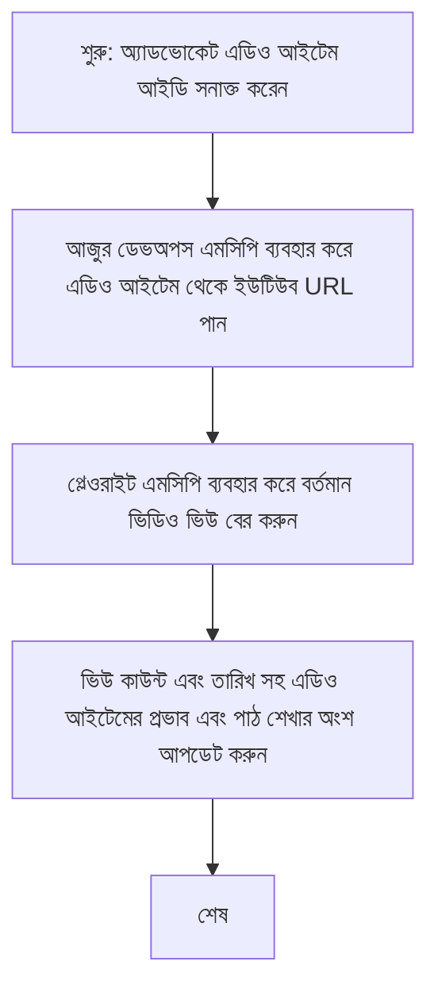

# কেস স্টাডি: ইউটিউব ডেটা থেকে MCP সহ Azure DevOps আইটেম আপডেট করা

> **দাবি ত্যাগ:** এমন কিছু বিদ্যমান অনলাইন টুল এবং রিপোর্ট রয়েছে যা YouTube-এর মতো প্ল্যাটফর্ম থেকে ডেটা দিয়ে Azure DevOps আইটেম আপডেট করার প্রক্রিয়া স্বয়ংক্রিয় করতে পারে। নিম্নলিখিত পরিস্থিতিটি শুধুমাত্র একটি নমুনা ব্যবহার কেস হিসেবে দেওয়া হয়েছে যা দেখায় কীভাবে MCP টুলগুলি স্বয়ংক্রিয়তা এবং ইন্টিগ্রেশন কাজের জন্য প্রয়োগ করা যেতে পারে।

## ওভারভিউ

এই কেস স্টাডিতে একটি উদাহরণ দেখানো হয়েছে কীভাবে Model Context Protocol (MCP) এবং এর টুলগুলি ব্যবহার করে Azure DevOps (ADO) ওয়ার্ক আইটেম আপডেট করার প্রক্রিয়া স্বয়ংক্রিয় করা যায় যা অনলাইন প্ল্যাটফর্ম, যেমন YouTube, থেকে প্রাপ্ত তথ্য থেকে তোলা হয়। উল্লিখিত পরিস্থিতিটি এই টুলগুলির বিস্তৃত ক্ষমতার একটি উদাহরণ মাত্র, যা অনেক অনুরূপ স্বয়ংক্রিয়তার প্রয়োজনীয়তার জন্য মানিয়ে নেওয়া যেতে পারে।

এই উদাহরণে, একজন অ্যাডভোকেট ADO আইটেম ব্যবহার করে অনলাইন সেশনগুলি ট্র্যাক করেন, যেখানে প্রতিটি আইটেমে একটি YouTube ভিডিও URL থাকে। MCP টুলগুলি ব্যবহার করে, অ্যাডভোকেট সহজেই ADO আইটেমগুলিকে সর্বশেষ ভিডিও মেট্রিক্স, যেমন দেখার সংখ্যা, সহ আপ টু ডেট রাখতে পারেন স্বয়ংক্রিয় এবং পুনরাবৃত্তিমূলক উপায়ে। এই পদ্ধতিটি অন্য যে কোনও পরিস্থিতিতে প্রয়োগ করা যেতে পারে যেখানে অনলাইন উৎস থেকে তথ্য ADO বা অন্য সিস্টেমে একত্রীকরণ প্রয়োজন।

## পরিস্থিতি

একজন অ্যাডভোকেট অনলাইন সেশন এবং কমিউনিটি অংশগ্রহণের প্রভাব ট্র্যাক করার জন্য দায়ী। প্রতিটি সেশন 'DevRel' প্রকল্পের ADO ওয়ার্ক আইটেম হিসেবে লগ করা হয়, এবং ওয়ার্ক আইটেমে YouTube ভিডিও URL-এর জন্য একটি ক্ষেত্র থাকে। সেশনের প্রভাব সঠিকভাবে রিপোর্ট করতে, অ্যাডভোকেটকে ADO আইটেমটি বর্তমান ভিডিও ভিউ গননা এবং তথ্যটি যে তারিখে পুনরুদ্ধার করা হয়েছে তা দিয়ে আপডেট করতে হবে।

## ব্যবহৃত টুলস

- [Azure DevOps MCP](https://github.com/microsoft/azure-devops-mcp): MCP এর মাধ্যমে ADO ওয়ার্ক আইটেমগুলিতে প্রোগ্রাম্যাটিক প্রবেশাধিকার ও আপডেট সক্ষম করে।
- [Playwright MCP](https://github.com/microsoft/playwright-mcp): ব্রাউজার অটোমেশন করে ওয়েব পেজ থেকে লাইভ ডেটা সংগ্রহ করে, যেমন YouTube ভিডিও পরিসংখ্যান।

## ধাপে ধাপে ওয়ার্কফ্লো

1. **ADO আইটেম চিহ্নিতকরণ**: 'DevRel' প্রকল্পের ADO ওয়ার্ক আইটেম আইডি (যেমন, 1234) দিয়ে শুরু করুন।
2. **YouTube URL পুনরুদ্ধার**: Azure DevOps MCP টুল ব্যবহার করে ওয়ার্ক আইটেম থেকে YouTube URL নিন।
3. **ভিডিও ভিউ সংগ্রহ**: Playwright MCP ব্যবহার করে YouTube URL-এ গিয়ে বর্তমান ভিউ কাউন্ট বের করুন।
4. **ADO আইটেম আপডেট**: Azure DevOps MCP টুল দিয়ে অদ্যতন ভিউ কাউন্ট এবং পুনরুদ্ধার তারিখ 'Impact and Learnings' অংশে লিখুন।

## উদাহরণ প্রম্পট

```bash
- Work with the ADO Item ID: 1234
- The project is '2025-Awesome'
- Get the YouTube URL for the ADO item
- Use Playwright to get the current views from the YouTube video
- Update the ADO item with the current video views and the updated date of the information
```

## Mermaid Flowchart


## প্রযুক্তিগত বাস্তবায়ন

- **MCP অর্কেস্ট্রেশন**: ওয়ার্কফ্লো MCP সার্ভার দ্বারা পরিচালিত হয়, যা Azure DevOps MCP এবং Playwright MCP উভয় টুল ব্যবহারে সমন্বয় করে।
- **স্বয়ংক্রিয়তা**: প্রক্রিয়াটি ম্যানুয়ালি ট্রিগার করা যেতে পারে অথবা নিয়মিত সময় অন্তর চালানোর জন্য নির্ধারিত করা যেতে পারে, যাতে ADO আইটেমগুলি আপ টু ডেট থাকে।
- **বিস্তৃতিযোগ্যতা**: একই ধারা ব্যবহার করে অন্য অনলাইন মেট্রিক্স (যেমন, পছন্দ, মন্তব্য) বা অন্যান্য প্ল্যাটফর্ম থেকেও ADO আইটেম আপডেট করা যেতে পারে।

## ফলাফল এবং প্রভাব

- **দক্ষতা**: অ্যাডভোকেটদের জন্য ভিডিও মেট্রিক্স পুনরুদ্ধার এবং আপডেট করার ম্যানুয়াল প্রচেষ্টা কমায়।
- **সঠিকতা**: নিশ্চিত করে ADO আইটেমগুলি অনলাইন উৎস থেকে পাওয়া সর্বশেষ ডেটা প্রতিফলিত করে।
- **পুনরাবৃত্তিযোগ্যতা**: অনুরূপ পরিস্থিতির জন্য পুনর্স্বয়ংক্রিয় ওয়ার্কফ্লো প্রদান করে যা অন্যান্য ডেটা সূত্র বা মেট্রিক্স জড়িত।

## রেফারেন্স

- [Azure DevOps MCP](https://github.com/microsoft/azure-devops-mcp)
- [Playwright MCP](https://github.com/microsoft/playwright-mcp)
- [Model Context Protocol (MCP)](https://modelcontextprotocol.io/)

## পরবর্তী কি

- ফিরে যান: [কেস স্টাডিস ওভারভিউ](./README.md)
- পরবর্তী: [MCP সহ রিয়েল-টাইম ডকুমেন্টেশন পুনরুদ্ধার](./docs-mcp/README.md)

---

<!-- CO-OP TRANSLATOR DISCLAIMER START -->
**অস্বীকৃতি**:
এই ডকুমেন্টটি AI অনুবাদ পরিষেবা [Co-op Translator](https://github.com/Azure/co-op-translator) ব্যবহার করে অনূদিত হয়েছে। যদিও আমরা যথাসম্ভব সঠিকতার চেষ্টা করি, তবুও স্বয়ংক্রিয় অনুবাদে ত্রুটি বা অসঙ্গতি থাকতে পারে। মুল ভাষায় থাকা ডকুমেন্টটিই প্রাধিকারপ্রাপ্ত উৎস হিসেবে বিবেচনা করা উচিত। গুরুত্বপূর্ণ তথ্যের জন্য পেশাদার মানুষের অনুবাদ গ্রহণ করার পরামর্শ দেওয়া হয়। এই অনুবাদের ব্যবহার থেকে জনিত কোনো ভুল বুঝাবুঝি বা ব্যাখ্যার জন্য আমরা দায়ী নয়।
<!-- CO-OP TRANSLATOR DISCLAIMER END -->