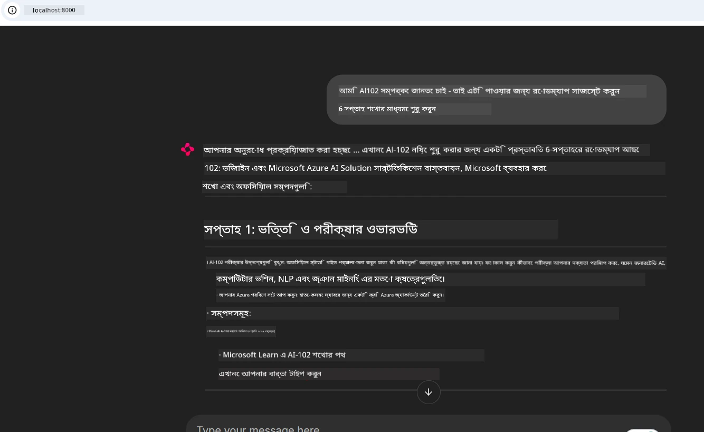
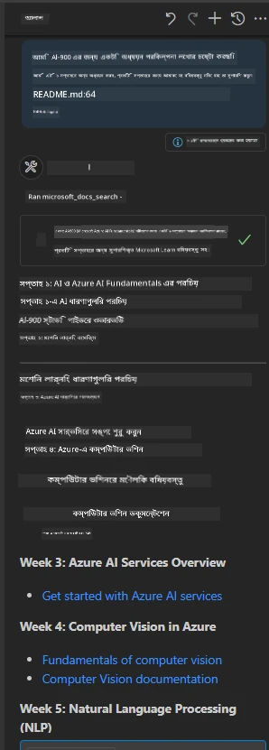

# কেস স্টাডি: ক্লায়েন্ট থেকে Microsoft Learn Docs MCP সার্ভারের সাথে সংযোগ

আপনি কি কখনো কোডের সমস্যার সমাধান করার সময় ডকুমেন্টেশন সাইট, Stack Overflow এবং অসংখ্য সার্চ ইঞ্জিন ট্যাবের মধ্যে ভাগাভাগি করতে শুন্য পেয়েছেন? হয়তো আপনি ডকুমেন্টেশনের জন্য একটি দ্বিতীয় মনিটর রেখেছেন, অথবা বারবার আপনার IDE এবং ব্রাউজারের মধ্যে alt-tab করছেন। যদি ডকুমেন্টেশন সরাসরি আপনার ওয়ার্কফ্লোতে নিয়ে আসা যেত—আপনার অ্যাপ, IDE, বা নিজস্ব কাস্টম টুলে ইন্টিগ্রেটেড—তবে কেমন হতো? এই কেস স্টাডিতে, আমরা দেখাব কিভাবে আপনার নিজস্ব ক্লায়েন্ট অ্যাপ্লিকেশন থেকে সরাসরি Microsoft Learn Docs MCP সার্ভারের সাথে সংযোগ স্থাপন করতে হয়।

## ওভারভিউ

আধুনিক উন্নয়ন শুধুমাত্র কোড লেখা নয়—এটি সঠিক সময়ে সঠিক তথ্য খুঁজে বের করা। ডকুমেন্টেশন সর্বত্র রয়েছে, তবে এটি প্রায়ই যেখানে আপনাকে সবচেয়ে বেশি প্রয়োজন সেখানে থাকে না: আপনার টুলস এবং ওয়ার্কফ্লো-এর মধ্যে। ডকুমেন্টেশন রিট্রিভালকে সরাসরি আপনার অ্যাপ্লিকেশনগুলিতে ইন্টিগ্রেট করে, আপনি সময় বাঁচাতে পারেন, প্রসঙ্গ পরিবর্তন কমাতে পারেন এবং উৎপাদনশীলতা বাড়াতে পারেন। এই সেকশনে, আমরা দেখাব কিভাবে একটি ক্লায়েন্টকে Microsoft Learn Docs MCP সার্ভারের সাথে সংযোগ স্থাপন করতে হয়, যাতে আপনি কখনও আপনার অ্যাপ ছাড়াই রিয়েল-টাইম, প্রসঙ্গ-সচেতন ডকুমেন্টেশন অ্যাক্সেস করতে পারেন।

আমরা সংযোগ স্থাপন করার, অনুরোধ পাঠানোর এবং স্ট্রিমিং রেসপন্স দক্ষভাবে হ্যান্ডেল করার প্রক্রিয়া নিয়ে যাব। এই পদ্ধতি কেবল আপনার ওয়ার্কফ্লোকে সহজতর করে না, বরং আরও স্মার্ট এবং সহায়ক ডেভেলপার টুলস তৈরির পথও খুলে দেয়।

## শেখার লক্ষ্যসমূহ

আমরা কেন এটি করছি? কারণ সেরা ডেভেলপার অভিজ্ঞতাগুলোই friction অপসারণ করে। কল্পনা করুন একটি এমন পৃথিবীর যেখানে আপনার কোড এডিটর, চ্যাটবট, বা ওয়েব অ্যাপটি Microsoft Learn থেকে সর্বশেষ কন্টেন্ট ব্যবহার করে আপনার ডকুমেন্টেশন প্রশ্নের উত্তর তাৎক্ষণিক দিতে পারে। এই অধ্যায়ের শেষে আপনি জানতে পারবেন কিভাবে:

- ডকুমেন্টেশনের জন্য MCP সার্ভার-ক্লায়েন্ট যোগাযোগের মৌলিক বিষয়গুলো বোঝা
- Microsoft Learn Docs MCP সার্ভারের সাথে সংযোগ করার জন্য একটি কনসোল বা ওয়েব অ্যাপ্লিকেশন বাস্তবায়ন করা
- রিয়েল-টাইম ডকুমেন্টেশন পাওয়ার জন্য স্ট্রিমিং HTTP ক্লায়েন্ট ব্যবহার করা
- আপনার অ্যাপে ডকুমেন্টেশন রেসপন্স লগ এবং ব্যাখ্যা করা

আপনি দেখবেন কিভাবে এই দক্ষতাগুলো আপনাকে কেবল প্রতিক্রিয়াশীল নয়, বরং সত্যিই ইন্টারেক্টিভ এবং প্রসঙ্গ-সচেতন টুলস তৈরি করতে সাহায্য করবে।

## দৃশ্যপট ১ - MCP দিয়ে রিয়েল-টাইম ডকুমেন্টেশন রিট্রিভাল

এই দৃশ্যপটে, আমরা আপনাকে দেখাব কিভাবে Microsoft Learn Docs MCP সার্ভারের সাথে একটি ক্লায়েন্ট সংযোগ করতে হয়, যাতে আপনি কখনও আপনার অ্যাপ ছাড়াই রিয়েল-টাইম, প্রসঙ্গ-সচেতন ডকুমেন্টেশন অ্যাক্সেস করতে পারেন।

চলুন এটি অনুশীলনে নিয়ে আসি। আপনার কাজ হলো এমন একটি অ্যাপ লেখা যা Microsoft Learn Docs MCP সার্ভারের সাথে সংযোগ স্থাপন করে, `microsoft_docs_search` টুলটিকে কল করে, এবং স্ট্রিমিং রেসপন্স কনসোলে লগ করে।

### কেন এই পদ্ধতি?
কারণ এটি উন্নত ইন্টিগ্রেশন তৈরি করার ভিত্তি—আপনি একটি চ্যাটবট, IDE এক্সটেনশন, অথবা ওয়েব ড্যাশবোর্ড চালাতে চান।

আপনি এই কেস স্টাডির [`solution`](./solution/README.md) ফোল্ডারে এই দৃশ্যপটের কোড ও নির্দেশাবলী পাবেন। পদক্ষেপগুলো আপনাকে সংযোগ সেটআপ করতে গাইড করবে:
- সংযোগের জন্য অফিসিয়াল MCP SDK এবং স্ট্রিমেবল HTTP ক্লায়েন্ট ব্যবহার করুন
- ডকুমেন্টেশন রিট্রিভাল করার জন্য `microsoft_docs_search` টুল কল করুন কুয়েরি প্যারামিটারসহ
- সঠিক লগিং এবং ত্রুটি হ্যান্ডলিং বাস্তবায়ন করুন
- ব্যবহারকারীদের একাধিক সার্চ কুয়েরি প্রবেশ করার জন্য একটি ইন্টারেক্টিভ কনসোল ইন্টারফেস তৈরি করুন

এই দৃশ্যপটে দেখানো হয়েছে কিভাবে:
- Docs MCP সার্ভারের সাথে সংযোগ করতে হয়
- একটি কুয়েরি পাঠাতে হয়
- ফলাফল পার্স করে প্রিন্ট করতে হয়

এখানে সলিউশন চালানোর একটি উদাহরণ হতে পারে:

```
Prompt> What is Azure Key Vault?
Answer> Azure Key Vault is a cloud service for securely storing and accessing secrets. ...
```

নিচে একটি সর্বনিম্ন নমুনা সলিউশন দেওয়া হয়েছে। সম্পূর্ণ কোড এবং বিস্তারিত সলিউশন ফোল্ডারে পাওয়া যাবে।

<details>
<summary>Python</summary>

```python
import asyncio
from mcp.client.streamable_http import streamablehttp_client
from mcp import ClientSession

async def main():
    async with streamablehttp_client("https://learn.microsoft.com/api/mcp") as (read_stream, write_stream, _):
        async with ClientSession(read_stream, write_stream) as session:
            await session.initialize()
            result = await session.call_tool("microsoft_docs_search", {"query": "Azure Functions best practices"})
            print(result.content)

if __name__ == "__main__":
    asyncio.run(main())
```

- সম্পূর্ণ বাস্তবায়ন এবং লগিংয়ের জন্য দেখুন [`scenario1.py`](../../../../09-CaseStudy/docs-mcp/solution/python/scenario1.py)।
- ইনস্টলেশন এবং ব্যবহারের নির্দেশনার জন্য দেখুন একই ফোল্ডারের [`README.md`](./solution/python/README.md) ফাইল।
</details>


## দৃশ্যপট ২ - MCP সহ ইন্টারেক্টিভ স্টাডি প্ল্যান জেনারেটর ওয়েব অ্যাপ

এই দৃশ্যপটে, আপনি শিখবেন কিভাবে Docs MCP একটি ওয়েব ডেভেলপমেন্ট প্রকল্পে ইন্টিগ্রেট করতে হয়। লক্ষ্য হলো ব্যবহারকারীদের সরাসরি একটি ওয়েব ইন্টারফেস থেকে Microsoft Learn ডকুমেন্টেশন সার্চ করার সক্ষমতা দেওয়া, যাতে ডকুমেন্টেশন আপনার অ্যাপ বা সাইটের মধ্যে তাৎক্ষণিকভাবে অ্যাক্সেসযোগ্য হয়।

আপনি শিখবেন কিভাবে:
- একটি ওয়েব অ্যাপ সেটআপ করতে হয়
- Docs MCP সার্ভারের সাথে সংযোগ করতে হয়
- ব্যবহারকারীর ইনপুট হ্যান্ডেল করতে হয় এবং ফলাফল প্রদর্শন করতে হয়

এখানে সলিউশন চালানোর একটি উদাহরণ:

```
User> I want to learn about AI102 - so suggest the roadmap to get it started from learn for 6 weeks

Assistant> Here’s a detailed 6-week roadmap to start your preparation for the AI-102: Designing and Implementing a Microsoft Azure AI Solution certification, using official Microsoft resources and focusing on exam skills areas:

---
## Week 1: Introduction & Fundamentals
- **Understand the Exam**: Review the [AI-102 exam skills outline](https://learn.microsoft.com/en-us/credentials/certifications/exams/ai-102/).
- **Set up Azure**: Sign up for a free Azure account if you don't have one.
- **Learning Path**: [Introduction to Azure AI services](https://learn.microsoft.com/en-us/training/modules/intro-to-azure-ai/)
- **Focus**: Get familiar with Azure portal, AI capabilities, and necessary tools.

....more weeks of the roadmap...

Let me know if you want module-specific recommendations or need more customized weekly tasks!
```

নিচে একটি সর্বনিম্ন নমুনা সলিউশন দেওয়া হয়েছে। সম্পূর্ণ কোড এবং বিস্তারিত সলিউশন ফোল্ডারে পাওয়া যাবে।



<details>
<summary>Python (Chainlit)</summary>

Chainlit হল কথোপকথনমূলক AI ওয়েব অ্যাপ তৈরির একটি ফ্রেমওয়ার্ক। এটি ইন্টারেক্টিভ চ্যাটবট এবং সহকারী তৈরি করতে সহজ করে, যেগুলো MCP টুলগুলি কল করতে পারে এবং ফলাফল রিয়েল টাইমে প্রদর্শন করতে পারে। এটি দ্রুত প্রোটোটাইপ তৈরি এবং ব্যবহারকারী-বান্ধব ইন্টারফেসের জন্য আদর্শ।

```python
import chainlit as cl
import requests

MCP_URL = "https://learn.microsoft.com/api/mcp"

@cl.on_message
def handle_message(message):
    query = {"question": message}
    response = requests.post(MCP_URL, json=query)
    if response.ok:
        result = response.json()
        cl.Message(content=result.get("answer", "No answer found.")).send()
    else:
        cl.Message(content="Error: " + response.text).send()
```

- সম্পূর্ণ বাস্তবায়নের জন্য দেখুন [`scenario2.py`](../../../../09-CaseStudy/docs-mcp/solution/python/scenario2.py)।
- সেটআপ এবং রান করার নির্দেশনার জন্য দেখুন [`README.md`](./solution/python/README.md)।
</details>


## দৃশ্যপট ৩: VS Code-এ MCP সার্ভার সহ ইন-এডিটর ডকস

যদি আপনি ব্রাউজার ট্যাব পরিবর্তন না করে সরাসরি VS Code-এর ভিতরে Microsoft Learn Docs পেতে চান, তাহলে আপনি আপনার এডিটরে MCP সার্ভার ব্যবহার করতে পারেন। এটি আপনাকে করতে দেয়:
- কোডিং পরিবেশ ছাড়াই VS Code-এ ডকস খুঁজে পড়তে।
- ডকুমেন্টেশন রেফারেন্স এবং লিংক সরাসরি README বা কোর্স ফাইলে প্রবেশ করাতে।
- GitHub Copilot এবং MCP একসাথে ব্যবহার করে একটি সিমলেস, AI-চালিত ডকুমেন্টেশন ওয়ার্কফ্লো গড়ে তুলতে।

**আপনি শিখবেন কিভাবে:**
- আপনার ওয়ার্কস্পেস রুটে একটি বৈধ `.vscode/mcp.json` ফাইল যোগ করতে (নিচে উদাহরণ দেখুন)।
- MCP প্যানেল খুলতে বা VS Code-এ কমান্ড প্যালেট দিয়ে ডকস সার্চ এবং ইনসার্ট করতে।
- কাজ করার সময় সরাসরি আপনার মার্কডাউন ফাইলে ডকুমেন্টেশন রেফারেন্স করতে।
- এই ওয়ার্কফ্লো GitHub Copilot-এর সাথে মিলিয়ে ব্যবহার করে আরও বেশি উৎপাদনশীল হতে।

এখানে MCP সার্ভার VS Code-এ সেটআপ করার একটি উদাহরণ:

```json
{
  "servers": {
    "LearnDocsMCP": {
      "url": "https://learn.microsoft.com/api/mcp"
    }
  }
}
```

</details>

> বিস্তারিত স্ক্রিনশট এবং ধাপে ধাপে গাইডের জন্য দেখুন [`README.md`](./solution/scenario3/README.md)।



এই পদ্ধতি কারোর জন্য আদর্শ যাঁরা প্রযুক্তিগত কোর্স তৈরি করে, ডকুমেন্টেশন লিখে, অথবা ঘন ঘন রেফারেন্স প্রয়োজন এমন কোড ডেভেলপ করে।

## মূল বিষয়সমূহ

আপনার টুলে ডকুমেন্টেশন সরাসরি ইন্টিগ্রেট করা শুধু একটি সুবিধা নয়—এটি উৎপাদনশীলতার জন্য একটি গেম চেঞ্জার। ক্লায়েন্ট থেকে Microsoft Learn Docs MCP সার্ভারের সাথে সংযোগ করে, আপনি:

- আপনার কোড এবং ডকুমেন্টেশনের মধ্যে প্রসঙ্গ পরিবর্তন অপসারণ করতে পারেন
- আপ-টু-ডেট, প্রসঙ্গ-সচেতন ডকস রিয়েল টাইমে রিট্রিভ করতে পারেন
- আরও স্মার্ট, ইন্টারেক্টিভ ডেভেলপার টুলস তৈরি করতে পারেন

এই দক্ষতাগুলো আপনাকে এমন সলিউশন তৈরি করতে সাহায্য করবে যা কেবল কার্যকরই নয়, ব্যবহার করতেও আনন্দদায়ক।

## অতিরিক্ত সম্পদ

আপনার বোঝাপড়া গভীর করতে, এই অফিসিয়াল সম্পদগুলো অন্বেষণ করুন:

- [Microsoft Learn Docs MCP Server (GitHub)](https://github.com/MicrosoftDocs/mcp)
- [Azure MCP Server শুরু করুন (mcp-python)](https://learn.microsoft.com/en-us/azure/developer/azure-mcp-server/get-started#create-the-python-app)
- [Azure MCP Server কী?](https://learn.microsoft.com/en-us/azure/developer/azure-mcp-server/)
- [Model Context Protocol (MCP) পরিচিতি](https://modelcontextprotocol.io/introduction)
- [MCP সার্ভার থেকে প্লাগইন যোগ করুন (Python)](https://learn.microsoft.com/en-us/semantic-kernel/concepts/plugins/adding-mcp-plugins)

## পরবর্তী ধাপ

- ফিরে যান: [কেস স্টাডিস ওভারভিউ](../README.md)
- চালিয়ে যান: [মডিউল ১০: AI টুলকিট দিয়ে AI ওয়ার্কফ্লো স্ট্রিমলাইন করা](../../10-StreamliningAIWorkflowsBuildingAnMCPServerWithAIToolkit/README.md)

---

<!-- CO-OP TRANSLATOR DISCLAIMER START -->
**অস্বীকৃতি**:  
এই নথিটি AI অনুবাদ সেবা [Co-op Translator](https://github.com/Azure/co-op-translator) ব্যবহার করে অনূদিত হয়েছে। আমরা যথাসাধ্য সঠিকতার জন্য চেষ্টা করি, তবে স্বয়ংক্রিয় অনুবাদে ত্রুটি বা অসঙ্গতি থাকতে পারে। মূল নথি এর মূর্ত ভাষায় শ্রোতব্য উৎস হিসেবে বিবেচনা করা উচিত। গুরুত্বপূর্ণ তথ্যের জন্য, পেশাদার মানব অনুবাদ সুপারিশ করা হয়। এই অনুবাদের ব্যবহারের ফলে যে কোনও ভুল বোঝাবুঝি বা ভুল ব্যাখ্যার জন্য আমরা দায়ী নই।
<!-- CO-OP TRANSLATOR DISCLAIMER END -->