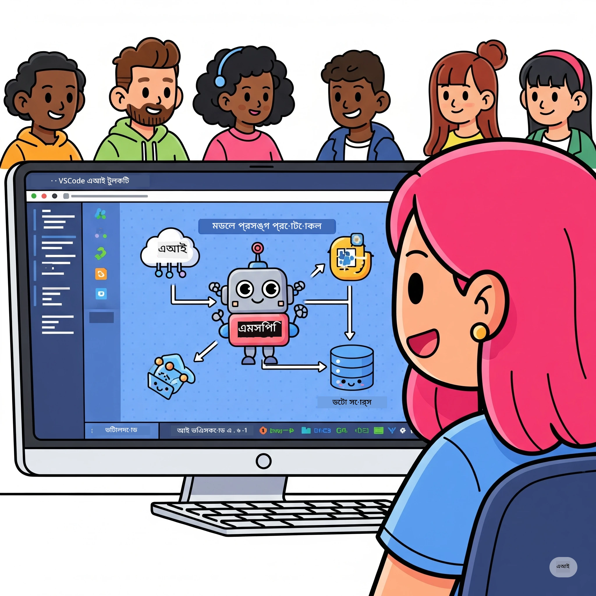

# AI ওয়ার্কফ্লো সহজীকরণ: AI Toolkit দিয়ে MCP সার্ভার তৈরি

## 🎯  ওভারভিউ

_(এই লেসনের ভিডিও দেখতে উপরের ছবি ক্লিক করুন)_

স্বাগতম **Model Context Protocol (MCP) কর্মশালায়**! এই পূর্ণাঙ্গ হ্যান্ডস-অন কর্মশালাটি দুইটি সর্বাধুনিক প্রযুক্তিকে সংযুক্ত করে AI অ্যাপ্লিকেশন উন্নয়নে বিপ্লব আনবে:

- **🔗 Model Context Protocol (MCP)**: নির্বিঘ্ন AI-টুল ইন্টিগ্রেশনের জন্য একটি খোলা মানদণ্ড
- **🛠️ AI Toolkit for Visual Studio Code (AITK)**: মাইক্রোসফ্টের শক্তিশালী AI উন্নয়ন এক্সটেনশন

### 🎓 আপনি কী শিখবেন

এই কর্মশালার শেষে, আপনি বুদ্ধিমান অ্যাপ্লিকেশন তৈরির দক্ষতা অর্জন করবেন যা AI মডেলকে বাস্তব জীবনের টুল ও সার্ভিসের সাথে সংযোগ করে। স্বয়ংক্রিয় টেস্টিং থেকে শুরু করে কাস্টম API ইন্টিগ্রেশন পর্যন্ত, আপনি জটিল ব্যবসায়িক সমস্যার সমাধানে ব্যবহারিক দক্ষতা পাবেন।

## 🏗️ প্রযুক্তি স্ট্যাক

### 🔌 Model Context Protocol (MCP)

MCP হলো **"AI-এর জন্য USB-C"** — একটি সর্বজনীন স্ট্যান্ডার্ড যা AI মডেলকে বাহ্যিক টুল এবং ডেটা উৎসের সাথে সংযুক্ত করে।

**✨ প্রধান বৈশিষ্ট্য:**

- 🔄 **স্ট্যান্ডার্ডাইজড ইন্টিগ্রেশন**: AI-টুল সংযোগের জন্য সর্বজনীন ইন্টারফেস
- 🏛️ **লচকদার স্থাপত্য**: stdio/SSE পরিবহনের মাধ্যমে লোকাল ও রিমোট সার্ভার
- 🧰 **সমৃদ্ধ ইকোসিস্টেম**: টুল, প্রম্পট, এবং সম্পদ এক প্রোটোকলে
- 🔒 **এন্টারপ্রাইজ-সাজানো**: অন্তর্নির্মিত নিরাপত্তা ও নির্ভরযোগ্যতা

**🎯 MCP-এর গুরুত্ব:**
যেমন USB-C তার তার আয়োজনে বিশৃঙ্খলা দূর করেছে, MCP AI ইন্টিগ্রেশনের জটিলতা দূর করে। একটি প্রোটোকল, অসীম সম্ভাবনা।

### 🤖 AI Toolkit for Visual Studio Code (AITK)

মাইক্রোসফ্টের প্রধান AI উন্নয়ন এক্সটেনশন যা VS Code কে একটি শক্তিশালী AI প্ল্যাটফর্মে রূপান্তর করে।

**🚀 মূল সক্ষমতা:**

- 📦 **মডেল ক্যাটালগ**: Azure AI, GitHub, Hugging Face, Ollama থেকে মডেল অ্যাক্সেস
- ⚡ **লোকাল ইনফারেন্স**: ONNX-অপ্টিমাইজড CPU/GPU/NPU এক্সিকিউশন
- 🏗️ **এজেন্ট বিল্ডার**: MCP ইন্টিগ্রেশনের সাথে ভিজ্যুয়াল AI এজেন্ট ডেভেলপমেন্ট
- 🎭 **মাল্টি-মোডাল**: টেক্সট, ভিশন, এবং স্ট্রাকচার্ড আউটপুট সমর্থন

**💡 উন্নয়নের সুবিধা:**

- জিরো-কনফিগ মডেল ডিপ্লয়মেন্ট
- ভিজ্যুয়াল প্রম্পট ইঞ্জিনিয়ারিং
- রিয়েল-টাইম টেস্টিং প্লেগ্রাউন্ড
- নির্বিঘ্ন MCP সার্ভার ইন্টিগ্রেশন

## 📚 শেখার যাত্রা

### [🚀 মডিউল ১: AI Toolkit বুনিয়াদ](./lab1/README.md)

**সময়কাল**: ১৫ মিনিট

- 🛠️ VS Code এর জন্য AI Toolkit ইনস্টল ও কনফিগার করুন
- 🗂️ মডেল ক্যাটালগ এক্সপ্লোর করুন (GitHub, ONNX, OpenAI, Anthropic, Google থেকে ১০০+ মডেল)
- 🎮 রিয়েল-টাইম মডেল টেস্টিং এর জন্য ইন্টারেক্টিভ প্লেগ্রাউন্ড শিখুন
- 🤖 Agent Builder ব্যবহার করে প্রথম AI এজেন্ট তৈরি করুন
- 📊 বিল্ট-ইন মেট্রিক্স (F1, relevance, similarity, coherence) দিয়ে মডেল পারফরম্যান্স মূল্যায়ন করুন
- ⚡ ব্যাচ প্রসেসিং এবং মাল্টি-মোডাল সমর্থন সক্ষমতা শিখুন

**🎯 শেখার ফলাফল**: AITK ক্ষমতার পূর্ণাঙ্গ ধারণাসহ কার্যকর AI এজেন্ট তৈরি করুন

### [🌐 মডিউল ২: MCP এবং AI Toolkit বুনিয়াদ](./lab2/README.md)

**সময়কাল**: ২০ মিনিট

- 🧠 Model Context Protocol (MCP) স্থাপত্য ও ধারণা আয়ত্ত করুন
- 🌐 মাইক্রোসফ্টের MCP সার্ভার ইকোসিস্টেম অন্বেষণ করুন
- 🤖 Playwright MCP সার্ভার ব্যবহার করে ব্রাউজার অটোমেশন এজেন্ট তৈরি করুন
- 🔧 AI Toolkit Agent Builder এর সাথে MCP সার্ভার ইন্টিগ্রেট করুন
- 📊 আপনার এজেন্টে MCP টুলস কনফিগার ও টেস্ট করুন
- 🚀 MCP-সংশ্লিষ্ট এজেন্ট প্রডাকশনে এক্সপোর্ট ও ডেপ্লয় করুন

**🎯 শেখার ফলাফল**: বাহ্যিক টুলস মাধ্যমে MCP সম্পৃক্ত AI এজেন্ট ডেপ্লয় করুন

### [🔧 মডিউল ৩: AI Toolkit এর সাথে উন্নত MCP ডেভেলপমেন্ট](./lab3/README.md)

**সময়কাল**: ২০ মিনিট

- 💻 AI Toolkit ব্যবহার করে কাস্টম MCP সার্ভার তৈরি করুন
- 🐍 MCP Python SDK (v1.9.3) কনফিগার ও ব্যবহার করুন
- 🔍 MCP Inspector দিয়ে ডিবাগিং সেটআপ করুন এবং ব্যবহার করুন
- 🛠️ পেশাদার ডিবাগিং ওয়ার্কফ্লোর সঙ্গে Weather MCP Server তৈরি করুন
- 🧪 Agent Builder এবং Inspector উভয় পরিবেশে MCP সার্ভার ডিবাগ করুন

**🎯 শেখার ফলাফল**: আধুনিক টুলিং দ্বারা কাস্টম MCP সার্ভার তৈরি ও ডিবাগ শিখুন

### [🐙 মডিউল ৪: ব্যবহারিক MCP ডেভেলপমেন্ট - কাস্টম GitHub ক্লোন সার্ভার](./lab4/README.md)

**সময়কাল**: ৩০ মিনিট

- 🏗️ ডেভেলপমেন্ট ওয়ার্কফ্লোর জন্য বাস্তবধর্মী GitHub Clone MCP Server তৈরি করুন
- 🔄 স্মার্ট রিপোজিটরি ক্লোনিং বাস্তবায়ন করুন, ভ্যালিডেশন ও এরর হ্যান্ডলিং সহ
- 📁 বুদ্ধিমান ডিরেক্টরি ম্যানেজমেন্ট ও VS Code ইন্টিগ্রেশন করুন
- 🤖 কাস্টম MCP টুলস সহ GitHub Copilot Agent মোড ব্যবহার করুন
- 🛡️ প্রডাকশন-রেডি নির্ভরযোগ্যতা এবং ক্রস-প্ল্যাটফর্ম সামঞ্জস্যতা প্রয়োগ করুন

**🎯 শেখার ফলাফল**: বাস্তব উন্নয়ন ওয়ার্কফ্লো সহজীকরণে প্রডাকশন-রেডি MCP সার্ভার ডেপ্লয় করুন

## 💡 বাস্তব জগতের অ্যাপ্লিকেশন ও প্রভাব

### 🏢 এন্টারপ্রাইজ ব্যবহারের ক্ষেত্র

#### 🔄 DevOps অটোমেশন

আপনার ডেভেলপমেন্ট ওয়ার্কফ্লোকে বুদ্ধিমত্তার সাথে অটোমেট করুন:

- **স্মার্ট রিপোজিটরি ম্যানেজমেন্ট**: AI-চালিত কোড রিভিউ ও মার্জ সিদ্ধান্ত
- **বুদ্ধিমান CI/CD**: কোড পরিবর্তনের ভিত্তিতে স্বয়ংক্রিয় পাইপলাইন অপটিমাইজেশন
- **ইস্যু ট্রায়াজ**: বাগের স্বয়ংক্রিয় শ্রেণীবিভাগ ও নিয়োগ

#### 🧪 কোয়ালিটি অ্যাসিউরেন্স বিপ্লব

AI-চালিত অটোমেশনের মাধ্যমে টেস্টিং উন্নত করুন:

- **বুদ্ধিমান টেস্ট জেনারেশন**: স্বয়ংক্রিয়ভাবে ব্যাপক টেস্ট স্যুট তৈরি
- **ভিজ্যুয়াল রিগ্রেশন টেস্টিং**: AI-চালিত UI পরিবর্তন সনাক্তকরণ
- **পারফরম্যান্স মনিটরিং**: সক্রিয় সমস্যা সনাক্তকরণ ও সমাধান

#### 📊 ডেটা পাইপলাইন বুদ্ধিমত্তা

চতুর ডেটা প্রসেসিং ওয়ার্কফ্লো তৈরি করুন:

- **অ্যাডাপটিভ ETL প্রক্রিয়া**: স্বয়ংক্রিয়ভাবে ডেটা রূপান্তর উন্নতকরণ
- **অস্বাভাবিকতা সনাক্তকরণ**: রিয়েল-টাইম ডেটা গুণগত মান পর্যবেক্ষণ
- **বুদ্ধিমান রাউটিং**: স্মার্ট ডেটা ফ্লো ম্যানেজমেন্ট

#### 🎧 গ্রাহক অভিজ্ঞতা উন্নয়ন

অসাধারণ গ্রাহক সংযোগ তৈরি করুন:

- **প্রসঙ্গ সচেতন সাপোর্ট**: গ্রাহকের ইতিহাসের অ্যাক্সেসসহ AI এজেন্ট
- **প্রোএকটিভ সমস্যা সমাধান**: পূর্বাভাসভিত্তিক গ্রাহক সেবা
- **মাল্টি-চ্যানেল ইন্টিগ্রেশন**: প্ল্যাটফর্ম জুড়ে একক AI অভিজ্ঞতা

## 🛠️ প্রয়োজনীয়তা ও সেটআপ

### 💻 সিস্টেমের প্রয়োজনীয়তা

| উপাদান | প্রয়োজন | নোট |
|-----------|-------------|-------|
| **অপারেটিং সিস্টেম** | Windows 10+, macOS 10.15+, Linux | যে কোন আধুনিক OS |
| **Visual Studio Code** | সর্বশেষ স্থিতিশীল সংস্করণ | AITK এর জন্য আবশ্যক |
| **Node.js** | v18.0+ এবং npm | MCP সার্ভার ডেভেলপমেন্ট জন্য |
| **Python** | 3.10+ | পছন্দসই, Python MCP সার্ভারের জন্য |
| **মেমরি** | ন্যূনতম ৮GB RAM | লোকাল মডেলের জন্য ১৬GB সুপারিশযোগ্য |

### 🔧 ডেভেলপমেন্ট পরিবেশ

#### প্রস্তাবিত VS Code এক্সটেনশন

- **AI Toolkit** (ms-windows-ai-studio.windows-ai-studio)
- **Python** (ms-python.python)
- **Python Debugger** (ms-python.debugpy)
- **GitHub Copilot** (GitHub.copilot) - ঐচ্ছিক কিন্তু সহায়ক

#### ঐচ্ছিক টুলস

- **uv**: আধুনিক Python প্যাকেজ ম্যানেজার
- **MCP Inspector**: MCP সার্ভারের জন্য ভিজ্যুয়াল ডিবাগিং টুল
- **Playwright**: ওয়েব অটোমেশন উদাহরণের জন্য

## 🎖️ শেখার ফলাফল এবং সার্টিফিকেশন পথ

### 🏆 দক্ষতা মাস্টারি চেকলিস্ট

এই কর্মশালা সম্পন্ন করে আপনি নিম্নলিখিত ক্ষেত্রে পারদর্শী হবেন:

#### 🎯 মূল দক্ষতা

- [ ] **MCP প্রোটোকল মাস্টারি**: স্থাপত্য ও বাস্তবায়ন প্যাটার্ন গভীরভাবে বোঝা
- [ ] **AITK দক্ষতা**: AI Toolkit ব্যবহার করে দ্রুত উন্নয়নের বিশেষজ্ঞ
- [ ] **কাস্টম সার্ভার ডেভেলপমেন্ট**: MCP সার্ভার তৈরি, ডেপ্লয় এবং পরিপালন
- [ ] **টুল ইন্টিগ্রেশন উৎকর্ষ**: বিদ্যমান ডেভেলপমেন্ট ওয়ার্কফ্লোর সাথে নির্বিঘ্ন AI সংযোগ
- [ ] **সমস্যা সমাধানের প্রয়োগ**: বাস্তব ব্যবসায়িক চ্যালেঞ্জে শেখা দক্ষতার প্রয়োগ

#### 🔧 প্রযুক্তিগত দক্ষতা

- [ ] VS Code-এ AI Toolkit সেটআপ ও কনফিগার করা
- [ ] কাস্টম MCP সার্ভার ডিজাইন ও বাস্তবায়ন
- [ ] MCP স্থাপত্যের সাথে GitHub মডেল ইন্টিগ্রেশন
- [ ] Playwright দিয়ে স্বয়ংক্রিয় টেস্টিং ওয়ার্কফ্লো নির্মাণ
- [ ] প্রডাকশনের জন্য AI এজেন্ট ডেপ্লয়মেন্ট
- [ ] MCP সার্ভার পারফরম্যান্স ডিবাগ ও অপটিমাইজ করা

#### 🚀 উন্নত সক্ষমতা

- [ ] এন্টারপ্রাইজ-স্কেল AI ইন্টিগ্রেশন স্থাপত্য করা
- [ ] AI অ্যাপ্লিকেশনের জন্য নিরাপত্তার সেরা অনুশীলন বাস্তবায়ন করা
- [ ] স্কেলএবল MCP সার্ভার স্থাপত্য ডিজাইন করা
- [ ] নির্দিষ্ট ডোমেইনের জন্য কাস্টম টুল চেইন তৈরি করা
- [ ] AI-নেটিভ উন্নয়নের ক্ষেত্রে অন্যদের পরামর্শ দেওয়া

## 📖 অতিরিক্ত রিসোর্স

- [MCP স্পেসিফিকেশন (2025-11-25)](https://spec.modelcontextprotocol.io/specification/2025-11-25/)
- [AI Toolkit GitHub রিপোজিটোরি](https://github.com/microsoft/vscode-ai-toolkit)
- [নমুনা MCP সার্ভার সংগ্রহ](https://github.com/modelcontextprotocol/servers)
- [সেরা অনুশীলন গাইড](https://modelcontextprotocol.io/docs/best-practices)
- [OWASP MCP টপ ১০](https://microsoft.github.io/mcp-azure-security-guide/mcp/) - নিরাপত্তার সেরা অনুশীলন

---

**🚀 আপনার AI উন্নয়ন ওয়ার্কফ্লো ঝাঁকুনির জন্য প্রস্তুত?**

MCP এবং AI Toolkit দিয়ে একসাথে বুদ্ধিমান অ্যাপ্লিকেশনের ভবিষ্যত গড়া শুরু করুন!

## পরবর্তী কী

চালিয়ে যান: [মডিউল ১১: MCP সার্ভার হ্যান্ডস-অন ল্যাব](../11-MCPServerHandsOnLabs/README.md)

---

<!-- CO-OP TRANSLATOR DISCLAIMER START -->
**অস্বীকৃতি**:  
এই নথিটি AI অনুবাদ সেবা [Co-op Translator](https://github.com/Azure/co-op-translator) ব্যবহার করে অনূদিত হয়েছে। যদিও আমরা সঠিকতার জন্য চেষ্টা করি, তবুও দয়া করে বুঝবেন যে স্বয়ংক্রিয় অনুবাদে ত্রুটি বা ভুল থাকতে পারে। মূল নথিটি তার নিজস্ব ভাষায় প্রামাণিক উৎস হিসেবে বিবেচনা করা উচিত। গুরুত্বপূর্ণ তথ্যের জন্য পেশাদার মানব অনুবাদের পরামর্শ দেওয়া হয়। এই অনুবাদের ব্যবহারে কোনো ভুলবোঝাবুঝি বা ভুল ব্যাখ্যার জন্য আমরা দায়ী নই।
<!-- CO-OP TRANSLATOR DISCLAIMER END -->