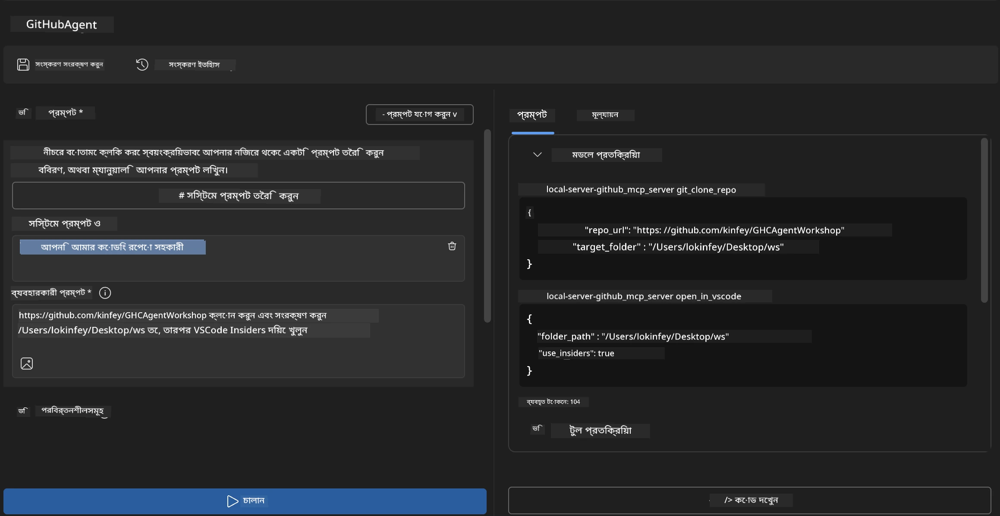
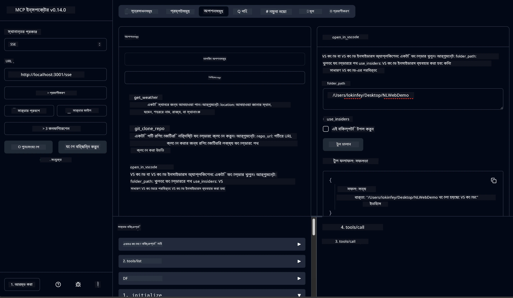

# 🐙 মডিউল ৪: ব্যবহারিক MCP উন্নয়ন - কাস্টম গিথাব ক্লোন সার্ভার


> **⚡ দ্রুত শুরু:** মাত্র ৩০ মিনিটে একটি প্রোডাকশন-রেডি MCP সার্ভার তৈরি করুন যা গিথাব রিপোজিটরি ক্লোন এবং VS Code ইন্টিগ্রেশন স্বয়ংক্রিয় করে!

## 🎯 শেখার উদ্দেশ্যসমূহ

এই ল্যাবের শেষে, আপনি সক্ষম হবেন:

- ✅ বাস্তব বিশ্বের উন্নয়ন কর্মপ্রবাহের জন্য একটি কাস্টম MCP সার্ভার তৈরি করতে
- ✅ MCP মাধ্যমে গিথাব রিপোজিটরি ক্লোনিং কার্যকারিতা বাস্তবায়ন করতে
- ✅ কাস্টম MCP সার্ভারসমূহকে VS Code এবং Agent Builder এর সাথে ইন্টিগ্রেট করতে
- ✅ কাস্টম MCP টুলগুলির সাথে GitHub Copilot Agent Mode ব্যবহার করতে
- ✅ প্রোডাকশন পরিবেশে কাস্টম MCP সার্ভার টেস্ট ও ডিপ্লয় করতে

## 📋 পূর্বশর্তসমূহ

- ল্যাব ১-৩ সম্পন্ন করা (MCP মৌলিক এবং উন্নত উন্নয়ন)
- GitHub Copilot সাবস্ক্রিপশন ([বিনামূল্যে সাইনআপ উপলব্ধ](https://github.com/github-copilot/signup))
- AI Toolkit এবং GitHub Copilot এক্সটেনশন সহ VS Code
- Git CLI ইনস্টল এবং কনফিগার করা

## 🏗️ প্রকল্পসংক্ষেপ

### **বাস্তব বিশ্বের উন্নয়ন চ্যালেঞ্জ**
ডেভেলপার হিসেবে, আমরা নিয়মিত গিথাব থেকে রিপোজিটরি ক্লোন করে সেগুলো VS Code বা VS Code Insiders এ ওপেন করি। এ প্রক্রিয়া সাধারণত ম্যানুয়ালি হয়:
1. টার্মিনাল/কমান্ড প্রম্পট খোলা
2. ইচ্ছাকৃত ডিরেক্টরিতে যাওয়া
3. `git clone` কমান্ড চালানো
4. ক্লোন করা ডিরেক্টরিতে VS Code চালু করা

**আমাদের MCP সমাধান এটিকে একক বুদ্ধিমত্তাসম্পন্ন কমান্ডে রূপান্তরিত করে!**

### **আপনি যা তৈরি করবেন**
একটি **GitHub Clone MCP সার্ভার** (`git_mcp_server`) যা প্রদান করবে:

| বৈশিষ্ট্য | বর্ণনা | সুবিধা |
|---------|-------------|---------|
| 🔄 **স্মার্ট রিপোজিটরি ক্লোনিং** | গিথাব রিপোস ক্লোন করুন যাচাই-বাছাই সহ | স্বয়ংক্রিয় ত্রুটি পরীক্ষণ |
| 📁 **বুদ্ধিমান ডিরেক্টরি ব্যবস্থাপনা** | নিরাপদে ডিরেক্টরি পরীক্ষা ও তৈরি করুন | ওভাররাইট প্রতিরোধ |
| 🚀 **ক্রস-প্ল্যাটফর্ম VS Code ইন্টিগ্রেশন** | প্রজেক্ট VS Code/Insiders এ খুলুন | নির্বিঘ্ন কর্মপ্রবাহ রূপান্তর |
| 🛡️ **দৃঢ় ত্রুটি হ্যান্ডলিং** | নেটওয়ার্ক, অনুমতি ও পাথ সমস্যা সমাধান করুন | প্রোডাকশন-রেডি নির্ভরযোগ্যতা |

---

## 📖 ধাপে ধাপে বাস্তবায়ন

### ধাপ ১: Agent Builder এ GitHub এজেন্ট তৈরি করুন

1. AI Toolkit এক্সটেনশনের মাধ্যমে **Agent Builder চালু করুন**
2. নিম্নলিখিত কনফিগারেশন সহ **একটি নতুন এজেন্ট তৈরি করুন:**
   ```
   Agent Name: GitHubAgent
   ```

3. **কাস্টম MCP সার্ভার ইনিশিয়ালাইজ করুন:**
   - **Tools** → **Add Tool** → **MCP Server** এ যান
   - **"Create A new MCP Server"** নির্বাচন করুন
   - সর্বোচ্চ নমনীয়তার জন্য **Python টেমপ্লেট** বেছে নিন
   - **সার্ভার নাম:** `git_mcp_server`

### ধাপ ২: GitHub Copilot Agent Mode কনফিগার করুন

1. VS Code এ **GitHub Copilot খুলুন** (Ctrl/Cmd + Shift + P → "GitHub Copilot: Open")
2. Copilot ইন্টারফেসে **Agent Model নির্বাচন করুন**
3. উন্নত যুক্তি ক্ষমতার জন্য **Claude 3.7 মডেল বেছে নিন**
4. টুল অ্যাক্সেসের জন্য **MCP ইন্টিগ্রেশন সক্রিয় করুন**

> **💡 প্রো টিপ:** Claude 3.7 উন্নত ডেভেলপমেন্ট কর্মপ্রবাহ এবং ত্রুটি হ্যান্ডলিং প্যাটার্ন বোঝাতে বিশেষভাবে সক্ষম।

### ধাপ ৩: মূল MCP সার্ভার কার্যকারিতা বাস্তবায়ন করুন

**GitHub Copilot Agent Mode সহ নিম্নলিখিত বিস্তারিত প্রম্পট ব্যবহার করুন:**

```
Create two MCP tools with the following comprehensive requirements:

🔧 TOOL A: clone_repository
Requirements:
- Clone any GitHub repository to a specified local folder
- Return the absolute path of the successfully cloned project
- Implement comprehensive validation:
  ✓ Check if target directory already exists (return error if exists)
  ✓ Validate GitHub URL format (https://github.com/user/repo)
  ✓ Verify git command availability (prompt installation if missing)
  ✓ Handle network connectivity issues
  ✓ Provide clear error messages for all failure scenarios

🚀 TOOL B: open_in_vscode
Requirements:
- Open specified folder in VS Code or VS Code Insiders
- Cross-platform compatibility (Windows/Linux/macOS)
- Use direct application launch (not terminal commands)
- Auto-detect available VS Code installations
- Handle cases where VS Code is not installed
- Provide user-friendly error messages

Additional Requirements:
- Follow MCP 1.9.3 best practices
- Include proper type hints and documentation
- Implement logging for debugging purposes
- Add input validation for all parameters
- Include comprehensive error handling
```

### ধাপ ৪: আপনার MCP সার্ভার টেস্ট করুন

#### ৪ ক. Agent Builder এ পরীক্ষা করুন

1. Agent Builder এর ডিবাগ কনফিগারেশন চালু করুন
2. আপনার এজেন্টকে নিম্নলিখিত সিস্টেম প্রম্পট দিয়ে কনফিগার করুন:

```
SYSTEM_PROMPT:
You are my intelligent coding repository assistant. You help developers efficiently clone GitHub repositories and set up their development environment. Always provide clear feedback about operations and handle errors gracefully.
```

3. বর্ণনামূলক ব্যবহারকারী পরিস্থিতি দিয়ে পরীক্ষা করুন:

```
USER_PROMPT EXAMPLES:

Scenario : Basic Clone and Open
"Clone {Your GitHub Repo link such as https://github.com/kinfey/GHCAgentWorkshop
 } and save to {The global path you specify}, then open it with VS Code Insiders"
```



**প্রত্যাশিত ফলাফল:**
- ✅ সফল ক্লোনিং এবং পাথ নিশ্চিতকরণ
- ✅ স্বয়ংক্রিয় VS Code লঞ্চ
- ✅ অবৈধ পরিস্থিতির জন্য পরিষ্কার ত্রুটি বার্তা
- ✅ প্রান্তিক ক্ষেত্রে যথাযথ হ্যান্ডলিং

#### ৪ খ. MCP Inspector এ পরীক্ষা করুন




---


**🎉 অভিনন্দন!** আপনি সফলভাবে একটি ব্যবহারিক, প্রোডাকশন-রেডি MCP সার্ভার তৈরি করেছেন যা বাস্তব ডেভেলপমেন্ট কর্মপ্রবাহের চ্যালেঞ্জগুলো সমাধান করে। আপনার কাস্টম গিথাব ক্লোন সার্ভার MCP এর ক্ষমতা প্রদর্শন করে যা ডেভেলপার উৎপাদনশীলতা স্বয়ংক্রিয় এবং উন্নত করতে সাহায্য করে।

### 🏆 অর্জিত সফলতা:
- ✅ **MCP ডেভেলপার** - কাস্টম MCP সার্ভার তৈরি করেছেন
- ✅ **কর্মপ্রবাহ স্বয়ংক্রিয়কারী** - উন্নয়ন প্রক্রিয়াগুলো সহজ করেছেন  
- ✅ **ইন্টিগ্রেশন বিশেষজ্ঞ** - একাধিক উন্নয়ন সরঞ্জাম সংযুক্ত করেছেন
- ✅ **প্রোডাকশন-রেডি** - ডিপ্লয়েবল সমাধান নির্মাণ করেছেন

---

## 🎓 কর্মশালা সমাপ্তি: Model Context Protocol এর সাথে আপনার যাত্রা

**প্রিয় কর্মশালা অংশগ্রহণকারী,**

Model Context Protocol কর্মশালার সমস্ত চারটি মডিউল সম্পন্ন করার জন্য অভিনন্দন! আপনি AI Toolkit এর মৌলিক ধারণা থেকে শুরু করে বাস্তব-জীবনের উন্নয়ন সমস্যাগুলো সমাধানকারী প্রোডাকশন-রেডি MCP সার্ভার নির্মাণ পর্যন্ত অনেক দূর অতিক্রম করেছেন।

### 🚀 আপনার শেখার পথ সংক্ষেপ:

**[মডিউল ১](../lab1/README.md)**: AI Toolkit মৌলিক বিষয়সমূহ, মডেল টেস্টিং এবং আপনার প্রথম AI এজেন্ট তৈরি শেখা শুরু করেছিলেন।

**[মডিউল ২](../lab2/README.md)**: MCP আর্কিটেকচার, Playwright MCP ইন্টিগ্রেশন এবং প্রথম ব্রাউজার অটোমেশন এজেন্ট তৈরি শিখেছিলেন।

**[মডিউল ৩](../lab3/README.md)**: Weather MCP সার্ভার সহ কাস্টম MCP সার্ভার উন্নয়নে উন্নত হয়েছেন এবং ডিবাগিং সরঞ্জামগুলো আয়ত্ত করেছেন।

**[মডিউল ৪](../lab4/README.md)**: এখন আপনি একটি ব্যবহারিক গিথাব রিপোজিটরি কর্মপ্রবাহ অটোমেশন টুল তৈরি করেছেন।

### 🌟 আপনি যা শিখেছেন:

- ✅ **AI Toolkit ইকোসিস্টেম**: মডেলস, এজেন্টস, এবং ইন্টিগ্রেশন প্যাটার্ন
- ✅ **MCP আর্কিটেকচার**: ক্লায়েন্ট-সার্ভার ডিজাইন, ট্রান্সপোর্ট প্রোটোকল, ও নিরাপত্তা
- ✅ **ডেভেলপার সরঞ্জাম**: প্লেব্যাকগ্রাউন্ড থেকে ইনস্পেক্টর পর্যন্ত প্রোডাকশন ডিপ্লয়মেন্ট
- ✅ **কাস্টম উন্নয়ন**: নিজস্ব MCP সার্ভার তৈরি, পরীক্ষা, ও ডিপ্লয়মেন্ট
- ✅ **ব্যবহারিক অ্যাপ্লিকেশন**: AI দিয়ে বাস্তব কর্মপ্রবাহের চ্যালেঞ্জ সমাধান

### 🔮 আপনার পরবর্তী পদক্ষেপ:

1. **নিজস্ব MCP সার্ভার তৈরি করুন**: এই দক্ষতাগুলো ব্যবহার করে আপনার নিজস্ব কর্মপ্রবাহ অটোমেট করুন
2. **MCP কমিউনিটিতে যোগ দিন**: আপনার সৃষ্টি শেয়ার করুন এবং অন্যদের থেকে শিখুন
3. **উন্নত ইন্টিগ্রেশন অন্বেষণ করুন**: MCP সার্ভারগুলোকে এন্টারপ্রাইজ সিস্টেমের সাথে সংযুক্ত করুন
4. **ওপেন সোর্সে অবদান রাখুন**: MCP টুলিং ও ডকুমেন্টেশন উন্নত করতে সাহায্য করুন

মনে রাখবেন, এই কর্মশালা শুধুমাত্র শুরু। Model Context Protocol ইকোসিস্টেম দ্রুত বিকাশমান, এবং আপনি এখন AI-চালিত উন্নয়ন সরঞ্জামগুলোর শীর্ষে থাকার জন্য প্রস্তুত।

**আপনার অংশগ্রহণ এবং শেখার প্রতি নিষ্ঠার জন্য ধন্যবাদ!**

আমরা আশা করি এই কর্মশালা আপনাকে এমন আইডিয়া দিয়েছে যা আপনার ডেভেলপমেন্ট যাত্রায় AI টুল ব্যবহার ও নির্মাণের পদ্ধতি পাল্টে দেবে।

**শুভ কোডিং!**

---

## পরবর্তীতে কী

মডিউল ১০ এর সমস্ত ল্যাব সম্পন্ন করার জন্য অভিনন্দন!

- ফিরে যান: [মডিউল ১০ ওভারভিউ](../README.md)
- চালিয়ে যান: [মডিউল ১১: MCP সার্ভার হ্যান্ডস-অন ল্যাবস](../../11-MCPServerHandsOnLabs/README.md)

---

<!-- CO-OP TRANSLATOR DISCLAIMER START -->
**অস্বীকৃতি**:  
এই নথিটি AI অনুবাদ সেবা [Co-op Translator](https://github.com/Azure/co-op-translator) ব্যবহার করে অনূদিত হয়েছে। আমরা যথাসাধ্য সঠিকতার চেষ্টা করলেও, দয়া করে লক্ষ্য করুন যে স্বয়ংক্রিয় অনুবাদে ত্রুটির সম্ভাবনা থাকতে পারে। মূল নথি তার নিজস্ব ভাষায়ই কর্তৃপক্ষপূর্ণ উৎস হিসেবে গণ্য করা উচিত। গুরুত্বপূর্ণ তথ্যের জন্য পেশাদার মানব অনুবাদ গ্রহণ করাই শ্রেয়। এই অনুবাদের ব্যবহারে কোনো ভুল বোঝাবুঝি বা ভুল ব্যাখ্যার জন্য আমরা দায়বদ্ধ নই।
<!-- CO-OP TRANSLATOR DISCLAIMER END -->