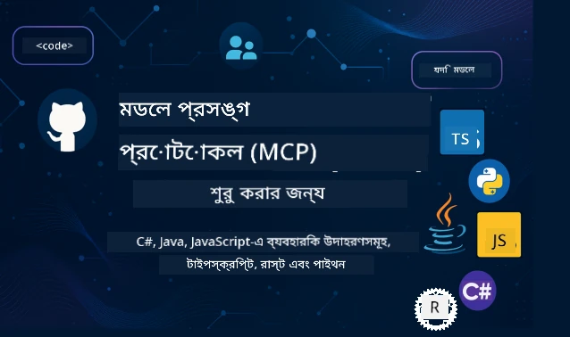

 

[](https://GitHub.com/microsoft/mcp-for-beginners/graphs/contributors)
[](https://GitHub.com/microsoft/mcp-for-beginners/issues)
[](https://GitHub.com/microsoft/mcp-for-beginners/pulls)
[](http://makeapullrequest.com)

[](https://GitHub.com/microsoft/mcp-for-beginners/watchers)
[](https://GitHub.com/microsoft/mcp-for-beginners/fork)
[](https://GitHub.com/microsoft/mcp-for-beginners/stargazers)


[](https://discord.gg/nTYy5BXMWG)

এই সম্পদগুলি ব্যবহার শুরু করতে এই পদক্ষেপগুলি অনুসরণ করুন:
1. **রিপোজিটরি ফর্ক করুন**: ক্লিক করুন [](https://GitHub.com/microsoft/mcp-for-beginners/fork)
2. **রিপোজিটরি ক্লোন করুন**:   `git clone https://github.com/microsoft/mcp-for-beginners.git`
3. **যোগ দিন** [](https://discord.gg/nTYy5BXMWG)


### 🌐 বহুভাষিক সমর্থন

#### GitHub Action এর মাধ্যমে সমর্থিত (স্বয়ংক্রিয় এবং সর্বদা আপ-টু-ডেট)

<!-- CO-OP TRANSLATOR LANGUAGES TABLE START -->
[Arabic](../ar/README.md) | [Bengali](./README.md) | [Bulgarian](../bg/README.md) | [Burmese (Myanmar)](../my/README.md) | [Chinese (Simplified)](../zh-CN/README.md) | [Chinese (Traditional, Hong Kong)](../zh-HK/README.md) | [Chinese (Traditional, Macau)](../zh-MO/README.md) | [Chinese (Traditional, Taiwan)](../zh-TW/README.md) | [Croatian](../hr/README.md) | [Czech](../cs/README.md) | [Danish](../da/README.md) | [Dutch](../nl/README.md) | [Estonian](../et/README.md) | [Finnish](../fi/README.md) | [French](../fr/README.md) | [German](../de/README.md) | [Greek](../el/README.md) | [Hebrew](../he/README.md) | [Hindi](../hi/README.md) | [Hungarian](../hu/README.md) | [Indonesian](../id/README.md) | [Italian](../it/README.md) | [Japanese](../ja/README.md) | [Kannada](../kn/README.md) | [Korean](../ko/README.md) | [Lithuanian](../lt/README.md) | [Malay](../ms/README.md) | [Malayalam](../ml/README.md) | [Marathi](../mr/README.md) | [Nepali](../ne/README.md) | [Nigerian Pidgin](../pcm/README.md) | [Norwegian](../no/README.md) | [Persian (Farsi)](../fa/README.md) | [Polish](../pl/README.md) | [Portuguese (Brazil)](../pt-BR/README.md) | [Portuguese (Portugal)](../pt-PT/README.md) | [Punjabi (Gurmukhi)](../pa/README.md) | [Romanian](../ro/README.md) | [Russian](../ru/README.md) | [Serbian (Cyrillic)](../sr/README.md) | [Slovak](../sk/README.md) | [Slovenian](../sl/README.md) | [Spanish](../es/README.md) | [Swahili](../sw/README.md) | [Swedish](../sv/README.md) | [Tagalog (Filipino)](../tl/README.md) | [Tamil](../ta/README.md) | [Telugu](../te/README.md) | [Thai](../th/README.md) | [Turkish](../tr/README.md) | [Ukrainian](../uk/README.md) | [Urdu](../ur/README.md) | [Vietnamese](../vi/README.md)

> **স্থানীয়ভাবে ক্লোন করতে চান?**
>
> এই রিপোজিটরিটি ৫০+ ভাষার অনুবাদ অন্তর্ভুক্ত করে যা ডাউনলোডের আকার অনেক বৃদ্ধি করে। অনুবাদ ছাড়া ক্লোন করতে, sparse checkout ব্যবহার করুন:
>
> **Bash / macOS / Linux:**
> ```bash
> git clone --filter=blob:none --sparse https://github.com/microsoft/mcp-for-beginners.git
> cd mcp-for-beginners
> git sparse-checkout set --no-cone '/*' '!translations' '!translated_images'
> ```
>
> **CMD (Windows):**
> ```cmd
> git clone --filter=blob:none --sparse https://github.com/microsoft/mcp-for-beginners.git
> cd mcp-for-beginners
> git sparse-checkout set --no-cone "/*" "!translations" "!translated_images"
> ```
>
> এতে আপনাকে একটি দ্রুত ডাউনলোড সহ কোর্স সম্পূর্ণ করার জন্য সবকিছু দেওয়া হবে।
<!-- CO-OP TRANSLATOR LANGUAGES TABLE END -->

# 🚀 বিগিনার্সদের জন্য মডেল কনটেক্সট প্রোটোকল (MCP) পাঠক্রম

## **C#, Java, JavaScript, Rust, Python, এবং TypeScript এ হাতে-কলমে কোড উদাহরণের মাধ্যমে MCP শিখুন**

## 🧠 মডেল কনটেক্সট প্রোটোকল পাঠক্রমের ওভারভিউ
আপনার মডেল কনটেক্সট প্রোটোকল যাত্রায় স্বাগতম! আপনি কি কখনও ভেবেছেন কিভাবে AI অ্যাপ্লিকেশনগুলো বিভিন্ন টুল এবং পরিষেবার সাথে সংযোগ স্থাপন করে? আপনি যা জানতে যাচ্ছেন তা হলো সেই সুন্দর সমাধান যা ডেভেলপারদের বুদ্ধিমান সিস্টেম তৈরি করার পদ্ধতি রূপান্তর করছে।

MCP-কে ভাবুন এআই অ্যাপ্লিকেশনগুলোর জন্য একটি সার্বজনীন অনুবাদক হিসেবে - যেমন USB পোর্ট আপনার কম্পিউটারের সাথে যেকোনো ডিভাইস সংযোগ করার সুযোগ দেয়, MCP-ও AI মডেলগুলোকে যেকোনো টুল বা পরিষেবার সাথে একটি মানানসই উপায়ে সংযোগ করতে সাহায্য করে। আপনি আপনার প্রথম চ্যাটবট তৈরি করছেন অথবা জটিল AI ওয়ার্কফ্লো নিয়ে কাজ করছেন, MCP বোঝা আপনাকে আরও সক্ষম এবং নমনীয় অ্যাপ্লিকেশন তৈরি করার শক্তি দেবে।

এই পাঠক্রমটি আপনার শেখার যাত্রার জন্য ধৈর্য এবং যত্ন সহকারে ডিজাইন করা হয়েছে। আমরা সহজ ধারণাগুলো দিয়ে শুরু করব যা আপনি ইতিমধ্যে জানেন এবং ধীরে ধীরে হাতে-কলম দিয়ে আপনার দক্ষতা তৈরি করব পছন্দের প্রোগ্রামিং ভাষায়। প্রতিটি ধাপে রয়েছে স্পষ্ট ব্যাখ্যা, ব্যবহারিক উদাহরণ এবং প্রচুর উৎসাহ।

আপনি যখন এই যাত্রাটি শেষ করবেন, তখন আপনার নিজস্ব MCP সার্ভার তৈরি করার আত্মবিশ্বাস থাকবে, জনপ্রিয় AI প্ল্যাটফর্মের সাথে সেগুলি ইন্টিগ্রেট করার সক্ষমতা থাকবে, এবং এই প্রযুক্তি কিভাবে AI উন্নয়নের ভবিষ্যতকে রূপান্তর করছে তা বুঝতে পারবেন। চলুন এই উত্তেজনাপূর্ণ অভিযান শুরু করি!

### অফিসিয়াল ডকুমেন্টেশন ও স্পেসিফিকেশন

এই পাঠক্রমটি **MCP স্পেসিফিকেশন ২০২৫-১১-২৫** (সর্বশেষ স্থিতিশীল সংস্করণ) এর সাথে মিল রেখে তৈরি। MCP স্পেসিফিকেশন তার সময়ভিত্তিক ভার্সন (YYYY-MM-DD ফরম্যাটে) ব্যবহার করে স্পষ্ট প্রোটোকল সংস্করণ ট্র্যাকিং নিশ্চিত করতে।

যেহেতু আপনার বোঝাপড়া বাড়বে, এই সম্পদগুলি আরও মূল্যবান হবে, তবে অবিলম্বে সব কিছু পড়ার চাপ অনুভব করবেন না। প্রথমে যে অংশগুলো আপনার সবচেয়ে বেশি আগ্রহের, সেখান থেকেই শুরু করুন!
- 📘 [MCP ডকুমেন্টেশন](https://modelcontextprotocol.io/) – এটি আপনার ধাপে ধাপে টিউটোরিয়াল এবং ব্যবহারকারী গাইডের জন্য প্রধান উৎস। ডকুমেন্টেশনটি নতুনদের কথা মাথায় রেখে লেখা হয়েছে, যা স্পষ্ট উদাহরণ সরবরাহ করে যা আপনি নিজ গতি অনুসারে অনুসরণ করতে পারবেন।
- 📜 [MCP স্পেসিফিকেশন](https://modelcontextprotocol.io/specification/2025-11-25) – এটিকে আপনার বিস্তৃত রেফারেন্স ম্যানুয়াল হিসেবে ভাবুন। আপনি যখন পাঠক্রমের মাধ্যমে কাজ করবেন, তখন এখানে আসবেন নির্দিষ্ট তথ্য দেখতে ও উন্নত বৈশিষ্ট্যগুলি আবিষ্কার করতে।
- 📜 [MCP স্পেসিফিকেশন ভার্সনিং](https://modelcontextprotocol.io/specification/versioning) – এতে প্রোটোকল সংস্করণ ইতিহাস এবং MCP কীভাবে তার সময়ভিত্তিক ভার্সনিং (YYYY-MM-DD ফরম্যাটে) ব্যবহার করে তা সংক্রান্ত তথ্য রয়েছে।
- 🧑‍💻 [MCP গিটহাব রিপোজিটরি](https://github.com/modelcontextprotocol) – এখানে আপনি SDK, টুল এবং একাধিক প্রোগ্রামিং ভাষার কোড স্যাম্পল পাবেন। এটি ব্যবহারিক উদাহরণ এবং প্রস্তুত কম্পোনেন্টের একটি ধনভান্ডার।
- 🌐 [MCP কমিউনিটি](https://github.com/orgs/modelcontextprotocol/discussions) – MCP নিয়ে আলোচনা করতে অনুরাগী শিক্ষার্থী ও অভিজ্ঞ ডেভেলপারদের সাথে যোগ দিন। এটি একটি সহায়ক সম্প্রদায় যেখানে প্রশ্ন স্বাগত এবং জ্ঞান বিনিময় করা হয়।

## শেখার লক্ষ্যসমূহ

এই পাঠক্রমের শেষে, আপনি আপনার নতুন দক্ষতা নিয়ে আত্মবিশ্বাসী এবং উচ্ছ্বসিত বোধ করবেন। এখানে আপনি যা অর্জন করবেন:

• **MCP-এর মৌলিক ধারণা বোঝা**: আপনি বুঝতে পারবেন মডেল কন্টেক্সট প্রোটোকল কী এবং এটি কীভাবে AI অ্যাপ্লিকেশনগুলোকে একসাথে কাজ করার পথে বিপ্লব ঘটাচ্ছে, বোধগম্য উদাহরণ ও সাদৃশ্যের মাধ্যমে।

• **আপনার প্রথম MCP সার্ভার তৈরি করা**: আপনি আপনার পছন্দের প্রোগ্রামিং ভাষায় একটি কার্যকর MCP সার্ভার তৈরি করবেন, সহজ উদাহরণ থেকে শুরু করে ধাপে ধাপে দক্ষতা বাড়াবেন।

• **AI মডেলগুলোকে বাস্তব টুলের সাথে সংযোগ করা**: আপনি শিখবেন কিভাবে AI মডেল এবং প্রকৃত পরিষেবাগুলোর মধ্যে সেতুবন্ধন তৈরি করা যায়, যা আপনার অ্যাপ্লিকেশনগুলোকে শক্তিশালী নতুন বৈশিষ্ট্য দেবে।

• **নিরাপত্তার সেরা অনুশীলন বাস্তবায়ন করা**: আপনি বুঝতে পারবেন কিভাবে MCP বাস্তবায়নগুলো নিরাপদ রাখা যায়, আপনার অ্যাপ্লিকেশন এবং ব্যবহারকারীদের সুরক্ষা নিশ্চিত করতে।

• **আত্মবিশ্বাসের সাথে ডিপ্লয় করা**: আপনি জানতে পারবেন কিভাবে MCP প্রকল্পগুলো উন্নয়ন থেকে প্রোডাকশনে নেওয়া যায়, বাস্তব জগতের ব্যবহারিক ডিপ্লয়মেন্ট কৌশল নিয়ে।

• **MCP কমিউনিটিতে যোগদান করা**: আপনি একটি বর্ধিষ্ণু ডেভেলপার সম্প্রদায়ের অংশ হবেন যারা AI অ্যাপ্লিকেশন উন্নয়নের ভবিষ্যত গঠন করছে।

## মৌলিক পটভূমি

MCP-এর বিশেষ বিষয়গুলিতে প্রবেশ করার আগে, আসুন নিশ্চিত করি আপনি কিছু মৌলিক ধারণা সম্পর্কে স্বাচ্ছন্দ্য বোধ করেন। আপনি যদি এই বিষয়গুলিতে বিশেষজ্ঞ না হন, চিন্তা করবেন না - আমরা যাত্রার সাথে সাথে সবকিছু ব্যাখ্যা করব!

### প্রোটোকল বোঝা (ভিত্তি)

একটা প্রোটোকল হলো কথোপকথনের নিয়মাবলী। যখন আপনি কারো সাথে ফোনে কথা বলেন, তখন দুজনেই জানেন "হ্যালো" বলবেন, পালাক্রমে কথা বলবেন, এবং কথা শেষ হলে "বিদায়" বলবেন। কম্পিউটার প্রোগ্রামগুলোরও এমনই নিয়ম দরকার যাতে তারা কার্যকরভাবে যোগাযোগ করতে পারে।

MCP একটি প্রোটোকল - এক ধরনের সম্মত নিয়ম মেনে AI মডেল ও অ্যাপ্লিকেশনগুলোকে টুল এবং পরিষেবাগুলোর সাথে কার্যকর "কথা" বলতে সাহায্য করে। যেমন কথোপকথনের নিয়ম থাকলে মানুষগুলো সহজে যোগাযোগ করে, MCP থাকলে AI অ্যাপ্লিকেশনগুলো আরো নির্ভরযোগ্য এবং শক্তিশালীভাবে কথোপকথন করতে পারে।

### ক্লায়েন্ট-সার্ভার সম্পর্ক (কিভাবে প্রোগ্রাম একসাথে কাজ করে)

আপনি প্রতিদিন ক্লায়েন্ট-সার্ভার সম্পর্ক ব্যবহার করছেন! যখন আপনি একটি ওয়েব ব্রাউজার (ক্লায়েন্ট) দিয়ে ওয়েবসাইট ভিজিট করেন, আপনি একটি ওয়েব সার্ভারের সাথে সংযোগ স্থাপন করছেন যা আপনাকে পেজের বিষয়বস্তু সরবরাহ করে। ব্রাউজার জানে কীভাবে তথ্য চাইতে হয় এবং সার্ভার জানে কীভাবে উত্তর দিতে হয়।

MCP-তে আমরা একটি অনুরূপ সম্পর্ক পাই: AI মডেল ক্লায়েন্ট হিসেবে কাজ করে যারা তথ্য বা ক্রিয়া চাইবে, আর MCP সার্ভার সেই সক্ষমতা প্রদান করে। এটি এমন একটি সহকারী (সার্ভার) এর মত যারা AI কে নির্দিষ্ট কাজ সম্পাদনে সাহায্য করে।

### কেন মানানসইকরণ গুরুত্বপূর্ণ (একসাথে কাজ করা সহজ করা)

কল্পনা করুন যদি প্রতিটি গাড়ি প্রস্তুতকারক অন্যরকম আকৃতির গ্যাস পাম্প ব্যবহার করতো - আপনার প্রতিটি গাড়ির জন্য আলাদা অ্যাডাপ্টার লাগাতো! মানানসইকরণ মানে সাধারণ নিয়মে সম্মত হওয়া যাতে সবকিছু একসাথে সহজে কাজ করে।

MCP AI অ্যাপ্লিকেশনগুলোর জন্য এই মানানসইকরণ প্রদান করে। প্রতিটি AI মডেলের জন্য আলাদা কাস্টম কোড লেখার পরিবর্তে, MCP তাদের যোগাযোগের জন্য একটি সার্বজনীন উপায় তৈরি করে। এর ফলে ডেভেলপাররা একটি টুল বানিয়ে তা বিভিন্ন AI সিস্টেমের সাথে ব্যবহার করতে পারে।

## 🧭 আপনার শেখার পথের সারাংশ

আপনার MCP যাত্রা সাবধানে গঠন করা হয়েছে যাতে আপনার আত্মবিশ্বাস এবং দক্ষতা ধীরে ধীরে বৃদ্ধি পায়। প্রতিটি পর্যায় নতুন ধারণা উপস্থাপন করবে এবং আগের শেখাকে পুনরায় শক্তিশালী করবে।

### 🌱 ভিত্তি পর্যায়: মৌলিক বিষয় বোঝা (মডিউল ০-২)

এখানেই আপনার অভিযান শুরু হয়! আমরা আপনাকে MCP-এর ধারণাগুলো পরিচয় করিয়ে দিব পরিচিত সাদৃশ্য ও সহজ উদাহরণের মাধ্যমে। আপনি বুঝতে পারবেন MCP কী, কেন এটি গুরুত্বপূর্ণ, এবং কিভাবে এটি AI উন্নয়নের বৃহত্তর বিশ্বে ফিট করে।

• **মডিউল ০ - MCP এর পরিচিতি**: আমরা শুরু করব MCP কী এবং এটি আধুনিক AI অ্যাপ্লিকেশনগুলোর জন্য কেন এত গুরুত্বপূর্ণ তা অন্বেষণ করে। আপনি দেখতে পাবেন MCP বাস্তব জীবনের উদাহরণ এবং বুঝতে পারবেন এটি কীভাবে ডেভেলপারদের মুখোমুখি সাধারণ সমস্যাগুলো সমাধান করে।

• **মডিউল ১ - মূল ধারণার ব্যাখ্যা**: এখানে আপনি MCP-এর মূল ভিত্তি শিখবেন। আমরা প্রচুর সাদৃশ্য ও ভিজ্যুয়াল উদাহরণ ব্যবহার করব যাতে এই ধারণাগুলো স্বাভাবিক ও বোধগম্য লাগে।

• **মডিউল ২ - MCP তে নিরাপত্তা**: নিরাপত্তা শোনাতে একটু জটিল লাগতে পারে, কিন্তু আমরা দেখাবো MCP কিভাবে বদ্ধ নিরাপত্তা বৈশিষ্ট্য অন্তর্ভুক্ত করে এবং কীভাবে অ্যাপ্লিকেশনগুলো শুরু থেকেই সুরক্ষিত রাখা যায়।

### 🔨 নির্মাণ পর্যায়: আপনার প্রথম ইমপ্লিমেন্টেশন তৈরি (মডিউল ৩)

এখন আসল মজা শুরু! আপনি হাতেকলমে MCP সার্ভার এবং ক্লায়েন্ট তৈরি করবেন। চিন্তা করবেন না - আমরা সহজে শুরু করব এবং প্রতিটি ধাপে আপনার পথনির্দেশনা দেব।
এই মডিউলটি একাধিক হ্যান্ডস-অন গাইড অন্তর্ভুক্ত করে যা আপনাকে আপনার পছন্দের প্রোগ্রামিং ভাষায় অনুশীলন করার সুযোগ দেয়। আপনি আপনার প্রথম সার্ভার তৈরি করবেন, এটি সংযুক্ত করার জন্য একটি ক্লায়েন্ট তৈরি করবেন, এবং এমনকি VS Code এর মত জনপ্রিয় ডেভেলপমেন্ট টুলগুলোর সাথে ইন্টিগ্রেটও করবেন।

প্রত্যেকটি গাইডে সম্পূর্ণ কোড উদাহরণ, সমাধান টিপস, এবং আমরা কেন নির্দিষ্ট ডিজাইন পছন্দ করি তার ব্যাখ্যা অন্তর্ভুক্ত রয়েছে। এই পর্যায়ের শেষে, আপনার কাছে কাজ করা MCP ইমপ্লিমেন্টেশন থাকবে যা নিয়ে আপনি গর্বিত হতে পারেন!

### 🚀 বৃদ্ধি পর্যায়: উন্নত ধারণা এবং বাস্তব জীবনের প্রয়োগ (মডিউল ৪-৫)

মূল ভিত্তি আয়ত্ত করার পর, আপনি আরও উন্নত MCP ফিচারগুলি অনুসন্ধান করার জন্য প্রস্তুত। আমরা ব্যবহারিক ইমপ্লিমেন্টেশন কৌশল, ডিবাগিং পদ্ধতি, এবং মাল্টি-মোড্যাল AI ইন্টিগ্রেশনের মত উন্নত বিষয়গুলি আলোচনা করব।

আপনি শিখবেন কীভাবে MCP ইমপ্লিমেন্টেশনগুলি উৎপাদন ব্যবহারের জন্য স্কেল করা যায় এবং Azure এর মত ক্লাউড প্ল্যাটফর্মের সাথে ইন্টিগ্রেট করা যায়। এই মডিউলগুলি আপনাকে এমন MCP সমাধান তৈরি করতে প্রস্তুত করে যা বাস্তব জীবনের চাহিদা মোকাবেলা করতে সক্ষম।

### 🌟 মাস্টারি পর্যায়: কমিউনিটি এবং বিশেষীকরণ (মডিউল ৬-১১)

শেষ পর্যায়টি MCP কমিউনিটিতে যোগদান এবং আপনার সবচেয়ে আগ্রহী ক্ষেত্রগুলিতে বিশেষীকরণের উপর কেন্দ্রিত। আপনি শিখবেন কীভাবে ওপেন-সোর্স MCP প্রকল্পে অবদান রাখতে হয়, উন্নত অথেন্টিকেশন প্যাটার্নগুলি ইমপ্লিমেন্ট করতে হয়, এবং বিস্তৃত ডেটাবেস-ইন্টিগ্রেটেড সমাধান তৈরি করতে হয়।

মডিউল ১১ বিশেষভাবে উল্লেখযোগ্য - এটি একটি সম্পূর্ণ ১৩-ল্যাব হ্যান্ডস-অন শেখার পথ যা আপনাকে PostgreSQL ইন্টিগ্রেশনের সাথে প্রোডাকশন-রেডি MCP সার্ভার তৈরি করতে শেখায়। এটি এমন একটি ক্যাপস্টোন প্রকল্প যা আপনার শেখা সবকিছু একত্রিত করে!

### 📚 সম্পূর্ণ শিক্ষাক্রমের কাঠামো

| মডিউল | বিষয় | বিবরণ | লিঙ্ক |
|--------|-------|-------------|------|
| **মডিউল ০-৩: ভিত্তি** | | | |
| ০০ | MCP পরিচিতি | মডেল কন্টেক্সট প্রোটোকল এবং এর গুরুত্ব AI পাইপলাইনে | [আরো পড়ুন](./00-Introduction/README.md) |
| ০১ | মূল ধারণা ব্যাখ্যা | MCP মূল ধারণাগুলির গভীর অন্বেষণ | [আরো পড়ুন](./01-CoreConcepts/README.md) |
| ০২ | MCP এ নিরাপত্তা | নিরাপত্তা হুমকি এবং সেরা অনুশীলন | [আরো পড়ুন](./02-Security/README.md) |
| ০৩ | MCP শুরু করা | পরিবেশ সেটআপ, মৌলিক সার্ভার/ক্লায়েন্ট, ইন্টিগ্রেশন | [আরো পড়ুন](./03-GettingStarted/README.md) |
| **মডিউল ৩: আপনার প্রথম সার্ভার ও ক্লায়েন্ট তৈরি** | | | |
| ৩.১ | প্রথম সার্ভার | আপনার প্রথম MCP সার্ভার তৈরি করুন | [গাইড](./03-GettingStarted/01-first-server/README.md) |
| ৩.২ | প্রথম ক্লায়েন্ট | একটি মৌলিক MCP ক্লায়েন্ট তৈরি করুন | [গাইড](./03-GettingStarted/02-client/README.md) |
| ৩.৩ | LLM সহ ক্লায়েন্ট | বড় ভাষা মডেলের ইন্টিগ্রেশন | [গাইড](./03-GettingStarted/03-llm-client/README.md) |
| ৩.৪ | VS Code ইন্টিগ্রেশন | VS Code-এ MCP সার্ভার ব্যবহার করুন | [গাইড](./03-GettingStarted/04-vscode/README.md) |
| ৩.৫ | stdio সার্ভার | stdio পরিবহন ব্যবহার করে সার্ভার তৈরি করুন | [গাইড](./03-GettingStarted/05-stdio-server/README.md) |
| ৩.৬ | HTTP স্ট্রিমিং | MCP এ HTTP স্ট্রিমিং বাস্তবায়ন | [গাইড](./03-GettingStarted/06-http-streaming/README.md) |
| ৩.৭ | AI টুলকিট | MCP এর সাথে AI টুলকিট ব্যবহার করুন | [গাইড](./03-GettingStarted/07-aitk/README.md) |
| ৩.৮ | টেস্টিং | আপনার MCP সার্ভার ইমপ্লিমেন্টেশন পরীক্ষা করুন | [গাইড](./03-GettingStarted/08-testing/README.md) |
| ৩.৯ | ডিপ্লয়মেন্ট | MCP সার্ভারগুলো প্রোডাকশনে ডিপ্লয় করুন | [গাইড](./03-GettingStarted/09-deployment/README.md) |
| ৩.১০ | উন্নত সার্ভার ব্যবহার | উন্নত ফিচার এবং উন্নত আর্কিটেকচারের জন্য উন্নত সার্ভার ব্যবহার | [গাইড](./03-GettingStarted/10-advanced/README.md) |
| ৩.১১ | সাধারণ অথ | শুরু থেকে অথ এবং RBAC দেখানো একটি অধ্যায় | [গাইড](./03-GettingStarted/11-simple-auth/README.md) |
| ৩.১২ | MCP হোস্ট | Claude Desktop, Cursor, Cline, এবং অন্যান্য MCP হোস্ট কনফিগার করুন | [গাইড](./03-GettingStarted/12-mcp-hosts/README.md) |
| ৩.১৩ | MCP ইনস্পেক্টর | Inspector টুলের মাধ্যমে MCP সার্ভার ডিবাগ এবং পরীক্ষা করুন | [গাইড](./03-GettingStarted/13-mcp-inspector/README.md) |
| **মডিউল ৪-৫: ব্যবহারিক ও উন্নত** | | | |
| ০৪ | ব্যবহারিক ইমপ্লিমেন্টেশন | SDKs, ডিবাগিং, টেস্টিং, পুনরায় ব্যবহারযোগ্য প্রম্পট টেমপ্লেট | [আরো পড়ুন](./04-PracticalImplementation/README.md) |
| ৪.১ | পেজিনেশন | কার্সর-ভিত্তিক পেজিনেশন দিয়ে বড় ফলাফল সেট পরিচালনা | [গাইড](./04-PracticalImplementation/pagination/README.md) |
| ০৫ | MCP এর উন্নত বিষয় | মাল্টি-মোড্যাল AI, স্কেলিং, এন্টারপ্রাইজ ব্যবহার | [আরো পড়ুন](./05-AdvancedTopics/README.md) |
| ৫.১ | Azure ইন্টিগ্রেশন | MCP এবং Azure ইন্টিগ্রেশন | [গাইড](./05-AdvancedTopics/mcp-integration/README.md) |
| ৫.২ | মাল্টি-মোড্যালিটি | একাধিক মোডালিটির সাথে কাজ | [গাইড](./05-AdvancedTopics/mcp-multi-modality/README.md) |
| ৫.৩ | OAuth2 ডেমো | OAuth2 অথেন্টিকেশন ইমপ্লিমেন্ট | [গাইড](./05-AdvancedTopics/mcp-oauth2-demo/README.md) |
| ৫.৪ | রুট কন্টেক্সট | রুট কন্টেক্সট বুঝুন এবং ইমপ্লিমেন্ট করুন | [গাইড](./05-AdvancedTopics/mcp-root-contexts/README.md) |
| ৫.৫ | রাউটিং | MCP রাউটিং কৌশল | [গাইড](./05-AdvancedTopics/mcp-routing/README.md) |
| ৫.৬ | স্যাম্পলিং | MCP-এ স্যাম্পলিং পদ্ধতি | [গাইড](./05-AdvancedTopics/mcp-sampling/README.md) |
| ৫.৭ | স্কেলিং | MCP ইমপ্লিমেন্টেশন স্কেল করুন | [গাইড](./05-AdvancedTopics/mcp-scaling/README.md) |
| ৫.৮ | নিরাপত্তা | উন্নত নিরাপত্তা বিবেচনা | [গাইড](./05-AdvancedTopics/mcp-security/README.md) |
| ৫.৯ | ওয়েব সার্চ | ওয়েব সার্চ ক্ষমতা ইমপ্লিমেন্ট | [গাইড](./05-AdvancedTopics/web-search-mcp/README.md) |
| ৫.১০ | রিয়েলটাইম স্ট্রিমিং | রিয়েলটাইম স্ট্রিমিং ফিচার তৈরি করুন | [গাইড](./05-AdvancedTopics/mcp-realtimestreaming/README.md) |
| ৫.১১ | রিয়েলটাইম সার্চ | রিয়েলটাইম সার্চ ইমপ্লিমেন্ট | [গাইড](./05-AdvancedTopics/mcp-realtimesearch/README.md) |
| ৫.১২ | Entra ID অথ | Microsoft Entra ID দিয়ে অথেন্টিকেশন | [গাইড](./05-AdvancedTopics/mcp-security-entra/README.md) |
| ৫.১৩ | Foundry ইন্টিগ্রেশন | Azure AI Foundry এর সাথে ইন্টিগ্রেশন | [গাইড](./05-AdvancedTopics/mcp-foundry-agent-integration/README.md) |
| ৫.১৪ | কন্টেক্সট ইঞ্জিনিয়ারিং | কার্যকর কন্টেক্সট ইঞ্জিনিয়ারিংয়ের কৌশল | [গাইড](./05-AdvancedTopics/mcp-contextengineering/README.md) |
| ৫.১৫ | MCP কাস্টম ট্রান্সপোর্ট | কাস্টম ট্রান্সপোর্ট ইমপ্লিমেন্টেশন | [গাইড](./05-AdvancedTopics/mcp-transport/README.md) |
| ৫.১৬ | প্রোটোকল ফিচার | অগ্রগতি বিজ্ঞপ্তি, বাতিলকরণ, রিসোর্স টেমপ্লেট | [গাইড](./05-AdvancedTopics/mcp-protocol-features/README.md) |
| **মডিউল ৬-১০: কমিউনিটি এবং সেরা অনুশীলন** | | | |
| ০৬ | কমিউনিটি অবদান | MCP ইকোসিস্টেমে অবদান কিভাবে রাখবেন | [গাইড](./06-CommunityContributions/README.md) |
| ০৭ | প্রারম্ভিক গ্রহণ থেকে অন্তর্দৃষ্টি | বাস্তব জীবনের ইমপ্লিমেন্টেশন গল্প | [গাইড](./07-LessonsfromEarlyAdoption/README.md) |
| ০৮ | MCP এর সেরা অনুশীলন | পারফরম্যান্স, ত্রুটি-সহনশীলতা, স্থিতিশীলতা | [গাইড](./08-BestPractices/README.md) |
| ০৯ | MCP কেস স্টাডিজ | ব্যবহারিক ইমপ্লিমেন্টেশন উদাহরণ | [গাইড](./09-CaseStudy/README.md) |
| ১০ | হ্যান্ডস-অন কর্মশালা | AI টুলকিট দিয়ে MCP সার্ভার তৈরি | [ল্যাব](./10-StreamliningAIWorkflowsBuildingAnMCPServerWithAIToolkit/README.md) |
| **মডিউল ১১: MCP সার্ভার হ্যান্ডস-অন ল্যাব** | | | |
| ১১ | MCP সার্ভার ডেটাবেস ইন্টিগ্রেশন | PostgreSQL ইন্টিগ্রেশনের জন্য বিস্তৃত ১৩-ল্যাব হ্যান্ডস-অন শেখার পথ | [ল্যাবগুলো](./11-MCPServerHandsOnLabs/README.md) |
| ১১.১ | পরিচিতি | MCP এর ডাটাবেস ইন্টিগ্রেশন এবং রিটেল অ্যানালিটিক্স ব্যবহারের ওভারভিউ | [ল্যাব ০০](./11-MCPServerHandsOnLabs/00-Introduction/README.md) |
| ১১.২ | মূল আর্কিটেকচার | MCP সার্ভার আর্কিটেকচার, ডেটাবেস স্তর, ও নিরাপত্তা প্যাটার্ন বোঝা | [ল্যাব ০১](./11-MCPServerHandsOnLabs/01-Architecture/README.md) |
| ১১.৩ | নিরাপত্তা ও মাল্টি-টেন্যানসি | রো লেভেল সিকিউরিটি, অথেন্টিকেশন, এবং মাল্টি-টেন্যান্ট ডেটা অ্যাক্সেস | [ল্যাব ০২](./11-MCPServerHandsOnLabs/02-Security/README.md) |
| ১১.৪ | পরিবেশ সেটআপ | ডেভেলপমেন্ট পরিবেশ, ডকার, Azure রিসোর্স সেটআপ | [ল্যাব ০৩](./11-MCPServerHandsOnLabs/03-Setup/README.md) |
| ১১.৫ | ডেটাবেস ডিজাইন | PostgreSQL সেটআপ, রিটেল স্কিমা ডিজাইন, এবং নমুনা ডেটা | [ল্যাব ০৪](./11-MCPServerHandsOnLabs/04-Database/README.md) |
| ১১.৬ | MCP সার্ভার ইমপ্লিমেন্টেশন | ডেটাবেস ইন্টিগ্রেশন সহ FastMCP সার্ভার তৈরি | [ল্যাব ০৫](./11-MCPServerHandsOnLabs/05-MCP-Server/README.md) |
| ১১.৭ | টুল ডেভেলপমেন্ট | ডেটাবেস কুয়েরি টুলস এবং স্কিমা ইন্ট্রস্পেকশন তৈরি | [ল্যাব ০৬](./11-MCPServerHandsOnLabs/06-Tools/README.md) |
| ১১.৮ | সেমান্টিক সার্চ | Azure OpenAI এবং pgvector দিয়ে ভেক্টর এম্বেডিংস ইমপ্লিমেন্টেশন | [ল্যাব ০৭](./11-MCPServerHandsOnLabs/07-Semantic-Search/README.md) |
| ১১.৯ | টেস্টিং ও ডিবাগিং | টেস্টিং কৌশল, ডিবাগিং টুলস, এবং যাচাই পদ্ধতি | [ল্যাব ০৮](./11-MCPServerHandsOnLabs/08-Testing/README.md) |
| ১১.১০ | VS Code ইন্টিগ্রেশন | VS Code MCP ইন্টিগ্রেশন এবং AI চ্যাট ব্যবহার কনফিগারেশন | [ল্যাব ০৯](./11-MCPServerHandsOnLabs/09-VS-Code/README.md) |
| ১১.১১ | ডিপ্লয়মেন্ট কৌশল | ডকার ডিপ্লয়মেন্ট, Azure কন্টেইনার অ্যাপস, এবং স্কেলিং বিবেচনা | [ল্যাব ১০](./11-MCPServerHandsOnLabs/10-Deployment/README.md) |
| ১১.১২ | মনিটরিং | অ্যাপ্লিকেশন ইনসাইটস, লগিং, পারফরম্যান্স মনিটরিং | [ল্যাব ১১](./11-MCPServerHandsOnLabs/11-Monitoring/README.md) |
| ১১.১৩ | সেরা অনুশীলন | পারফরম্যান্স অপ্টিমাইজেশন, নিরাপত্তা শক্তিশালীকরণ, এবং প্রোডাকশন টিপস | [ল্যাব ১২](./11-MCPServerHandsOnLabs/12-Best-Practices/README.md) |

### 💻 নমুনা কোড প্রকল্পসমূহ

MCP শেখার সবচেয়ে উত্তেজনাপূর্ণ অংশগুলোর একটি হল আপনার কোড দক্ষতা ধাপে ধাপে উন্নতি পাওয়া। আমরা আমাদের কোড উদাহরণগুলো এমনভাবে ডিজাইন করেছি যাতে শুরু থেকে সহজ এবং আপনার বোঝার সাথে সাথে আরও উন্নত হয়। এখানে কিভাবে আমরা ধারণা উপস্থাপন করি - সহজবোধ্য কিন্তু বাস্তব MCP নীতিমালা প্রদর্শন করে কোড, আপনি বুঝতে পারবেন শুধু কোডটি কী করে তা নয়, বরং কেন এটি এইভাবে সাজানো হয়েছে এবং কীভাবে বড় MCP অ্যাপ্লিকেশনগুলোর সাথে মানায়।

#### বেসিক MCP ক্যালকুলেটর নমুনা

| ভাষা | বিবরণ | লিঙ্ক |
|----------|-------------|------|
| C# | MCP সার্ভার উদাহরণ | [কোড দেখুন](./03-GettingStarted/samples/csharp/README.md) |
| Java | MCP ক্যালকুলেটর | [কোড দেখুন](./03-GettingStarted/samples/java/calculator/README.md) |
| JavaScript | MCP ডেমো | [কোড দেখুন](./03-GettingStarted/samples/javascript/README.md) |
| Python | MCP সার্ভার | [কোড দেখুন](../../03-GettingStarted/samples/python/mcp_calculator_server.py) |
| TypeScript | MCP উদাহরণ | [কোড দেখুন](./03-GettingStarted/samples/typescript/README.md) |
| Rust | MCP উদাহরণ | [কোড দেখুন](./03-GettingStarted/samples/rust/README.md) |

#### উন্নত MCP ইমপ্লিমেন্টেশন

| ভাষা | বিবরণ | লিঙ্ক |
|----------|-------------|------|
| C# | উন্নত নমুনা | [কোড দেখুন](./04-PracticalImplementation/samples/csharp/README.md) |
| Java with Spring | কন্টেইনার অ্যাপ উদাহরণ | [কোড দেখুন](./04-PracticalImplementation/samples/java/containerapp/README.md) |
| JavaScript | উন্নত নমুনা | [কোড দেখুন](./04-PracticalImplementation/samples/javascript/README.md) |
| Python | জটিল ইমপ্লিমেন্টেশন | [কোড দেখুন](./04-PracticalImplementation/samples/python/README.md) |
| TypeScript | কন্টেইনার নমুনা | [কোড দেখুন](./04-PracticalImplementation/samples/typescript/README.md) |


## 🎯 MCP শেখার জন্য পূর্বাপর শর্তাবলী

এই শিক্ষাক্রম থেকে সবচেয়ে বেশি উপকার পেতে, আপনার থাকা উচিত:

- ন্যূনতম একটি ভাষায় প্রোগ্রামিংয়ের মৌলিক জ্ঞান: C#, Java, JavaScript, Python, অথবা TypeScript
- ক্লায়েন্ট-সার্ভার মডেল এবং API গুলোর বোঝাপড়া
- REST এবং HTTP ধারণার পরিচিতি
- (ঐচ্ছিক) AI/ML ধারণার পটভূমি

- আমাদের কমিউনিটি আলোচনায় যোগদান করে সহায়তা নেওয়া

## 📚 অধ্যয়ন গাইড এবং উপকরণ

এই রিপোজিটরিতে বেশ কয়েকটি উপকরণ আছে যা আপনাকে দক্ষতার সাথে পথ চলতে এবং শেখার ক্ষেত্রে সহায়তা করবে:

### অধ্যয়ন গাইড
একটি বিস্তৃত [স্টাডি গাইড](./study_guide.md) পাওয়া যায় যা আপনাকে এই রেপোজিটোরি কার্যকরভাবে নেভিগেট করতে সাহায্য করবে। এই ভিজ্যুয়াল কারিকুলাম ম্যাপটি দেখায় কিভাবে সমস্ত বিষয় সংযুক্ত এবং নমুনা প্রকল্পগুলি কার্যকরভাবে ব্যবহারের জন্য নির্দেশনা প্রদান করে। এটি বিশেষত দৃশ্যমান শিক্ষার্থীদের জন্য সহায়ক যারা বড় ছবি দেখতে পছন্দ করেন।

গাইডে অন্তর্ভুক্ত রয়েছে:  
- সমস্ত কভার করা বিষয় দেখানো একটি ভিজ্যুয়াল কারিকুলাম ম্যাপ  
- প্রতিটি রেপোজিটোরি বিভাগের বিস্তারিত বিশ্লেষণ  
- নমুনা প্রকল্পগুলি কীভাবে ব্যবহার করবেন তার নির্দেশনা  
- বিভিন্ন দক্ষতার স্তরের জন্য রেকমেন্ডেড শেখার পথ  
- শেখার যাত্রাকে পরিপূরক করার জন্য অতিরিক্ত সম্পদ

### চেঞ্জলগ

আমরা একটি বিস্তারিত [চেঞ্জলগ](./changelog.md) রক্ষা করি যা কারিকুলাম উপকরণের সমস্ত গুরুত্বপূর্ণ আপডেট ট্র্যাক করে, তাই আপনি সর্বশেষ উন্নতি এবং সংযোজনগুলোর সাথে আপ-টু-ডেট থাকতে পারবেন।  
- নতুন বিষয়বস্তু সংযোজন  
- কাঠামোগত পরিবর্তন  
- বৈশিষ্ট্য উন্নতি  
- ডকুমেন্টেশন আপডেট

## 🛠️ কীভাবে এই কারিকুলাম কার্যকরভাবে ব্যবহার করবেন

এই গাইডের প্রতিটি পাঠ অন্তর্ভুক্ত করে:

1. MCP ধারণাগুলির স্পষ্ট ব্যাখ্যা  
2. একাধিক ভাষায় লাইভ কোড উদাহরণ  
3. বাস্তব MCP অ্যাপ্লিকেশন তৈরি করার অনুশীলন  
4. উন্নত শিক্ষার্থীদের জন্য অতিরিক্ত সম্পদ

### চলুন C# এর মাধ্যমে MCP শিখি - টিউটোরিয়াল সিরিজ  
আসুন মডেল কনটেক্সট প্রোটোকল (MCP) সম্পর্কে শিখি, যা একটি অগ্রণী ফ্রেমওয়ার্ক ডিজাইন করা হয়েছে AI মডেল এবং ক্লায়েন্ট অ্যাপ্লিকেশনগুলোর মধ্যে ইন্টারঅ্যাকশন স্বল্পমাত্রায় মানক করার জন্য। এই শুরুকারী বান্ধব সেশনের মাধ্যমে আমরা আপনাদের MCP পরিচয় করিয়ে দেব এবং প্রথম MCP সার্ভার তৈরির পথে গাইড করব।  
#### C#: [https://aka.ms/letslearnmcp-csharp](https://aka.ms/letslearnmcp-csharp)  
#### Java: [https://aka.ms/letslearnmcp-java](https://aka.ms/letslearnmcp-java)  
#### JavaScript: [https://aka.ms/letslearnmcp-javascript](https://aka.ms/letslearnmcp-javascript)  
#### Python: [https://aka.ms/letslearnmcp-python](https://aka.ms/letslearnmcp-python)

## 🎓 আপনার MCP যাত্রা শুরু হলো

অভিনন্দন! আপনি একটি উত্তেজনাপূর্ণ যাত্রার প্রথম ধাপ নিয়েছেন যা আপনার প্রোগ্রামিং দক্ষতাগুলো সম্প্রসারিত করবে এবং আপনাকে AI ডেভেলপমেন্টের সর্বাধুনিক পর্যায়ের সাথে সংযুক্ত করবে।

### আপনি যা ইতিমধ্যেই অর্জন করেছেন

এই পরিচিতি পড়ে আপনি ইতিমধ্যেই আপনার MCP জ্ঞান ভিত্তি গড়ে তুলতে শুরু করেছেন। আপনি বুঝতে পেরেছেন MCP কী, কেন এটি গুরুত্বপূর্ণ, এবং এই কারিকুলাম কীভাবে আপনার শেখার যাত্রাকে সমর্থন করবে। এটি একটি গুরুত্বপূর্ণ অর্জন এবং এই গুরুত্বপূর্ণ প্রযুক্তি বিষয়ে আপনার দক্ষতার সূচনা।

### সামনের সাভার

মডিউলগুলি অগ্রসর হওয়ার সাথে সাথে মনে রাখবেন প্রতিটি বিশেষজ্ঞকেই একদিন শিক্ষানবিস হতে হয়েছে। যেসব ধারণা এখন জটিল মনে হচ্ছে তা অনুশীলনের মাধ্যমে সহজ হয়ে উঠবে। প্রতিটি ছোট ধাপ শক্তিশালী দক্ষতার দিকে নিয়ে যাবে যা আপনার উন্নয়ন কর্মজীবনের প্রত্যেক পর্যায়ে কাজে লাগবে।

### আপনার সহায়তা নেটওয়ার্ক

আপনি এমন একটি শিক্ষার্থী এবং বিশেষজ্ঞদের সম্প্রদায়ে যোগদান করছেন যারা MCP নিয়ে উৎসাহী এবং অন্যদের সফল হতে সাহায্য করতে আগ্রহী। আপনি কোডিং চ্যালেঞ্জে আটকে গেলেও বা একটি নতুন উন্নতির কথা শেয়ার করতেও উচ্ছ্বসিত হলেও, এই সম্প্রদায় আপনার যাত্রাকে সহায়তা করবে।

যদি আপনি আটকে যান বা AI অ্যাপ তৈরি করার ক্ষেত্রে কোনো প্রশ্ন থাকে, তাহলে MCP নিয়ে আলোচনা করার জন্য অন্য শিক্ষার্থী এবং অভিজ্ঞ ডেভেলপারদের সাথে যুক্ত হন। এটি এমন একটি সহায়ক সম্প্রদায় যেখানে প্রশ্ন স্বাগত এবং জ্ঞান মুক্তভাবে ভাগ করা হয়।

[](https://discord.gg/nTYy5BXMWG)

যদি আপনি পণ্য ফিডব্যাক বা উন্নয়নের সময় ত্রুটি পান এমনকি ভিজিট করুন:

[](https://aka.ms/foundry/forum)

### শুরু করতে প্রস্তুত?

আপনার MCP অভিযান এখনই শুরু! প্রথম MCP হাতেকলমে অভিজ্ঞতা ঘিরে মডিউল 0 থেকে শুরু করুন, অথবা আপনি যা বানাবেন তা দেখতে নমুনা প্রকল্পগুলি জানুন। মনে রাখবেন - প্রতিটি বিশেষজ্ঞ ঠিক আপনার মতোই নতুন শুরু করেছিল, ধৈর্য্য এবং অনুশীলনের মাধ্যমে আপনি বিস্মিত হবেন আপনার অর্জনের উপর।

মডেল কনটেক্সট প্রোটোকল ডেভেলপমেন্টের জগতে আপনাকে স্বাগতম। আসুন একসাথে কিছু অসাধারণ তৈরি করি!

## 🤝 শেখার সম্প্রদায়কে অবদান রাখা

এই কারিকুলাম শিক্ষার্থীদের মতো আপনার অবদানের মাধ্যমে আরও শক্তিশালী হয়! আপনি একটি টাইপো ঠিক করুক, স্পষ্ট ব্যাখ্যা প্রস্তাব করুক, অথবা একটি নতুন উদাহরণ যুক্ত করুক, আপনার অবদান অন্যান্য শিক্ষানবিসদের সফল হতে সাহায্য করে।

কোড নমুনা অবদানের জন্য Microsoft Valued Professional [Shivam Goyal](https://www.linkedin.com/in/shivam2003/) কে ধন্যবাদ।

অবদান প্রক্রিয়া সুন্দর এবং সমর্থনমূলক করার জন্য ডিজাইন করা হয়েছে। বেশিরভাগ অবদানের জন্য একটি Contributor License Agreement (CLA) প্রয়োজন, তবে স্বয়ংক্রিয় টুলগুলি আপনাকে সুষ্ঠুভাবে প্রক্রিয়ায় সাহায্য করবে।

## 📜 ওপেন সোর্স শেখা

সম্পূর্ণ কারিকুলামটি MIT [LICENSE](../../LICENSE) এর আওতায় পাওয়া যায়, অর্থাৎ আপনি এটি মুক্তভাবে ব্যবহার, সংশোধন এবং ভাগ করতে পারবেন। এটি আমাদের লক্ষ্যকে সমর্থন করে যা MCP জ্ঞান ডেভেলপারদের কাছে সহজলভ্য করা।

## 🤝 অবদান নির্দেশিকা

এই প্রকল্প অবদান ও প্রস্তাবনাগুলোর জন্য উন্মুক্ত। বেশিরভাগ অবদানের জন্য আপনাকে একটি Contributor License Agreement (CLA) এ সম্মত হতে হবে যা ঘোষণা করে আপনি অবশ্যই আপনার অবদানের ব্যবহার করার অধিকার প্রদান করছেন। বিস্তারিত জানতে যান <https://cla.opensource.microsoft.com>।

যখন আপনি একটি পুল রিকোয়েস্ট জমা দিবেন, একটি CLA বট স্বয়ংক্রিয়ভাবে নির্ধারণ করবে আপনি CLA প্রদান করতে হবে কিনা এবং উপযুক্তভাবে PR সাজাবে (যেমন: স্ট্যাটাস চেক, মন্তব্য)। বটের প্রদত্ত নির্দেশনা অনুসরণ করুন। আপনাকে এটি একবারই করতে হবে সমস্ত রেপোজিটরি জন্য।

এই প্রকল্পে [Microsoft Open Source Code of Conduct](https://opensource.microsoft.com/codeofconduct/) গ্রহণ করা হয়েছে। বিস্তারিত জানতে [Code of Conduct FAQ](https://opensource.microsoft.com/codeofconduct/faq/) দেখুন অথবা অতিরিক্ত প্রশ্ন বা মন্তব্যের জন্য [opencode@microsoft.com](mailto:opencode@microsoft.com) এ যোগাযোগ করুন।

---

*আপনার MCP যাত্রা শুরু করতে প্রস্তুত? শুরু করুন [Module 00 - Introduction to MCP](./00-Introduction/README.md) থেকে এবং মডেল কনটেক্সট প্রোটোকলের জগতে আপনার প্রথম পদক্ষেপ নিন!*


## 🎒 অন্যান্য কোর্সসমূহ  
আমাদের দল অন্যান্য কোর্সও তৈরি করে! দেখুন:

<!-- CO-OP TRANSLATOR OTHER COURSES START -->
### LangChain  
[](https://aka.ms/langchain4j-for-beginners)  
[](https://aka.ms/langchainjs-for-beginners?WT.mc_id=m365-94501-dwahlin)  
[](https://github.com/microsoft/langchain-for-beginners?WT.mc_id=m365-94501-dwahlin)  
---

### Azure / Edge / MCP / Agents  
[](https://github.com/microsoft/AZD-for-beginners?WT.mc_id=academic-105485-koreyst)  
[](https://github.com/microsoft/edgeai-for-beginners?WT.mc_id=academic-105485-koreyst)  
[](https://github.com/microsoft/mcp-for-beginners?WT.mc_id=academic-105485-koreyst)  
[](https://github.com/microsoft/ai-agents-for-beginners?WT.mc_id=academic-105485-koreyst)  

---

### Generative AI Series  
[](https://github.com/microsoft/generative-ai-for-beginners?WT.mc_id=academic-105485-koreyst)  
[-9333EA?style=for-the-badge&labelColor=E5E7EB&color=9333EA)](https://github.com/microsoft/Generative-AI-for-beginners-dotnet?WT.mc_id=academic-105485-koreyst)  
[-C084FC?style=for-the-badge&labelColor=E5E7EB&color=C084FC)](https://github.com/microsoft/generative-ai-for-beginners-java?WT.mc_id=academic-105485-koreyst)  
[-E879F9?style=for-the-badge&labelColor=E5E7EB&color=E879F9)](https://github.com/microsoft/generative-ai-with-javascript?WT.mc_id=academic-105485-koreyst)  

---

### Core Learning  
[](https://aka.ms/ml-beginners?WT.mc_id=academic-105485-koreyst)  
[](https://aka.ms/datascience-beginners?WT.mc_id=academic-105485-koreyst)  
[](https://aka.ms/ai-beginners?WT.mc_id=academic-105485-koreyst)  
[](https://github.com/microsoft/Security-101?WT.mc_id=academic-96948-sayoung)  
[](https://aka.ms/webdev-beginners?WT.mc_id=academic-105485-koreyst)  
[](https://aka.ms/iot-beginners?WT.mc_id=academic-105485-koreyst)  
[](https://github.com/microsoft/xr-development-for-beginners?WT.mc_id=academic-105485-koreyst)  

---

### Copilot Series  
[](https://aka.ms/GitHubCopilotAI?WT.mc_id=academic-105485-koreyst)
[](https://github.com/microsoft/mastering-github-copilot-for-dotnet-csharp-developers?WT.mc_id=academic-105485-koreyst)
[](https://github.com/microsoft/CopilotAdventures?WT.mc_id=academic-105485-koreyst)
<!-- CO-OP TRANSLATOR OTHER COURSES END -->

---

<!-- CO-OP TRANSLATOR DISCLAIMER START -->
**অস্বীকারমূলক ঘোষণা**:  
এই নথিটি AI অনুবাদ সেবা [Co-op Translator](https://github.com/Azure/co-op-translator) ব্যবহার করে অনূদিত হয়েছে। আমরা যথাসাধ্য সঠিকতার চেষ্টা করি, তবে অনুগ্রহ করে লক্ষ্য করুন যে স্বয়ংক্রিয় অনুবাদে ত্রুটি বা অসঙ্গতি থাকতে পারে। মূল নথিটি তার স্থানীয় ভাষায় সর্বোত্তম ও কর্তৃত্বপ্রাপ্ত উৎস হিসেবে বিবেচনা করা উচিত। গুরুত্বপূর্ণ তথ্যের জন্য পেশাদার মানব অনুবাদের পরামর্শ দেওয়া হয়। এই অনুবাদের ব্যবহারের ফলে কোনো ভুলবোঝাবুঝি বা ভুল ব্যাখ্যার জন্য আমরা দায়িত্ববান নই।
<!-- CO-OP TRANSLATOR DISCLAIMER END -->