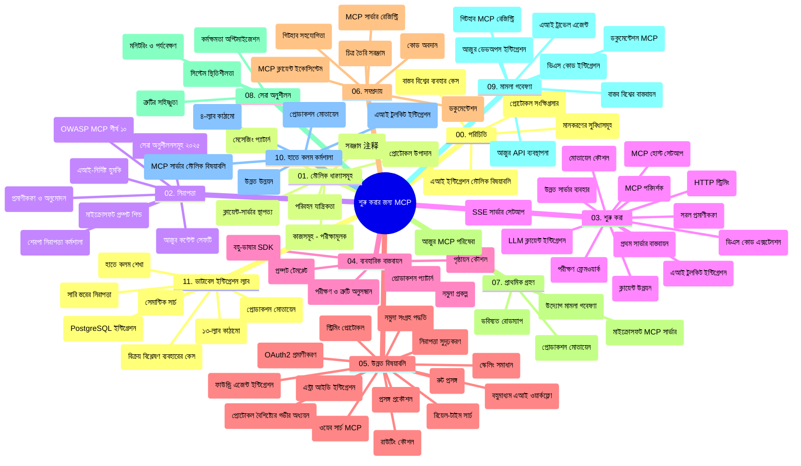

# মডেল কন্টেক্সট প্রোটোকল (MCP) শুরু করার জন্য - স্টাডি গাইড

এই স্টাডি গাইডটি "মডেল কন্টেক্সট প্রোটোকল (MCP) শুরু করার জন্য" কারিকুলামের জন্য রিপোজিটরি গঠন এবং সামগ্রীর একটি ওভারভিউ প্রদান করে। রিপোজিটরিটি দক্ষতার সাথে নেভিগেট করতে এবং উপলব্ধ সম্পদগুলি সর্বোচ্চভাবে ব্যবহার করতে এই গাইড ব্যবহার করুন।

## রিপোজিটরি ওভারভিউ

মডেল কন্টেক্সট প্রোটোকল (MCP) হল AI মডেল এবং ক্লায়েন্ট অ্যাপ্লিকেশনের মধ্যে ইন্টারঅ্যাকশনের জন্য একটি মানক ফ্রেমওয়ার্ক। প্রাথমিকভাবে Anthropic দ্বারা তৈরি, MCP এখন অফিসিয়াল GitHub সংগঠনের মাধ্যমে বৃহত্তর MCP কমিউনিটির দ্বারা রক্ষণাবেক্ষণ করা হয়। এই রিপোজিটরিটিতে C#, Java, JavaScript, Python, এবং TypeScript এ হাতে-কলমে কোড উদাহরণের সাথে একটি ব্যাপক কারিকুলাম প্রদান করা হয়েছে, যা AI ডেভেলপার, সিস্টেম আর্কিটেক্ট এবং সফটওয়্যার ইঞ্জিনিয়ারদের জন্য ডিজাইন করা হয়েছে।

## ভিজ্যুয়াল কারিকুলাম ম্যাপ

## রিপোজিটরি গঠন

রিপোজিটরিটি একাদশ প্রধান অংশে সংগঠিত, প্রতিটি MCP এর বিভিন্ন দিকের উপর ফোকাস করে:

1. **পরিচিতি (00-Introduction/)**
   - মডেল কন্টেক্সট প্রোটোকলের ওভারভিউ
   - AI পাইপলাইনে স্ট্যান্ডার্ডাইজেশনের গুরুত্ব
   - ব্যবহারিক ব্যবহার এবং সুবিধা

2. **মূল ধারণা (01-CoreConcepts/)**
   - ক্লায়েন্ট-সার্ভার আর্কিটেকচার
   - মূল প্রোটোকল উপাদানসমূহ
   - MCP তে মেসেজিং প্যাটার্নসমূহ

3. **সিকিউরিটি (02-Security/)**
   - MCP-ভিত্তিক সিস্টেমে নিরাপত্তা হুমকি
   - নিরাপদ বাস্তবায়নের জন্য সেরা প্র্যাকটিস
   - অথেন্টিকেশন এবং অথরাইজেশন কৌশল
   - **বিস্তারিত সিকিউরিটি ডকুমেন্টেশন**:
     - MCP সিকিউরিটি বেস্ট প্র্যাকটিস ২০২৫
     - Azure Content Safety ইমপ্লিমেন্টেশন গাইড
     - MCP সিকিউরিটি কন্ট্রোলস এবং প্রযুক্তি
     - MCP বেস্ট প্র্যাকটিস দ্রুত রেফারেন্স
   - **মূল সিকিউরিটি বিষয়সমূহ**:
     - প্রম্পট ইনজেকশন এবং টুল পয়জনিং আক্রমণ
     - সেশন হাইজ্যাকিং এবং কনফিউজড ডেপুটি সমস্যা
     - টোকেন পাসথ্রু ভঙ্গুরতা
     - অতিরিক্ত অনুমতি এবং অ্যাক্সেস কন্ট্রোল
     - AI উপাদানের জন্য সাপ্লাই চেইন সিকিউরিটি
     - Microsoft Prompt Shields ইন্টিগ্রেশন

4. **শুরু করা (03-GettingStarted/)**
   - পরিবেশ সেটআপ এবং কনফিগারেশন
   - মৌলিক MCP সার্ভার এবং ক্লায়েন্ট তৈরি
   - বিদ্যমান অ্যাপ্লিকেশনের সাথে ইন্টিগ্রেশন
   - অন্তর্ভুক্ত বিভাগসমূহ:
     - প্রথম সার্ভার বাস্তবায়ন
     - ক্লায়েন্ট ডেভেলপমেন্ট
     - LLM ক্লায়েন্ট ইন্টিগ্রেশন
     - VS Code ইন্টিগ্রেশন
     - সার্ভার-সেন্ট ইভেন্টস (SSE) সার্ভার
     - উন্নত সার্ভার ব্যবহার
     - HTTP স্ট্রিমিং
     - AI টুলকিট ইন্টিগ্রেশন
     - টেস্টিং কৌশল
     - ডিপ্লয়মেন্ট নির্দেশিকা

5. **প্রায়োগিক বাস্তবায়ন (04-PracticalImplementation/)**
   - বিভিন্ন প্রোগ্রামিং ভাষায় SDK ব্যবহার
   - ডিবাগিং, টেস্টিং, এবং যাচাইকরণ পদ্ধতি
   - পুনঃব্যবহারযোগ্য প্রম্পট টেমপ্লেট এবং ওয়ার্কফ্লো ডিজাইন
   - বাস্তবায়নের সঙ্গে নমুনা প্রকল্প

6. **উন্নত বিষয়বস্তু (05-AdvancedTopics/)**
   - কন্টেক্সট ইঞ্জিনিয়ারিং কৌশল
   - ফাউন্ড্রি এজেন্ট ইন্টিগ্রেশন
   - মাল্টি-মোডাল AI ওয়ার্কফ্লো
   - OAuth2 অথেন্টিকেশন ডেমো
   - রিয়েল-টাইম সার্চ সক্ষমতা
   - রিয়েল-টাইম স্ট্রিমিং
   - রুট কন্টেক্সট বাস্তবায়ন
   - রাউটিং কৌশল
   - স্যাম্পলিং পদ্ধতি
   - স্কেলিং পদ্ধতি
   - নিরাপত্তা বিবেচনা
   - Entra ID সিকিউরিটি ইন্টিগ্রেশন
   - ওয়েব সার্চ ইন্টিগ্রেশন

7. **কমিউনিটি অবদান (06-CommunityContributions/)**
   - কোড এবং ডকুমেন্টেশনে অবদান রাখা
   - GitHub মাধ্যমে সহযোগিতা
   - কমিউনিটি চালিত উন্নতি ও প্রতিক্রিয়া
   - বিভিন্ন MCP ক্লায়েন্ট ব্যবহার (Claude Desktop, Cline, VSCode)
   - জনপ্রিয় MCP সার্ভারগুলোর সঙ্গে কাজ, যার মধ্যে ইমেজ জেনারেশন অন্তর্ভুক্ত

8. **প্রাথমিক গ্রহণের পাঠ (07-LessonsfromEarlyAdoption/)**
   - বাস্তবায়ন এবং সাফল্যের গল্প
   - MCP ভিত্তিক সমাধান তৈরি ও মোতায়েন
   - প্রবণতা এবং ভবিষ্যতের রোডম্যাপ
   - **Microsoft MCP সার্ভার গাইড**: প্রোডাকশন-রেডি ১০টি Microsoft MCP সার্ভারের ব্যাপক গাইড, যার মধ্যে:
     - Microsoft Learn Docs MCP Server
     - Azure MCP Server (১৫+ বিশেষায়িত কানেক্টর)
     - GitHub MCP Server
     - Azure DevOps MCP Server
     - MarkItDown MCP Server
     - SQL Server MCP Server
     - Playwright MCP Server
     - Dev Box MCP Server
     - Azure AI Foundry MCP Server
     - Microsoft 365 Agents Toolkit MCP Server

9. **সেরা অনুশীলন (08-BestPractices/)**
   - পারফরম্যান্স টিউনিং এবং অপ্টিমাইজেশন
   - ত্রুটি-সহিষ্ণু MCP সিস্টেম ডিজাইন
   - টেস্টিং এবং রেজিলিয়েন্স কৌশল

10. **কেস স্টাডিজ (09-CaseStudy/)**
    - MCP এর বহুমুখিতা প্রদর্শনকারী সাতটি বিস্তৃত কেস স্টাডি:
    - **Azure AI ট্রাভেল এজেন্টস**: Azure OpenAI এবং AI সার্চ সহ মাল্টি-এজেন্ট অর্কেস্ট্রেশন
    - **Azure DevOps ইন্টিগ্রেশন**: YouTube ডেটা আপডেট সহ ওয়ার্কফ্লো প্রক্রিয়া স্বয়ংক্রিয়করণ
    - **রিয়েল-টাইম ডকুমেন্টেশন রিট্রিভাল**: Python কনসোল ক্লায়েন্ট এবং স্ট্রিমিং HTTP
    - **ইন্টারেক্টিভ স্টাডি প্ল্যান জেনারেটর**: Chainlit ওয়েব অ্যাপ এবং কথোপকথন AI
    - **ইন-এডিটর ডকুমেন্টেশন**: VS Code ইন্টিগ্রেশন এবং GitHub Copilot ওয়ার্কফ্লো
    - **Azure API ম্যানেজমেন্ট**: এন্টারপ্রাইজ API ইন্টিগ্রেশন এবং MCP সার্ভার তৈরি
    - **GitHub MCP রেজিস্ট্রি**: ইকোসিস্টেম ডেভেলপমেন্ট এবং এজেন্টিক ইন্টিগ্রেশন প্ল্যাটফর্ম
    - এন্টারপ্রাইজ ইন্টিগ্রেশন, ডেভেলপার প্রোডাক্টিভিটি, এবং ইকোসিস্টেম ডেভেলপমেন্ট এর উদাহরণ সহ বাস্তবায়ন

11. **হাতেকলমে কর্মশালা (10-StreamliningAIWorkflowsBuildingAnMCPServerWithAIToolkit/)**
    - MCP এবং AI টুলকিট সংযুক্তির সমন্বয়ে ব্যাপক হাতেকলমে কর্মশালা
    - AI মডেল ও বাস্তব-প্রয়োগের টুলের মধ্যে বুদ্ধিমান অ্যাপ্লিকেশন তৈরি
    - মৌলিক, কাস্টম সার্ভার ডেভেলপমেন্ট এবং প্রোডাকশন ডিপ্লয়মেন্ট কৌশল সহ ব্যবহারিক মডিউল
    - **ল্যাব কাঠামো**:
      - ল্যাব ১: MCP সার্ভার মৌলিকতাক্রম
      - ল্যাব ২: উন্নত MCP সার্ভার ডেভেলপমেন্ট
      - ল্যাব ৩: AI টুলকিট ইন্টিগ্রেশন
      - ল্যাব ৪: প্রোডাকশন ডিপ্লয়মেন্ট এবং স্কেলিং
    - ধাপে ধাপে নির্দেশনাসহ ল্যাবভিত্তিক শেখার পদ্ধতি

12. **MCP সার্ভার ডাটাবেস ইন্টিগ্রেশন ল্যাব (11-MCPServerHandsOnLabs/)**
    - প্রোডাকশন-রেডি MCP সার্ভার PostgreSQL ইন্টিগ্রেশন সহ তৈরি করার জন্য ১৩-ল্যাবের ব্যাপক শেখার পথ
    - বাস্তব-বাস্তবায়িত খুচরা বিশ্লেষণ জাভা রিটেইল ইউজ কেসের মাধ্যমে
    - এন্টারপ্রাইজ গ্রেড প্যাটার্নস যেমন রো লেভেল সিকিউরিটি (RLS), সেমান্টিক সার্চ, এবং মাল্টি-টেন্যান্ট ডেটা অ্যাক্সেস
    - **সম্পূর্ণ ল্যাব কাঠামো**:
      - **ল্যাব ০০-০৩: ভিত্তি** - পরিচিতি, আর্কিটেকচার, সিকিউরিটি, পরিবেশ সেটআপ
      - **ল্যাব ০৪-০৬: MCP সার্ভার তৈরি** - ডাটাবেস ডিজাইন, MCP সার্ভার বাস্তবায়ন, টুল ডেভেলপমেন্ট
      - **ল্যাব ০৭-০৯: উন্নত ফিচার** - সেমান্টিক সার্চ, টেস্টিং ও ডিবাগিং, VS Code ইন্টিগ্রেশন
      - **ল্যাব ১০-১২: প্রোডাকশন ও সেরা প্র্যাকটিস** - ডিপ্লয়মেন্ট, মনিটরিং, অপ্টিমাইজেশন
    - **কভার করা প্রযুক্তি**: FastMCP ফ্রেমওয়ার্ক, PostgreSQL, Azure OpenAI, Azure Container Apps, Application Insights
    - **শেখার ফলাফল**: প্রোডাকশন-রেডি MCP সার্ভার, ডাটাবেস ইন্টিগ্রেশন প্যাটার্ন, AI-চালিত বিশ্লেষণ, এন্টারপ্রাইজ সিকিউরিটি

## অতিরিক্ত সম্পদ

রিপোজিটরিতে সহায়ক সম্পদ অন্তর্ভুক্ত:

- **ইমেজ ফোল্ডার**: কারিকুলামের বিভিন্ন চিত্র এবং ব্যাখ্যা ধারণ করে
- **অনুবাদসমূহ**: ডকুমেন্টেশনের স্বয়ংক্রিয় অনুবাদের মাধ্যমে বহু-ভাষী সমর্থন
- **অফিসিয়াল MCP সংস্থানসমূহ**:
  - [MCP ডকুমেন্টেশন](https://modelcontextprotocol.io/)
  - [MCP স্পেসিফিকেশন](https://spec.modelcontextprotocol.io/)
  - [MCP GitHub রিপোজিটরি](https://github.com/modelcontextprotocol)

## এই রিপোজিটরিটি কীভাবে ব্যবহার করবেন

1. **ক্রমাগত শেখা**: একশন অনুযায়ী অধ্যায়গুলি (০০ থেকে ১১) অনুসরণ করুন একটি সংগঠিত শেখার অভিজ্ঞতার জন্য।
2. **ভাষা-নির্দিষ্ট ফোকাস**: আপনি যদি কোনো নির্দিষ্ট প্রোগ্রামিং ভাষায় আগ্রহী হন, আপনার পছন্দসই ভাষার জন্য স্যাম্পল ডিরেক্টরিসমূহ অন্বেষণ করুন।
3. **বাস্তবায়ন শুরু করুন**: পরিবেশ সেটআপ করতে এবং আপনার প্রথম MCP সার্ভার ও ক্লায়েন্ট তৈরি করতে "শুরু করা" সেকশন থেকে শুরু করুন।
4. **উন্নত অনুসন্ধান**: মৌলিক সম্পর্কে স্বাচ্ছন্দ্যবোধ করলে উন্নত বিষয়গুলিতে প্রবেশ করুন আপনার জ্ঞান বৃদ্ধি করতে।
5. **কমিউনিটি নিয়োগ**: MCP কমিউনিটির সাথে যুক্ত হন GitHub আলোচনা এবং Discord চ্যানেলগুলির মাধ্যমে বিশেষজ্ঞ ও সহ-ডেভেলপারদের সঙ্গে সংযুক্ত থাকতে।

## MCP ক্লায়েন্ট এবং টুলস

কারিকুলাম বিভিন্ন MCP ক্লায়েন্ট এবং টুল কাভার করে:

1. **অফিসিয়াল ক্লায়েন্টস**:
   - Visual Studio Code
   - MCP ইন Visual Studio Code
   - Claude Desktop
   - Claude ইন VSCode
   - Claude API

2. **কমিউনিটি ক্লায়েন্টস**:
   - Cline (টার্মিনাল-ভিত্তিক)
   - Cursor (কোড এডিটর)
   - ChatMCP
   - Windsurf

3. **MCP ম্যানেজমেন্ট টুলস**:
   - MCP CLI
   - MCP Manager
   - MCP Linker
   - MCP Router

## জনপ্রিয় MCP সার্ভারসমূহ

রিপোজিটরিটি বিভিন্ন MCP সার্ভার পরিচয় করিয়ে দেয়, যার মধ্যে:

1. **অফিসিয়াল Microsoft MCP সার্ভারসমূহ**:
   - Microsoft Learn Docs MCP Server
   - Azure MCP Server (১৫+ বিশেষায়িত কানেক্টর)
   - GitHub MCP Server
   - Azure DevOps MCP Server
   - MarkItDown MCP Server
   - SQL Server MCP Server
   - Playwright MCP Server
   - Dev Box MCP Server
   - Azure AI Foundry MCP Server
   - Microsoft 365 Agents Toolkit MCP Server

2. **অফিসিয়াল রেফারেন্স সার্ভারসমূহ**:
   - ফাইলসিস্টেম
   - Fetch
   - মেমোরি
   - সিকুয়েন্সিয়াল থিংকিং

3. **ইমেজ জেনারেশন**:
   - Azure OpenAI DALL-E 3
   - Stable Diffusion WebUI
   - Replicate

4. **ডেভেলপমেন্ট টুলস**:
   - Git MCP
   - টার্মিনাল কন্ট্রোল
   - কোড অ্যাসিস্ট্যান্ট

5. **বিশেষায়িত সার্ভারসমূহ**:
   - Salesforce
   - Microsoft Teams
   - Jira & Confluence

## অবদান রাখা

এই রিপোজিটরিতে কমিউনিটির অবদানকে স্বাগত জানানো হয়। MCP ইকোসিস্টেমে কার্যকরভাবে অবদান রাখার নির্দেশিকার জন্য কমিউনিটি অবদান বিভাগ দেখুন।

----

*এই স্টাডি গাইড সর্বশেষ আপডেট করা হয়েছে ফেব্রুয়ারি ৫, ২০২৬ তারিখে, যা MCP স্পেসিফিকেশন ২০২৫-১১-২৫ এর সর্বশেষ সংস্করণ প্রতিফলিত করে এবং ঐ তারিখের হিসাব অনুযায়ী রিপোজিটরির ওভারভিউ প্রদান করে। এই তারিখের পর রিপোজিটরির সামগ্রী আপডেট হতে পারে।*

---

<!-- CO-OP TRANSLATOR DISCLAIMER START -->
**দায়বদ্ধতা**:  
এই ডকুমেন্টটি AI অনুবাদ সেবা [Co-op Translator](https://github.com/Azure/co-op-translator) ব্যবহার করে অনূদিত হয়েছে। আমরা যথাসাধ্য সঠিকতার চেষ্টা করি, তবু স্বয়ংক্রিয় অনুবাদে ভুল বা অসঙ্গতি থাকতে পারে তা দয়া করে বুঝুন। মূল ডকুমেন্ট তার নিজস্ব ভাষায়ই কর্তৃপক্ষের উৎস হিসেবে বিবেচনা করা উচিত। গুরুত্বপূর্ণ তথ্যের জন্য পেশাদার মানব অনুবাদের পরামর্শ দেওয়া হয়। এই অনুবাদের ব্যবহারে সৃষ্ট কোনো ভুল বোঝাবুঝি বা ভুল অর্থবোধের জন্য আমরা দায়ী নই।
<!-- CO-OP TRANSLATOR DISCLAIMER END -->