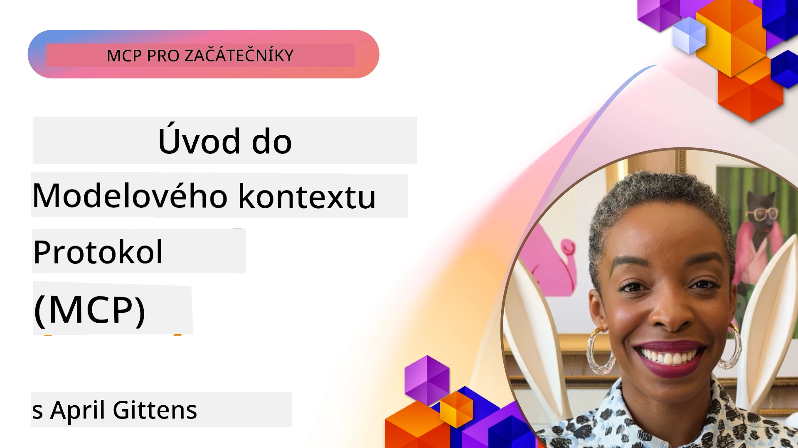
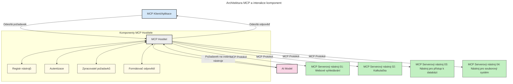

# Úvod do Model Context Protocol (MCP): Proč je důležitý pro škálovatelné AI aplikace

[](https://youtu.be/agBbdiOPLQA)

_(Klikněte na obrázek výše pro zhlédnutí videa této lekce)_

Generativní AI aplikace představují významný krok vpřed, protože často uživateli umožňují interakci s aplikací pomocí přirozených jazykových příkazů. Nicméně, jakmile do takových aplikací investujete více času a zdrojů, chcete si být jisti, že můžete snadno integrovat funkce a zdroje tak, aby bylo jednoduché aplikaci rozšiřovat, aby dokázala obsluhovat více modelů a zvládala různé modelové složitosti. Stručně řečeno, stavět Gen AI aplikace je zpočátku snadné, ale jak rostou a stávají se složitějšími, je potřeba začít definovat architekturu a pravděpodobně se spolehnout na standard, který zajistí, že vaše aplikace budou postaveny konzistentně. Právě zde přichází MCP, který věci organizuje a poskytuje standard.

---

## **🔍 Co je Model Context Protocol (MCP)?**

**Model Context Protocol (MCP)** je **otevřené, standardizované rozhraní**, které umožňuje Large Language Models (LLMs) bezproblémovou interakci s externími nástroji, API a zdroji dat. Poskytuje konzistentní architekturu pro rozšíření funkcionality AI modelů nad rámec jejich trénovacích dat, což umožňuje chytřejší, škálovatelnější a citlivější AI systémy.

---

## **🎯 Proč je standardizace v AI důležitá**

Jak generativní AI aplikace nabývají na složitosti, je zásadní přijmout standardy, které zajišťují **škálovatelnost, rozšiřitelnost, udržovatelnost** a **vyhýbání se závislosti na konkrétním prodejci**. MCP tyto potřeby řeší takto:

- sjednocení integrací modelů s nástroji
- snížení křehkých, jednorázových vlastních řešení
- umožnění koexistence více modelů od různých dodavatelů v rámci jednoho ekosystému

**Poznámka:** Ačkoliv se MCP prezentuje jako otevřený standard, neplánuje se jeho standardizace prostřednictvím existujících standardizačních organizací, jako jsou IEEE, IETF, W3C, ISO nebo jakákoli jiná standardizační organizace.

---

## **📚 Výukové cíle**

Na konci tohoto článku budete schopni:

- Definovat **Model Context Protocol (MCP)** a jeho použití
- Pochopit, jak MCP standardizuje komunikaci modelů s nástroji
- Identifikovat klíčové komponenty architektury MCP
- Prozkoumat reálné aplikace MCP v podnikových a vývojových kontextech

---

## **💡 Proč je Model Context Protocol (MCP) průlomový**

### **🔗 MCP řeší fragmentaci v AI interakcích**

Před MCP vyžadovala integrace modelů s nástroji:

- vlastní kód pro každé párování model-nástroj
- nestandardní API pro každého dodavatele
- časté přerušení kvůli aktualizacím
- špatnou škálovatelnost při přidávání dalších nástrojů

### **✅ Výhody standardizace MCP**

| **Výhoda**               | **Popis**                                                                   |
|--------------------------|-----------------------------------------------------------------------------|
| Interoperabilita         | LLMs fungují bez problémů s nástroji od různých dodavatelů                  |
| Konzistence              | Jednotné chování napříč platformami a nástroji                              |
| Znovupoužitelnost        | Nástroje vytvořené jednou lze použít napříč projekty a systémy              |
| Zrychlení vývoje         | Snížení času vývoje díky standardizovaným, plug-and-play rozhraním         |

---

## **🧱 Přehled architektury MCP na vysoké úrovni**

MCP používá **model klient-server**, kde:

- **MCP hostitelé** běží AI modely
- **MCP klienti** iniciují požadavky
- **MCP servery** poskytují kontext, nástroje a schopnosti

### **Klíčové komponenty:**

- **Zdroje** – statická či dynamická data pro modely  
- **Příkazy (prompty)** – předdefinované workflowy pro řízenou generaci  
- **Nástroje** – vykonatelné funkce jako vyhledávání, výpočty  
- **Sampling** – agentní chování přes rekurzivní interakce
- **Elicitation** – požadavky iniciované serverem pro zadání uživatelského vstupu
- **Roots** – hranice souborového systému pro kontrolu přístupu serveru

### **Architektura protokolu:**

MCP používá dvouvrstvou architekturu:
- **Datová vrstva**: komunikace založená na JSON-RPC 2.0 s managementem životního cyklu a primitivy
- **Transportní vrstva**: STDIO (lokální) a Streamable HTTP se SSE (vzdálená) komunikační kanály

---

## Jak MCP servery fungují

MCP servery pracují následovně:

- **Tok požadavků**:
    1. Požadavek je inicializován koncovým uživatelem nebo softwarem jednajícím jeho jménem.
    2. **MCP klient** odešle požadavek na **MCP hostitele**, který spravuje runtime AI modelu.
    3. **AI model** přijme uživatelský příkaz a může požádat o přístup k externím nástrojům nebo datům přes jeden či více volání nástrojů.
    4. **MCP hostitel**, nikoli přímo model, komunikuje s příslušnými **MCP servery** pomocí standardizovaného protokolu.
- **Funkce MCP hostitele**:
    - **Registr nástrojů**: Udržuje katalog dostupných nástrojů a jejich schopností.
    - **Autentizace**: Ověřuje oprávnění pro přístup k nástrojům.
    - **Zpracovatel požadavků**: Zpracovává příchozí žádosti o nástroje od modelu.
    - **Formátovač odpovědí**: Strukturuje výstupy nástrojů do formátu, kterému model rozumí.
- **Provoz MCP serveru**:
    - **MCP hostitel** směruje volání nástrojů jednomu či více **MCP serverům**, z nichž každý vystavuje specializované funkce (např. vyhledávání, výpočty, dotazy do databáze).
    - **MCP servery** provádějí své operace a vracejí výsledky **MCP hostiteli** ve sjednoceném formátu.
    - **MCP hostitel** formátuje a přeposílá výsledky do **AI modelu**.
- **Dokončení odpovědi**:
    - **AI model** začleňuje výstupy nástrojů do konečné odpovědi.
    - **MCP hostitel** tuto odpověď odešle zpět **MCP klientovi**, který ji doručí koncovému uživateli či volajícímu softwaru.
    


## 👨‍💻 Jak vytvořit MCP server (s příklady)

MCP servery vám umožňují rozšířit schopnosti LLM tím, že poskytují data a funkce.

Chcete to vyzkoušet? Zde jsou SDK specifická pro jazyky a/nebo stacky s příklady vytváření jednoduchých MCP serverů v různých jazycích/stackech:

- **Python SDK**: https://github.com/modelcontextprotocol/python-sdk

- **TypeScript SDK**: https://github.com/modelcontextprotocol/typescript-sdk

- **Java SDK**: https://github.com/modelcontextprotocol/java-sdk

- **C#/.NET SDK**: https://github.com/modelcontextprotocol/csharp-sdk


## 🌍 Reálné případy použití MCP

MCP umožňuje širokou škálu aplikací rozšiřujících AI schopnosti:

| **Aplikace**                | **Popis**                                                                      |
|----------------------------|--------------------------------------------------------------------------------|
| Integrace podnikových dat  | Propojení LLMs s databázemi, CRM nebo interními nástroji                       |
| Agentní AI systémy         | Umožnění autonomních agentů s přístupem k nástrojům a pracovními postupy rozhodování |
| Multimodální aplikace      | Kombinace nástrojů pro text, obraz a zvuk v jedné sjednocené AI aplikaci      |
| Integrace dat v reálném čase | Přinášení živých dat do AI interakcí pro přesnější a aktuálnější výstupy     |


### 🧠 MCP = Univerzální standard pro AI interakce

Model Context Protocol (MCP) funguje jako univerzální standard pro AI interakce, podobně jako USB-C standardizoval fyzické připojení zařízení. Ve světě AI MCP poskytuje konzistentní rozhraní, které umožňuje modelům (klientům) hladce integrovat se s externími nástroji a poskytovateli dat (servery). To eliminuje potřebu rozmanitých, vlastních protokolů pro každé API nebo zdroj dat.

Pod MCP je MCP-kompatibilní nástroj (označovaný jako MCP server) založen na sjednoceném standardu. Tito servery mohou uvádět nástroje nebo akce, které nabízejí, a vykonávat tyto akce na požádání AI agentem. Platformy agentů s podporou MCP jsou schopny objevovat dostupné nástroje ze serverů a vyvolávat je prostřednictvím tohoto standardního protokolu.

### 💡 Usnadňuje přístup k znalostem

Kromě nabídky nástrojů MCP také usnadňuje přístup k znalostem. Umožňuje aplikacím poskytovat kontext velkým jazykovým modelům (LLMs) propojením s různými zdroji dat. Například MCP server může představovat úložiště dokumentů firmy, což umožňuje agentům na vyžádání získat relevantní informace. Jiný server může zpracovávat konkrétní akce, jako odesílání e-mailů nebo aktualizaci záznamů. Z pohledu agenta jsou to jednoduše nástroje, které může používat – některé vrací data (kontext znalostí), jiné vykonávají akce. MCP efektivně spravuje obojí.

Agent připojený k MCP serveru se automaticky naučí dostupné schopnosti serveru a přístupná data díky standardnímu formátu. Tato standardizace umožňuje dynamickou dostupnost nástrojů. Například přidání nového MCP serveru do systému agenta jeho funkce ihned zpřístupní bez nutnosti další přizpůsobení instrukcí agenta.

Tato zjednodušená integrace odpovídá toku na následujícím diagramu, kde servery poskytují jak nástroje, tak znalosti, což zajišťuje bezproblémovou spolupráci mezi systémy.

### 👉 Příklad: Škálovatelné řešení pro agenty

```mermaid
---
title: Škálovatelné řešení agenta s MCP
description: Diagram znázorňující, jak uživatel komunikuje s LLM, které se připojuje k několika serverům MCP, přičemž každý server poskytuje jak znalosti, tak nástroje, vytvářející škálovatelnou architekturu AI systému
---
graph TD
    User -->|Výzva| LLM
    LLM -->|Odpověď| User
    LLM -->|MCP| ServerA
    LLM -->|MCP| ServerB
    ServerA -->|Univerzální konektor| ServerB
    ServerA --> KnowledgeA
    ServerA --> ToolsA
    ServerB --> KnowledgeB
    ServerB --> ToolsB

    subgraph Server A
        KnowledgeA[Znalosti]
        ToolsA[Nástroje]
    end

    subgraph Server B
        KnowledgeB[Znalosti]
        ToolsB[Nástroje]
    end
```Univerzální konektor umožňuje MCP serverům komunikovat a sdílet schopnosti navzájem, což umožňuje ServerA delegovat úkoly na ServerB nebo přistupovat k jeho nástrojům a znalostem. To federuje nástroje a data přes servery, podporujíc škálovatelné a modulární agentní architektury. Protože MCP standardizuje vystavování nástrojů, agenti mohou dynamicky objevovat a směrovat požadavky mezi servery bez pevně zakódovaných integrací.

Federace nástrojů a znalostí: Nástoje a data lze přistupovat přes servery, což umožňuje flexibilnější a škálovatelnější agentní architektury.

### 🔄 Pokročilé scénáře MCP s integrací LLM na straně klienta

Kromě základní architektury MCP existují pokročilé scénáře, kdy mají jak klient, tak server LLM, což umožňuje sofistikovanější interakce. Na následujícím diagramu může být **Klientská aplikace** IDE s řadou MCP nástrojů dostupných pro uživatele prostřednictvím LLM:

```mermaid
---
title: Pokročilé scénáře MCP s integrací klient-server LLM
description: Sekvenční diagram zobrazující podrobný tok interakce mezi uživatelem, klientskou aplikací, klientským LLM, několika MCP servery a serverovým LLM, ilustrující fáze objevování nástrojů, interakce s uživatelem, přímého volání nástrojů a vyjednávání funkcí
---
sequenceDiagram
    autonumber
    actor User as 👤 Uživatel
    participant ClientApp as 🖥️ Klientská aplikace
    participant ClientLLM as 🧠 Klientské LLM
    participant Server1 as 🔧 MCP server 1
    participant Server2 as 📚 MCP server 2
    participant ServerLLM as 🤖 Serverové LLM
    
    %% Fáze objevování
    rect rgb(220, 240, 255)
        Note over ClientApp, Server2: FÁZE OBJEVOVÁNÍ NÁSTROJŮ
        ClientApp->>+Server1: Požadavek na dostupné nástroje/zdroje
        Server1-->>-ClientApp: Vrácení seznamu nástrojů (JSON)
        ClientApp->>+Server2: Požadavek na dostupné nástroje/zdroje
        Server2-->>-ClientApp: Vrácení seznamu nástrojů (JSON)
        Note right of ClientApp: Uložení<br/>kombinovaného katalogu nástrojů lokálně
    end
    
    %% Interakce s uživatelem
    rect rgb(255, 240, 220)
        Note over User, ClientLLM: FÁZE INTERAKCE S UŽIVATELEM
        User->>+ClientApp: Zadání pokynu v přirozeném jazyce
        ClientApp->>+ClientLLM: Přeposlání pokynu + katalogu nástrojů
        ClientLLM->>-ClientLLM: Analýza pokynu & výběr nástrojů
    end
    
    %% Scénář A: Přímé volání nástrojů
    alt Přímé volání nástrojů
        rect rgb(220, 255, 220)
            Note over ClientApp, Server1: SCÉNÁŘ A: PŘÍMÉ VOLÁNÍ NÁSTROJŮ
            ClientLLM->>+ClientApp: Požadavek na spuštění nástroje
            ClientApp->>+Server1: Spuštění konkrétního nástroje
            Server1-->>-ClientApp: Vrácení výsledků
            ClientApp->>+ClientLLM: Zpracování výsledků
            ClientLLM-->>-ClientApp: Vygenerování odpovědi
            ClientApp-->>-User: Zobrazení konečné odpovědi
        end
    
    %% Scénář B: Vyjednávání funkcí (styl VS Code)
    else Vyjednávání funkcí (styl VS Code)
        rect rgb(255, 220, 220)
            Note over ClientApp, ServerLLM: SCÉNÁŘ B: VYJEDNÁVÁNÍ FUNKCÍ
            ClientLLM->>+ClientApp: Identifikace potřebných schopností
            ClientApp->>+Server2: Vyjednávání funkcí/schopností
            Server2->>+ServerLLM: Žádost o další kontext
            ServerLLM-->>-Server2: Poskytnutí kontextu
            Server2-->>-ClientApp: Vrácení dostupných funkcí
            ClientApp->>+Server2: Volání vyjednaných nástrojů
            Server2-->>-ClientApp: Vrácení výsledků
            ClientApp->>+ClientLLM: Zpracování výsledků
            ClientLLM-->>-ClientApp: Vygenerování odpovědi
            ClientApp-->>-User: Zobrazení konečné odpovědi
        end
    end
```
## 🔐 Praktické výhody MCP

Praktické výhody používání MCP jsou:

- **Aktuálnost**: Modely mohou přistupovat k nejnovějším informacím mimo svá tréninková data
- **Rozšíření schopností**: Modely mohou využívat specializované nástroje pro úkoly, na které nebyly trénovány
- **Snížení halucinací**: Externí zdroje dat poskytují faktickou oporu
- **Soukromí**: Citlivá data mohou zůstat v bezpečném prostředí místo vkládání do promptů

## 📌 Klíčové shrnutí

Klíčová shrnutí pro používání MCP:

- **MCP** standardizuje způsob, jakým AI modely komunikují s nástroji a daty
- Podporuje **rozšiřitelnost, konzistenci a interoperabilitu**
- MCP pomáhá **zkrátit vývojový čas, zlepšit spolehlivost a rozšířit schopnosti modelů**
- Architektura klient-server umožňuje **flexibilní, rozšiřitelné AI aplikace**

## 🧠 Cvičení

Zamyslete se nad AI aplikací, kterou máte zájem vytvořit.

- Které **externí nástroje nebo data** by mohly vylepšit její schopnosti?
- Jak by MCP mohlo integraci **zjednodušit a učinit spolehlivější**?

## Další zdroje

- [MCP GitHub Repository](https://github.com/modelcontextprotocol)


## Co bude dál

Další: [Kapitola 1: Základní koncepty](../01-CoreConcepts/README.md)

---

<!-- CO-OP TRANSLATOR DISCLAIMER START -->
**Prohlášení o vyloučení odpovědnosti**:  
Tento dokument byl přeložen pomocí AI překladatelské služby [Co-op Translator](https://github.com/Azure/co-op-translator). I když se snažíme o přesnost, berte prosím na vědomí, že automatizované překlady mohou obsahovat chyby nebo nepřesnosti. Původní dokument v jeho mateřském jazyce by měl být považován za autoritativní zdroj. Pro kritické informace se doporučuje profesionální lidský překlad. Nejsme odpovědní za jakékoli nedorozumění nebo chybné interpretace vyplývající z používání tohoto překladu.
<!-- CO-OP TRANSLATOR DISCLAIMER END -->