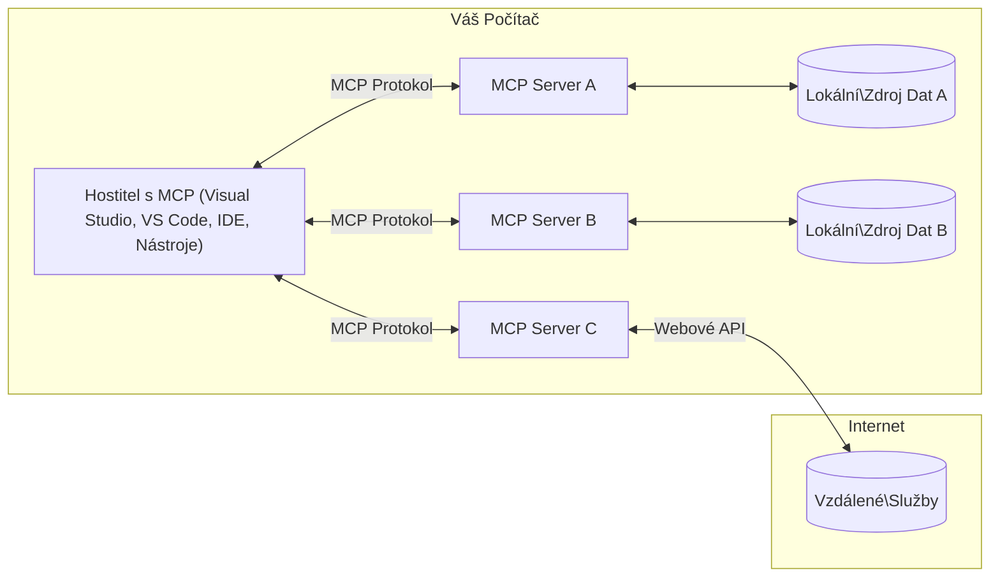

# MCP Základní Koncepty: Ovládnutí Protokolu Kontextu Modelu pro Integraci AI

[](https://youtu.be/earDzWGtE84)

_(Klikněte na obrázek výše pro zobrazení videa této lekce)_

[Model Context Protocol (MCP)](https://github.com/modelcontextprotocol) je výkonný, standardizovaný rámec, který optimalizuje komunikaci mezi Velkými Jazykovými Modely (LLM) a externími nástroji, aplikacemi a zdroji dat.  
Tento průvodce vás provede základními koncepty MCP. Naučíte se o jeho klient-server architektuře, nezbytných komponentách, mechanismech komunikace a osvědčených způsobech implementace.

- **Explicitní souhlas uživatele**: Všechny přístupy k datům a operace vyžadují před provedením výslovný souhlas uživatele. Uživatelé musí jasně rozumět, jaká data budou přístupná a jaké akce budou provedeny, s podrobnou kontrolou oprávnění a autorizací.

- **Ochrana soukromí dat**: Uživatelská data jsou vystavena pouze s explicitním souhlasem a musí být chráněna robustními přístupovými kontrolami po celou dobu životního cyklu interakce. Implementace musí zabránit neoprávněnému přenosu dat a udržovat přísné hranice soukromí.

- **Bezpečnost spouštění nástrojů**: Každé vyvolání nástroje vyžaduje explicitní souhlas uživatele s jasným pochopením funkčnosti nástroje, parametrů a potenciálního dopadu. Robustní bezpečnostní hranice musí zabránit nechtěnému, nebezpečnému nebo škodlivému spuštění nástroje.

- **Bezpečnost transportní vrstvy**: Všechny komunikační kanály by měly používat vhodné šifrování a ověřovací mechanismy. Vzdálené připojení by mělo implementovat bezpečné transportní protokoly a správu přihlašovacích údajů.

#### Pokyny k implementaci:

- **Správa oprávnění**: Implementujte detailní systémy oprávnění, které uživatelům umožňují kontrolovat, které servery, nástroje a zdroje jsou přístupné  
- **Autentizace a autorizace**: Používejte zabezpečené metody autentizace (OAuth, API klíče) s správnou správou tokenů a expirací  
- **Validace vstupů**: Validujte všechny parametry a vstupy dat podle definovaných schémat, abyste předešli útokům typu injekce  
- **Auditní protokolování**: Vedení komplexních záznamů všech operací pro bezpečnostní monitorování a dodržování předpisů  

## Přehled

Tato lekce prozkoumá základní architekturu a komponenty, které tvoří ekosystém Model Context Protocol (MCP). Naučíte se o klient-server architektuře, klíčových součástech a komunikačních mechanismech, které pohánějí interakce MCP.

## Klíčové cíle učení

Na konci této lekce budete:

- Rozumět architektuře MCP klient-server.
- Identifikovat role a odpovědnosti Hostitelů, Klientů a Serverů.
- Analyzovat hlavní vlastnosti, díky kterým je MCP flexibilní integrační vrstvou.
- Naučit se, jak probíhá tok informací v ekosystému MCP.
- Získat praktické poznatky prostřednictvím ukázek kódu v .NET, Javě, Pythonu a JavaScriptu.

## Architektura MCP: Podrobnější pohled

Ekosystém MCP je postaven na modelu klient-server. Tato modulární struktura umožňuje AI aplikacím efektivně komunikovat s nástroji, databázemi, API a kontextuálními zdroji. Pojďme si tuto architekturu rozebrat na její základní součásti.

V jádru MCP následuje klient-server architekturu, kde hostitelská aplikace může připojit k více serverům:


- **MCP Hostitelé**: Programy jako VSCode, Claude Desktop, IDE nebo AI nástroje, které chtějí přistupovat k datům přes MCP  
- **MCP Klienti**: Protokoloví klienti, kteří udržují 1:1 spojení se servery  
- **MCP Servery**: Lehká programová řešení, která vystavují specifické schopnosti prostřednictvím standardizovaného Model Context Protocol  
- **Lokální zdroje dat**: Soubory, databáze a služby vašeho počítače, ke kterým mohou MCP servery bezpečně přistupovat  
- **Vzdálené služby**: Externí systémy dostupné přes internet, ke kterým se MCP servery mohou připojit prostřednictvím API  

MCP Protokol je vyvíjející se standard používající verzování na základě data (formát RRRR-MM-DD). Aktuální verze protokolu je **2025-11-25**. Nejnovější aktualizace můžete vidět v [specifikaci protokolu](https://modelcontextprotocol.io/specification/2025-11-25/).

### 1. Hostitelé

V rámci Model Context Protocol (MCP) jsou **Hostitelé** AI aplikace, které slouží jako primární rozhraní, přes které uživatelé interagují s protokolem. Hostitelé koordinují a spravují připojení k více MCP serverům vytvářením dedikovaných MCP klientů pro každé připojení ke serveru. Příklady hostitelů zahrnují:

- **AI aplikace**: Claude Desktop, Visual Studio Code, Claude Code  
- **Vývojová prostředí**: IDE a editory kódu s integrací MCP  
- **Vlastní aplikace**: Záměrně vytvoření AI agenti a nástroje  

**Hostitelé** jsou aplikace, které koordinují interakce s AI modely. Oni:

- **Orchestrace AI modelů**: Spuštění nebo interakce s LLM za účelem generování odpovědí a koordinace AI workflow  
- **Správa klientských připojení**: Vytváří a udržují jednoho MCP klienta na každé připojení k MCP serveru  
- **Řízení uživatelského rozhraní**: Řídí tok konverzace, uživatelské interakce a prezentaci odpovědí  
- **Prosazování bezpečnosti**: Kontrolují oprávnění, bezpečnostní omezení a autentizaci  
- **Řízení souhlasu uživatele**: Spravují uživatelské schválení pro sdílení dat a spuštění nástrojů  

### 2. Klienti

**Klienti** jsou klíčové komponenty, které udržují dedikovaná jedno-na-jedno spojení mezi hostiteli a MCP servery. Každý MCP klient je vytvořen hostitelem pro připojení ke konkrétnímu MCP serveru, což zajišťuje organizované a bezpečné komunikační kanály. Více klientů umožňuje hostitelům připojit se současně k více serverům.

**Klienti** jsou konektorové komponenty v rámci hostitelské aplikace. Oni:

- **Protokolová komunikace**: Posílají požadavky JSON-RPC 2.0 na servery s dotazy a instrukcemi  
- **Jednání o schopnostech**: Jednají o podporovaných funkcích a verzích protokolu se servery během inicializace  
- **Spouštění nástrojů**: Spravují požadavky na spuštění nástrojů z modelů a zpracovávají odpovědi  
- **Aktualizace v reálném čase**: Zpracovávají upozornění a aktualizace od serverů  
- **Zpracování odpovědí**: Zpracovávají a formátují odpovědi serveru pro zobrazení uživatelům  

### 3. Servery

**Servery** jsou programy, které poskytují kontext, nástroje a schopnosti MCP klientům. Mohou běžet lokálně (na stejném stroji jako Hostitel) nebo vzdáleně (na externích platformách) a jsou odpovědné za zpracování požadavků klientů a poskytování strukturovaných odpovědí. Servery vystavují specifickou funkcionalitu prostřednictvím standardizovaného Model Context Protocol.

**Servery** jsou služby, které poskytují kontext a schopnosti. Oni:

- **Registrace funkcí**: Registrují a vystavují dostupné primitivy (zdroje, promptové šablony, nástroje) klientům  
- **Zpracování požadavků**: Přijímají a vykonávají volání nástrojů, požadavky na zdroje a promptové požadavky od klientů  
- **Poskytování kontextu**: Poskytují kontextuální informace a data pro vylepšení odpovědí modelů  
- **Správa stavu**: Udržují stav relace a zpracovávají stavové interakce dle potřeby  
- **Notifikace v reálném čase**: Posílají oznámení o změnách schopností a aktualizacích připojeným klientům  

Servery může vyvíjet kdokoliv za účelem rozšíření schopností modelu specializovanou funkcionalitou a podporují lokální i vzdálené nasazení.

### 4. Serverové primitivy

Servery v Model Context Protocol (MCP) poskytují tři základní **primitivy**, které definují základní stavební kameny pro bohaté interakce mezi klienty, hostiteli a jazykovými modely. Tyto primitivy specifikují typy kontextuálních informací a dostupných akcí v protokolu.

MCP servery mohou vystavovat jakoukoli kombinaci těchto tří základních primitiv:

#### Zdroje

**Zdroje** jsou datové zdroje, které poskytují kontextuální informace AI aplikacím. Reprezentují statický nebo dynamický obsah, který může rozšířit porozumění modelu a rozhodování:

- **Kontextuální data**: Strukturované informace a kontext pro konzumaci AI modelem  
- **Ználostní báze**: Dokumentové archivy, články, manuály a vědecké práce  
- **Lokální zdroje dat**: Soubory, databáze a informace o lokálním systému  
- **Externí data**: Odpovědi API, webové služby a data vzdálených systémů  
- **Dynamický obsah**: Data v reálném čase, která se aktualizují na základě externích podmínek  

Zdroje jsou identifikovány URI a podporují objevování přes metodu `resources/list` a načítání přes `resources/read`:

```text
file://documents/project-spec.md
database://production/users/schema
api://weather/current
```

#### Promptové šablony

**Promptové šablony** jsou znovupoužitelné šablony, které pomáhají strukturovat interakce s jazykovými modely. Poskytují standardizované vzory interakcí a šablonové workflow:

- **Interakce založené na šablonách**: Předstrukturálně zpracované zprávy a začátky konverzace  
- **Workflow šablony**: Standardizované sekvence pro běžné úkoly a interakce  
- **Few-shot příklady**: Šablony založené na příkladech pro instrukce modelu  
- **Systémové prompty**: Základní prompty definující chování modelu a kontext  
- **Dynamické šablony**: Parametrizované prompty přizpůsobující se specifickým kontextům  

Promptové šablony podporují nahrazování proměnných a lze je objevit přes `prompts/list` a načíst přes `prompts/get`:

```markdown
Generate a {{task_type}} for {{product}} targeting {{audience}} with the following requirements: {{requirements}}
```

#### Nástroje

**Nástroje** jsou spustitelné funkce, které mohou AI modely vyvolat k provedení specifických akcí. Reprezentují "slovesa" ekosystému MCP, které umožňují modelům interagovat s externími systémy:

- **Spustitelné funkce**: Jednotlivé operace, které mohou modely vyvolat s konkrétními parametry  
- **Integrace externích systémů**: Volání API, dotazy do databází, operace se soubory, výpočty  
- **Jedinečná identita**: Každý nástroj má jedinečný název, popis a schéma parametrů  
- **Strukturované I/O**: Nástroje přijímají validované parametry a vrací strukturované, typované odpovědi  
- **Akční schopnosti**: Umožňují modelům provádět reálné akce a získávat živá data  

Nástroje jsou definovány pomocí JSON Schema pro validaci parametrů, objeveny přes `tools/list` a vyvolány přes `tools/call`. Nástroje mohou také obsahovat **ikony** jako doplňkové metadata pro lepší prezentaci v UI.

**Anotace nástrojů**: Nástroje podporují behaviorální anotace (např. `readOnlyHint`, `destructiveHint`), které popisují, zda je nástroj pouze pro čtení nebo destruktivní, což pomáhá klientům lépe rozhodnout o spuštění nástroje.

Příklad definice nástroje:

```typescript
server.tool(
  "search_products", 
  {
    query: z.string().describe("Search query for products"),
    category: z.string().optional().describe("Product category filter"),
    max_results: z.number().default(10).describe("Maximum results to return")
  }, 
  async (params) => {
    // Proveďte vyhledávání a vraťte strukturované výsledky
    return await productService.search(params);
  }
);
```

## Klientské primitivy

V Model Context Protocol (MCP) mohou **klienti** vystavovat primitivy, které umožňují serverům požadovat další schopnosti od hostitelské aplikace. Tyto klientské primitivy umožňují bohatší, interaktivnější implementace serverů, které mohou přistupovat k schopnostem AI modelů a uživatelským interakcím.

### Sampling (Vzorkování)

**Sampling** umožňuje serverům požadovat dokončení výstupu jazykového modelu od klientovy AI aplikace. Tento primitiv umožňuje serverům přistupovat k schopnostem LLM bez nutnosti vkládání vlastních závislostí na model:

- **Nezávislý přístup na model**: Servery mohou požadovat dokončení bez zahrnutí LLM SDK nebo správy přístupu k modelu  
- **AI iniciovaná serverem**: Umožňuje serverům autonomně generovat obsah pomocí AI modelu hostitele  
- **Rekurzivní interakce LLM**: Podporuje složité scénáře, kde servery potřebují AI asistenci pro zpracování  
- **Dynamické generování obsahu**: Umožňuje serverům vytvářet kontextuální odpovědi s modelem hostitele  
- **Podpora volání nástrojů**: Servery mohou zahrnovat parametry `tools` a `toolChoice`, aby umožnily modelu hostitele vyvolávat nástroje během vzorkování  

Sampling se iniciuje metodou `sampling/complete`, kde servery posílají požadavky na dokončení klientům.

### Kořeny (Roots)

**Roots** poskytují standardizovaný způsob, jak klienti vystavují hranice souborového systému serverům, což pomáhá serverům chápat, ke kterým adresářům a souborům mají přístup:

- **Hranice souborového systému**: Definují oblasti, ve kterých mohou servery operovat na souborovém systému  
- **Kontrola přístupu**: Pomáhají serverům chápat, ke kterým adresářům a souborům mají oprávnění  
- **Dynamické aktualizace**: Klienti mohou informovat servery, když se seznam kořenů změní  
- **Identifikace na základě URI**: Kořeny používají URI `file://` k identifikaci přístupných adresářů a souborů  

Kořeny se objevují přes metodu `roots/list`, přičemž klienti posílají `notifications/roots/list_changed`, když kořeny změní.

### Elicitation (Vyžadování)

**Elicitation** umožňuje serverům požadovat od uživatelů dodatečné informace nebo potvrzení přes klientské rozhraní:

- **Požadavky na vstup uživatele**: Servery mohou žádat o další informace, když jsou potřeba k provedení nástroje  
- **Potvrzovací dialogy**: Požadují uživatelské schválení pro citlivé nebo kritické operace  
- **Interaktivní workflow**: Umožňují serverům vytvářet krok za krokem uživatelské interakce  
- **Dynamický sběr parametrů**: Shromažďují chybějící nebo volitelné parametry během provádění nástroje  

Požadavky na elicitation se provádějí pomocí metody `elicitation/request` pro sběr vstupů uživatele přes klientovo rozhraní.

**Režim URL elicitation**: Servery mohou také požadovat URL-based uživatelské interakce, což umožňuje serverům směrovat uživatele na externí webové stránky pro autentizaci, potvrzení nebo zadání dat.

### Protokolování (Logging)

**Logging** umožňuje serverům odesílat strukturované logovací zprávy klientům pro ladění, monitoring a přehled o provozu:

- **Podpora ladění**: Umožňuje serverům poskytovat podrobné záznamy o vykonávání pro řešení problémů  
- **Monitorování provozu**: Posílá aktualizace stavu a metriky výkonu klientům  
- **Hlásení chyb**: Poskytuje detailní kontext chyb a diagnostické informace  
- **Auditní stopy**: Vytváří komplexní záznamy o operacích a rozhodnutích serveru  

Logovací zprávy jsou zasílány klientům, aby zajistily transparentnost operací serveru a usnadnily ladění.

## Tok informací v MCP

Model Context Protocol (MCP) definuje strukturovaný tok informací mezi hostiteli, klienty, servery a modely. Porozumění tomuto toku pomáhá objasnit, jak jsou zpracovány uživatelské požadavky a jak jsou externí nástroje a data integrovány do odpovědí modelu.

- **Hostitel iniciuje připojení**  
  Hostitelská aplikace (např. IDE nebo chatovací rozhraní) naváže spojení s MCP serverem, obvykle přes STDIO, WebSocket nebo jiný podporovaný transport.

- **Jednání o schopnostech**  
  Klient (v rámci hostitele) a server si vymění informace o podporovaných funkcích, nástrojích, zdrojích a verzích protokolu. To zajistí, že obě strany rozumí dostupným schopnostem relace.

- **Uživatelský požadavek**  
  Uživatel interaguje s hostitelem (např. zadá prompt nebo příkaz). Hostitel tento vstup shromáždí a předá klientovi ke zpracování.

- **Použití zdrojů nebo nástrojů**  
  - Klient může požadovat další kontext nebo zdroje ze serveru (např. soubory, položky z databáze nebo články ze znalostní báze) pro obohacení porozumění modelu.  
  - Pokud model určí, že je třeba nástroj (např. pro získání dat, provedení výpočtu nebo volání API), klient odešle serveru požadavek na vyvolání nástroje se jménem nástroje a parametry.

- **Provádění serverem**  

Server přijme požadavek na zdroj nebo nástroj, provede potřebné operace (například spuštění funkce, dotaz do databáze nebo načtení souboru) a výsledky vrátí klientovi ve strukturovaném formátu.

- **Generování odpovědi**  
  Klient integruje odpovědi serveru (data zdrojů, výstupy nástrojů atd.) do probíhající interakce s modelem. Model tyto informace používá k vytvoření komplexní a kontextově relevantní odpovědi.

- **Prezentace výsledků**  
  Hostitel přijme konečný výstup od klienta a prezentuje jej uživateli, často včetně textu vygenerovaného modelem a jakýchkoli výsledků z běhu nástrojů nebo vyhledávání zdrojů.

Tento tok umožňuje MCP podporovat pokročilé, interaktivní a kontextově uvědomělé AI aplikace tím, že bezproblémově propojuje modely s externími nástroji a zdroji dat.

## Architektura protokolu a vrstvy

MCP se skládá ze dvou odlišných architektonických vrstev, které společně poskytují kompletní komunikační rámec:

### Vrstva dat

**Vrstva dat** implementuje jádro protokolu MCP pomocí **JSON-RPC 2.0** jako základu. Tato vrstva definuje strukturu zpráv, sémantiku a vzory interakcí:

#### Základní komponenty:

- **Protokol JSON-RPC 2.0**: Veškerá komunikace používá standardizovaný formát zpráv JSON-RPC 2.0 pro volání metod, odpovědi a upozornění
- **Správa životního cyklu**: Řídí inicializaci spojení, vyjednávání schopností a ukončení relace mezi klienty a servery
- **Serverové primitivy**: Umožňuje serverům poskytovat základní funkce prostřednictvím nástrojů, zdrojů a promptů
- **Klientské primitivy**: Umožňuje serverům vyžádat vzorkování od velkých jazykových modelů (LLM), získání uživatelského vstupu a odesílání logovacích zpráv
- **Reálné notifikace**: Podporuje asynchronní upozornění pro dynamické aktualizace bez dotazování

#### Klíčové vlastnosti:

- **Vyjednávání verze protokolu**: Používá verzování založené na datu (RRRR-MM-DD) pro zajištění kompatibility
- **Objevování schopností**: Klienti a servery si během inicializace vyměňují informace o podporovaných funkcích
- **Stavové relace**: Udržuje stav spojení přes více interakcí pro kontinuitu kontextu

### Transportní vrstva

**Transportní vrstva** spravuje komunikační kanály, rámování zpráv a autentizaci mezi účastníky MCP:

#### Podporované transportní mechanismy:

1. **STDIO Transport**:
   - Používá standardní vstupní/výstupní proudy pro přímou komunikaci procesů
   - Optimální pro lokální procesy na stejném zařízení bez síťových režijních nákladů
   - Běžně používaný pro lokální implementace MCP serverů

2. **Streamovatelný HTTP Transport**:
   - Používá HTTP POST pro zprávy klient-server  
   - Volitelné Server-Sent Events (SSE) pro streamování server-klient
   - Umožňuje komunikaci vzdálených serverů přes sítě
   - Podporuje standardní HTTP autentizaci (bearer tokeny, API klíče, vlastní hlavičky)
   - MCP doporučuje OAuth pro zabezpečenou autentizaci na bázi tokenů

#### Abstrakce transportu:

Transportní vrstva abstrahuje detaily komunikace od vrstvy dat, což umožňuje použití stejného formátu zpráv JSON-RPC 2.0 napříč všemi transportními mechanismy. Tato abstrakce dovoluje aplikacím hladce přecházet mezi lokálními a vzdálenými servery.

### Bezpečnostní aspekty

Implementace MCP musí dodržovat několik kritických bezpečnostních principů, aby zajistily bezpečné, důvěryhodné a zabezpečené interakce ve všech operacích protokolu:

- **Souhlas a kontrola uživatele**: Uživatelé musí dát výslovný souhlas před přístupem k datům nebo provedením operací. Měli by mít jasnou kontrolu nad tím, jaká data jsou sdílena a které akce jsou autorizovány, podporovanou intuitivními uživatelskými rozhraními pro přezkoumání a schválení činností.

- **Ochrana soukromí dat**: Data uživatele mohou být zpřístupněna pouze se souhlasem a musí být chráněna odpovídajícími přístupovými kontrolami. Implementace MCP musí bránit neoprávněnému přenosu dat a zajistit, že soukromí je udržováno v průběhu všech interakcí.

- **Bezpečnost nástrojů**: Před spuštěním jakéhokoli nástroje je vyžadován výslovný souhlas uživatele. Uživatelé by měli mít jasné pochopení funkcionality každého nástroje a musí být uplatněny robustní bezpečnostní hranice, aby se zabránilo neúmyslnému nebo nebezpečnému spuštění nástrojů.

Dodržováním těchto bezpečnostních principů MCP zajišťuje důvěru uživatelů, ochranu soukromí a bezpečnost napříč všemi interakcemi v protokolu a zároveň umožňuje výkonné AI integrace.

## Příklady kódu: Klíčové komponenty

Níže jsou příklady kódu v několika populárních programovacích jazycích, které ukazují, jak implementovat základní komponenty MCP serveru a nástroje.

### Příklad v .NET: Vytvoření jednoduchého MCP serveru s nástroji

Toto je praktický příklad v .NET demonstrující implementaci jednoduchého MCP serveru s vlastními nástroji. Ukazuje, jak definovat a zaregistrovat nástroje, zpracovávat požadavky a připojit server prostřednictvím Model Context Protocol.

```csharp
using System;
using System.Threading.Tasks;
using ModelContextProtocol.Server;
using ModelContextProtocol.Server.Transport;
using ModelContextProtocol.Server.Tools;

public class WeatherServer
{
    public static async Task Main(string[] args)
    {
        // Create an MCP server
        var server = new McpServer(
            name: "Weather MCP Server",
            version: "1.0.0"
        );
        
        // Register our custom weather tool
        server.AddTool<string, WeatherData>("weatherTool", 
            description: "Gets current weather for a location",
            execute: async (location) => {
                // Call weather API (simplified)
                var weatherData = await GetWeatherDataAsync(location);
                return weatherData;
            });
        
        // Connect the server using stdio transport
        var transport = new StdioServerTransport();
        await server.ConnectAsync(transport);
        
        Console.WriteLine("Weather MCP Server started");
        
        // Keep the server running until process is terminated
        await Task.Delay(-1);
    }
    
    private static async Task<WeatherData> GetWeatherDataAsync(string location)
    {
        // This would normally call a weather API
        // Simplified for demonstration
        await Task.Delay(100); // Simulate API call
        return new WeatherData { 
            Temperature = 72.5,
            Conditions = "Sunny",
            Location = location
        };
    }
}

public class WeatherData
{
    public double Temperature { get; set; }
    public string Conditions { get; set; }
    public string Location { get; set; }
}
```

### Příklad v Javě: Komponenty MCP serveru

Tento příklad demonstruje stejný MCP server a registraci nástrojů jako výše uvedený .NET příklad, ale implementovaný v Javě.

```java
import io.modelcontextprotocol.server.McpServer;
import io.modelcontextprotocol.server.McpToolDefinition;
import io.modelcontextprotocol.server.transport.StdioServerTransport;
import io.modelcontextprotocol.server.tool.ToolExecutionContext;
import io.modelcontextprotocol.server.tool.ToolResponse;

public class WeatherMcpServer {
    public static void main(String[] args) throws Exception {
        // Vytvořit MCP server
        McpServer server = McpServer.builder()
            .name("Weather MCP Server")
            .version("1.0.0")
            .build();
            
        // Registrovat nástroj pro počasí
        server.registerTool(McpToolDefinition.builder("weatherTool")
            .description("Gets current weather for a location")
            .parameter("location", String.class)
            .execute((ToolExecutionContext ctx) -> {
                String location = ctx.getParameter("location", String.class);
                
                // Získat data o počasí (zjednodušeno)
                WeatherData data = getWeatherData(location);
                
                // Vrátit formátovanou odpověď
                return ToolResponse.content(
                    String.format("Temperature: %.1f°F, Conditions: %s, Location: %s", 
                    data.getTemperature(), 
                    data.getConditions(), 
                    data.getLocation())
                );
            })
            .build());
        
        // Připojit server pomocí stdio přenosu
        try (StdioServerTransport transport = new StdioServerTransport()) {
            server.connect(transport);
            System.out.println("Weather MCP Server started");
            // Udržet server v chodu, dokud proces nebude ukončen
            Thread.currentThread().join();
        }
    }
    
    private static WeatherData getWeatherData(String location) {
        // Implementace by volala API pro počasí
        // Zjednodušeno pro příkladové účely
        return new WeatherData(72.5, "Sunny", location);
    }
}

class WeatherData {
    private double temperature;
    private String conditions;
    private String location;
    
    public WeatherData(double temperature, String conditions, String location) {
        this.temperature = temperature;
        this.conditions = conditions;
        this.location = location;
    }
    
    public double getTemperature() {
        return temperature;
    }
    
    public String getConditions() {
        return conditions;
    }
    
    public String getLocation() {
        return location;
    }
}
```

### Příklad v Pythonu: Stavba MCP serveru

Tento příklad využívá fastmcp, proto si jej nejprve nainstalujte:

```python
pip install fastmcp
```
Ukázkový kód:

```python
#!/usr/bin/env python3
import asyncio
from fastmcp import FastMCP
from fastmcp.transports.stdio import serve_stdio

# Vytvořit FastMCP server
mcp = FastMCP(
    name="Weather MCP Server",
    version="1.0.0"
)

@mcp.tool()
def get_weather(location: str) -> dict:
    """Gets current weather for a location."""
    return {
        "temperature": 72.5,
        "conditions": "Sunny",
        "location": location
    }

# Alternativní přístup pomocí třídy
class WeatherTools:
    @mcp.tool()
    def forecast(self, location: str, days: int = 1) -> dict:
        """Gets weather forecast for a location for the specified number of days."""
        return {
            "location": location,
            "forecast": [
                {"day": i+1, "temperature": 70 + i, "conditions": "Partly Cloudy"}
                for i in range(days)
            ]
        }

# Registrovat nástroje třídy
weather_tools = WeatherTools()

# Spustit server
if __name__ == "__main__":
    asyncio.run(serve_stdio(mcp))
```

### Příklad v JavaScriptu: Vytvoření MCP serveru

Tento příklad ukazuje vytvoření MCP serveru v JavaScriptu a jak zaregistrovat dva nástroje související s počasím.

```javascript
// Použití oficiálního SDK Model Context Protocol
import { McpServer } from "@modelcontextprotocol/sdk/server/mcp.js";
import { StdioServerTransport } from "@modelcontextprotocol/sdk/server/stdio.js";
import { z } from "zod"; // Pro validaci parametrů

// Vytvořte MCP server
const server = new McpServer({
  name: "Weather MCP Server",
  version: "1.0.0"
});

// Definujte nástroj pro počasí
server.tool(
  "weatherTool",
  {
    location: z.string().describe("The location to get weather for")
  },
  async ({ location }) => {
    // Obvykle by to volalo API počasí
    // Zjednodušeno pro demonstraci
    const weatherData = await getWeatherData(location);
    
    return {
      content: [
        { 
          type: "text", 
          text: `Temperature: ${weatherData.temperature}°F, Conditions: ${weatherData.conditions}, Location: ${weatherData.location}` 
        }
      ]
    };
  }
);

// Definujte nástroj pro předpověď
server.tool(
  "forecastTool",
  {
    location: z.string(),
    days: z.number().default(3).describe("Number of days for forecast")
  },
  async ({ location, days }) => {
    // Obvykle by to volalo API počasí
    // Zjednodušeno pro demonstraci
    const forecast = await getForecastData(location, days);
    
    return {
      content: [
        { 
          type: "text", 
          text: `${days}-day forecast for ${location}: ${JSON.stringify(forecast)}` 
        }
      ]
    };
  }
);

// Pomocné funkce
async function getWeatherData(location) {
  // Simulace volání API
  return {
    temperature: 72.5,
    conditions: "Sunny",
    location: location
  };
}

async function getForecastData(location, days) {
  // Simulace volání API
  return Array.from({ length: days }, (_, i) => ({
    day: i + 1,
    temperature: 70 + Math.floor(Math.random() * 10),
    conditions: i % 2 === 0 ? "Sunny" : "Partly Cloudy"
  }));
}

// Připojte server pomocí stdio transportu
const transport = new StdioServerTransport();
server.connect(transport).catch(console.error);

console.log("Weather MCP Server started");
```

Tento JavaScriptový příklad demonstruje, jak vytvořit MCP klienta, který se připojí k serveru, odešle prompt a zpracuje odpověď včetně všech vyvolání nástrojů, která byla provedena.

## Bezpečnost a autorizace

MCP zahrnuje několik zabudovaných konceptů a mechanismů pro řízení bezpečnosti a autorizace napříč celým protokolem:

1. **Řízení oprávnění nástrojů**:  
  Klienti mohou specifikovat, které nástroje smí model během relace používat. Tím je zajištěno, že jsou přístupné pouze explicitně autorizované nástroje, což snižuje riziko neúmyslných nebo nebezpečných operací. Oprávnění lze dynamicky konfigurovat na základě uživatelských preferencí, organizačních politik nebo kontextu interakce.

2. **Autentizace**:  
  Servery mohou vyžadovat autentizaci před poskytnutím přístupu k nástrojům, zdrojům nebo citlivým operacím. Může jít o API klíče, OAuth tokeny nebo jiné autentizační schémata. Správná autentizace zajišťuje, že serverové schopnosti mohou volat pouze důvěryhodní klienti a uživatelé.

3. **Validace**:  
  Validace parametrů je vynucena u všech volání nástrojů. Každý nástroj definuje očekávané typy, formáty a omezení pro své parametry a server příchozí požadavky podle toho ověřuje. Tím se zabraňuje zlému nebo škodlivému vstupu a pomáhá udržovat integritu operací.

4. **Omezení rychlosti (rate limiting)**:  
  Aby se zabránilo zneužití a zajistilo spravedlivé využití serverových zdrojů, můžou MCP servery implementovat omezení počtu volání nástrojů a přístupu ke zdrojům. Tato omezení mohou být uplatněna na uživatele, relaci nebo globálně a pomáhají chránit před útoky typu denial-of-service nebo nadměrnou spotřebou zdrojů.

Kombinací těchto mechanismů MCP poskytuje bezpečný základ pro integraci jazykových modelů s externími nástroji a zdroji dat, přičemž uživatelům i vývojářům dává detailní kontrolu nad přístupem a využíváním.

## Zprávy protokolu a tok komunikace

Komunikace MCP používá strukturované **JSON-RPC 2.0** zprávy pro zajištění jasných a spolehlivých interakcí mezi hostiteli, klienty a servery. Protokol definuje specifické vzory zpráv pro různé typy operací:

### Základní typy zpráv:

#### **Inicializační zprávy**
- **`initialize` požadavek**: Navazuje spojení a vyjednává verzi protokolu a schopnosti
- **`initialize` odpověď**: Potvrzuje podporované funkce a informace o serveru  
- **`notifications/initialized`**: Signalizuje dokončení inicializace a připravenost relace

#### **Objevovací zprávy**
- **`tools/list` požadavek**: Zjišťuje dostupné nástroje na serveru
- **`resources/list` požadavek**: Vyjmenovává dostupné zdroje (datové zdroje)
- **`prompts/list` požadavek**: Načítá dostupné šablony promptů

#### **Provozní zprávy**  
- **`tools/call` požadavek**: Spouští konkrétní nástroj s poskytnutými parametry
- **`resources/read` požadavek**: Získává obsah z konkrétního zdroje
- **`prompts/get` požadavek**: Stahuje šablonu promptu s volitelnými parametry

#### **Klientské zprávy**
- **`sampling/complete` požadavek**: Server žádá klienta o dokončení LLM vzorkování
- **`elicitation/request`**: Server žádá uživatelský vstup přes klientské rozhraní
- **Logovací zprávy**: Server odesílá klientovi strukturované logovací zprávy

#### **Notifikační zprávy**
- **`notifications/tools/list_changed`**: Server upozorňuje klienta na změny v nástrojích
- **`notifications/resources/list_changed`**: Server upozorňuje klienta na změny ve zdrojích  
- **`notifications/prompts/list_changed`**: Server upozorňuje klienta na změny v šablonách promptů

### Struktura zprávy:

Všechny MCP zprávy dodržují formát JSON-RPC 2.0 s:
- **Požadavkovými zprávami**: Obsahují `id`, `method` a volitelné `params`
- **Odpověďmi**: Obsahují `id` a buď `result`, nebo `error`  
- **Notifikacemi**: Obsahují `method` a volitelné `params` (neobsahují `id` a nevyžadují odpověď)

Tato strukturovaná komunikace zajišťuje spolehlivé, dohledatelné a rozšiřitelné interakce podporující pokročilé scénáře jako jsou aktualizace v reálném čase, řetězení nástrojů a robustní zpracování chyb.

### Úlohy (experimentální)

**Úlohy** jsou experimentální funkcí poskytující trvalé obaly pro provádění, které umožňují odložené získání výsledků a sledování stavu požadavků MCP:

- **Dlouhotrvající operace**: Sledování náročných výpočtů, automatizace workflow a dávkového zpracování
- **Odložené výsledky**: Dotazování na stav úlohy a získání výsledků po dokončení operací
- **Sledování stavu**: Monitorování pokroku úlohy přes definované životní fáze
- **Vícekrokové operace**: Podpora komplexních workflow, která zahrnují více interakcí

Úlohy obalují standardní požadavky MCP, aby umožnily asynchronní vzory vykonávání pro operace, které nelze dokončit okamžitě.

## Klíčová shrnutí

- **Architektura**: MCP používá klient-server architekturu, kde hostitelé spravují více klientských připojení k serverům
- **Účastníci**: Ekosystém zahrnuje hostitele (AI aplikace), klienty (protokolové konektory) a servery (poskytovatele schopností)
- **Transportní mechanismy**: Komunikace podporuje STDIO (lokální) a streamovatelný HTTP s volitelným SSE (vzdálený)
- **Základní primitivy**: Servery vystavují nástroje (spustitelné funkce), zdroje (datové zdroje) a prompty (šablony)
- **Klientské primitivy**: Servery mohou vyžadovat vzorkování (LLM dokončení s podporou volání nástrojů), získávání vstupu (včetně režimu URL), kořeny (hranice souborového systému) a logování od klientů
- **Experimentální funkce**: Úlohy poskytují trvalé obaly pro dlouhotrvající operace
- **Základ protokolu**: Postaven na JSON-RPC 2.0 s verzováním založeným na datu (aktuální: 2025-11-25)
- **Reálné schopnosti**: Podpora notifikací pro dynamické aktualizace a synchronizaci v reálném čase
- **Bezpečnost na prvním místě**: Výslovný souhlas uživatele, ochrana dat a zabezpečený transport jsou základní požadavky

## Cvičení

Navrhněte jednoduchý MCP nástroj, který by byl užitečný ve vašem oboru. Definujte:
1. Jak se nástroj bude jmenovat
2. Jaké parametry bude přijímat
3. Jaký výstup bude vracet
4. Jak by model mohl tento nástroj použít k řešení uživatelských problémů


---

## Co dál

Další: [Kapitola 2: Bezpečnost](../02-Security/README.md)

---

<!-- CO-OP TRANSLATOR DISCLAIMER START -->
**Prohlášení o vyloučení odpovědnosti**:
Tento dokument byl přeložen pomocí AI překladatelské služby [Co-op Translator](https://github.com/Azure/co-op-translator). Přestože usilujeme o přesnost, mějte prosím na paměti, že automatizované překlady mohou obsahovat chyby nebo nepřesnosti. Původní dokument v jeho původním jazyce by měl být považován za autoritativní zdroj. Pro kritické informace se doporučuje profesionální lidský překlad. Nejsme odpovědní za jakékoliv nedorozumění nebo mylné interpretace vyplývající z používání tohoto překladu.
<!-- CO-OP TRANSLATOR DISCLAIMER END -->