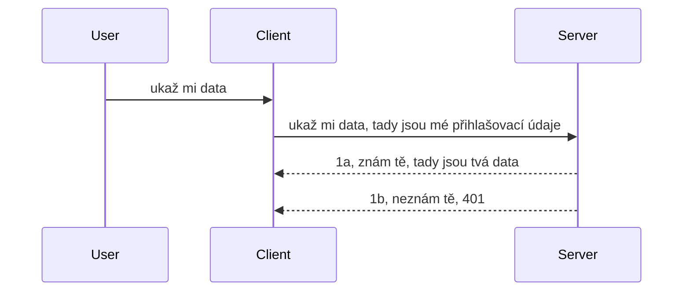

# Jednoduchá autentizace

SDK MCP podporují použití OAuth 2.1, což je, abychom byli upřímní, celkem složitý proces zahrnující pojmy jako auth server, resource server, posílání přihlašovacích údajů, získávání kódu, výměnu kódu za bearer token, až konečně získání dat z našeho zdroje. Pokud nejste zvyklí na OAuth, což je skvělá věc k implementaci, je dobré začít s nějakou základní úrovní autentizace a postupně ji zlepšovat směrem k stále lepší bezpečnosti. Proto tato kapitola existuje, aby vás připravila na pokročilejší autentizaci.

## Autentizace, co tím myslíme?

Autentizace je zkratka pro ověření a autorizaci. Myšlenka je, že je potřeba udělat dvě věci:

- **Ověření (Authentication)**, což je proces zjištění, zda dovolíme člověku vstoupit do našeho domu, že má právo být "tady", tedy mít přístup k našemu resource serveru, kde se nachází funkce našeho MCP Serveru.
- **Autorizace (Authorization)**, je proces zjištění, zda by uživatel měl mít přístup k těmto konkrétním zdrojům, které žádá, například k těmto objednávkám nebo produktům, nebo zda může jen číst obsah, ale bez oprávnění mazat, jako jiný příklad.

## Přihlašovací údaje: jak systému říkáme, kdo jsme

No, většina webových vývojářů začíná myslet v tom smyslu, že poskytnou serveru přihlašovací údaj, obvykle tajemství, které říká, zda smí být tady "Authentication". Toto přihlašovací údaje jsou obvykle base64 kódovaná verze uživatelského jména a hesla nebo API klíč, který jednoznačně identifikuje konkrétního uživatele.

To obnáší poslat je přes hlavičku nazvanou "Authorization" takto:

```json
{ "Authorization": "secret123" }
```

Tomu se obvykle říká základní autentizace (basic authentication). Celý průběh pak funguje takto:


Nyní, když chápeme, jak to funguje z hlediska průběhu, jak to implementovat? Většina webových serverů má pojem middleware, kus kódu, který se spouští jako součást požadavku a může ověřit přihlašovací údaje, a pokud jsou platné, nechá požadavek projít. Pokud požadavek nemá platné přihlašovací údaje, dostanete chybu autentizace. Podívejme se, jak to lze implementovat:

**Python**

```python
class AuthMiddleware(BaseHTTPMiddleware):
    async def dispatch(self, request, call_next):

        has_header = request.headers.get("Authorization")
        if not has_header:
            print("-> Missing Authorization header!")
            return Response(status_code=401, content="Unauthorized")

        if not valid_token(has_header):
            print("-> Invalid token!")
            return Response(status_code=403, content="Forbidden")

        print("Valid token, proceeding...")
       
        response = await call_next(request)
        # přidejte jakékoli uživatelské hlavičky nebo nějakým způsobem změňte odpověď
        return response


starlette_app.add_middleware(CustomHeaderMiddleware)
```

Tady máme:

- Vytvořen middleware s názvem `AuthMiddleware`, kde jeho metoda `dispatch` je vyvolána webovým serverem.
- Přidán middleware do webového serveru:

    ```python
    starlette_app.add_middleware(AuthMiddleware)
    ```

- Napsanou validační logiku, která kontroluje, jestli hlavička Authorization je přítomna a zda odeslané tajemství je platné:

    ```python
    has_header = request.headers.get("Authorization")
    if not has_header:
        print("-> Missing Authorization header!")
        return Response(status_code=401, content="Unauthorized")

    if not valid_token(has_header):
        print("-> Invalid token!")
        return Response(status_code=403, content="Forbidden")
    ```

    pokud je tajemství přítomno a platné, necháme požadavek projít zavoláním `call_next` a vrátíme odpověď.

    ```python
    response = await call_next(request)
    # přidat jakékoli zákaznické hlavičky nebo nějakým způsobem změnit odpověď
    return response
    ```

Princip fungování je takový, že pokud je proveden webový požadavek na server, middleware se vyvolá a dle své implementace buď nechá požadavek projít, nebo vrátí chybu, která ukazuje, že klient nemá povolení pokračovat.

**TypeScript**

Zde vytvoříme middleware s populárním frameworkem Express a zachytíme požadavek, než dosáhne MCP Serveru. Kód je následující:

```typescript
function isValid(secret) {
    return secret === "secret123";
}

app.use((req, res, next) => {
    // 1. Hlavička autorizace přítomna?
    if(!req.headers["Authorization"]) {
        res.status(401).send('Unauthorized');
    }
    
    let token = req.headers["Authorization"];

    // 2. Zkontrolujte platnost.
    if(!isValid(token)) {
        res.status(403).send('Forbidden');
    }

   
    console.log('Middleware executed');
    // 3. Předá požadavek do dalšího kroku v pipeline požadavku.
    next();
});
```

V tomto kódu:

1. Kontrolujeme, zda hlavička Authorization vůbec existuje, pokud ne, pošleme chybu 401.
2. Zajistíme, že přihlašovací údaj/token je platný, pokud ne, pošleme chybu 403.
3. Nakonec propustíme požadavek v rámci pipeline a vrátíme požadovaný zdroj.

## Cvičení: Implementujte autentizaci

Pojďme naše znalosti vyzkoušet v praxi. Plán je:

Server

- Vytvořit webový server a instanci MCP.
- Implementovat middleware pro server.

Klient

- Poslat webový požadavek s přihlašovacími údaji přes hlavičku.

### -1- Vytvořit webový server a instanci MCP

V prvním kroku je potřeba vytvořit instanci webového serveru a MCP Server.

**Python**

Zde vytvoříme instanci MCP serveru, vytvoříme starlette web app a hostíme ji pomocí uvicorn.

```python
# vytváření MCP serveru

app = FastMCP(
    name="MCP Resource Server",
    instructions="Resource Server that validates tokens via Authorization Server introspection",
    host=settings["host"],
    port=settings["port"],
    debug=True
)

# vytváření webové aplikace starlette
starlette_app = app.streamable_http_app()

# poskytování aplikace přes uvicorn
async def run(starlette_app):
    import uvicorn
    config = uvicorn.Config(
            starlette_app,
            host=app.settings.host,
            port=app.settings.port,
            log_level=app.settings.log_level.lower(),
        )
    server = uvicorn.Server(config)
    await server.serve()

run(starlette_app)
```

V tomto kódu:

- Vytvoříme MCP Server.
- Sestavíme starlette web app z MCP Serveru, `app.streamable_http_app()`.
- Hostujeme a servírujeme webovou aplikaci pomocí uvicorn `server.serve()`.

**TypeScript**

Zde vytvoříme instanci MCP Serveru.

```typescript
const server = new McpServer({
      name: "example-server",
      version: "1.0.0"
    });

    // ... nastavit zdroje serveru, nástroje a výzvy ...
```

Toto vytvoření MCP Serveru bude potřeba udělat v naší definici trasy POST /mcp, takže vezměme výše uvedený kód a přesuňme ho takto:

```typescript
import express from "express";
import { randomUUID } from "node:crypto";
import { McpServer } from "@modelcontextprotocol/sdk/server/mcp.js";
import { StreamableHTTPServerTransport } from "@modelcontextprotocol/sdk/server/streamableHttp.js";
import { isInitializeRequest } from "@modelcontextprotocol/sdk/types.js"

const app = express();
app.use(express.json());

// Mapa pro ukládání přenosů podle ID relace
const transports: { [sessionId: string]: StreamableHTTPServerTransport } = {};

// Zpracování POST požadavků pro komunikaci klient-server
app.post('/mcp', async (req, res) => {
  // Kontrola existujícího ID relace
  const sessionId = req.headers['mcp-session-id'] as string | undefined;
  let transport: StreamableHTTPServerTransport;

  if (sessionId && transports[sessionId]) {
    // Znovupoužití existujícího přenosu
    transport = transports[sessionId];
  } else if (!sessionId && isInitializeRequest(req.body)) {
    // Nový inicializační požadavek
    transport = new StreamableHTTPServerTransport({
      sessionIdGenerator: () => randomUUID(),
      onsessioninitialized: (sessionId) => {
        // Uložení přenosu podle ID relace
        transports[sessionId] = transport;
      },
      // Ochrana proti DNS rebindingu je ve výchozím nastavení vypnuta pro zpětnou kompatibilitu. Pokud tento server spouštíte
      // lokálně, ujistěte se, že nastavíte:
      // enableDnsRebindingProtection: true,
      // allowedHosts: ['127.0.0.1'],
    });

    // Vyčištění přenosu po jeho uzavření
    transport.onclose = () => {
      if (transport.sessionId) {
        delete transports[transport.sessionId];
      }
    };
    const server = new McpServer({
      name: "example-server",
      version: "1.0.0"
    });

    // ... nastavení serverových zdrojů, nástrojů a výzev ...

    // Připojení k MCP serveru
    await server.connect(transport);
  } else {
    // Neplatný požadavek
    res.status(400).json({
      jsonrpc: '2.0',
      error: {
        code: -32000,
        message: 'Bad Request: No valid session ID provided',
      },
      id: null,
    });
    return;
  }

  // Zpracování požadavku
  await transport.handleRequest(req, res, req.body);
});

// Znovupoužitelný zpracovatel pro GET a DELETE požadavky
const handleSessionRequest = async (req: express.Request, res: express.Response) => {
  const sessionId = req.headers['mcp-session-id'] as string | undefined;
  if (!sessionId || !transports[sessionId]) {
    res.status(400).send('Invalid or missing session ID');
    return;
  }
  
  const transport = transports[sessionId];
  await transport.handleRequest(req, res);
};

// Zpracování GET požadavků pro notifikace serveru klientovi přes SSE
app.get('/mcp', handleSessionRequest);

// Zpracování DELETE požadavků pro ukončení relace
app.delete('/mcp', handleSessionRequest);

app.listen(3000);
```

Nyní vidíte, jak bylo vytvoření MCP Serveru přesunuto do `app.post("/mcp")`.

Přejděme k dalšímu kroku — vytvoření middleware, abychom mohli validovat přicházející přihlašovací údaje.

### -2- Implementovat middleware pro server

Nyní k části middleware. Vytvoříme middleware, který hledá přihlašovací údaje v hlavičce `Authorization` a validuje je. Pokud jsou přijatelná, požadavek bude pokračovat a vykoná, co má (například zobrazí nástroje, načte zdroj nebo cokoliv, co klient MCP požaduje).

**Python**

K vytvoření middleware je potřeba vytvořit třídu, která dědí z `BaseHTTPMiddleware`. Jsou tu dva zajímavé prvky:

- Požadavek `request`, ze kterého čteme informace v hlavičkách.
- `call_next` je callback, který musíme zavolat, pokud klient přinesl přihlašovací údaje, které akceptujeme.

Nejprve musíme ošetřit případ, kdy hlavička `Authorization` chybí:

```python
has_header = request.headers.get("Authorization")

# není přítomen žádný záhlaví, chyba s 401, jinak pokračovat dál.
if not has_header:
    print("-> Missing Authorization header!")
    return Response(status_code=401, content="Unauthorized")
```

Zde posíláme 401 unauthorized zprávu, protože klient selhává v autentizaci.

Dále, pokud jsou přihlašovací údaje předány, musíme zkontrolovat jejich platnost takto:

```python
 if not valid_token(has_header):
    print("-> Invalid token!")
    return Response(status_code=403, content="Forbidden")
```

Všimněte si, že posíláme zprávu 403 forbidden. Níže je celé middleware implementující vše, co jsme zmínili:

```python
class AuthMiddleware(BaseHTTPMiddleware):
    async def dispatch(self, request, call_next):

        has_header = request.headers.get("Authorization")
        if not has_header:
            print("-> Missing Authorization header!")
            return Response(status_code=401, content="Unauthorized")

        if not valid_token(has_header):
            print("-> Invalid token!")
            return Response(status_code=403, content="Forbidden")

        print("Valid token, proceeding...")
        print(f"-> Received {request.method} {request.url}")
        response = await call_next(request)
        response.headers['Custom'] = 'Example'
        return response

```

Skvělé, ale co funkce `valid_token`? Zde je níže:

```python
# NEPOUŽÍVEJTE pro produkci - vylepšete to !!
def valid_token(token: str) -> bool:
    # odstraňte předponu "Bearer "
    if token.startswith("Bearer "):
        token = token[7:]
        return token == "secret-token"
    return False
```

Tohle by se samozřejmě mělo zlepšit.

DŮLEŽITÉ: Nikdy byste neměli mít tajemství přímo v kódu. Měli byste ideálně hodnotu brát z datového zdroje nebo od poskytovatele identity (IDP), nebo ještě lépe, nechat validaci provádět právě IDP.

**TypeScript**

Pro implementaci v Express musíme zavolat metodu `use`, která bere middleware funkce.

Potřebujeme:

- Pracovat s požadavkem, aby bylo možné zkontrolovat předané přihlašovací údaje v `Authorization` vlastnosti.
- Validovat přihlašovací údaje, a pokud jsou platné, nechat požadavek pokračovat a provést požadavky MCP klienta (například vypsat nástroje, přečíst zdroj nebo cokoli jiného ve vztahu k MCP).

Zde kontrolujeme, zda hlavička `Authorization` je přítomna, jinak zastavíme požadavek:

```typescript
if(!req.headers["authorization"]) {
    res.status(401).send('Unauthorized');
    return;
}
```

Pokud hlavička není vůbec poslána, dostanete 401.

Dále kontrolujeme platnost přihlašovacích údajů; pokud neplatné, zastavíme požadavek s jinou chybou:

```typescript
if(!isValid(token)) {
    res.status(403).send('Forbidden');
    return;
} 
```

Vidíte, že teď obdržíte chybu 403.

Zde je kompletní kód:

```typescript
app.use((req, res, next) => {
    console.log('Request received:', req.method, req.url, req.headers);
    console.log('Headers:', req.headers["authorization"]);
    if(!req.headers["authorization"]) {
        res.status(401).send('Unauthorized');
        return;
    }
    
    let token = req.headers["authorization"];

    if(!isValid(token)) {
        res.status(403).send('Forbidden');
        return;
    }  

    console.log('Middleware executed');
    next();
});
```

Nastavili jsme webový server tak, aby přijímal middleware kontrolující přihlašovací údaje, které nám klient posílá. Co klient sám?

### -3- Poslat webový požadavek s přihlašovacími údaji přes hlavičku

Musíme zajistit, aby klient předával přihlašovací údaje přes hlavičku. Protože chceme použít MCP klienta, musíme zjistit, jak se to dělá.

**Python**

Pro klienta musíme přidat hlavičku s přihlašovacím údajem takto:

```python
# NEpevně nastavujte hodnotu, mějte ji alespoň v proměnné prostředí nebo v bezpečnějším úložišti
token = "secret-token"

async with streamablehttp_client(
        url = f"http://localhost:{port}/mcp",
        headers = {"Authorization": f"Bearer {token}"}
    ) as (
        read_stream,
        write_stream,
        session_callback,
    ):
        async with ClientSession(
            read_stream,
            write_stream
        ) as session:
            await session.initialize()
      
            # TODO, co chcete provést na klientovi, např. zobrazit nástroje, volat nástroje atd.
```

Všimněte si, jak nastavujeme vlastnost `headers` jako `headers = {"Authorization": f"Bearer {token}"}`.

**TypeScript**

Můžeme to vyřešit ve dvou krocích:

1. Naplnit konfigurační objekt přihlašovacími údaji.
2. Poslat konfigurační objekt do transportu.

```typescript

// NEpevně zakódovávejte hodnotu, jako je zde ukázáno. Minimálně ji mějte jako proměnnou prostředí a používejte něco jako dotenv (v režimu vývoje).
let token = "secret123"

// definujte objekt s možnostmi pro klientský transport
let options: StreamableHTTPClientTransportOptions = {
  sessionId: sessionId,
  requestInit: {
    headers: {
      "Authorization": "secret123"
    }
  }
};

// předat objekt možností do transportu
async function main() {
   const transport = new StreamableHTTPClientTransport(
      new URL(serverUrl),
      options
   );
```

Vidíte, jak jsme museli vytvořit objekt `options` a vložit záhlaví do vlastnosti `requestInit`.

DŮLEŽITÉ: Jak to ale vylepšit? Současná implementace má určité problémy. Především posílání přihlašovacích údajů tímto způsobem je poměrně rizikové, pokud alespoň nemáte HTTPS. I pak mohou být údaje ukradeny, takže potřebujete systém, který umožní snadné zrušení tokenu a přidání dalších kontrol jako např. odkud token přichází, jestli požadavky nepřicházejí příliš často (chování jako bot), zkrátka je tu celá řada obav.

Je ale potřeba říct, že pro velmi jednoduchá API, kde nechcete, aby kdokoli volal vaše API bez autentizace, je to dobrý start.

S tímto na mysli pojďme zpřísnit bezpečnost zavedením standardizovaného formátu, jako je JSON Web Token, známý také jako JWT nebo "JOT" tokeny.

## JSON Web Tokeny, JWT

Takže se snažíme zlepšit věci oproti posílání velmi jednoduchých přihlašovacích údajů. Jaké jsou okamžité výhody použití JWT?

- **Bezpečnostní zlepšení**. V basic auth posíláte uživatelské jméno a heslo jako base64 kódovaný token (nebo API klíč) znovu a znovu, což zvyšuje riziko. S JWT posíláte jméno a heslo a dostanete token zpět a ten je časově omezený, tedy expirovatelný. JWT umožňuje snadné použití jemnozrné kontroly přístupu pomocí rolí, rozsahů a oprávnění.
- **Bezstavovost a škálovatelnost**. JWT jsou samostatné, přenášejí všechny informace o uživateli a eliminují nutnost ukládání session na straně serveru. Token může být také validován lokálně.
- **Interoperabilita a federace**. JWT jsou středem Open ID Connect a používají se u známých poskytovatelů identity jako Entra ID, Google Identity a Auth0. Umožňují také Single Sign-On a další, činí je podnikově využitelnými.
- **Modularita a flexibilita**. JWT lze použít i s API bránami jako Azure API Management, NGINX a další. Podporují scénáře autentizace i komunikace server-ke-serveru včetně impersonace a delegace.
- **Výkon a cachování**. JWT lze cachovat po dekódování, což snižuje potřebu parsování. To pomáhá zejména u aplikací s vysokým provozem, protože zlepšuje průtok a snižuje zátěž infrastruktury.
- **Pokročilé funkce**. Podporují introspekci (kontrolu platnosti na serveru) a revokaci (zneplatnění tokenu).

Se všemi těmito výhodami si ukažme, jak posunout naši implementaci na další úroveň.

## Převod základní autentizace na JWT

Takže změny, které musíme udělat na vysoké úrovni, jsou:

- **Naučit se sestavit JWT token** a připravit ho pro odeslání z klienta na server.
- **Validovat JWT token**, a pokud je platný, umožnit klientovi přístup k našim zdrojům.
- **Bezpečné uložení tokenu**. Jak token bezpečně uložit.
- **Ochrana tras**. Potřebujeme chránit cesty (routes), v našem případě chránit konkrétní trasy a MCP funkce.
- **Přidání refresh tokenů**. Zajistit, že vytváříme tokeny s krátkou životností a současně refresh tokeny, které jsou dlouhodobé a mohou sloužit k získání nových tokenů v případě vypršení platnosti. Také zajistit refresh endpoint a strategii rotace.

### -1- Sestavení JWT tokenu

Nejprve, JWT token má tyto části:

- **header**, použitý algoritmus a typ tokenu.
- **payload**, tvrzení (claims), jako sub (uživatel nebo entita, kterou token reprezentuje; v auth scénáři uživatelské ID), exp (vypršení platnosti), role (role).
- **signature**, podepsaná tajemstvím nebo privátním klíčem.

Pro tuto úlohu sestavíme header, payload a kódovaný token.

**Python**

```python

import jwt
import jwt
from jwt.exceptions import ExpiredSignatureError, InvalidTokenError
import datetime

# Tajný klíč použitý k podepsání JWT
secret_key = 'your-secret-key'

header = {
    "alg": "HS256",
    "typ": "JWT"
}

# informace o uživateli a jeho nároky a čas vypršení
payload = {
    "sub": "1234567890",               # Předmět (ID uživatele)
    "name": "User Userson",                # Vlastní nárok
    "admin": True,                     # Vlastní nárok
    "iat": datetime.datetime.utcnow(),# Vydáno
    "exp": datetime.datetime.utcnow() + datetime.timedelta(hours=1)  # Vypršení
}

# zakódovat to
encoded_jwt = jwt.encode(payload, secret_key, algorithm="HS256", headers=header)
```

V uvedeném kódu jsme:

- Definovali header s algoritmem HS256 a typem JWT.
- Sestavili payload, který obsahuje subjekt či uživatelské ID, uživatelské jméno, roli, kdy byl token vydán a kdy expiruje - tím jsme implementovali časové omezení, o kterém jsme mluvili.

**TypeScript**

Zde budeme potřebovat nějaké závislosti, které nám pomohou sestavit JWT token.

Závislosti

```sh

npm install jsonwebtoken
npm install --save-dev @types/jsonwebtoken
```

Nyní, když je to připravené, sestavíme header, payload a přes to vygenerujeme kódovaný token.

```typescript
import jwt from 'jsonwebtoken';

const secretKey = 'your-secret-key'; // Použijte proměnné prostředí v produkci

// Definujte užitečné zatížení
const payload = {
  sub: '1234567890',
  name: 'User usersson',
  admin: true,
  iat: Math.floor(Date.now() / 1000), // Vydáno
  exp: Math.floor(Date.now() / 1000) + 60 * 60 // Vyprší za 1 hodinu
};

// Definujte hlavičku (volitelné, jsonwebtoken nastavuje výchozí hodnoty)
const header = {
  alg: 'HS256',
  typ: 'JWT'
};

// Vytvořte token
const token = jwt.sign(payload, secretKey, {
  algorithm: 'HS256',
  header: header
});

console.log('JWT:', token);
```

Tento token je:

Podepsán pomocí HS256
Platný 1 hodinu
Obsahuje tvrzení jako sub, name, admin, iat a exp.

### -2- Validace tokenu

Také budeme potřebovat validovat token; to je něco, co bychom měli dělat na serveru, abychom zajistili, že to, co nám klient posílá, je skutečně platné. Je potřeba udělat mnoho kontrol, od ověření struktury až po platnost. Doporučuje se také přidat další kontroly, například jestli uživatel je v našem systému a další.

Pro validaci tokenu musíme token dekódovat, abychom ho mohli číst a začít kontrolovat jeho platnost:

**Python**

```python

# Dekódujte a ověřte JWT
try:
    decoded = jwt.decode(token, secret_key, algorithms=["HS256"])
    print("✅ Token is valid.")
    print("Decoded claims:")
    for key, value in decoded.items():
        print(f"  {key}: {value}")
except ExpiredSignatureError:
    print("❌ Token has expired.")
except InvalidTokenError as e:
    print(f"❌ Invalid token: {e}")

```

V tomto kódu voláme `jwt.decode` s tokenem, tajným klíčem a zvoleným algoritmem. Všimněte si použití try-catch konstruktu, protože selhání validace vyvolá chybu.

**TypeScript**

Zde voláme `jwt.verify` pro získání dekódované verze tokenu, kterou můžeme dále analyzovat. Pokud volání selže, token má nekorektní strukturu nebo už není platný.

```typescript

try {
  const decoded = jwt.verify(token, secretKey);
  console.log('Decoded Payload:', decoded);
} catch (err) {
  console.error('Token verification failed:', err);
}
```

POZNÁMKA: jak bylo uvedeno výše, měli bychom provést další kontroly, zda tento token skutečně odkazuje na uživatele v našem systému a ověřit, jestli má uživatel práva, která token tvrdí, že má.
Dále se podíváme na řízení přístupu založené na rolích, také známé jako RBAC.

## Přidání řízení přístupu založeného na rolích

Myšlenka je v tom, že chceme vyjádřit, že různé role mají různá oprávnění. Například předpokládáme, že administrátor může dělat vše a že běžní uživatelé mohou číst/pisovat a že host může pouze číst. Proto zde jsou možné úrovně oprávnění:

- Admin.Write
- User.Read
- Guest.Read

Podívejme se, jak takovou kontrolu můžeme implementovat pomocí middleware. Middleware lze přidávat na jednotlivé cesty i na všechny cesty.

**Python**

```python
from starlette.middleware.base import BaseHTTPMiddleware
from starlette.responses import JSONResponse
import jwt

# NEMĚJTE tajemství v kódu jako toto, to je pouze pro demonstrační účely. Čtěte to z bezpečného místa.
SECRET_KEY = "your-secret-key" # umístěte to do proměnné prostředí
REQUIRED_PERMISSION = "User.Read"

class JWTPermissionMiddleware(BaseHTTPMiddleware):
    async def dispatch(self, request, call_next):
        auth_header = request.headers.get("Authorization")
        if not auth_header or not auth_header.startswith("Bearer "):
            return JSONResponse({"error": "Missing or invalid Authorization header"}, status_code=401)

        token = auth_header.split(" ")[1]
        try:
            decoded = jwt.decode(token, SECRET_KEY, algorithms=["HS256"])
        except jwt.ExpiredSignatureError:
            return JSONResponse({"error": "Token expired"}, status_code=401)
        except jwt.InvalidTokenError:
            return JSONResponse({"error": "Invalid token"}, status_code=401)

        permissions = decoded.get("permissions", [])
        if REQUIRED_PERMISSION not in permissions:
            return JSONResponse({"error": "Permission denied"}, status_code=403)

        request.state.user = decoded
        return await call_next(request)


```

Existuje několik různých způsobů, jak middleware přidat, jako níže:

```python

# Alt 1: přidat middleware při vytváření aplikace starlette
middleware = [
    Middleware(JWTPermissionMiddleware)
]

app = Starlette(routes=routes, middleware=middleware)

# Alt 2: přidat middleware poté, co je aplikace starlette již vytvořena
starlette_app.add_middleware(JWTPermissionMiddleware)

# Alt 3: přidat middleware pro každou trasu
routes = [
    Route(
        "/mcp",
        endpoint=..., # zpracovatel
        middleware=[Middleware(JWTPermissionMiddleware)]
    )
]
```

**TypeScript**

Můžeme použít `app.use` a middleware, který poběží pro všechny požadavky.

```typescript
app.use((req, res, next) => {
    console.log('Request received:', req.method, req.url, req.headers);
    console.log('Headers:', req.headers["authorization"]);

    // 1. Zkontrolujte, zda byl odeslán autorizační záhlaví

    if(!req.headers["authorization"]) {
        res.status(401).send('Unauthorized');
        return;
    }
    
    let token = req.headers["authorization"];

    // 2. Zkontrolujte, zda je token platný
    if(!isValid(token)) {
        res.status(403).send('Forbidden');
        return;
    }  

    // 3. Zkontrolujte, zda uživatel tokenu existuje v našem systému
    if(!isExistingUser(token)) {
        res.status(403).send('Forbidden');
        console.log("User does not exist");
        return;
    }
    console.log("User exists");

    // 4. Ověřte, zda má token správná oprávnění
    if(!hasScopes(token, ["User.Read"])){
        res.status(403).send('Forbidden - insufficient scopes');
    }

    console.log("User has required scopes");

    console.log('Middleware executed');
    next();
});

```

Existuje docela mnoho věcí, které můžeme nechat náš middleware dělat a které náš middleware MĚL UDĚLAT, konkrétně:

1. Zkontrolovat, zda je přítomen hlavičkový parametr autorizace
2. Zkontrolovat, zda je token platný, voláme `isValid`, což je metoda, kterou jsme napsali a která kontroluje integritu a platnost JWT tokenu.
3. Ověřit, zda uživatel existuje v našem systému, to bychom měli zkontrolovat.

   ```typescript
    // uživatelé v DB
   const users = [
     "user1",
     "User usersson",
   ]

   function isExistingUser(token) {
     let decodedToken = verifyToken(token);

     // TODO, zkontrolovat, zda uživatel existuje v DB
     return users.includes(decodedToken?.name || "");
   }
   ```

   Výše jsme vytvořili velmi jednoduchý seznam `users`, který by samozřejmě měl být v databázi.

4. Navíc bychom měli také zkontrolovat, zda má token správná oprávnění.

   ```typescript
   if(!hasScopes(token, ["User.Read"])){
        res.status(403).send('Forbidden - insufficient scopes');
   }
   ```

   V tomto kódu výše v middleware kontrolujeme, že token obsahuje oprávnění User.Read, pokud ne, odešleme chybu 403. Níže je pomocná metoda `hasScopes`.

   ```typescript
   function hasScopes(scope: string, requiredScopes: string[]) {
     let decodedToken = verifyToken(scope);
    return requiredScopes.every(scope => decodedToken?.scopes.includes(scope));
  }
   ```

Have a think which additional checks you should be doing, but these are the absolute minimum of checks you should be doing.

Using Express as a web framework is a common choice. There are helpers library when you use JWT so you can write less code.

- `express-jwt`, helper library that provides a middleware that helps decode your token.
- `express-jwt-permissions`, this provides a middleware `guard` that helps check if a certain permission is on the token.

Here's what these libraries can look like when used:

```typescript
const express = require('express');
const jwt = require('express-jwt');
const guard = require('express-jwt-permissions')();

const app = express();
const secretKey = 'your-secret-key'; // put this in env variable

// Decode JWT and attach to req.user
app.use(jwt({ secret: secretKey, algorithms: ['HS256'] }));

// Check for User.Read permission
app.use(guard.check('User.Read'));

// multiple permissions
// app.use(guard.check(['User.Read', 'Admin.Access']));

app.get('/protected', (req, res) => {
  res.json({ message: `Welcome ${req.user.name}` });
});

// Error handler
app.use((err, req, res, next) => {
  if (err.code === 'permission_denied') {
    return res.status(403).send('Forbidden');
  }
  next(err);
});

```

Teď jste viděli, jak lze middleware použít jak pro autentizaci, tak autorizaci, ale co MCP, změní to, jak děláme autentizaci? To zjistíme v další části.

### -3- Přidání RBAC do MCP

Doposud jste viděli, jak můžete přidat RBAC pomocí middleware, nicméně pro MCP není jednoduchý způsob, jak přidat RBAC na úrovni jednotlivé funkce MCP, co tedy uděláme? No, prostě přidáme kód, který v tomto případě kontroluje, zda klient má práva volat konkrétní nástroj:

Máte několik možností, jak dosáhnout RBAC na úrovni funkce, zde jsou některé:

- Přidat kontrolu pro každý nástroj, zdroj, prompt, kde potřebujete kontrolovat úroveň oprávnění.

   **python**

   ```python
   @tool()
   def delete_product(id: int):
      try:
          check_permissions(role="Admin.Write", request)
      catch:
        pass # klient selhal při autorizaci, vyvolejte chybu autorizace
   ```

   **typescript**

   ```typescript
   server.registerTool(
    "delete-product",
    {
      title: Delete a product",
      description: "Deletes a product",
      inputSchema: { id: z.number() }
    },
    async ({ id }) => {
      
      try {
        checkPermissions("Admin.Write", request);
        // todo, poslat id do productService a vzdáleného vstupu
      } catch(Exception e) {
        console.log("Authorization error, you're not allowed");  
      }

      return {
        content: [{ type: "text", text: `Deletected product with id ${id}` }]
      };
    }
   );
   ```


- Použít pokročilý serverový přístup a request handlery, aby se minimalizovalo, kolik míst je třeba kontrolovat.

   **Python**

   ```python
   
   tool_permission = {
      "create_product": ["User.Write", "Admin.Write"],
      "delete_product": ["Admin.Write"]
   }

   def has_permission(user_permissions, required_permissions) -> bool:
      # user_permissions: seznam oprávnění, která uživatel má
      # required_permissions: seznam oprávnění požadovaných pro nástroj
      return any(perm in user_permissions for perm in required_permissions)

   @server.call_tool()
   async def handle_call_tool(
     name: str, arguments: dict[str, str] | None
   ) -> list[types.TextContent]:
    # Předpokládejte, že request.user.permissions je seznam oprávnění uživatele
     user_permissions = request.user.permissions
     required_permissions = tool_permission.get(name, [])
     if not has_permission(user_permissions, required_permissions):
        # Vyvolejte chybu "Nemáte oprávnění k volání nástroje {name}"
        raise Exception(f"You don't have permission to call tool {name}")
     # pokračujte a zavolejte nástroj
     # ...
   ```   
    

   **TypeScript**

   ```typescript
   function hasPermission(userPermissions: string[], requiredPermissions: string[]): boolean {
       if (!Array.isArray(userPermissions) || !Array.isArray(requiredPermissions)) return false;
       // Vrátí true, pokud má uživatel alespoň jedno požadované oprávnění
       
       return requiredPermissions.some(perm => userPermissions.includes(perm));
   }
  
   server.setRequestHandler(CallToolRequestSchema, async (request) => {
      const { params: { name } } = request;
  
      let permissions = request.user.permissions;
  
      if (!hasPermission(permissions, toolPermissions[name])) {
         return new Error(`You don't have permission to call ${name}`);
      }
  
      // pokračujte..
   });
   ```

   Poznámka, budete muset zajistit, aby váš middleware přiděloval dekódovaný token do vlastnosti user požadavku, tak aby byl kód výše jednoduchý.

### Shrnutí

Nyní, když jsme probrali, jak obecně přidat podporu RBAC a zvláště pro MCP, je čas zkusit implementovat zabezpečení sami, abyste si ověřili, že jste koncepty pochopili.

## Zadání 1: Vytvořte MCP server a MCP klient s použitím základní autentizace

Zde využijete, co jste se naučili ohledně posílání přihlašovacích údajů přes hlavičky.

## Řešení 1

[Řešení 1](./code/basic/README.md)

## Zadání 2: Vylepšete řešení ze Zadání 1 použitím JWT

Vezměte první řešení, ale tentokrát ho vylepšíme.

Namísto Basic Auth použijeme JWT.

## Řešení 2

[Řešení 2](./solution/jwt-solution/README.md)

## Výzva

Přidejte RBAC na úrovni nástroje, jak jsme popsali v sekci "Přidání RBAC do MCP".

## Shrnutí

Doufáme, že jste se v této kapitole hodně naučili, od nulové bezpečnosti, přes základní zabezpečení, po JWT a jak ho přidat do MCP.

Vybudovali jsme pevný základ s vlastními JWT, ale jak se rozrůstáme, posouváme se směrem ke standardizovanému modelu identity. Přijetí IdP jako Entra nebo Keycloak nám umožní delegovat vydávání tokenů, validaci a správu životního cyklu na důvěryhodnou platformu — což nám umožní soustředit se na logiku aplikace a uživatelskou zkušenost.

Pro to máme pokročilejší [kapitolu o Entra](../../05-AdvancedTopics/mcp-security-entra/README.md)

## Co dál

- Další: [Nastavení MCP hostitelů](../12-mcp-hosts/README.md)

---

<!-- CO-OP TRANSLATOR DISCLAIMER START -->
**Prohlášení o vyloučení odpovědnosti**:  
Tento dokument byl přeložen pomocí služby strojového překladu [Co-op Translator](https://github.com/Azure/co-op-translator). Ač usilujeme o přesnost, mějte prosím na paměti, že automatizované překlady mohou obsahovat chyby nebo nepřesnosti. Původní dokument v původním jazyce by měl být považován za autoritativní zdroj. U kritických informací se doporučuje profesionální lidský překlad. Nejsme odpovědní za jakékoli nedorozumění nebo chybné výklady vzniklé z použití tohoto překladu.
<!-- CO-OP TRANSLATOR DISCLAIMER END -->