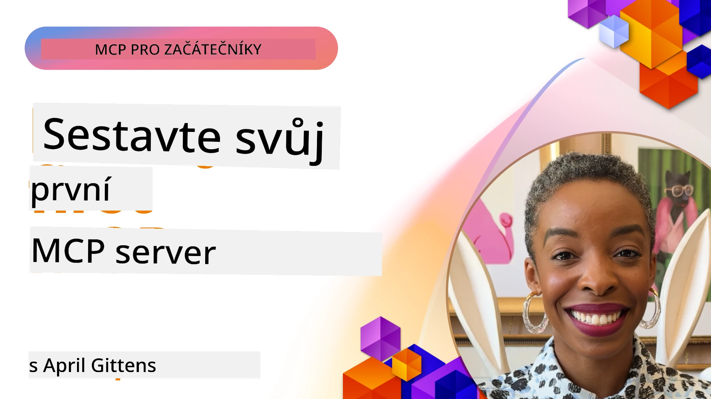

## Začínáme  

_(Klikněte na obrázek výše pro zobrazení videa této lekce)_

Tato sekce se skládá z několika lekcí:

- **1 Váš první server**, v této první lekci se naučíte, jak vytvořit svůj první server a prohlédnout si ho pomocí inspektorového nástroje, cenného způsobu, jak testovat a ladit váš server, [k lekci](01-first-server/README.md)

- **2 Klient**, v této lekci se naučíte, jak napsat klienta, který se může připojit k vašemu serveru, [k lekci](02-client/README.md)

- **3 Klient s LLM**, ještě lepší způsob psaní klienta je přidat mu LLM, aby mohl "vyjednávat" s vaším serverem, co dělat, [k lekci](03-llm-client/README.md)

- **4 Spotřebování režimu agenta GitHub Copilot serveru ve Visual Studio Code**. Zde se díváme na spuštění našeho MCP serveru přímo z Visual Studio Code, [k lekci](04-vscode/README.md)

- **5 stdio Transport Server** stdio transport je doporučený standard pro lokální komunikaci mezi MCP serverem a klientem, poskytující bezpečnou komunikaci založenou na podprocesech s vestavěnou izolací procesů [k lekci](05-stdio-server/README.md)

- **6 HTTP Streaming s MCP (Streamable HTTP)**. Naučte se o moderním HTTP streamování transportu (doporučený přístup pro vzdálené MCP servery dle [MCP Specifikace 2025-11-25](https://spec.modelcontextprotocol.io/specification/2025-11-25/basic/transports/#streamable-http)), oznámeních o průběhu a jak implementovat škálovatelné, reálné MCP servery a klienty pomocí Streamable HTTP. [k lekci](06-http-streaming/README.md)

- **7 Využití AI Toolkit pro VSCode** pro spotřebu a testování vašich MCP klientů a serverů [k lekci](07-aitk/README.md)

- **8 Testování**. Zaměříme se zde zejména na to, jak můžeme testovat náš server a klienta různými způsoby, [k lekci](08-testing/README.md)

- **9 Nasazení**. Tato kapitola se zabývá různými způsoby nasazení vašich MCP řešení, [k lekci](09-deployment/README.md)

- **10 Pokročilé použití serveru**. Tato kapitola pokrývá pokročilé použití serveru, [k lekci](./10-advanced/README.md)

- **11 Autentizace**. Tato kapitola pokrývá, jak přidat jednoduchou autentizaci, od Basic Auth po použití JWT a RBAC. Doporučuje se začít zde a poté se podívat na Pokročilá témata v kapitole 5 a provést další zabezpečení podle doporučení v kapitole 2, [k lekci](./11-simple-auth/README.md)

- **12 MCP Hostitelé**. Konfigurujte a používejte populární MCP hostitelské klienty včetně Claude Desktop, Cursor, Cline a Windsurf. Naučte se typy transportů a řešení problémů, [k lekci](./12-mcp-hosts/README.md)

- **13 MCP Inspektor**. Interaktivně ladte a testujte své MCP servery pomocí nástroje MCP Inspektor. Naučte se řešit problémy s nástroji, zdroji a protokolovými zprávami, [k lekci](./13-mcp-inspector/README.md)

Model Context Protocol (MCP) je otevřený protokol, který standardizuje, jak aplikace poskytují kontext pro LLM. Představte si MCP jako USB-C port pro AI aplikace – poskytuje standardizovaný způsob propojení AI modelů s různými zdroji dat a nástroji.

## Cíle učení

Na konci této lekce budete schopni:

- Nastavit vývojová prostředí pro MCP v C#, Javě, Pythonu, TypeScriptu a JavaScriptu
- Vytvářet a nasazovat základní MCP servery s vlastními funkcemi (zdroje, podněty a nástroje)
- Vytvářet hostitelské aplikace, které se připojují k MCP serverům
- Testovat a ladit implementace MCP
- Pochopit běžné problémy s nastavením a jejich řešení
- Připojit své MCP implementace k populárním službám LLM

## Nastavení vašeho MCP prostředí

Než začnete pracovat s MCP, je důležité připravit své vývojové prostředí a porozumět základnímu pracovnímu postupu. Tato sekce vás provede úvodními kroky nastavení pro zajištění hladkého startu s MCP.

### Požadavky

Než se pustíte do vývoje s MCP, ujistěte se, že máte:

- **Vývojové prostředí**: Pro vámi zvolený jazyk (C#, Java, Python, TypeScript nebo JavaScript)
- **IDE/Editor**: Visual Studio, Visual Studio Code, IntelliJ, Eclipse, PyCharm nebo jakýkoli moderní kódový editor
- **Správce balíčků**: NuGet, Maven/Gradle, pip nebo npm/yarn
- **API klíče**: Pro jakékoli AI služby, které plánujete používat ve svých hostitelských aplikacích

### Oficiální SDK

V následujících kapitolách uvidíte řešení vytvořená pomocí Pythonu, TypeScriptu, Javy a .NET. Zde jsou všechny oficiálně podporované SDK.

MCP poskytuje oficiální SDK pro více jazyků (v souladu s [MCP Specifikací 2025-11-25](https://spec.modelcontextprotocol.io/specification/2025-11-25/)):
- [C# SDK](https://github.com/modelcontextprotocol/csharp-sdk) - Udržováno ve spolupráci s Microsoftem
- [Java SDK](https://github.com/modelcontextprotocol/java-sdk) - Udržováno ve spolupráci se Spring AI
- [TypeScript SDK](https://github.com/modelcontextprotocol/typescript-sdk) - Oficiální implementace v TypeScriptu
- [Python SDK](https://github.com/modelcontextprotocol/python-sdk) - Oficiální implementace v Pythonu (FastMCP)
- [Kotlin SDK](https://github.com/modelcontextprotocol/kotlin-sdk) - Oficiální implementace v Kotlinu
- [Swift SDK](https://github.com/modelcontextprotocol/swift-sdk) - Udržováno ve spolupráci s Loopwork AI
- [Rust SDK](https://github.com/modelcontextprotocol/rust-sdk) - Oficiální implementace v Rustu
- [Go SDK](https://github.com/modelcontextprotocol/go-sdk) - Oficiální implementace v Go

## Klíčové poznatky

- Nastavení vývojového prostředí MCP je jednoduché díky SDK specifickým pro jazyk
- Vytváření MCP serverů zahrnuje tvorbu a registraci nástrojů s jasnými schématy
- MCP klienti se připojují k serverům a modelům za účelem využití rozšířených funkcí
- Testování a ladění jsou nezbytné pro spolehlivé MCP implementace
- Možnosti nasazení sahají od lokálního vývoje po cloudová řešení

## Procvičování

Máme sadu příkladů, která doplňuje cvičení, která uvidíte ve všech kapitolách v této sekci. Navíc každá kapitola má také vlastní cvičení a úkoly

- [Java Kalkulačka](./samples/java/calculator/README.md)
- [.Net Kalkulačka](../../../03-GettingStarted/samples/csharp)
- [JavaScript Kalkulačka](./samples/javascript/README.md)
- [TypeScript Kalkulačka](./samples/typescript/README.md)
- [Python Kalkulačka](../../../03-GettingStarted/samples/python)

## Další zdroje

- [Vytváření agentů pomocí Model Context Protocol na Azure](https://learn.microsoft.com/azure/developer/ai/intro-agents-mcp)
- [Vzdálené MCP s Azure Container Apps (Node.js/TypeScript/JavaScript)](https://learn.microsoft.com/samples/azure-samples/mcp-container-ts/mcp-container-ts/)
- [.NET OpenAI MCP agent](https://learn.microsoft.com/samples/azure-samples/openai-mcp-agent-dotnet/openai-mcp-agent-dotnet/)

## Co dál

Začněte první lekcí: [Vytvoření vašeho prvního MCP serveru](01-first-server/README.md)

Jakmile dokončíte tento modul, pokračujte na: [Modul 4: Praktická implementace](../04-PracticalImplementation/README.md)

---

<!-- CO-OP TRANSLATOR DISCLAIMER START -->
**Prohlášení o vyloučení odpovědnosti**:  
Tento dokument byl přeložen pomocí AI překladatelské služby [Co-op Translator](https://github.com/Azure/co-op-translator). I když usilujeme o přesnost, mějte prosím na paměti, že automatizované překlady mohou obsahovat chyby nebo nepřesnosti. Původní dokument v jeho rodném jazyce by měl být považován za autoritativní zdroj. Pro zásadní informace doporučujeme profesionální lidský překlad. Nejsme odpovědní za jakékoliv nedorozumění nebo chybné výklady vyplývající z použití tohoto překladu.
<!-- CO-OP TRANSLATOR DISCLAIMER END -->