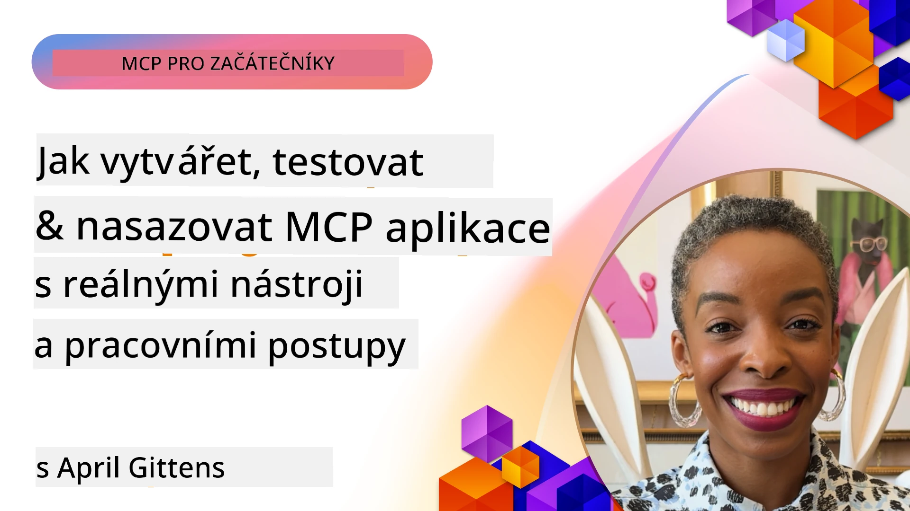
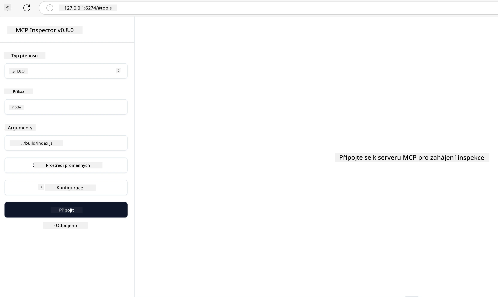

# Praktická implementace

[](https://youtu.be/vCN9-mKBDfQ)

_(Klikněte na obrázek výše pro zobrazení videa k této lekci)_

Praktická implementace je místo, kde se síla Model Context Protocol (MCP) stává hmatatelnou. Zatímco porozumění teorii a architektuře MCP je důležité, skutečná hodnota se ukazuje, když tyto koncepty použijete k vytváření, testování a nasazování řešení, která řeší reálné problémy. Tato kapitola překonává propast mezi teoretickými znalostmi a praktickým vývojem a provede vás procesem oživení aplikací založených na MCP.

Ať už vyvíjíte inteligentní asistenty, integrujete AI do obchodních pracovních postupů nebo budujete vlastní nástroje pro zpracování dat, MCP nabízí flexibilní základ. Jeho jazykově neutrální návrh a oficiální SDK pro populární programovací jazyky jej činí přístupným širokému spektru vývojářů. Využitím těchto SDK můžete rychle prototypovat, iterovat a škálovat svá řešení napříč různými platformami a prostředími.

V následujících sekcích naleznete praktické příklady, ukázkový kód a strategie nasazení, které demonstrují, jak implementovat MCP v C#, Javě se Springem, TypeScriptu, JavaScriptu a Pythonu. Také se naučíte, jak ladit a testovat své MCP servery, spravovat API a nasazovat řešení do cloudu pomocí Azure. Tyto praktické zdroje jsou navrženy tak, aby urychlily vaše učení a pomohly vám sebevědomě stavět robustní, produkčně připravené aplikace MCP.

## Přehled

Tato lekce se zaměřuje na praktické aspekty implementace MCP v různých programovacích jazycích. Prozkoumáme, jak používat MCP SDK v C#, Javě se Springem, TypeScriptu, JavaScriptu a Pythonu k vytváření robustních aplikací, ladění a testování MCP serverů a vytváření znovupoužitelných zdrojů, promptů a nástrojů.

## Cíle učení

Na konci této lekce budete schopni:

- Implementovat řešení MCP pomocí oficiálních SDK v různých programovacích jazycích
- Systematicky ladit a testovat MCP servery
- Vytvářet a používat funkce serveru (zdroje, prompty a nástroje)
- Navrhovat efektivní MCP pracovní postupy pro složité úkoly
- Optimalizovat implementace MCP pro výkon a spolehlivost

## Oficiální SDK zdroje

Model Context Protocol nabízí oficiální SDK pro více jazyků (v souladu s [MCP specifikací 2025-11-25](https://spec.modelcontextprotocol.io/specification/2025-11-25/)):

- [C# SDK](https://github.com/modelcontextprotocol/csharp-sdk)
- [Java se Spring SDK](https://github.com/modelcontextprotocol/java-sdk) **Poznámka:** vyžaduje závislost na [Project Reactor](https://projectreactor.io). (Viz [diskusní téma 246](https://github.com/orgs/modelcontextprotocol/discussions/246).)
- [TypeScript SDK](https://github.com/modelcontextprotocol/typescript-sdk)
- [Python SDK](https://github.com/modelcontextprotocol/python-sdk)
- [Kotlin SDK](https://github.com/modelcontextprotocol/kotlin-sdk)
- [Go SDK](https://github.com/modelcontextprotocol/go-sdk)

## Práce s MCP SDK

Tato sekce poskytuje praktické příklady implementace MCP ve více programovacích jazycích. Ukázkový kód najdete ve složce `samples` uspořádaný podle jazyka.

### Dostupné ukázky

Repozitář obsahuje [ukázkové implementace](../../../04-PracticalImplementation/samples) v následujících jazycích:

- [C#](./samples/csharp/README.md)
- [Java se Springem](./samples/java/containerapp/README.md)
- [TypeScript](./samples/typescript/README.md)
- [JavaScript](./samples/javascript/README.md)
- [Python](./samples/python/README.md)

Každá ukázka demonstruje klíčové koncepty MCP a vzory implementace pro daný jazyk a ekosystém.

### Praktické návody

Další návody na praktickou implementaci MCP:

- [Stránkování a velké množiny výsledků](./pagination/README.md) - Zpracování stránkování založeného na kurzoru pro nástroje, zdroje a velké datové sady

## Hlavní funkce serveru

MCP servery mohou implementovat libovolnou kombinaci těchto funkcí:

### Zdroje

Zdroje poskytují kontext a data pro uživatele nebo AI model:

- Repozitáře dokumentů
- Znalostní báze
- Strukturované datové zdroje
- Soubory a souborové systémy

### Prompty

Prompty jsou šablonované zprávy a pracovní postupy pro uživatele:

- Předdefinované šablony konverzace
- Vedené interakční vzory
- Specializované dialogové struktury

### Nástroje

Nástroje jsou funkce, které AI model může vykonávat:

- Nástroje pro zpracování dat
- Integrace s externími API
- Výpočetní schopnosti
- Vyhledávací funkčnost

## Ukázkové implementace: implementace v C#

Oficiální repozitář C# SDK obsahuje několik ukázkových implementací, které demonstrují různé aspekty MCP:

- **Základní MCP klient**: Jednoduchý příklad ukazující, jak vytvořit MCP klienta a volat nástroje
- **Základní MCP server**: Minimální implementace serveru se základní registrací nástroje
- **Pokročilý MCP server**: Plnohodnotný server s registrací nástrojů, autentizací a zpracováním chyb
- **Integrace ASP.NET**: Příklady demonstrující integraci s ASP.NET Core
- **Vzory implementace nástrojů**: Různé vzory pro implementaci nástrojů s různou složitostí

MCP C# SDK je ve fázi preview a API se mohou měnit. Tento blog budeme průběžně aktualizovat, jak SDK bude vyvíjeno.

### Klíčové vlastnosti

- [C# MCP balíček ModelContextProtocol na Nugetu](https://www.nuget.org/packages/ModelContextProtocol)
- Vytvoření [prvního MCP serveru](https://devblogs.microsoft.com/dotnet/build-a-model-context-protocol-mcp-server-in-csharp/).

Pro kompletní vzory implementací v C# navštivte [oficiální repozitář C# SDK samples](https://github.com/modelcontextprotocol/csharp-sdk)

## Ukázková implementace: implementace v Javě se Springem

Java se Springem SDK nabízí robustní možnosti implementace MCP s funkcemi na úrovni podnikových řešení.

### Klíčové vlastnosti

- Integrace do Spring Frameworku
- Silná typová bezpečnost
- Podpora reaktivního programování
- Komplexní zpracování chyb

Pro kompletní ukázkovou implementaci v Javě se Springem viz [Java se Springem příklad](samples/java/containerapp/README.md) v adresáři samples.

## Ukázková implementace: implementace v JavaScriptu

JavaScript SDK nabízí lehký a flexibilní přístup k implementaci MCP.

### Klíčové vlastnosti

- Podpora Node.js a prohlížečů
- API založené na Promise
- Jednoduchá integrace s Express a dalšími frameworky
- Podpora WebSocket pro streamování

Pro kompletní implementaci v JavaScriptu viz [JavaScript příklad](samples/javascript/README.md) v adresáři samples.

## Ukázková implementace: implementace v Pythonu

Python SDK nabízí pythonický přístup k implementaci MCP s vynikající integrací ML frameworků.

### Klíčové vlastnosti

- Podpora async/await pomocí asyncio
- Integrace FastAPI
- Jednoduchá registrace nástrojů
- Nativní integrace s populárními ML knihovnami

Pro kompletní implementaci v Pythonu viz [Python příklad](samples/python/README.md) v adresáři samples.

## Správa API

Azure API Management je skvělou odpovědí na to, jak zabezpečit MCP servery. Myšlenka je umístit instanci Azure API Management před váš MCP server a nechat ji zpracovávat funkce, které pravděpodobně budete chtít, například:

- omezení rychlosti požadavků
- správu tokenů
- monitorování
- vyvažování zátěže
- zabezpečení

### Azure ukázka

Zde je Azure ukázka, která toto přesně dělá, tj. [vytváří MCP server a zabezpečuje jej pomocí Azure API Management](https://github.com/Azure-Samples/remote-mcp-apim-functions-python).

Podívejte se, jak probíhá autorizační tok na obrázku níže:


Na uvedeném obrázku probíhá:

- Autentizace/Autorizace pomocí Microsoft Entra.
- Azure API Management funguje jako brána a pomocí pravidel řídí a spravuje provoz.
- Azure Monitor zaznamenává všechny požadavky pro další analýzu.

#### Autorizační tok

Pojďme se podívat na autorizační tok podrobněji:


#### MCP autorizační specifikace

Více informací o [MCP autorizační specifikaci](https://spec.modelcontextprotocol.io/specification/2025-11-25/basic/authorization/)

## Nasazení vzdáleného MCP serveru do Azure

Pojďme zjistit, zda můžeme nasadit ukázku, kterou jsme zmínili:

1. Naklonujte repozitář

    ```bash
    git clone https://github.com/Azure-Samples/remote-mcp-apim-functions-python.git
    cd remote-mcp-apim-functions-python
    ```

1. Zaregistrujte poskytovatele zdrojů `Microsoft.App`.

   - Pokud používáte Azure CLI, spusťte `az provider register --namespace Microsoft.App --wait`.
   - Pokud používáte Azure PowerShell, spusťte `Register-AzResourceProvider -ProviderNamespace Microsoft.App`. Poté spusťte `(Get-AzResourceProvider -ProviderNamespace Microsoft.App).RegistrationState` po krátké chvíli, abyste zkontrolovali, zda je registrace dokončena.

1. Spusťte tento příkaz [azd](https://aka.ms/azd), který vytvoří službu správy API, funkční aplikaci (s kódem) a všechny ostatní potřebné zdroje Azure

    ```shell
    azd up
    ```

    Tento příkaz by měl nasadit všechny cloudové zdroje na Azure

### Testování vašeho serveru pomocí MCP Inspector

1. V **novém okně terminálu** nainstalujte a spusťte MCP Inspector

    ```shell
    npx @modelcontextprotocol/inspector
    ```

    Měli byste vidět rozhraní podobné:

    

1. CTRL kliknutím načtěte webovou aplikaci MCP Inspector z URL zobrazené aplikací (např. [http://127.0.0.1:6274/#resources](http://127.0.0.1:6274/#resources))
1. Nastavte typ přenosu na `SSE`
1. Nastavte URL na běžící API Management SSE endpoint zobrazený po `azd up` a **Připojte se**:

    ```shell
    https://<apim-servicename-from-azd-output>.azure-api.net/mcp/sse
    ```

1. **Seznam nástrojů**. Klikněte na nástroj a **Spusťte nástroj**.

Pokud všechny kroky proběhly úspěšně, měli byste být nyní připojeni k MCP serveru a měli jste možnost nástroj zavolat.

## MCP servery pro Azure

[Remote-mcp-functions](https://github.com/Azure-Samples/remote-mcp-functions-dotnet): Tato sada repozitářů je šablonou quickstart pro vytváření a nasazování vlastních vzdálených MCP (Model Context Protocol) serverů pomocí Azure Functions v Pythonu, C# .NET nebo Node/TypeScript.

Ukázky poskytují kompletní řešení, které vývojářům umožňuje:

- Lokální vývoj a spuštění: Vyvíjet a ladit MCP server na lokálním počítači
- Nasazení do Azure: Snadné nasazení do cloudu jednoduchým příkazem azd up
- Připojení z klientů: Připojit se k MCP serveru z různých klientů včetně režimu agenta Copilot ve VS Code a nástroje MCP Inspector

### Klíčové vlastnosti

- Bezpečnost návrhu: MCP server je zabezpečený pomocí klíčů a HTTPS
- Možnosti autentizace: Podpora OAuth s vestavěnou autentizací a/nebo API Managementem
- Izolace sítě: Umožňuje izolaci sítě pomocí Azure Virtual Networks (VNET)
- Serverless architektura: Využívá Azure Functions pro škálovatelné, na událostech založené vykonávání
- Lokální vývoj: Komplexní podpora lokálního vývoje a ladění
- Jednoduché nasazení: Zjednodušený proces nasazení do Azure

Repozitář obsahuje všechny nezbytné konfigurační soubory, zdrojový kód a definice infrastruktury, které rychle umožňují začít s produkční implementací MCP serveru.

- [Azure Remote MCP Functions Python](https://github.com/Azure-Samples/remote-mcp-functions-python) - Ukázková implementace MCP pomocí Azure Functions v Pythonu

- [Azure Remote MCP Functions .NET](https://github.com/Azure-Samples/remote-mcp-functions-dotnet) - Ukázková implementace MCP pomocí Azure Functions v C# .NET

- [Azure Remote MCP Functions Node/Typescript](https://github.com/Azure-Samples/remote-mcp-functions-typescript) - Ukázková implementace MCP pomocí Azure Functions v Node/TypeScript.

## Klíčové poznatky

- MCP SDK poskytují nástroje specifické pro jazyk k implementaci robustních MCP řešení
- Proces ladění a testování je klíčový pro spolehlivé MCP aplikace
- Znovupoužitelné šablony promptů umožňují konzistentní interakce s AI
- Dobře navržené pracovní postupy mohou orchestraci složité úkoly s více nástroji
- Implementace řešení MCP vyžaduje zvážení problémů bezpečnosti, výkonu a zpracování chyb

## Cvičení

Navrhněte praktický MCP pracovní postup, který řeší reálný problém ve vašem oboru:

1. Identifikujte 3-4 nástroje, které by byly užitečné k řešení tohoto problému
2. Vytvořte diagram pracovního postupu, který ukazuje, jak tyto nástroje spolupracují
3. Implementujte základní verzi jednoho z nástrojů ve vámi preferovaném jazyce
4. Vytvořte šablonu promptu, která pomůže modelu efektivně používat váš nástroj

## Další zdroje

---

## Co dál

Další: [Pokročilá témata](../05-AdvancedTopics/README.md)

---

<!-- CO-OP TRANSLATOR DISCLAIMER START -->
**Prohlášení o vyloučení odpovědnosti**:
Tento dokument byl přeložen pomocí AI překladatelské služby [Co-op Translator](https://github.com/Azure/co-op-translator). Přestože usilujeme o přesnost, mějte prosím na paměti, že automatické překlady mohou obsahovat chyby nebo nepřesnosti. Původní dokument v jeho rodném jazyce by měl být považován za autoritativní zdroj. Pro kritické informace se doporučuje profesionální lidský překlad. Nejsme odpovědní za žádné nedorozumění nebo nesprávné výklady vyplývající z použití tohoto překladu.
<!-- CO-OP TRANSLATOR DISCLAIMER END -->