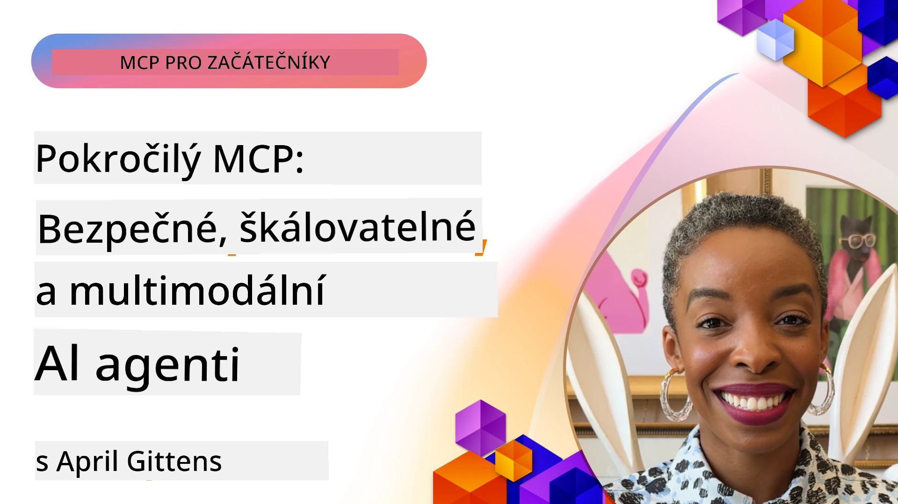

# Pokročilá témata v MCP

_(Klikněte na obrázek výše pro zobrazení videa této lekce)_

Tato kapitola pokrývá řadu pokročilých témat v implementaci Model Context Protocol (MCP), včetně multimodální integrace, škálovatelnosti, bezpečnostních osvědčených postupů a podnikové integrace. Témata jsou klíčová pro vytváření odolných a produkčně připravených aplikací MCP, které zvládnou nároky moderních AI systémů.

## Přehled

Tato lekce zkoumá pokročilé koncepty implementace Model Context Protocol, se zaměřením na multimodální integraci, škálovatelnost, bezpečnostní osvědčené postupy a podnikovou integraci. Témata jsou nezbytná pro vytváření produkčně orientovaných aplikací MCP, které zvládnou složité požadavky v podnikových prostředích.

## Výukové cíle

Na konci této lekce budete schopni:

- Implementovat multimodální schopnosti v rámci MCP
- Navrhnout škálovatelné MCP architektury pro scénáře s vysokou zátěží
- Použít bezpečnostní osvědčené postupy v souladu s bezpečnostními principy MCP
- Integrovat MCP s podnikových AI systémy a rámci
- Optimalizovat výkon a spolehlivost v produkčním prostředí

## Lekce a ukázkové projekty

| Odkaz | Název | Popis |
|------|-------|-------------|
| [5.1 Integrace s Azure](./mcp-integration/README.md) | Integrace s Azure | Naučte se, jak integrovat svůj MCP server na Azure |
| [5.2 Multimodální ukázka](./mcp-multi-modality/README.md) | MCP multimodální ukázky | Ukázky pro audio, obrázky a multimodální odpovědi |
| [5.3 MCP OAuth2 ukázka](../../../05-AdvancedTopics/mcp-oauth2-demo) | MCP OAuth2 Demo | Minimální aplikace Spring Boot ukazující OAuth2 s MCP, jako autorizační a zdrojový server. Demonstruje bezpečné vydávání tokenů, chráněné koncové body, nasazení do Azure Container Apps a integraci s API Management. |
| [5.4 Root Contexty](./mcp-root-contexts/README.md) | Root contexty | Naučte se více o root contextu a jeho implementaci |
| [5.5 Směrování](./mcp-routing/README.md) | Směrování | Naučte se různé typy směrování |
| [5.6 Sampling](./mcp-sampling/README.md) | Sampling | Naučte se pracovat se samplingem |
| [5.7 Škálování](./mcp-scaling/README.md) | Škálování | Naučte se o škálování |
| [5.8 Bezpečnost](./mcp-security/README.md) | Bezpečnost | Zajistěte svůj MCP server |
| [5.9 Webové hledání MCP](./web-search-mcp/README.md) | Webové hledání MCP | Python MCP server a klient integrující SerpAPI pro vyhledávání na webu, novinky, produkty a otázky a odpovědi v reálném čase. Demonstruje orchestrace více nástrojů, integraci externích API a robustní zpracování chyb. |
| [5.10 Reálný čas streamování](./mcp-realtimestreaming/README.md) | Streamování | Reálné časové streamování dat se stalo nezbytností v dnešním světě řízeném daty, kde podniky a aplikace potřebují okamžitý přístup k informacím pro včasná rozhodnutí. |
| [5.11 Reálné časové webové hledání](./mcp-realtimesearch/README.md) | Webové hledání | Jak MCP transformuje reálné časové webové vyhledávání poskytováním standardizovaného přístupu k řízení kontextu napříč AI modely, vyhledávači a aplikacemi. | 
| [5.12 Autentizace Entra ID pro MCP servery](./mcp-security-entra/README.md) | Autentizace Entra ID | Microsoft Entra ID nabízí robustní cloudové řešení řízení identity a přístupu, které pomáhá zajistit, že pouze autorizovaní uživatelé a aplikace mohou komunikovat s vaším MCP serverem. |
| [5.13 Integrace Azure AI Foundry Agent](./mcp-foundry-agent-integration/README.md) | Azure AI Foundry integrace | Naučte se integrovat Model Context Protocol servery s Azure AI Foundry agenty, což umožňuje výkonnou orchestraci nástrojů a podnikové AI schopnosti se standardizovanými připojeními k externím zdrojům dat. |
| [5.14 Context Engineering](./mcp-contextengineering/README.md) | Context Engineering | Budoucí příležitosti technik context engineering pro MCP servery, včetně optimalizace kontextu, dynamického řízení kontextu a strategií pro efektivní návrh promptů v rámci MCP. |
| [5.15 Vlastní transport MCP](./mcp-transport/README.md) | Vlastní transport | Naučte se implementovat vlastní transportní mechanismy pro specializované scénáře komunikace MCP. |
| [5.16 Hluboký ponor do funkcí protokolu](./mcp-protocol-features/README.md) | Funkce protokolu | Ovládněte pokročilé funkce protokolu včetně oznámení o průběhu, rušení požadavků, šablon zdrojů a vzorců zpracování chyb. |

> **Novinky ve specifikaci MCP 2025-11-25**: Specifikace nyní zahrnuje experimentální podporu pro **Úkoly** (dlouhodobé operace s průběžným sledováním), **Anotace nástrojů** (metadata o chování nástrojů pro bezpečnost), **URL Mode Elicitation** (žádost o konkrétní obsah URL od klientů) a rozšířené **Rooty** (pro řízení kontextu pracovního prostoru). Pro úplné detaily viz [změnový protokol specifikace MCP](https://spec.modelcontextprotocol.io/).

## Další odkazy

Pro aktuální informace o pokročilých tématech MCP navštivte:
- [Dokumentace MCP](https://modelcontextprotocol.io/)
- [Specifikace MCP (2025-11-25)](https://spec.modelcontextprotocol.io/specification/2025-11-25/)
- [GitHub repozitář](https://github.com/modelcontextprotocol)
- [OWASP MCP Top 10](https://microsoft.github.io/mcp-azure-security-guide/mcp/) - Bezpečnostní rizika a opatření
- [MCP Security Summit Workshop (Sherpa)](https://azure-samples.github.io/sherpa/) - Praktický bezpečnostní trénink

## Klíčové závěry

- Multimodální implementace MCP rozšiřují AI schopnosti nad rámec zpracování textu
- Škálovatelnost je nezbytná pro podnikovou nasazení a řeší se horizontálním i vertikálním škálováním
- Komplexní bezpečnostní opatření chrání data a zajišťují správnou kontrolu přístupu
- Podniková integrace s platformami jako Azure OpenAI a Microsoft AI Foundry rozšiřuje schopnosti MCP
- Pokročilé implementace MCP profitují z optimalizovaných architektur a pečlivého řízení zdrojů

## Cvičení

Navrhněte podnikové implementaci MCP pro konkrétní případ užití:

1. Určete multimodální požadavky pro svůj případ užití
2. Naznačte bezpečnostní opatření potřebná k ochraně citlivých dat
3. Navrhněte škálovatelnou architekturu schopnou zvládnout různé zatížení
4. Naplánujte integrační body s podnikovými AI systémy
5. Zdokumentujte potenciální výkonnostní úzká místa a strategie jejich zmírnění

## Další zdroje

- [Dokumentace Azure OpenAI](https://learn.microsoft.com/en-us/azure/ai-services/openai/)
- [Dokumentace Microsoft AI Foundry](https://learn.microsoft.com/en-us/ai-services/)

---

## Co dál

Prozkoumejte lekce v tomto modulu začínajíc [5.1 MCP Integrace](./mcp-integration/README.md)

Po dokončení tohoto modulu pokračujte do: [Modul 6: Community Contributions](../06-CommunityContributions/README.md)

---

<!-- CO-OP TRANSLATOR DISCLAIMER START -->
**Vyloučení odpovědnosti**:  
Tento dokument byl přeložen pomocí AI překladatelské služby [Co-op Translator](https://github.com/Azure/co-op-translator). Přestože usilujeme o přesnost, mějte prosím na paměti, že automatizované překlady mohou obsahovat chyby nebo nepřesnosti. Originální dokument v jeho původním jazyce by měl být považován za autoritativní zdroj. Pro důležité informace doporučujeme profesionální lidský překlad. Nejsme odpovědní za jakékoliv nedorozumění nebo nesprávné výklady vyplývající z použití tohoto překladu.
<!-- CO-OP TRANSLATOR DISCLAIMER END -->