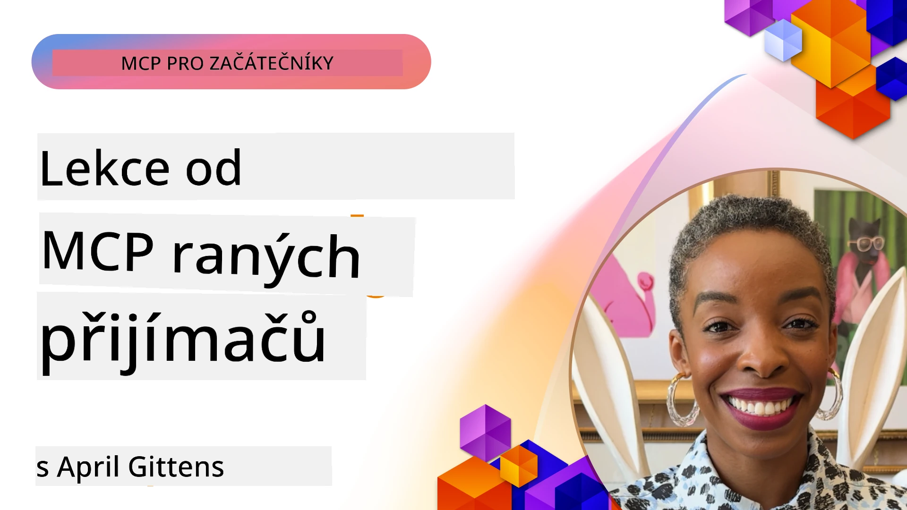

# 🌟 Lekce od raných uživatelů

[](https://youtu.be/jds7dSmNptE)

_(Klikněte na obrázek výše pro zobrazení videa této lekce)_

## 🎯 Co tento modul pokrývá

Tento modul zkoumá, jak skutečné organizace a vývojáři využívají Model Context Protocol (MCP) k řešení reálných problémů a podpoře inovací. Prostřednictvím podrobných případových studií, praktických projektů a užitečných příkladů objevíte, jak MCP umožňuje bezpečnou, škálovatelnou integraci AI, která propojuje jazykové modely, nástroje a podniková data.

### 📚 Podívejte se na MCP v akci

Chcete vidět tyto principy aplikované na nástroje připravené do produkce? Podívejte se na náš [**10 Microsoft MCP serverů, které mění produktivitu vývojářů**](microsoft-mcp-servers.md), jež představují skutečné Microsoft MCP servery, které můžete použít již dnes.

## Přehled

Tato lekce zkoumá, jak raní uživatelé využili Model Context Protocol (MCP) k řešení reálných výzev a podpoře inovací napříč odvětvími. Prostřednictvím podrobných případových studií a praktických projektů uvidíte, jak MCP umožňuje standardizovanou, bezpečnou a škálovatelnou integraci AI — propojující velké jazykové modely, nástroje a podniková data v jednotném rámci. Získáte praktické zkušenosti s navrhováním a budováním řešení založených na MCP, naučíte se osvědčené implementační vzory a objevíte nejlepší postupy nasazení MCP v produkčním prostředí. Lekce také zdůrazňuje nové trendy, budoucí směry a open-source zdroje, které vám pomohou zůstat v čele technologie MCP a jejího se vyvíjejícího ekosystému.

## Výukové cíle

- Analyzovat skutečné implementace MCP napříč různými odvětvími
- Navrhovat a budovat kompletní aplikace založené na MCP
- Prozkoumat nové trendy a budoucí směry technologie MCP
- Uplatnit osvědčené postupy v reálných vývojových scénářích

## Reálné implementace MCP

### Případová studie 1: Automatizace zákaznické podpory ve firmách

Nadnárodní korporace implementovala řešení založené na MCP ke standardizaci interakcí AI napříč jejich systémy zákaznické podpory. To jim umožnilo:

- Vytvořit jednotné rozhraní pro několik poskytovatelů LLM
- Zachovat konzistentní správu promptů napříč odděleními
- Implementovat robustní bezpečnostní a compliance kontroly
- Snadno přepínat mezi různými AI modely podle konkrétních potřeb

**Technická implementace:**

```python
# Implementace Python MCP serveru pro zákaznickou podporu
import logging
import asyncio
from modelcontextprotocol import create_server, ServerConfig
from modelcontextprotocol.server import MCPServer
from modelcontextprotocol.transports import create_http_transport
from modelcontextprotocol.resources import ResourceDefinition
from modelcontextprotocol.prompts import PromptDefinition
from modelcontextprotocol.tool import ToolDefinition

# Konfigurace protokolování
logging.basicConfig(level=logging.INFO)

async def main():
    # Vytvoření konfigurace serveru
    config = ServerConfig(
        name="Enterprise Customer Support Server",
        version="1.0.0",
        description="MCP server for handling customer support inquiries"
    )
    
    # Inicializace MCP serveru
    server = create_server(config)
    
    # Registrace zdrojů znalostní databáze
    server.resources.register(
        ResourceDefinition(
            name="customer_kb",
            description="Customer knowledge base documentation"
        ),
        lambda params: get_customer_documentation(params)
    )
    
    # Registrace šablon promptů
    server.prompts.register(
        PromptDefinition(
            name="support_template",
            description="Templates for customer support responses"
        ),
        lambda params: get_support_templates(params)
    )
    
    # Registrace podpůrných nástrojů
    server.tools.register(
        ToolDefinition(
            name="ticketing",
            description="Create and update support tickets"
        ),
        handle_ticketing_operations
    )
    
    # Spuštění serveru s HTTP přenosem
    transport = create_http_transport(port=8080)
    await server.run(transport)

if __name__ == "__main__":
    asyncio.run(main())
```
  
**Výsledky:** 30% snížení nákladů na modely, 45% zlepšení konzistence odpovědí a zvýšená compliance v globálních operacích.

### Případová studie 2: Asistent pro diagnostiku ve zdravotnictví

Poskytovatel zdravotní péče vytvořil infrastrukturu MCP pro integraci více specializovaných lékařských AI modelů a zároveň zajistil ochranu citlivých dat pacientů:

- Plynulé přepínání mezi obecnými a specializovanými lékařskými modely
- Přísné kontroly soukromí a auditní stopy
- Integrace se stávajícími systémy elektronických zdravotních záznamů (EHR)
- Konzistentní návrh promptů pro lékařskou terminologii

**Technická implementace:**

```csharp
// C# MCP host application implementation in healthcare application
using Microsoft.Extensions.DependencyInjection;
using ModelContextProtocol.SDK.Client;
using ModelContextProtocol.SDK.Security;
using ModelContextProtocol.SDK.Resources;

public class DiagnosticAssistant
{
    private readonly MCPHostClient _mcpClient;
    private readonly PatientContext _patientContext;
    
    public DiagnosticAssistant(PatientContext patientContext)
    {
        _patientContext = patientContext;
        
        // Configure MCP client with healthcare-specific settings
        var clientOptions = new ClientOptions
        {
            Name = "Healthcare Diagnostic Assistant",
            Version = "1.0.0",
            Security = new SecurityOptions
            {
                Encryption = EncryptionLevel.Medical,
                AuditEnabled = true
            }
        };
        
        _mcpClient = new MCPHostClientBuilder()
            .WithOptions(clientOptions)
            .WithTransport(new HttpTransport("https://healthcare-mcp.example.org"))
            .WithAuthentication(new HIPAACompliantAuthProvider())
            .Build();
    }
    
    public async Task<DiagnosticSuggestion> GetDiagnosticAssistance(
        string symptoms, string patientHistory)
    {
        // Create request with appropriate resources and tool access
        var resourceRequest = new ResourceRequest
        {
            Name = "patient_records",
            Parameters = new Dictionary<string, object>
            {
                ["patientId"] = _patientContext.PatientId,
                ["requestingProvider"] = _patientContext.ProviderId
            }
        };
        
        // Request diagnostic assistance using appropriate prompt
        var response = await _mcpClient.SendPromptRequestAsync(
            promptName: "diagnostic_assistance",
            parameters: new Dictionary<string, object>
            {
                ["symptoms"] = symptoms,
                patientHistory = patientHistory,
                relevantGuidelines = _patientContext.GetRelevantGuidelines()
            });
            
        return DiagnosticSuggestion.FromMCPResponse(response);
    }
}
```
  
**Výsledky:** Lepší diagnostické návrhy pro lékaře při plném dodržení HIPAA a výrazné snížení přepínání kontextu mezi systémy.

### Případová studie 3: Analýza rizik ve finančních službách

Finanční instituce implementovala MCP ke standardizaci procesů analýzy rizik v různých odděleních:

- Vytvořila jednotné rozhraní pro modely kreditního rizika, detekce podvodů a investičního rizika
- Implementovala přísné přístupové kontroly a verzování modelů
- Zajistila auditovatelnost všech AI doporučení
- Zachovala konzistentní formátování dat napříč různorodými systémy

**Technická implementace:**

```java
// Java MCP server pro hodnocení finančního rizika
import org.mcp.server.*;
import org.mcp.security.*;

public class FinancialRiskMCPServer {
    public static void main(String[] args) {
        // Vytvořit MCP server s funkcemi finanční shody
        MCPServer server = new MCPServerBuilder()
            .withModelProviders(
                new ModelProvider("risk-assessment-primary", new AzureOpenAIProvider()),
                new ModelProvider("risk-assessment-audit", new LocalLlamaProvider())
            )
            .withPromptTemplateDirectory("./compliance/templates")
            .withAccessControls(new SOCCompliantAccessControl())
            .withDataEncryption(EncryptionStandard.FINANCIAL_GRADE)
            .withVersionControl(true)
            .withAuditLogging(new DatabaseAuditLogger())
            .build();
            
        server.addRequestValidator(new FinancialDataValidator());
        server.addResponseFilter(new PII_RedactionFilter());
        
        server.start(9000);
        
        System.out.println("Financial Risk MCP Server running on port 9000");
    }
}
```
  
**Výsledky:** Zvýšená shoda s regulatorními požadavky, 40% rychlejší nasazování modelů a zlepšená konzistence hodnocení rizik napříč odděleními.

### Případová studie 4: Microsoft Playwright MCP Server pro automatizaci prohlížeče

Microsoft vyvinul [Playwright MCP server](https://github.com/microsoft/playwright-mcp) pro bezpečnou, standardizovanou automatizaci prohlížeče přes Model Context Protocol. Tento produkčně připravený server umožňuje AI agentům a LLM interakci s webovými prohlížeči kontrolovaným, auditovatelným a rozšiřitelným způsobem — umožňuje použití v automatizovaném webovém testování, extrakci dat a kompletních pracovních postupech.

> **🎯 Nástroj připravený do produkce**
> 
> Tato případová studie představuje skutečný MCP server, který můžete dnes používat! Více se dozvíte o Playwright MCP Serveru a dalších 9 produkčních Microsoft MCP serverech v našem [**Microsoft MCP Servers Guide**](microsoft-mcp-servers.md#8--playwright-mcp-server).

**Hlavní funkce:**
- Zpřístupňuje schopnosti automatizace prohlížeče (navigace, vyplňování formulářů, zachycení screenshotů atd.) jako MCP nástroje
- Implementuje přísné přístupové kontroly a sandboxing pro prevenci neoprávněných akcí
- Poskytuje podrobné auditní záznamy všech interakcí s prohlížečem
- Podporuje integraci s Azure OpenAI a dalšími poskytovateli LLM pro agentem řízenou automatizaci
- Napájí schopnosti webového prohlížení agenta Coding Agent v GitHub Copilot

**Technická implementace:**

```typescript
// TypeScript: Registrace nástrojů pro automatizaci prohlížeče Playwright v MCP serveru
import { createServer, ToolDefinition } from 'modelcontextprotocol';
import { launch } from 'playwright';

const server = createServer({
  name: 'Playwright MCP Server',
  version: '1.0.0',
  description: 'MCP server for browser automation using Playwright'
});

// Zaregistrujte nástroj pro navigaci na URL a zachycení screenshotu
server.tools.register(
  new ToolDefinition({
    name: 'navigate_and_screenshot',
    description: 'Navigate to a URL and capture a screenshot',
    parameters: {
      url: { type: 'string', description: 'The URL to visit' }
    }
  }),
  async ({ url }) => {
    const browser = await launch();
    const page = await browser.newPage();
    await page.goto(url);
    const screenshot = await page.screenshot();
    await browser.close();
    return { screenshot };
  }
);

// Spusťte MCP server
server.listen(8080);
```
  
**Výsledky:**

- Umožnil bezpečnou programovatelnou automatizaci prohlížeče pro AI agenty a LLM
- Snížil manuální úsilí při testování a zlepšil pokrytí testů webových aplikací
- Poskytl opakovaně použitelný, rozšiřitelný rámec pro integraci nástrojů založených na prohlížeči v podnikových prostředích
- Napájí schopnosti webového prohlížení GitHub Copilota

**Reference:**

- [Playwright MCP Server GitHub Repository](https://github.com/microsoft/playwright-mcp)
- [Microsoft AI and Automation Solutions](https://azure.microsoft.com/en-us/products/ai-services/)

### Případová studie 5: Azure MCP – podnikové Model Context Protocol jako služba

Azure MCP Server ([https://aka.ms/azmcp](https://aka.ms/azmcp)) je spravovaná, podniková implementace Model Context Protocol od Microsoftu, navržená tak, aby poskytovala škálovatelné, bezpečné a compliant MCP serverové schopnosti jako cloudovou službu. Azure MCP umožňuje organizacím rychle nasadit, spravovat a integrovat MCP servery s Azure AI, datovými a bezpečnostními službami, čímž snižuje provozní režii a urychluje adopci AI.

> **🎯 Nástroj připravený do produkce**
> 
> Toto je skutečný MCP server, který můžete dnes použít! Více se dozvíte o Azure AI Foundry MCP Serveru v našem [**Microsoft MCP Servers Guide**](microsoft-mcp-servers.md).

- Plně spravované hostování MCP serveru s vestavěným škálováním, monitorováním a bezpečností  
- Nativní integrace s Azure OpenAI, Azure AI Search a dalšími Azure službami  
- Podniková autentizace a autorizace přes Microsoft Entra ID  
- Podpora vlastních nástrojů, šablon promptů a konektorů zdrojů  
- Dodržování podnikových bezpečnostních a regulatorních požadavků

**Technická implementace:**

```yaml
# Example: Azure MCP server deployment configuration (YAML)
apiVersion: mcp.microsoft.com/v1
kind: McpServer
metadata:
  name: enterprise-mcp-server
spec:
  modelProviders:
    - name: azure-openai
      type: AzureOpenAI
      endpoint: https://<your-openai-resource>.openai.azure.com/
      apiKeySecret: <your-azure-keyvault-secret>
  tools:
    - name: document_search
      type: AzureAISearch
      endpoint: https://<your-search-resource>.search.windows.net/
      apiKeySecret: <your-azure-keyvault-secret>
  authentication:
    type: EntraID
    tenantId: <your-tenant-id>
  monitoring:
    enabled: true
    logAnalyticsWorkspace: <your-log-analytics-id>
```
  
**Výsledky:**  
- Zkrácení času potřebného k využití AI projektů díky připravené, compliant MCP serverové platformě  
- Zjednodušení integrace LLM, nástrojů a podnikových datových zdrojů  
- Zvýšení bezpečnosti, pozorovatelnosti a provozní efektivity MCP pracovních zátěží  
- Zlepšení kvality kódu pomocí osvědčených praktik Azure SDK a aktuálních autentizačních vzorů

**Reference:**  
- [Azure MCP Documentation](https://aka.ms/azmcp)  
- [Azure MCP Server GitHub Repository](https://github.com/Azure/azure-mcp)  
- [Azure AI Services](https://azure.microsoft.com/en-us/products/ai-services/)  
- [Microsoft MCP Center](https://mcp.azure.com)

## Případová studie 6: NLWeb  
MCP (Model Context Protocol) je vznikající protokol pro chatboty a AI asistenty, které komunikují s nástroji. Každá instance NLWeb je také MCP server, který podporuje jednu hlavní metodu, ask, kterou je možné položit stránce webovou otázku v přirozeném jazyce. Vrácená odpověď využívá schema.org, široce používanou slovní zásobu pro popis webových dat. Volně řečeno je MCP k NLWeb jako HTTP k HTML. NLWeb kombinuje protokoly, formáty Schema.org a ukázkový kód, aby weby mohly rychle vytvářet tyto koncové body, což prospěje jak lidem prostřednictvím konverzačních rozhraní, tak strojům přirozenou interakcí agent-agent.

NLWeb má dvě samostatné složky.
- Protokol, velmi jednoduchý na začátek, pro rozhraní s webem v přirozeném jazyce a formát, využívající json a schema.org pro vrácenou odpověď. Podrobnosti naleznete v dokumentaci REST API.  
- Jednoduchá implementace (1), která využívá existující značkování pro weby, které lze abstrahovat jako seznamy položek (produkty, recepty, atrakce, recenze atd.). V kombinaci se sadou uživatelských rozhraní mohou weby snadno poskytnout konverzační rozhraní ke svému obsahu. Podrobnosti viz dokumentace Life of a chat query.

**Reference:**  
- [Azure MCP Documentation](https://aka.ms/azmcp)  
- [NLWeb](https://github.com/microsoft/NlWeb)

### Případová studie 7: Azure AI Foundry MCP Server – integrace podnikových AI agentů

Azure AI Foundry MCP servery ukazují, jak lze MCP použít k orchestraci a správě AI agentů a pracovních toků v podnikových prostředích. Integrací MCP s Azure AI Foundry mohou organizace standardizovat interakce agentů, využít správu pracovních toků Foundry a zajistit bezpečné, škálovatelné nasazení.

> **🎯 Nástroj připravený do produkce**
> 
> Toto je skutečný MCP server, který můžete dnes používat! Více o Azure AI Foundry MCP Serveru najdete v našem [**Microsoft MCP Servers Guide**](microsoft-mcp-servers.md#9--azure-ai-foundry-mcp-server).

**Hlavní funkce:**
- Komplexní přístup k Azure AI ekosystému včetně katalogů modelů a správy nasazení  
- Indexování znalostí s Azure AI Search pro aplikace RAG  
- Nástroje pro hodnocení výkonu AI modelů a zajištění kvality  
- Integrace s Azure AI Foundry Catalog a Labs pro špičkové výzkumné modely  
- Správa a hodnocení agentů pro produkční scénáře

**Výsledky:**
- Rychlé prototypování a robustní monitoring pracovních toků AI agentů  
- Plynulá integrace s Azure AI službami pro pokročilé scénáře  
- Jednotné rozhraní pro tvorbu, nasazení a monitorování agentních pipeline  
- Vylepšená bezpečnost, compliance a provozní efektivita pro podniky  
- Urchlení adopce AI při zachování kontroly nad komplexními agentem řízenými procesy

**Reference:**
- [Azure AI Foundry MCP Server GitHub Repository](https://github.com/azure-ai-foundry/mcp-foundry)  
- [Integrace Azure AI agentů s MCP (Microsoft Foundry Blog)](https://devblogs.microsoft.com/foundry/integrating-azure-ai-agents-mcp/)

### Případová studie 8: Foundry MCP Playground – experimentování a prototypování

Foundry MCP Playground nabízí připravené prostředí pro experimenty s MCP servery a integracemi Azure AI Foundry. Vývojáři mohou rychle prototypovat, testovat a vyhodnocovat AI modely a pracovní toky agentů využívající zdroje z Azure AI Foundry Catalog a Labs. Playground usnadňuje nastavení, poskytuje ukázkové projekty a podporuje spolupráci na vývoji, což usnadňuje průzkum nejlepších postupů a nových scénářů s minimální režii. Je zvláště užitečný pro týmy, které chtějí ověřit nápady, sdílet experimenty a urychlit učení bez potřeby složité infrastruktury. Snížením vstupní bariéry podporuje inovace a komunitní příspěvky v ekosystému MCP a Azure AI Foundry.

**Reference:**

- [Foundry MCP Playground GitHub Repository](https://github.com/azure-ai-foundry/foundry-mcp-playground)

### Případová studie 9: Microsoft Learn Docs MCP Server – přístup k dokumentaci poháněný AI

Microsoft Learn Docs MCP Server je cloudová služba poskytující AI asistentům přístup v reálném čase k oficiální Microsoft dokumentaci prostřednictvím Model Context Protocol. Tento produkčně připravený server se připojuje k obsáhlému ekosystému Microsoft Learn a umožňuje sémantické vyhledávání ve všech oficiálních zdrojích Microsoft.

> **🎯 Nástroj připravený do produkce**
> 
> Tento MCP server můžete dnes používat! Více o Microsoft Learn Docs MCP Serveru najdete v našem [**Microsoft MCP Servers Guide**](microsoft-mcp-servers.md#1--microsoft-learn-docs-mcp-server).

**Hlavní funkce:**
- Přístup v reálném čase k oficiální Microsoft dokumentaci, Azure dokumentaci a dokumentaci Microsoft 365  
- Pokročilé sémantické vyhledávání, které chápe kontext a záměr  
- Vždy aktuální informace, jakmile je obsah Microsoft Learn publikován  
- Komplexní pokrytí Microsoft Learn, Azure a Microsoft 365 zdrojů  
- Vrací až 10 vysoce kvalitních úryvků obsahu s názvy článků a URL

**Proč je to klíčové:**
- Řeší problém „zastaralých AI znalostí“ u Microsoft technologií  
- Zajišťuje, aby AI asistenti měli přístup k nejnovějším funkcím .NET, C#, Azure a Microsoft 365  
- Poskytuje autoritativní, prvotní informace pro přesnou generaci kódu  
- Nezbytné pro vývojáře pracující s rychle se vyvíjejícími Microsoft technologiemi

**Výsledky:**
- Výrazně lepší přesnost AI generovaného kódu pro technologie Microsoftu  
- Snížení času hledání aktuální dokumentace a osvědčených postupů  
- Zvýšení produktivity vývojářů díky kontextově citlivému vyhledávání dokumentace  
- Plynulá integrace do pracovních postupů vývoje bez nutnosti opustit IDE

**Reference:**
- [Microsoft Learn Docs MCP Server GitHub Repository](https://github.com/MicrosoftDocs/mcp)  
- [Microsoft Learn Documentation](https://learn.microsoft.com/)

## Praktické projekty

### Projekt 1: Vytvoření MCP serveru s více poskytovateli

**Cíl:** Vytvořit MCP server, který dokáže směrovat požadavky k více poskytovatelům AI modelů na základě konkrétních kritérií.

**Požadavky:**

- Podpora alespoň tří různých poskytovatelů modelů (např. OpenAI, Anthropic, lokální modely)  
- Implementace směrovacího mechanismu založeného na metadatech požadavku  
- Vytvoření konfiguračního systému pro správu přihlašovacích údajů poskytovatelů  
- Přidání cache pro optimalizaci výkonu a nákladů  
- Vybudování jednoduchého dashboardu pro monitorování využití

**Kroky implementace:**

1. Nastavit základní infrastrukturu MCP serveru  
2. Implementovat adaptéry poskytovatelů pro každý AI modelový servis  
3. Vytvořit směrovací logiku založenou na atributech požadavku  
4. Přidat cache mechanismy pro časté požadavky  
5. Vyvinout monitorovací dashboard  
6. Otestovat s různými vzory požadavků

**Technologie:** Vyberte z Pythonu (.NET/Java/Python dle vašeho výběru), Redis pro cache a jednoduchý webový framework pro dashboard.

### Projekt 2: Podnikový systém správy promptů
**Cíl:** Vyvinout systém založený na MCP pro správu, verzování a nasazování šablon promptů v celé organizaci.

**Požadavky:**

- Vytvořit centralizovaný repozitář šablon promptů
- Implementovat verzování a schvalovací workflow
- Vybudovat schopnosti testování šablon s ukázkovými vstupy
- Vyvinout role-based access control (řídění přístupu na základě rolí)
- Vytvořit API pro získávání a nasazování šablon

**Kroky implementace:**

1. Navrhnout databázové schéma pro ukládání šablon
2. Vytvořit základní API pro CRUD operace se šablonami
3. Implementovat systém verzování
4. Vybudovat schvalovací workflow
5. Vyvinout testovací rámec
6. Vytvořit jednoduché webové rozhraní pro správu
7. Integrovat se serverem MCP

**Technologie:** Vámi zvolený backendový framework, SQL nebo NoSQL databáze a frontendový framework pro správu.

### Projekt 3: Platforma pro generování obsahu založená na MCP

**Cíl:** Vybudovat platformu pro generování obsahu využívající MCP k zajištění konzistentních výsledků napříč různými typy obsahu.

**Požadavky:**

- Podpora více formátů obsahu (blogové příspěvky, sociální sítě, marketingové texty)
- Implementace generování založeného na šablonách s možnostmi přizpůsobení
- Vytvoření systému pro kontrolu obsahu a zpětnou vazbu
- Sledování metrik výkonu obsahu
- Podpora verzování a iterace obsahu

**Kroky implementace:**

1. Nastavit infrastrukturu MCP klienta
2. Vytvořit šablony pro různé typy obsahu
3. Postavit pipeline pro generování obsahu
4. Implementovat systém kontroly
5. Vyvinout systém sledování metrik
6. Vytvořit uživatelské rozhraní pro správu šablon a generování obsahu

**Technologie:** Vámi preferovaný programovací jazyk, webový framework a databázový systém.

## Budoucí směry technologie MCP

### Nastupující trendy

1. **Multi-modální MCP**
   - Rozšíření MCP za účelem standardizace interakcí s modely obrázků, zvuku a videa
   - Vývoj schopností křížové modulární dedukce
   - Standardizované formáty promptů pro různé modality

2. **Federovaná infrastruktura MCP**
   - Distribuované MCP sítě schopné sdílet zdroje napříč organizacemi
   - Standardizované protokoly pro bezpečné sdílení modelů
   - Techniky výpočtů zachovávajících soukromí

3. **Trhy MCP**
   - Ekosystémy pro sdílení a monetizaci šablon a pluginů MCP
   - Procesy zajištění kvality a certifikace
   - Integrace s tržištěmi modelů

4. **MCP pro edge computing**
   - Přizpůsobení norem MCP pro zařízení s omezenými zdroji na okraji sítě
   - Optimalizované protokoly pro prostředí s nízkou propustností
   - Specializované implementace MCP pro ekosystémy IoT

5. **Regulační rámce**
   - Vývoj rozšíření MCP pro shodu s regulačními požadavky
   - Standardizované auditní stopy a rozhraní pro vysvětlitelnost
   - Integrace s nově vznikajícími rámci pro správu AI

### Řešení MCP od Microsoftu

Microsoft a Azure vytvořily několik open-source repozitářů, které pomáhají vývojářům implementovat MCP v různých scénářích:

#### Organizace Microsoft

1. [playwright-mcp](https://github.com/microsoft/playwright-mcp) - Playwright MCP server pro automatizaci prohlížeče a testování
2. [files-mcp-server](https://github.com/microsoft/files-mcp-server) - Implementace OneDrive MCP serveru pro lokální testování a přispívání komunity
3. [NLWeb](https://github.com/microsoft/NlWeb) - Kolekce otevřených protokolů a s nimi spojených open source nástrojů. Hlavní zaměření je na vytvoření základní vrstvy pro AI Web

#### Organizace Azure-Samples

1. [mcp](https://github.com/Azure-Samples/mcp) - Odkazy na vzory, nástroje a zdroje pro vytváření a integraci MCP serverů na Azure v různých jazycích
2. [mcp-auth-servers](https://github.com/Azure-Samples/mcp-auth-servers) - Referenční MCP servery demonstrující autentizaci dle současné specifikace Model Context Protocol
3. [remote-mcp-functions](https://github.com/Azure-Samples/remote-mcp-functions) - Úvodní stránka implementací Remote MCP serverů v Azure Functions s odkazy na repozitáře podle jazyka
4. [remote-mcp-functions-python](https://github.com/Azure-Samples/remote-mcp-functions-python) - Rychlý start pro vývoj a nasazení vlastních vzdálených MCP serverů v Azure Functions s Pythonem
5. [remote-mcp-functions-dotnet](https://github.com/Azure-Samples/remote-mcp-functions-dotnet) - Rychlý start pro vývoj a nasazení vlastních vzdálených MCP serverů v Azure Functions s .NET/C#
6. [remote-mcp-functions-typescript](https://github.com/Azure-Samples/remote-mcp-functions-typescript) - Rychlý start pro vývoj a nasazení vlastních vzdálených MCP serverů v Azure Functions s TypeScriptem
7. [remote-mcp-apim-functions-python](https://github.com/Azure-Samples/remote-mcp-apim-functions-python) - Azure API Management jako AI Gateway k Remote MCP serverům v Pythonu
8. [AI-Gateway](https://github.com/Azure-Samples/AI-Gateway) - APIM ❤️ AI experimenty včetně schopností MCP, integrace s Azure OpenAI a AI Foundry

Tyto repozitáře poskytují různé implementace, šablony a zdroje pro práci s Model Context Protocol napříč různými programovacími jazyky a Azure službami. Pokrývají širokou škálu použití od základních serverových implementací po autentizaci, nasazení v cloudu a scénáře podnikové integrace.

#### Adresář zdrojů MCP

Adresář [MCP Resources](https://github.com/microsoft/mcp/tree/main/Resources) v oficiálním repozitáři Microsoft MCP nabízí kurátorskou sbírku ukázkových zdrojů, šablon promptů a definic nástrojů pro použití se servery Model Context Protocol. Tento adresář je určen k tomu, aby pomohl vývojářům rychle začít s MCP díky opakovaně použitelným stavebním blokům a osvědčeným příkladům pro:

- **Šablony promptů:** Připravené k použití šablony promptů pro běžné AI úlohy a scénáře, které lze upravit pro vlastní MCP implementace.
- **Definice nástrojů:** Ukázkové schémata a metadata nástrojů pro standardizaci integrace a volání nástrojů napříč různými MCP servery.
- **Ukázkové zdroje:** Příklady definic zdrojů pro připojení ke zdrojům dat, API a externím službám v rámci MCP.
- **Referenční implementace:** Praktické ukázky, které demonstrují, jak strukturovat a organizovat zdroje, prompty a nástroje v reálných MCP projektech.

Tyto zdroje urychlují vývoj, podporují standardizaci a pomáhají zajistit osvědčené postupy při vytváření a nasazování řešení založených na MCP.

#### Adresář zdrojů MCP

- [MCP Resources (ukázkové prompty, nástroje a definice zdrojů)](https://github.com/microsoft/mcp/tree/main/Resources)

### Výzkumné příležitosti

- Efektivní techniky optimalizace promptů v rámci MCP systémů
- Bezpečnostní modely pro multi-tenantní MCP nasazení
- Testování výkonu mezi různými implementacemi MCP
- Formální verifikační metody pro MCP servery

## Závěr

Model Context Protocol (MCP) rychle formuje budoucnost standardizované, bezpečné a interoperabilní integrace AI napříč průmysly. Díky případovým studiím a praktickým projektům v této lekci jste viděli, jak raní uživatelé – včetně Microsoftu a Azure – využívají MCP k řešení reálných problémů, urychlení adopce AI a zajištění souladu, bezpečnosti a škálovatelnosti. Modulární přístup MCP umožňuje organizacím propojit velké jazykové modely, nástroje a podniková data v jednotném, auditovatelném rámci. Jak se MCP dále vyvíjí, klíčem k vytváření robustních, do budoucna připravených AI řešení bude aktivní zapojení komunity, průzkum open source zdrojů a aplikace osvědčených postupů.

## Další zdroje

- [MCP Foundry GitHub Repozitář](https://github.com/azure-ai-foundry/mcp-foundry)
- [Foundry MCP Playground](https://github.com/azure-ai-foundry/foundry-mcp-playground)
- [Integrace Azure AI agentů s MCP (Microsoft Foundry Blog)](https://devblogs.microsoft.com/foundry/integrating-azure-ai-agents-mcp/)
- [MCP GitHub Repozitář (Microsoft)](https://github.com/microsoft/mcp)
- [MCP Resources Directory (Ukázkové prompty, nástroje a definice zdrojů)](https://github.com/microsoft/mcp/tree/main/Resources)
- [MCP Komunita & Dokumentace](https://modelcontextprotocol.io/introduction)
- [Specifikace MCP (2025-11-25)](https://spec.modelcontextprotocol.io/specification/2025-11-25/)
- [Azure MCP Dokumentace](https://aka.ms/azmcp)
- [OWASP MCP Top 10](https://microsoft.github.io/mcp-azure-security-guide/mcp/) – Bezpečnostní osvědčené postupy
- [Playwright MCP Server GitHub Repozitář](https://github.com/microsoft/playwright-mcp)
- [Files MCP Server (OneDrive)](https://github.com/microsoft/files-mcp-server)
- [Azure-Samples MCP](https://github.com/Azure-Samples/mcp)
- [MCP Auth Servers (Azure-Samples)](https://github.com/Azure-Samples/mcp-auth-servers)
- [Remote MCP Functions (Azure-Samples)](https://github.com/Azure-Samples/remote-mcp-functions)
- [Remote MCP Functions Python (Azure-Samples)](https://github.com/Azure-Samples/remote-mcp-functions-python)
- [Remote MCP Functions .NET (Azure-Samples)](https://github.com/Azure-Samples/remote-mcp-functions-dotnet)
- [Remote MCP Functions TypeScript (Azure-Samples)](https://github.com/Azure-Samples/remote-mcp-functions-typescript)
- [Remote MCP APIM Functions Python (Azure-Samples)](https://github.com/Azure-Samples/remote-mcp-apim-functions-python)
- [AI-Gateway (Azure-Samples)](https://github.com/Azure-Samples/AI-Gateway)
- [Microsoft AI a automatisační řešení](https://azure.microsoft.com/en-us/products/ai-services/)

## Cvičení

1. Analyzujte jednu z případových studií a navrhněte alternativní přístup k implementaci.
2. Vyberte jeden z projektových nápadů a vytvořte podrobnou technickou specifikaci.
3. Prozkoumejte odvětví, které není v případových studiích zahrnuto, a načrtněte, jak by MCP mohl řešit jeho specifické výzvy.
4. Prozkoumejte jeden z budoucích směrů a vytvořte koncept nového rozšíření MCP, které by ho podporovalo.

## Co dál

Prozkoumejte více: [Microsoft MCP Servery](./microsoft-mcp-servers.md)

Pokračovat na: [Modul 8: Osvědčené postupy](../08-BestPractices/README.md)

---

<!-- CO-OP TRANSLATOR DISCLAIMER START -->
**Prohlášení o vyloučení odpovědnosti**:
Tento dokument byl přeložen pomocí AI překladatelské služby [Co-op Translator](https://github.com/Azure/co-op-translator). I když usilujeme o přesnost, mějte prosím na paměti, že automatizované překlady mohou obsahovat chyby nebo nepřesnosti. Původní dokument v jeho rodném jazyce by měl být považován za autoritativní zdroj. U kritických informací se doporučuje profesionální lidský překlad. Nejsme odpovědní za žádné nedorozumění nebo chybné výklady vzniklé použitím tohoto překladu.
<!-- CO-OP TRANSLATOR DISCLAIMER END -->