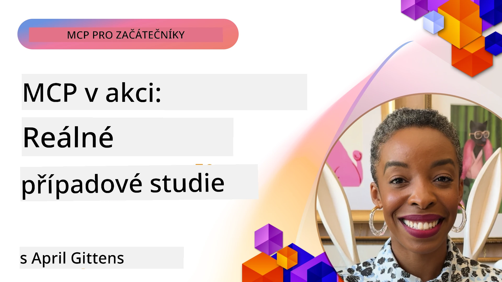

# MCP v praxi: Studie případů z reálného světa

_(Klikněte na obrázek výše pro zhlédnutí videa této lekce)_

Model Context Protocol (MCP) mění způsob, jakým AI aplikace komunikují s daty, nástroji a službami. Tato sekce představuje studie případů z reálného světa, které demonstrují praktické použití MCP v různých podnikovém scénářích.

## Přehled

Tato sekce ukazuje konkrétní příklady implementací MCP a zdůrazňuje, jak organizace využívají tento protokol k řešení složitých obchodních výzev. Studium těchto případů vám poskytne vhled do všestrannosti, škálovatelnosti a praktických výhod MCP v reálných scénářích.

## Klíčové výukové cíle

Studiem těchto případů:

- Pochopíte, jak lze MCP aplikovat k řešení konkrétních obchodních problémů
- Naučíte se o různých integračních vzorech a architektonických přístupech
- Rozpoznáte osvědčené postupy implementace MCP v podnikových prostředích
- Získáte vhled do výzev a řešení potkaných při reálných implementacích
- Identifikujete příležitosti k aplikaci podobných vzorů ve vlastních projektech

## Vybrané studie případů

### 1. [Azure AI Travel Agents – Referenční implementace](./travelagentsample.md)

Tato studie analyzuje komplexní referenční řešení od Microsoftu, které ukazuje, jak postavit multi-agentní aplikaci pro plánování cest s umělou inteligencí za použití MCP, Azure OpenAI a Azure AI Search. Projekt předvádí:

- Orchestrace multi-agentů pomocí MCP
- Integraci podnikových dat s Azure AI Search
- Bezpečnou a škálovatelnou architekturu využívající služby Azure
- Rozšiřitelné nástroje s opakovaně použitelnými MCP komponentami
- Konverzační uživatelský zážitek poháněný Azure OpenAI

Architektura a implementační detaily poskytují cenný vhled do budování složitých multi-agentních systémů s MCP jako vrstvou koordinace.

### 2. [Aktualizace položek Azure DevOps z dat YouTube](./UpdateADOItemsFromYT.md)

Tato studie ukazuje praktické využití MCP pro automatizaci pracovních procesů. Demonstruje, jak lze MCP nástroje použít k:

- Extrakci dat z online platforem (YouTube)
- Aktualizaci pracovních položek v systémech Azure DevOps
- Vytvoření opakovatelných automatizačních workflow
- Integraci dat mezi nesourodými systémy

Tento příklad ilustruje, že i relativně jednoduché implementace MCP mohou přinést významné zvýšení efektivity automatizací rutinních úkolů a zlepšením konzistence dat napříč systémy.

### 3. [Získávání dokumentace v reálném čase pomocí MCP](./docs-mcp/README.md)

Tato studie vás provede připojením Python klienta v konzoli k MCP serveru za účelem získávání a logování aktuální, kontextově uvědomělé Microsoft dokumentace v reálném čase. Naučíte se, jak:

- Připojit se k MCP serveru pomocí Python klienta a oficiální SDK MCP
- Používat streaming HTTP klienty pro efektivní získávání dat v reálném čase
- Volat dokumentační nástroje na serveru a logovat odpovědi přímo do konzole
- Integrovat aktuální Microsoft dokumentaci do svého workflow, aniž byste opustili terminál

Kapitola obsahuje praktické cvičení, minimální funkční ukázkový kód a odkazy na další zdroje pro hlubší studium. Podívejte se na celý průvodce a kód v přiložené kapitole, abyste pochopili, jak MCP může transformovat přístup k dokumentaci a produktivitu vývojářů v konzolových prostředích.

### 4. [Interaktivní generátor studijního plánu – webová aplikace s MCP](./docs-mcp/README.md)

Tato studie ukazuje, jak vytvořit interaktivní webovou aplikaci pomocí Chainlit a Model Context Protocol (MCP) pro generování personalizovaných studijních plánů pro libovolné téma. Uživatelé mohou zadat předmět (např. "certifikace AI-900") a délku studia (např. 8 týdnů), a aplikace poskytne týdenní přehled doporučeného obsahu. Chainlit umožňuje konverzační chatové rozhraní, které zážitek činí poutavým a přizpůsobivým.

- Konverzační webová aplikace poháněná Chainlit
- Uživatelské dotazy pro zadání tématu a délky
- Doporučení obsahu týden po týdnu pomocí MCP
- Adaptivní reakce v reálném čase v chatovém rozhraní

Projekt ukazuje, jak lze konverzační AI a MCP kombinovat k vytváření dynamických výukových nástrojů vedených uživatelem v moderním webovém prostředí.

### 5. [Dokumentace přímo v editoru s MCP serverem ve VS Code](./docs-mcp/README.md)

Tato studie ukazuje, jak přinést Microsoft Learn Docs přímo do vašeho VS Code prostředí pomocí MCP serveru – už žádné přepínání mezi záložkami v prohlížeči! Uvidíte, jak:

- Okamžitě vyhledávat a číst dokumentaci přímo ve VS Code pomocí MCP panelu nebo příkazové palety
- Odkazovat na dokumentaci a vkládat odkazy přímo do README nebo markdown souborů kurzů
- Používat GitHub Copilot a MCP společně k plynulým AI-poháněným dokumentačním a kódovým workflow
- Validovat a vylepšovat dokumentaci s real-time zpětnou vazbou a přesností od Microsoftu
- Integrovat MCP s GitHub workflow pro kontinuální validaci dokumentace

Implementace obsahuje:

- Ukázkovou konfiguraci `.vscode/mcp.json` pro snadné nastavení
- Návody s obrázky zachycujícími práci v editoru
- Tipy na kombinaci Copilot a MCP pro maximální produktivitu

Tento scénář je ideální pro autory kurzů, tvůrce dokumentace a vývojáře, kteří chtějí zůstat soustředění v editoru při práci s dokumentací, Copilotem a validačními nástroji – vše poháněné MCP.

### 6. [Vytvoření APIM MCP serveru](./apimsample.md)

Tato studie poskytuje krok za krokem průvodce, jak vytvořit MCP server pomocí Azure API Management (APIM). Pokrývá:

- Nastavení MCP serveru v Azure API Management
- Zpřístupnění API operací jako MCP nástrojů
- Konfiguraci politik pro řízení rychlosti a bezpečnost
- Testování MCP serveru pomocí Visual Studio Code a GitHub Copilot

Tento příklad ukazuje, jak využít možnosti Azure k vytvoření robustního MCP serveru, který lze použít v různých aplikacích, čímž se zlepší integrace AI systémů s podnikovými API.

### 7. [GitHub MCP Registry – zrychlení integrace agentů](https://github.com/mcp)

Tato studie zkoumá, jak GitHub MCP Registry, spuštěné v září 2025, řeší zásadní problém v ekosystému AI: rozdrobené vyhledávání a nasazení Model Context Protocol (MCP) serverů.

#### Přehled
**MCP Registry** řeší narůstající potíže s roztříštěnými MCP servery napříč repozitáři a registry, což dříve zpomalovalo integraci a zvyšovalo riziko chyb. Tyto servery umožňují AI agentům komunikovat s externími systémy, jako jsou API, databáze a zdroje dokumentace.

#### Definice problému
Vývojáři vytvářející agentní workflow čelili několika výzvám:
- **Špatná dohledatelnost** MCP serverů na různých platformách
- **Duplicitní dotazy na nastavení** rozptýlené na fórech a v dokumentaci
- **Bezpečnostní rizika** z neověřených a nedůvěryhodných zdrojů
- **Nedostatek standardizace** kvality a kompatibility serverů

#### Architektura řešení
GitHub MCP Registry centralizuje důvěryhodné MCP servery s klíčovými vlastnostmi:
- **Instalace jedním kliknutím** přes VS Code pro zjednodušené nastavení
- **Řazení podle signálu nad šumem** dle hvězdiček, aktivity a ověření komunitou
- **Přímá integrace** s GitHub Copilot a dalšími nástroji kompatibilními s MCP
- **Otevřený model příspěvků** umožňující přispívání jak komunitě, tak podnikům

#### Dopad na byznys
Registry přineslo měřitelné zlepšení:
- **Rychlejší onboardování** vývojářů využívajících nástroje jako Microsoft Learn MCP Server, který přímo streamuje oficiální dokumentaci agentům
- **Zvýšená produktivita** díky specializovaným serverům jako `github-mcp-server`, umožňujícím přirozenou jazykovou automatizaci GitHubu (tvorba PR, opakování CI, skenování kódu)
- **Silnější důvěra v ekosystém** díky kurátorským seznamům a transparentním standardům konfigurace

#### Strategická hodnota
Pro odborníky specializující se na správu životního cyklu agentů a reprodukovatelná workflow nabízí MCP Registry:
- **Modulární nasazení agentů** s standardizovanými komponentami
- **Pipeline hodnocení podporované registrem** pro konzistentní testování a validaci
- **Interoperabilitu napříč nástroji** umožňující plynulou integraci různých AI platforem

Tato studie ukazuje, že MCP Registry není pouze adresář – je to základní platforma pro škálovatelnou, reálnou integraci modelů a nasazení agentních systémů.

## Závěr

Těchto sedm komplexních studií případů ukazuje pozoruhodnou všestrannost a praktické využití Model Context Protocol v různorodých reálných scénářích. Od složitých multi-agentních systémů pro plánování cest a správy podnikových API, přes zjednodušené workflow dokumentace až po revoluční GitHub MCP Registry, tyto příklady demonstrují, jak MCP poskytuje standardizovaný, škálovatelný způsob napojení AI systémů na potřebné nástroje, data a služby pro dosahování výjimečné hodnoty.

Studie případů zahrnují mnoho oblastí implementace MCP:
- **Podniková integrace**: Azure API Management a automatizace Azure DevOps
- **Orchestrace multi-agentů**: plánování cest s koordinovanými AI agenty
- **Produktivita vývojářů**: integrace ve VS Code a přístup k dokumentaci v reálném čase
- **Vývoj ekosystému**: GitHub MCP Registry jako základní platforma
- **Vzdělávací aplikace**: interaktivní generátory studijních plánů a konverzační rozhraní

Studium těchto implementací vám poskytne klíčové poznatky o:
- **Architektonických vzorech** pro různé rozsahy a případy použití
- **Implementačních strategiích** vyvažujících funkčnost a udržovatelnost
- **Bezpečnostních a škálovatelných aspektech** pro produkční nasazení
- **Nejlepších postupech** při vývoji MCP serverů a integraci klientů
- **Ekosystémovém myšlení** pro budování propojených AI řešení

Tyto příklady společně ukazují, že MCP není jen teoretický rámec, ale zralý, produkčně připravený protokol umožňující praktická řešení složitých obchodních výzev. Ať už vytváříte jednoduché automatizační nástroje nebo sofistikované multi-agentní systémy, vzory a přístupy zde uvedené poskytují pevný základ pro vaše vlastní projekty MCP.

## Další zdroje

- [Azure AI Travel Agents GitHub Repozitář](https://github.com/Azure-Samples/azure-ai-travel-agents)
- [Azure DevOps MCP Tool](https://github.com/microsoft/azure-devops-mcp)
- [Playwright MCP Tool](https://github.com/microsoft/playwright-mcp)
- [Microsoft Docs MCP Server](https://github.com/MicrosoftDocs/mcp)
- [GitHub MCP Registry – zrychlení integrace agentů](https://github.com/mcp)
- [MCP Community Examples](https://github.com/microsoft/mcp)

## Co dál

- Předchozí: [Modul 8: Nejlepší postupy](../08-BestPractices/README.md)
- Další: [Modul 10: Zjednodušení AI workflow: Vytvoření MCP serveru s AI Toolkit](../10-StreamliningAIWorkflowsBuildingAnMCPServerWithAIToolkit/README.md)

---

<!-- CO-OP TRANSLATOR DISCLAIMER START -->
**Vyloučení odpovědnosti**:  
Tento dokument byl přeložen pomocí AI překladatelské služby [Co-op Translator](https://github.com/Azure/co-op-translator). Přestože usilujeme o přesnost, mějte prosím na paměti, že automatické překlady mohou obsahovat chyby nebo nepřesnosti. Původní dokument v jeho mateřském jazyce by měl být považován za autoritativní zdroj. Pro důležité informace se doporučuje využít profesionální lidský překlad. Nejsme odpovědní za jakékoliv nedorozumění nebo mylné výklady vzniklé použitím tohoto překladu.
<!-- CO-OP TRANSLATOR DISCLAIMER END -->