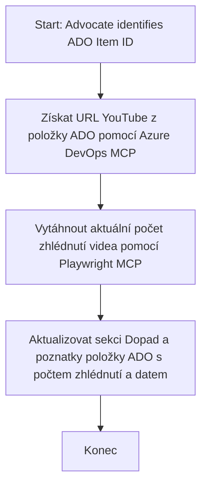

# Případová studie: Aktualizace položek Azure DevOps z dat YouTube pomocí MCP

> **Prohlášení:** Existují online nástroje a reporty, které dokážou automatizovat proces aktualizace položek Azure DevOps s daty z platforem jako YouTube. Následující scénář je poskytnut čistě jako ukázkový případ použití, který ilustruje, jak lze nástroje MCP použít pro úkoly automatizace a integrace.

## Přehled

Tato případová studie demonstruje jeden příklad, jak lze Model Context Protocol (MCP) a jeho nástroje použít k automatizaci procesu aktualizace pracovních položek Azure DevOps (ADO) s informacemi získanými z online platforem, jako je YouTube. Popisovaný scénář je pouze jednou ilustrací širších schopností těchto nástrojů, které lze přizpůsobit mnoha podobným automatizačním potřebám.

V tomto příkladu sleduje Advocate online sezení pomocí položek ADO, kde každá položka obsahuje URL videa YouTube. Využitím nástrojů MCP může Advocate udržovat položky ADO aktuální s nejnovějšími metrikami videí, jako je počet zhlédnutí, opakovatelným a automatizovaným způsobem. Tento přístup lze zobecnit i na jiné případy, kde je potřeba integrovat informace z online zdrojů do ADO nebo jiných systémů.

## Scénář

Advocate je odpovědný za sledování dopadu online sezení a komunitních zapojení. Každé sezení je zaznamenáno jako pracovní položka ADO v projektu 'DevRel' a pracovní položka obsahuje pole pro URL videa YouTube. Pro přesné vykázání dosahu sezení musí Advocate aktualizovat položku ADO o aktuální počet zhlédnutí videa a datum, kdy byla tato informace získána.

## Použité nástroje

- [Azure DevOps MCP](https://github.com/microsoft/azure-devops-mcp): Umožňuje programový přístup a aktualizace pracovních položek ADO přes MCP.
- [Playwright MCP](https://github.com/microsoft/playwright-mcp): Automatizuje akce v prohlížeči pro získání živých dat z webových stránek, jako jsou statistiky videí YouTube.

## Postup krok za krokem

1. **Identifikace položky ADO**: Začít s ID pracovní položky ADO (např. 1234) v projektu 'DevRel'.
2. **Získání URL YouTube**: Pomocí nástroje Azure DevOps MCP načíst URL YouTube z pracovní položky.
3. **Extrahování počtu zhlédnutí**: Pomocí nástroje Playwright MCP přejít na URL YouTube a získat aktuální počet zhlédnutí.
4. **Aktualizace položky ADO**: Zapsat nejnovější počet zhlédnutí a datum získání do sekce 'Dopad a poznatky' pracovní položky ADO pomocí nástroje Azure DevOps MCP.

## Ukázkový prompt

```bash
- Work with the ADO Item ID: 1234
- The project is '2025-Awesome'
- Get the YouTube URL for the ADO item
- Use Playwright to get the current views from the YouTube video
- Update the ADO item with the current video views and the updated date of the information
```

## Mermaid Flowchart


## Technická implementace

- **Orchestrace MCP**: Pracovní tok je řízen serverem MCP, který koordinuje použití nástrojů Azure DevOps MCP a Playwright MCP.
- **Automatizace**: Proces může být spuštěn manuálně nebo naplánován k pravidelnému běhu pro udržení aktuálnosti položek ADO.
- **Rozšiřitelnost**: Stejný vzor lze rozšířit pro aktualizaci položek ADO s jinými online metrikami (např. počet lajků, komentářů) nebo z jiných platforem.

## Výsledky a dopad

- **Efektivita**: Snižuje manuální práci Advocates automatizací získávání a aktualizace metrik videí.
- **Přesnost**: Zajišťuje, že položky ADO obsahují nejaktuálnější data dostupná z online zdrojů.
- **Opakovatelnost**: Poskytuje znovupoužitelný pracovní tok pro podobné scénáře zahrnující jiné datové zdroje nebo metriky.

## Reference

- [Azure DevOps MCP](https://github.com/microsoft/azure-devops-mcp)
- [Playwright MCP](https://github.com/microsoft/playwright-mcp)
- [Model Context Protocol (MCP)](https://modelcontextprotocol.io/)

## Co dál

- Zpět na: [Přehled případových studií](./README.md)
- Další: [Získávání dokumentace v reálném čase pomocí MCP](./docs-mcp/README.md)

---

<!-- CO-OP TRANSLATOR DISCLAIMER START -->
**Prohlášení o vyloučení odpovědnosti**:  
Tento dokument byl přeložen pomocí služby AI překladatele [Co-op Translator](https://github.com/Azure/co-op-translator). Ačkoli usilujeme o přesnost, mějte prosím na paměti, že automatické překlady mohou obsahovat chyby nebo nepřesnosti. Původní dokument v jeho mateřském jazyce by měl být považován za autoritativní zdroj. Pro zásadní informace se doporučuje profesionální lidský překlad. Nejsme odpovědní za žádná nedorozumění nebo chybná vyložení vyplývající z použití tohoto překladu.
<!-- CO-OP TRANSLATOR DISCLAIMER END -->